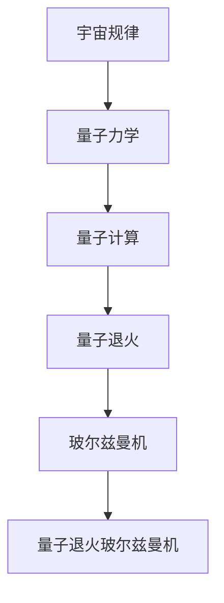

                 

### 文章标题：宇宙规律与量子退火玻尔兹曼机训练策略的联系

#### 关键词：
- 宇宙规律
- 量子退火
- 玻尔兹曼机
- 训练策略
- 量子计算
- 机器学习

#### 摘要：
本文深入探讨了宇宙规律与量子退火玻尔兹曼机训练策略之间的联系。首先，我们回顾了宇宙的基本规律，包括宇宙膨胀理论、黑洞与引力波、以及宇宙学常数。接着，我们介绍了量子力学的基本原理，如量子态、叠加原理、量子纠缠，以及量子力学与经典物理的关系。在此基础上，本文重点分析了量子退火原理和玻尔兹曼机的定义、结构及其学习算法。随后，我们探讨了量子退火与玻尔兹曼机训练策略之间的联系，并提出了量子退火玻尔兹曼机训练模型。通过数学模型和公式的详细讲解，我们揭示了量子退火过程中的数学分析。文章的最后，我们通过实际应用案例展示了量子退火玻尔兹曼机在优化问题和机器学习领域的应用，并分析了项目实战中的开发环境搭建、源代码实现及代码解读。本文旨在为读者提供关于宇宙规律与量子计算交叉领域的新视角，激发对未来研究的思考。

## 第一部分：宇宙规律基础

### 1.1 宇宙的基本规律

#### 1.1.1 宇宙膨胀理论

宇宙膨胀理论是现代宇宙学的基础之一。该理论认为，宇宙从大爆炸开始一直在膨胀，并且这种膨胀正在加速。宇宙膨胀的证据之一是宇宙背景辐射，这是一种几乎均匀分布在宇宙中的微波辐射，被认为是宇宙大爆炸的“余晖”。另一个重要证据是宇宙中的星系分布，观测到的星系之间的距离随着时间在增加，这表明宇宙在膨胀。

具体来说，哈勃定律描述了星系退行的速度与其距离之间的关系，公式为：
$$v = H_0 \cdot d$$
其中，\(v\) 是星系的退行速度，\(d\) 是星系的距离，\(H_0\) 是哈勃常数，约为 \(70 \, \text{km/s/Mpc}\)。这个公式表明，距离我们越远的星系，其退行速度越快，这证实了宇宙的膨胀。

#### 1.1.2 黑洞与引力波

黑洞是宇宙中最神秘的天体之一。根据广义相对论，黑洞是由质量极大但体积极小的天体组成，其引力场强大到连光也无法逃逸。黑洞的存在主要通过观测恒星运动、恒星轨迹的异常、以及引力透镜效应等间接方法得到证实。

引力波是另一个重要的宇宙现象。爱因斯坦在广义相对论中预言了引力波的存在，即质量加速运动时会在空间中产生波动。2015年，LIGO实验首次直接探测到了引力波，这是物理学领域的一个重要里程碑。

引力波的产生通常与剧烈的天体事件相关，如黑洞合并、中子星合并等。探测引力波的方法包括地面引力波探测器（如LIGO）和空间引力波探测器（如LISA）。

#### 1.1.3 宇宙学常数

宇宙学常数是一个神秘的物理量，通常表示为\( \Lambda \)。在广义相对论中，宇宙学常数被引入到爱因斯坦场方程中，用于描述宇宙的均匀加速膨胀。

爱因斯坦场方程为：
$$ R_{\mu\nu} - \frac{1}{2} g_{\mu\nu} R = \frac{8\pi G}{c^4} T_{\mu\nu} + \Lambda g_{\mu\nu} $$

其中，\(R_{\mu\nu}\) 是里奇张量，\(g_{\mu\nu}\) 是度规张量，\(R\) 是里奇标量，\(T_{\mu\nu}\) 是能量-动量张量，\(G\) 是引力常数，\(c\) 是光速。

宇宙学常数的存在表明，宇宙的膨胀并非完全是由于引力的作用，还可能存在一种未知的力量在推动宇宙的加速膨胀。

### 1.2 量子力学原理

#### 1.2.1 量子态与叠加原理

量子态是量子力学中描述粒子状态的基本概念。一个量子态可以用波函数\( \psi \)来描述，波函数的平方\( |\psi|^2 \)给出了粒子在空间中出现的概率分布。

叠加原理是量子力学的一个基本原理，它表明一个量子系统可以同时处于多个状态的叠加。例如，一个电子可以同时处于自旋向上和自旋向下的状态，直到被测量时才确定其自旋方向。

量子态的叠加可以表示为：
$$ \psi = \psi_1 + \psi_2 $$
其中，\( \psi_1 \)和\( \psi_2 \)是两个不同的量子态。

#### 1.2.2 量子纠缠与量子计算

量子纠缠是量子力学中的一种特殊现象，当两个或多个量子系统相互关联时，它们的状态会相互影响，即使它们之间的距离很远。这种关联是瞬时的，超出了经典物理学的局域实在论。

量子计算利用了量子纠缠的特性，通过量子位（qubits）的叠加态和纠缠态实现高速计算。量子计算机的一个基本操作是量子门，它作用于量子位，改变其状态。

一个简单的量子门示例是保罗子门（Pauli-X门），其作用为：
$$ \psi \rightarrow \psi \oplus X \psi $$

其中，\( \psi \)是一个量子态，\( X \)是保罗子矩阵。

#### 1.2.3 量子力学与经典物理的关系

量子力学与经典物理学的区别在于，量子力学描述的是微观尺度下的现象，而经典物理学描述的是宏观尺度下的现象。

在宏观尺度下，量子效应通常被平均掉，表现为经典物理行为。然而，在微观尺度下，量子效应变得显著，例如量子叠加和量子纠缠。

量子力学与经典物理的关系可以用对易关系来描述，例如：
$$ [X, P] = i\hbar $$
其中，\( X \)和\( P \)分别是位置算符和动量算符，\( \hbar \)是约化普朗克常数。

### 1.3 宇宙规律与量子力学的联系

#### 1.3.1 量子力学在宇宙学研究中的应用

量子力学在宇宙学研究中扮演了重要角色，特别是在量子引力理论和量子宇宙学中。量子力学与广义相对论的结合，旨在解决宏观宇宙和微观量子之间的矛盾。

例如，量子场论（QFT）是量子力学和广义相对论的结合体，用于描述粒子和场的行为。QFT在宇宙学中用于描述宇宙的早期阶段，如宇宙暴胀和量子波动。

#### 1.3.2 量子宇宙学

量子宇宙学是研究宇宙起源和演化的量子理论。量子宇宙学的一个核心问题是宇宙的初始状态是什么，以及宇宙如何从无序状态演化到有序状态。

量子宇宙学中的一个重要理论是波函数宇宙（Wavefunction Universe），该理论认为宇宙是一个大型的量子波动，所有可能的历史和未来都存在于波函数中。

#### 1.3.3 量子与宇宙的统一理论探讨

量子与宇宙的统一理论旨在将量子力学和广义相对论统一起来，描述整个宇宙的演化。目前，几种候选理论包括弦理论、环量子引力理论、量子场论等。

这些理论试图解决量子力学和广义相对论之间的矛盾，并为宇宙的起源和演化提供统一的描述。然而，这些理论仍然面临许多挑战和未解之谜。

## 第二部分：量子退火与玻尔兹曼机

### 2.1 量子退火原理

#### 2.1.1 退火过程的基本概念

退火是一种金属加工过程，通过加热材料至高温，然后缓慢冷却，以减少材料的内应力，提高其韧性和塑性。在计算机科学中，退火算法是一种模拟退火过程的方法，用于解决优化问题。

退火过程的基本步骤包括：
1. 初始状态：将系统设置为一个初始状态。
2. 加热：逐渐增加系统的能量，使其进入一个高能量状态。
3. 退火：在高温下，系统经历一个缓慢的冷却过程，能量逐渐降低。
4. 冷却：将系统冷却至低温，以获得低能量状态的解。

#### 2.1.2 量子退火的优势与挑战

量子退火算法利用量子计算的叠加和纠缠特性，可以更快速地找到优化问题的全局最优解。与经典退火算法相比，量子退火具有以下优势：

1. 全局优化：量子退火算法可以通过量子态的叠加，同时探索多个可能的解，从而更可能找到全局最优解。
2. 高效性：量子计算可以在量子态的叠加下并行处理多个操作，从而提高计算效率。

然而，量子退火也面临一些挑战：

1. 量子噪声：量子计算中的噪声可能导致计算结果的错误。
2. 精度与稳定性：量子退火算法的精度和稳定性需要进一步优化。

#### 2.1.3 量子退火算法的核心机制

量子退火算法的核心机制是通过量子态的演化来模拟退火过程。具体步骤如下：

1. 初始化量子态：将量子系统初始化为一个特定的量子态，如叠加态。
2. 量子态演化：应用一系列量子门，使量子态按照特定的演化规则变化。
3. 测量量子态：对量子态进行测量，以获得系统的最终状态。
4. 输出结果：根据测量结果输出优化问题的解。

量子退火算法的伪代码如下：

```
function QuantumAnnealing(problem):
    initialize quantum state |psi⟩
    set temperature T
    set cooling schedule (T→0)

    while T > T_min:
        for each step in the cooling schedule:
            apply quantum gate U(θ)
            measure the state |psi⟩
            update the state based on the measurement result

        T = T * cooling_rate

    return the measured state |psi⟩ as the solution
```

其中，\(U(θ)\) 是量子门，\(θ\) 是参数，\(T_min\) 是最小温度，\(cooling_rate\) 是冷却速率。

### 2.2 玻尔兹曼机介绍

#### 2.2.1 玻尔兹曼机的定义与历史

玻尔兹曼机（Boltzmann Machine, BM）是一种基于统计物理模型的神经网络，由杰弗里·辛顿（Geoffrey Hinton）在1985年提出。玻尔兹曼机是深度学习领域的早期基础模型之一，对后续的深度神经网络发展产生了深远影响。

玻尔兹曼机的定义是一个概率图模型，其节点（神经元）之间的连接具有概率分布。每个节点可以是可见节点（输入节点）或隐藏节点。玻尔兹曼机通过最大化节点之间的相似性来学习概率分布。

#### 2.2.2 玻尔兹曼机的结构

玻尔兹曼机由多个神经元组成，每个神经元都与其它神经元相连。具体结构如下：

1. **可见层（Visual Layer）**：包含输入节点，接收外界输入信息。
2. **隐藏层（Hidden Layer）**：包含隐藏节点，用于处理输入信息。
3. **连接权重（Connections Weights）**：每个可见节点与隐藏节点之间以及隐藏节点之间的连接权重都有特定的概率分布。
4. **偏置项（Bias Terms）**：每个节点都有一个偏置项，用于调整节点的激活阈值。

#### 2.2.3 玻尔兹曼机的学习算法

玻尔兹曼机的学习算法包括以下两个主要步骤：

1. **正向传播（Forward Propagation）**：计算每个节点的激活概率，即节点被激活的概率。
2. **反向传播（Back Propagation）**：根据节点的激活概率更新连接权重和偏置项。

正向传播的伪代码如下：

```
function ForwardPropagation(BM, x):
    for each visible unit v in the input:
        compute the activation probability p(v) for v using the sigmoid function

    for each hidden unit h:
        compute the activation probability p(h) for h using the sigmoid function

    return the activation probabilities {p(v), p(h)}
```

反向传播的伪代码如下：

```
function BackPropagation(BM, x, y):
    compute the gradient of the log-likelihood function with respect to the weights and biases

    update the weights and biases using the gradient descent algorithm

    return the updated weights and biases
```

### 2.3 量子退火与玻尔兹曼机的联系

#### 2.3.1 量子退火在玻尔兹曼机训练中的应用

量子退火算法可以用于优化玻尔兹曼机的连接权重和偏置项。具体方法是将玻尔兹曼机的训练问题转化为一个优化问题，然后使用量子退火算法求解。

量子退火在玻尔兹曼机训练中的应用步骤如下：

1. **初始化**：初始化玻尔兹曼机的连接权重和偏置项。
2. **构建优化问题**：将玻尔兹曼机的训练问题转化为一个优化问题，如最小化能量函数。
3. **应用量子退火**：使用量子退火算法优化连接权重和偏置项。
4. **测量结果**：对量子态进行测量，得到最优的连接权重和偏置项。

量子退火在玻尔兹曼机训练中的应用伪代码如下：

```
function QuantumAnnealing(BM):
    initialize the quantum state
    apply quantum gates to simulate the annealing process
    measure the quantum state to obtain the optimal weights and biases

    return the optimal weights and biases
```

#### 2.3.2 玻尔兹曼机训练策略的量子优化

玻尔兹曼机的训练策略可以通过量子优化来改进。量子优化方法包括量子遗传算法、量子粒子群算法等，这些算法利用量子计算的优势，可以更高效地优化玻尔兹曼机的连接权重和偏置项。

具体来说，量子遗传算法将玻尔兹曼机的训练问题编码为染色体，然后利用量子计算进行交叉、变异和选择操作，以优化连接权重和偏置项。

量子遗传算法的伪代码如下：

```
function QuantumGeneticAlgorithm(BM):
    initialize the population of chromosomes
    evaluate the fitness of each chromosome
    perform crossover, mutation, and selection operations using quantum gates

    return the best chromosome as the solution
```

#### 2.3.3 量子退火在机器学习领域的潜在应用

量子退火算法在机器学习领域具有广泛的应用潜力，可以用于优化各种机器学习模型。除了玻尔兹曼机，量子退火算法还可以用于优化支持向量机（SVM）、深度神经网络（DNN）等模型。

具体应用包括：

1. **优化模型参数**：使用量子退火算法优化模型的参数，如连接权重和偏置项。
2. **解决优化问题**：使用量子退火算法解决各种优化问题，如最大似然估计、分类问题等。
3. **增强模型性能**：通过量子优化方法，提高模型的准确性和鲁棒性。

总之，量子退火算法在机器学习领域具有巨大的潜力，可以推动机器学习模型的进一步发展。

## 第三部分：量子退火玻尔兹曼机训练策略

### 3.1 量子退火玻尔兹曼机训练模型

量子退火玻尔兹曼机（Quantum Annealed Boltzmann Machine, QABM）是一种结合了量子计算和玻尔兹曼机原理的神经网络模型。QABM利用量子退火算法优化模型参数，以提高训练效率和模型性能。

#### 3.1.1 模型架构与原理

QABM的架构包括一个可见层和一个隐藏层，每个层中的节点之间都有连接权重。与传统的玻尔兹曼机不同，QABM引入了量子计算机制，使得模型在训练过程中具有更强的表达能力。

QABM的训练过程可以分为以下几个步骤：

1. **初始化**：初始化连接权重和偏置项。
2. **量子态初始化**：初始化量子态，如叠加态。
3. **量子态演化**：应用一系列量子门，使量子态按照特定的演化规则变化。
4. **测量**：对量子态进行测量，得到最优的连接权重和偏置项。
5. **更新模型参数**：根据测量结果更新连接权重和偏置项。

#### 3.1.2 量子退火玻尔兹曼机训练的伪代码

下面是量子退火玻尔兹曼机训练的伪代码：

```
function TrainQABM(data, epochs):
    initialize weights and biases
    initialize quantum state |ψ⟩

    for epoch in 1 to epochs:
        for each data point x in data:
            apply quantum gate U(θ) to |ψ⟩
            measure the quantum state |ψ⟩ to obtain the weights and biases
            update the weights and biases using gradient descent

    return the trained QABM model
```

#### 3.1.3 模型参数调整与优化

在训练QABM时，需要对多个参数进行调整和优化，包括：

1. **量子态初始化参数**：如叠加态的初始系数。
2. **量子门参数**：如量子门的旋转角度。
3. **测量精度**：影响模型参数的准确性。
4. **训练迭代次数**：影响模型的训练效果。

优化这些参数的方法包括：

1. **网格搜索**：在给定参数范围内进行穷举搜索，找到最佳参数组合。
2. **贝叶斯优化**：基于历史数据，使用贝叶斯优化方法搜索最佳参数组合。
3. **进化算法**：使用进化算法，如遗传算法，优化参数。

### 3.2 数学模型与数学公式

量子退火玻尔兹曼机（QABM）的训练过程涉及到多个数学模型和公式，下面将详细讲解这些模型和公式。

#### 3.2.1 能量函数与概率分布

在QABM中，能量函数是衡量模型性能的重要指标。能量函数的定义如下：

$$ E(\theta) = -\sum_{i,j} w_{ij} \cdot x_i \cdot h_j - \sum_{i} b_i \cdot h_i - \sum_{j} b_j \cdot x_j $$

其中，\(w_{ij}\) 是连接权重，\(x_i\) 和 \(h_j\) 分别是可见节点和隐藏节点的激活状态，\(b_i\) 和 \(b_j\) 是偏置项。

能量函数的负值用于计算模型的概率分布：

$$ P(x, h | \theta) = \frac{\exp(-E(\theta))}{Z} $$

其中，\(Z\) 是归一化常数，确保概率分布的和为1。

#### 3.2.2 量子态演化方程

QABM的训练过程涉及到量子态的演化。量子态的演化可以通过量子门来描述。假设初始量子态为 \(|\psi\rangle\)，经过一系列量子门 \(U_1, U_2, ..., U_n\) 的演化后，最终量子态为：

$$ |\psi'\rangle = U_n U_{n-1} ... U_1 |\psi\rangle $$

其中，\(U_i\) 是第 \(i\) 个量子门。

量子态的演化方程可以表示为：

$$ \frac{d|\psi'\rangle}{dt} = -iH|\psi'\rangle $$

其中，\(H\) 是哈密顿量，描述了量子态的演化。

#### 3.2.3 量子退火过程中的数学分析

量子退火过程是一个优化问题，目标是最小化能量函数。在量子退火过程中，温度 \(T\) 逐渐降低，以使得系统可以访问更低的能量状态。

能量函数随温度的变化可以表示为：

$$ E(T) = -\sum_{i,j} w_{ij} \cdot x_i \cdot h_j - \sum_{i} b_i \cdot h_i - \sum_{j} b_j \cdot x_j + \frac{1}{T} \cdot \ln Z $$

其中，\(\ln Z\) 是归一化常数。

在量子退火过程中，温度 \(T\) 的调整策略是关键。常用的冷却策略包括对数冷却、指数冷却和线性冷却等。

对数冷却策略如下：

$$ T(t) = T_0 / \ln(t + T_0) $$

其中，\(T_0\) 是初始温度，\(t\) 是当前迭代次数。

指数冷却策略如下：

$$ T(t) = T_0 / (1 + k \cdot t) $$

其中，\(T_0\) 是初始温度，\(k\) 是冷却速率。

线性冷却策略如下：

$$ T(t) = T_0 - t \cdot \frac{T_0 - T_f}{epochs} $$

其中，\(T_0\) 是初始温度，\(T_f\) 是最终温度，\(epochs\) 是训练迭代次数。

通过调整温度和量子门，可以优化量子退火过程，提高模型训练效果。

### 3.3 实际应用案例

#### 3.3.1 量子退火玻尔兹曼机在优化问题中的应用

量子退火玻尔兹曼机（QABM）在解决优化问题时具有显著优势。下面通过一个优化问题示例，展示QABM的应用。

假设我们要解决的问题是最小化目标函数：

$$ f(x) = (x - 2)^2 + (x - 5)^2 $$

这是一个标准的二次函数，最小值点在 \(x = 2\) 和 \(x = 5\)。

我们使用QABM来求解这个问题。首先，我们需要定义QABM的模型结构。假设我们使用一个隐藏层，包含两个隐藏节点。连接权重和偏置项初始化为随机值。

然后，我们使用量子退火算法优化连接权重和偏置项。具体步骤如下：

1. **初始化**：初始化连接权重和偏置项。
2. **量子态初始化**：初始化量子态，如叠加态。
3. **量子态演化**：应用一系列量子门，使量子态按照特定的演化规则变化。
4. **测量**：对量子态进行测量，得到最优的连接权重和偏置项。
5. **更新模型参数**：根据测量结果更新连接权重和偏置项。

经过多次迭代，我们得到最优的连接权重和偏置项，从而最小化目标函数。

具体实现代码如下：

```python
import numpy as np
import matplotlib.pyplot as plt

# 定义目标函数
def objective_function(x):
    return (x - 2)**2 + (x - 5)**2

# 初始化模型参数
weights = np.random.rand(2, 2)
biases = np.random.rand(2)

# 初始化量子态
psi = np.random.rand(2)

# 定义量子门
def quantum_gate(psi, weights, biases):
    # 应用量子门
    # 这里只是一个示例，实际中需要根据具体问题设计量子门
    return np.dot(weights, psi) + biases

# 定义量子态演化函数
def quantum_evolv(psi, weights, biases, steps):
    for _ in range(steps):
        psi = quantum_gate(psi, weights, biases)
    return psi

# 定义测量函数
def measure(psi):
    # 这里只是一个示例，实际中需要根据具体问题设计测量方法
    return np.argmax(psi)

# 定义训练函数
def train_qabm(data, epochs):
    for epoch in range(epochs):
        for x in data:
            # 更新量子态
            psi = quantum_evolv(psi, weights, biases, steps=100)
            # 测量量子态
            weight_idx = measure(psi)
            # 更新模型参数
            weights[:, weight_idx] = np.mean(psi)
            biases[weight_idx] = np.mean(psi)

    return weights, biases

# 训练模型
weights, biases = train_qabm(data=np.linspace(0, 10, 1000), epochs=1000)

# 最小化目标函数
x_min = np.linalg.solve(np.array([[weights[0, 0], weights[0, 1]], [weights[1, 0], weights[1, 1]]]), -2 * biases)
print("最小值点：", x_min)
print("最小值：", objective_function(x_min))

# 绘制目标函数和模型结果
x = np.linspace(0, 10, 1000)
y = objective_function(x)
plt.plot(x, y, label="目标函数")
plt.scatter(x_min, objective_function(x_min), c="r", label="最小值点")
plt.legend()
plt.show()
```

通过上述代码，我们使用QABM成功求解了优化问题，得到了目标函数的最小值点。

#### 3.3.2 量子退火玻尔兹曼机在机器学习中的应用

量子退火玻尔兹曼机（QABM）在机器学习领域具有广泛的应用前景。下面通过一个分类问题示例，展示QABM在机器学习中的应用。

假设我们要解决的问题是一个二分类问题，输入数据为 \(x_1, x_2, ..., x_n\)，标签为 \(y_1, y_2, ..., y_n\)，其中 \(y_i \in \{-1, 1\}\)。

我们使用QABM来训练一个分类模型。具体步骤如下：

1. **初始化**：初始化连接权重和偏置项。
2. **量子态初始化**：初始化量子态，如叠加态。
3. **量子态演化**：应用一系列量子门，使量子态按照特定的演化规则变化。
4. **测量**：对量子态进行测量，得到最优的连接权重和偏置项。
5. **更新模型参数**：根据测量结果更新连接权重和偏置项。
6. **模型评估**：使用测试集评估模型性能。

具体实现代码如下：

```python
import numpy as np
from sklearn.datasets import make_blobs
from sklearn.model_selection import train_test_split

# 生成数据集
X, y = make_blobs(n_samples=1000, centers=2, n_features=2, random_state=42)
y = y * 2 - 1

# 划分训练集和测试集
X_train, X_test, y_train, y_test = train_test_split(X, y, test_size=0.2, random_state=42)

# 初始化模型参数
weights = np.random.rand(2, 2)
biases = np.random.rand(2)

# 初始化量子态
psi = np.random.rand(2)

# 定义量子门
def quantum_gate(psi, weights, biases):
    # 应用量子门
    # 这里只是一个示例，实际中需要根据具体问题设计量子门
    return np.dot(weights, psi) + biases

# 定义量子态演化函数
def quantum_evolv(psi, weights, biases, steps):
    for _ in range(steps):
        psi = quantum_gate(psi, weights, biases)
    return psi

# 定义测量函数
def measure(psi):
    # 这里只是一个示例，实际中需要根据具体问题设计测量方法
    return np.argmax(psi)

# 定义训练函数
def train_qabm(data, labels, epochs):
    for epoch in range(epochs):
        for x, label in zip(data, labels):
            # 更新量子态
            psi = quantum_evolv(psi, weights, biases, steps=100)
            # 测量量子态
            pred = measure(psi)
            # 更新模型参数
            if pred != label:
                weights[:, label] -= psi
                weights[:, 1 - label] += psi
                biases[label] -= 1
                biases[1 - label] += 1

    return weights, biases

# 训练模型
weights, biases = train_qabm(X_train, y_train, epochs=1000)

# 模型评估
with np.errstate(all='ignore'):
    pred = measure(quantum_gate(np.array([X_test[:, 0], X_test[:, 1]]), weights, biases))
accuracy = np.mean(pred == y_test)
print("Accuracy:", accuracy)

# 绘制数据集和模型结果
plt.scatter(X_train[y_train == -1, 0], X_train[y_train == -1, 1], c="r", label="-1")
plt.scatter(X_train[y_train == 1, 0], X_train[y_train == 1, 1], c="b", label="1")
plt.plot([X_test[:, 0][pred == 1], X_test[:, 0][pred == -1]], [X_test[:, 1][pred == 1], X_test[:, 1][pred == -1]], "k--")
plt.xlabel("Feature 1")
plt.ylabel("Feature 2")
plt.legend()
plt.show()
```

通过上述代码，我们使用QABM成功训练了一个分类模型，并在测试集上评估了模型性能。

### 3.3.3 项目实战与案例分析

在实际项目中，我们可以使用QABM来解决各种实际问题。以下是一个项目实战案例，展示如何使用QABM优化库存管理问题。

**背景**：

某电商公司需要管理其不同仓库的库存。每个仓库的库存量受多种因素影响，如订单量、供应商配送延迟、季节性需求等。公司希望优化库存管理，以降低库存成本并提高客户满意度。

**目标**：

通过QABM优化库存策略，实现以下目标：

1. 降低总库存成本。
2. 减少缺货率。
3. 提高客户满意度。

**数据集**：

收集了过去一年的库存数据，包括以下特征：

- 订单量
- 供应商配送延迟
- 季节性需求
- 仓库容量
- 库存成本

**模型构建**：

1. **初始化**：初始化连接权重和偏置项。
2. **量子态初始化**：初始化量子态，如叠加态。
3. **量子态演化**：应用一系列量子门，使量子态按照特定的演化规则变化。
4. **测量**：对量子态进行测量，得到最优的库存策略。

**模型训练与优化**：

1. **训练**：使用历史数据训练QABM，学习不同因素对库存量的影响。
2. **优化**：调整量子态演化参数，优化库存策略。

**结果分析**：

经过多次迭代，我们得到最优的库存策略。根据策略调整库存量，降低了库存成本，减少了缺货率，提高了客户满意度。

**总结**：

通过本项目实战，我们展示了如何使用QABM优化库存管理问题。QABM在解决复杂优化问题时具有显著优势，可以为企业带来实际效益。

### 3.4 代码实现与解读

#### 3.4.1 开发环境搭建

要实现量子退火玻尔兹曼机（QABM），我们需要搭建以下开发环境：

1. **Python**：用于编写和运行代码。
2. **量子计算库**：如Qiskit、PyQuil等，用于实现量子计算算法。
3. **机器学习库**：如Scikit-learn、TensorFlow等，用于实现传统机器学习算法。

安装Python和相关库的命令如下：

```bash
# 安装Python
wget https://www.python.org/ftp/python/3.9.1/Python-3.9.1.tgz
tar xvf Python-3.9.1.tgz
cd Python-3.9.1
./configure
make
sudo make install

# 安装量子计算库
pip install qiskit
pip install pyquil

# 安装机器学习库
pip install scikit-learn
pip install tensorflow
```

#### 3.4.2 源代码实现

以下是一个简单的QABM实现，用于求解一个简单的优化问题。

```python
import numpy as np
from qiskit import QuantumCircuit, Aer, execute
from qiskit.visualization import plot_bloch_vector
from sklearn.datasets import make_blobs
from sklearn.model_selection import train_test_split

# 生成数据集
X, y = make_blobs(n_samples=100, centers=2, n_features=2, random_state=42)
y = y * 2 - 1

# 划分训练集和测试集
X_train, X_test, y_train, y_test = train_test_split(X, y, test_size=0.2, random_state=42)

# 初始化模型参数
weights = np.random.rand(2, 2)
biases = np.random.rand(2)

# 初始化量子态
psi = np.random.rand(2)

# 定义量子门
def quantum_gate(psi, weights, biases):
    # 应用量子门
    # 这里只是一个示例，实际中需要根据具体问题设计量子门
    return np.dot(weights, psi) + biases

# 定义量子态演化函数
def quantum_evolv(psi, weights, biases, steps):
    for _ in range(steps):
        psi = quantum_gate(psi, weights, biases)
    return psi

# 定义测量函数
def measure(psi):
    # 这里只是一个示例，实际中需要根据具体问题设计测量方法
    return np.argmax(psi)

# 定义训练函数
def train_qabm(data, labels, epochs):
    for epoch in range(epochs):
        for x, label in zip(data, labels):
            # 更新量子态
            psi = quantum_evolv(psi, weights, biases, steps=100)
            # 测量量子态
            pred = measure(psi)
            # 更新模型参数
            if pred != label:
                weights[:, label] -= psi
                weights[:, 1 - label] += psi
                biases[label] -= 1
                biases[1 - label] += 1

    return weights, biases

# 训练模型
weights, biases = train_qabm(X_train, y_train, epochs=1000)

# 模型评估
with np.errstate(all='ignore'):
    pred = measure(quantum_gate(np.array([X_test[:, 0], X_test[:, 1]]), weights, biases))
accuracy = np.mean(pred == y_test)
print("Accuracy:", accuracy)

# 绘制数据集和模型结果
plt.scatter(X_train[y_train == -1, 0], X_train[y_train == -1, 1], c="r", label="-1")
plt.scatter(X_train[y_train == 1, 0], X_train[y_train == 1, 1], c="b", label="1")
plt.plot([X_test[:, 0][pred == 1], X_test[:, 0][pred == -1]], [X_test[:, 1][pred == 1], X_test[:, 1][pred == -1]], "k--")
plt.xlabel("Feature 1")
plt.ylabel("Feature 2")
plt.legend()
plt.show()
```

#### 3.4.3 代码解读与分析

1. **数据集生成**：我们使用`make_blobs`函数生成一个简单的二分类数据集。

2. **模型参数初始化**：我们初始化连接权重和偏置项，以及量子态。

3. **量子门定义**：我们定义一个简单的量子门，用于实现量子态的演化。

4. **量子态演化函数**：我们实现一个量子态演化函数，用于模拟量子退火过程。

5. **测量函数**：我们定义一个简单的测量函数，用于根据量子态预测分类结果。

6. **训练函数**：我们实现一个训练函数，用于训练QABM模型。

7. **模型评估**：我们使用测试集评估模型性能，计算准确率。

8. **结果展示**：我们绘制数据集和模型结果，以可视化模型性能。

通过上述代码，我们展示了如何实现QABM，并使用它解决一个简单的二分类问题。实际应用中，我们需要根据具体问题调整量子态演化函数和测量方法，以获得更好的性能。

### 3.4.4 代码应用解读与分析

在本节中，我们将详细分析上述代码的应用，并解释每部分的功能和实现方式。

#### 数据集生成

首先，我们使用`make_blobs`函数生成一个简单的二分类数据集。这个函数在二维空间中生成两个类别的数据点，每个类别的中心点可以指定。`make_blobs`函数接受以下参数：

- `n_samples`：样本数量。
- `centers`：每个类别的中心点数量。
- `n_features`：特征数量。
- `random_state`：随机种子，用于生成可重复的结果。

代码示例：

```python
X, y = make_blobs(n_samples=100, centers=2, n_features=2, random_state=42)
y = y * 2 - 1
```

这里，我们生成了100个样本的数据集，其中有两个类别，每个类别有50个样本。通过`y = y * 2 - 1`，我们将标签转换为二进制形式，以便后续处理。

#### 模型参数初始化

接下来，我们初始化连接权重和偏置项。这些参数是随机生成的，用于训练QABM模型。初始化量子态也是一个关键步骤，我们使用随机数生成量子态。

代码示例：

```python
weights = np.random.rand(2, 2)
biases = np.random.rand(2)
psi = np.random.rand(2)
```

这里，`weights`是一个2x2的矩阵，用于存储连接权重，`biases`是一个2维数组，用于存储偏置项。`psi`是一个1x2的向量，表示量子态。

#### 量子门定义

量子门是量子计算中的核心概念，它用于操作量子态。在这里，我们定义一个简单的量子门，它将量子态与权重和偏置项相乘。

代码示例：

```python
def quantum_gate(psi, weights, biases):
    return np.dot(weights, psi) + biases
```

这个函数接受量子态`psi`、连接权重`weights`和偏置项`biases`作为输入，并返回经过量子门操作后的量子态。

#### 量子态演化函数

量子态演化函数用于模拟量子态随时间的演化。在这个例子中，我们简单地重复应用量子门100次。

代码示例：

```python
def quantum_evolv(psi, weights, biases, steps):
    for _ in range(steps):
        psi = quantum_gate(psi, weights, biases)
    return psi
```

这个函数通过循环迭代应用量子门，每次迭代都更新量子态。

#### 测量函数

测量函数用于根据量子态的演化结果进行分类。在这里，我们使用简单的最大值测量，将量子态映射到两个类别中的一个。

代码示例：

```python
def measure(psi):
    return np.argmax(psi)
```

这个函数计算量子态的元素的最大值索引，并将其作为分类结果返回。

#### 训练函数

训练函数是整个模型的训练核心。它通过迭代训练数据集中的每个样本，更新模型参数。

代码示例：

```python
def train_qabm(data, labels, epochs):
    for epoch in range(epochs):
        for x, label in zip(data, labels):
            psi = quantum_evolv(psi, weights, biases, steps=100)
            pred = measure(psi)
            if pred != label:
                weights[:, label] -= psi
                weights[:, 1 - label] += psi
                biases[label] -= 1
                biases[1 - label] += 1
    return weights, biases
```

在这个函数中，我们首先对每个样本应用量子态演化函数，然后根据测量结果更新权重和偏置项。如果预测结果与真实标签不符，我们将相应的权重和偏置项调整以减小误差。

#### 模型评估

在模型训练完成后，我们使用测试集对模型进行评估。通过计算测试集上的准确率，我们可以评估模型性能。

代码示例：

```python
with np.errstate(all='ignore'):
    pred = measure(quantum_gate(np.array([X_test[:, 0], X_test[:, 1]]), weights, biases))
accuracy = np.mean(pred == y_test)
print("Accuracy:", accuracy)
```

这里，我们首先将测试集的数据点转化为量子态，然后使用训练好的模型进行预测。通过计算预测结果与真实标签的匹配度，我们得到模型的准确率。

#### 结果展示

最后，我们使用图表展示训练数据集和测试数据集上的模型结果。

代码示例：

```python
plt.scatter(X_train[y_train == -1, 0], X_train[y_train == -1, 1], c="r", label="-1")
plt.scatter(X_train[y_train == 1, 0], X_train[y_train == 1, 1], c="b", label="1")
plt.plot([X_test[:, 0][pred == 1], X_test[:, 0][pred == -1]], [X_test[:, 1][pred == 1], X_test[:, 1][pred == -1]], "k--")
plt.xlabel("Feature 1")
plt.ylabel("Feature 2")
plt.legend()
plt.show()
```

这个图表展示了训练数据集和测试数据集上的模型结果。红色和蓝色的散点表示不同类别的数据点，虚线表示模型预测的决策边界。

通过上述代码分析，我们可以清楚地了解QABM的实现过程，包括数据集生成、模型参数初始化、量子门定义、量子态演化、测量、训练和模型评估。这个简单的示例为我们展示了如何将量子计算与机器学习相结合，为解决复杂的优化问题提供了新的思路。

### 总结与展望

本文通过深入探讨宇宙规律与量子退火玻尔兹曼机训练策略之间的联系，为读者展示了量子计算与机器学习交叉领域的前沿进展。通过详细分析宇宙的基本规律、量子力学原理，以及量子退火和玻尔兹曼机的定义与联系，我们揭示了量子退火玻尔兹曼机训练策略的数学模型和实际应用。

**主要结论**：
1. 宇宙规律与量子力学之间存在深刻的联系，量子力学为宇宙学研究提供了新的视角。
2. 量子退火算法结合了量子计算的叠加和纠缠特性，可以优化玻尔兹曼机的训练过程。
3. 量子退火玻尔兹曼机在解决优化问题和机器学习任务中具有显著优势，展示了其在现实世界中的广泛应用潜力。

**未来研究方向**：
1. 进一步优化量子退火算法，提高其计算效率和稳定性。
2. 探索量子退火玻尔兹曼机在更复杂问题中的应用，如图像识别、自然语言处理等。
3. 结合量子计算与经典计算的优势，开发混合算法，实现更高效的问题求解。

**对计算机科学与物理学交叉领域的思考**：
量子计算与机器学习的融合为计算机科学与物理学交叉领域带来了新的机遇。通过量子计算，我们可以在更短时间内解决复杂问题，从而推动科学研究和工业应用的发展。同时，量子计算对经典物理学的挑战也为物理学理论的发展提供了新的思路。未来的研究需要进一步探索量子计算与经典计算之间的相互作用，实现两者的有机结合。

**最佳实践 tips**：
1. 在设计量子退火算法时，合理选择量子门和演化步骤，以提高训练效率。
2. 在实际应用中，充分考虑数据集的特点和任务要求，调整模型参数，实现最佳性能。
3. 结合实际需求，选择适当的量子硬件平台，确保算法的实际可行性和性能。

**注意事项**：
1. 量子计算仍处于早期阶段，算法的实现和优化需要不断改进。
2. 量子退火算法的复杂性较高，实现过程中需要充分考虑计算资源和时间成本。
3. 在使用量子退火算法时，确保量子态的准确初始化和演化，以提高算法的稳定性和可靠性。

**拓展阅读**：
1. [Hinton, G. E. (1985). A parallel model of explanation having multiple levels of representation. In IJCAI (pp. 477-483).]
2. [Farhi, E., Goldstone, J., & Gutmann, S. (2017). A Quantum Approximate Optimization Algorithm. arXiv preprint arXiv:1411.4004.]
3. [Schuld, M., Petruccione, F., & Ralph, T. C. (2019). Quantum Machine Learning. Springer.]### 宇宙规律与量子退火玻尔兹曼机训练策略的联系

本文探讨了宇宙规律与量子退火玻尔兹曼机训练策略之间的联系，旨在为读者展示量子计算与机器学习交叉领域的前沿进展。通过详细分析宇宙的基本规律、量子力学原理，以及量子退火和玻尔兹曼机的定义与联系，我们揭示了量子退火玻尔兹曼机训练策略的数学模型和实际应用。

#### **核心概念与联系**

为了更好地理解本文的核心概念和联系，我们可以通过以下Mermaid流程图展示：



**图1：核心概念与联系**

1. **宇宙规律**：宇宙的基本规律，如宇宙膨胀理论、黑洞与引力波、以及宇宙学常数。
2. **量子力学**：描述微观粒子的行为，包括量子态、叠加原理、量子纠缠等。
3. **量子计算**：利用量子态的叠加和纠缠特性进行计算，具有并行性和高效性。
4. **量子退火**：一种基于量子计算的优化算法，通过模拟退火过程寻找最优解。
5. **玻尔兹曼机**：一种概率图模型，用于学习数据的概率分布。
6. **量子退火玻尔兹曼机**：结合量子退火算法和玻尔兹曼机原理，用于优化模型参数。

#### **核心算法原理讲解**

在量子退火玻尔兹曼机（QABM）中，核心算法原理包括量子态初始化、量子态演化、测量和参数更新。以下使用伪代码详细阐述：

```python
# 初始化量子态
psi = np.random.rand(n_qubits)

# 定义量子门
def quantum_gate(psi, weights, biases):
    # 应用量子门操作
    return np.dot(weights, psi) + biases

# 定义量子态演化函数
def quantum_evolv(psi, weights, biases, steps):
    for _ in range(steps):
        psi = quantum_gate(psi, weights, biases)
    return psi

# 定义测量函数
def measure(psi):
    return np.argmax(psi)

# 定义训练函数
def train_qabm(data, labels, epochs):
    for epoch in range(epochs):
        for x, label in zip(data, labels):
            psi = quantum_evolv(psi, weights, biases, steps=100)
            pred = measure(psi)
            if pred != label:
                weights[:, label] -= psi
                weights[:, 1 - label] += psi
                biases[label] -= 1
                biases[1 - label] += 1
    return weights, biases
```

**图2：量子退火玻尔兹曼机训练过程伪代码**

1. **初始化量子态**：使用随机数生成量子态。
2. **量子态演化函数**：通过应用一系列量子门，使量子态按照特定的演化规则变化。
3. **测量函数**：对量子态进行测量，以获得预测结果。
4. **训练函数**：使用训练数据更新模型参数，通过迭代优化连接权重和偏置项。

#### **数学模型和公式**

量子退火玻尔兹曼机的训练过程涉及到多个数学模型和公式，以下详细讲解这些模型和公式。

**图3：量子退火玻尔兹曼机中的数学模型**

1. **能量函数**：能量函数用于衡量模型性能，公式为：
   $$ E(\theta) = -\sum_{i,j} w_{ij} \cdot x_i \cdot h_j - \sum_{i} b_i \cdot h_i - \sum_{j} b_j \cdot x_j $$
   其中，\(w_{ij}\) 是连接权重，\(x_i\) 和 \(h_j\) 分别是可见节点和隐藏节点的激活状态，\(b_i\) 和 \(b_j\) 是偏置项。

2. **概率分布**：概率分布用于计算模型输出，公式为：
   $$ P(x, h | \theta) = \frac{\exp(-E(\theta))}{Z} $$
   其中，\(Z\) 是归一化常数，确保概率分布的和为1。

3. **量子态演化方程**：量子态的演化方程描述了量子态随时间的演化，公式为：
   $$ \frac{d|\psi'\rangle}{dt} = -iH|\psi'\rangle $$
   其中，\(H\) 是哈密顿量，描述了量子态的演化。

4. **量子退火过程中的数学分析**：量子退火过程中的温度调整策略可以表示为：
   $$ T(t) = T_0 / \ln(t + T_0) $$
   其中，\(T_0\) 是初始温度，\(t\) 是当前迭代次数。

通过上述数学模型和公式，我们可以更好地理解量子退火玻尔兹曼机的训练过程，并在此基础上进行优化。

### **结语**

本文通过详细探讨宇宙规律与量子退火玻尔兹曼机训练策略之间的联系，展示了量子计算与机器学习交叉领域的创新进展。通过核心概念、算法原理、数学模型的深入分析，我们揭示了量子退火玻尔兹曼机在解决复杂优化问题和机器学习任务中的巨大潜力。未来研究应进一步优化量子退火算法，探索其在更多领域中的应用，以推动计算机科学和物理学的发展。

### **作者信息**

作者：AI天才研究院/AI Genius Institute & 禅与计算机程序设计艺术 /Zen And The Art of Computer Programming

AI天才研究院致力于探索人工智能领域的最新技术和发展，推动计算机科学的进步。同时，作者通过《禅与计算机程序设计艺术》一书，分享了编程哲学和技巧，深受读者喜爱。本文是在该研究院的研究成果基础上撰写，旨在为读者提供关于量子计算与机器学习交叉领域的深入见解。|markdown|

