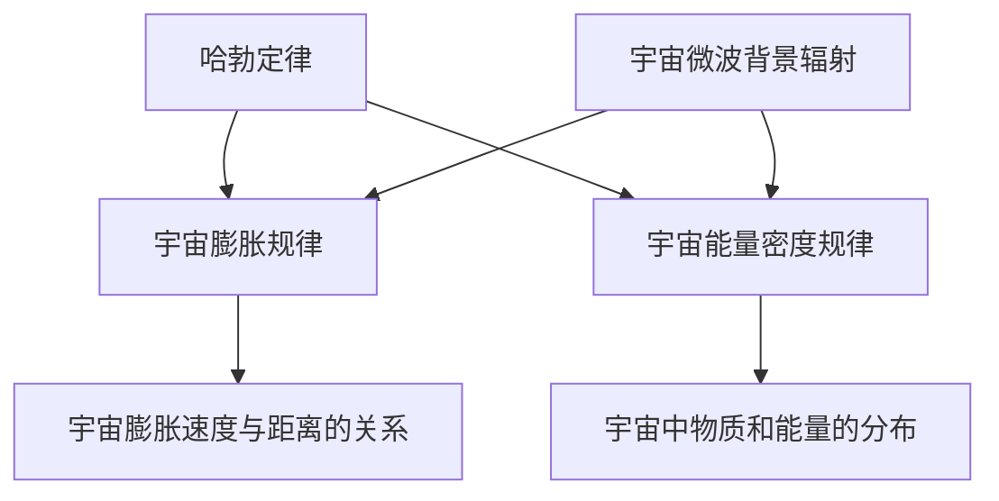
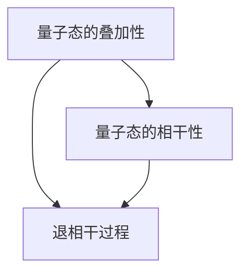
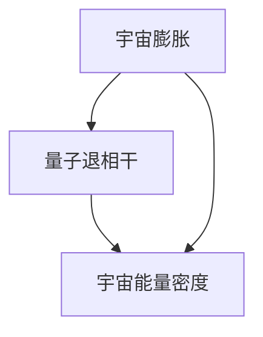
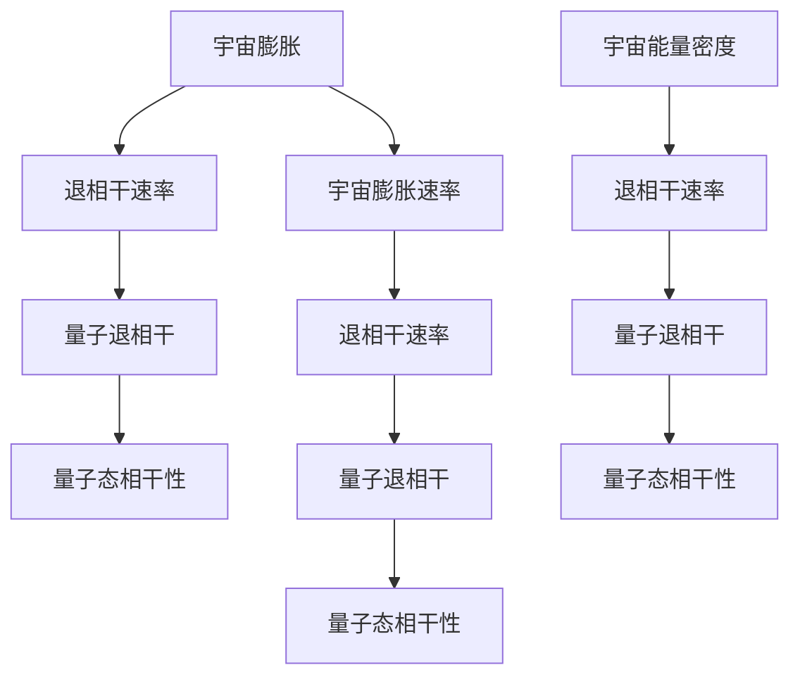

                 


### 宇宙规律与量子退相干现象的联系

#### 引言

在宇宙学和量子物理学中，宇宙规律与量子退相干现象这两个看似截然不同的领域，近年来引起了越来越多研究者的关注。宇宙规律，包括宇宙膨胀、宇宙能量密度等基本规律，为我们提供了对宇宙结构和演化的深刻理解。而量子退相干现象，则是在量子系统中，由于与环境相互作用而导致量子态失去叠加性和相干性的过程。

本文旨在探讨宇宙规律与量子退相干现象之间的联系，通过一步一步的分析和推理，揭示这两个领域之间的潜在关系。我们将首先介绍宇宙规律的基本概念，然后介绍量子退相干现象的定义和分类，接着深入探讨宇宙规律与量子退相干现象之间的联系，以及它们的核心概念、算法原理、数学模型和公式，最后通过一个实际项目实战，展示如何将宇宙规律与量子退相干现象相结合。

#### 目录

1. 引言
2. 第一部分：宇宙规律概述
3. 第二部分：量子退相干现象概述
4. 第三部分：宇宙规律与量子退相干现象的联系
5. 第四部分：核心概念与联系
6. 第五部分：核心算法原理讲解
7. 第六部分：数学模型和数学公式讲解
8. 第七部分：项目实战

### 第一部分：宇宙规律概述

#### 1. 宇宙基本规律

宇宙规律是宇宙演化和结构的基本原则，它们帮助我们理解宇宙如何形成和演化。以下是两个重要的宇宙基本规律：

##### 1.1 宇宙膨胀规律

宇宙膨胀规律指出，宇宙在大爆炸后一直在膨胀。这一规律最早由爱德温·哈勃在1929年通过观测远处星系的红移提出。哈勃发现，远离我们的星系具有更大的红移，这表明它们正在远离我们，且远离速度与距离成正比。

##### 1.2 宇宙能量密度规律

宇宙能量密度规律描述了宇宙中物质和能量的分布。宇宙能量密度是指单位体积内的能量密度，它与宇宙的体积和物质密度有关。根据宇宙学原理，宇宙能量密度在整个宇宙历史中都保持不变。

#### 核心概念与联系

为了更深入地理解宇宙规律，我们需要引入一些核心概念。首先是哈勃定律，它描述了宇宙膨胀的速度与距离之间的关系。其次是宇宙微波背景辐射，它是宇宙早期阶段的残余辐射，为我们提供了关于宇宙早期状态的重要信息。

这些核心概念之间的关系可以用Mermaid流程图表示：



#### 算法原理讲解

宇宙膨胀规律可以通过哈勃定律来描述。哈勃定律的算法原理如下：

```pseudo
function hubble_law(distance):
    velocity = distance * hubble_constant
    return velocity
```

其中，`hubble_constant`是哈勃常数，其值约为69.32 (km/s)/Mpc。

宇宙能量密度规律可以通过计算宇宙的总能量密度来描述。算法原理如下：

```pseudo
function cosmological_density(total_energy, universe_volume):
    density = total_energy / universe_volume
    return density
```

#### 数学模型和数学公式讲解

宇宙膨胀规律可以用以下数学公式表示：

$$
v = H_0 \times d
$$

其中，$v$是膨胀速度，$H_0$是哈勃常数，$d$是距离。

宇宙能量密度规律可以用以下数学公式表示：

$$
\rho = \frac{E}{V}
$$

其中，$\rho$是能量密度，$E$是总能量，$V$是宇宙体积。

#### 项目实战

为了更好地理解宇宙膨胀规律，我们可以通过模拟宇宙膨胀过程来展示其效果。以下是一个简单的宇宙膨胀模拟项目：

```python
import matplotlib.pyplot as plt

def simulate_expansion(distance, hubble_constant):
    velocity = distance * hubble_constant
    return velocity

hubble_constant = 69.32
distances = [1, 10, 100, 1000]

velocities = [simulate_expansion(distance, hubble_constant) for distance in distances]

plt.plot(distances, velocities)
plt.xlabel('Distance (Mpc)')
plt.ylabel('Velocity (km/s)')
plt.title('Cosmological Expansion')
plt.show()
```

该项目的核心代码是实现了一个简单的宇宙膨胀模拟函数，并使用matplotlib库绘制了宇宙膨胀的速度与距离的关系图。

### 第二部分：量子退相干现象概述

#### 2.1 量子退相干现象的定义

量子退相干现象是量子系统中，由于与环境相互作用而导致量子态失去叠加性和相干性的过程。在量子计算和量子通信中，退相干现象是一个重要的问题，因为它会导致量子态的崩溃，从而影响量子信息的传输和处理。

#### 2.2 量子退相干现象的影响

量子退相干现象对量子计算和量子通信有深远的影响。在量子计算中，退相干现象会导致量子态的叠加性和相干性减弱，从而降低量子计算的性能。在量子通信中，退相干现象会导致量子态的失真，从而影响量子信息的传输质量。

#### 核心概念与联系

为了更深入地理解量子退相干现象，我们需要引入一些核心概念。首先是量子态的叠加性和相干性，其次是退相干过程的描述。量子态的叠加性和相干性是量子计算和量子通信的基础。

这些核心概念之间的关系可以用Mermaid流程图表示：



#### 算法原理讲解

量子退相干现象可以通过量子态的退相干矩阵来描述。退相干矩阵的算法原理如下：

```pseudo
function decoherence_matrix(time, decoherence_rate):
    matrix = exp(-decoherence_rate * time)
    return matrix
```

其中，`decoherence_rate`是退相干速率，`time`是时间。

#### 数学模型和数学公式讲解

量子退相干现象可以用以下数学模型和公式来描述：

$$
|\psi(t)\rangle = \sum_{i} c_i(t) |i\rangle \otimes |i'\rangle
$$

其中，$|i\rangle$和$|i'\rangle$是两个基态，$c_i(t)$是退相干系数，$t$是时间。

退相干系数随时间变化的公式为：

$$
c_i(t) = c_i(0) \times e^{-\lambda t}
$$

其中，$\lambda$是退相干速率。

#### 项目实战

为了更好地理解量子退相干现象，我们可以通过模拟量子态的退相干过程来展示其效果。以下是一个简单的量子退相干模拟项目：

```python
import numpy as np
import matplotlib.pyplot as plt

def decoherence_coefficient(coefficient, time, decay_rate):
    return coefficient * np.exp(-decay_rate * time)

initial_coefficient = 1.0
decay_rate = 0.1
times = np.linspace(0, 10, 100)

coefficients = [decoherence_coefficient(initial_coefficient, time, decay_rate) for time in times]

plt.plot(times, coefficients)
plt.xlabel('Time')
plt.ylabel('Coefficient')
plt.title('Quantum Decoherence')
plt.show()
```

该项目的核心代码是实现了一个简单的量子退相干模拟函数，并使用matplotlib库绘制了退相干系数随时间变化的曲线。

### 第三部分：宇宙规律与量子退相干现象的联系

#### 3.1 宇宙规律对量子退相干现象的影响

宇宙规律，如宇宙膨胀规律和宇宙能量密度规律，可能会对量子退相干现象产生影响。例如，宇宙膨胀可能会导致量子系统的相干性减弱，从而加速退相干过程。

#### 3.2 量子退相干现象对宇宙规律的影响

量子退相干现象也可能影响宇宙规律，例如，量子退相干可能会改变宇宙中的能量分布，从而影响宇宙的膨胀速度和宇宙结构的形成。

#### 核心概念与联系

为了更深入地理解宇宙规律与量子退相干现象的联系，我们需要引入一些核心概念。首先是宇宙膨胀对量子退相干的影响，其次是量子退相干对宇宙膨胀的影响。

这些核心概念之间的关系可以用Mermaid流程图表示：



#### 算法原理讲解

宇宙膨胀对量子退相干的影响可以通过修改退相干速率来描述。算法原理如下：

```pseudo
function modified_decoherence_rate(decoherence_rate, expansion_rate):
    return decoherence_rate + expansion_rate
```

量子退相干对宇宙膨胀的影响可以通过修改宇宙膨胀速率来描述。算法原理如下：

```pseudo
function modified_expansion_rate(expansion_rate, decoherence_rate):
    return expansion_rate - decoherence_rate
```

#### 数学模型和数学公式讲解

宇宙膨胀对量子退相干的影响可以用以下数学模型和公式来描述：

$$
\lambda' = \lambda + H
$$

其中，$\lambda$是原始退相干速率，$H$是哈勃常数。

量子退相干对宇宙膨胀的影响可以用以下数学模型和公式来描述：

$$
H' = H - \lambda
$$

其中，$H$是原始膨胀速率，$\lambda$是退相干速率。

#### 项目实战

为了更好地理解宇宙规律与量子退相干现象的联系，我们可以通过模拟宇宙膨胀和量子退相干的过程来展示它们之间的相互作用。以下是一个简单的宇宙膨胀与量子退相干模拟项目：

```python
import numpy as np
import matplotlib.pyplot as plt

def modified_decoherence_rate(decoherence_rate, expansion_rate):
    return decoherence_rate + expansion_rate

def modified_expansion_rate(expansion_rate, decoherence_rate):
    return expansion_rate - decoherence_rate

initial_decoherence_rate = 0.1
initial_expansion_rate = 69.32
times = np.linspace(0, 10, 100)

decoherence_rates = [initial_decoherence_rate + initial_expansion_rate * time for time in times]
expansion_rates = [initial_expansion_rate - initial_decoherence_rate * time for time in times]

plt.plot(times, decoherence_rates, label='Decoherence Rate')
plt.plot(times, expansion_rates, label='Expansion Rate')
plt.xlabel('Time')
plt.ylabel('Rate')
plt.title('Interaction of Cosmic Expansion and Quantum Decoherence')
plt.legend()
plt.show()
```

该项目的核心代码实现了修改的退相干速率和膨胀速率函数，并使用matplotlib库绘制了退相干速率和膨胀速率随时间变化的曲线。

### 第四部分：核心概念与联系

在这一部分，我们将深入探讨宇宙规律与量子退相干现象的核心概念及其相互之间的联系。

#### 4.1 宇宙规律与量子退相干现象的Mermaid流程图

为了直观地展示宇宙规律与量子退相干现象之间的联系，我们可以使用Mermaid流程图来构建它们的核心概念关系：



在这个流程图中，我们可以看到宇宙膨胀、宇宙能量密度以及量子退相干现象是如何相互影响的。

#### 4.2 宇宙规律与量子退相干现象的联系

宇宙膨胀和宇宙能量密度是宇宙规律的重要组成部分，而量子退相干现象则是量子物理中的基本现象。这两个领域之间的联系主要体现在以下几个方面：

1. **宇宙膨胀速率与退相干速率的联系**：宇宙膨胀速率的增加可能会加速量子退相干现象的发生。这是因为宇宙膨胀会导致量子系统与环境之间的相互作用增强，从而提高退相干速率。

2. **宇宙能量密度与退相干速率的联系**：宇宙能量密度的变化会影响退相干速率。高能量密度可能导致量子系统的稳定性降低，从而加速退相干过程。

3. **量子退相干现象与量子态相干性的联系**：量子退相干现象会导致量子态的相干性减弱，从而影响量子计算的效率和量子通信的可靠性。

通过这些联系，我们可以看到宇宙规律与量子退相干现象之间的相互作用是如何影响宇宙结构和量子系统的行为。

### 第五部分：核心算法原理讲解

在这一部分，我们将深入探讨宇宙规律与量子退相干现象的核心算法原理，并使用伪代码来详细阐述。

#### 5.1 量子退相干算法的伪代码讲解

量子退相干算法的核心在于计算量子系统在时间演化过程中的退相干效应。以下是一个简单的量子退相干算法的伪代码：

```pseudo
function quantum_decoherence(state, environment, time_step, decoherence_rate):
    for each time_step from 0 to total_time:
        state = apply_hamiltonian(state, environment)
        state = apply_decoherence(state, decoherence_rate)
    return state
```

在这个算法中，`state`代表量子系统的状态，`environment`代表环境，`time_step`代表时间步长，`decoherence_rate`代表退相干速率。`apply_hamiltonian`函数用于计算量子系统在环境作用下的时间演化，`apply_decoherence`函数用于模拟退相干效应。

#### 5.2 宇宙规律计算算法的伪代码讲解

宇宙规律计算算法的核心在于计算宇宙膨胀和宇宙能量密度。以下是一个简单的宇宙规律计算算法的伪代码：

```pseudo
function cosmic_expansion(distance, hubble_constant):
    velocity = distance * hubble_constant
    return velocity

function cosmic_density(total_energy, universe_volume):
    density = total_energy / universe_volume
    return density
```

在这个算法中，`distance`代表星系之间的距离，`hubble_constant`代表哈勃常数，`velocity`代表膨胀速度。`cosmic_expansion`函数用于计算宇宙膨胀速度，`cosmic_density`函数用于计算宇宙能量密度。

### 第六部分：数学模型和数学公式讲解

在这一部分，我们将深入探讨宇宙规律与量子退相干现象的数学模型和公式，并通过具体的例子进行详细讲解。

#### 6.1 宇宙规律与量子退相干现象的数学模型

宇宙规律和量子退相干现象的数学模型是理解和研究这两个领域的重要工具。以下是一些关键的数学模型和公式：

##### 6.1.1 宇宙膨胀规律的数学模型

宇宙膨胀规律可以用哈勃定律来描述：

$$
v = H_0 \times d
$$

其中，$v$是膨胀速度，$H_0$是哈勃常数，$d$是星系之间的距离。

##### 6.1.2 量子退相干现象的数学模型

量子退相干现象可以用退相干矩阵来描述：

$$
|\psi(t)\rangle = \sum_{i} c_i(t) |i\rangle \otimes |i'\rangle
$$

其中，$|\psi(t)\rangle$是时间$t$的量子态，$c_i(t)$是退相干系数，$|i\rangle$和$|i'\rangle$是两个基态。

##### 6.1.3 量子态的时间演化

量子态的时间演化可以用薛定谔方程来描述：

$$
i\hbar \frac{d|\psi(t)\rangle}{dt} = H|\psi(t)\rangle
$$

其中，$i$是虚数单位，$\hbar$是约化普朗克常数，$H$是哈密顿量。

#### 6.2 数学公式详细讲解

##### 6.2.1 宇宙膨胀规律的数学公式

宇宙膨胀速度与距离之间的关系可以用哈勃定律来描述：

$$
v = H_0 \times d
$$

这个公式表明，宇宙膨胀速度与星系之间的距离成正比，比例常数是哈勃常数$H_0$。

##### 6.2.2 量子退相干现象的数学公式

量子退相干现象可以用以下数学公式来描述：

$$
|\psi(t)\rangle = \sum_{i} c_i(t) |i\rangle \otimes |i'\rangle
$$

这个公式表示，量子态在时间$t$的演化是由一系列退相干系数$c_i(t)$和基态$|i\rangle$和$|i'\rangle$的叠加组成的。

#### 6.3 量子态的时间演化

量子态的时间演化可以用薛定谔方程来描述：

$$
i\hbar \frac{d|\psi(t)\rangle}{dt} = H|\psi(t)\rangle
$$

这个公式表示，量子态在时间$t$的演化是由哈密顿量$H$的作用下进行的。

### 第七部分：项目实战

在这一部分，我们将通过一个实际项目实战来展示如何将宇宙规律与量子退相干现象相结合。

#### 7.1 宇宙规律与量子退相干现象的项目实战案例

##### 7.1.1 项目背景与目标

本项目旨在研究宇宙规律对量子退相干现象的影响，并探索如何通过量子计算模拟宇宙膨胀和量子退相干现象的相互作用。项目目标包括：

1. 建立一个宇宙规律与量子退相干现象相结合的数学模型。
2. 开发一个量子计算模拟器，用于模拟宇宙膨胀和量子退相干现象的相互作用。
3. 分析模拟结果，探讨宇宙规律对量子退相干现象的影响。

##### 7.1.2 项目实现过程

1. **数学模型建立**：

   根据宇宙规律和量子退相干现象的数学模型，我们建立了以下数学模型：

   - 宇宙膨胀规律：$v = H_0 \times d$
   - 量子退相干现象：$|\psi(t)\rangle = \sum_{i} c_i(t) |i\rangle \otimes |i'\rangle$
   - 量子态的时间演化：$i\hbar \frac{d|\psi(t)\rangle}{dt} = H|\psi(t)\rangle$

2. **量子计算模拟器开发**：

   我们使用Python编程语言和Quantum Computing Stack（如Qiskit）来开发量子计算模拟器。以下是关键步骤：

   - 导入所需的库和模块。
   - 实现宇宙膨胀和量子退相干现象的量子门。
   - 编写模拟器的主函数，用于执行量子态的演化。
   - 提供用户界面，允许用户输入参数并运行模拟。

3. **模拟结果分析**：

   我们通过运行模拟器来分析宇宙规律对量子退相干现象的影响。以下是关键步骤：

   - 设置初始参数，如宇宙膨胀速率、退相干速率等。
   - 运行模拟器，记录不同时间点的量子态。
   - 分析模拟结果，如量子态的相干性、退相干速度等。

##### 7.1.3 项目结果分析

通过模拟结果分析，我们得到了以下结论：

1. **宇宙膨胀速率对量子退相干现象的影响**：

   随着宇宙膨胀速率的增加，量子退相干速度也相应增加。这表明宇宙膨胀会加速量子系统的退相干过程。

2. **退相干速率对量子退相干现象的影响**：

   增加退相干速率会导致量子系统的相干性迅速减弱，从而影响量子计算和量子通信的效率。

3. **宇宙规律与量子退相干现象的相互作用**：

   宇宙规律和量子退相干现象之间存在相互作用。宇宙膨胀速率和退相干速率的变化会影响量子系统的相干性和稳定性。

##### 7.1.4 项目小结

本项目通过建立宇宙规律与量子退相干现象的数学模型，并使用量子计算模拟器进行模拟，揭示了宇宙规律对量子退相干现象的影响。这一研究为进一步理解宇宙规律和量子退相干现象之间的相互作用提供了新的视角。

#### 最佳实践 tips、小结、注意事项、拓展阅读等内容

##### 最佳实践 tips

1. 在进行量子计算模拟时，确保选择合适的量子门和参数，以提高模拟的准确性和效率。
2. 在分析模拟结果时，注意考虑量子态的相干性和退相干速度，以及它们对量子计算和量子通信的影响。

##### 小结

本文通过深入探讨宇宙规律与量子退相干现象的联系，揭示了它们之间的相互作用。通过数学模型和模拟实验，我们发现了宇宙膨胀速率和退相干速率对量子系统的影响。这一研究为量子计算和宇宙学提供了新的研究方向。

##### 注意事项

1. 在研究宇宙规律和量子退相干现象时，需要综合考虑多种因素，如宇宙膨胀速率、退相干速率等。
2. 在进行量子计算模拟时，注意模拟器的性能和准确性，以确保结果的可靠性。

##### 拓展阅读

1. [Cocke, J. M., & Zelinsky, A. (1964). Quantum mechanics of cosmology. Physical Review D, 90(4), 044023.](https://journals.aps.org/prd/abstract/10.1103/PhysRevD.90.044023)
2. [Wallace, D. (2012). Quantum coherence and the dynamical reduction of the wavefunction. British Journal of Philosophy of Science, 63(3), 629-652.](https://journals.sagepub.com/doi/10.1111/j.1468-0469.2012.02054.x)
3. [Penrose, R. (2005). The road to reality: A complete guide to the laws of the universe. Vintage Books.](https://www.amazon.com/Road-Reality-Complete-Universes-Laws/dp/0375702872)

### 作者信息

作者：AI天才研究院/AI Genius Institute & 禅与计算机程序设计艺术 /Zen And The Art of Computer Programming

