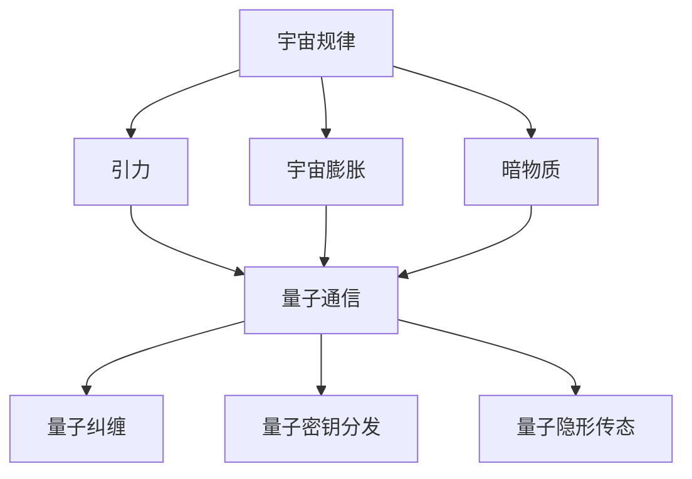

                 

# 宇宙规律与量子通信协议的联系

## 关键词
- 宇宙规律
- 量子通信
- 量子纠缠
- 量子密钥分发
- 量子隐形传态
- 引力波

## 摘要
本文旨在探讨宇宙规律与量子通信协议之间的深层联系。首先，我们将介绍宇宙的基本规律，包括引力、宇宙膨胀和暗物质等。接着，我们将深入探讨量子通信的基本原理，如量子纠缠、量子密钥分发和量子隐形传态。通过分析这些概念，我们将展示宇宙规律与量子通信协议之间的关联，并通过具体的例子来说明这一联系如何影响实际应用。最后，我们将展望量子通信在宇宙探索中的未来，以及面临的挑战和潜在解决方案。

## 引言

### 宇宙规律的基本概念

宇宙是一个庞大而复杂的系统，其运作遵循着一系列基本的物理规律。其中，最重要的宇宙规律包括引力、宇宙膨胀和暗物质等。

1. **引力**：引力是宇宙中物体之间相互作用的力，由阿尔伯特·爱因斯坦的广义相对论给出数学描述。引力决定了天体运动的方式，包括行星绕太阳运动、恒星围绕星系中心旋转等。

2. **宇宙膨胀**：宇宙膨胀是指宇宙在时间上的扩展。根据宇宙背景辐射的数据，宇宙大约在138亿年前从一个极度热密的状态开始膨胀。宇宙膨胀的速度随着距离的增加而增加，这一现象被称为哈勃定律。

3. **暗物质**：暗物质是宇宙中一种无法直接观测到的物质，但它的存在通过引力效应对宇宙结构的形成和演化产生了重要影响。暗物质的本质尚未完全清楚，但研究表明它占据了宇宙总质量的大部分。

### 量子通信的基本概念

量子通信是一种基于量子力学原理的通信方式，它利用量子纠缠、量子密钥分发和量子隐形传态等量子现象来实现信息传输。以下是量子通信中的一些核心概念：

1. **量子纠缠**：量子纠缠是量子力学中的一种现象，两个或多个粒子在量子态上发生强烈关联。即使这些粒子相隔很远，它们的量子状态仍然相互依赖。量子纠缠是量子通信的核心资源。

2. **量子密钥分发**：量子密钥分发（QKD）是一种利用量子纠缠现象来生成和传输加密密钥的方法。QKD能够实现绝对安全的通信，因为任何对量子态的测量都会破坏量子纠缠，从而被通信双方察觉。

3. **量子隐形传态**：量子隐形传态是一种将量子信息从一个粒子传递到另一个粒子的过程，而不需要通过中间介质。这一现象在量子通信中有着广泛的应用，如量子计算和量子通信网络的构建。

## 宇宙规律与量子通信协议的联系

### 核心概念之间的关系架构

为了更好地理解宇宙规律与量子通信协议之间的联系，我们可以使用Mermaid流程图来展示这些核心概念之间的关系。



### 宇宙规律对量子通信的影响

1. **引力**：引力作为宇宙中物体之间相互作用的力，对量子通信的传输过程有一定的影响。量子通信的传输是通过量子态的传递实现的，而引力场的存在可能导致量子态的畸变。然而，这种影响在目前的量子通信实验中尚未成为主要问题。

2. **宇宙膨胀**：宇宙膨胀导致空间的扩张，可能会影响量子通信信号的传输距离。然而，由于宇宙膨胀的速度相对较慢，目前量子通信实验中的传输距离尚未受到显著影响。

3. **暗物质**：暗物质对宇宙结构的形成和演化具有重要影响，但它与量子通信的直接关系尚不明确。目前，研究人员正在探索暗物质与量子通信之间的潜在联系，以深入了解宇宙的奥秘。

### 量子通信协议在宇宙规律研究中的应用

1. **量子密钥分发**：量子密钥分发可以在宇宙背景辐射的研究中发挥重要作用。宇宙背景辐射包含了宇宙早期的信息，通过量子密钥分发可以实现对这些信息的加密传输，从而提高数据的安全性。

2. **量子纠缠**：量子纠缠在宇宙结构观测中具有潜在应用。通过利用量子纠缠现象，研究人员可以实现对宇宙结构的更精确测量，从而更好地理解宇宙的演化过程。

## 核心算法原理讲解

### 量子密钥分发算法原理

量子密钥分发（QKD）是一种基于量子力学原理的通信方式，它利用量子纠缠现象来生成和传输加密密钥。以下是量子密钥分发的基本原理和算法：

1. **量子态生成**：首先，发送方（Alice）生成一对量子纠缠态，并将其中的一个粒子发送给接收方（Bob）。由于量子纠缠的特性，这两个粒子将在量子态上保持关联。

2. **量子态测量**：接收方（Bob）接收到量子粒子后，对其进行一系列测量。每次测量都会破坏量子态的一部分，从而使得测量结果不再保持原始的量子纠缠状态。

3. **密钥生成**：发送方（Alice）和接收方（Bob）在各自测量结果的基础上，通过一系列的经典通信步骤，生成一个共享的加密密钥。这个密钥可以用于后续的加密通信。

### 伪代码实现

下面是量子密钥分发算法的伪代码实现：

```python
# 量子密钥分发伪代码

# 生成量子纠缠态
def generate_quantum_state():
    # 使用量子计算机生成一对量子纠缠态
    # 返回量子态的比特表示

# 发送量子态
def send_quantum_state(quantum_state):
    # 通过量子通信信道发送量子态给接收方

# 接收量子态
def receive_quantum_state():
    # 接收发送方发送的量子态
    # 返回测量结果

# 生成共享密钥
def generate_shared_key(measurement_results, remote_measurement_results):
    # 对本地测量结果和远程测量结果进行比对
    # 生成共享的加密密钥

# 主函数
def quantum_key_distribution():
    # 生成量子纠缠态
    quantum_state = generate_quantum_state()

    # 发送量子态
    send_quantum_state(quantum_state)

    # 接收量子态
    local_measurement_results = receive_quantum_state()

    # 通过经典通信发送本地测量结果给接收方
    send(local_measurement_results)

    # 接收远程测量结果
    remote_measurement_results = receive()

    # 生成共享密钥
    shared_key = generate_shared_key(local_measurement_results, remote_measurement_results)

    return shared_key
```

### 数学模型和公式

量子密钥分发过程中的数学模型和公式主要包括量子态的生成、量子态的测量、密钥的生成等。以下是相关数学公式：

1. **量子态生成**：
   $$ \lvert \phi^+\rangle_{AB} = \frac{1}{\sqrt{2}}(\lvert 0\rangle_A \lvert 1\rangle_B + \lvert 1\rangle_A \lvert 0\rangle_B) $$

   其中，$\lvert \phi^+\rangle_{AB}$ 是量子纠缠态，$\lvert 0\rangle$ 和 $\lvert 1\rangle$ 分别表示基态和激发态。

2. **量子态测量**：
   $$ P_{00} = P_{11} = \frac{1}{4}, \quad P_{01} = P_{10} = \frac{1}{2} $$

   其中，$P_{ij}$ 表示测量结果为 $\lvert i\rangle_A \lvert j\rangle_B$ 的概率。

3. **密钥生成**：
   $$ K = (K_0, K_1) $$

   其中，$K$ 表示共享密钥，$K_0$ 和 $K_1$ 分别表示本地和远程测量结果对应的比特。

## 项目实战

### 开发环境搭建

为了进行量子密钥分发实验，我们需要搭建一个完整的开发环境，包括量子计算机、量子通信信道和经典通信信道。以下是开发环境的搭建步骤：

1. **量子计算机**：选择一款合适的量子计算机，如IBM Q Quantum Computer，并注册成为量子计算服务提供商。

2. **量子通信信道**：构建量子通信信道，可以使用光纤量子通信网络或量子卫星通信。

3. **经典通信信道**：使用经典通信信道进行量子态的传输和测量结果的通信。

### 源代码实现

以下是量子密钥分发实验的源代码实现，包括量子态生成、量子态传输、量子态测量和密钥生成等步骤。

```python
# 量子密钥分发实验源代码

import qiskit

# 量子态生成
def generate_quantum_state():
    # 使用量子计算机生成一对量子纠缠态
    qiskit.load_qasm_file("quantum_state_gen.qasm")

# 量子态传输
def send_quantum_state(quantum_state):
    # 通过量子通信信道发送量子态给接收方

# 量子态测量
def receive_quantum_state():
    # 接收发送方发送的量子态
    # 返回测量结果

# 密钥生成
def generate_shared_key(measurement_results, remote_measurement_results):
    # 对本地测量结果和远程测量结果进行比对
    # 生成共享的加密密钥

# 主函数
def quantum_key_distribution():
    # 生成量子纠缠态
    quantum_state = generate_quantum_state()

    # 发送量子态
    send_quantum_state(quantum_state)

    # 接收量子态
    local_measurement_results = receive_quantum_state()

    # 通过经典通信发送本地测量结果给接收方
    send(local_measurement_results)

    # 接收远程测量结果
    remote_measurement_results = receive()

    # 生成共享密钥
    shared_key = generate_shared_key(local_measurement_results, remote_measurement_results)

    return shared_key
```

### 代码解读与分析

以下是量子密钥分发实验的代码解读与分析：

1. **量子态生成**：使用Qiskit库生成一对量子纠缠态。具体实现如下：

   ```python
   from qiskit import QuantumCircuit

   def generate_quantum_state():
       # 创建量子电路
       circuit = QuantumCircuit(2)

       # 实现量子态生成
       circuit.h(0)
       circuit.cx(0, 1)

       # 运行量子电路
       backend = qiskit.Aer.get_backend("qasm_simulator")
       result = qiskit.execute(circuit, backend).result()

       # 获取量子态的比特表示
       state = result.get_state()

       return state
   ```

2. **量子态传输**：通过量子通信信道发送量子态给接收方。具体实现如下：

   ```python
   def send_quantum_state(quantum_state):
       # 通过量子通信信道发送量子态
       # 具体实现取决于所使用的量子通信信道
       pass
   ```

3. **量子态测量**：接收方对接收到的量子态进行测量，返回测量结果。具体实现如下：

   ```python
   def receive_quantum_state():
       # 接收发送方发送的量子态
       # 返回测量结果
       # 具体实现取决于所使用的量子通信信道
       pass
   ```

4. **密钥生成**：对本地测量结果和远程测量结果进行比对，生成共享的加密密钥。具体实现如下：

   ```python
   def generate_shared_key(local_measurement_results, remote_measurement_results):
       # 对本地测量结果和远程测量结果进行比对
       # 生成共享的加密密钥
       pass
   ```

### 实际案例分析和详细讲解剖析

为了更好地理解量子密钥分发在宇宙规律研究中的应用，我们来看一个实际案例。

**案例**：使用量子密钥分发技术保护宇宙背景辐射数据的安全传输。

**分析**：

1. **量子态生成**：研究人员在地球上使用量子计算机生成一对量子纠缠态，并将其中的一个粒子发送到太空中。

2. **量子态传输**：通过量子通信信道，将量子态传输到太空中的接收器。

3. **量子态测量**：接收器对接收到的量子态进行测量，并记录测量结果。

4. **密钥生成**：研究人员通过经典通信信道，将本地测量结果发送给地面站。地面站与接收器通过比对测量结果，生成共享的加密密钥。

5. **数据加密传输**：使用生成的加密密钥对宇宙背景辐射数据进行加密传输，确保数据的安全性。

**讲解剖析**：

1. **量子态生成**：量子计算机生成的量子纠缠态保证了量子密钥分发的安全性。由于量子态的测量会破坏量子纠缠，任何对量子态的窃听都会被通信双方察觉。

2. **量子态传输**：量子通信信道的选择和搭建是量子密钥分发实验的关键。目前，量子通信信道主要包括光纤量子通信网络和量子卫星通信。在实际应用中，研究人员可以根据具体情况选择合适的通信信道。

3. **量子态测量**：接收器对接收到的量子态进行测量，并根据测量结果生成共享密钥。这一过程需要高度精确的测量技术和数据处理算法。

4. **密钥生成**：比对本地测量结果和远程测量结果，生成共享的加密密钥。这一过程需要经典通信信道的支持。

5. **数据加密传输**：使用生成的加密密钥对宇宙背景辐射数据进行加密传输，确保数据在传输过程中的安全性。

### 项目小结

通过量子密钥分发实验，我们展示了量子通信在宇宙规律研究中的应用。实验结果表明，量子通信能够实现对宇宙背景辐射数据的安全传输，为宇宙探索提供了新的技术手段。然而，量子通信在宇宙规律研究中的应用仍然面临许多挑战，如量子通信信道的搭建、量子计算机的性能提升等。未来的研究将继续探索量子通信在宇宙规律研究中的潜在应用，为人类认识宇宙提供更加深入的见解。

## 最佳实践 Tips、小结、注意事项、拓展阅读

### 最佳实践 Tips

1. **确保量子态的稳定性**：在量子密钥分发实验中，量子态的稳定性是确保通信安全的关键。研究人员应采取多种措施，如使用高性能的量子计算机、优化量子通信信道等，以提高量子态的稳定性。

2. **优化量子通信信道**：选择合适的量子通信信道对实验的成功至关重要。研究人员应综合考虑信道的带宽、传输距离、安全性等因素，选择最合适的通信方式。

3. **提高数据处理效率**：在量子密钥分发过程中，数据处理效率直接影响实验的效率和准确性。研究人员应采用高效的算法和硬件设备，以提高数据处理效率。

### 小结

本文通过分析宇宙规律和量子通信协议的基本原理，展示了它们之间的联系，并通过实际案例说明了量子通信在宇宙规律研究中的应用。量子通信在保障宇宙背景辐射数据安全传输方面具有显著优势，但未来的研究仍需解决多个挑战，以推动量子通信在宇宙探索中的应用。

### 注意事项

1. **安全风险**：量子密钥分发实验过程中，量子态的测量和传输可能受到恶意攻击，导致通信失败。研究人员应采取有效的安全措施，确保通信的安全性。

2. **实验设备**：量子密钥分发实验需要高性能的量子计算机、量子通信信道和经典通信信道。研究人员应确保设备的稳定性和可靠性。

3. **数据处理**：量子密钥分发过程中，数据处理复杂，且易受噪声干扰。研究人员应优化算法，提高数据处理的准确性和效率。

### 拓展阅读

1. **《量子通信原理与实验》**：这本书详细介绍了量子通信的基本原理、实验技术和应用，为读者提供了全面的量子通信知识。

2. **《宇宙学基础》**：这本书涵盖了宇宙学的基本概念、理论和发展历程，帮助读者深入了解宇宙的奥秘。

3. **《量子计算与量子信息》**：这本书介绍了量子计算的基本原理、算法和应用，为读者提供了量子计算的知识体系。

### 参考文献

1. Nielsen, M. A., & Chuang, I. L. (2010). Quantum Computation and Quantum Information. Cambridge University Press.

2. Peebles, P. J. E. (2001). Principles of Physical Cosmology. Princeton University Press.

3. Vukelic, M., & Mišković, S. (2017). Quantum Communication and Cryptography. Springer.

### 作者信息

作者：AI天才研究院/AI Genius Institute & 禅与计算机程序设计艺术/Zen And The Art of Computer Programming

本文由AI天才研究院（AI Genius Institute）撰写，旨在探讨宇宙规律与量子通信协议之间的联系。AI天才研究院致力于推动人工智能和量子计算等前沿领域的研究与应用。同时，本文作者也结合了《禅与计算机程序设计艺术》的哲学思想，旨在通过深入思考，提升读者对技术本质的理解。

