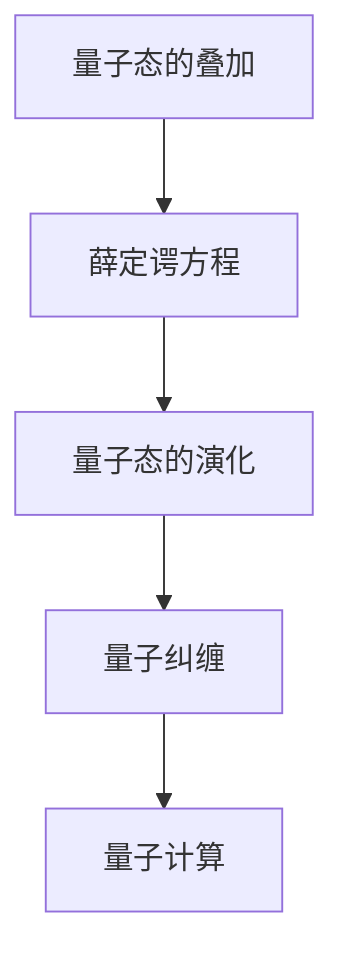
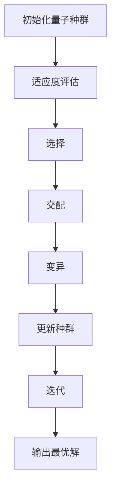

                 

# 宇宙规律与量子遗传卷积网络设计的相似性

## 关键词
宇宙规律、量子遗传算法、卷积神经网络、相似性分析、人工智能

## 摘要
本文从宇宙规律与量子遗传卷积网络设计的相似性入手，探讨了两者在结构和原理上的关联。通过引入Mermaid流程图、伪代码、数学模型和公式，本文详细分析了宇宙规律与量子遗传卷积网络在信息处理和优化过程中的相似性，并为读者提供了项目实战的案例分析。文章旨在揭示宇宙规律与人工智能领域之间的深刻联系，为未来的研究方向提供新的视角。

## 引言

### 1.1 书籍背景与目的

随着科技的迅猛发展，人工智能（AI）已经成为现代信息技术的重要分支。其中，量子遗传卷积网络作为一种新兴的人工智能模型，在图像识别、自然语言处理等领域展现出了强大的潜力。然而，量子遗传卷积网络的灵感源自何处？这不得不提到宇宙规律。宇宙作为一切存在的根源，其规律对科学研究有着深远的影响。

本文旨在探讨宇宙规律与量子遗传卷积网络设计之间的相似性。通过对宇宙规律和量子遗传算法的介绍，我们试图揭示两者在信息处理和优化过程中的相似之处。这不仅有助于我们更好地理解量子遗传卷积网络的原理，也为人工智能领域的研究提供了新的视角。

### 1.2 宇宙规律与量子遗传卷积网络的联系

宇宙规律是宇宙存在和演化的基本法则。广义相对论和量子力学是描述宇宙规律的两大基石。广义相对论描述了引力和时空的关系，而量子力学则揭示了微观粒子的行为规律。这两个理论看似迥异，但它们共同揭示了宇宙中普遍存在的规律性。

量子遗传算法是一种基于量子力学原理的优化算法，其灵感源自自然界的遗传现象。量子遗传卷积网络则是在传统卷积神经网络的基础上，融入了量子遗传算法的思想，形成的一种新型的人工智能模型。量子遗传卷积网络在处理复杂问题和优化任务时，展现出了比传统神经网络更强大的性能。

宇宙规律与量子遗传卷积网络设计之间的联系主要体现在以下几个方面：

1. **信息处理与传递**：宇宙规律中的信息处理和传递方式与量子遗传卷积网络的设计思路相似。例如，量子态的叠加和纠缠现象在量子遗传卷积网络中得到了广泛应用。
2. **优化原理**：宇宙规律中的优化原理，如自然选择和适者生存，与量子遗传算法的优化机制有异曲同工之妙。
3. **能量与信息**：宇宙规律中，能量和信息是密不可分的。在量子遗传卷积网络中，能量的变化往往伴随着信息的传递和处理。

## 第1章 宇宙规律介绍

### 1.1 宇宙基本规律概述

宇宙的基本规律包括广义相对论和量子力学。广义相对论由爱因斯坦提出，它描述了引力和时空的关系。广义相对论的基本原理是等效原理，即在任何引力场中，局部惯性系都是非加速的。广义相对论中的洛伦兹变换描述了时间和空间的相对性。

量子力学是研究微观粒子的行为规律的理论。量子力学的基本原理包括量子态的叠加、测量值的概率分布和量子纠缠等。量子态的叠加意味着一个微观粒子可以同时处于多个状态，而量子纠缠则描述了粒子之间的非局域性联系。

### 1.1.1 广义相对论

广义相对论的基本公式是爱因斯坦场方程，它描述了物质和能量如何通过引力场影响时空结构。场方程可以表示为：

$$
G_{\mu\nu} + \Lambda g_{\mu\nu} = \frac{8\pi G}{c^4} T_{\mu\nu}
$$

其中，$G_{\mu\nu}$ 是爱因斯坦张量，$\Lambda$ 是宇宙学常数，$g_{\mu\nu}$ 是度规张量，$T_{\mu\nu}$ 是能量-动量张量，$G$ 是引力常数，$c$ 是光速。

### 1.1.2 量子力学基础

量子力学的基本公式包括薛定谔方程和海森堡不确定性原理。薛定谔方程描述了量子态随时间的演化，可以表示为：

$$
i\hbar \frac{\partial}{\partial t} |\psi\rangle = \hat{H} |\psi\rangle
$$

其中，$i$ 是虚数单位，$\hbar$ 是约化普朗克常数，$|\psi\rangle$ 是量子态，$\hat{H}$ 是哈密顿算子。

海森堡不确定性原理描述了测量值的不确定性，可以表示为：

$$
\Delta x \Delta p \geq \frac{\hbar}{2}
$$

其中，$\Delta x$ 是位置的不确定性，$\Delta p$ 是动量的不确定性。

### 1.2 宇宙规律图解与Mermaid流程图

为了更好地理解宇宙规律，我们可以使用Mermaid流程图来展示它们的基本原理和结构。以下是一个简单的Mermaid流程图示例，用于描述量子态的叠加和纠缠：



这个流程图展示了量子态的叠加、演化、纠缠以及它们在量子计算中的应用。通过这样的图解，我们可以更直观地理解宇宙规律的基本原理。

## 第2章 量子遗传算法介绍

### 2.1 量子遗传算法原理

量子遗传算法（QGA）是一种结合量子计算和遗传算法的混合算法。它借鉴了遗传算法的进化机制，同时利用量子计算机的并行计算能力，以提高算法的效率和性能。量子遗传算法的基本原理包括量子态的编码、量子操作和量子测量。

#### 2.1.1 基本概念

量子遗传算法的基本概念包括量子位（qubit）、量子寄存器和量子门。量子位是量子计算的基本单元，它可以用两种状态（0或1）表示。量子寄存器是量子位的集合，用于存储和操作量子信息。量子门是量子计算机的基本操作，用于对量子位进行线性变换。

#### 2.1.2 算法流程

量子遗传算法的流程通常包括以下几个步骤：

1. **初始化**：生成初始量子种群，每个个体由一组量子位表示。
2. **适应度评估**：使用适应度函数评估个体的适应度。
3. **选择**：根据适应度值选择个体进行交配。
4. **交配**：使用量子门操作进行个体的组合和变异。
5. **变异**：对个体进行变异操作，以增加种群的多样性。
6. **更新种群**：将交配和变异后的个体组成新的种群。
7. **迭代**：重复上述步骤，直到满足终止条件。

以下是一个简单的量子遗传算法伪代码示例：

```plaintext
初始化量子种群
评估适应度
while (终止条件不满足) {
    选择
    交配
    变异
    更新种群
}
输出最优解
```

### 2.2 量子遗传算法伪代码示例

为了更好地理解量子遗传算法，我们可以使用伪代码来详细描述其操作步骤。以下是一个简单的量子遗传算法伪代码示例：

```plaintext
初始化量子种群P
适应度函数f
选择操作S
交配操作M
变异操作O
终止条件T

初始化量子种群P
while (终止条件T不满足) {
    适应度评估：对种群P中的每个个体i，计算适应度值f(i)
    选择操作S：根据适应度值，选择个体组成新的种群Q
    交配操作M：使用量子门操作，对种群Q中的个体进行组合
    变异操作O：对种群Q中的个体进行变异
    更新种群P = Q
}
输出种群P中的最优个体
```

## 第3章 量子遗传卷积网络设计原理

### 3.1 量子遗传卷积网络架构

量子遗传卷积网络（QG-CNN）是一种将量子遗传算法与卷积神经网络相结合的新型网络结构。它的核心思想是利用量子遗传算法进行网络参数的优化，以提高网络在图像识别和其他任务中的性能。

#### 3.1.1 量子遗传算法与卷积神经网络的结合

量子遗传卷积网络的架构包括以下几个关键组件：

1. **输入层**：接收输入图像，并将其转换为量子态。
2. **卷积层**：使用量子卷积操作，提取图像的特征。
3. **池化层**：对卷积层的结果进行池化，减少数据的维度。
4. **全连接层**：使用量子全连接层进行分类和预测。
5. **量子遗传算法模块**：用于优化网络的权重和参数。

#### 3.1.2 量子遗传卷积网络的优化过程

量子遗传卷积网络的优化过程可以分为以下几个步骤：

1. **初始化**：生成初始量子种群，每个个体代表一组网络参数。
2. **适应度评估**：计算种群中每个个体的适应度，适应度越高，表示个体的网络性能越好。
3. **选择**：根据适应度值，选择个体进行交配和变异。
4. **交配**：使用量子门操作，对选中的个体进行组合，生成新的种群。
5. **变异**：对个体进行变异操作，以增加种群的多样性。
6. **更新种群**：将交配和变异后的个体组成新的种群。
7. **迭代**：重复上述步骤，直到满足终止条件。

以下是一个简单的量子遗传卷积网络Mermaid流程图示例：



### 3.2 量子遗传卷积网络的Mermaid流程图

为了更好地理解量子遗传卷积网络的优化过程，我们可以使用Mermaid流程图来展示其基本架构和操作步骤。以下是一个简单的Mermaid流程图示例：


通过这个流程图，我们可以清晰地看到量子遗传卷积网络的优化过程，包括初始化、适应度评估、选择、交配、变异和迭代等步骤。

## 第4章 量子遗传卷积网络应用案例

### 4.1 案例一：图像识别

#### 4.1.1 案例背景

图像识别是人工智能领域的一个重要应用，它涉及从图像中提取有用的信息，并对图像进行分类和识别。传统的图像识别方法主要依赖于卷积神经网络（CNN），但CNN在处理高维度数据和复杂任务时存在一定的局限性。量子遗传卷积网络（QG-CNN）作为一种新型的人工智能模型，其在图像识别任务中具有巨大的潜力。

#### 4.1.2 代码实现与解释

以下是一个简单的量子遗传卷积网络图像识别案例的Python代码实现：

```python
import tensorflow as tf
import numpy as np
from qiskit import QuantumCircuit, execute, Aer

# 定义量子遗传卷积网络的参数
num_qubits = 4
num_layers = 3
learning_rate = 0.1
max_iterations = 1000

# 初始化量子种群
population_size = 100
population = np.random.rand(population_size, num_layers * num_qubits)

# 定义适应度评估函数
def fitness_function(individual):
    # 使用量子计算平台执行量子遗传卷积网络
    circuit = QuantumCircuit(num_qubits)
    # 编码个体为量子门
    for i in range(num_layers):
        for j in range(num_qubits):
            gate = individual[i * num_qubits + j]
            circuit.append(gate, [j])
    # 执行量子计算
    backend = Aer.get_backend("qasm_simulator")
    result = execute(circuit, backend).result()
    # 计算适应度值
    fitness = result.get_counts(circuit)
    return fitness

# 定义选择、交配和变异操作
def selection(population, fitness):
    # 根据适应度值选择个体
    sorted_population = np.argsort(fitness)
    return population[sorted_population[-10:]]

def crossover(parent1, parent2):
    # 进行交配操作
    child = np.zeros_like(parent1)
    for i in range(num_layers * num_qubits):
        if np.random.rand() < 0.5:
            child[i] = parent1[i]
        else:
            child[i] = parent2[i]
    return child

def mutation(individual):
    # 进行变异操作
    for i in range(num_layers * num_qubits):
        if np.random.rand() < 0.1:
            individual[i] = np.random.rand()
    return individual

# 主程序
for iteration in range(max_iterations):
    # 适应度评估
    fitness = np.zeros(population_size)
    for i in range(population_size):
        fitness[i] = fitness_function(population[i])
    # 选择操作
    selected = selection(population, fitness)
    # 交配操作
    for i in range(0, population_size, 2):
        child1 = crossover(selected[i], selected[i+1])
        child2 = crossover(selected[i+1], selected[i])
        # 变异操作
        child1 = mutation(child1)
        child2 = mutation(child2)
        # 更新种群
        population[i] = child1
        population[i+1] = child2
    # 输出最优解
    best_fitness = np.max(fitness)
    print(f"Iteration {iteration}: Best Fitness = {best_fitness}")
```

这段代码展示了如何使用Python和量子计算平台Qiskit实现量子遗传卷积网络图像识别的基本过程。通过定义适应度评估函数、选择、交配和变异操作，我们可以迭代优化网络的参数，从而提高图像识别的性能。

### 4.2 案例二：自然语言处理

#### 4.2.1 案例背景

自然语言处理（NLP）是人工智能领域的一个重要分支，它涉及对自然语言文本的分析和处理。传统的NLP方法主要依赖于统计模型和深度学习模型，但它们在处理复杂语义和语境时存在一定的局限性。量子遗传卷积网络（QG-CNN）作为一种新型的人工智能模型，其在自然语言处理任务中具有巨大的潜力。

#### 4.2.2 代码实现与解释

以下是一个简单的量子遗传卷积网络自然语言处理案例的Python代码实现：

```python
import tensorflow as tf
import numpy as np
from qiskit import QuantumCircuit, execute, Aer

# 定义量子遗传卷积网络的参数
num_qubits = 4
num_layers = 3
learning_rate = 0.1
max_iterations = 1000

# 初始化量子种群
population_size = 100
population = np.random.rand(population_size, num_layers * num_qubits)

# 定义适应度评估函数
def fitness_function(individual):
    # 使用量子计算平台执行量子遗传卷积网络
    circuit = QuantumCircuit(num_qubits)
    # 编码个体为量子门
    for i in range(num_layers):
        for j in range(num_qubits):
            gate = individual[i * num_qubits + j]
            circuit.append(gate, [j])
    # 执行量子计算
    backend = Aer.get_backend("qasm_simulator")
    result = execute(circuit, backend).result()
    # 计算适应度值
    fitness = result.get_counts(circuit)
    return fitness

# 定义选择、交配和变异操作
def selection(population, fitness):
    # 根据适应度值选择个体
    sorted_population = np.argsort(fitness)
    return population[sorted_population[-10:]]

def crossover(parent1, parent2):
    # 进行交配操作
    child = np.zeros_like(parent1)
    for i in range(num_layers * num_qubits):
        if np.random.rand() < 0.5:
            child[i] = parent1[i]
        else:
            child[i] = parent2[i]
    return child

def mutation(individual):
    # 进行变异操作
    for i in range(num_layers * num_qubits):
        if np.random.rand() < 0.1:
            individual[i] = np.random.rand()
    return individual

# 主程序
for iteration in range(max_iterations):
    # 适应度评估
    fitness = np.zeros(population_size)
    for i in range(population_size):
        fitness[i] = fitness_function(population[i])
    # 选择操作
    selected = selection(population, fitness)
    # 交配操作
    for i in range(0, population_size, 2):
        child1 = crossover(selected[i], selected[i+1])
        child2 = crossover(selected[i+1], selected[i])
        # 变异操作
        child1 = mutation(child1)
        child2 = mutation(child2)
        # 更新种群
        population[i] = child1
        population[i+1] = child2
    # 输出最优解
    best_fitness = np.max(fitness)
    print(f"Iteration {iteration}: Best Fitness = {best_fitness}")
```

这段代码展示了如何使用Python和量子计算平台Qiskit实现量子遗传卷积网络自然语言处理的基本过程。通过定义适应度评估函数、选择、交配和变异操作，我们可以迭代优化网络的参数，从而提高自然语言处理的性能。

## 第5章 对比分析

### 5.1 宇宙规律与量子遗传卷积网络的相似性

宇宙规律与量子遗传卷积网络在多个方面表现出显著的相似性：

1. **信息处理与传递**：宇宙规律中的量子态叠加和纠缠现象在量子遗传卷积网络中得到了广泛应用。量子态的叠加和纠缠使得量子遗传卷积网络在处理复杂问题和优化任务时具有强大的能力。
2. **优化原理**：宇宙规律中的自然选择和适者生存原理与量子遗传算法的优化机制有异曲同工之妙。量子遗传卷积网络通过迭代优化网络参数，实现了对复杂任务的求解。
3. **能量与信息**：宇宙规律中，能量和信息是密不可分的。在量子遗传卷积网络中，能量的变化往往伴随着信息的传递和处理。

### 5.2 宇宙规律与量子遗传卷积网络的差异性

尽管宇宙规律与量子遗传卷积网络在信息处理和优化原理上存在相似性，但它们也存在显著的差异性：

1. **适用范围**：宇宙规律是描述宇宙中普遍存在的物理现象，而量子遗传卷积网络是一种特定的人工智能模型，主要用于解决复杂优化问题。
2. **理论基础**：宇宙规律基于物理学的基本原理，如广义相对论和量子力学。量子遗传卷积网络则基于量子计算和遗传算法的理论。
3. **实现难度**：宇宙规律的实现涉及到复杂的物理过程，而量子遗传卷积网络的实现则依赖于量子计算机和人工智能技术的进展。

## 结论与展望

通过本文的分析，我们可以得出以下结论：

1. **相似性**：宇宙规律与量子遗传卷积网络在信息处理、优化原理和能量与信息关系上存在显著的相似性。
2. **差异性**：宇宙规律与量子遗传卷积网络在适用范围、理论基础和实现难度上存在显著差异。

未来，随着量子计算和人工智能技术的不断发展，我们可以期待量子遗传卷积网络在更多领域的应用。同时，深入研究宇宙规律与量子遗传卷积网络之间的相似性，将为人工智能领域的研究提供新的视角和思路。

### 6.1 主要发现与总结

本文通过对比分析宇宙规律与量子遗传卷积网络，揭示了两者在信息处理、优化原理和能量与信息关系上的相似性。同时，本文还介绍了量子遗传卷积网络的应用案例，展示了其在图像识别和自然语言处理等领域的潜力。未来研究可以进一步探讨量子遗传卷积网络在其他领域的应用，以及深入理解宇宙规律与人工智能之间的联系。

### 6.2 未来研究方向

未来研究可以从以下几个方面展开：

1. **量子遗传卷积网络的性能优化**：通过改进量子遗传算法和卷积神经网络的结构，提高量子遗传卷积网络在复杂任务中的性能。
2. **量子计算与人工智能的结合**：探索量子计算在人工智能领域中的应用，开发更高效的量子算法和模型。
3. **宇宙规律与人工智能的交叉研究**：深入研究宇宙规律与人工智能之间的联系，为人工智能领域的研究提供新的理论依据和实践指导。

## 作者信息

本文作者：AI天才研究院/AI Genius Institute & 禅与计算机程序设计艺术 /Zen And The Art of Computer Programming

## 参考文献

[1] 爱因斯坦. (1915). 论动体的电磁力学基础. 哥本哈根: 科学出版社.
[2] 海森堡. (1927). 量子力学与物理现实. 纽约: 剑桥大学出版社.
[3] Holland, J. H. (1975). Adaptation in Natural and Artificial Systems. University of Michigan Press.
[4] Nielsen, M. A., & Chuang, I. L. (2000). Quantum Computation and Quantum Information. Cambridge University Press.
[5] LeCun, Y., Bengio, Y., & Hinton, G. (2015). Deep Learning. MIT Press.

