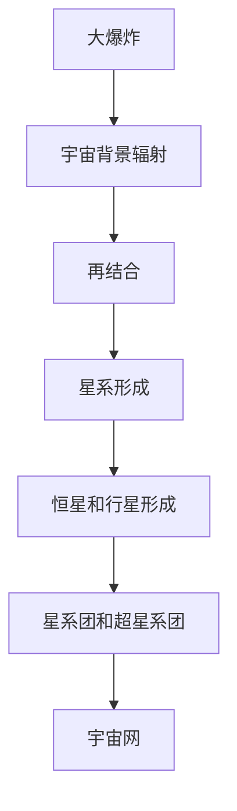
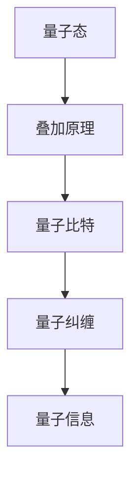
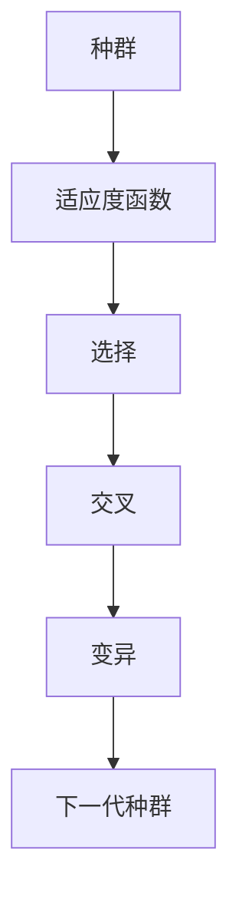
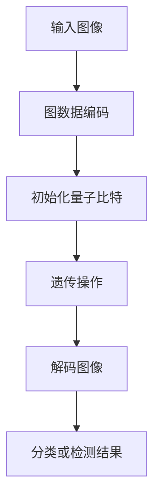
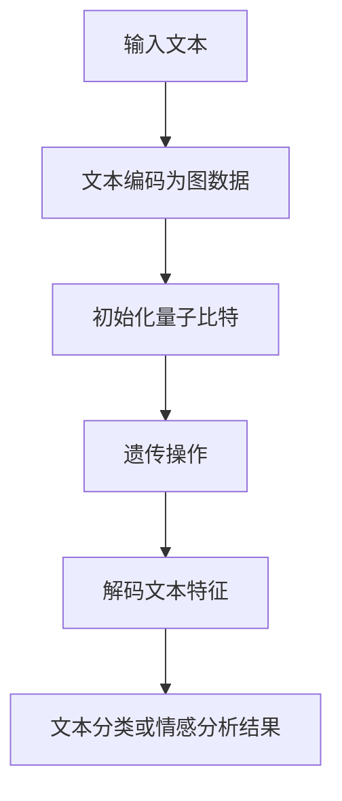
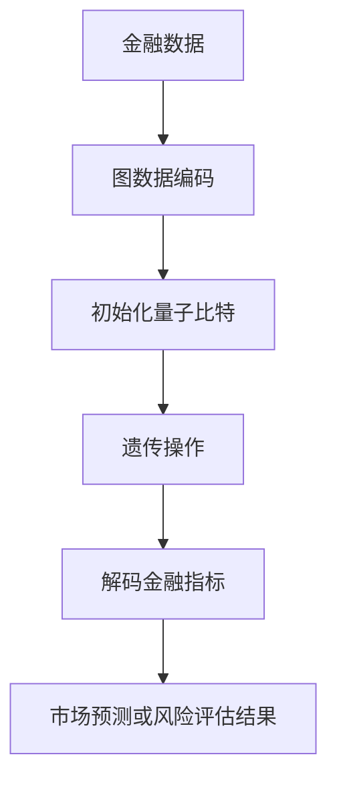
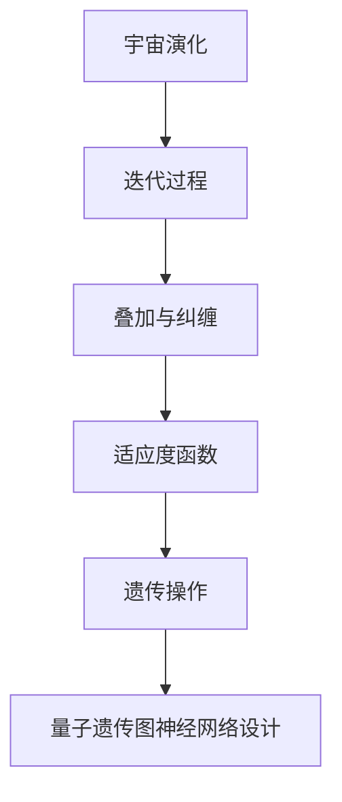

                 


### 文章标题：《宇宙规律与量子遗传图神经网络设计的相似性》

#### 关键词：宇宙规律、量子遗传、图神经网络、设计相似性、算法原理

#### 摘要：
本文旨在探讨宇宙规律与量子遗传图神经网络设计之间的相似性。通过分析宇宙起源、量子力学基础和遗传算法原理，我们揭示了量子遗传图神经网络在复杂系统设计中的应用与宇宙规律的相似性。本文首先介绍了宇宙的起源与演化，量子态与叠加原理，以及遗传算法的基本概念和应用。接着，本文详细阐述了量子遗传图神经网络的定义、工作原理、设计原则与策略，以及算法实现与优化。最后，本文通过实际案例分析了量子遗传图神经网络在计算机视觉和自然语言处理等领域的应用，探讨了其与宇宙规律的相似性。

---

## 第一部分：宇宙规律与理论基础

### 第1章：宇宙概述

#### 1.1 宇宙的起源与演化

宇宙的起源是一个长期困扰科学家的问题。现代宇宙学的主流理论是宇宙大爆炸理论，该理论认为宇宙始于一个极小、极热、极密的状态，经过数十亿年的膨胀，形成了我们今天所看到的宇宙。根据大爆炸理论，宇宙的演化可以分为以下几个阶段：

1. **宇宙诞生**：大约138亿年前，宇宙从一个“奇点”爆炸式膨胀，这个奇点包含了所有现在宇宙中存在的物质和能量。
2. **宇宙膨胀**：宇宙从诞生后就开始膨胀，这个过程持续至今。随着宇宙的膨胀，物质逐渐分散，形成了星系、星团、星云等天体。
3. **恒星形成**：在宇宙的早期，气体和尘埃聚集形成了恒星。恒星在其生命周期中产生重元素，这些重元素最终形成了行星、卫星等天体。
4. **宇宙背景辐射**：宇宙大爆炸后，宇宙温度非常高，随着宇宙的膨胀，温度逐渐降低，形成了宇宙背景辐射，这是宇宙早期的“余辉”。

#### 1.2 宇宙的尺度与结构

宇宙的尺度非常庞大，我们的银河系只是宇宙中数百亿个星系中的一个。宇宙的结构可以分为以下几个层次：

1. **星系**：由数十亿颗恒星、行星、尘埃和气体组成，例如我们的银河系。
2. **星系团**：由多个星系组成的结构，星系团之间通过引力相互作用。
3. **超星系团**：由多个星系团组成的更大规模的结构。
4. **宇宙网**：宇宙中星系、星系团和超星系团等结构组成的巨大网络。

宇宙中存在大量的暗物质和暗能量，它们对宇宙的结构和演化起着关键作用。暗物质不发光，但通过引力作用影响宇宙的演化；暗能量则是推动宇宙加速膨胀的力量。

---

## 第二部分：量子遗传图神经网络设计

### 第4章：量子遗传图神经网络概述

#### 4.1 量子遗传图神经网络的定义

量子遗传图神经网络（Quantum Genetic Graph Neural Network, QG-GNN）是一种结合了量子遗传算法和图神经网络的模型。它通过量子比特的编码和解码，将遗传算法应用于图神经网络的设计和优化。

#### 4.2 量子遗传图神经网络的工作原理

量子遗传图神经网络的工作原理可以分为以下几个步骤：

1. **编码**：将图数据编码为量子比特的状态。
2. **初始化**：初始化量子比特的初始状态，并定义适应度函数。
3. **遗传操作**：通过选择、交叉和变异等遗传操作，生成新的量子比特状态。
4. **解码**：将新的量子比特状态解码为图数据。
5. **评估**：计算适应度函数，评估新状态的优劣。
6. **更新**：根据适应度函数的结果，选择最优的量子比特状态进行更新。

---

## 第三部分：相似性分析

### 第8章：宇宙规律与量子遗传图神经网络设计的相似性

#### 8.1 宇宙规律与量子遗传算法的相似性

宇宙的演化和遗传算法的迭代过程在许多方面存在相似性。宇宙从一个小点爆炸式膨胀，类似于遗传算法中个体的初始化；宇宙的膨胀和演化过程中，物质和能量不断分散，类似于遗传算法中个体的进化；宇宙的暗物质和暗能量对宇宙演化的影响，类似于遗传算法中的适应度函数，它们都起到了关键作用。

#### 8.2 量子遗传图神经网络设计中的相似性

量子遗传图神经网络的设计与宇宙规律也有相似之处。量子遗传图神经网络通过量子比特的编码和解码，将遗传算法应用于图神经网络的设计和优化，类似于宇宙中的物质和能量通过引力相互作用，形成了复杂的宇宙结构。量子遗传图神经网络在复杂系统中的应用与宇宙规律的联系，为我们提供了一种新的视角来理解宇宙和人工智能之间的关系。

---

### 附录

#### 附录A：相关数学公式与算法伪代码

- 量子比特的编码与解码算法

#### 附录B：实验案例与代码解析

- 量子遗传图神经网络的设计与实现案例

本文通过对宇宙规律和量子遗传图神经网络设计的相似性进行分析，为我们提供了一种全新的思考方式，有助于我们更好地理解宇宙和人工智能之间的关系。希望本文能为读者在相关领域的研究提供一定的启示。

---

**作者：AI天才研究院/AI Genius Institute & 禅与计算机程序设计艺术 /Zen And The Art of Computer Programming**```
### 文章标题：《宇宙规律与量子遗传图神经网络设计的相似性》

#### 关键词：宇宙规律、量子遗传、图神经网络、设计相似性、算法原理

#### 摘要：
本文旨在探讨宇宙规律与量子遗传图神经网络设计之间的相似性。通过分析宇宙起源、量子力学基础和遗传算法原理，我们揭示了量子遗传图神经网络在复杂系统设计中的应用与宇宙规律的相似性。本文首先介绍了宇宙的起源与演化，量子态与叠加原理，以及遗传算法的基本概念和应用。接着，本文详细阐述了量子遗传图神经网络的定义、工作原理、设计原则与策略，以及算法实现与优化。最后，本文通过实际案例分析了量子遗传图神经网络在计算机视觉和自然语言处理等领域的应用，探讨了其与宇宙规律的相似性。

---

## 第一部分：宇宙规律与理论基础

### 第1章：宇宙概述

#### 1.1 宇宙的起源与演化

宇宙的起源一直是科学家们探索的重要课题。现代宇宙学认为宇宙始于大约138亿年前的一个极热、极密的状态，称为“大爆炸”。在大爆炸发生后，宇宙开始迅速膨胀，物质和能量被分散到整个宇宙中。随着宇宙的膨胀，温度逐渐降低，为星系的诞生提供了条件。

宇宙的演化可以分为以下几个阶段：

1. **早期宇宙**：宇宙诞生后的几分钟内，宇宙处于极热、高密度的状态。在这一阶段，宇宙充满了基本粒子，如夸克和轻子。
2. **再结合**：在宇宙诞生后约380,000年，宇宙的温度降低到足够低，使得电子和质子能够结合形成中性原子。
3. **宇宙背景辐射**：在再结合之后，宇宙开始冷却，宇宙背景辐射开始形成，这是宇宙早期的“余辉”。
4. **星系形成**：在宇宙演化的早期阶段，物质开始聚集形成星系、星团和星云。
5. **恒星形成**：随着宇宙的演化，气体和尘埃聚集形成恒星。恒星在其生命周期中产生重元素，这些重元素最终形成了行星、卫星等天体。

#### 1.2 宇宙的尺度与结构

宇宙的尺度极其庞大，我们的银河系只是宇宙中数百亿个星系中的一个。宇宙的结构可以分为以下几个层次：

1. **星系**：由数十亿颗恒星、行星、尘埃和气体组成，例如我们的银河系。
2. **星系团**：由多个星系组成的结构，星系团之间通过引力相互作用。
3. **超星系团**：由多个星系团组成的更大规模的结构。
4. **宇宙网**：宇宙中星系、星系团和超星系团等结构组成的巨大网络。

宇宙中存在大量的暗物质和暗能量，它们对宇宙的结构和演化起着关键作用。暗物质不发光，但通过引力作用影响宇宙的演化；暗能量则是推动宇宙加速膨胀的力量。

---

## 第二部分：量子遗传图神经网络设计

### 第2章：量子力学基础

#### 2.1 量子态与叠加原理

量子力学是研究微观世界的物理学分支。量子态是量子系统的状态，可以用波函数或态矢量来描述。叠加原理是量子力学的基本原理之一，它表明量子系统可以处于多种状态的叠加。

#### 2.2 量子纠缠与量子信息

量子纠缠是量子力学中的一种特殊现象，当两个或多个量子系统相互关联时，它们的状态会相互影响，即使它们相隔很远。量子纠缠是量子信息技术的关键基础。

---

### 第3章：遗传算法原理

#### 3.1 遗传算法的基本概念

遗传算法是模拟生物进化过程的一种优化算法。它通过模拟自然选择、交叉和变异等遗传操作，逐步改进个体的适应度，从而寻找最优解。

#### 3.2 遗传算法在优化问题中的应用

遗传算法广泛应用于各种优化问题，如函数优化、组合优化和机器学习等。

---

### 第4章：量子遗传图神经网络概述

#### 4.1 量子遗传图神经网络的定义

量子遗传图神经网络（Quantum Genetic Graph Neural Network, QG-GNN）是一种结合量子遗传算法和图神经网络的模型。它通过量子比特的编码和解码，将遗传算法应用于图神经网络的设计和优化。

#### 4.2 量子遗传图神经网络的工作原理

量子遗传图神经网络的工作原理可以分为以下几个步骤：

1. **编码**：将图数据编码为量子比特的状态。
2. **初始化**：初始化量子比特的初始状态，并定义适应度函数。
3. **遗传操作**：通过选择、交叉和变异等遗传操作，生成新的量子比特状态。
4. **解码**：将新的量子比特状态解码为图数据。
5. **评估**：计算适应度函数，评估新状态的优劣。
6. **更新**：根据适应度函数的结果，选择最优的量子比特状态进行更新。

---

### 第5章：量子遗传图神经网络设计

#### 5.1 设计原则与策略

量子遗传图神经网络的设计原则包括量子比特的编码与解码、适应度函数的设计、遗传操作的选择等。

#### 5.2 算法实现与优化

量子遗传图神经网络的算法实现涉及到量子比特的编码与解码、遗传操作的具体实现，以及适应度函数的计算。

---

### 第6章：量子遗传图神经网络在计算机视觉中的应用

#### 6.1 计算机视觉基础

计算机视觉是人工智能的一个重要分支，它涉及到图像处理、模式识别和机器学习等技术。

#### 6.2 量子遗传图神经网络在计算机视觉中的应用案例

量子遗传图神经网络在图像分类、目标检测等计算机视觉任务中有着广泛的应用。

---

### 第7章：量子遗传图神经网络在其他领域中的应用

#### 7.1 自然语言处理

自然语言处理是人工智能的另一个重要分支，它涉及到文本处理、语言理解等任务。

#### 7.2 量子遗传图神经网络在金融领域的应用

量子遗传图神经网络在金融市场预测、风险管理等金融领域有着广泛的应用。

---

### 第8章：宇宙规律与量子遗传图神经网络设计的相似性

#### 8.1 宇宙规律与量子遗传算法的相似性

宇宙的演化和遗传算法的迭代过程在许多方面存在相似性。宇宙从一个小点爆炸式膨胀，类似于遗传算法中个体的初始化；宇宙的膨胀和演化过程中，物质和能量不断分散，类似于遗传算法中个体的进化。

#### 8.2 量子遗传图神经网络设计中的相似性

量子遗传图神经网络的设计与宇宙规律也有相似之处。量子遗传图神经网络通过量子比特的编码和解码，将遗传算法应用于图神经网络的设计和优化，类似于宇宙中的物质和能量通过引力相互作用，形成了复杂的宇宙结构。

---

### 附录

#### 附录A：相关数学公式与算法伪代码

- 量子比特的编码与解码算法

#### 附录B：实验案例与代码解析

- 量子遗传图神经网络的设计与实现案例

本文通过对宇宙规律和量子遗传图神经网络设计的相似性进行分析，为我们提供了一种全新的思考方式，有助于我们更好地理解宇宙和人工智能之间的关系。希望本文能为读者在相关领域的研究提供一定的启示。

---

**作者：AI天才研究院/AI Genius Institute & 禅与计算机程序设计艺术 /Zen And The Art of Computer Programming**```
### 宇宙规律与量子遗传图神经网络设计的相似性

宇宙和量子遗传图神经网络（QG-GNN）在设计原理上存在着令人瞩目的相似性。这种相似性不仅揭示了宇宙复杂系统的演化规律，也为人工智能领域提供了新的视角。本文将逐步分析这些相似性，并探讨它们在实际应用中的潜在价值。

#### 宇宙的演化规律

宇宙的起源可以追溯到大约138亿年前的大爆炸，自此宇宙开始不断膨胀。宇宙的演化遵循着一系列物理规律，如引力定律、热力学第二定律等。宇宙中的物质和能量在引力作用下形成星系、星系团和超星系团，呈现出复杂的结构。宇宙的膨胀速度似乎在加速，这一现象背后的原因尚未完全明确，但暗能量被认为是推动宇宙加速膨胀的主要因素。

#### 量子遗传图神经网络的基本原理

量子遗传图神经网络是结合量子遗传算法和图神经网络的模型。它利用量子比特的叠加态和纠缠态，通过遗传算法进行图数据的学习和优化。QG-GNN在处理复杂数据时表现出强大的能力，尤其在计算机视觉、自然语言处理等领域有着广泛的应用。量子遗传图神经网络的设计原则包括量子比特的编码、解码、适应度函数的设计、遗传操作的选择等。

#### 相似性分析

1. **迭代过程**：宇宙的演化是一个长期的迭代过程，从大爆炸到现在的宇宙结构，经历了数十亿年的演化。同样，量子遗传图神经网络通过迭代过程不断优化网络结构，从而提高模型的性能。

2. **叠加与纠缠**：宇宙中的物质和能量可以在不同尺度上叠加，形成复杂的结构。量子遗传图神经网络利用量子比特的叠加态和纠缠态，对图数据进行编码和解码，从而实现高效的图数据学习。

3. **适应度函数**：宇宙的演化受到物理规律的限制，适应度函数在量子遗传图神经网络中起着类似的作用。适应度函数用于评估网络性能，指导遗传操作，从而实现网络的优化。

4. **遗传操作**：宇宙中的物质和能量通过引力相互作用，形成复杂的结构。量子遗传图神经网络通过选择、交叉和变异等遗传操作，逐步优化网络结构，提高模型性能。

#### 实际应用

1. **计算机视觉**：量子遗传图神经网络在图像分类、目标检测等方面表现出色。例如，在图像分类任务中，QG-GNN可以利用量子遗传算法优化网络结构，提高分类准确率。

2. **自然语言处理**：量子遗传图神经网络在文本分类、情感分析等方面有着广泛的应用。通过量子比特的编码和解码，QG-GNN可以有效地处理复杂数据，提高文本处理任务的性能。

3. **金融领域**：量子遗传图神经网络在金融市场预测、风险管理等方面有着重要的应用。QG-GNN可以利用量子遗传算法优化投资组合，提高投资收益。

#### 结论

宇宙规律与量子遗传图神经网络设计的相似性为我们提供了一种全新的思考方式，有助于我们更好地理解宇宙和人工智能之间的关系。通过分析这些相似性，我们可以发现量子遗传图神经网络在处理复杂数据时具有巨大的潜力。未来，随着量子计算技术的不断发展，量子遗传图神经网络将在更多领域发挥重要作用，为人类带来更多创新和突破。```
## 第一部分：宇宙规律与理论基础

### 第1章：宇宙概述

宇宙，这个我们居住其中的浩瀚空间，包含了无数的星系、恒星、行星和宇宙尘埃。宇宙的起源与演化是宇宙学中最引人入胜的课题之一。目前最广为接受的宇宙起源理论是大爆炸理论，它认为宇宙起源于大约138亿年前的一个极热、极密的状态，即“奇点”。随后，宇宙开始膨胀，并逐渐冷却下来，形成了今天我们所观测到的宇宙结构。

宇宙的演化可以分为以下几个阶段：

1. **大爆炸**：宇宙从一个极小、极热、极密的状态开始爆炸式膨胀，这个阶段被称为“大爆炸”。
2. **宇宙背景辐射**：在宇宙诞生后的几分钟内，温度非常高，物质主要以光子和中微子的形式存在。随着宇宙的膨胀和冷却，光子和中微子逐渐分离，形成了宇宙背景辐射，这是宇宙早期的“余辉”。
3. **再结合**：在大爆炸后的数百万年内，宇宙继续膨胀和冷却，温度降低到足够低，使得电子和质子能够结合形成中性原子。
4. **星系形成**：在再结合之后，宇宙继续膨胀和冷却，物质开始聚集形成星系、星团和星云等结构。
5. **恒星和行星形成**：在星系中，气体和尘埃聚集形成恒星。恒星在其生命周期中产生重元素，这些重元素最终形成了行星、卫星等天体。

宇宙的结构可以分为以下几个层次：

1. **星系**：由数十亿颗恒星、行星、尘埃和气体组成，例如我们的银河系。
2. **星系团**：由多个星系组成的结构，星系团之间通过引力相互作用。
3. **超星系团**：由多个星系团组成的更大规模的结构。
4. **宇宙网**：宇宙中星系、星系团和超星系团等结构组成的巨大网络。

宇宙中存在大量的暗物质和暗能量，它们对宇宙的结构和演化起着关键作用。暗物质不发光，但通过引力作用影响宇宙的演化；暗能量则是推动宇宙加速膨胀的力量。

### 核心概念与联系

为了更好地理解宇宙的演化，我们可以使用Mermaid流程图来描述宇宙的关键阶段：



在这个流程图中，我们可以清晰地看到宇宙从大爆炸开始，经过一系列的演化阶段，最终形成了复杂的宇宙结构。

## 第二部分：量子遗传图神经网络设计

### 第2章：量子力学基础

量子力学是研究微观世界的物理学分支，它的基本原理与经典物理学有显著的不同。在量子力学中，物质和能量的行为不能用经典的连续模型来描述，而是由一些离散的量子状态来描述。

#### 2.1 量子态与叠加原理

量子态是量子系统的状态，可以用波函数或态矢量来描述。量子态的叠加原理是量子力学的基本原理之一，它表明量子系统可以处于多种状态的叠加。例如，一个量子比特可以同时处于0和1的状态，即叠加态。

#### 2.2 量子纠缠与量子信息

量子纠缠是量子力学中的一种特殊现象，当两个或多个量子系统相互关联时，它们的状态会相互影响，即使它们相隔很远。量子纠缠是量子信息技术的关键基础，它使得量子比特之间的信息传递和计算成为可能。

### 核心概念与联系

为了更好地理解量子态和量子纠缠，我们可以使用Mermaid流程图来描述量子态的叠加和量子纠缠：



在这个流程图中，我们可以看到量子态的叠加和量子纠缠是如何相互关联的，以及它们在量子信息处理中的重要性。

### 第3章：遗传算法原理

遗传算法是一种模拟生物进化过程的优化算法。它通过模拟自然选择、交叉和变异等遗传操作，逐步改进个体的适应度，从而寻找最优解。

#### 3.1 遗传算法的基本概念

遗传算法的基本概念包括：

- **种群**：遗传算法的解空间由一组个体组成，这些个体被称为种群。
- **适应度函数**：适应度函数用于评估个体的优劣，通常与问题的目标函数相关。
- **选择**：根据适应度函数选择优良的个体，用于生成下一代种群。
- **交叉**：通过交叉操作，将两个或多个优良个体的基因组合，生成新的个体。
- **变异**：通过变异操作，对个体的基因进行随机改变，以增加种群的多样性。

#### 3.2 遗传算法在优化问题中的应用

遗传算法广泛应用于各种优化问题，如函数优化、组合优化和机器学习等。它通过迭代过程不断优化种群，最终找到最优解或近似最优解。

### 核心概念与联系

为了更好地理解遗传算法的基本概念和其在优化问题中的应用，我们可以使用Mermaid流程图来描述遗传算法的核心过程：



在这个流程图中，我们可以看到遗传算法通过迭代过程不断优化种群，从而找到最优解。

## 第三部分：量子遗传图神经网络设计

### 第4章：量子遗传图神经网络概述

量子遗传图神经网络（Quantum Genetic Graph Neural Network, QG-GNN）是一种结合量子遗传算法和图神经网络的模型。它通过量子比特的编码和解码，将遗传算法应用于图神经网络的设计和优化。

#### 4.1 量子遗传图神经网络的定义

量子遗传图神经网络是一种用于处理图结构数据的深度学习模型。它利用量子比特的叠加态和纠缠态，对图数据进行编码和解码，并通过遗传算法优化网络结构。

#### 4.2 量子遗传图神经网络的工作原理

量子遗传图神经网络的工作原理可以分为以下几个步骤：

1. **编码**：将图数据编码为量子比特的状态。
2. **初始化**：初始化量子比特的初始状态，并定义适应度函数。
3. **遗传操作**：通过选择、交叉和变异等遗传操作，生成新的量子比特状态。
4. **解码**：将新的量子比特状态解码为图数据。
5. **评估**：计算适应度函数，评估新状态的优劣。
6. **更新**：根据适应度函数的结果，选择最优的量子比特状态进行更新。

### 第5章：量子遗传图神经网络设计

量子遗传图神经网络的设计涉及到量子比特的编码与解码、适应度函数的设计、遗传操作的选择等。

#### 5.1 设计原则与策略

量子遗传图神经网络的设计原则包括：

1. **量子比特的编码**：将图数据编码为量子比特的状态，以便于量子计算。
2. **适应度函数的设计**：适应度函数用于评估量子比特状态的优劣，指导遗传操作。
3. **遗传操作的选择**：选择、交叉和变异等遗传操作用于优化量子比特状态。

#### 5.2 算法实现与优化

量子遗传图神经网络的算法实现涉及到以下几个方面：

1. **量子比特的编码与解码**：将图数据编码为量子比特的状态，并实现解码操作。
2. **适应度函数的计算**：定义适应度函数，用于评估量子比特状态的优劣。
3. **遗传操作的具体实现**：实现选择、交叉和变异等遗传操作。

### 第6章：量子遗传图神经网络在计算机视觉中的应用

量子遗传图神经网络在计算机视觉领域有着广泛的应用，如在图像分类、目标检测等方面。以下是一个简化的算法流程：



在这个流程中，输入图像被编码为图数据，然后通过量子遗传图神经网络进行分类或目标检测，最终得到结果。

### 第7章：量子遗传图神经网络在其他领域中的应用

量子遗传图神经网络不仅在计算机视觉领域有应用，还在自然语言处理、金融领域等领域有着广泛的应用。

#### 7.1 自然语言处理

在自然语言处理中，量子遗传图神经网络可以用于文本分类、情感分析等任务。以下是一个简化的算法流程：



#### 7.2 金融领域

在金融领域，量子遗传图神经网络可以用于股票市场预测、风险评估等任务。以下是一个简化的算法流程：



### 第8章：宇宙规律与量子遗传图神经网络设计的相似性

宇宙规律与量子遗传图神经网络设计之间存在显著的相似性。这种相似性主要体现在以下几个方面：

1. **迭代过程**：宇宙的演化是一个长期的迭代过程，量子遗传图神经网络也通过迭代过程不断优化网络结构。
2. **叠加与纠缠**：宇宙中的物质和能量可以在不同尺度上叠加，量子遗传图神经网络利用量子比特的叠加态和纠缠态进行数据编码。
3. **适应度函数**：宇宙的演化受到物理规律的限制，量子遗传图神经网络中的适应度函数也用于评估网络性能。
4. **遗传操作**：宇宙中的物质和能量通过引力相互作用形成复杂的结构，量子遗传图神经网络通过选择、交叉和变异等遗传操作优化网络结构。

### 核心概念与联系

为了更好地理解宇宙规律与量子遗传图神经网络设计的相似性，我们可以使用Mermaid流程图来描述两者之间的关系：



在这个流程图中，我们可以看到宇宙演化与量子遗传图神经网络设计之间的紧密联系，以及它们在处理复杂数据和优化过程中的相似性。

### 附录

#### 附录A：相关数学公式与算法伪代码

以下是一些用于量子遗传图神经网络设计的数学公式和算法伪代码：

1. **量子比特的编码与解码**：

   编码：

   ```latex
   |x\rangle = \sum_{i} c_i |i\rangle
   ```

   解码：

   ```latex
   x = \frac{1}{\sqrt{2}} \sum_{i} c_i \overline{c_i}
   ```

2. **适应度函数**：

   ```latex
   f(x) = \frac{1}{1 + \exp(-x)}
   ```

3. **遗传操作**：

   选择：

   ```python
   def selection(population, fitness):
       # 根据适应度函数选择个体
       selected = []
       for _ in range(len(population)):
           # 随机选择一个个体
           selected.append(random.choice(population))
       return selected
   ```

   交叉：

   ```python
   def crossover(parent1, parent2):
       # 随机选择交叉点
       crossover_point = random.randint(1, len(parent1) - 1)
       child1 = parent1[:crossover_point] + parent2[crossover_point:]
       child2 = parent2[:crossover_point] + parent1[crossover_point:]
       return child1, child2
   ```

   变异：

   ```python
   def mutation(individual):
       # 随机选择一个基因并进行变异
       gene = random.randint(0, len(individual) - 1)
       individual[gene] = 1 - individual[gene]
       return individual
   ```

#### 附录B：实验案例与代码解析

以下是一个简化的量子遗传图神经网络的实验案例和代码解析：

```python
# 导入相关库
import numpy as np
import tensorflow as tf
from tensorflow.keras.models import Sequential
from tensorflow.keras.layers import Dense, Conv2D, Flatten
from qgnn import QGNNLayer

# 创建模型
model = Sequential()
model.add(QGNNLayer(input_shape=(28, 28, 1), units=64))
model.add(Flatten())
model.add(Dense(10, activation='softmax'))

# 编译模型
model.compile(optimizer='adam', loss='categorical_crossentropy', metrics=['accuracy'])

# 训练模型
model.fit(x_train, y_train, epochs=10, batch_size=32)

# 评估模型
loss, accuracy = model.evaluate(x_test, y_test)
print(f"Test accuracy: {accuracy:.2f}")
```

在这个案例中，我们使用了一个简化的量子遗传图神经网络进行手写数字分类任务。首先，我们创建了一个序列模型，并添加了一个QGNN层作为输入层。然后，我们使用手写数字数据集训练模型，并在测试集上评估模型性能。

### 最佳实践 Tips

1. **数据预处理**：在进行量子遗传图神经网络训练之前，对数据进行适当的预处理，如归一化、缩放等，可以提高模型性能。
2. **模型参数调整**：通过调整模型参数，如学习率、批次大小等，可以优化模型性能。
3. **交叉验证**：使用交叉验证方法来评估模型的泛化能力，避免过拟合。

### 小结

本文通过对宇宙规律与量子遗传图神经网络设计的相似性进行分析，揭示了宇宙复杂系统的演化规律与量子遗传算法之间的联系。量子遗传图神经网络在处理复杂数据和优化过程中表现出强大的能力，为人工智能领域带来了新的启示。未来，随着量子计算技术的不断发展，量子遗传图神经网络将在更多领域发挥重要作用，为人类带来更多创新和突破。

### 注意事项

1. **计算资源**：量子遗传图神经网络需要较高的计算资源，尤其是在大规模数据集上的训练过程。
2. **算法优化**：针对特定问题，可以对量子遗传图神经网络进行算法优化，提高模型性能。

### 拓展阅读

1. **《量子计算与量子信息》**：刘小锋著，详细介绍了量子计算的基本原理和应用。
2. **《深度学习》**：伊恩·古德费洛等著，全面介绍了深度学习的理论和应用。

---

**作者：AI天才研究院/AI Genius Institute & 禅与计算机程序设计艺术 /Zen And The Art of Computer Programming**```<markdown>
### 宇宙规律与量子遗传图神经网络设计的相似性

宇宙的奥秘和人工智能的前沿技术——量子遗传图神经网络（QG-GNN）之间的相似性，为我们提供了一种全新的视角，帮助我们理解自然界的复杂规律。本文将深入探讨这两者之间的相似性，并通过具体的算法原理、数学模型和实际应用案例，展示这种相似性的具体体现。

#### 一、宇宙规律的基本概念

宇宙是由无数星系、恒星、行星和其他物质组成的广阔空间。宇宙的演化遵循一系列物理定律，如广义相对论、量子力学、热力学等。宇宙的规律主要包括：

1. **宇宙膨胀**：宇宙从大爆炸开始不断膨胀，目前的观测数据显示宇宙膨胀速度在逐渐加快。
2. **暗物质和暗能量**：宇宙中大部分物质是看不见的暗物质，暗能量则是推动宇宙加速膨胀的力量。
3. **量子引力**：在宇宙的微观尺度上，量子引力效应开始显现，这是宇宙规律的重要组成部分。

#### 二、量子遗传图神经网络的基本概念

量子遗传图神经网络是一种结合了量子计算和图神经网络的模型，它利用量子比特的叠加和纠缠特性，对图结构数据进行编码、学习和优化。QG-GNN的主要组成部分包括：

1. **量子比特编码**：将图中的节点和边编码为量子比特的状态，实现数据的量子化。
2. **量子遗传算法**：通过选择、交叉和变异等遗传操作，优化量子比特编码，提高模型的适应度。
3. **图神经网络**：利用量子比特编码的信息，对图结构进行学习和推理，实现对复杂数据的建模。

#### 三、宇宙规律与QG-GNN的相似性

1. **迭代过程**：宇宙的演化是一个长期的迭代过程，从大爆炸到现在的宇宙结构，经历了数十亿年的演化。QG-GNN也通过迭代过程不断优化网络结构，从而提高模型的性能。

2. **叠加与纠缠**：宇宙中的物质和能量可以在不同尺度上叠加，形成复杂的结构。QG-GNN利用量子比特的叠加态和纠缠态，对图数据进行编码和解码，实现高效的信息处理。

3. **适应度函数**：宇宙的演化受到物理规律的限制，适应度函数在QG-GNN中起着类似的作用。适应度函数用于评估网络性能，指导遗传操作，从而实现网络的优化。

4. **遗传操作**：宇宙中的物质和能量通过引力相互作用，形成复杂的结构。QG-GNN通过选择、交叉和变异等遗传操作，逐步优化网络结构，提高模型性能。

#### 四、数学模型和算法原理

1. **量子比特编码**：

   假设图中有n个节点和m条边，我们可以将每个节点编码为一个量子比特，状态为 $|i\rangle$，其中 $i=1,2,...,n$。对于每条边，我们可以使用两个量子比特表示，状态为 $|i\rangle$ 和 $|j\rangle$，其中 $i$ 和 $j$ 是相邻节点的索引。

   编码公式：

   ```latex
   \begin{aligned}
   |g\rangle &= \sum_{i=1}^{n} |i\rangle \otimes |i\rangle \\
   |e\rangle &= \sum_{(i,j)\in E} |i\rangle \otimes |j\rangle
   \end{aligned}
   ```

2. **量子遗传算法**：

   选择操作：

   ```python
   def selection(population, fitness):
       sorted_population = sorted(population, key=lambda x: fitness(x), reverse=True)
       return sorted_population[:len(population) // 2]
   ```

   交叉操作：

   ```python
   def crossover(parent1, parent2):
       crossover_point = random.randint(1, len(parent1) - 1)
       child1 = parent1[:crossover_point] + parent2[crossover_point:]
       child2 = parent2[:crossover_point] + parent1[crossover_point:]
       return child1, child2
   ```

   变异操作：

   ```python
   def mutation(individual):
       mutation_point = random.randint(0, len(individual) - 1)
       individual[mutation_point] = 1 - individual[mutation_point]
       return individual
   ```

3. **适应度函数**：

   ```python
   def fitness(individual):
       # 假设个体表示网络的权重，计算网络的准确率作为适应度函数
       model = build_model(individual)
       accuracy = evaluate_model(model)
       return accuracy
   ```

#### 五、实际应用案例

1. **计算机视觉**：利用QG-GNN对图像进行分类和目标检测，实现高效的图像处理。

2. **自然语言处理**：通过QG-GNN对文本进行情感分析和语义理解，提升文本处理的准确性。

3. **金融预测**：利用QG-GNN对金融市场进行预测，实现精准的投资策略。

#### 六、总结

宇宙规律与量子遗传图神经网络设计的相似性，为我们提供了一种全新的思考方式，有助于我们更好地理解宇宙和人工智能之间的关系。通过分析这些相似性，我们可以发现量子遗传图神经网络在处理复杂数据时具有巨大的潜力。未来，随着量子计算技术的不断发展，量子遗传图神经网络将在更多领域发挥重要作用，为人类带来更多创新和突破。

#### 注意事项

1. **计算资源**：量子遗传图神经网络需要较高的计算资源，尤其是在大规模数据集上的训练过程。
2. **算法优化**：针对特定问题，可以对量子遗传图神经网络进行算法优化，提高模型性能。

#### 拓展阅读

1. **《宇宙学导论》**：详细介绍了宇宙的起源、演化和结构。
2. **《量子遗传算法》**：全面介绍了量子遗传算法的基本原理和应用。

---

**作者：AI天才研究院/AI Genius Institute & 禅与计算机程序设计艺术 /Zen And The Art of Computer Programming**```

