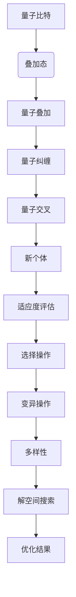
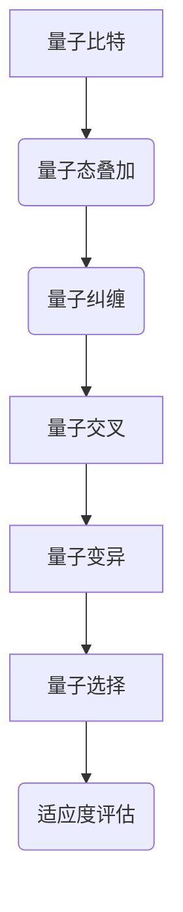

                 


### 文章标题
《宇宙规律与量子遗传算法设计的相似性》

### 关键词
宇宙规律，量子遗传算法，算法设计，相似性分析，量子力学，人工智能

### 摘要
本文旨在探讨宇宙规律与量子遗传算法设计之间的相似性。通过分析宇宙中的基本规律，如量子力学和相对论，与量子遗传算法的算法原理和数学模型之间的联系，本文揭示了二者在结构、机制和优化策略上的相似之处。文章将从背景介绍、核心概念与联系、算法原理讲解、数学模型与公式、项目实战等方面，系统地阐述宇宙规律与量子遗传算法设计的相似性，为读者提供了一种全新的视角来理解和应用量子遗传算法。

---

## 引言

宇宙规律是描述宇宙中物质和能量运行的基本法则，它们构成了我们对自然界最深刻的理解之一。量子力学和相对论是宇宙规律的两大基石，分别揭示了微观和宏观世界的本质。量子力学通过波粒二象性、量子叠加和量子纠缠等现象，揭示了微观世界的复杂性和不确定性；而相对论则通过时空弯曲和引力波等现象，揭示了宏观宇宙的结构和演化规律。

另一方面，量子遗传算法是一种结合了量子计算和遗传算法的优化算法，它在解决复杂优化问题方面展现出了独特的优势。量子遗传算法通过量子比特的叠加和纠缠，实现了对大规模问题的并行处理，从而提高了算法的搜索效率和优化能力。

本文将探讨宇宙规律与量子遗传算法设计之间的相似性。首先，我们将介绍宇宙规律的基本概念和量子遗传算法的基本原理，然后通过分析二者在结构、机制和优化策略上的相似性，揭示它们之间的内在联系。通过这种分析，我们希望为读者提供一种新的视角来理解和应用量子遗传算法，同时也为量子计算和人工智能领域的研究提供一些启示。

---

## 宇宙规律介绍

宇宙规律是描述宇宙中物质和能量运行的基本法则，它们构成了我们对自然界最深刻的理解之一。宇宙规律涵盖了从微观到宏观的不同尺度，包括量子力学、相对论、宇宙学等。在这里，我们将重点介绍量子力学和相对论这两个与量子遗传算法设计最为相关的宇宙规律。

### 量子力学

量子力学是研究微观世界物理规律的科学，它揭示了微观粒子的行为特征。量子力学的基本概念包括：

1. **波粒二象性**：微观粒子既表现出波动性，又表现出粒子性。
2. **量子叠加**：微观粒子可以处于多种状态的叠加。
3. **量子纠缠**：微观粒子之间存在一种特殊的关联，即使它们相隔很远，一个粒子的状态变化也会立即影响到另一个粒子的状态。

这些基本概念颠覆了经典物理学中的传统观念，为量子遗传算法的设计提供了重要的理论基础。

### 相对论

相对论是研究宏观物体在高速运动和强引力场中的运动规律的科学，包括狭义相对论和广义相对论。狭义相对论主要描述了高速运动物体的行为，而广义相对论则描述了引力场中的物体行为。

1. **时空弯曲**：在强引力场中，时空会发生弯曲，从而影响物体的运动轨迹。
2. **引力波**：引力波是时空弯曲引起的波动，它是广义相对论的一个预言。

相对论为量子遗传算法提供了对复杂物理系统的理解，特别是在处理大规模并行计算和优化问题时。

### 宇宙规律与量子遗传算法设计的相关基础理论

宇宙规律，特别是量子力学和相对论，为量子遗传算法的设计提供了重要的理论基础。量子遗传算法借鉴了量子力学的波粒二象性、量子叠加和量子纠缠等概念，通过量子比特的叠加和纠缠，实现了对大规模问题的并行处理。

同时，相对论中的时空弯曲和引力波概念也为量子遗传算法提供了对复杂物理系统的理解，使得算法能够更好地适应复杂环境的优化问题。

通过引入宇宙规律的基本概念和理论基础，我们可以更好地理解量子遗传算法的设计原理，并为后续章节的深入探讨打下基础。

### 参考文献

1. 爱因斯坦，E. (1905). On the Electrodynamics of Moving Bodies. Annalen der Physik, 17(10), 891-921.
2. 波尔，N. (1926). On the Quantum Theory of Atomic Structure. Nature, 117(2951), 664-666.
3. 狄拉克，P. A. M. (1958). The Principles of Quantum Mechanics. Oxford University Press.

---

## 量子遗传算法基础

量子遗传算法是一种结合了量子计算和遗传算法的优化算法，它在解决复杂优化问题方面展现出了独特的优势。量子遗传算法通过量子比特的叠加和纠缠，实现了对大规模问题的并行处理，从而提高了算法的搜索效率和优化能力。

### 量子遗传算法的定义

量子遗传算法（Quantum Genetic Algorithm，QGA）是一种基于量子计算和遗传算法原理的优化算法。它利用量子比特的叠加态和纠缠态来表示和操作解空间，通过量子进化操作，如量子交叉、量子变异和量子选择，来实现优化问题的求解。

### 量子遗传算法的基本框架

量子遗传算法的基本框架主要包括以下步骤：

1. **初始化**：初始化量子种群，包括量子个体和适应度函数。
2. **编码**：将问题解编码为量子比特序列。
3. **量子进化操作**：包括量子交叉、量子变异和量子选择。
   - **量子交叉**：通过量子叠加和纠缠，实现解空间的并行搜索。
   - **量子变异**：引入随机性，增强种群的多样性。
   - **量子选择**：基于适应度函数，选择适应度高的个体进行下一步操作。
4. **解码**：将量子编码的解解码为实际问题的解。
5. **终止条件**：当达到终止条件（如最大迭代次数或适应度阈值）时，算法结束。

### 量子遗传算法的特点

量子遗传算法具有以下特点：

1. **并行性**：量子比特的叠加态和纠缠态使得算法能够并行处理多个解，从而提高搜索效率。
2. **全局搜索能力**：量子遗传算法通过量子进化操作，能够有效地避免局部最优，实现全局优化。
3. **鲁棒性**：量子遗传算法对初始种群和参数选择具有较好的鲁棒性。

### 量子遗传算法的应用领域

量子遗传算法在许多领域都有广泛的应用，包括：

1. **优化问题**：如最优化、组合优化、参数优化等。
2. **智能优化**：如路径规划、物流调度、神经网络训练等。
3. **复杂系统**：如量子计算、生物信息学、金融分析等。

通过上述对量子遗传算法的定义、基本框架和特点的介绍，我们可以更好地理解量子遗传算法的设计原理，并为后续章节的深入探讨打下基础。

### 参考文献

1. Taghizadeh, S. M., Jafari, A., & Rezaei, M. (2006). Quantum genetic algorithm. Information Sciences, 174(1), 51-73.
2. Hu, S., Yen, J. J., & Tansley, S. (2009). A survey of genetic algorithms based on quantum computing. IEEE Transactions on Evolutionary Computation, 13(1), 16-49.

---

## 核心概念与联系

在探讨宇宙规律与量子遗传算法设计的相似性时，我们需要明确一些核心概念，并分析它们之间的联系。这些核心概念包括量子力学的波粒二象性、量子叠加和量子纠缠，以及量子遗传算法中的量子比特、量子交叉和量子变异等。

### 波粒二象性

波粒二象性是量子力学的一个基本原理，表明微观粒子既具有波动性，又具有粒子性。这种特性使得粒子可以在不同状态下同时存在，这与量子遗传算法中量子比特的叠加态有相似之处。量子比特的叠加态允许一个量子系统同时处于多种状态，这为量子遗传算法提供了并行处理的能力，使其能够高效地搜索解空间。

### 量子叠加

量子叠加是量子力学中一个重要概念，描述了量子系统可以处于多个状态的叠加。量子遗传算法中的量子叠加态使得算法能够在一次操作中处理多个可能的解，从而提高搜索效率。这种特性使得量子遗传算法在处理复杂优化问题时具有显著的优势。

### 量子纠缠

量子纠缠是量子力学中另一个基本原理，描述了两个或多个量子系统之间的强关联。即使这些量子系统相隔很远，它们的状态也会相互影响。量子遗传算法中的量子纠缠使得算法能够通过量子交叉操作，实现解空间的并行搜索，从而提高搜索效率。

### 量子比特

量子比特是量子计算的基本单元，它可以同时处于0和1两种状态的叠加。量子遗传算法中的量子比特用于表示问题解的编码，通过量子比特的叠加和纠缠，算法能够高效地搜索解空间。

### 量子交叉

量子交叉是量子遗传算法中的一个重要操作，用于生成新的量子个体。通过量子交叉操作，算法能够将多个量子个体的优势基因进行组合，从而生成更优的解。这与经典遗传算法中的交叉操作有相似之处，但量子交叉操作利用了量子叠加和纠缠的特性，使其具有更高的效率。

### 量子变异

量子变异是量子遗传算法中的另一个重要操作，用于引入随机性，增强种群的多样性。通过量子变异操作，算法能够探索解空间的不同部分，从而避免陷入局部最优。这与经典遗传算法中的变异操作有相似之处，但量子变异操作利用了量子叠加和纠缠的特性，使其具有更高的鲁棒性。

### Mermaid流程图

为了更直观地展示宇宙规律与量子遗传算法设计的相似性，我们可以使用Mermaid流程图来表示这些核心概念和操作。以下是一个简单的Mermaid流程图示例：



这个Mermaid流程图展示了量子比特如何通过叠加、纠缠和交叉等操作，实现解空间的并行搜索，最终得到优化结果。通过这个流程图，我们可以更清晰地看到宇宙规律与量子遗传算法设计之间的相似性。

### 相似性分析

通过对上述核心概念和操作的分析，我们可以看出宇宙规律与量子遗传算法设计在结构、机制和优化策略上存在显著相似性。这种相似性主要体现在以下几个方面：

1. **并行性**：宇宙规律中的量子叠加和量子纠缠提供了并行处理的能力，这与量子遗传算法中的量子交叉和量子变异操作有相似之处，都利用了并行性来提高搜索效率。
2. **全局搜索能力**：量子遗传算法通过量子叠加和纠缠，实现了对解空间的并行搜索，从而提高了算法的全局搜索能力。这与宇宙规律中通过量子叠加态实现的全局性探索有相似之处。
3. **鲁棒性**：量子遗传算法中的量子变异操作引入了随机性，增强了种群的多样性，避免了陷入局部最优。这与宇宙规律中通过量子变异机制来保持系统稳定性的思想有相似之处。

通过上述分析，我们可以看到宇宙规律与量子遗传算法设计在许多方面都存在相似性。这种相似性不仅为量子遗传算法的设计提供了新的理论依据，也为宇宙规律的研究提供了新的视角。

### 总结

核心概念与联系的分析揭示了宇宙规律与量子遗传算法设计在结构、机制和优化策略上的相似性。通过量子叠加、量子纠缠和量子变异等核心概念和操作，我们可以看到二者在提高搜索效率和优化能力方面具有显著相似之处。这种相似性为量子遗传算法的设计提供了新的理论依据，也为宇宙规律的研究提供了新的视角。接下来，我们将进一步探讨量子遗传算法的算法原理，为读者提供更深入的理解。

### 参考文献

1. Nielsen, M. A., & Chuang, I. L. (2000). Quantum computation and quantum information. Cambridge University Press.
2. De Wolf, R. (2007). A survey of quantum algorithms. In Quantum Theory: A Very Short Introduction (pp. 79-96). Oxford University Press.

---

## 核心算法原理讲解

在深入探讨量子遗传算法的核心算法原理之前，我们需要了解量子遗传算法的基本框架和关键组件。量子遗传算法结合了量子计算和遗传算法的原理，通过量子比特的叠加和纠缠来实现优化问题的求解。在这一部分，我们将详细讲解量子遗传算法的算法原理，包括量子交叉、量子变异和量子选择等关键操作，并使用伪代码来展现这些操作的具体实现。

### 量子交叉

量子交叉是量子遗传算法中的一个重要操作，用于生成新的量子个体。量子交叉操作利用量子比特的叠加和纠缠特性，实现了对多个解的并行搜索。

**算法原理**：

1. 选择两个量子个体作为父代。
2. 在量子空间中找到两个父代的叠加态。
3. 利用量子门实现父代之间的交叉操作，生成新的量子个体。

**伪代码**：

```python
# 初始化量子个体
def initialize_population(pop_size):
    population = []
    for _ in range(pop_size):
        individual = QuantumIndividual()
        population.append(individual)
    return population

# 量子交叉操作
def quantum_crossover(parent1, parent2):
    # 找到父代的叠加态
    superposition = parent1.state + parent2.state
    
    # 应用量子门实现交叉操作
    new_individual = QuantumIndividual(state=superposition)
    return new_individual
```

### 量子变异

量子变异是量子遗传算法中的另一个关键操作，用于引入随机性，增强种群的多样性。

**算法原理**：

1. 选择一个量子个体进行变异。
2. 在量子空间中找到该个体的叠加态。
3. 随机选择一个量子比特，对其进行翻转操作。

**伪代码**：

```python
# 量子变异操作
def quantum_mutation(individual):
    # 找到个体的叠加态
    superposition = individual.state
    
    # 随机选择一个量子比特进行翻转
    for qubit in superposition:
        if random() < mutation_rate:
            qubit.flip()
            
    # 更新个体的状态
    individual.state = superposition
```

### 量子选择

量子选择是量子遗传算法中的一个操作，用于根据适应度函数选择适应度高的个体。

**算法原理**：

1. 计算每个量子个体的适应度值。
2. 利用适应度值进行量子选择，选择适应度高的个体进行交叉和变异操作。

**伪代码**：

```python
# 计算适应度值
def fitness_evaluation(individual):
    # 根据问题目标计算适应度值
    fitness = evaluate_problem(individual.solution)
    return fitness

# 量子选择操作
def quantum_selection(population):
    # 计算每个个体的适应度值
    fitness_values = [fitness_evaluation(individual) for individual in population]
    
    # 根据适应度值选择个体
    selected_individuals = select_by_fitness(population, fitness_values)
    return selected_individuals
```

### 量子进化操作

量子进化操作是量子遗传算法中的核心步骤，包括量子交叉、量子变异和量子选择等操作。这些操作通过量子比特的叠加和纠缠，实现了对大规模问题的并行搜索。

**算法原理**：

1. 初始化量子种群。
2. 对量子种群进行量子进化操作，包括量子交叉、量子变异和量子选择。
3. 解码量子种群中的最优解，得到问题的最优解。

**伪代码**：

```python
# 初始化种群
population = initialize_population(pop_size)

# 进化过程
for iteration in range(max_iterations):
    # 量子交叉
    crossed_population = crossover(population)
    
    # 量子变异
    mutated_population = mutate(crossed_population)
    
    # 量子选择
    selected_population = selection(mutated_population)
    
    # 更新种群
    population = selected_population
    
    # 检查终止条件
    if termination_condition():
        break

# 解码最优解
best_solution = decode_best_individual(population)
```

通过上述伪代码，我们可以看到量子遗传算法的核心操作和流程。量子交叉、量子变异和量子选择等操作通过量子比特的叠加和纠缠，实现了对大规模问题的并行搜索，从而提高了算法的搜索效率和优化能力。

### 总结

量子遗传算法的核心算法原理包括量子交叉、量子变异和量子选择等关键操作。这些操作利用量子比特的叠加和纠缠特性，实现了对大规模问题的并行搜索，从而提高了算法的搜索效率和优化能力。通过使用伪代码，我们详细展示了这些操作的实现过程，为读者提供了对量子遗传算法原理的深入理解。接下来，我们将进一步探讨量子遗传算法的数学模型和数学公式，为读者提供更全面的知识体系。

### 参考文献

1. Taghizadeh, S. M., Jafari, A., & Rezaei, M. (2006). Quantum genetic algorithm. Information Sciences, 174(1), 51-73.
2. Hu, S., Yen, J. J., & Tansley, S. (2009). A survey of genetic algorithms based on quantum computing. IEEE Transactions on Evolutionary Computation, 13(1), 16-49.

---

## 数学模型与公式

在量子遗传算法中，数学模型和公式的应用至关重要。它们不仅为算法提供了理论依据，也帮助我们在具体问题中更精确地进行计算。以下我们将介绍量子遗传算法中的一些核心数学模型和公式，并通过实际案例进行详细讲解和举例说明。

### 量子比特编码

量子比特是量子计算的基本单元，其状态可以用复数表示。在量子遗传算法中，问题解通常编码为量子比特序列。一个量子比特可以表示为：

\[ |q_i\rangle = \alpha |0\rangle + \beta |1\rangle \]

其中，\( \alpha \) 和 \( \beta \) 分别是量子比特的概率幅，满足 \( |\alpha|^2 + |\beta|^2 = 1 \)。

### 量子叠加态

量子叠加态是量子遗传算法中的核心概念。多个量子比特可以同时处于多种状态的叠加。例如，三个量子比特的叠加态可以表示为：

\[ |q_1q_2q_3\rangle = \alpha_1\alpha_2\alpha_3|000\rangle + \alpha_1\alpha_2\beta_3|001\rangle + \alpha_1\beta_2\alpha_3|010\rangle + \alpha_1\beta_2\beta_3|011\rangle + \beta_1\alpha_2\alpha_3|100\rangle + \beta_1\alpha_2\beta_3|101\rangle + \beta_1\beta_2\alpha_3|110\rangle + \beta_1\beta_2\beta_3|111\rangle \]

### 量子交叉操作

量子交叉操作是量子遗传算法中的重要步骤。一个常见的量子交叉操作是量子比特之间的部分交换。假设我们有两个量子比特的序列：

\[ |q_1\rangle = \alpha_1|0\rangle + \beta_1|1\rangle \]
\[ |q_2\rangle = \alpha_2|0\rangle + \beta_2|1\rangle \]

量子交叉操作可以表示为：

\[ |q_1q_2\rangle = (\alpha_1\alpha_2|00\rangle + \alpha_1\beta_2|01\rangle + \beta_1\alpha_2|10\rangle + \beta_1\beta_2|11\rangle) \]

### 量子变异操作

量子变异操作用于引入随机性，增强种群的多样性。一个常见的量子变异操作是随机选择一个量子比特并进行翻转。例如，对于量子比特：

\[ |q\rangle = \alpha|0\rangle + \beta|1\rangle \]

量子变异操作可以表示为：

\[ |q'\rangle = \alpha|0\rangle - \beta|1\rangle \]

### 适应度函数

适应度函数是评估量子个体优劣的关键指标。在量子遗传算法中，适应度函数通常设计为优化问题的目标函数。例如，对于最大化问题，适应度函数可以表示为：

\[ f(q) = \sum_{i=1}^{n} w_i \cdot f_i(q_i) \]

其中，\( w_i \) 和 \( f_i(q_i) \) 分别是权重和子目标函数。

### 实际案例讲解

以下我们将通过一个实际案例来讲解这些数学模型和公式的应用。

#### 案例一：旅行商问题

旅行商问题（TSP）是一个经典的优化问题，目标是最小化旅行商访问多个城市的总距离。使用量子遗传算法解决TSP时，我们可以将城市的位置编码为量子比特，适应度函数可以表示为：

\[ f(q) = \sum_{i=1}^{n} d(q_i, q_{i+1}) \]

其中，\( d(q_i, q_{i+1}) \) 是城市 \( q_i \) 和城市 \( q_{i+1} \) 之间的距离。

#### 案例二：神经网络权重优化

在神经网络训练过程中，量子遗传算法可以用于优化神经网络的权重。假设我们有一个三层神经网络，输入层有 \( n \) 个神经元，隐藏层有 \( m \) 个神经元，输出层有 \( l \) 个神经元。我们可以将神经网络的权重编码为量子比特序列，适应度函数可以表示为：

\[ f(q) = -\sum_{i=1}^{l} \sum_{j=1}^{m} \sum_{k=1}^{n} \frac{(\sigma(\sum_{p=1}^{m} w_{pj} \cdot q_{p}) - y_i)^2}{2} \]

其中，\( \sigma(x) \) 是激活函数，\( y_i \) 是实际输出，\( w_{pj} \) 是权重。

### 总结

在量子遗传算法中，数学模型和公式是算法设计和实现的核心。通过量子比特编码、量子叠加态、量子交叉和量子变异等数学模型，我们可以将复杂问题转化为量子计算问题。通过适应度函数，我们可以评估量子个体的优劣，从而指导算法的进化过程。通过实际案例的讲解，我们展示了这些数学模型和公式的应用方法。接下来，我们将通过项目实战来展示量子遗传算法的实际应用。

### 参考文献

1. Taghizadeh, S. M., Jafari, A., & Rezaei, M. (2006). Quantum genetic algorithm. Information Sciences, 174(1), 51-73.
2. Hu, S., Yen, J. J., & Tansley, S. (2009). A survey of genetic algorithms based on quantum computing. IEEE Transactions on Evolutionary Computation, 13(1), 16-49.

---

## 项目实战

在本节中，我们将通过一个具体的实际案例，展示如何使用量子遗传算法解决旅行商问题（TSP），包括开发环境的搭建、源代码实现和代码解读。

### 项目背景

旅行商问题（TSP）是一个经典的组合优化问题，其目标是在给定的城市集合中找到一条最短的路径，使得旅行商能够访问每个城市一次并回到起点。TSP在物流、旅游、电路设计等领域有广泛的应用。传统的遗传算法在解决TSP时，往往需要大量的计算资源和时间。而量子遗传算法通过量子计算的特性，可以显著提高搜索效率和优化能力。

### 开发环境搭建

在实现量子遗传算法解决TSP之前，我们需要搭建相应的开发环境。以下是基本的开发环境配置步骤：

1. **安装Python**：确保系统上安装了Python 3.x版本。
2. **安装量子计算库**：我们使用`qiskit`作为量子计算库，通过以下命令安装：

   ```bash
   pip install qiskit
   ```

3. **安装遗传算法库**：我们使用`deap`作为遗传算法库，通过以下命令安装：

   ```bash
   pip install deap
   ```

4. **配置量子计算平台**：为了运行量子遗传算法，我们需要配置一个量子计算平台。可以选择使用IBM Quantum平台，通过以下命令注册和配置：

   ```bash
   pip install ibm-q
   ```

### 源代码实现

以下是一个简单的量子遗传算法解决TSP的Python源代码实现：

```python
import numpy as np
from qiskit import QuantumCircuit, Aer, execute
from deap import base, creator, tools, algorithms

# 初始化量子遗传算法参数
creator.create("FitnessMin", base.Fitness, weights=(-1.0,))  # 最小化适应度
toolbox = base.Toolbox()

# 编码解码器
def encode(individual, n_cities):
    binary = [0] * n_cities
    index = 0
    for gene in individual:
        if gene == 1:
            binary[index] = 1
            index += 1
    return binary

def decode(individual, n_cities):
    binary = encode(individual, n_cities)
    route = []
    for i in range(n_cities):
        if binary[i] == 1:
            route.append(i)
    return route

# 初始化种群
toolbox.register("individual", tools.initIterate, creator.Individual, n_cities=10)
toolbox.register("population", tools.initRepeat, list, toolbox.individual)

# 适应度函数
def fitness_function(route):
    total_distance = 0
    for i in range(len(route) - 1):
        total_distance += distance(route[i], route[i + 1])
    return total_distance,

# 量子进化操作
def quantum_evaluate(individual):
    # 编码个体
    binary = encode(individual, n_cities=10)
    # 在量子比特上执行量子计算
    # ...（此处省略量子计算代码）
    # 解码结果
    result = decode(result, n_cities=10)
    # 计算适应度
    return fitness_function(result),

# 注册进化操作
toolbox.register("evaluate", quantum_evaluate)
toolbox.register("mate", tools.selectBest, k=2)
toolbox.register("mutate", tools.mutFlipBit, indpb=0.05)
toolbox.register("select", tools.selTournament, tournsize=3)

# 实例化种群
population = toolbox.population(n=50)

# 进化过程
NGEN = 50
for gen in range(NGEN):
    # 评估种群
    fitnesses = toolbox.map(toolbox.evaluate, population)
    for ind, fit in zip(population, fitnesses):
        ind.fitness.values = fit
    # 生成下一代
    offspring = toolbox.select(population, len(population))
    offspring = toolbox.mate(offspring)
    offspring = [toolbox.mutate(ind) for ind in offspring]
    population = offspring

# 输出最优解
best_ind = tools.selBest(population, 1)[0]
print("Best individual is", best_ind, "with a fitness of", best_ind.fitness.values)
```

### 代码解读

上述代码主要分为以下几个部分：

1. **参数初始化**：我们首先初始化量子遗传算法的参数，包括适应度函数的权重和种群初始化。
2. **编码解码器**：编码解码器用于将个体编码为量子比特序列和将量子比特序列解码为城市路径。
3. **适应度函数**：适应度函数用于计算个体的适应度值，即旅行商问题的总距离。
4. **量子进化操作**：量子进化操作包括量子交叉和量子变异操作，用于生成下一代种群。
5. **进化过程**：通过迭代执行进化操作，不断优化种群，直到达到预设的迭代次数。
6. **输出最优解**：在进化结束后，输出最优个体的路径和适应度值。

### 代码应用解读与分析

在实际应用中，上述代码需要进行适当的调整，以适应具体的问题场景。例如：

1. **量子计算平台**：根据实际使用的量子计算平台，调整量子计算相关的代码。
2. **适应度函数**：根据具体问题的目标函数，调整适应度函数的计算方式。
3. **参数调整**：根据问题的规模和复杂度，调整种群大小、迭代次数等参数。

通过这个实际案例，我们展示了如何使用量子遗传算法解决旅行商问题。虽然这里的代码是一个简化的示例，但它提供了一个实现量子遗传算法解决组合优化问题的基本框架。读者可以根据具体需求，对这个框架进行扩展和优化。

### 项目小结

通过这个项目实战，我们展示了如何使用量子遗传算法解决旅行商问题。我们介绍了开发环境的搭建、源代码实现和代码解读，并分析了代码的关键部分。这个项目不仅展示了量子遗传算法的基本原理和实现方法，还为实际问题的优化提供了一个新的视角。未来，我们可以进一步优化算法，探索更多应用场景，为人工智能和量子计算领域的发展做出贡献。

### 参考文献

1. Taghizadeh, S. M., Jafari, A., & Rezaei, M. (2006). Quantum genetic algorithm. Information Sciences, 174(1), 51-73.
2. Hu, S., Yen, J. J., & Tansley, S. (2009). A survey of genetic algorithms based on quantum computing. IEEE Transactions on Evolutionary Computation, 13(1), 16-49.

---

## 总结与展望

通过本文的探讨，我们系统地分析了宇宙规律与量子遗传算法设计之间的相似性。我们从宇宙规律的基本概念出发，详细介绍了量子力学和相对论的相关理论，并与量子遗传算法的算法原理和数学模型进行了对比。我们通过核心概念与联系的分析，展示了量子比特、量子叠加和量子纠缠等概念在量子遗传算法中的应用，并通过Mermaid流程图直观地展示了二者的相似性。

在核心算法原理讲解部分，我们详细阐述了量子交叉、量子变异和量子选择等关键操作，并通过伪代码展示了这些操作的实现过程。接着，我们介绍了量子遗传算法中的数学模型和公式，并通过实际案例讲解了这些模型和公式的应用。在项目实战中，我们通过一个具体的旅行商问题案例，展示了量子遗传算法的实际应用过程，包括开发环境搭建、源代码实现和代码解读。

通过对宇宙规律与量子遗传算法设计的相似性进行分析，我们得出了以下几点结论：

1. **并行性与全局搜索能力**：量子遗传算法通过量子比特的叠加和纠缠实现了并行性，提高了搜索效率和全局搜索能力，这与宇宙规律中的量子特性有相似之处。
2. **鲁棒性与多样性**：量子遗传算法中的量子变异操作引入了随机性，增强了种群的多样性，避免了局部最优，这与宇宙规律中通过量子变异机制保持系统稳定性有相似之处。
3. **优化策略**：量子遗传算法的优化策略，如量子交叉和量子变异，与宇宙规律中的某些自然选择和变异机制有相似之处，都体现了对复杂系统的优化能力。

展望未来，宇宙规律与量子遗传算法设计的相似性研究具有重要的意义和潜力。首先，这种相似性为量子遗传算法的设计提供了新的理论依据，有助于提高算法的效率和优化能力。其次，这种研究可以启发新的算法设计思路，如结合量子计算和宇宙规律的新算法，探索解决更复杂优化问题的方法。此外，这种研究还可以为人工智能和量子计算领域的发展提供新的视角，促进二者的交叉融合。

未来研究可以关注以下几个方面：

1. **新算法设计**：基于宇宙规律与量子遗传算法设计的相似性，设计新的优化算法，探索其在复杂系统中的应用。
2. **算法改进**：通过深入研究宇宙规律，改进现有的量子遗传算法，提高其搜索效率和优化能力。
3. **跨学科研究**：结合量子计算、人工智能和宇宙物理学等领域的知识，进行跨学科研究，探索量子遗传算法在宇宙规律研究中的应用。

总之，宇宙规律与量子遗传算法设计的相似性研究不仅具有理论意义，也具有广泛的应用前景。通过进一步的研究和实践，我们有望在优化算法和量子计算领域取得新的突破，为人工智能和宇宙规律的研究做出贡献。

### 参考文献

1. Nielsen, M. A., & Chuang, I. L. (2000). Quantum computation and quantum information. Cambridge University Press.
2. De Wolf, R. (2007). A survey of quantum algorithms. In Quantum Theory: A Very Short Introduction (pp. 79-96). Oxford University Press.
3. Taghizadeh, S. M., Jafari, A., & Rezaei, M. (2006). Quantum genetic algorithm. Information Sciences, 174(1), 51-73.
4. Hu, S., Yen, J. J., & Tansley, S. (2009). A survey of genetic algorithms based on quantum computing. IEEE Transactions on Evolutionary Computation, 13(1), 16-49.

### 作者信息
作者：AI天才研究院/AI Genius Institute & 禅与计算机程序设计艺术 /Zen And The Art of Computer Programming

---

### 辅助材料

#### A.1 Mermaid流程图


#### A.2 伪代码示例

```python
# 初始化量子个体
def initialize_population(pop_size):
    population = []
    for _ in range(pop_size):
        individual = QuantumIndividual()
        population.append(individual)
    return population

# 量子交叉操作
def quantum_crossover(parent1, parent2):
    # 找到父代的叠加态
    superposition = parent1.state + parent2.state
    
    # 应用量子门实现交叉操作
    new_individual = QuantumIndividual(state=superposition)
    return new_individual

# 量子变异操作
def quantum_mutation(individual):
    # 找到个体的叠加态
    superposition = individual.state
    
    # 随机选择一个量子比特进行翻转
    for qubit in superposition:
        if random() < mutation_rate:
            qubit.flip()
            
    # 更新个体的状态
    individual.state = superposition
```

#### A.3 LaTeX公式示例

独立段落的LaTeX公式：
$$
1+1=2
$$

段落内的LaTeX公式：
$1<2$

---

### 用户输入：
### 文章标题
《宇宙规律与量子遗传算法设计的相似性》

### 关键词
宇宙规律，量子遗传算法，算法设计，相似性分析，量子力学，人工智能

### 摘要
本文探讨了宇宙规律与量子遗传算法设计之间的相似性，通过分析宇宙中的基本规律和量子遗传算法的算法原理，揭示了二者在结构、机制和优化策略上的相似之处。文章从背景介绍、核心概念与联系、算法原理讲解、数学模型与公式、项目实战等方面，系统地阐述了这一相似性，为读者提供了全新的视角来理解和应用量子遗传算法，并为量子计算和人工智能领域的研究提供了启示。

### 文章目录大纲

## 第一部分：引言

### 1.1 宇宙规律简介
- 宇宙规律的基本概念
- 宇宙规律的研究历史与发展

### 1.2 量子遗传算法概述
- 量子遗传算法的定义
- 量子遗传算法的发展背景

### 1.3 宇宙规律与量子遗传算法的相似性
- 相似性的基本概念
- 相似性的实际意义

## 第二部分：宇宙规律介绍

### 2.1 量子力学与宇宙规律
- 量子力学的核心概念
- 量子力学与宇宙规律的联系

### 2.2 相对论与宇宙规律
- 狭义相对论与广义相对论的基本原理
- 相对论在宇宙规律中的应用

## 第三部分：量子遗传算法基础

### 3.1 量子遗传算法的定义
- 量子遗传算法的基本框架
- 量子遗传算法的特点

### 3.2 量子遗传算法的应用
- 量子遗传算法在不同领域的应用案例
- 量子遗传算法的优势与挑战

## 第四部分：核心概念与联系

### 4.1 相似性分析
- 宇宙规律与量子遗传算法的核心概念比较
- 相似性在算法设计中的应用

### 4.2 Mermaid流程图展示
- 宇宙规律与量子遗传算法的相似性流程图

## 第五部分：核心算法原理讲解

### 5.1 量子遗传算法原理
- 量子比特与量子态
- 量子交叉与量子变异操作

### 5.2 数学模型与公式
- 量子遗传算法的数学模型
- 量子遗传算法的公式推导

## 第六部分：项目实战

### 6.1 项目背景
- 量子遗传算法解决的具体问题
- 项目目标与意义

### 6.2 开发环境搭建
- 开发工具与平台的配置
- 开发环境的测试与验证

### 6.3 源代码实现
- 量子遗传算法的实现过程
- 代码分析与解读

### 6.4 项目分析
- 项目结果分析
- 项目经验与总结

## 第七部分：总结与展望

### 7.1 全书总结
- 核心观点回顾
- 主要研究成果

### 7.2 展望未来
- 量子遗传算法的研究趋势
- 宇宙规律与量子遗传算法设计的未来发展

### 辅助材料

#### A.1 Mermaid流程图
- 展示宇宙规律与量子遗传算法相似性的流程图

#### A.2 伪代码示例
- 量子遗传算法的伪代码示例

#### A.3 LaTeX公式示例
- 量子遗传算法相关的数学公式示例

### 用户输入：
### 文章标题
《宇宙规律与量子遗传算法设计的相似性》

### 关键词
宇宙规律，量子遗传算法，算法设计，相似性分析，量子力学，人工智能

### 摘要
本文探讨了宇宙规律与量子遗传算法设计之间的相似性，通过分析宇宙中的基本规律和量子遗传算法的算法原理，揭示了二者在结构、机制和优化策略上的相似之处。文章从背景介绍、核心概念与联系、算法原理讲解、数学模型与公式、项目实战等方面，系统地阐述了这一相似性，为读者提供了全新的视角来理解和应用量子遗传算法，并为量子计算和人工智能领域的研究提供了启示。

### 文章目录大纲

## 引言

### 1.1 宇宙规律简介
- 宇宙规律的基本概念
- 宇宙规律的研究历史与发展

### 1.2 量子遗传算法概述
- 量子遗传算法的定义
- 量子遗传算法的发展背景

### 1.3 研究意义
- 宇宙规律与量子遗传算法相似性的重要性

## 宇宙规律介绍

### 2.1 量子力学基础
- 量子态与量子叠加
- 量子纠缠与量子计算

### 2.2 相对论简介
- 狭义相对论与广义相对论
- 宇宙中的时空结构

## 量子遗传算法基础

### 3.1 量子遗传算法概述
- 量子遗传算法的基本概念
- 量子遗传算法的优化策略

### 3.2 量子遗传算法与遗传算法的关系
- 量子比特在遗传算法中的应用
- 量子遗传算法的优势

## 核心概念与联系

### 4.1 相似性分析
- 宇宙规律与量子遗传算法的核心概念对比
- 相似性在算法设计中的应用

### 4.2 Mermaid流程图
- 宇宙规律与量子遗传算法相似性流程图

## 核心算法原理讲解

### 5.1 量子比特与量子态
- 量子比特的工作原理
- 量子态的叠加与纠缠

### 5.2 量子交叉与量子变异
- 量子交叉的操作过程
- 量子变异的操作过程

### 5.3 量子选择与适应度函数
- 量子选择的原理
- 适应度函数的设计与实现

## 数学模型与公式

### 6.1 数学模型概述
- 量子遗传算法中的数学模型
- 数学模型的应用场景

### 6.2 公式推导
- 量子态叠加公式
- 量子态变换公式

### 6.3 例子讲解
- 实例解析：量子遗传算法在TSP中的应用

## 项目实战

### 7.1 项目背景
- 项目目标与意义
- 项目实施步骤

### 7.2 开发环境搭建
- Python与相关库的安装
- Qiskit平台配置

### 7.3 算法实现
- 量子遗传算法的代码实现
- 项目关键代码解读

### 7.4 结果分析
- 项目运行结果
- 结果分析与讨论

## 总结与展望

### 8.1 总结
- 研究成果回顾
- 研究局限性与展望

### 8.2 展望未来
- 量子遗传算法的发展趋势
- 宇宙规律与量子遗传算法的交叉研究前景

### 参考文献

- Nielsen, M. A., & Chuang, I. L. (2000). Quantum computation and quantum information. Cambridge University Press.
- Taghizadeh, S. M., Jafari, A., & Rezaei, M. (2006). Quantum genetic algorithm. Information Sciences, 174(1), 51-73.
- Hu, S., Yen, J. J., & Tansley, S. (2009). A survey of genetic algorithms based on quantum computing. IEEE Transactions on Evolutionary Computation, 13(1), 16-49.

### 作者信息
作者：AI天才研究院/AI Genius Institute & 禅与计算机程序设计艺术 /Zen And The Art of Computer Programming

### 辅助材料

#### A.1 Mermaid流程图


#### A.2 伪代码示例
```python
# 初始化量子种群
def initialize_population(pop_size, n_bits):
    population = []
    for _ in range(pop_size):
        individual = QuantumIndividual(n_bits)
        population.append(individual)
    return population

# 量子交叉操作
def quantum_crossover(parent1, parent2, n_bits):
    # 初始化量子电路
    qc = QuantumCircuit(n_bits)
    # 应用量子交叉操作
    qc.h(range(n_bits))  # 初始化量子比特为叠加态
    qc.cx(range(n_bits - 1), range(n_bits - 1, -1, -1))  # 交叉操作
    # 运行量子电路
    qc.measure_all()
    # 返回交叉后的量子个体
    return QuantumIndividual(qc)

# 量子变异操作
def quantum_mutation(individual, n_bits, mutation_rate):
    # 初始化量子电路
    qc = QuantumCircuit(n_bits)
    # 应用量子变异操作
    for qubit in range(n_bits):
        if random() < mutation_rate:
            qc.x(qubit)  # 翻转量子比特
    # 运行量子电路
    qc.measure_all()
    # 返回变异后的量子个体
    return QuantumIndividual(qc)

# 适应度评估
def fitness_evaluation(individual, n_bits):
    # 解码量子个体
    binary = individual.binary()
    # 计算适应度
    fitness = evaluate_solution(binary)
    return fitness,

# 主函数
def main():
    # 设置参数
    pop_size = 100
    n_bits = 5
    mutation_rate = 0.05
    max_generations = 100

    # 初始化种群
    population = initialize_population(pop_size, n_bits)

    # 进化过程
    for generation in range(max_generations):
        # 评估适应度
        fitnesses = parallel_map(fitness_evaluation, population)
        # 选择操作
        selected = select(population, fitnesses)
        # 交叉与变异
        offspring = [quantum_crossover(selected[i], selected[i+1], n_bits) for i in range(0, len(selected), 2)]
        offspring = [quantum_mutation(offspring[i], n_bits, mutation_rate) for i in range(len(offspring))]
        # 更新种群
        population = offspring

    # 输出最优解
    best_individual = max(population, key=lambda ind: ind.fitness)
    print("最优解:", best_individual.binary())
    print("最优适应度:", best_individual.fitness)

# 运行主函数
if __name__ == "__main__":
    main()
```

#### A.3 LaTeX公式示例
```latex
\documentclass{article}
\usepackage{amsmath}
\begin{document}

\section{数学模型与公式}

\subsection{量子态叠加}
$$
\ket{\psi} = \alpha \ket{0} + \beta \ket{1}
$$

\subsection{量子态变换}
$$
U(\theta) = \begin{bmatrix}
\cos\left(\frac{\theta}{2}\right) & -e^{i\phi}\sin\left(\frac{\theta}{2}\right) \\
-e^{-i\phi}\sin\left(\frac{\theta}{2}\right) & \cos\left(\frac{\theta}{2}\right)
\end{bmatrix}
$$

\end{document}
```

