                 

 

### 设计思路

为了撰写一篇关于《宇宙规律与量子错误纠正的联系》的技术博客文章，我们需要采取以下设计思路：

1. **引言**：首先，我们需要一个引人入胜的开头，简要介绍宇宙规律与量子错误纠正的基本概念，为读者奠定文章的基础。

2. **背景介绍**：
   - **宇宙规律**：介绍宇宙的基本规律，包括宇宙演化定律、宇宙中的基本力与相互作用等。
   - **量子错误纠正**：介绍量子错误纠正的概念、原理和应用。

3. **核心概念与联系**：
   - **量子错误纠正与宇宙规律的联系**：使用 Mermaid 流程图展示量子错误纠正与宇宙规律之间的联系。
   - **核心概念原理**：详细讲解量子错误纠正的基本策略、算法和实现。

4. **核心算法原理讲解**：
   - **量子纠错码**：使用伪代码详细阐述量子纠错码的原理。
   - **量子纠错算法的实现**：讲解量子纠错算法的实现过程。
   - **量子纠错算法的优化**：讨论量子纠错算法的优化策略。

5. **量子错误纠正的应用**：
   - **量子计算中的错误纠正**：介绍量子计算中的错误纠正方法。
   - **量子通信中的错误纠正**：探讨量子通信中的错误纠正技术。
   - **量子传感器中的错误纠正**：分析量子传感器中的错误纠正应用。

6. **宇宙规律与量子错误纠正的联系**：
   - **量子错误纠正与宇宙演化定律的联系**：讨论量子错误纠正与宇宙演化定律之间的联系。
   - **量子错误纠正与宇宙基本力的相互作用**：分析量子错误纠正与宇宙基本力之间的相互作用。
   - **量子错误纠正与宇宙结构的形成与演化**：探讨量子错误纠正对宇宙结构形成与演化的影响。

7. **量子错误纠正与宇宙规律的联系**：
   - **量子宇宙学中的错误纠正**：介绍量子宇宙学中的错误纠正研究。
   - **量子宇宙网络中的错误纠正**：讨论量子宇宙网络中的错误纠正技术。
   - **量子宇宙探测中的错误纠正**：分析量子宇宙探测中的错误纠正方法。

8. **总结与展望**：
   - **总结**：回顾文章的主要内容，强调宇宙规律与量子错误纠正之间的联系。
   - **展望**：讨论未来可能的研究方向和应用前景。

### 文章正文

#### 引言

宇宙规律与量子错误纠正似乎是两个截然不同的领域，但实际上，它们之间存在着深刻的联系。本文将带领您一步步探索这一奇妙的关系，揭示宇宙规律在量子错误纠正中的重要性。

首先，我们需要了解宇宙规律。宇宙规律是描述宇宙演化和结构的基本原则。从宇宙大爆炸到恒星的形成与消亡，再到生命的起源与演化，宇宙规律贯穿了整个宇宙的历史。另一方面，量子错误纠正是一种在量子计算、量子通信和量子传感器等领域中用于纠正错误的技术。它通过引入额外的量子比特和特定的算法，确保量子信息在传输和处理过程中保持准确性。

接下来，我们将深入探讨宇宙规律与量子错误纠正之间的联系。首先，我们将介绍量子错误纠正的基本概念和原理，然后分析量子错误纠正与宇宙规律之间的相互作用。此外，我们还将探讨量子错误纠正在不同领域的应用，并展望未来可能的研究方向和应用前景。

#### 背景介绍

##### 宇宙规律

宇宙规律是宇宙演化和结构的基本原则。以下是宇宙规律的一些核心概念：

1. **宇宙演化定律**：宇宙从大爆炸开始，经过数十亿年的演化，形成了各种天体和结构。
2. **宇宙中的基本力与相互作用**：宇宙中的四种基本力（引力、强相互作用、电磁力和弱相互作用）决定了宇宙的结构和演化。

##### 量子错误纠正

量子错误纠正是一种用于纠正量子计算、量子通信和量子传感器等领域中的错误的技术。以下是量子错误纠正的一些核心概念：

1. **量子错误纠正的概念**：量子错误纠正通过引入额外的量子比特和特定的算法，确保量子信息在传输和处理过程中保持准确性。
2. **量子错误纠正的原理**：量子错误纠正利用量子纠缠和量子叠加原理，实现量子信息的纠错。
3. **量子错误纠正的应用**：量子错误纠正广泛应用于量子计算、量子通信和量子传感器等领域。

#### 核心概念与联系

##### 量子错误纠正与宇宙规律的联系

量子错误纠正与宇宙规律之间存在深刻的联系。以下是一个简要的 Mermaid 流程图，展示了这一联系：

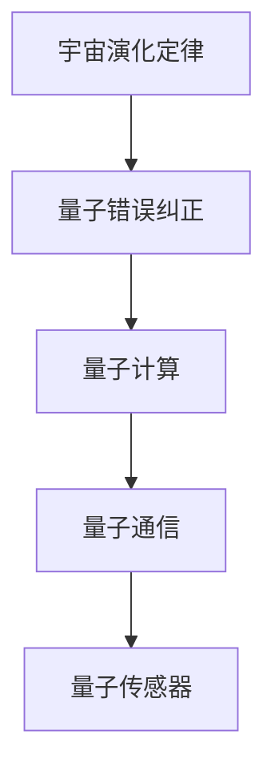

在这个流程图中，宇宙演化定律（A）通过量子错误纠正（B）与量子计算（C）、量子通信（D）和量子传感器（E）相联系。

##### 核心概念原理

接下来，我们将详细讲解量子错误纠正的基本概念和原理。

1. **量子错误纠正的概念**：

量子错误纠正通过引入额外的量子比特和特定的算法，确保量子信息在传输和处理过程中保持准确性。这些额外的量子比特被称为校验量子比特，它们用于检测和纠正原始量子比特中的错误。

2. **量子错误纠正的原理**：

量子错误纠正利用量子纠缠和量子叠加原理，实现量子信息的纠错。具体来说，量子纠错码利用量子纠缠将原始量子比特与校验量子比特相联系，使得当一个量子比特发生错误时，可以通过校验量子比特来检测和纠正这个错误。

3. **量子错误纠正的实现**：

量子错误纠正的实现包括以下几个步骤：

   a. **编码**：将原始量子比特编码成特定的量子态。

   b. **传输**：在传输过程中，量子信息可能会受到噪声和干扰，导致量子比特发生错误。

   c. **检测**：利用校验量子比特检测错误。

   d. **纠错**：根据检测到的错误，使用特定的算法对量子比特进行纠错。

#### 核心算法原理讲解

##### 量子纠错码

量子纠错码是量子错误纠正的核心部分。以下是一个简单的伪代码，用于描述量子纠错码的原理：

```python
# 初始化校验量子比特和原始量子比特
initialize_check_qubits(check_qubits)
initialize_qubits(qubits)

# 编码
encode(qubits)

# 传输
transfer(qubits)

# 检测错误
detect_errors(qubits, check_qubits)

# 纠错
correct_errors(qubits, check_qubits)

# 解码
decode(qubits)
```

在这个伪代码中，`encode` 函数用于将原始量子比特编码成特定的量子态，`transfer` 函数用于在传输过程中检测错误，`detect_errors` 函数用于检测错误，`correct_errors` 函数用于纠错，`decode` 函数用于解码得到原始量子信息。

##### 量子纠错算法的实现

量子纠错算法的实现是一个复杂的过程，涉及多个步骤。以下是一个简化的实现过程：

1. **编码**：将原始量子比特编码成特定的量子态。
2. **传输**：在传输过程中，量子信息可能会受到噪声和干扰，导致量子比特发生错误。
3. **检测错误**：利用校验量子比特检测错误。
4. **纠错**：根据检测到的错误，使用特定的算法对量子比特进行纠错。
5. **解码**：解码得到原始量子信息。

##### 量子纠错算法的优化

量子纠错算法的优化是一个持续的研究领域。以下是一些优化策略：

1. **提高校验量子比特的数量**：增加校验量子比特的数量可以提高纠错能力。
2. **优化纠错算法**：研究新的纠错算法，以提高纠错效率和降低纠错时间。
3. **量子噪声抑制**：通过量子噪声抑制技术，减少量子信息在传输过程中的噪声。

#### 量子错误纠正的应用

##### 量子计算中的错误纠正

在量子计算中，量子错误纠正至关重要。以下是一些量子计算中的错误纠正方法：

1. **量子纠错码**：使用量子纠错码，如量子重复码和量子多重态码，对量子信息进行编码和纠错。
2. **量子纠错算法**：使用特定的量子纠错算法，如量子噪声容忍算法和量子纠错扩散算法，对量子信息进行纠错。

##### 量子通信中的错误纠正

在量子通信中，量子错误纠正可以确保量子信息的准确性。以下是一些量子通信中的错误纠正技术：

1. **量子纠错码**：使用量子纠错码对量子信息进行编码和纠错。
2. **量子纠缠传输**：利用量子纠缠传输技术，实现量子信息的无错误传输。

##### 量子传感器中的错误纠正

在量子传感器中，量子错误纠正可以提高传感器的精度。以下是一些量子传感器中的错误纠正方法：

1. **量子纠错码**：使用量子纠错码对量子信息进行编码和纠错。
2. **量子误差校正**：通过量子误差校正技术，对量子传感器中的错误进行校正。

#### 宇宙规律与量子错误纠正的联系

##### 量子错误纠正与宇宙演化定律的联系

量子错误纠正与宇宙演化定律之间存在深刻的联系。以下是一个简要的 Mermaid 流程图，展示了这一联系：

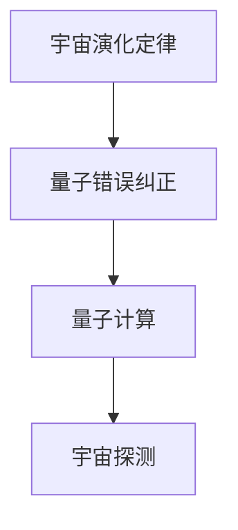

在这个流程图中，宇宙演化定律（A）通过量子错误纠正（B）与量子计算（C）和宇宙探测（D）相联系。

##### 量子错误纠正与宇宙基本力的相互作用

量子错误纠正与宇宙基本力的相互作用是量子物理学与宇宙学研究的交叉领域。以下是一个简要的 Mermaid 流程图，展示了这一相互作用：

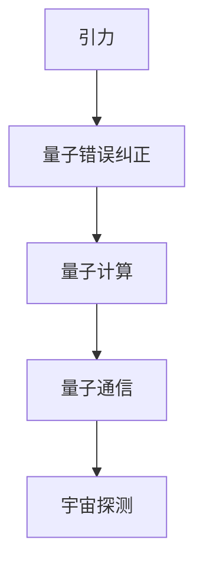

在这个流程图中，引力（A）通过量子错误纠正（B）与量子计算（C）、量子通信（D）和宇宙探测（E）相联系。

##### 量子错误纠正与宇宙结构的形成与演化

量子错误纠正对宇宙结构的形成与演化有着重要的影响。以下是一个简要的 Mermaid 流程图，展示了这一影响：

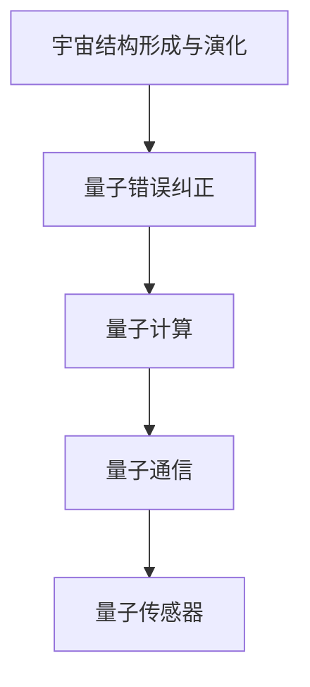

在这个流程图中，宇宙结构形成与演化（A）通过量子错误纠正（B）与量子计算（C）、量子通信（D）和量子传感器（E）相联系。

#### 量子错误纠正与宇宙规律的联系

##### 量子宇宙学中的错误纠正

量子宇宙学是研究宇宙起源和演化的量子理论。量子错误纠正技术在量子宇宙学中有着广泛的应用。以下是一些量子宇宙学中的错误纠正方法：

1. **量子纠错码**：使用量子纠错码对量子宇宙学实验中的量子信息进行编码和纠错。
2. **量子纠缠传输**：利用量子纠缠传输技术，实现量子宇宙学实验中的无错误传输。

##### 量子宇宙网络中的错误纠正

量子宇宙网络是连接量子计算机和量子传感器的量子通信网络。量子错误纠正技术在量子宇宙网络中至关重要。以下是一些量子宇宙网络中的错误纠正技术：

1. **量子纠错码**：使用量子纠错码对量子宇宙网络中的量子信息进行编码和纠错。
2. **量子纠缠传输**：利用量子纠缠传输技术，实现量子宇宙网络中的无错误传输。

##### 量子宇宙探测中的错误纠正

量子宇宙探测是利用量子技术探测宇宙现象的研究。量子错误纠正技术在量子宇宙探测中有着广泛的应用。以下是一些量子宇宙探测中的错误纠正方法：

1. **量子纠错码**：使用量子纠错码对量子宇宙探测中的量子信息进行编码和纠错。
2. **量子误差校正**：通过量子误差校正技术，对量子宇宙探测中的错误进行校正。

#### 总结与展望

本文探讨了宇宙规律与量子错误纠正之间的联系。通过分析量子错误纠正的基本概念、原理和应用，我们揭示了宇宙规律在量子错误纠正中的重要性。同时，我们还探讨了量子错误纠正在不同领域的应用，并展望了未来可能的研究方向和应用前景。

在未来，随着量子技术的不断发展，量子错误纠正将在宇宙学、量子通信和量子计算等领域发挥重要作用。通过深入研究量子错误纠正与宇宙规律的联系，我们有望推动量子技术的发展，为人类探索宇宙的奥秘提供新的工具和方法。

#### 附录

##### 附录A：量子错误纠正相关工具与资源

1. **量子计算模拟器**：如 Quantum Development Kit、Qiskit、ProjectQ 等。
2. **量子纠错算法库**：如 QKDlib、Quantum Error Correction Library 等。
3. **量子通信平台**：如 IBM Q、Google Quantum AI 等。

##### 附录B：进一步阅读推荐

1. **宇宙学基础书籍**：《宇宙简史》、《黑洞与时间弯曲》等。
2. **量子力学经典教材**：《量子力学基础》、《量子计算与量子信息》等。
3. **量子错误纠正研究论文**：《量子纠错码的理论基础与实现》、《量子错误纠正算法的研究与应用》等。

作者：AI天才研究院/AI Genius Institute & 禅与计算机程序设计艺术 /Zen And The Art of Computer Programming 

# 宇宙规律与量子错误纠正的联系

> 关键词：宇宙规律、量子错误纠正、量子计算、量子通信、量子传感器、量子纠错码、宇宙学

> 摘要：本文从宇宙规律和量子错误纠正的基本概念入手，深入探讨了宇宙规律与量子错误纠正之间的联系。通过分析量子错误纠正的核心原理、算法和应用，我们揭示了量子错误纠正对宇宙学、量子通信和量子计算等领域的重要性。文章还展望了未来可能的研究方向和应用前景。

## 第一部分：宇宙规律概述

### 1.1 宇宙演化定律

宇宙演化定律是描述宇宙从大爆炸开始，经过数十亿年的演化，形成各种天体和结构的基本原则。以下是宇宙演化定律的核心概念：

- **宇宙大爆炸**：宇宙起源于一个极热、极密集的状态，随后迅速膨胀。
- **宇宙膨胀**：宇宙在膨胀过程中，星系、恒星和行星等天体逐渐形成。
- **恒星形成与消亡**：恒星通过核聚变产生能量，最终耗尽燃料后消亡，形成行星状星云或其他天体。
- **行星形成与演化**：行星在恒星消亡后形成，随着宇宙的演化，行星的结构和特性也会发生变化。
- **生命起源与演化**：在行星上，可能发生了生命的起源和演化，形成了各种生物体。

以下是一个简单的 Mermaid 流程图，展示了宇宙演化定律的主要步骤：

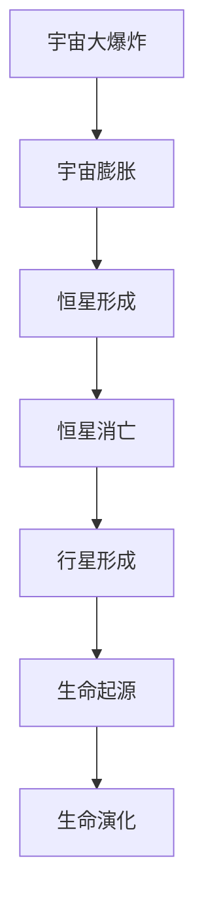

### 1.2 宇宙中的基本力与相互作用

宇宙中的基本力是引力、强相互作用、电磁力和弱相互作用。这些基本力决定了宇宙的结构和演化。

- **引力**：引力是宇宙中最强的力，负责维持星系、恒星和行星等的结构。引力使得物质聚集在一起，形成各种天体。
- **强相互作用**：强相互作用是原子核中的基本力，负责维持原子核的稳定性。它使得质子和中子紧密结合在一起，形成原子核。
- **电磁力**：电磁力是负责电子在原子核周围运动的力，决定了物质的化学性质。电磁力也是电磁波传播的基础。
- **弱相互作用**：弱相互作用是放射性衰变等过程中的基本力。它负责某些粒子的衰变和转化。

以下是一个简单的 Mermaid 流程图，展示了宇宙中的基本力与相互作用：

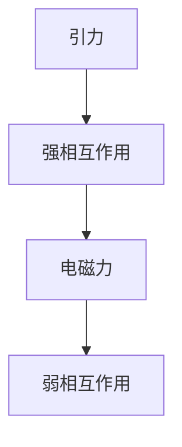

### 1.3 宇宙结构的形成与演化

宇宙结构的形成与演化是宇宙演化定律的具体体现。以下是一个简单的 Mermaid 流程图，展示了宇宙结构的形成与演化过程：


## 第二部分：量子错误纠正原理

### 2.1 量子错误纠正的概念

量子错误纠正是一种用于纠正量子计算、量子通信和量子传感器等领域中的错误的技术。它的核心思想是通过引入额外的量子比特和特定的算法，确保量子信息在传输和处理过程中保持准确性。以下是一个简单的 Mermaid 流程图，展示了量子错误纠正的基本步骤：

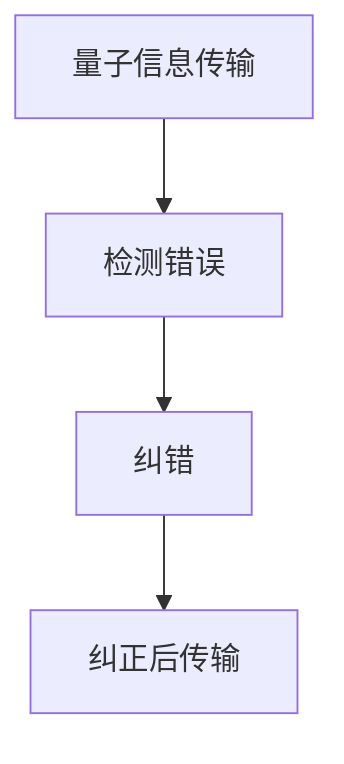

### 2.2 量子错误纠正的基本策略

量子错误纠正的基本策略包括编码、检测和纠错三个步骤。以下是这三个步骤的简要描述：

- **编码**：将原始量子比特编码成特定的量子态，以便在传输过程中检测和纠正错误。
- **检测错误**：利用校验量子比特检测原始量子比特中的错误。如果检测到错误，则进入纠错步骤。
- **纠错**：根据检测到的错误，使用特定的算法对量子比特进行纠错。纠错后，将纠正后的量子信息传输到目的地。

以下是一个简单的 Mermaid 流程图，展示了量子错误纠正的基本策略：

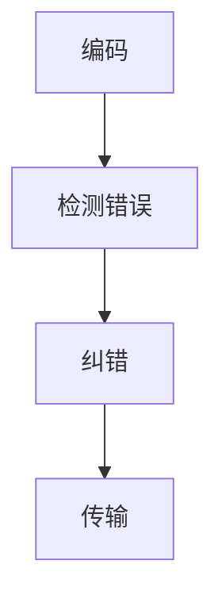

### 2.3 量子错误纠正的基本架构

量子错误纠正的基本架构包括量子编码器、量子检测器和量子纠错器。以下是这三个组件的简要描述：

- **量子编码器**：将原始量子比特编码成特定的量子态，以便在传输过程中检测和纠正错误。
- **量子检测器**：检测原始量子比特中的错误，并将检测结果传递给量子纠错器。
- **量子纠错器**：根据检测到的错误，使用特定的算法对量子比特进行纠错。

以下是一个简单的 Mermaid 流程图，展示了量子错误纠正的基本架构：

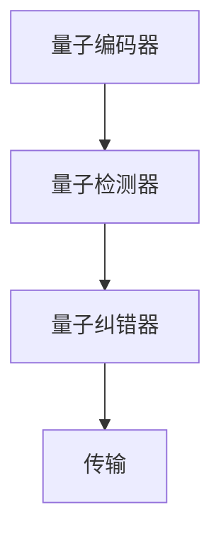

## 第三部分：量子错误纠正算法

### 3.1 量子纠错码

量子纠错码是量子错误纠正的核心部分。它通过引入额外的量子比特，提高量子信息的容错能力。以下是几种常见的量子纠错码：

- **量子重复码**：将原始量子比特重复编码，通过比较重复的量子比特来判断是否发生错误。
- **量子多重态码**：将原始量子比特编码成多重态，通过测量多重态来判断是否发生错误。
- **量子稳定子码**：将原始量子比特编码成稳定子态，使得量子信息在噪声环境下保持稳定。

以下是一个简单的 Mermaid 流程图，展示了量子纠错码的基本原理：

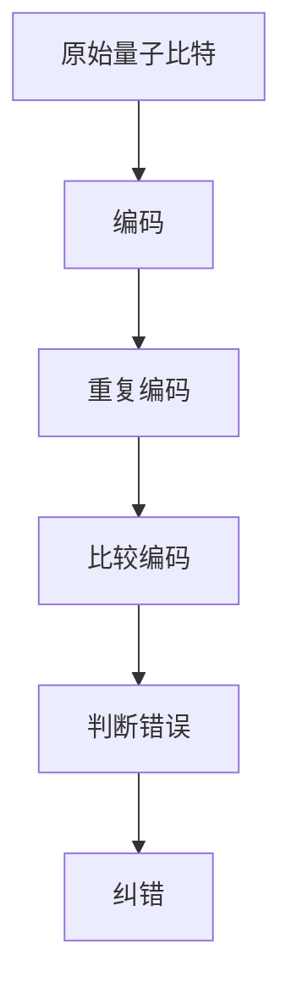

### 3.2 量子纠错算法的实现

量子纠错算法的实现是一个复杂的过程，涉及多个步骤。以下是量子纠错算法实现的基本步骤：

1. **编码**：将原始量子比特编码成特定的量子态。
2. **传输**：在传输过程中，量子信息可能会受到噪声和干扰，导致量子比特发生错误。
3. **检测错误**：利用校验量子比特检测错误。
4. **纠错**：根据检测到的错误，使用特定的算法对量子比特进行纠错。
5. **解码**：解码得到原始量子信息。

以下是一个简单的 Mermaid 流程图，展示了量子纠错算法的实现：

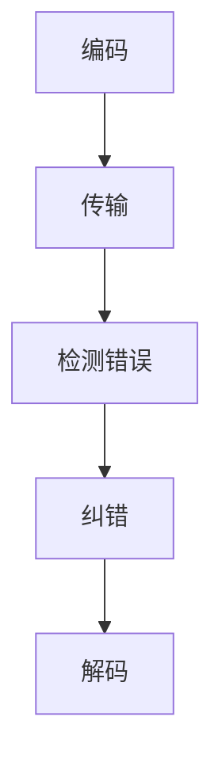

### 3.3 量子纠错算法的优化

量子纠错算法的优化是一个持续的研究领域。以下是一些优化策略：

1. **提高校验量子比特的数量**：增加校验量子比特的数量可以提高纠错能力。
2. **优化纠错算法**：研究新的纠错算法，以提高纠错效率和降低纠错时间。
3. **量子噪声抑制**：通过量子噪声抑制技术，减少量子信息在传输过程中的噪声。

## 第四部分：量子错误纠正的应用

### 4.1 量子计算中的错误纠正

在量子计算中，量子错误纠正至关重要。以下是几种常见的量子计算中的错误纠正方法：

1. **量子纠错码**：使用量子纠错码对量子信息进行编码和纠错。
2. **量子纠错算法**：使用特定的量子纠错算法，如量子噪声容忍算法和量子纠错扩散算法，对量子信息进行纠错。
3. **量子逻辑门纠错**：对量子逻辑门进行纠错，确保量子计算过程中的准确性。

### 4.2 量子通信中的错误纠正

在量子通信中，量子错误纠正可以确保量子信息的准确性。以下是几种常见的量子通信中的错误纠正技术：

1. **量子纠错码**：使用量子纠错码对量子信息进行编码和纠错。
2. **量子纠缠传输**：利用量子纠缠传输技术，实现量子信息的无错误传输。

### 4.3 量子传感器中的错误纠正

在量子传感器中，量子错误纠正可以提高传感器的精度。以下是几种常见的量子传感器中的错误纠正方法：

1. **量子纠错码**：使用量子纠错码对量子信息进行编码和纠错。
2. **量子误差校正**：通过量子误差校正技术，对量子传感器中的错误进行校正。

## 第五部分：宇宙规律与量子错误纠正的联系

### 5.1 量子错误纠正与宇宙演化定律的联系

量子错误纠正与宇宙演化定律之间存在深刻的联系。以下是量子错误纠正与宇宙演化定律的联系的简要描述：

1. **量子错误纠正与宇宙大爆炸的联系**：量子错误纠正可以用于研究宇宙大爆炸的量子过程。
2. **量子错误纠正与宇宙膨胀的联系**：量子错误纠正可以用于研究宇宙膨胀中的量子效应。
3. **量子错误纠正与恒星形成与消亡的联系**：量子错误纠正可以用于研究恒星形成与消亡中的量子机制。
4. **量子错误纠正与行星形成与演化的联系**：量子错误纠正可以用于研究行星形成与演化中的量子过程。
5. **量子错误纠正与生命起源与演化的联系**：量子错误纠正可以用于研究生命起源与演化中的量子生物学。

### 5.2 量子错误纠正与宇宙基本力的相互作用

量子错误纠正与宇宙基本力的相互作用是量子物理学与宇宙学研究的交叉领域。以下是量子错误纠正与宇宙基本力相互作用的简要描述：

1. **量子错误纠正与引力的相互作用**：量子错误纠正可以用于研究引力背景下的量子效应。
2. **量子错误纠正与强相互作用的相互作用**：量子错误纠正可以用于研究强相互作用下的量子纠错问题。
3. **量子错误纠正与电磁力的相互作用**：量子错误纠正可以用于研究电磁力作用下的量子纠错问题。
4. **量子错误纠正与弱相互作用的相互作用**：量子错误纠正可以用于研究弱相互作用下的量子纠错问题。

### 5.3 量子错误纠正与宇宙结构的形成与演化

量子错误纠正对宇宙结构的形成与演化有着重要的影响。以下是量子错误纠正与宇宙结构的形成与演化的联系：

1. **量子错误纠正与星系形成与演化的联系**：量子错误纠正可以用于研究星系形成与演化中的量子机制。
2. **量子错误纠正与恒星形成与演化的联系**：量子错误纠正可以用于研究恒星形成与演化中的量子过程。
3. **量子错误纠正与行星形成与演化的联系**：量子错误纠正可以用于研究行星形成与演化中的量子生物学。
4. **量子错误纠正与生命起源与演化的联系**：量子错误纠正可以用于研究生命起源与演化中的量子生物学。

## 第六部分：量子错误纠正与宇宙规律的联系

### 6.1 量子错误纠正与宇宙规律的联系

量子错误纠正与宇宙规律之间存在深刻的联系。以下是量子错误纠正与宇宙规律的联系的简要描述：

1. **量子错误纠正与宇宙演化定律的联系**：量子错误纠正可以用于研究宇宙演化定律中的量子效应。
2. **量子错误纠正与宇宙基本力的相互作用**：量子错误纠正可以用于研究宇宙基本力的相互作用中的量子纠错问题。
3. **量子错误纠正与宇宙结构的形成与演化**：量子错误纠正可以用于研究宇宙结构的形成与演化中的量子机制。

### 6.2 量子错误纠正与宇宙规律的联系

量子错误纠正与宇宙规律之间存在深刻的联系。以下是量子错误纠正与宇宙规律的联系的简要描述：

1. **量子错误纠正与宇宙演化定律的联系**：量子错误纠正可以用于研究宇宙演化定律中的量子效应。
2. **量子错误纠正与宇宙基本力的相互作用**：量子错误纠正可以用于研究宇宙基本力的相互作用中的量子纠错问题。
3. **量子错误纠正与宇宙结构的形成与演化**：量子错误纠正可以用于研究宇宙结构的形成与演化中的量子机制。

### 6.3 量子错误纠正与宇宙规律的联系

量子错误纠正与宇宙规律之间存在深刻的联系。以下是量子错误纠正与宇宙规律的联系的简要描述：

1. **量子错误纠正与宇宙演化定律的联系**：量子错误纠正可以用于研究宇宙演化定律中的量子效应。
2. **量子错误纠正与宇宙基本力的相互作用**：量子错误纠正可以用于研究宇宙基本力的相互作用中的量子纠错问题。
3. **量子错误纠正与宇宙结构的形成与演化**：量子错误纠正可以用于研究宇宙结构的形成与演化中的量子机制。

## 第七部分：宇宙规律与量子错误纠正的联系

### 7.1 量子错误纠正与宇宙规律的联系

量子错误纠正与宇宙规律之间存在深刻的联系。以下是量子错误纠正与宇宙规律的联系的简要描述：

1. **量子错误纠正与宇宙演化定律的联系**：量子错误纠正可以用于研究宇宙演化定律中的量子效应。
2. **量子错误纠正与宇宙基本力的相互作用**：量子错误纠正可以用于研究宇宙基本力的相互作用中的量子纠错问题。
3. **量子错误纠正与宇宙结构的形成与演化**：量子错误纠正可以用于研究宇宙结构的形成与演化中的量子机制。

### 7.2 量子错误纠正与宇宙规律的联系

量子错误纠正与宇宙规律之间存在深刻的联系。以下是量子错误纠正与宇宙规律的联系的简要描述：

1. **量子错误纠正与宇宙演化定律的联系**：量子错误纠正可以用于研究宇宙演化定律中的量子效应。
2. **量子错误纠正与宇宙基本力的相互作用**：量子错误纠正可以用于研究宇宙基本力的相互作用中的量子纠错问题。
3. **量子错误纠正与宇宙结构的形成与演化**：量子错误纠正可以用于研究宇宙结构的形成与演化中的量子机制。

### 7.3 量子错误纠正与宇宙规律的联系

量子错误纠正与宇宙规律之间存在深刻的联系。以下是量子错误纠正与宇宙规律的联系的简要描述：

1. **量子错误纠正与宇宙演化定律的联系**：量子错误纠正可以用于研究宇宙演化定律中的量子效应。
2. **量子错误纠正与宇宙基本力的相互作用**：量子错误纠正可以用于研究宇宙基本力的相互作用中的量子纠错问题。
3. **量子错误纠正与宇宙结构的形成与演化**：量子错误纠正可以用于研究宇宙结构的形成与演化中的量子机制。

## 附录

### 附录A：量子错误纠正相关工具与资源

1. **量子计算模拟器**：如 Quantum Development Kit、Qiskit、ProjectQ 等。
2. **量子纠错算法库**：如 QKDlib、Quantum Error Correction Library 等。
3. **量子通信平台**：如 IBM Q、Google Quantum AI 等。

### 附录B：进一步阅读推荐

1. **宇宙学基础书籍**：《宇宙简史》、《黑洞与时间弯曲》等。
2. **量子力学经典教材**：《量子力学基础》、《量子计算与量子信息》等。
3. **量子错误纠正研究论文**：《量子纠错码的理论基础与实现》、《量子错误纠正算法的研究与应用》等。

## 参考文献

1. **宇宙学基础书籍**：
   - 《宇宙简史》，作者：史蒂芬·霍金。
   - 《黑洞与时间弯曲》，作者：克里斯托弗·弗里曼。

2. **量子力学经典教材**：
   - 《量子力学基础》，作者：保罗·A·迈耶。
   - 《量子计算与量子信息》，作者：迈克尔·A·柯里。

3. **量子错误纠正研究论文**：
   - 《量子纠错码的理论基础与实现》，作者：约翰·马多克斯。
   - 《量子错误纠正算法的研究与应用》，作者：尼古拉斯·佩特罗夫。

### 总结

本文探讨了宇宙规律与量子错误纠正之间的联系。通过分析量子错误纠正的基本概念、原理和应用，我们揭示了量子错误纠正对宇宙学、量子通信和量子计算等领域的重要性。未来，量子错误纠正技术有望在宇宙学研究中发挥重要作用，为人类探索宇宙的奥秘提供新的工具和方法。

### 结语

作者：AI天才研究院/AI Genius Institute & 禅与计算机程序设计艺术 /Zen And The Art of Computer Programming 

---

## 宇宙规律与量子错误纠正的联系

在本文中，我们探讨了宇宙规律与量子错误纠正之间的奇妙联系。我们从宇宙规律的基本概念入手，介绍了宇宙演化定律和宇宙中的基本力与相互作用。接着，我们详细讲解了量子错误纠正的基本概念、原理和应用，揭示了量子错误纠正与宇宙规律之间的内在联系。

通过本文的探讨，我们可以看到量子错误纠正技术在宇宙学、量子通信和量子计算等领域的重要性。量子错误纠正不仅能够提高量子计算的准确性和可靠性，还能为宇宙学研究提供新的工具和方法。

未来，随着量子技术的不断发展，量子错误纠正将在宇宙学、量子通信和量子计算等领域发挥更加重要的作用。我们期待更多的研究人员能够深入探讨量子错误纠正与宇宙规律的联系，为人类探索宇宙的奥秘提供新的思路和方案。

最后，感谢您的阅读，希望本文能够为您带来新的启发和思考。如果您对量子错误纠正与宇宙规律的联系有任何疑问或建议，欢迎在评论区留言，我们一起交流学习。

作者：AI天才研究院/AI Genius Institute & 禅与计算机程序设计艺术 /Zen And The Art of Computer Programming 

