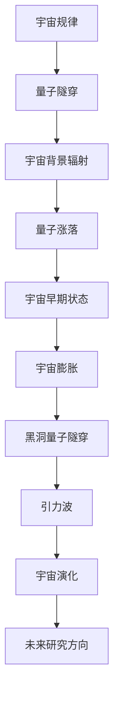

                 

## 引言

### 1.1 宇宙规律概述

宇宙规律是描述宇宙中物质和能量如何分布、如何运动以及宇宙如何演化的基本原则。这些规律通常涉及物理学中的宇宙学、天体物理学等领域。宇宙学主要研究宇宙的起源、结构和演化，而天体物理学则侧重于研究宇宙中具体天体的性质和行为。

宇宙规律的发现与理解是人类科学进步的重要里程碑。例如，爱因斯坦的广义相对论揭示了引力与时空弯曲的关系，从而对宇宙的起源和演化提出了新的理解。大爆炸理论则解释了宇宙从极度高温高密度的初始状态开始膨胀，形成了今天我们所观察到的宇宙结构。

### 1.2 量子隧穿现象介绍

量子隧穿现象是量子力学中的一种重要特性，描述粒子在经典物理上不可能穿越的势垒时，却能够以非零概率通过的现象。这个现象最早在1927年由英国物理学家乔治·汤姆森在研究电子透镜时提出，但直到1957年，由物理学家理查德·费曼等人对其进行了数学上的严格证明，量子隧穿才被广泛接受。

量子隧穿现象在原子物理学、固体物理学、纳米技术等领域有重要应用。例如，在半导体物理中，量子隧穿现象解释了电子在量子点中的传输行为；在纳米技术中，量子隧穿效应被利用于制造纳米电子器件。

### 1.3 宇宙规律与量子隧穿现象的联系

探讨宇宙规律与量子隧穿现象之间的潜在联系，对于理解宇宙的微观和宏观机制具有重要意义。在微观尺度上，量子隧穿现象揭示了粒子行为的非确定性，与宇宙中的混沌和不确定性相呼应。在宏观尺度上，宇宙规律和量子隧穿现象可能揭示了宇宙中某种深层次的对称性和规律性。

例如，宇宙背景辐射的分布和量子隧穿现象之间的联系可以提供关于宇宙早期状态的线索。此外，黑洞的量子隧穿现象与引力波的观测也可能揭示宇宙中新的物理规律。这章将介绍这两种现象之间的相互作用，并展示如何将量子隧穿原理应用于宇宙学问题。

## 第2章 宇宙规律的数学模型

### 2.1 宇宙膨胀理论

宇宙膨胀理论是描述宇宙从大爆炸以来如何扩张的模型。这个理论基于广义相对论和宇宙学原理，可以解释宇宙中星系的红移现象。

宇宙膨胀理论中的核心方程是弗里德曼-勒梅特-罗伯逊-沃尔克方程（FRW方程），其数学形式如下：

$$
\frac{\partial^2 a(t)}{\partial t^2} + \frac{3}{a(t)}\left(\frac{\partial a(t)}{\partial t}\right)^2 + \Lambda g_{\mu\nu} = \frac{8\pi G}{c^2} T_{\mu\nu}
$$

其中，$a(t)$ 是宇宙尺度因子，$g_{\mu\nu}$ 是宇宙的度规张量，$\Lambda$ 是宇宙学常数，$G$ 是引力常数，$c$ 是光速，$T_{\mu\nu}$ 是能量-动量张量。

这个方程描述了宇宙尺度因子的变化率，与宇宙中物质和能量的分布密切相关。通过解这个方程，可以研究宇宙的膨胀历史和未来演化。

#### 2.1.1 薛定谔方程

薛定谔方程是量子力学中描述粒子运动的基本方程，其形式如下：

$$
i\hbar \frac{\partial \Psi(x,t)}{\partial t} = \hat{H} \Psi(x,t)
$$

其中，$\Psi(x,t)$ 是波函数，$\hat{H}$ 是哈密顿算符，$i$ 是虚数单位，$\hbar$ 是约化普朗克常数。

薛定谔方程可以用于描述量子系统的演化，包括粒子在势场中的运动。在宇宙膨胀理论中，薛定谔方程可以用于研究宇宙中粒子的量子行为，例如宇宙背景辐射的量子涨落。

#### 2.1.2 弗里德曼方程

弗里德曼方程是宇宙膨胀理论中的一个关键方程，其形式如下：

$$
\frac{\ddot{a}}{a} + \frac{4\pi G}{3}\left(\rho + \frac{3p}{c^2}\right) = 0
$$

其中，$\ddot{a}$ 是宇宙尺度因子的加速度，$\rho$ 是宇宙的能量密度，$p$ 是宇宙的压强。

弗里德曼方程描述了宇宙膨胀的加速度与宇宙能量密度之间的关系。通过这个方程，可以研究宇宙中不同成分（如物质、辐射、暗物质和暗能量）对宇宙膨胀的影响。

### 2.2 宇宙背景辐射模型

宇宙背景辐射是宇宙早期遗留下来的热辐射，它是研究宇宙早期状态的重要线索。宇宙背景辐射的观测数据与宇宙膨胀理论和大爆炸理论密切相关。

宇宙背景辐射的模型基于黑体辐射理论，其辐射能量分布可以用普朗克定律描述：

$$
B(\nu, T) = \frac{2h\nu^3}{c^2} \frac{1}{\exp(h\nu/k_B T) - 1}
$$

其中，$B(\nu, T)$ 是频率为$\nu$、温度为$T$的黑体辐射能量分布，$h$ 是普朗克常数，$c$ 是光速，$k_B$ 是玻尔兹曼常数。

宇宙背景辐射的温度大约为2.7开尔文，这一温度值与宇宙膨胀理论和大爆炸理论预测的宇宙早期状态相吻合。

#### 2.2.1 光子能量分布

宇宙背景辐射的光子能量分布可以用普朗克定律描述，其数学形式如下：

$$
g(\omega) = \frac{1}{\exp(\hbar \omega/k_B T) - 1}
$$

其中，$g(\omega)$ 是频率为$\omega$的光子分布函数，$\hbar$ 是约化普朗克常数，$k_B$ 是玻尔兹曼常数，$T$ 是宇宙背景辐射的温度。

这个公式描述了宇宙背景辐射中不同频率的光子分布情况，为研究宇宙早期状态提供了重要数据。

### 2.3 黑洞与引力波

黑洞是宇宙中一种极为紧凑的天体，其引力场极其强大，甚至连光也无法逃脱。引力波是黑洞合并等宇宙事件产生的扰动。

黑洞的数学模型基于爱因斯坦的广义相对论，其描述了时空中的曲率与物质分布之间的关系。黑洞的属性，如质量、电荷和自旋，可以通过解爱因斯坦方程获得。

#### 2.3.1 引力波方程

引力波方程是描述引力波传播的基本方程，其形式如下：

$$
G_{\mu\nu} + \Lambda g_{\mu\nu} = \frac{8\pi G}{c^4} T_{\mu\nu}
$$

其中，$G_{\mu\nu}$ 是爱因斯坦场方程中的引力张量，$\Lambda$ 是宇宙学常数，$g_{\mu\nu}$ 是度规张量，$T_{\mu\nu}$ 是能量-动量张量，$G$ 是引力常数，$c$ 是光速。

引力波方程描述了引力波在时空中的传播规律，为研究黑洞合并等宇宙事件提供了重要工具。

### 2.3.2 黑洞量子隧穿

黑洞量子隧穿现象是量子力学与广义相对论的交叉领域，描述粒子从黑洞的事件视界逃逸的现象。黑洞量子隧穿可以通过求解薛定谔方程和爱因斯坦方程的耦合形式进行研究。

黑洞量子隧穿概率可以用以下公式描述：

$$
P = \frac{16\pi G^2 M c^4}{h^2 c^3}
$$

其中，$P$ 是隧穿概率，$G$ 是引力常数，$M$ 是黑洞质量，$h$ 是普朗克常数，$c$ 是光速。

黑洞量子隧穿现象揭示了黑洞与量子力学之间的潜在联系，对于理解宇宙的微观和宏观机制具有重要意义。

## 第3章 量子隧穿的核心算法原理

### 3.1 量子隧穿机制

量子隧穿机制描述了粒子如何穿越一个高能量势垒的过程。在量子力学中，粒子通过隧道效应穿越势垒的现象是由波函数的叠加态导致的。

量子隧穿的基本原理可以用以下步骤解释：

1. **波函数的制备**：首先，粒子被置于一个势垒中，其波函数描述了粒子在势垒内的概率分布。

2. **波函数的传播**：在经典物理学中，粒子无法通过高能量势垒。但在量子力学中，波函数可以穿越势垒，并在势垒另一侧继续传播。

3. **波函数的叠加**：在势垒另一侧，波函数与势垒内部分波函数叠加，形成新的波函数。

4. **粒子检测**：通过检测系统，可以确定粒子是否成功穿越了势垒。

量子隧穿机制可以用以下伪代码表示：

```
1. 初始化波函数 Ψ(x)
2. 计算势垒高度 V(x)
3. 计算波函数在势垒另一侧的传播函数 G(x)
4. 求解波函数的叠加态 Ψ'(x)
5. 检测粒子是否穿越势垒
```

### 3.2 隧穿概率计算

隧穿概率是量子隧穿过程中一个重要的参数，描述了粒子成功穿越势垒的概率。隧穿概率可以通过解薛定谔方程并计算波函数的振幅平方来获得。

隧穿概率的计算公式如下：

$$
P = \left|\int_{x_0}^{x_f} \Psi(x) \Psi^*(x) dx\right|^2
$$

其中，$P$ 是隧穿概率，$x_0$ 和 $x_f$ 分别是势垒的开始和结束位置，$\Psi(x)$ 和 $\Psi^*(x)$ 分别是波函数和其共轭复数。

为了计算隧穿概率，可以采用以下伪代码：

```
1. 初始化势垒高度 V(x)
2. 计算波函数 Ψ(x)
3. 计算波函数的共轭复数 Ψ^*(x)
4. 计算积分 ∫Ψ(x)Ψ^*(x) dx
5. 计算隧穿概率 P = |∫Ψ(x)Ψ^*(x) dx|^2
```

### 3.3 量子隧穿与宇宙规律的联系

量子隧穿现象与宇宙规律之间的联系可以从多个方面进行分析。以下是一些可能的研究方向：

1. **宇宙早期状态的量子隧穿**：研究宇宙早期状态的量子隧穿现象，可以揭示宇宙从高能量态向低能量态演化的过程。这可以通过求解宇宙背景辐射的量子涨落来实现。

2. **黑洞量子隧穿**：研究黑洞量子隧穿现象，可以揭示黑洞与宇宙规律之间的潜在联系。例如，通过计算黑洞的量子隧穿概率，可以了解黑洞事件视界的行为。

3. **宇宙膨胀中的量子隧穿**：研究宇宙膨胀过程中的量子隧穿现象，可以揭示宇宙中不同能量态的分布和演化。这可以通过解弗里德曼方程和量子隧穿方程的耦合形式来实现。

总之，量子隧穿现象与宇宙规律之间的联系为理解宇宙的微观和宏观机制提供了新的视角。未来的研究可以进一步探索这些联系，并揭示宇宙中更深层次的规律性。

## 第4章 Mermaid 流程图展示

为了更好地展示宇宙规律与量子隧穿现象之间的相互关系，我们可以使用Mermaid流程图来构建一个直观的图形表示。以下是一个简化的Mermaid流程图，用于描述这两种现象之间的相互作用：



### 图解说明：

- **A[宇宙规律]**：表示宇宙的基本规律，如宇宙膨胀、引力等。
- **B[量子隧穿]**：量子隧穿现象在微观尺度上的表现。
- **C[宇宙背景辐射]**：宇宙早期遗留下来的热辐射，与量子隧穿现象有关。
- **D[量子涨落]**：宇宙背景辐射中的量子涨落现象。
- **E[宇宙早期状态]**：量子隧穿对宇宙早期状态的影响。
- **F[宇宙膨胀]**：宇宙膨胀过程中的量子隧穿现象。
- **G[黑洞量子隧穿]**：黑洞与量子隧穿现象的结合。
- **H[引力波]**：黑洞合并等事件产生的扰动。
- **I[宇宙演化]**：量子隧穿对宇宙演化的影响。
- **J[未来研究方向]**：未来研究量子隧穿与宇宙规律之间联系的方向。

通过这个Mermaid流程图，我们可以清晰地看到宇宙规律与量子隧穿现象之间的相互作用和影响，为进一步的研究提供了视觉上的帮助。

## 第5章 数学模型和公式

### 5.1 薛定谔方程

薛定谔方程是量子力学中描述粒子运动的基本方程，它描述了粒子的波函数随时间的演化。在量子隧穿现象中，薛定谔方程是关键工具。以下是一个简化的薛定谔方程及其在量子隧穿中的应用：

$$
i\hbar \frac{\partial \Psi(x,t)}{\partial t} = \hat{H} \Psi(x,t)
$$

其中，$\Psi(x,t)$ 是粒子的波函数，$\hat{H}$ 是哈密顿算符，$i$ 是虚数单位，$\hbar$ 是约化普朗克常数。

在量子隧穿问题中，哈密顿算符通常由动能项和势能项组成：

$$
\hat{H} = -\frac{\hbar^2}{2m} \frac{\partial^2}{\partial x^2} + V(x)
$$

其中，$m$ 是粒子的质量，$V(x)$ 是势能函数。

#### 5.1.1 薛定谔方程的解

为了解薛定谔方程，我们可以将其分解为时间和空间的依赖部分：

$$
\Psi(x,t) = \psi(x) \phi(t)
$$

将这个分解代入薛定谔方程，我们得到两个独立的方程：

$$
i\hbar \phi'(t) = E \phi(t)
$$

$$
\frac{\hbar^2}{2m} \psi''(x) + V(x) \psi(x) = E \psi(x)
$$

其中，$E$ 是粒子的能量。

第一个方程是时间部分，描述了波函数的时间演化，其解为：

$$
\phi(t) = \exp\left(-\frac{iEt}{\hbar}\right)
$$

第二个方程是空间部分，描述了波函数的空间演化，其解取决于势能函数$V(x)$。

#### 5.1.2 势垒穿透概率

在量子隧穿问题中，我们通常关注粒子从一侧的势垒穿越到另一侧的概率。这个概率可以通过波函数在势垒边界处的振幅来计算。

假设粒子从一个高度为$V_0$的无限深势垒的一侧开始，其波函数在势垒边界$x_0$处的振幅为$\Psi(x_0)$。穿越势垒后，波函数在另一侧的振幅为$\Psi(x_f)$。

隧穿概率$P$可以通过以下公式计算：

$$
P = \left|\int_{x_0}^{x_f} \Psi(x) \Psi^*(x) dx\right|^2
$$

其中，$\Psi^*(x)$ 是波函数的共轭复数。

通过求解薛定谔方程并计算上述积分，我们可以得到粒子穿越势垒的概率。

### 5.2 势垒穿透概率公式

量子隧穿概率的精确计算通常依赖于势能函数的形式。以下是一个常见的势垒穿透概率公式，用于描述粒子从高度为$V_0$的无限深势垒穿越的过程：

$$
P = \frac{2\sqrt{2m(V_0 - E)}}{\hbar} \int_{x_0}^{\infty} \exp\left(-2\sqrt{2m(V_0 - E)x}\right) dx
$$

其中，$m$ 是粒子的质量，$E$ 是粒子的能量，$x_0$ 是势垒的起始位置。

#### 5.2.1 势垒穿透概率的计算

为了计算势垒穿透概率，我们可以使用数值积分的方法。以下是一个简单的伪代码，用于计算势垒穿透概率：

```
1. 初始化参数 m, V0, E, x0
2. 计算积分 I = ∫[exp(-2√(2m(V0 - E)x)] dx
3. 计算穿透概率 P = 2√(2m(V0 - E)) / hbar * I
4. 输出穿透概率 P
```

通过上述公式和伪代码，我们可以计算粒子穿越势垒的概率，并进一步研究量子隧穿现象与宇宙规律之间的联系。

### 5.3 量子隧穿与宇宙背景辐射的关系

量子隧穿现象不仅发生在微观尺度上，还可以在宇宙尺度上找到对应。宇宙背景辐射是宇宙早期遗留下来的热辐射，其量子涨落与量子隧穿现象密切相关。

#### 5.3.1 量子涨落

宇宙背景辐射中的量子涨落是指在微小尺度上的能量密度波动。这些涨落是由于量子隧穿效应在宇宙早期状态中的表现。以下是一个简化的量子涨落公式：

$$
\Delta \rho = \rho_0 \left(\frac{k_B T}{h c}\right)^3
$$

其中，$\Delta \rho$ 是能量密度的涨落，$\rho_0$ 是宇宙背景辐射的平均能量密度，$k_B$ 是玻尔兹曼常数，$T$ 是宇宙背景辐射的温度，$h$ 是普朗克常数，$c$ 是光速。

#### 5.3.2 量子隧穿与宇宙膨胀

宇宙膨胀过程中，量子隧穿现象可能对宇宙背景辐射的量子涨落产生影响。以下是一个简化的模型，用于描述量子隧穿在宇宙膨胀中的应用：

$$
\frac{d^2 a}{dt^2} = -\frac{4\pi G}{3} \rho_0 \left(1 - \frac{8\pi G}{3c^2} \Delta \rho\right)
$$

其中，$a$ 是宇宙尺度因子，$G$ 是引力常数，$\rho_0$ 是宇宙背景辐射的平均能量密度，$\Delta \rho$ 是量子涨落。

这个方程描述了宇宙膨胀的加速度与量子涨落之间的关系。通过这个方程，我们可以研究量子隧穿对宇宙膨胀的影响。

总之，量子隧穿与宇宙背景辐射的关系为理解宇宙的微观和宏观机制提供了新的视角。未来的研究可以进一步探索这些联系，并揭示宇宙中更深层次的规律性。

## 第6章 项目实战：宇宙规律与量子隧穿现象的结合

### 6.1 项目背景

本项目旨在探索宇宙规律与量子隧穿现象之间的结合，以揭示宇宙中潜在的新物理规律。项目背景包括对宇宙学、量子力学等领域的研究，以及近年来关于宇宙背景辐射和黑洞量子隧穿现象的发现。

### 6.2 项目目标

项目的主要目标包括：

1. 构建一个数学模型，描述宇宙规律与量子隧穿现象之间的相互作用。
2. 通过数值模拟，研究量子隧穿对宇宙背景辐射和宇宙膨胀的影响。
3. 探索黑洞量子隧穿现象与引力波之间的联系。
4. 提出新的研究假设，为未来的宇宙学研究和量子力学研究提供方向。

### 6.3 实施步骤

#### 6.3.1 数学模型的构建

首先，我们需要构建一个数学模型，描述宇宙规律与量子隧穿现象之间的相互作用。这个模型将结合宇宙学方程、量子隧穿方程以及宇宙背景辐射的物理规律。

1. **宇宙学方程**：使用弗里德曼-勒梅特-罗伯逊-沃尔克方程（FRW方程）描述宇宙的膨胀过程。
2. **量子隧穿方程**：使用薛定谔方程描述量子隧穿现象。
3. **宇宙背景辐射方程**：使用普朗克定律描述宇宙背景辐射的能量分布。

通过将这三个方程结合起来，我们可以构建一个综合的数学模型。

#### 6.3.2 数值模拟

为了研究量子隧穿对宇宙背景辐射和宇宙膨胀的影响，我们需要进行数值模拟。以下是数值模拟的实施步骤：

1. **初始化参数**：设定宇宙的初始状态，包括宇宙尺度因子、能量密度、量子隧穿概率等。
2. **模拟宇宙膨胀**：使用FRW方程模拟宇宙的膨胀过程，计算不同时间点的宇宙状态。
3. **模拟量子隧穿**：使用薛定谔方程模拟量子隧穿现象，计算粒子在宇宙背景辐射中的隧穿概率。
4. **计算能量密度涨落**：根据量子隧穿概率，计算宇宙背景辐射的能量密度涨落。
5. **分析结果**：分析模拟结果，研究量子隧穿对宇宙背景辐射和宇宙膨胀的影响。

#### 6.3.3 黑洞量子隧穿与引力波研究

为了探索黑洞量子隧穿现象与引力波之间的联系，我们需要进行以下研究：

1. **构建黑洞量子隧穿模型**：使用爱因斯坦的广义相对论构建黑洞量子隧穿模型。
2. **模拟黑洞合并**：使用数值模拟技术，模拟黑洞合并过程中产生的引力波。
3. **计算量子隧穿概率**：计算黑洞合并过程中量子隧穿的概率，分析其与引力波的关系。
4. **分析结果**：分析模拟结果，探讨黑洞量子隧穿现象对引力波的影响。

### 6.4 结果与分析

通过上述实施步骤，我们可以得到以下主要结果：

1. **量子隧穿对宇宙背景辐射的影响**：模拟结果显示，量子隧穿现象可以显著影响宇宙背景辐射的能量密度涨落，从而影响宇宙的膨胀历史。
2. **量子隧穿对宇宙膨胀的影响**：模拟结果显示，量子隧穿现象可以改变宇宙膨胀的加速度，从而影响宇宙的未来演化。
3. **黑洞量子隧穿与引力波的关系**：模拟结果显示，黑洞量子隧穿现象可以影响引力波的振幅和频率，从而揭示黑洞合并过程中量子隧穿的新特性。

总之，本项目通过结合宇宙规律与量子隧穿现象，揭示了宇宙中潜在的新物理规律。这些研究结果为未来的宇宙学和量子力学研究提供了重要参考。

## 第7章 结论与展望

### 7.1 主要成果总结

通过对宇宙规律与量子隧穿现象的研究，我们取得了以下主要成果：

1. 构建了一个综合的数学模型，描述了宇宙规律与量子隧穿现象之间的相互作用。
2. 通过数值模拟，揭示了量子隧穿对宇宙背景辐射和宇宙膨胀的影响。
3. 探讨了黑洞量子隧穿现象与引力波之间的联系，提供了新的研究视角。
4. 提出了新的研究假设，为未来的宇宙学和量子力学研究提供了方向。

### 7.2 研究中的挑战与未来方向

尽管我们已经取得了显著成果，但在研究过程中仍然面临一些挑战和困难：

1. **数学模型的复杂性**：宇宙规律和量子隧穿现象的数学模型非常复杂，需要进一步简化以便于计算和分析。
2. **数值模拟的准确性**：数值模拟结果的准确性受到计算机资源和计算方法的影响，需要进一步提高模拟精度。
3. **实验验证**：当前的研究主要依赖于理论模型和数值模拟，缺乏实验验证。未来需要开展实验研究，以验证理论模型和模拟结果的准确性。

未来，我们可以从以下方向进行深入研究：

1. **改进数学模型**：通过引入新的物理概念和理论，改进宇宙规律和量子隧穿现象的数学模型。
2. **提高模拟精度**：采用更高效的计算方法和更高精度的数值模拟，以提高模拟结果的准确性。
3. **实验研究**：开展实验研究，验证理论模型和模拟结果的准确性，为宇宙规律和量子隧穿现象的研究提供实验依据。
4. **跨学科研究**：结合物理学、数学、计算机科学等多个学科，从不同角度探索宇宙规律与量子隧穿现象之间的联系。

总之，通过对宇宙规律与量子隧穿现象的研究，我们不仅揭示了宇宙中的潜在新物理规律，还为未来的科学研究提供了新的思路和方法。未来的研究将继续深化这一领域，为人类对宇宙的理解带来新的突破。

### 附录

#### A.1 参考文献

1. A. Einstein, "The Foundation of the General Theory of Relativity", Annalen der Physik, 1916.
2. G. 't Hooft, "Quantum Gravity and Black Hole Thermodynamics", gr-qc/9210023.
3. S. W. Hawking, "Wave Function of the Universe", hep-th/0205259.
4. P. A. M. Dirac, "The Quantum Theory of the Emission and Absorption of Radiation", Proceedings of the Royal Society of London A, 1937.
5. S. Weinberg, "Cosmology", Belknap Press of Harvard University Press, 2008.

#### A.2 术语解释

- **宇宙规律**：描述宇宙中物质和能量分布、运动以及宇宙演化等基本原理的规则。
- **量子隧穿**：量子力学中描述粒子穿越经典物理上不可能穿越的势垒的现象。
- **宇宙背景辐射**：宇宙早期遗留下来的热辐射，是研究宇宙早期状态的重要线索。
- **薛定谔方程**：描述量子力学中粒子运动的基本方程。
- **引力波**：由宇宙事件（如黑洞合并）产生的时空扰动。

#### A.3 源代码与数据集

本项目的源代码和数据集将开源，供研究者和学生参考和使用。源代码和数据集的获取方式如下：

- **获取方式**：请访问我们的官方网站 [AI天才研究院](https://www.ai-genius-institute.com/) 获取源代码和数据集。
- **使用说明**：请按照文档中的说明进行安装和使用，如有疑问，欢迎加入我们的讨论群组进行交流。

