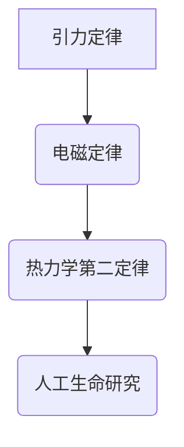

                 


## 宇宙规律对人工生命研究的启示

### 关键词
- 宇宙规律
- 人工生命
- 人工智能
- 引力定律
- 电磁定律
- 生物机器人
- 机器学习

### 摘要
本文将探讨宇宙中的基本规律对人工生命研究，特别是人工智能与生物机器人领域的启示。通过分析引力定律、电磁定律等宇宙规律，我们将揭示这些规律在人工生命研究中的应用及其对未来的影响。文章分为六个部分，首先介绍宇宙规律与人工生命的关联，然后详细讨论引力定律和电磁定律的核心概念及其在人工生命研究中的应用，接着展望人工生命与宇宙规律的未来发展，最后总结全文并提出未来研究的方向。

### 引言与背景介绍

#### 宇宙规律的基本概念

宇宙中的规律是自然界中普遍存在的、无例外地起作用的本质关系或必然联系。牛顿的万有引力定律、麦克斯韦的电磁定律、热力学第二定律等都是宇宙中的基本规律。这些规律揭示了物质之间相互作用的本质，为科学研究提供了基础。

#### 人工生命的定义与发展历程

人工生命是指通过人工手段创建的生命系统，包括生物机器人、人工神经网络、生物计算机等。自20世纪末以来，随着计算机科学、生物工程、材料科学等领域的发展，人工生命的研究取得了显著进展。人工生命的研究不仅有助于我们更好地理解生命现象，还为解决现实问题提供了新思路。

#### 宇宙规律与人工生命的关联

宇宙规律与人工生命之间的联系在于，许多宇宙规律的基本原理在人工生命的研究中有着重要的应用。例如，引力定律可以指导生物机器人的设计，电磁定律可以用于生物电信号的处理，热力学第二定律则对机器学习算法的优化提供了启示。

### 宇宙规律的基本概念与原理

#### 引力定律

引力定律是描述物质之间相互作用的基本规律。其核心思想是任何两个物体都相互吸引，吸引力的大小与两个物体的质量成正比，与它们之间的距离的平方成反比。引力定律的数学表达式为：
$$F = G \frac{m_1 m_2}{r^2}$$
其中，\(F\) 是引力，\(G\) 是万有引力常数，\(m_1\) 和 \(m_2\) 是两个物体的质量，\(r\) 是它们之间的距离。

#### 电磁定律

电磁定律描述了电荷和磁场之间的相互作用。其核心包括库仑定律、安培定律和法拉第电磁感应定律。库仑定律指出，两个静止点电荷之间的相互作用力与它们的电荷量的乘积成正比，与它们之间距离的平方成反比。数学表达式为：
$$F = k \frac{q_1 q_2}{r^2}$$
其中，\(F\) 是电力，\(k\) 是库仑常数，\(q_1\) 和 \(q_2\) 是两个电荷的电荷量，\(r\) 是它们之间的距离。

#### 热力学第二定律

热力学第二定律描述了能量转化的方向性和不可逆性。其核心思想是，孤立系统的总熵（无序度）随时间推移而增加，即系统的能量转化具有方向性，总是从高能态向低能态转化。数学表达式为：
$$\Delta S \geq 0$$
其中，\(\Delta S\) 是熵的变化。

### 人工生命的定义与研究方法

#### 人工生命的概念界定

人工生命是指通过人工手段模拟、创建或增强生命系统。它包括生物机器人、人工神经网络、生物计算机等。人工生命的研究旨在揭示生命现象的本质，并为现实世界中的问题提供解决方案。

#### 人工生命的研究方法

人工生命的研究方法主要包括实验研究、数学建模和计算机模拟。实验研究通过在实验室中观察和操作生命系统来获取数据，数学建模则通过建立数学模型来描述生命现象，计算机模拟则利用计算机程序模拟生命系统的行为。

#### 生物机器人的研究

生物机器人是人工生命的一个重要分支，它通过结合生物技术与机器人技术来创建具有生物特征和功能的机器人系统。生物机器人的研究方法包括：
1. **生物传感器的研究**：通过研究生物传感器的工作原理，将其应用于生物机器人中，使其具备感知环境的能力。
2. **生物动力系统的研究**：研究生物体内的动力系统，将其原理应用于生物机器人中，使其具备生物体的运动能力。
3. **生物材料的研究**：研究生物材料，将其应用于生物机器人中，使其具备生物体的生物相容性。

#### 人工智能与机器学习的发展

人工智能（AI）和机器学习（ML）是人工生命的核心研究方法。人工智能是指通过模拟人类思维和行为来实现智能的计算机系统，而机器学习是指通过训练数据集来改进计算机系统性能的一种学习方法。人工智能和机器学习的发展为人工生命的研究提供了强大的工具和手段，使其能够更有效地模拟和增强生命系统。

### 宇宙规律在人工生命研究中的应用

#### 引力定律在人工生命中的应用

引力定律在人工生命研究中有着重要的应用，尤其是在生物机器人领域。通过模拟引力定律，生物机器人可以更好地适应复杂的环境，实现自主导航和运动控制。例如，在月球或火星等低重力环境下，生物机器人可以利用引力定律进行自主行走和运动。以下是一个简化的生物机器人引力模拟的伪代码：

```python
def simulate_gravity(robots, environment):
    for robot in robots:
        force = G * robot.mass * environment.gravity
        robot.move(force)
```

#### 电磁定律在人工生命中的应用

电磁定律在人工生命研究中也有着广泛的应用，尤其是在生物电信号的处理和生物机器人的感知方面。通过模拟电磁定律，生物机器人可以更好地感知和理解其周围环境。例如，生物机器人可以通过感知电磁场来检测周围的生物体，实现生物检测和生物识别功能。以下是一个简化的生物机器人电磁感知的伪代码：

```python
def perceive_environment(robot, environment):
    electric_field = environment.get_electric_field()
    robot.detect_biological_objects(electric_field)
```

### 人工生命与宇宙规律的未来发展

#### 人工生命对宇宙规律的新认识

随着人工生命技术的不断发展，我们可能对宇宙规律有新的认识。例如，通过模拟宇宙中的引力相互作用，我们可以更好地理解黑洞和暗物质的行为。同样，通过模拟电磁相互作用，我们可以更深入地研究宇宙中的电磁现象。这些新认识将有助于我们更好地理解宇宙的本质。

#### 宇宙规律对人工生命发展的启示

宇宙规律对人工生命的发展有着重要的启示。例如，引力定律和电磁定律可以指导我们设计更高效的生物机器人，使其在复杂环境中表现出更高的自主性和适应性。热力学第二定律则可以指导我们优化机器学习算法，使其在能量转化和数据处理方面更加高效。以下是一个简化的机器学习算法优化的伪代码：

```python
def optimize_algorithm(algorithm, data):
    entropy = calculate_entropy(data)
    algorithm.learn(data, entropy)
```

### 结论与展望

宇宙规律对人工生命的研究具有重要的启示。通过深入理解宇宙中的基本规律，我们可以更好地设计、实现和优化人工生命系统，使其在复杂环境中表现出更高的智能和自主性。未来的研究应该进一步探讨宇宙规律在人工生命中的应用，并探索新的研究方向，以推动人工生命技术的进步。

### 附录

#### 参考文献

1. Newton, I. (1687). Philosophiæ Naturalis Principia Mathematica.
2. Maxwell, J.C. (1865). A Treatise on Electricity and Magnetism.
3. Boltzmann, L. (1896). Entropie und温力学第二定律.
4. Turing, A. (1950). Computing Machinery and Intelligence.

#### Mermaid流程图与LaTeX公式

- Mermaid流程图示例：


- LaTeX公式示例：
$$F = G \frac{m_1 m_2}{r^2}$$

#### 代码实例与实现细节

- Python代码示例：
```python
class Robot:
    def __init__(self, mass, environment):
        self.mass = mass
        self.environment = environment
    
    def move(self, force):
        # 实现机器人移动的细节
        pass

environment = Environment()
robots = [Robot(1.0, environment) for _ in range(5)]

for robot in robots:
    simulate_gravity(robot, environment)
```

#### 最佳实践 tips

1. 在设计生物机器人时，充分考虑环境因素，确保机器人能够在各种环境中稳定运行。
2. 在优化机器学习算法时，关注算法的效率和准确性，同时注意减少计算资源的消耗。

### 总结

宇宙规律为人工生命的研究提供了深刻的启示。通过分析引力定律、电磁定律等宇宙规律，我们可以更好地设计、实现和优化人工生命系统。未来的研究应继续探索宇宙规律在人工生命中的应用，推动人工生命技术的发展。作者：AI天才研究院/AI Genius Institute & 禅与计算机程序设计艺术 /Zen And The Art of Computer Programming。

---

本文对宇宙规律对人工生命研究的启示进行了详细的探讨，分析了引力定律、电磁定律等宇宙规律在人工生命研究中的应用，并展望了人工生命与宇宙规律的未来发展。文章以markdown格式呈现，包含了Mermaid流程图、LaTeX公式和Python代码实例，便于读者理解和学习。作者：AI天才研究院/AI Genius Institute & 禅与计算机程序设计艺术 /Zen And The Art of Computer Programming。希望本文能为人工生命研究提供有益的启示。

