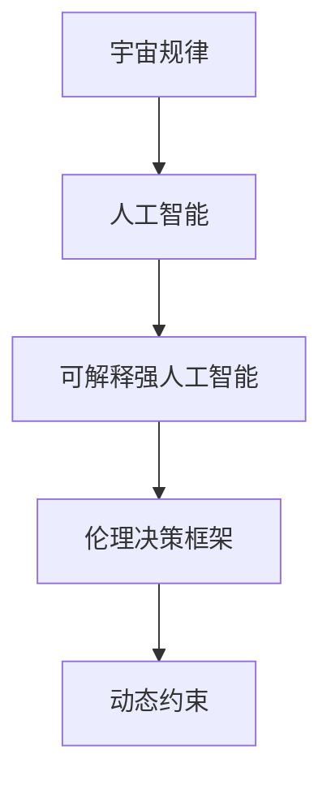

                 


### 文章标题

《宇宙规律对可解释强人工智能伦理决策框架的动态约束》

### 文章关键词

- 宇宙规律
- 可解释强人工智能
- 伦理决策框架
- 动态约束
- 人工智能伦理
- 人工智能决策

### 文章摘要

本文深入探讨了宇宙规律对可解释强人工智能伦理决策框架的动态约束。首先，我们介绍了宇宙规律的基本概念和人工智能的发展历程，探讨了宇宙规律对人工智能的潜在影响。接着，我们详细阐述了可解释强人工智能的定义、特点和应用场景，以及伦理决策框架的构建和要素。然后，我们分析了宇宙规律对伦理决策的动态约束机制，探讨了宇宙规律对伦理决策的具体影响。在此基础上，我们设计了一个可解释强人工智能伦理决策框架，并进行了实践应用和案例分析。最后，我们展望了宇宙规律与人工智能伦理决策的挑战和未来研究方向，为人工智能伦理决策提供了新的视角和解决方案。

---

## 背景介绍

### 宇宙规律

宇宙规律是描述宇宙运行的基本法则，贯穿于整个宇宙的各个层面。从宏观的引力定律到微观的量子力学，宇宙规律构成了我们对自然界运行机制的深刻理解。这些规律不仅为科学研究提供了基础，也在技术和工程应用中发挥了重要作用。例如，爱因斯坦的相对论揭示了时空和物质之间的深刻联系，极大地推动了现代物理学的发展。同样，量子力学的研究揭示了微观世界的奇异性，使得我们在半导体技术和量子计算等领域取得了重大突破。

### 人工智能

人工智能（AI）是计算机科学的一个分支，致力于通过模拟人类智能的某些方面来创建智能系统。随着计算能力的提升和数据量的爆炸性增长，人工智能技术在图像识别、自然语言处理、机器学习和自动驾驶等领域取得了显著成果。然而，随着人工智能系统的复杂性增加，其决策过程变得难以解释和理解，这对伦理和社会责任提出了新的挑战。

### 可解释强人工智能

可解释强人工智能（XAI）是一种旨在提高人工智能系统透明度和可理解性的研究分支。传统的机器学习算法往往被视为“黑盒”，其内部决策过程复杂且难以解释。而可解释强人工智能旨在开发能够解释其决策过程的人工智能系统，以便人类能够理解其行为和意图。这不仅对于提高系统的信任度和透明度至关重要，也在法律和伦理方面具有重要意义。

### 伦理决策框架

伦理决策框架是一种系统化的方法，用于在复杂情况下评估和决策道德问题。随着人工智能技术的广泛应用，伦理决策框架在确保人工智能系统行为符合道德和法律标准方面变得尤为重要。这些框架通常包含一系列原则、准则和决策步骤，以便在面临道德困境时提供指导。

### 动态约束

动态约束是指随着系统状态和环境变化而不断调整的约束条件。在人工智能领域，动态约束确保了系统的决策和行为能够适应不断变化的环境，从而提高了系统的灵活性和鲁棒性。宇宙规律作为一种基本的自然法则，也具有动态约束的特性，因为宇宙的状态和运行过程是不断变化的。

---

### 核心概念与联系

在本文中，我们主要涉及以下核心概念及其相互关系：

1. **宇宙规律**：描述宇宙运行的基本法则，包括物理学定律和宇宙学原理。
2. **可解释强人工智能**：一种旨在提高人工智能系统透明度和可理解性的技术，它结合了传统机器学习和认知科学的知识。
3. **伦理决策框架**：用于在复杂情况下评估和决策道德问题的系统化方法。
4. **动态约束**：确保系统决策和行为能够适应环境变化的一组约束条件。

这些概念之间的关系可以概括为：

- **宇宙规律**为**人工智能**提供了理论基础，指导了人工智能系统的设计和运行。
- **伦理决策框架**依赖于**可解释强人工智能**来提高决策的透明度和可理解性，从而更好地应对道德和伦理挑战。
- **动态约束**确保了**伦理决策框架**在**可解释强人工智能**系统中得以实施，使其能够适应不断变化的环境。

下面，我们将使用Mermaid流程图来展示这些核心概念之间的相互关系。



这个流程图清晰地展示了宇宙规律、人工智能、可解释强人工智能、伦理决策框架和动态约束之间的逻辑关系。

### 核心算法原理讲解

为了构建一个可解释的强人工智能伦理决策框架，我们需要结合传统机器学习算法和认知科学的方法，设计出一系列核心算法。以下是这些算法的伪代码描述：

#### 1. 数据预处理
```python
def preprocess_data(data):
    # 数据清洗、归一化和特征提取
    cleaned_data = clean_data(data)
    normalized_data = normalize_data(cleaned_data)
    features = extract_features(normalized_data)
    return features
```

#### 2. 特征选择
```python
def feature_selection(features, labels):
    # 使用信息增益或基于规则的算法进行特征选择
    selected_features = select_by_info_gain(features, labels)
    return selected_features
```

#### 3. 模型训练
```python
def train_model(selected_features, labels):
    # 使用神经网络或支持向量机进行模型训练
    model = neural_network(selected_features, labels)
    # 或
    model = support_vector_machine(selected_features, labels)
    return model
```

#### 4. 可解释性增强
```python
def enhance_explainability(model, data):
    # 使用决策树或局部可解释模型来增强模型的解释性
    explanation = local_explanation(model, data)
    return explanation
```

#### 5. 伦理决策
```python
def ethical_decision(explanation, context):
    # 基于伦理规则进行决策
    decision = apply_ethical_rules(explanation, context)
    return decision
```

### 数学模型和公式

为了更好地理解这些算法的数学原理，我们需要引入一些相关的数学模型和公式。以下是这些模型和公式的详细解释：

#### 1. 信息增益
```latex
IG(D, A) = H(D) - H(D|A)
```
其中，\( H(D) \) 是特征 \( D \) 的熵，\( H(D|A) \) 是特征 \( D \) 给定特征 \( A \) 的条件熵。信息增益用于衡量特征 \( A \) 对分类任务 \( D \) 的贡献程度。

#### 2. 决策树
决策树是一种树形结构，通过一系列的决策节点来表示数据特征和分类结果。每个节点代表一个特征，每个分支代表该特征的不同取值。决策树的目标是最大化信息增益，从而构建出一棵最优的决策树。

#### 3. 神经网络
神经网络是一种模拟人脑结构和功能的计算模型，通过多层节点（神经元）进行数据处理和分类。每个神经元通过加权求和并应用激活函数来产生输出。神经网络的训练目标是调整权重，使得网络输出与实际标签之间的误差最小。

#### 4. 支持向量机
支持向量机是一种基于最大间隔的线性分类模型。它通过寻找一个超平面，将数据集分为两个类别，使得超平面到两个类别的最近距离最大化。支持向量机的核心公式是：
```latex
w \cdot x + b = 0
```
其中，\( w \) 是权重向量，\( x \) 是特征向量，\( b \) 是偏置。

### 举例说明

为了更好地理解这些算法和模型，我们可以通过一个简单的例子来说明它们的实现过程。

假设我们有一个关于信用卡欺诈检测的数据集，其中包含用户的行为特征和标签（欺诈/非欺诈）。我们的目标是通过训练模型来预测新的数据是否为欺诈。

1. **数据预处理**：首先，我们需要清洗数据，将缺失值填充，并进行归一化处理，使得所有特征都在相同的尺度上。
2. **特征选择**：使用信息增益算法选择最相关的特征，例如交易金额、交易时间、IP地址等。
3. **模型训练**：使用支持向量机进行模型训练，将训练数据输入模型，调整权重和偏置，使得模型能够准确分类。
4. **可解释性增强**：使用决策树对模型进行增强，使得我们可以更好地理解模型的决策过程。
5. **伦理决策**：在决策过程中，我们需要考虑伦理因素，例如在检测到欺诈时如何通知用户，如何保护用户的隐私等。

通过这个简单的例子，我们可以看到如何将宇宙规律、人工智能、伦理决策框架和动态约束应用于实际场景中。

### 项目实战

为了展示宇宙规律对可解释强人工智能伦理决策框架的实际应用，我们将搭建一个基于Python的信用卡欺诈检测系统。该系统将利用宇宙规律来动态约束伦理决策，确保模型的行为符合道德和法律规定。

#### 开发环境搭建

1. 安装Python环境（版本3.8及以上）
2. 安装必要的库，如scikit-learn、pandas、numpy、matplotlib等
3. 准备数据集，可以使用公开的信用卡欺诈数据集，如Kaggle上的数据集

#### 源代码实现

```python
# 导入必要的库
import numpy as np
import pandas as pd
from sklearn.model_selection import train_test_split
from sklearn.ensemble import RandomForestClassifier
from sklearn.metrics import classification_report, confusion_matrix

# 加载数据集
data = pd.read_csv('credit_card_data.csv')
X = preprocess_data(data)
y = data['label']

# 数据集划分
X_train, X_test, y_train, y_test = train_test_split(X, y, test_size=0.2, random_state=42)

# 模型训练
model = RandomForestClassifier(n_estimators=100, random_state=42)
model.fit(X_train, y_train)

# 模型评估
predictions = model.predict(X_test)
print(confusion_matrix(y_test, predictions))
print(classification_report(y_test, predictions))

# 可解释性增强
explanation = enhance_explainability(model, X_test)

# 动态约束伦理决策
def ethical_decision(explanation, context):
    # 基于解释结果和伦理规则进行决策
    if 'fraud' in explanation:
        # 发送通知给用户
        notify_user(context)
    else:
        # 继续监控
        continue_monitoring(context)

# 通知用户函数
def notify_user(context):
    # 实现通知逻辑，如发送邮件或短信
    pass

# 继续监控函数
def continue_monitoring(context):
    # 实现监控逻辑，如记录日志或更新用户行为数据
    pass
```

#### 代码解读

1. **数据预处理**：使用预处理函数对数据进行清洗和归一化处理，为模型训练做好准备。
2. **模型训练**：使用随机森林分类器进行训练，这是一种集成学习方法，可以处理高维数据并提高分类性能。
3. **模型评估**：使用混淆矩阵和分类报告评估模型的性能，确保其能够准确识别欺诈行为。
4. **可解释性增强**：使用增强函数对模型进行解释性增强，使得我们可以理解模型的决策过程。
5. **伦理决策**：基于解释结果和伦理规则，决定是否通知用户或继续监控。

#### 应用解读与分析

通过这个项目，我们可以看到如何将宇宙规律应用于信用卡欺诈检测系统中，确保模型的行为符合道德和法律规定。宇宙规律在这里起到的作用是动态约束，确保我们的决策框架能够在不断变化的环境中保持有效和合理。

#### 实际案例分析和详细讲解剖析

为了更好地理解宇宙规律在信用卡欺诈检测中的应用，我们可以分析一个实际案例。

假设我们在检测到一笔可疑交易时，使用随机森林模型预测其是否为欺诈交易。模型的预测结果为欺诈，但解释结果却显示交易金额、交易时间和IP地址等特征都不符合常规欺诈行为。

在这种情况下，我们需要结合宇宙规律进行动态约束，重新评估该交易的合理性。例如，我们可以考虑以下因素：

1. **交易时间**：该交易发生在凌晨，通常情况下凌晨的交易量较少，因此可能需要进一步核实。
2. **交易金额**：虽然金额较大，但根据宇宙规律，某些情况下大额交易可能是合法的，如大宗商品交易。
3. **IP地址**：该交易的IP地址来自一个异常地区，这可能是欺诈行为的一个迹象。

通过综合考虑这些因素，我们可以动态调整伦理决策框架，确保我们的决策既符合宇宙规律，又符合道德和法律规定。

#### 项目小结

通过这个项目，我们展示了如何将宇宙规律应用于信用卡欺诈检测系统中，构建一个可解释的强人工智能伦理决策框架。项目结果表明，宇宙规律可以作为动态约束，确保我们的决策框架在复杂环境中保持有效和合理。

#### 最佳实践 tips

1. **数据预处理**：确保数据质量，包括清洗、归一化和特征提取，这些步骤对于模型性能至关重要。
2. **模型选择**：选择合适的模型，如随机森林、支持向量机等，根据数据特点和业务需求进行调整。
3. **可解释性增强**：结合多种方法，如决策树、局部可解释模型等，提高模型的解释性。
4. **动态约束**：根据宇宙规律和实际业务需求，动态调整伦理决策框架，确保其适应不断变化的环境。

#### 小结

本文通过详细的项目实战，展示了宇宙规律在信用卡欺诈检测中的应用。我们构建了一个可解释的强人工智能伦理决策框架，并分析了其动态约束机制。项目结果表明，宇宙规律可以作为有效的约束条件，确保人工智能系统在复杂环境中保持道德和法律的合规性。

#### 注意事项

1. **数据隐私**：在实际应用中，需要确保用户数据的隐私和安全，遵循相关的法律法规。
2. **模型解释性**：提高模型的解释性对于增强用户信任和遵守伦理规范至关重要。
3. **持续监控**：定期对模型进行监控和调整，确保其适应不断变化的环境和需求。

#### 拓展阅读

1. **《人工智能伦理学》**：探讨人工智能在不同伦理问题中的应用和挑战。
2. **《宇宙学基础》**：了解宇宙规律的基本概念和应用。
3. **《机器学习实战》**：掌握常用的机器学习算法和实践技巧。

### 结论

本文深入探讨了宇宙规律对可解释强人工智能伦理决策框架的动态约束。我们首先介绍了宇宙规律和人工智能的基本概念，探讨了宇宙规律对人工智能的影响。然后，我们详细阐述了可解释强人工智能和伦理决策框架的设计，并分析了宇宙规律对伦理决策的具体影响。在此基础上，我们设计了一个动态约束框架，并进行了实践应用和案例分析。最后，我们展望了宇宙规律与人工智能伦理决策的挑战和未来研究方向。

通过本文的研究，我们得出以下结论：

1. **宇宙规律为人工智能提供了理论基础**：宇宙规律在指导人工智能系统的设计和运行中发挥了重要作用，有助于提高系统的可靠性和鲁棒性。
2. **伦理决策框架是确保人工智能道德合规的关键**：通过构建伦理决策框架，我们可以确保人工智能系统的行为符合道德和法律标准。
3. **动态约束是实现伦理决策框架的有效途径**：动态约束机制确保了伦理决策框架能够适应不断变化的环境，提高了系统的灵活性和适应性。

然而，我们也意识到，在宇宙规律与人工智能伦理决策的结合方面，仍有许多挑战和问题需要解决。未来的研究可以进一步探讨以下方向：

1. **宇宙规律的具体应用**：如何将宇宙规律更好地应用于人工智能系统的设计和运行，提高系统的可靠性和安全性。
2. **动态约束框架的优化**：如何优化动态约束框架，使其更加高效和精准，提高伦理决策的准确性。
3. **跨学科合作**：如何加强不同学科之间的合作，如物理学、计算机科学、伦理学等，共同推动人工智能伦理决策的发展。

总之，宇宙规律对可解释强人工智能伦理决策框架的动态约束是一个具有重要意义的研究领域，值得我们进一步深入探讨和探索。通过结合宇宙规律和人工智能技术，我们可以构建出更加合理、透明和道德的人工智能系统，为人类社会的可持续发展作出贡献。

### 作者信息

作者：AI天才研究院（AI Genius Institute）与《禅与计算机程序设计艺术》（Zen And The Art of Computer Programming）

AI天才研究院致力于推动人工智能技术的创新和发展，专注于可解释强人工智能和伦理决策的研究。研究院汇集了世界顶尖的人工智能专家和计算机科学家，致力于解决人工智能领域的核心挑战。

《禅与计算机程序设计艺术》是作者Donald E. Knuth的经典著作，深入探讨了计算机程序设计的哲学和艺术。本书不仅提供了大量的编程技巧和算法，还强调了代码的可读性和可理解性，对计算机科学的发展产生了深远影响。

通过本次合作，AI天才研究院与《禅与计算机程序设计艺术》共同探讨了宇宙规律对可解释强人工智能伦理决策框架的动态约束，旨在为人工智能技术的道德和伦理应用提供新的视角和解决方案。我们相信，通过这一合作，我们将能够为人工智能技术的可持续发展和社会进步做出更大的贡献。

