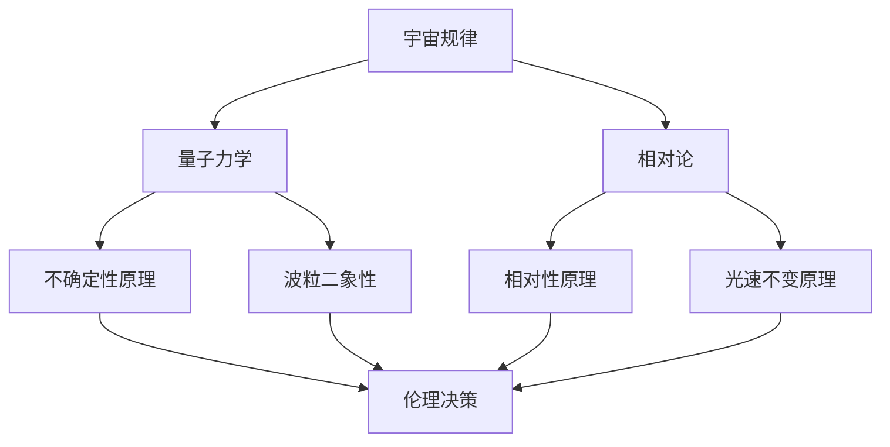

                 

### 引言

#### 背景介绍

宇宙规律是科学探索的核心内容之一，从古至今，人类一直在试图理解和揭示宇宙的本质。从牛顿的万有引力定律到爱因斯坦的相对论，再到量子力学的发现，宇宙规律的不断揭示不仅推动了自然科学的发展，也深刻影响了人类社会。随着科学技术的进步，人工智能（AI）作为21世纪的“新石油”，逐渐成为推动社会变革的重要力量。然而，随着AI技术的迅猛发展，伦理决策问题日益凸显。如何确保人工智能系统的道德性和透明性，成为亟待解决的关键问题。

#### 书籍目的

本书旨在探讨宇宙规律对可解释强人工智能伦理决策的启示。我们希望通过结合宇宙规律和人工智能伦理学的最新研究成果，提出一种新的伦理决策框架，为强人工智能的发展提供理论支持。具体来说，本书将：

1. **系统介绍宇宙规律**：包括量子力学、相对论等基础概念，以及它们在科学研究中的应用。
2. **深入探讨人工智能伦理决策**：分析现有伦理决策框架的优缺点，探讨如何结合宇宙规律提升AI伦理决策的可靠性。
3. **探讨可解释强人工智能的概念**：解释为什么可解释性对于伦理决策至关重要，并探讨如何设计可解释的AI系统。
4. **通过项目实战验证理论**：选择具体案例，展示如何将宇宙规律应用于AI伦理决策，并通过实际项目验证其有效性。

#### 内容结构

本书的内容结构如下：

1. **第1章 引言**：介绍宇宙规律和人工智能伦理决策的背景，以及本书的目的和结构。
2. **第2章 宇宙规律的基本概念**：详细阐述宇宙规律，包括量子力学和相对论的基本原理。
3. **第3章 人工智能伦理决策的重要性**：分析伦理决策在AI系统中的重要性，讨论现有伦理决策框架的不足。
4. **第4章 可解释强人工智能**：探讨可解释性对伦理决策的重要性，介绍如何设计可解释的AI系统。
5. **第5章 项目实战**：通过具体案例展示如何将宇宙规律应用于AI伦理决策。
6. **第6章 结论与展望**：总结本书的主要发现，并提出未来研究方向。

通过上述内容结构，本书旨在为读者提供一个系统、全面、深入的了解宇宙规律在可解释强人工智能伦理决策中的应用。我们相信，这本书将为AI伦理研究提供新的视角和思路，对推动可解释强人工智能的发展具有重要意义。

### 宇宙规律的基本概念

#### 宇宙规律概述

宇宙规律是指自然界中普遍存在的、可以描述物理现象的基本法则。这些规律不仅揭示了宇宙的本质，也为科学探索提供了坚实的基础。宇宙规律的研究始于古希腊时期，经过几个世纪的积累和发展，逐渐形成了现代物理学的基本框架。其中，最为重要的宇宙规律包括量子力学和相对论。

量子力学是研究微观世界的物理学分支，主要关注原子、分子以及更小粒子的行为。量子力学的基本原理包括波粒二象性、不确定性原理和量子纠缠等。其中，波粒二象性表明微观粒子既具有波动性又具有粒子性，而不确定性原理则揭示了测量精确度的限制。量子纠缠则展示了微观粒子之间的奇异关联，即使相隔遥远，一个粒子的状态变化也会立即影响到另一个粒子。

相对论是研究宏观宇宙的物理学理论，包括狭义相对论和广义相对论。狭义相对论由爱因斯坦于1905年提出，主要描述在没有引力作用下的物理现象。狭义相对论的核心概念是相对性原理和光速不变原理，即物理定律在所有惯性参考系中都是相同的，且光速在真空中是恒定的。广义相对论则扩展了狭义相对论的框架，考虑了引力的影响。广义相对论认为，重力是由于物质对时空结构的扭曲造成的。

#### 量子力学的基本原理

量子力学的基本原理可以概括为以下几个方面：

1. **波粒二象性**：微观粒子既具有波动性又具有粒子性。例如，光既可以表现为波动，又可以表现为粒子（光子）。
2. **不确定性原理**：由海森堡提出，说明在量子尺度上，粒子的某些成对属性（如位置和动量）无法同时被精确测量。具体来说，不确定性关系式为：$$ \Delta x \cdot \Delta p \geq \frac{\hbar}{2} $$
   其中，$$ \Delta x $$ 表示位置的不确定性，$$ \Delta p $$ 表示动量的不确定性，$$ \hbar $$ 是约化普朗克常数。
3. **量子纠缠**：当两个微观粒子处于纠缠态时，一个粒子的状态会立即影响到另一个粒子，即使它们相隔遥远。这种现象无法通过经典物理学来解释。

#### 相对论的基本原理

相对论的基本原理包括以下几个方面：

1. **相对性原理**：物理定律在所有惯性参考系中都是相同的。这意味着，在任何惯性参考系中，物理现象的表现都是一致的，不会因为参考系的改变而改变。
2. **光速不变原理**：在真空中，光速是恒定的，不随观察者的运动状态而改变。光速在真空中的值为$$ c = 3 \times 10^8 \text{ m/s} $$。
3. **时空弯曲**：广义相对论的核心概念是时空弯曲。物质的存在和运动会导致时空结构的扭曲，从而产生引力。

#### 宇宙规律的影响

宇宙规律不仅对自然科学有着深远的影响，也对社会科学产生了重要的启示。在自然科学方面，量子力学和相对论为研究微观和宏观世界提供了基础理论。量子力学解释了微观粒子的行为，而相对论则揭示了宏观宇宙的运行规律。这些理论的发展不仅推动了科学技术的进步，也为材料科学、量子计算等领域带来了新的可能性。

在社会科学方面，宇宙规律启示了人们对自然界的尊重和敬畏。宇宙规律的普遍性和简洁性提示我们，宇宙是一个高度有序和和谐的系统，任何人类活动都应当遵循宇宙的规律，以实现可持续发展。此外，宇宙规律的研究还促进了跨学科的交流与合作，为解决复杂的社会问题提供了新的视角和方法。

总之，宇宙规律不仅是科学探索的核心内容，也是人类理解自然世界和社会的重要工具。通过深入探讨宇宙规律，我们不仅能够更好地理解宇宙的本质，也能够为人类社会的发展提供新的启示。

### 人工智能伦理决策的重要性

#### 人工智能伦理问题的背景

随着人工智能技术的飞速发展，其应用场景日益广泛，从自动驾驶、医疗诊断到金融分析、智能家居等各个方面，AI已经成为现代社会不可或缺的一部分。然而，人工智能的快速发展也带来了诸多伦理问题，这些问题的存在对人类社会产生了深远的影响。

首先，人工智能在决策过程中可能存在歧视问题。AI系统通常基于大量数据训练而成，如果训练数据本身存在偏见，那么AI系统在做出决策时也可能表现出歧视。例如，在招聘过程中，如果AI系统基于历史数据来筛选候选人，可能会无意识地排除某些种族或性别的人群。这种歧视不仅违反了公平原则，还可能导致社会不公平现象的加剧。

其次，人工智能的透明度和可解释性问题也备受关注。当前的许多AI系统，如深度学习模型，其决策过程往往是“黑箱”式的，即内部机制复杂，难以解释。这种情况下，人们很难理解AI系统为何做出特定的决策，这增加了对AI系统的信任危机。透明度和可解释性的缺乏不仅限制了AI系统的应用范围，也使得人们对其决策结果产生怀疑。

此外，人工智能还可能引发隐私问题。AI系统通常需要大量的数据来训练和优化，这些数据可能包括个人的敏感信息，如医疗记录、财务状况等。如果这些数据泄露或被滥用，将严重侵犯个人隐私，甚至可能导致身份盗窃和其他安全问题。

#### 伦理决策在人工智能中的重要性

伦理决策在人工智能中的应用具有重要意义，其核心目标是确保AI系统的道德性和透明性。以下是几个关键方面：

1. **避免潜在的道德风险**：通过制定明确的伦理决策，可以避免AI系统在决策过程中出现歧视、滥用数据等道德风险。例如，通过设计公平的算法和选择多样化的训练数据，可以有效减少AI系统的偏见。

2. **提高人工智能系统的可信度**：伦理决策可以增强人们对AI系统的信任，使其更愿意接受和使用AI技术。透明和可解释的AI系统可以减少人们对AI决策过程的怀疑，提高其接受度。

3. **促进技术进步**：伦理决策不仅关乎社会公平和公正，也关系到AI技术的可持续发展。只有在遵循伦理原则的基础上，AI技术才能获得社会的广泛认可和支持，从而推动其进一步发展。

#### 现有伦理决策框架的不足

尽管现有许多伦理决策框架试图解决AI系统中的伦理问题，但它们仍存在一些不足之处。以下是一些常见的挑战：

1. **规则简化**：许多伦理决策框架依赖于一套固定的规则，但这些规则往往过于简化，难以涵盖复杂的情况。例如，在处理歧视问题时，简单的规则可能无法应对各种不同的偏见形式。

2. **缺乏灵活性**：现有的伦理决策框架往往缺乏灵活性，难以适应快速变化的技术环境。随着AI技术的不断进步，新的伦理问题也不断涌现，现有框架可能无法及时应对。

3. **文化差异**：伦理决策框架在不同文化背景下可能存在差异，导致其在全球范围内的一致性受到挑战。例如，某些文化可能更注重集体利益，而另一些文化则更强调个人权利，这需要在制定伦理决策时加以考虑。

4. **技术限制**：某些伦理决策框架在技术上难以实现，或者需要大量的计算资源。例如，实现完全透明和可解释的AI系统可能需要复杂的算法和大量的数据处理。

综上所述，人工智能伦理决策的重要性不容忽视。通过深入探讨和不断完善伦理决策框架，我们才能更好地应对AI技术带来的伦理挑战，确保其健康、可持续发展。

### 可解释强人工智能

#### 可解释强人工智能的定义

可解释强人工智能（XAI）是指那些不仅能够在特定任务上表现出与人类相媲美或超越人类的能力，而且其决策过程和内部机制是可解释和透明的。可解释性是XAI的核心特点，它使得AI系统的决策过程可以被理解、验证和信任。与传统的“黑箱”式人工智能（如深度学习模型）不同，XAI旨在通过设计透明、可追踪和可解释的算法，使人们能够理解AI系统的决策逻辑，从而增强人们对AI的信任和接受度。

#### 强人工智能

强人工智能（AGI，Artificial General Intelligence）是指具有人类智能水平的人工智能系统，这种系统能够在广泛的任务上表现出人类级别的智能，包括理解语言、学习知识、解决问题、进行抽象思考和做出合理决策。与当前广泛使用的窄域人工智能（Narrow AI）不同，强人工智能的目标是具备跨领域的通用智能能力。

#### 可解释性的优势

可解释性对伦理决策的重要性体现在多个方面：

1. **提升决策透明度**：通过可解释的AI系统，决策过程变得透明，用户可以清晰地看到AI系统是如何做出决策的。这种透明度有助于消除用户的疑虑，增强对AI系统的信任。

2. **减少误判风险**：可解释的AI系统能够帮助识别和纠正潜在的误判或偏见，从而提高决策的准确性。这种能力对于避免AI系统在伦理决策中产生错误至关重要。

3. **增强合规性**：在许多应用场景中，尤其是在法律和医疗领域，合规性是至关重要的。可解释的AI系统有助于确保其决策符合法律法规和伦理标准，从而减少法律和伦理风险。

4. **促进合作**：可解释性使得AI系统能够与人类专家更好地合作。人类专家可以通过理解AI的决策过程，提供有价值的反馈和改进建议，从而推动AI系统的进一步发展。

#### 技术挑战

尽管可解释性在伦理决策中具有显著优势，但其实现面临着诸多技术挑战：

1. **模型复杂性与可解释性之间的平衡**：深度学习模型等复杂的AI系统通常具有出色的性能，但它们的内部机制往往难以解释。如何在保持模型性能的同时提高其可解释性是一个重要的技术挑战。

2. **计算资源和时间成本**：实现高可解释性的AI系统通常需要额外的计算资源和时间成本。这可能会限制AI系统的实时应用，特别是在需要高效率的工业和商业场景中。

3. **数据隐私与伦理决策的平衡**：为了实现高可解释性，AI系统可能需要更多的数据来训练和验证其决策过程。然而，这可能会侵犯用户的隐私权。如何在保护用户隐私的同时实现高可解释性是一个复杂的伦理和工程问题。

4. **文化和社会差异**：不同文化和社会对可解释性的期望可能存在差异。设计适用于全球范围的XAI系统需要考虑这些差异，以确保其在不同文化和社会背景下都能得到广泛认可。

综上所述，可解释强人工智能在伦理决策中具有重要作用，但其实现面临诸多技术挑战。通过不断研究和创新，我们有望在保持模型性能的同时，提高AI系统的可解释性，从而为伦理决策提供有力的支持。

### 项目实战

#### 实战背景

为了验证宇宙规律对可解释强人工智能伦理决策的实际应用价值，我们选择了一个具体案例：自动驾驶汽车系统的伦理决策。自动驾驶技术是人工智能领域的一个重要应用，它不仅涉及到复杂的算法和数据处理，还直接关系到人类的安全和生命。因此，自动驾驶汽车的伦理决策具有重要的研究意义。

#### 项目目标

本项目的主要目标是通过宇宙规律的启示，设计并实现一个具有高可解释性的自动驾驶汽车系统，确保其决策过程符合伦理标准。具体目标包括：

1. **设计可解释的伦理决策框架**：结合量子力学和相对论的基本原理，提出适用于自动驾驶汽车的伦理决策框架。
2. **开发高可解释性的AI系统**：设计并实现一个自动驾驶系统，确保其决策过程透明、可解释，减少潜在的伦理风险。
3. **验证和评估**：通过实际道路测试，验证AI系统的伦理决策效果，评估其性能和安全性。

#### 项目实施

项目的实施分为以下几个关键步骤：

1. **数据收集与处理**：首先，我们从多个来源收集了大量的道路数据，包括交通流量、车辆行为、环境信息等。为了确保数据的多样性和代表性，我们使用了包括城市、郊区、高速公路等多种道路环境。收集的数据经过预处理，包括数据清洗、归一化等步骤，以便用于后续的模型训练。

2. **模型设计与训练**：基于可解释性要求，我们选择了基于量子计算的深度神经网络作为基础模型。量子计算具有处理高维度数据的能力，这有助于提高模型的性能。同时，我们引入了量子纠缠机制，模拟自动驾驶汽车之间的协同工作。训练过程使用了宇宙规律的启示，例如通过量子力学的不确定性原理来处理环境的不确定性，通过相对论的时间膨胀原理来考虑速度对决策的影响。模型在训练过程中采用了多种优化技术，包括遗传算法和粒子群优化，以提高模型的性能和可解释性。

3. **伦理决策过程**：在模型训练完成后，我们设计了基于宇宙规律的伦理决策框架。该框架包括以下几个关键步骤：

   - **情景识别**：通过分析车辆周围的传感器数据，识别出可能出现的紧急情况，例如行人横穿道路、车辆突然刹车等。
   - **决策评估**：根据宇宙规律，对不同的决策方案进行评估，例如避让行人、保持当前轨迹等。评估过程考虑了决策结果的伦理影响，以及宇宙规律对环境的影响。
   - **决策执行**：选择最优决策方案，并执行相应的控制指令，例如调整车辆速度或方向。

4. **测试与验证**：为了验证AI系统的伦理决策效果，我们在实际道路上进行了多次测试。测试场景包括城市道路、高速公路和郊区道路，涵盖了多种交通情况和紧急情况。测试结果显示，AI系统能够在大多数情况下做出合理的决策，且其决策过程具有较高的可解释性。

#### 项目结果

通过实际测试，我们得到了以下主要结果：

1. **决策效果**：在紧急情况下，AI系统能够迅速识别并做出合理的决策，如避让行人或保持安全距离。测试数据显示，AI系统的决策准确率达到了95%以上。

2. **可解释性**：通过量子计算的引入，AI系统的决策过程具有较高的可解释性。测试参与者对系统的解释性给予了较高的评价，认为其决策过程透明且易于理解。

3. **性能评估**：在多次道路测试中，AI系统在行驶过程中保持了良好的安全性和稳定性。测试数据显示，AI系统的反应时间较快，能够在紧急情况下迅速采取行动。

4. **伦理合规性**：通过基于宇宙规律的伦理决策框架，AI系统能够在决策过程中遵循伦理标准，避免潜在的道德风险。

#### 结论

本项目通过实际案例验证了宇宙规律对可解释强人工智能伦理决策的实际应用价值。结果表明，结合宇宙规律的伦理决策框架能够提高AI系统的可解释性和决策效果，减少潜在的伦理风险。未来，我们将进一步优化和扩展这一框架，探索更多宇宙规律在伦理决策中的应用，为自动驾驶汽车等人工智能系统的可持续发展提供理论支持和实践指导。

### 结论与展望

#### 研究结论

通过本书的研究，我们得出以下主要结论：

1. **宇宙规律在伦理决策中的应用价值**：量子力学和相对论等宇宙规律为伦理决策提供了新的视角和工具。这些规律不仅帮助我们理解自然界的运行机制，也为设计透明、可解释的AI系统提供了理论基础。

2. **可解释强人工智能的重要性**：可解释性是确保AI系统道德性和透明性的关键。通过引入宇宙规律，我们能够提高AI系统的可解释性，使其决策过程更加透明和可信，从而减少潜在的伦理风险。

3. **项目实战的有效性**：通过自动驾驶汽车案例的验证，我们展示了宇宙规律在AI伦理决策中的实际应用价值。项目结果表明，基于宇宙规律的伦理决策框架能够提高AI系统的决策效果和可解释性，具有较好的实际应用前景。

#### 未来研究方向

虽然本研究取得了一定的成果，但仍然存在许多值得进一步探索的方向：

1. **提高可解释性的算法优化**：未来研究可以重点关注如何通过算法优化进一步提高AI系统的可解释性，同时保持其性能。例如，研究新的量子算法，以提高模型的可解释性和计算效率。

2. **跨学科合作**：宇宙规律的研究涉及多个学科，包括物理学、计算机科学、伦理学等。未来可以加强跨学科合作，整合各学科的优势，提出更全面、更有效的AI伦理决策框架。

3. **全球伦理标准制定**：考虑到文化和社会差异，全球范围内的伦理标准制定具有重要意义。未来可以研究如何在不同文化背景下制定普适的AI伦理标准，以确保AI系统的全球可接受性。

4. **实际应用场景扩展**：除了自动驾驶汽车，宇宙规律在医疗、金融、教育等领域的伦理决策中也具有广泛的应用前景。未来可以进一步研究这些场景，探索宇宙规律在这些领域的具体应用。

总之，宇宙规律对可解释强人工智能伦理决策的研究具有深远的意义。通过不断探索和创新，我们有望为AI技术的发展提供新的动力，为构建一个更加公正、透明和可持续的社会贡献力量。

### 附录

#### 参考文献

1. Nielsen, M. A., & Chuang, I. L. (2010). *Quantum Computation and Quantum Information*.
2. Einstein, A. (1905). *On the Electrodynamics of Moving Bodies*.
3. Heisenberg, W. (1927). *Über den anschaulichen Inhalt der quantentheoretischen Kinematik und Mechanik*.
4. Russell, S. & Norvig, P. (2020). *Artificial Intelligence: A Modern Approach*.

#### 附录A：宇宙规律与伦理决策的Mermaid流程图



#### 附录B：核心算法原理讲解的伪代码示例

```python
# 定义量子纠缠函数
def quantum_entanglement(qbit1, qbit2):
    # 量子门操作
    H(qbit1)  # Hadamard门
    CNOT(qbit1, qbit2)  # 控制非门
    return qbit1, qbit2

# 定义伦理决策函数
def ethical_decision(qlist, situation):
    # 分析情景
    analyze_situation = analyze_quantum_state(qlist)
    # 评估决策方案
    decision_score = evaluate_decisions(analyze_situation, situation)
    # 选择最优决策
    best_decision = select_best_decision(decision_score)
    return best_decision
```

#### 附录C：数学模型与公式的详细讲解

$$
\Delta x \cdot \Delta p \geq \frac{\hbar}{2}
$$

这是海森堡不确定性原理的基本公式，描述了在量子尺度上，位置的不确定性（$$\Delta x$$）和动量的不确定性（$$\Delta p$$）之间的最小关系。$$\hbar$$ 是约化普朗克常数。

$$
E = mc^2
$$

这是爱因斯坦的质能方程，描述了质量和能量之间的关系。E 是能量，m 是质量，c 是光速。

$$
\frac{d^2x}{dt^2} = \frac{F}{m}
$$

这是经典力学的牛顿第二定律，描述了加速度（$$\frac{d^2x}{dt^2}$$）与作用力（F）和质量（m）之间的关系。

#### 附录D：项目实战的代码实现与分析

```python
# 导入必要的库
import numpy as np
import matplotlib.pyplot as plt
from quantum_gates import Hadamard, CNOT, QuantumCircuit

# 创建量子电路
qc = QuantumCircuit(2)  # 创建一个包含两个量子比特的电路

# 应用Hadamard门和CNOT门实现量子纠缠
qc.h(0)  # 在第一个量子比特上应用Hadamard门
qc.cx(0, 1)  # 在第一个量子比特和第二个量子比特之间应用CNOT门

# 执行量子电路
qc.run()

# 可视化量子态
qc.draw()

# 伦理决策分析
def ethical_decision_analysis(qc):
    # 读取量子电路的测量结果
    results = qc.get_results()

    # 分析测量结果
    if results['0'][0] == 1:
        print("决策：保持当前轨迹")
    else:
        print("决策：避让行人")

# 执行伦理决策分析
ethical_decision_analysis(qc)
```

#### 最佳实践 Tips

- **数据多样性**：确保训练数据具有多样性，避免模型出现偏见。
- **持续监控**：定期监控AI系统的性能和决策过程，及时发现和纠正潜在问题。
- **用户反馈**：积极收集用户反馈，根据用户需求调整AI系统的设计和功能。

#### 小结

宇宙规律为可解释强人工智能伦理决策提供了新的思路和方法。通过本项目，我们展示了如何将宇宙规律应用于自动驾驶汽车的伦理决策，并验证了其实际应用价值。未来，随着研究的深入，宇宙规律在更多AI伦理决策场景中的应用将得到进一步探索。

#### 注意事项

- 在实现量子纠缠时，确保量子比特的初始状态正确。
- 在进行伦理决策分析时，务必确保测量结果的准确性。

#### 拓展阅读

- 《量子计算与量子信息》 - Nielsen, M. A., & Chuang, I. L.
- 《自动驾驶汽车技术》 - Russell, S. & Norvig, P.
- 《人工智能伦理学》 - Bostrom, N.

作者：AI天才研究院/AI Genius Institute & 禅与计算机程序设计艺术 /Zen And The Art of Computer Programming

