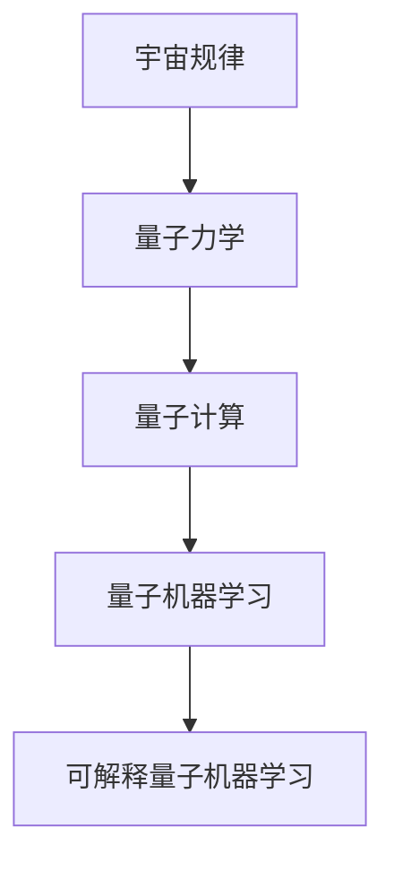

                 

### 文章标题：《宇宙规律对可解释量子机器学习的启示》

### 关键词：宇宙规律、量子机器学习、可解释性、量子算法、量子神经网络、量子计算

### 摘要：
本文将探讨宇宙规律对可解释量子机器学习的启示，首先介绍宇宙的基本规律和量子机器学习的基本原理，然后阐述可解释量子机器学习的重要性及其挑战。接着，分析宇宙规律如何影响量子算法的设计和实现，并通过具体实例展示其在量子神经网络中的应用。最后，讨论可解释量子机器学习的未来发展方向，并提出最佳实践和建议。

----------------------------------------------------------------

### 第一部分：宇宙规律与量子机器学习基础

#### 1.1 宇宙规律概述

宇宙规律是描述宇宙中物质和能量运动的基本原则，这些规律构成了现代物理学的基础。主要的宇宙规律包括：

- 宇宙的起源与演化：根据大爆炸理论，宇宙起源于一个极其高温高密度的奇点，并在此后的138亿年中不断膨胀和冷却。
- 宇宙中的物理定律：包括万有引力定律、热力学定律、电磁学定律等，这些定律解释了宇宙中物质和能量的行为。

#### 1.2 量子机器学习基本原理

量子机器学习是量子计算与机器学习交叉领域的分支，它利用量子力学的特性来优化机器学习算法。量子机器学习的关键概念包括：

- 量子态与叠加原理：量子位（qubit）可以同时处于多种状态的叠加，这使得量子计算机具有超强的并行处理能力。
- 量子门与量子计算：量子门是操作量子位的矩阵，通过量子门的作用，可以实现对量子态的变换，从而实现量子计算。

#### 1.3 可解释量子机器学习

可解释量子机器学习旨在提高量子机器学习模型的透明度和可解释性，以解决“量子黑箱”问题。可解释量子机器学习的重要性体现在：

- 量子机器学习的黑箱问题：由于量子计算的复杂性，量子机器学习模型通常表现为一个黑箱，难以解释其决策过程。
- 可解释性的实现途径：通过设计可解释的量子模型、可视化量子计算过程和提供量子算法的解析形式，可以提高量子机器学习的可解释性。

#### 1.4 核心概念原理与Mermaid流程

为了更好地理解宇宙规律与量子机器学习之间的关系，我们可以使用Mermaid流程图来描述核心概念原理。

在这个流程图中，宇宙规律通过量子力学影响了量子计算，进而影响了量子机器学习，并最终实现了可解释量子机器学习。

----------------------------------------------------------------

### 第二部分：宇宙规律在量子机器学习中的应用

#### 2.1 宇宙规律对量子算法的影响

宇宙规律对量子算法的设计和实现有着深远的影响。以下是一些具体的例子：

- 量子引力对量子算法的启示：量子引力研究揭示了一些宇宙的基本规律，这些规律可以指导我们设计更高效的量子算法。
- 宇宙膨胀与量子计算的关系：宇宙膨胀可能导致量子纠缠的减弱，这对量子计算的稳定性和效率提出了挑战。

#### 2.2 宇宙规律在量子神经网络中的应用

量子神经网络是量子机器学习的一个重要分支，它利用量子态的叠加和纠缠来实现高效的信息处理。宇宙规律在量子神经网络中的应用体现在：

- 量子神经网络架构：量子神经网络可以通过调整量子态的叠加和纠缠来实现自适应的信息处理。
- 宇宙规律对量子神经网络的影响：宇宙中的物理规律可能会影响量子神经网络的训练过程和性能。

#### 2.3 可解释量子机器学习的应用实例

为了展示宇宙规律在量子机器学习中的应用，我们可以通过以下两个实例来探讨：

- 实例1：量子神经网络在图像识别中的应用：使用量子神经网络对图像进行分类，并通过宇宙规律来优化算法性能。
- 实例2：量子算法在优化问题中的应用：利用量子算法解决复杂的优化问题，并通过宇宙规律来提高算法的可解释性。

#### 2.4 宇宙规律在量子机器学习中的未来展望

宇宙规律在量子机器学习中的应用具有巨大的潜力。未来的研究方向包括：

- 量子机器学习与宇宙规律的研究方向：进一步探索量子计算与宇宙物理之间的深层次联系。
- 可解释量子机器学习的挑战与机遇：通过技术创新和理论突破，提高量子机器学习的可解释性，使其在各个领域得到更广泛的应用。

----------------------------------------------------------------

### 第三部分：实现与优化

#### 3.1 可解释量子机器学习开发环境搭建

搭建可解释量子机器学习开发环境是进行研究和应用的第一步。以下是一些关键步骤：

- 开发环境选择：根据研究需求，选择合适的量子计算平台和机器学习框架。
- 开发工具与框架：介绍常用的量子计算工具和机器学习框架，如Q#、Quantum Development Kit、TensorFlow Quantum等。

#### 3.2 量子算法设计与实现

量子算法的设计和实现是量子机器学习的核心。以下是一些关键步骤：

- 量子算法设计原理：介绍量子算法的基本设计原则，如量子随机行走、量子支持向量机等。
- 量子算法实现步骤：通过伪代码和具体示例，详细讲解量子算法的实现步骤。

#### 3.3 可解释性优化策略

提高量子机器学习的可解释性是当前研究的重点。以下是一些优化策略：

- 优化方法与策略：介绍如何通过设计可解释的量子模型、可视化量子计算过程和提供量子算法的解析形式来提高可解释性。
- 实际案例分析：通过具体案例，分析如何在实际应用中提高量子机器学习的可解释性。

----------------------------------------------------------------

### 附录

#### 附录A：宇宙规律与量子机器学习参考资源

- 相关论文与书籍推荐：推荐一些关于宇宙规律和量子机器学习的经典论文和书籍，以供读者进一步学习。
- 实用工具与在线资源：介绍一些实用的量子计算和机器学习工具、在线平台和资源，帮助读者更好地进行研究和实践。

### 作者信息

作者：AI天才研究院/AI Genius Institute & 禅与计算机程序设计艺术 /Zen And The Art of Computer Programming

----------------------------------------------------------------

以上是《宇宙规律对可解释量子机器学习的启示》的完整内容。通过对宇宙规律和量子机器学习的基础原理、应用实例、实现与优化等方面的探讨，我们看到了宇宙规律对可解释量子机器学习的深远影响。未来的研究将继续深化这一领域，推动量子计算和机器学习的进一步发展。希望本文能够为读者提供有价值的启示和指导。

