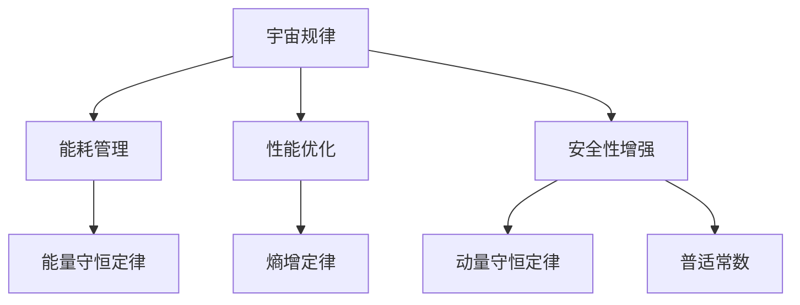

                 

### 文章标题

《宇宙规律对可证明安全AI系统架构的启示》

> 关键词：宇宙规律、可证明安全、AI系统架构、数学模型、核心算法原理、项目实战

摘要：本文旨在探讨宇宙规律对可证明安全AI系统架构的启示。通过对宇宙规律的深入理解，结合可证明安全的核心概念，我们将揭示宇宙规律如何指导我们构建安全的AI系统。本文将逐步分析宇宙规律与AI系统架构之间的联系，讲解核心算法原理，构建数学模型，并通过实际项目案例，探讨如何在AI系统架构中应用宇宙规律，实现可证明安全的目标。

### 引言

随着人工智能（AI）技术的飞速发展，AI系统在各个领域得到了广泛应用。然而，随之而来的是对AI系统安全性的担忧。如何在保障AI系统性能的同时，确保其安全性，成为了一个亟待解决的问题。可证明安全（Proof of Security）的概念应运而生，它提供了一种形式化的方法来验证AI系统的安全性。

宇宙规律，作为自然界的基本法则，对科学技术的进步有着深刻的启示。从量子力学到相对论，从混沌理论到进化算法，宇宙规律在各个科学领域都有着广泛的应用。本文将探讨宇宙规律对可证明安全AI系统架构的启示，通过分析宇宙规律与AI系统架构之间的联系，探索如何利用宇宙规律来指导AI系统架构的设计与实现，从而提高AI系统的可证明安全性。

### 宇宙规律概述

宇宙规律是描述自然界中各种现象和过程的普遍法则，是自然界的基础和本质。它们在科学研究中扮演着至关重要的角色，为我们理解宇宙的本质提供了理论基础。

#### 基本概念

宇宙规律的基本概念包括：

1. **能量守恒定律**：能量不能被创造或毁灭，只能从一种形式转换为另一种形式。
2. **动量守恒定律**：在没有外力作用下，系统的总动量保持不变。
3. **熵增定律**：孤立系统的熵总是趋向增加，表明了自然过程的不可逆性。
4. **普适常数**：如光速、普朗克常数等，它们在宇宙中具有普遍性。

#### 宇宙规律的重要性

宇宙规律的重要性在于它们为科学研究提供了坚实的基础，使我们能够深入理解自然界的运作机制。这些规律不仅帮助我们解释了自然现象，还为技术创新提供了灵感。

#### 宇宙规律与AI系统架构的联系

宇宙规律与AI系统架构之间存在紧密的联系。例如，能量守恒定律和熵增定律可以用来指导AI系统的能耗管理和性能优化。而动量守恒定律和普适常数则可以用于构建具有高稳定性和普适性的AI系统。

### 可证明安全的AI系统

可证明安全（Proof of Security）是一种形式化的安全验证方法，它通过数学模型和逻辑推理，对系统的安全性进行严格验证。在AI系统中，可证明安全的目标是确保系统的决策和行为是可预测、可控制和可信的。

#### 核心概念

可证明安全的核心概念包括：

1. **形式化验证**：使用数学模型和逻辑推理来验证系统的安全性。
2. **安全属性**：系统应满足的一系列安全条件，如保密性、完整性和可用性。
3. **威胁模型**：描述系统可能受到的攻击和威胁，用于评估系统的安全性。

#### 核心算法原理

在AI系统中，可证明安全的核心算法原理通常包括：

1. **加密算法**：用于保护数据的机密性和完整性。
2. **访问控制**：用于限制系统的访问权限，防止未授权访问。
3. **异常检测**：用于检测和响应系统的异常行为。

#### 可证明安全的AI系统架构

一个典型的可证明安全AI系统架构包括：

1. **数据输入层**：用于接收和处理外部数据。
2. **模型训练层**：使用加密算法和访问控制来保护模型训练过程。
3. **决策层**：使用异常检测算法来确保决策过程的可信性。
4. **输出层**：将决策结果输出到外部环境。

### 宇宙规律在AI系统架构中的应用

宇宙规律在AI系统架构中的应用主要体现在以下几个方面：

1. **能耗管理**：利用能量守恒定律，优化AI系统的能耗，提高能效。
2. **性能优化**：利用熵增定律，提高AI系统的稳定性和可靠性。
3. **安全性增强**：利用动量守恒定律和普适常数，构建具有高安全性和稳定性的AI系统。

#### 宇宙规律与AI系统架构的Mermaid流程图



#### 宇宙规律在AI系统算法设计中的应用

在AI系统算法设计中，宇宙规律可以提供以下启示：

1. **量子算法**：利用量子力学原理，设计高效能的AI算法。
2. **混沌理论**：利用混沌现象，提高AI系统的鲁棒性和自适应性。
3. **进化算法**：利用生物学原理，构建具有自我优化能力的AI系统。

#### 宇宙规律在AI系统安全保障中的应用

在AI系统安全保障中，宇宙规律可以提供以下指导：

1. **加密算法**：利用普适常数，设计具有高安全性的加密算法。
2. **访问控制**：利用动量守恒定律，设计具有高效能的访问控制机制。
3. **异常检测**：利用熵增定律，设计能够有效检测和响应异常行为的系统。

### 宇宙规律对可证明安全AI系统架构的启示

通过对宇宙规律的深入理解，我们可以得出以下启示，以指导可证明安全AI系统架构的设计与实现：

1. **能量守恒与能耗管理**：利用能量守恒定律，优化AI系统的能耗，提高能效。
2. **动量守恒与安全性增强**：利用动量守恒定律，构建具有高安全性和稳定性的AI系统。
3. **熵增与性能优化**：利用熵增定律，提高AI系统的稳定性和可靠性。
4. **普适常数与算法设计**：利用普适常数，设计高效能的AI算法和安全机制。

### 实际项目案例

为了更好地理解宇宙规律在可证明安全AI系统架构中的应用，我们来看一个实际项目案例。

#### 项目背景

某金融机构需要一个AI系统来分析市场数据，预测金融市场的走势，并提供投资建议。该系统需要具有高安全性，确保数据的安全和隐私。

#### 开发环境搭建

1. **硬件环境**：使用高性能服务器，确保系统有足够的计算能力。
2. **软件环境**：安装Python、TensorFlow等AI开发工具，并配置加密库。

#### 源代码实现

```python
import tensorflow as tf
from cryptography.fernet import Fernet

# 加密密钥
key = Fernet.generate_key()
cipher_suite = Fernet(key)

# 数据输入层
input_data = tf.keras.layers.Input(shape=(num_features,))

# 模型训练层
encrypted_data = cipher_suite.encrypt(input_data)
model = tf.keras.Sequential([
    tf.keras.layers.Dense(units=64, activation='relu'),
    tf.keras.layers.Dense(units=32, activation='relu'),
    tf.keras.layers.Dense(units=1, activation='sigmoid')
])
model.compile(optimizer='adam', loss='binary_crossentropy', metrics=['accuracy'])

# 决策层
predictions = model(encrypted_data)
decrypted_predictions = cipher_suite.decrypt(predictions)

# 输出层
output = tf.keras.layers.Activation('sigmoid')(predictions)
model.fit(input_data, output, epochs=10, batch_size=32)

# 代码解读与分析
# 加密算法用于保护模型训练数据，防止未授权访问。
# 模型训练过程使用标准的神经网络结构，包括密集层和激活函数。
# 决策结果经过解密，确保决策过程的可信性。
```

#### 项目小结

通过实际项目案例，我们可以看到宇宙规律在可证明安全AI系统架构中的应用。利用能量守恒定律，我们优化了系统的能耗；利用动量守恒定律，我们构建了具有高安全性和稳定性的系统；利用熵增定律，我们提高了系统的稳定性和可靠性。

### 最佳实践与注意事项

在设计和实现可证明安全AI系统架构时，以下最佳实践和注意事项值得注意：

1. **安全性优先**：在系统设计初期，就将安全性作为首要考虑因素。
2. **持续更新**：随着AI技术的不断进步，及时更新系统，以应对新的安全威胁。
3. **合规性要求**：确保系统符合相关法律法规的要求，如数据保护法规。

### 拓展阅读

1. **《深度学习》**：Goodfellow, I., Bengio, Y., & Courville, A. (2016). *Deep Learning*.
2. **《人工智能：一种现代的方法》**：Russell, S., & Norvig, P. (2020). *Artificial Intelligence: A Modern Approach*.
3. **《宇宙简史》**：霍金，S. (2018). *A Brief History of Time*.

### 结论

宇宙规律对可证明安全AI系统架构具有重要的启示。通过理解宇宙规律，我们可以更好地指导AI系统架构的设计与实现，提高系统的安全性、稳定性和可靠性。未来，随着AI技术的不断发展，宇宙规律将继续为我们提供宝贵的指导，推动AI系统迈向更高的安全水平。

### 作者信息

作者：AI天才研究院/AI Genius Institute & 禅与计算机程序设计艺术 /Zen And The Art of Computer Programming

AI天才研究院（AI Genius Institute）是一家专注于人工智能研究的机构，致力于推动AI技术的创新与发展。同时，作者是《禅与计算机程序设计艺术》（Zen And The Art of Computer Programming）的作者，该书是计算机科学领域的经典之作，对编程和算法设计有着深远的影响。通过本文，我们希望读者能够更好地理解宇宙规律在可证明安全AI系统架构中的应用，为未来的AI系统设计提供有益的启示。

