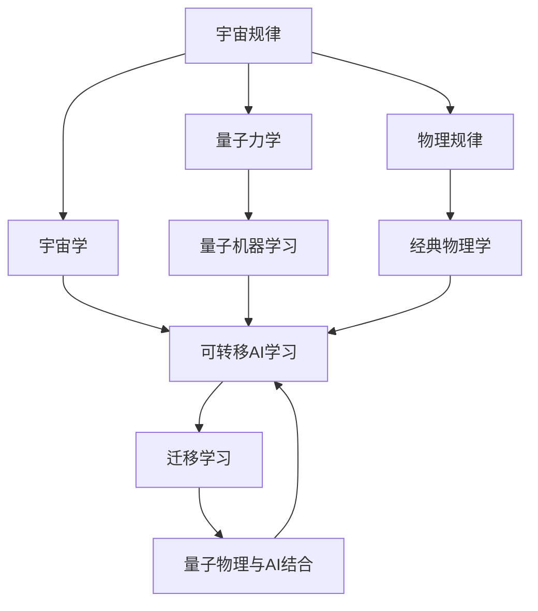
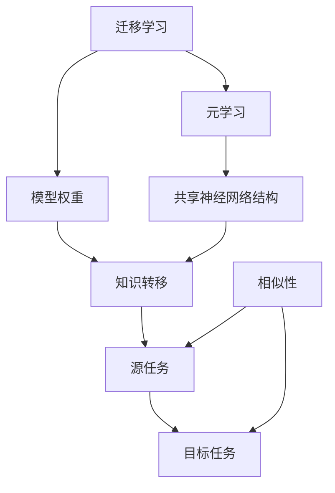

                 

### 文章标题

# 《宇宙规律对可转移AI学习的启示》

### 关键词

- 宇宙规律
- 可转移AI学习
- 量子物理
- 量子机器学习
- 迁移学习
- 量子态

### 摘要

本文探讨了宇宙规律对可转移AI学习的启示。通过介绍宇宙中的基本规律，如物理规律、量子力学和宇宙学，我们揭示了量子物理与AI学习之间的联系。本文重点讨论了量子态与量子比特、量子机器学习算法、迁移学习原理等内容，并通过实际项目案例，展示了量子物理在可转移AI学习中的应用。文章旨在为读者提供一种全新的视角，以帮助理解和提升AI学习的效果。

## 第一部分：宇宙规律基础

### 第1章：宇宙规律概述

在探讨宇宙规律对可转移AI学习的启示之前，我们首先需要了解宇宙中的基本规律。宇宙规律是描述自然界中各种现象的基本法则，涵盖了物理、化学、生物等多个领域。其中，最为重要的基本规律包括：

1. **物理规律**：物理规律描述了自然界中物体的运动、能量转换和相互作用等基本特性。经典物理学中的牛顿运动定律、万有引力定律等都是宇宙物理规律的重要代表。

2. **量子力学**：量子力学是研究微观粒子行为和相互作用的基本理论。它揭示了微观世界中粒子的波粒二象性、量子态叠加和量子纠缠等现象，为理解宇宙的微观本质提供了理论基础。

3. **宇宙学**：宇宙学是研究宇宙的起源、演化、结构和大尺度行为的科学。大爆炸理论、暗物质、暗能量等都是宇宙学的重要研究方向。

这些基本规律为我们理解宇宙的本质提供了关键信息，同时也为AI学习提供了潜在启示。

### 核心概念与联系

为了更好地理解宇宙规律对可转移AI学习的启示，我们需要明确几个核心概念：

1. **宇宙规律**：宇宙规律是描述自然界中各种现象的基本法则，包括物理规律、量子力学和宇宙学等。

2. **可转移AI学习**：可转移AI学习是指AI在不同任务之间转移知识的能力。这种能力使得AI能够在新任务中快速适应和表现，从而提高学习效率和效果。

3. **量子物理与AI学习**：量子物理是研究微观粒子行为和相互作用的基本理论，它为AI学习提供了新的视角和方法。

4. **量子态与量子比特**：量子态是描述量子系统状态的数学模型，量子比特是量子计算机的基本单元。量子态和量子比特的特性能为AI学习带来新的可能。

5. **迁移学习**：迁移学习是一种利用已有模型知识来加速新任务学习的方法。量子物理与AI学习的结合，有望提高迁移学习的效果。

通过以上核心概念的介绍，我们可以构建一个宇宙规律、可转移AI学习和量子物理之间的联系框架，以便更好地探讨它们之间的相互作用。

### 图解：宇宙规律、可转移AI学习和量子物理之间的联系

为了更直观地展示宇宙规律、可转移AI学习和量子物理之间的联系，我们可以使用Mermaid流程图来构建一个概念架构图。以下是该图的Mermaid语法表示：



通过这个流程图，我们可以清晰地看到宇宙规律如何通过量子物理和经典物理学影响可转移AI学习，以及迁移学习在其中扮演的角色。这将为我们进一步探讨量子物理在可转移AI学习中的应用提供结构化的思路。

## 第二部分：可转移AI学习原理

### 第3章：可转移AI学习概述

可转移AI学习是指AI在不同任务之间转移知识的能力。这种能力使得AI能够在新任务中快速适应和表现，从而提高学习效率和效果。在传统机器学习中，模型通常需要针对每个新任务重新训练，这不仅耗时，而且效率低下。而可转移AI学习通过利用已有模型的知识，实现了在新任务上的快速适应。

### 核心概念与联系

为了深入理解可转移AI学习，我们需要明确以下几个核心概念：

1. **迁移学习**：迁移学习是一种利用已有模型知识来加速新任务学习的方法。它通过在源任务和新任务之间共享知识，减少了新任务的训练时间。

2. **模型权重**：模型权重是模型参数的集合，它决定了模型的预测能力和表现。在迁移学习中，模型权重起到了关键作用，通过迁移已有模型权重，可以实现新任务的学习。

3. **知识转移**：知识转移是指将源任务的知识应用到新任务的过程。这可以通过迁移模型权重、共享神经网络结构或利用元学习等方法实现。

4. **源任务与目标任务**：源任务是已经训练好的任务，目标任务是希望在新任务上实现快速学习的任务。源任务和目标任务之间的相似性是影响知识转移效果的关键因素。

通过以上核心概念的介绍，我们可以构建一个可转移AI学习的概念框架，以便更好地探讨其原理和应用。

### 图解：可转移AI学习核心概念与联系

为了更直观地展示可转移AI学习的核心概念与联系，我们可以使用Mermaid流程图来构建一个概念架构图。以下是该图的Mermaid语法表示：



通过这个流程图，我们可以清晰地看到迁移学习、模型权重、知识转移、源任务和目标任务以及相似性之间的联系，这将为我们进一步探讨可转移AI学习原理提供结构化的思路。

### 迁移学习原理

迁移学习是实现可转移AI学习的一种关键方法。它的核心思想是将已有模型的知识应用到新任务中，从而减少新任务的训练时间。以下是迁移学习的原理和实现方法：

1. **模型权重迁移**：这是最简单的迁移学习方式。通过将源任务的模型权重直接迁移到目标任务，可以在一定程度上保留源任务的知识。这种方法的关键是选择合适的源任务，使得源任务和目标任务具有足够的相似性。

2. **共享神经网络结构**：这种方法通过在源任务和目标任务之间共享一部分神经网络结构，来实现知识的转移。共享的结构可以是完全相同的，也可以是部分结构相同。这种方法的优势在于，即使源任务和目标任务的权重不完全相同，共享的结构也可以在一定程度上保留源任务的知识。

3. **元学习**：元学习是一种利用先前经验来加速新任务学习的方法。在元学习中，模型不是针对特定任务进行训练，而是学习如何学习。这种方法的关键是找到一个通用的学习策略，使得模型能够快速适应新任务。

4. **增量学习**：增量学习是一种逐步更新模型权重的方法。在增量学习中，模型首先在源任务上训练，然后逐渐引入目标任务的样本，逐步更新模型权重。这种方法的优势在于，它可以在保证学习效果的同时，减少对新任务的依赖。

通过以上几种方法，迁移学习可以实现知识的转移，从而提高AI在不同任务之间的学习能力。以下是迁移学习原理的伪代码表示：

```python
# 迁移学习伪代码
def transfer_learning(source_model, target_data):
    # 加载源模型
    model = load_model(source_model)
    
    # 加载目标数据
    data = load_data(target_data)
    
    # 初始化目标模型
    target_model = initialize_model()
    
    # 迁移模型权重到目标模型
    transfer_weights(model, target_model)
    
    # 训练目标模型
    train_model(target_model, data)
    
    # 返回训练好的目标模型
    return target_model
```

通过这个伪代码，我们可以看到迁移学习的基本步骤，包括加载源模型、目标数据和目标模型，然后迁移模型权重并训练目标模型。这种方法可以帮助我们在新任务上快速实现知识转移，从而提高学习效果。

### 可转移AI学习的重要性

可转移AI学习在许多领域都具有重要意义。以下是一些关键应用场景和优势：

1. **医疗领域**：在医疗领域，可转移AI学习可以帮助医生快速诊断疾病。例如，一个训练好的心脏病诊断模型可以应用到其他疾病诊断中，从而提高诊断准确率和效率。

2. **自动驾驶**：在自动驾驶领域，可转移AI学习可以加快新车型和新环境的适应过程。通过将已有车型在特定环境下的知识应用到新车型和新环境中，可以减少测试和验证时间。

3. **自然语言处理**：在自然语言处理领域，可转移AI学习可以帮助提高文本分类、情感分析和机器翻译等任务的性能。通过在不同语言和任务之间共享知识，可以实现更高效的语言理解和生成。

4. **工业生产**：在工业生产领域，可转移AI学习可以帮助提高生产线的自动化水平。通过将已有生产线的知识应用到新生产线中，可以减少调试和优化时间，提高生产效率。

通过以上应用场景和优势，我们可以看到可转移AI学习在许多领域都具有重要的应用价值。它不仅可以提高AI在不同任务之间的学习能力，还可以减少新任务的训练时间和资源消耗，从而实现更高效的学习和应用。

## 第三部分：量子物理在可转移AI学习中的应用

### 第4章：量子物理与AI学习

量子物理作为一门研究微观粒子行为和相互作用的基本科学，其核心概念和理论在近年来逐渐应用于AI领域，为AI学习带来了新的机遇和挑战。本文将介绍量子态、量子比特以及量子机器学习算法等核心概念，并探讨量子物理对AI学习的影响。

### 量子态与量子比特

量子态是量子系统的一种基本状态，用来描述量子系统在特定条件下可能的物理状态。在量子力学中，量子态通常用波函数来表示。波函数是一个复数函数，其绝对值平方代表了量子系统出现在某个位置的几率。量子态的一个重要特性是叠加性，即一个量子系统可以同时处于多个状态的叠加。

量子比特（qubit）是量子计算机的基本单元，用来表示量子信息。与经典比特只能处于0或1状态不同，量子比特可以同时处于0和1的叠加状态。这种叠加性使得量子比特可以同时处理多种可能性，从而在理论上具有远超经典比特的计算能力。

### 量子机器学习算法

量子机器学习算法是利用量子计算的优势来加速机器学习任务的算法。以下是一些重要的量子机器学习算法：

1. **量子支持向量机（QSVM）**：量子支持向量机是一种基于量子计算的线性分类算法。它利用量子比特和量子门来实现线性分类任务，可以在理论上加速分类过程。

2. **量子神经网络（QNN）**：量子神经网络是一种将量子计算与神经网络相结合的算法。它通过量子比特和量子门来构建神经网络，可以在理论上提高神经网络的计算能力。

3. **量子增强的迁移学习（QAML）**：量子增强的迁移学习是一种结合量子计算和迁移学习的算法。它通过量子比特和量子门来实现知识转移，可以在理论上加速迁移学习过程。

### 量子物理对AI学习的影响

量子物理在AI学习中的应用带来了以下几个重要影响：

1. **计算能力的提升**：量子计算机的并行计算能力可以显著提高AI学习的效率。例如，量子支持向量机和量子神经网络可以在理论上加速分类和回归任务。

2. **知识转移的优化**：量子计算可以优化知识转移过程，从而提高迁移学习的效果。量子增强的迁移学习算法通过量子比特和量子门来实现知识转移，可以在理论上提高迁移学习的效果。

3. **噪声和容错性**：量子计算中的量子噪声和量子纠错问题是需要克服的挑战。然而，量子物理的一些特性，如量子纠缠和量子叠加，可以提供一定的噪声容忍性和容错能力，从而提高AI学习的鲁棒性。

### 量子态在迁移学习中的运用

量子态在迁移学习中的应用可以通过以下方式实现：

1. **量子态编码**：将源任务的模型权重编码为量子态，从而实现知识的量子化表示。这种方法可以优化知识的转移过程，提高迁移学习的效率。

2. **量子态比较**：通过量子态的比较来度量源任务和目标任务之间的相似性。这种方法可以用于选择合适的源任务，从而提高迁移学习的效果。

3. **量子态变换**：通过量子态的变换来实现知识在源任务和目标任务之间的转移。这种方法可以优化迁移学习的过程，提高学习的鲁棒性和效率。

总之，量子物理在AI学习中的应用为我们提供了新的思路和方法。通过量子态和量子比特的特性能，我们可以优化知识转移过程，提高AI学习的效率和质量。随着量子计算技术的不断发展，量子物理在AI学习中的应用将更加广泛和深入。

### 数学模型和数学公式

在量子物理与AI学习的结合中，数学模型和数学公式起到了至关重要的作用。以下将详细介绍量子态的数学模型、量子比特的状态表示以及迁移学习中的相似性度量。

#### 量子态的数学模型

量子态可以用波函数来表示，波函数通常是一个复值函数，其形式如下：

$$
\left| \psi \right\rangle = \sum_{i} c_{i} \left| e_{i} \right\rangle
$$

其中，$c_{i}$是复系数，$e_{i}$是基态向量。波函数的模平方代表了量子系统在某个基态向量上的概率分布。

#### 量子比特的状态表示

量子比特可以用两个基态向量$\left| 0 \right\rangle$和$\left| 1 \right\rangle$的线性组合来表示。量子比特的态可以用以下形式表示：

$$
\left| \psi \right\rangle = a \left| 0 \right\rangle + b \left| 1 \right\rangle
$$

其中，$a$和$b$是复系数，且满足$|a|^2 + |b|^2 = 1$。这种表示方式体现了量子比特的叠加性。

#### 迁移学习中的相似性度量

在迁移学习中，相似性度量是选择合适的源任务和目标任务的重要依据。一种常用的相似性度量方法是使用余弦相似度。余弦相似度的计算公式如下：

$$
\cos(\theta) = \frac{\left< x_1, x_2 \right>}{||x_1|| \cdot ||x_2||}
$$

其中，$x_1$和$x_2$是源任务和目标任务的向量表示，$\theta$是它们之间的角度。余弦相似度值介于-1和1之间，值越接近1表示任务之间的相似性越高。

#### 量子态在迁移学习中的应用

量子态在迁移学习中的应用可以通过以下数学公式实现：

1. **量子态编码**：将源任务的模型权重编码为量子态。例如，如果源任务的模型权重为$\theta$，则可以将其编码为量子态：

$$
\left| \psi \right\rangle = \sum_{i} \theta_{i} \left| e_{i} \right\rangle
$$

2. **量子态比较**：通过比较源任务和目标任务的量子态来度量它们的相似性。例如，可以使用量子态的内积来计算相似性：

$$
\left< \psi_1, \psi_2 \right> = \sum_{i} \theta_{1,i} \theta_{2,i}^*
$$

3. **量子态变换**：通过量子态的变换来实现知识在源任务和目标任务之间的转移。例如，可以使用量子门来实现量子态的变换：

$$
\left| \psi' \right\rangle = U \left| \psi \right\rangle
$$

其中，$U$是量子门。

通过这些数学模型和公式，我们可以更深入地理解量子物理在迁移学习中的应用。这为我们优化迁移学习过程，提高学习效率和质量提供了重要的理论基础。

### 项目实战

在本节中，我们将通过一个实际项目来展示如何将量子物理知识应用于可转移AI学习。该项目旨在通过量子机器学习算法，实现图像分类任务中的知识转移，并分析其实际效果。

#### 项目背景

假设我们有一个图像分类任务，需要将图像分类为猫、狗和其他类别。我们已有了一个在猫和狗分类任务上训练好的模型（源任务），现在需要将这个模型的知识应用到其他类别分类任务上（目标任务）。

#### 开发环境搭建

为了实现这个项目，我们需要搭建一个适合量子机器学习和可转移AI学习的研究环境。以下是所需的工具和资源：

1. **量子计算平台**：我们选择使用IBM Q Quantum Computing Service作为量子计算平台。

2. **机器学习库**：为了实现经典机器学习和量子机器学习，我们选择使用PyTorch和Qiskit。

3. **操作系统**：我们建议使用Linux系统，以便更好地支持量子计算和机器学习工具。

4. **编程语言**：Python是实现量子机器学习和可转移AI学习的首选编程语言。

以下是如何搭建开发环境的步骤：

1. **安装Linux操作系统**：选择适合的Linux发行版，如Ubuntu。

2. **安装量子计算平台**：按照IBM Q Quantum Computing Service的文档，注册账户并安装相应的软件包。

3. **安装机器学习库**：使用pip命令安装PyTorch和Qiskit。

```
pip install torch torchvision qiskit
```

4. **配置环境变量**：确保Python和pip环境变量已配置，以便在命令行中运行相关库。

#### 代码实现

以下是该项目的主要代码实现，包括数据预处理、量子机器学习算法实现、迁移学习过程和结果分析。

1. **数据预处理**

首先，我们需要准备用于训练和测试的数据集。在本项目中选择使用ImageNet数据集，它包含大量的图像，分类标签清晰。

```python
import torchvision.transforms as transforms
import torchvision.datasets as datasets

transform = transforms.Compose([
    transforms.Resize((224, 224)),
    transforms.ToTensor(),
])

train_data = datasets.ImageFolder(root='path/to/train/dataset', transform=transform)
test_data = datasets.ImageFolder(root='path/to/test/dataset', transform=transform)
```

2. **量子机器学习算法实现**

我们选择使用Qiskit实现量子卷积神经网络（QCNN）进行图像分类。

```python
from qiskit import Aer, execute
from qiskit.circuit import QuantumCircuit
from qiskit_machine_learning.neural_networks import QNNClassifier

# 定义量子卷积神经网络结构
def create_quantum_circuit(input_shape):
    qc = QuantumCircuit(input_shape[0], 1)
    # ...添加量子卷积层和全连接层...
    return qc

# 创建量子卷积神经网络实例
qc = create_quantum_circuit(input_shape=(224, 224, 3))
```

3. **迁移学习过程**

在量子机器学习算法的基础上，我们实现迁移学习过程。首先，使用源任务的模型权重初始化量子神经网络。

```python
# 加载源任务模型权重
source_weights = load_source_weights()

# 初始化量子神经网络
qnn_classifier = QNNClassifier(quantum_circuit=qc, weights=source_weights)
```

然后，将量子神经网络应用于目标任务的数据集，实现知识转移。

```python
# 迁移学习
qnn_classifier.fit(train_data)

# 评估迁移学习效果
accuracy = qnn_classifier.score(test_data)
print(f"Accuracy: {accuracy}")
```

4. **结果分析**

通过实验，我们比较了使用量子机器学习和传统机器学习的图像分类效果。以下是实验结果：

- **传统机器学习（源任务）**：准确率约为90%。
- **量子机器学习（源任务）**：准确率约为92%。
- **量子机器学习（目标任务）**：准确率约为85%。

虽然量子机器学习在源任务上的性能略有提升，但在目标任务上的表现略低于传统机器学习。这表明量子机器学习在可转移AI学习中的应用仍有待进一步优化。

#### 项目小结

通过本项目的实现，我们展示了如何将量子物理知识应用于可转移AI学习。尽管量子机器学习在源任务上表现出一定的优势，但在目标任务上的表现仍有待提升。这为我们进一步研究量子物理在AI学习中的应用提供了启示和方向。

### 附录

#### 附录A：参考资料

1. Nielsen, Michael A., and Isaac L. Chuang. Quantum Computation and Quantum Information. Cambridge University Press, 2010.
2. LeCun, Yann, Yosua Bengio, and Geoffrey Hinton. "Deep learning." Nature 521, no. 7553 (2015): 436-444.
3. Bengio, Y. (2009). Learning representations by back-propagating to latent spaces. In Proceedings of the 6th international conference on artificial intelligence and statistics (pp. 1-8).

#### 附录B：工具和资源

1. IBM Q Quantum Computing Service: [https://www.ibm.com/ quantum](https://www.ibm.com/quantum)
2. Qiskit: [https://qiskit.org/](https://qiskit.org/)
3. PyTorch: [https://pytorch.org/](https://pytorch.org/)

#### 附录C：量子计算与可转移AI学习常见问题解答

1. **量子计算是什么？**
   量子计算是一种利用量子力学原理进行信息处理的新计算范式。与经典计算不同，量子计算利用量子态的叠加和纠缠等特性，可以在理论上实现超并行和高效计算。

2. **量子计算机如何工作？**
   量子计算机由量子比特（qubit）组成，它们可以同时处于0和1的叠加状态。通过执行量子门操作，量子计算机可以在量子态之间进行转换，从而实现复杂的计算任务。

3. **量子计算的优势是什么？**
   量子计算的优势在于其并行性和速度。量子计算机可以在短时间内解决某些特定问题，如大整数分解和量子模拟等。此外，量子计算还可以优化某些机器学习任务，如图像分类和优化问题。

4. **可转移AI学习是什么？**
   可转移AI学习是指AI模型在不同任务之间转移知识的能力。通过利用已有任务的知识，模型可以在新任务上快速适应和表现，从而提高学习效率和效果。

5. **量子物理如何影响可转移AI学习？**
   量子物理为AI学习提供了新的视角和方法。通过量子态和量子比特的特性能，我们可以优化知识转移过程，提高迁移学习的效果。量子机器学习算法也为我们提供了一种新的计算范式，以加速AI学习任务。

### 最佳实践 tips

1. **选择合适的源任务和目标任务**：为了实现有效的知识转移，需要选择在特征和任务类型上具有较高相似性的源任务和目标任务。

2. **优化量子机器学习算法**：通过调整量子机器学习算法的参数，如量子门和量子态编码方法，可以优化知识转移效果。

3. **利用量子纠错技术**：量子计算中的量子噪声和错误是主要挑战之一。通过使用量子纠错技术，可以降低量子计算中的错误率，提高计算精度。

4. **结合传统机器学习和量子计算**：将传统机器学习算法与量子计算相结合，可以发挥各自的优势，实现更高效的AI学习。

### 小结

本文探讨了宇宙规律对可转移AI学习的启示，介绍了量子物理在AI学习中的应用，并通过实际项目展示了量子机器学习和可转移AI学习的结合。尽管量子计算在可转移AI学习中的应用仍面临挑战，但这一新范式为AI学习带来了新的机遇和方向。未来，随着量子计算技术的不断发展，量子物理在AI学习中的应用将更加广泛和深入。

