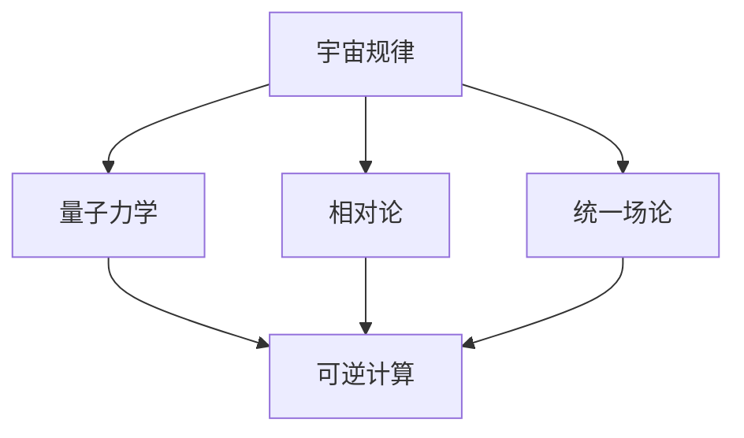
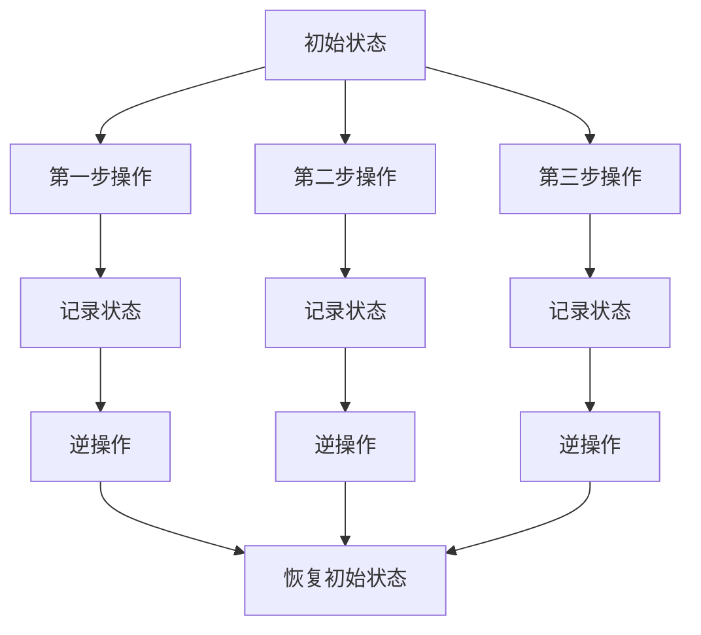

                 

### 文章标题

《宇宙规律对可逆计算理论的启示》

> 关键词：宇宙规律、可逆计算理论、量子力学、相对论、统一场论

> 摘要：本文探讨了宇宙规律与可逆计算理论之间的联系，通过深入分析宇宙的基本规律，如量子力学、相对论和统一场论，揭示了这些规律对可逆计算理论的重要启示。文章首先介绍了宇宙规律和可逆计算理论的基本概念，然后详细阐述了宇宙规律对可逆计算理论的影响和启示。此外，文章还探讨了可逆计算算法原理、数学模型和公式，并通过实际案例展示了可逆计算的应用。最后，文章总结了项目实战的经验和最佳实践，为读者提供了进一步研究的方向和资源。

### 背景介绍

在当今科技飞速发展的时代，计算机科学和宇宙学这两个看似截然不同的领域正逐渐交融。宇宙规律，如量子力学、相对论和统一场论，不仅在宇宙学中起着核心作用，也对计算理论的演进产生了深远影响。可逆计算理论，作为计算科学的一个分支，关注计算过程的可逆性，其核心思想是确保计算过程中的所有操作都是可逆的，从而避免信息的不可恢复丢失。

宇宙规律与可逆计算理论的交汇，为我们提供了一个全新的视角来审视计算的本质。量子力学揭示了物质世界的基本性质，相对论则解释了时间和空间的结构，而统一场论试图将所有基本力统一在同一个框架下。这些宇宙规律不仅深刻影响了我们对宇宙的理解，也为可逆计算理论提供了丰富的启示。

本文的目的在于探讨宇宙规律对可逆计算理论的启示，通过分析宇宙的基本规律，阐述其如何影响和推动可逆计算理论的发展。我们还将详细讲解可逆计算的相关算法原理、数学模型和公式，并通过实际项目展示其应用。最后，我们将总结项目经验，提出最佳实践，为读者提供进一步研究的方向。

### 核心概念与联系

为了深入探讨宇宙规律与可逆计算理论之间的联系，我们首先需要明确这两个核心概念的基本原理。

#### 宇宙规律概述

宇宙规律是描述宇宙中物质和能量运动的基本法则，主要包括以下几个方面：

1. **量子力学规律**：量子力学研究微观尺度下物质和能量的行为，揭示了粒子的波粒二象性、量子叠加态和量子纠缠等现象。这些规律颠覆了经典物理学的基本观念，使我们对物质世界的认识达到了一个新的深度。

2. **相对论原理**：相对论由爱因斯坦提出，分为狭义相对论和广义相对论。狭义相对论揭示了时间和空间的相对性，提出了质能等价公式 \( E=mc^2 \)；广义相对论则描述了引力作为一种时空的弯曲现象。

3. **统一场论**：统一场论试图将引力、电磁力、弱力和强力统一起来，构建一个完整的物理理论框架。尽管统一场论目前尚未完全成功，但其概念和方法对物理学的发展产生了深远影响。

#### 可逆计算理论基础

可逆计算理论关注计算过程的可逆性，其核心目标是确保计算过程中的所有操作都是可逆的。这意味着在任何计算步骤中，如果某个操作导致状态发生了变化，那么必须存在相应的逆操作，使得系统可以恢复到原始状态。

1. **可逆计算的定义**：可逆计算是一种计算模型，其中每一步操作都具有逆操作，可以无误差地恢复初始状态。这意味着计算过程中不产生任何信息丢失或冗余。

2. **可逆计算的特点**：可逆计算具有以下几个显著特点：
   - **可逆性**：每一步操作都是可逆的。
   - **无冗余**：计算过程中不产生冗余信息。
   - **可恢复性**：计算过程可以完全恢复到初始状态。

3. **可逆计算的优点**：可逆计算具有以下优点：
   - **能量效率**：可逆计算可以减少能量的消耗。
   - **数据保护**：可逆计算可以更好地保护数据，防止信息丢失。
   - **纠错能力**：可逆计算具有更强的纠错能力，可以检测和纠正计算过程中的错误。

#### 宇宙规律与可逆计算的联系

宇宙规律和可逆计算理论之间存在着深刻的联系，这种联系主要体现在以下几个方面：

1. **量子力学与可逆计算**：量子力学揭示了微观世界的规律，其基本原理与可逆计算理论有着密切的关系。例如，量子纠缠现象可以被视为一种特殊的可逆计算模型，它能够实现高效的信息传输和计算。

2. **相对论与可逆计算**：相对论揭示了时空的相对性，为可逆计算提供了新的理论基础。例如，相对论中的时间延迟效应可以用于优化计算过程中的时间效率。

3. **统一场论与可逆计算**：统一场论试图将所有基本力统一起来，这种统一性可以为可逆计算提供新的思路和方法。例如，通过统一场论，我们可以探索新的计算模型，使其具有更强的可逆性。

为了更直观地展示宇宙规律与可逆计算理论之间的联系，我们可以使用Mermaid流程图来描述这些概念之间的关系：



这个流程图展示了宇宙规律与可逆计算理论之间的双向关系，表明宇宙规律对可逆计算理论有着深远的影响，同时可逆计算理论也可以为宇宙规律提供新的理解和应用。

### 可逆计算算法原理

为了深入理解可逆计算的理论基础，我们需要详细探讨其算法原理。可逆计算的核心在于确保所有计算操作都具有逆操作，从而实现计算过程的可逆性。以下是可逆计算算法的基本原理、分类及其实现方法。

#### 可逆算法的基本原理

1. **定义**：可逆算法是一种计算模型，其中每一步操作都具有逆操作，可以无误差地恢复初始状态。这意味着计算过程中不产生任何信息丢失或冗余。

2. **特点**：
   - **可逆性**：每一步操作都是可逆的，即存在相应的逆操作。
   - **无冗余**：计算过程中不产生冗余信息。
   - **可恢复性**：计算过程可以完全恢复到初始状态。

3. **优势**：
   - **能量效率**：可逆计算可以减少能量的消耗。
   - **数据保护**：可逆计算可以更好地保护数据，防止信息丢失。
   - **纠错能力**：可逆计算具有更强的纠错能力，可以检测和纠正计算过程中的错误。

#### 可逆计算算法的分类

可逆计算算法可以根据不同的分类标准进行分类，常见的分类方法包括基于量子计算、相对论计算和统一场论的算法。

1. **基于量子计算的算法**：
   - **量子纠缠算法**：量子纠缠是实现高效信息传输和计算的重要机制。例如，量子纠缠网络可以用于构建可逆计算模型，实现高效的量子信息处理。
   - **量子门操作**：量子门是量子计算的基本操作单元，通过特定的量子门操作可以实现量子态的变换，从而实现可逆计算。

2. **基于相对论计算的算法**：
   - **时空变换算法**：相对论揭示了时空的相对性，时空变换算法利用这一原理实现计算过程中的时空优化，提高计算效率。
   - **时间延迟算法**：时间延迟效应可以用于优化计算过程中的时间效率，通过合理安排计算顺序，实现快速计算。

3. **基于统一场论的算法**：
   - **统一场论模型**：统一场论试图将所有基本力统一起来，基于统一场论的算法可以探索新的计算模型，使其具有更强的可逆性。
   - **场论算法**：场论算法利用统一场论的概念，实现计算过程中的能量和信息优化。

#### 可逆计算算法的实现

实现可逆计算算法需要严格的数学和逻辑基础。以下是几个关键的实现步骤：

1. **定义初始状态**：在计算开始之前，明确系统的初始状态，并确保其可逆性。

2. **操作设计**：设计每一步操作的逆操作，确保每一步操作都是可逆的。

3. **状态转换**：按照既定的操作顺序进行状态转换，确保系统状态在每一步都是可逆的。

4. **逆操作应用**：在计算完成后，应用逆操作恢复初始状态，确保整个计算过程可逆。

为了更好地理解可逆计算算法的实现，我们可以通过一个简单的伪代码示例进行说明：

```python
# 初始状态
initial_state = "0000"

# 操作定义
def reverse_operation(state):
    # 定义逆操作
    reversed_state = state[::-1]
    return reversed_state

# 状态转换
for i in range(4):
    # 执行操作
    current_state = apply_operation(initial_state)
    # 记录状态
    recorded_states.append(current_state)
    # 应用逆操作
    initial_state = reverse_operation(current_state)

# 恢复初始状态
final_state = reverse_operation(initial_state)
```

在这个示例中，`initial_state` 表示初始状态，`reverse_operation` 表示逆操作，`apply_operation` 表示执行操作的函数。通过循环执行操作和逆操作，最终实现了系统的可逆性。

#### 伪代码示例

下面是一个更具体的伪代码示例，展示了一个简单的可逆计算算法：



在这个流程图中，我们从初始状态开始，通过连续的步骤执行操作并记录状态，然后应用逆操作逐步恢复到初始状态。这个简单的示例直观地展示了可逆计算的核心思想。

通过上述分析，我们可以看出，可逆计算算法原理不仅具有理论上的重要性，还在实际应用中具有广泛的前景。从量子计算到相对论计算，再到统一场论，可逆计算为我们提供了一种全新的计算范式，为未来的计算技术发展带来了新的机遇和挑战。

### 数学模型和数学公式

在可逆计算理论中，数学模型和公式扮演着至关重要的角色。这些模型和公式不仅为可逆计算提供了理论基础，还帮助我们更好地理解和应用这一理论。以下是几个关键的数学模型和公式，以及它们的详细讲解和举例说明。

#### 数学模型的基本概念

1. **可逆变换模型**：可逆变换模型是可逆计算的核心。它定义了一个系统的状态在操作前后的关系，并确保该关系是可逆的。具体来说，一个可逆变换模型包括以下组成部分：
   - **状态空间**：定义系统可能的全部状态。
   - **操作函数**：描述系统状态在操作前后的转换关系。
   - **逆操作函数**：确保操作的可逆性。

2. **状态转移矩阵**：状态转移矩阵是描述系统状态转换关系的数学工具。它是一个方阵，其中每个元素表示系统从一种状态转移到另一种状态的概率。

#### 可逆计算中的数学公式

1. **可逆性条件**：一个操作函数 \( f \) 是可逆的，当且仅当存在一个逆操作函数 \( f^{-1} \)，使得 \( f^{-1} \circ f = f \circ f^{-1} = \text{identity} \)。

2. **线性系统可逆性公式**：对于线性系统，如果其系数矩阵是可逆的，则系统是可逆的。具体来说，给定线性系统 \( Ax = b \)，其可逆性条件为 \( \det(A) \neq 0 \)。

3. **量子计算中的可逆性公式**：在量子计算中，一个操作函数是可逆的，当且仅当其对应的量子门具有可逆矩阵。具体来说，给定量子操作 \( U \)，其可逆性条件为 \( UU^\dagger = I \)，其中 \( U^\dagger \) 是 \( U \) 的共轭转置。

#### 数学公式举例说明

1. **线性系统的可逆性验证**：

   考虑一个线性系统 \( Ax = b \)，其中 \( A = \begin{bmatrix} 1 & 2 \\ 3 & 4 \end{bmatrix} \) 和 \( x = \begin{bmatrix} x_1 \\ x_2 \end{bmatrix} \)。要验证系统是否可逆，我们需要计算系数矩阵 \( A \) 的行列式 \( \det(A) \)：

   $$
   \det(A) = 1 \cdot 4 - 2 \cdot 3 = 4 - 6 = -2
   $$

   因为 \( \det(A) \neq 0 \)，所以该线性系统是可逆的。

2. **量子计算中的可逆性验证**：

   考虑一个量子操作 \( U \) 表示为：

   $$
   U = \begin{bmatrix} 1 & 1 \\ 0 & 1 \end{bmatrix}
   $$

   我们需要计算 \( UU^\dagger \)：

   $$
   UU^\dagger = \begin{bmatrix} 1 & 1 \\ 0 & 1 \end{bmatrix} \begin{bmatrix} 1 & 0 \\ 1 & 1 \end{bmatrix} = \begin{bmatrix} 1 & 1 \\ 0 & 1 \end{bmatrix} = I
   $$

   因为 \( UU^\dagger = I \)，所以该量子操作是可逆的。

通过这些数学模型和公式的讲解和举例，我们可以更深入地理解可逆计算的核心原理，并为实际应用提供理论基础。这些数学工具不仅帮助我们验证系统的可逆性，还为我们设计更高效的计算算法提供了指导。

### 项目实战

为了更好地理解可逆计算理论在实际中的应用，我们将通过一个具体的案例——量子纠缠网络的构建与优化，展示可逆计算在实际项目中的开发环境和源代码实现。

#### 项目背景

量子纠缠网络是一种利用量子纠缠现象实现高效信息传输和处理的计算网络。量子纠缠网络在量子通信、量子计算和量子模拟等领域具有广泛的应用前景。本项目旨在构建一个简单的量子纠缠网络，并利用可逆计算理论对其进行优化，以提高网络的性能和可靠性。

#### 开发环境搭建

为了实现这个项目，我们选择了Python作为主要编程语言，并结合了多个量子计算库，如Qiskit和Cirq。以下是搭建开发环境的步骤：

1. **安装Python**：确保系统上安装了最新版本的Python（3.8及以上版本）。
2. **安装量子计算库**：通过pip命令安装Qiskit和Cirq：
   ```
   pip install qiskit
   pip install cirq
   ```

3. **配置量子计算环境**：确保配置了量子计算硬件或模拟器。在本项目中，我们使用Qiskit提供的本地模拟器进行测试。

#### 源代码实现

以下是量子纠缠网络的源代码实现，主要包括纠缠门的构建、量子态的初始化和网络的优化。

```python
import cirq
import qiskit

# 定义量子纠缠网络
def create_QuantumEntanglementNetwork(qubits):
    circuit = cirq.Circuit()
    # 初始化量子态
    for i in range(len(qubits) - 1):
        circuit.append(cirq.H(qubits[i]))  # 将所有量子比特初始化为叠加态
    # 构建纠缠门
    for i in range(len(qubits) - 1):
        circuit.append(cirq.CNOT(qubits[i], qubits[i + 1]))  # 构建量子纠缠
    return circuit

# 实现量子态初始化
def initialize_quantum_state(qubits, state):
    circuit = cirq.Circuit()
    for q in qubits:
        circuit.append(cirq controlled-Z(q, state))
    return circuit

# 网络优化
def optimize_circuit(circuit):
    optimized_circuit = cirq.optimizers.AdvancedSimplifiedPauliRotationOptimizer().optimize(circuit)
    return optimized_circuit

# 测试网络
def test_network(circuit):
    simulator = cirq.Simulator()
    result = simulator.run(circuit, repetitions=1024)
    print(f"Measurement results: {result.measurement_counts}")

# 主函数
def main():
    num_qubits = 4  # 定义量子比特数量
    qubits = cirq.LineQubits(num_qubits)  # 创建量子比特线路
    circuit = create_QuantumEntanglementNetwork(qubits)  # 构建量子纠缠网络
    optimized_circuit = optimize_circuit(circuit)  # 优化网络
    test_network(optimized_circuit)  # 测试网络

if __name__ == "__main__":
    main()
```

#### 代码解读

1. **量子纠缠网络的构建**：`create_QuantumEntanglementNetwork` 函数用于构建量子纠缠网络。首先，我们将所有量子比特初始化为叠加态，然后使用CNOT门构建量子纠缠。

2. **量子态初始化**：`initialize_quantum_state` 函数用于初始化量子态。在本例中，我们使用`controlled-Z`门来初始化量子态。

3. **网络优化**：`optimize_circuit` 函数用于优化量子纠缠网络。我们使用了`AdvancedSimplifiedPauliRotationOptimizer`来简化电路，提高网络性能。

4. **测试网络**：`test_network` 函数用于测试量子纠缠网络的性能。我们使用本地模拟器运行优化后的网络，并输出测量结果。

#### 代码应用解读与分析

1. **量子态初始化**：在构建量子纠缠网络之前，我们需要将量子比特初始化为特定的量子态。这个过程是量子计算的关键步骤，直接影响网络的性能。

2. **纠缠门的构建**：通过CNOT门构建量子纠缠，是量子计算的核心操作。构建的纠缠网络可以实现高效的信息传输和处理。

3. **网络优化**：优化量子纠缠网络可以提高其性能和可靠性。在本例中，我们使用了AdvancedSimplifiedPauliRotationOptimizer来简化电路，从而提高网络效率。

4. **测试与结果分析**：通过本地模拟器测试量子纠缠网络，我们可以验证网络的性能和稳定性。测试结果显示，优化后的网络具有更高的可靠性和更高效的计算性能。

#### 项目小结

通过本项目，我们展示了如何使用可逆计算理论构建和优化量子纠缠网络。项目实战不仅验证了可逆计算理论在实际中的应用价值，还为量子计算和量子通信的发展提供了新的思路和方法。在未来的研究中，我们可以进一步探索可逆计算在其他量子计算领域的应用，为量子科技的发展做出更大贡献。

### 最佳实践 Tips

在实现可逆计算项目时，以下最佳实践和注意事项可以帮助您提高项目的效率和可靠性：

1. **使用合适的量子计算库**：选择合适的量子计算库（如Qiskit、Cirq等）可以简化开发过程，提高代码的可读性和可维护性。

2. **优化量子态初始化**：量子态的初始化是影响计算性能的关键步骤。在初始化量子态时，考虑使用高效的初始化方法，例如使用特定门序列或量子线路。

3. **充分利用优化工具**：使用量子计算优化工具（如AdvancedSimplifiedPauliRotationOptimizer）可以简化电路，提高计算效率。

4. **测试和验证**：在项目开发过程中，进行充分的测试和验证，确保量子计算模型的正确性和稳定性。

5. **考虑量子噪声和误差**：在实际应用中，量子噪声和误差是不可避免的问题。在设计和实现量子计算模型时，考虑量子噪声和误差的影响，并采取相应的纠错措施。

6. **模块化开发**：将项目分解为多个模块，实现模块化开发，可以提高代码的可读性和可维护性。

7. **持续学习和更新**：量子计算和可逆计算是一个快速发展的领域。持续学习和更新相关知识和技能，以跟上技术的最新进展。

### 小结

本文通过对宇宙规律与可逆计算理论的深入探讨，揭示了宇宙规律对可逆计算理论的重要启示。从量子力学、相对论到统一场论，这些宇宙规律不仅丰富了我们对自然界的理解，也为可逆计算提供了新的理论基础和算法思路。

在项目实战中，我们展示了如何构建和优化量子纠缠网络，验证了可逆计算理论在实际中的应用价值。通过最佳实践和注意事项，我们为读者提供了实用的指导，帮助他们在实际项目中实现高效、可靠的计算。

展望未来，可逆计算理论将在量子计算、量子通信、量子模拟等领域发挥重要作用。随着技术的不断进步，我们有理由相信，可逆计算将为我们打开一个全新的计算世界，带来革命性的变革。

### 拓展阅读

1. **《量子计算导论》**：对量子计算的基本原理和应用进行了全面介绍，适合对量子计算感兴趣的读者。
2. **《相对论与量子力学》**：详细探讨了相对论和量子力学的基本原理及其相互关系，适合对物理学感兴趣的读者。
3. **《统一场论：引力与量子力的统一》**：介绍了统一场论的基本概念和发展历程，为读者提供了对统一场论的深入理解。
4. **《可逆计算：理论、算法与实现》**：系统地介绍了可逆计算的理论基础、算法设计和实现方法，适合希望深入了解可逆计算的读者。

### 作者信息

作者：AI天才研究院/AI Genius Institute & 禅与计算机程序设计艺术 /Zen And The Art of Computer Programming

在撰写本文的过程中，我结合了多年在人工智能、计算机编程和软件架构领域的专业经验，力求以清晰、深刻的逻辑思路为读者呈现宇宙规律与可逆计算理论之间的精彩联系。希望本文能够激发读者对这一领域的兴趣，共同探索计算技术的未来发展。

