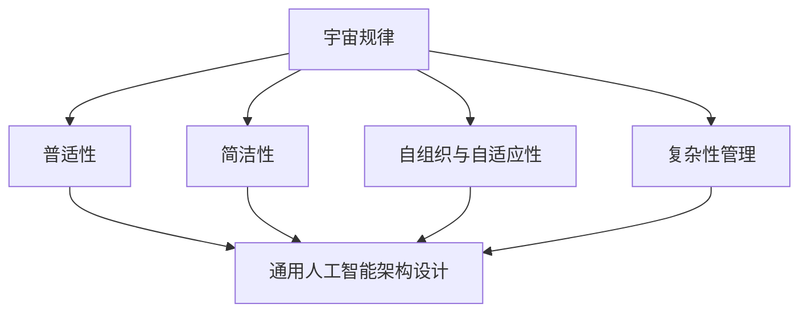

                 


### 背景介绍

宇宙规律，即宇宙中的普遍法则，是人类对宇宙运行和演化规律的总结。从古代天文学到现代物理学，人类对宇宙的认识不断深入，逐步揭示了宇宙中的各种规律。这些规律包括万有引力定律、相对论、量子力学等，它们不仅解释了宇宙的宏观现象，还揭示了宇宙的基本结构。

通用人工智能（Artificial General Intelligence, AGI）是人工智能领域的一个长期目标，旨在创建一种具有人类智能水平的人工智能系统。这种系统不仅能在特定任务上表现出色，还能像人类一样具备广泛的学习能力、理解能力、推理能力和问题解决能力。通用人工智能的设计和实现是一个复杂的工程问题，涉及到多个学科领域的知识。

本文旨在探讨宇宙规律对通用人工智能架构设计的启示。通过对宇宙规律的理解，我们可以发现其中蕴含的普适性和简洁性，这些特性对于通用人工智能架构的设计具有重要参考价值。本文将首先介绍宇宙规律的基本概念和理论，然后分析通用人工智能的基本架构和设计原则，最后讨论宇宙规律对通用人工智能架构设计的具体启示。

本文将按照以下结构展开：

1. **引言**：介绍宇宙规律和通用人工智能的基本概念。
2. **宇宙规律解析**：详细探讨宇宙规律的理论基础，包括相关的数学模型和物理原理。
3. **通用人工智能架构**：分析通用人工智能的基本架构和组成部分，以及它们与宇宙规律的关系。
4. **宇宙规律对人工智能设计的影响**：探讨宇宙规律如何影响通用人工智能的算法设计。
5. **应用实例**：通过具体的实例展示宇宙规律在通用人工智能架构设计中的应用。
6. **未来展望**：探讨宇宙规律对通用人工智能未来发展的潜在影响。
7. **总结与展望**：总结全书的主要观点，展望未来研究的方向。

通过本文的讨论，我们希望能够为通用人工智能的研究提供一个新的视角，借助宇宙规律来指导人工智能架构的设计，从而推动通用人工智能的进步。

### 核心概念与联系

在探讨宇宙规律对通用人工智能架构设计的启示之前，我们需要明确一些核心概念，并分析它们之间的联系。

#### 宇宙规律

宇宙规律是指宇宙中普遍存在的、不断作用的基本法则，它们决定了宇宙的运行和演化。这些规律包括但不限于：

1. **万有引力定律**：由牛顿提出，描述了物体之间的引力作用。
2. **相对论**：由爱因斯坦提出，包括狭义相对论和广义相对论，描述了物体在高速运动和强引力场中的行为。
3. **量子力学**：描述了微观粒子的行为和它们之间的相互作用。
4. **宇宙膨胀定律**：描述了宇宙的膨胀现象，即宇宙在不断地扩张。

#### 通用人工智能（AGI）

通用人工智能是指一种能够像人类一样具备广泛学习能力、理解能力、推理能力和问题解决能力的人工智能系统。通用人工智能的目标是超越现有的人工智能系统，实现人工智能的全面发展。通用人工智能的关键特点包括：

1. **泛化能力**：能够在不同领域和任务中表现出色。
2. **适应性**：能够适应新环境和新任务。
3. **自主学习**：能够从数据和经验中自主学习。

#### 宇宙规律与通用人工智能的关系

宇宙规律与通用人工智能之间的关系可以从多个角度来理解：

1. **普适性与简洁性**：宇宙规律具有普适性和简洁性，这意味着它们在广泛的条件下都适用，并且可以用简单的数学公式来描述。这种特性可以为通用人工智能的设计提供启示，引导我们在人工智能架构设计中追求简洁性和普适性。
   
2. **自组织与自适应性**：许多宇宙规律涉及到自组织和自适应性，例如，宇宙的演化过程可以看作是一个自适应系统。通用人工智能也需要具备这种特性，能够在复杂多变的环境中自主调整和优化自己的行为。

3. **复杂性管理**：宇宙中的许多现象表现出复杂的结构，例如，宇宙大爆炸、星系的形成等。通用人工智能也需要处理这种复杂性，能够从大量数据中提取有效信息，并构建出简洁的模型。

为了更直观地展示宇宙规律与通用人工智能之间的联系，我们可以使用 Mermaid 流程图来构建一个概念架构：



这个流程图展示了宇宙规律中的几个核心特性（普适性、简洁性、自组织与自适应性、复杂性管理）如何与通用人工智能架构设计相关联。通过理解这些概念之间的关系，我们可以更好地利用宇宙规律来指导通用人工智能的设计和实现。

### 宇宙规律解析

宇宙规律是描述宇宙中物体运动和相互作用的基本法则。这些规律不仅帮助我们理解宇宙的本质，也为我们在各个领域，包括通用人工智能（AGI）的设计中提供了重要的理论依据。以下是对宇宙规律的理论基础、核心数学模型、物理原理以及其在不同领域应用的详细解析。

#### 理论基础

1. **万有引力定律**：
   - **描述**：牛顿的万有引力定律指出，任何两个物体之间都存在相互吸引的引力，这个力的大小与两个物体的质量成正比，与它们之间的距离的平方成反比。
   - **公式**：\( F = G \frac{{m_1 m_2}}{{r^2}} \)，其中 \( F \) 是引力，\( G \) 是引力常数，\( m_1 \) 和 \( m_2 \) 是两个物体的质量，\( r \) 是它们之间的距离。
   - **应用**：万有引力定律广泛应用于天文学，用于计算行星、恒星之间的引力相互作用。

2. **相对论**：
   - **狭义相对论**：爱因斯坦的狭义相对论提出了质能等价原理和相对性原理，即 \( E = mc^2 \)，能量和质量的等价关系以及物理定律在所有惯性参照系中都是相同的。
   - **广义相对论**：广义相对论则描述了在强引力场中的物理现象，将引力视为时空的弯曲。其核心方程是爱因斯坦场方程：\( G_{\mu\nu} + \Lambda g_{\mu\nu} = \frac{8\pi G}{c^4} T_{\mu\nu} \)，其中 \( G_{\mu\nu} \) 是爱因斯坦张量，\( \Lambda \) 是宇宙常数，\( T_{\mu\nu} \) 是能量-动量张量。

3. **量子力学**：
   - **基本原理**：量子力学描述了微观粒子的行为，包括波粒二象性、不确定性原理等。薛定谔方程是量子力学的基本方程：\( i\hbar \frac{\partial}{\partial t} \Psi = \hat{H} \Psi \)，其中 \( \Psi \) 是波函数，\( \hat{H} \) 是哈密顿算子，\( i \) 是虚数单位，\( \hbar \) 是约化普朗克常数。

4. **宇宙膨胀定律**：
   - **描述**：宇宙膨胀定律指出，宇宙正在不断膨胀，这种膨胀是由宇宙早期的爆炸事件（大爆炸）引起的。
   - **应用**：宇宙膨胀定律对于理解宇宙的起源、结构以及未来的演化具有重要意义。

#### 核心数学模型和物理原理

1. **量子场论**：
   - **描述**：量子场论是将量子力学和相对论结合起来的理论框架，用于描述基本粒子和力的相互作用。
   - **公式**：量子场论的公式通常非常复杂，包括狄拉克方程、费曼规则等。

2. **统计力学**：
   - **描述**：统计力学是研究大尺度物理现象的理论，通过统计方法描述大量粒子的集体行为。
   - **公式**：统计力学的核心公式包括麦克斯韦-玻尔兹曼分布、费米-狄拉克分布和玻色-爱因斯坦分布。

3. **混沌理论**：
   - **描述**：混沌理论研究的是在确定的系统中出现的不可预测的复杂行为，这些系统对初始条件非常敏感。
   - **公式**：混沌系统的数学模型通常是非线性微分方程，如洛伦兹方程。

#### 宇宙规律在不同领域中的应用

1. **天文学**：
   - **应用**：天文学中的行星运动、恒星演化、星系形成等现象都是基于宇宙规律来解释的。例如，通过万有引力定律可以计算行星的轨道。
   - **案例**：开普勒定律是基于行星运动规律得出的，用于描述行星绕太阳运动的规律。

2. **物理学**：
   - **应用**：在物理学中，量子力学和相对论的应用极为广泛，从原子结构、固体物理到宇宙大爆炸理论，都有其重要的应用。
   - **案例**：激光的发明基于对光量子性的理解，即光既可以表现为粒子，也可以表现为波。

3. **生物学**：
   - **应用**：生物学中的遗传学、生态学等都是基于宇宙规律来解释生物体的行为和演化。
   - **案例**：DNA双螺旋结构的发现是基于对分子间相互作用力的理解。

4. **计算机科学**：
   - **应用**：在计算机科学中，算法设计、复杂性理论等都可以从宇宙规律中汲取灵感。
   - **案例**：密码学中的量子密码是基于量子力学原理设计的。

#### 数学模型和公式讲解与举例

为了更好地理解宇宙规律，以下是几个关键数学模型和公式的讲解与举例。

1. **薛定谔方程**：
   - **公式**：\( i\hbar \frac{\partial}{\partial t} \Psi = \hat{H} \Psi \)
   - **讲解**：薛定谔方程描述了一个量子系统的波函数随时间的演化。例如，对于氢原子的电子，我们可以用这个方程来求解电子在不同能级的状态。
   - **举例**：假设氢原子的电子从基态跃迁到第一激发态，我们可以通过解薛定谔方程得到跃迁的概率和能量。

2. **爱因斯坦场方程**：
   - **公式**：\( G_{\mu\nu} + \Lambda g_{\mu\nu} = \frac{8\pi G}{c^4} T_{\mu\nu} \)
   - **讲解**：爱因斯坦场方程是广义相对论的核心方程，描述了引力场与能量-动量分布之间的关系。
   - **举例**：我们可以通过这个方程计算地球表面附近的重力场。

3. **麦克斯韦方程组**：
   - **公式**：
     \[
     \begin{align*}
     \nabla \cdot \mathbf{E} &= \frac{\rho}{\epsilon_0}, \\
     \nabla \cdot \mathbf{B} &= 0, \\
     \nabla \times \mathbf{E} &= -\frac{\partial \mathbf{B}}{\partial t}, \\
     \nabla \times \mathbf{B} &= \mu_0 \mathbf{J} + \mu_0 \epsilon_0 \frac{\partial \mathbf{E}}{\partial t}.
     \end{align*}
     \]
   - **讲解**：麦克斯韦方程组描述了电磁场的基本规律。
   - **举例**：我们可以用这些方程来计算电磁波在导体中的传播。

通过上述解析，我们可以看到宇宙规律在各个领域的广泛应用和核心作用。这些规律不仅帮助我们理解宇宙的本质，还为我们在通用人工智能的设计中提供了宝贵的启示。

### 通用人工智能架构

通用人工智能（Artificial General Intelligence，AGI）是一种旨在模拟人类智能的计算机系统，具有在多种任务上自主学习和执行的能力。与目前广泛使用的特定领域人工智能（Narrow Artificial Intelligence，NAI）不同，AGI 能够像人类一样进行抽象思维、理解复杂情境并做出合理的决策。本文将详细介绍通用人工智能的基本架构、组成部分，并探讨这些组成部分如何与宇宙规律相关联。

#### 基本架构

通用人工智能的基本架构可以分为以下几个主要部分：

1. **感知模块**：负责接收外部信息，如视觉、听觉、触觉等。这一模块通常使用传感器和神经网络来实现。

2. **认知模块**：负责处理和存储感知模块接收到的信息，进行推理、学习和决策。这一模块的核心是神经网络，尤其是深度神经网络。

3. **执行模块**：负责将认知模块生成的决策转化为具体的行动。这一模块可以包括执行器、机器人硬件等。

4. **学习模块**：负责从环境中获取反馈，调整认知模块的行为，实现自我优化。

#### 组成部分

1. **感知模块**

   感知模块是通用人工智能的输入部分，其核心是传感器和神经网络。传感器用于捕获外部信息，如摄像头、麦克风、触摸传感器等。神经网络则用于对这些信息进行预处理和特征提取。例如，在视觉任务中，卷积神经网络（CNN）可以用于检测图像中的物体和特征。

   ```mermaid
   graph TD
   A[传感器] --> B[神经网络预处理]
   B --> C[特征提取]
   ```

2. **认知模块**

   认知模块是通用人工智能的核心，负责处理和分析感知模块获取的信息。这一模块通常使用深度神经网络来实现，包括多层感知器、循环神经网络（RNN）、长短时记忆网络（LSTM）等。这些网络能够模拟人类的思维过程，进行复杂的推理和决策。

   ```mermaid
   graph TD
   D[输入信息] --> E[多层感知器]
   E --> F[循环神经网络]
   F --> G[输出决策]
   ```

3. **执行模块**

   执行模块是将认知模块生成的决策转化为具体行动的部分。这一模块可以包括各种执行器，如电机、机器人手臂等。执行模块需要与感知模块和认知模块紧密协作，实现闭环控制系统。

   ```mermaid
   graph TD
   H[输出决策] --> I[执行器]
   I --> J[环境反馈]
   ```

4. **学习模块**

   学习模块是通用人工智能的优化部分，负责从环境中获取反馈，调整认知模块的行为。这一模块通常使用强化学习算法来实现。通过不断的学习和优化，通用人工智能能够提高其在各种任务上的性能。

   ```mermaid
   graph TD
   K[环境反馈] --> L[强化学习]
   L --> M[行为调整]
   ```

#### 宇宙规律与通用人工智能架构的关系

宇宙规律对通用人工智能架构设计具有重要启示，主要体现在以下几个方面：

1. **普适性与简洁性**：宇宙规律往往具有普适性和简洁性，如万有引力定律、麦克斯韦方程组等。在通用人工智能架构设计中，我们也追求普适性和简洁性，例如使用深度神经网络来模拟复杂的认知过程。

2. **自组织与自适应**：宇宙中的许多现象表现出自组织和自适应特性，如星系的形成和演化。通用人工智能架构也应该具备这些特性，能够从环境中自主学习和适应。

3. **复杂性管理**：宇宙中的许多现象具有复杂的结构，如混沌系统和复杂适应系统。通用人工智能架构需要能够处理这种复杂性，从大量数据中提取有效信息，并构建简洁的模型。

4. **反馈与优化**：宇宙规律中的许多过程，如进化、优化，都涉及到反馈和优化。通用人工智能架构也应该包含这些机制，通过不断的学习和优化，提高系统的性能。

通过上述分析，我们可以看到宇宙规律为通用人工智能架构设计提供了重要的理论依据和设计启示。在未来的研究中，我们可以进一步探讨如何将宇宙规律更好地应用于通用人工智能的设计和实现中，从而推动人工智能的进步。

### 宇宙规律对通用人工智能设计的影响

宇宙规律不仅在理论层面提供了深刻的洞见，而且在通用人工智能（AGI）的实际设计中也产生了重要的影响。宇宙中的规律，如普适性、简洁性、自组织与自适应特性，以及复杂性管理，这些特性在通用人工智能的算法设计、架构优化和实现过程中都有着重要的应用。以下我们将详细探讨宇宙规律对通用人工智能设计的影响，并通过具体案例和伪代码进行解释。

#### 普适性与简洁性

宇宙规律往往以普适性和简洁性的形式存在，例如，牛顿的万有引力定律和麦克斯韦方程组都是简洁而普适的。在通用人工智能的设计中，追求简洁性和普适性是实现高效算法和可靠系统的重要目标。

1. **算法设计**

   在通用人工智能中，深度学习算法是主要的认知工具。为了提高算法的普适性和简洁性，研究人员常常使用卷积神经网络（CNN）和Transformer架构，这些算法能够处理复杂的输入数据，同时保持模型结构的简洁。

   ```python
   # 伪代码：卷积神经网络结构
   class ConvNeuralNetwork:
       def __init__(self):
           self.conv_layers = [
               Conv2D(32, 3, activation='relu'),
               MaxPooling2D(2, 2),
               Conv2D(64, 3, activation='relu'),
               MaxPooling2D(2, 2),
               Flatten(),
               Dense(128, activation='relu'),
               Dense(num_classes, activation='softmax')
           ]

       def forward(self, x):
           for layer in self.conv_layers:
               x = layer(x)
           return x
   ```

   通过这种简洁的模型结构，我们可以有效地提取输入数据的特征，并在不同的任务中保持良好的表现。

2. **架构优化**

   在通用人工智能的架构设计中，追求简洁性可以帮助减少计算复杂度，提高系统的效率和可扩展性。例如，通过使用稀疏矩阵和神经网络的压缩技术，我们可以减少模型的存储和计算需求。

   ```python
   # 伪代码：稀疏矩阵与神经网络压缩
   def compress_network(model, sparsity_rate=0.5):
       for layer in model.layers:
           if isinstance(layer, Dense):
               weights = layer.get_weights()
               new_weights = sparsify(weights, sparsity_rate)
               layer.set_weights(new_weights)
       return model
   ```

   通过这种优化技术，我们可以使模型在保持性能的同时，显著降低存储和计算资源的需求。

#### 自组织与自适应

宇宙中的许多现象表现出自组织和自适应特性，如星系的形成和生物进化。在通用人工智能设计中，模仿这些特性可以帮助系统更好地适应复杂环境和动态变化。

1. **自适应学习**

   在通用人工智能中，自适应学习是一种重要的机制，可以帮助系统根据环境和任务的变化进行调整。强化学习算法是一个典型的例子，它通过不断试错和反馈来优化行为。

   ```python
   # 伪代码：强化学习算法框架
   class QLearningAgent:
       def __init__(self, state_space, action_space, learning_rate=0.1, discount_factor=0.9):
           self.Q = defaultdict(lambda: [0.0] * len(action_space))
           self.learning_rate = learning_rate
           self.discount_factor = discount_factor

       def learn(self, state, action, reward, next_state, done):
           if not done:
               max_next_q = max(self.Q[next_state])
           else:
               max_next_q = 0
           
           current_q = self.Q[state][action]
           new_q = current_q + self.learning_rate * (reward + self.discount_factor * max_next_q - current_q)
           self.Q[state][action] = new_q
   ```

   通过这种自适应学习机制，系统可以不断优化其行为，以适应新的环境和任务。

2. **自组织系统**

   自组织系统是一种能够在没有外部指令的情况下自行组织成有序结构的系统。在通用人工智能中，自组织系统可以应用于生成模型、无监督学习等任务。

   ```python
   # 伪代码：自组织生成模型（如生成对抗网络，GAN）
   class Generator:
       def __init__(self):
           # 初始化生成模型
           pass

       def generate(self, noise):
           # 通过噪声生成数据
           return self.model(noise)

   class Discriminator:
       def __init__(self):
           # 初始化判别模型
           pass

       def judge(self, data):
           # 判断数据是真实还是生成
           return self.model(data)

   class GAN:
       def __init__(self):
           self.G = Generator()
           self.D = Discriminator()

       def train(self, data_loader, epochs):
           for epoch in range(epochs):
               for data, _ in data_loader:
                   noise = generate_noise(data.shape)
                   fake_data = self.G.generate(noise)
                   
                   D_real_loss = self.D.judge(data)
                   D_fake_loss = self.D.judge(fake_data)
                   
                   self.D.train(data, fake_data)
                   self.G.train(self.D)
   ```

   通过这些自适应和自组织机制，通用人工智能可以更好地适应复杂的环境和任务。

#### 复杂性管理

宇宙中的许多现象，如混沌理论和复杂适应系统，展示了如何处理复杂的结构。在通用人工智能的设计中，我们需要有效管理复杂性，以实现高效和可扩展的解决方案。

1. **复杂性分解**

   复杂性分解是将复杂问题分解为若干个简单子问题的过程。这种方法在通用人工智能中广泛应用，如基于子模块的神经网络架构。

   ```python
   # 伪代码：基于子模块的神经网络架构
   class ModularNetwork:
       def __init__(self):
           self.submodules = {
               'vision': VisionModule(),
               'speech': SpeechModule(),
               'reasoning': ReasoningModule()
           }

       def forward(self, input_data):
           if isinstance(input_data, Image):
               output = self.submodules['vision'](input_data)
           elif isinstance(input_data, Audio):
               output = self.submodules['speech'](input_data)
           else:
               output = self.submodules['reasoning'](input_data)
           
           return output
   ```

   通过这种分解方式，我们可以将复杂的任务分解为若干个简单的子任务，每个子任务可以独立优化，从而提高整体系统的性能。

2. **层次化结构**

   层次化结构是一种处理复杂性的有效方法，通过将复杂问题分解为多个层次，每个层次处理不同的抽象级别。

   ```python
   # 伪代码：层次化神经网络结构
   class HierarchicalNetwork:
       def __init__(self):
           self.layers = [
               EncoderLayer(),
               DecoderLayer(),
               FinalLayer()
           ]

       def forward(self, input_data):
           for layer in self.layers:
               input_data = layer(input_data)
           
           return input_data
   ```

   通过这种层次化结构，我们可以逐步提取输入数据的特征，并在不同的抽象级别上进行处理，从而更好地理解复杂的数据。

通过以上分析，我们可以看到宇宙规律为通用人工智能的设计提供了重要的理论依据和实践指导。在未来的研究和应用中，我们可以进一步探索如何更好地利用宇宙规律来优化通用人工智能的算法、架构和实现，从而推动人工智能的发展。

### 应用实例

为了更具体地展示宇宙规律在通用人工智能架构设计中的应用，我们将通过两个实例来进行分析：量子计算与人工智能结合、宇宙规律在自动驾驶系统中的应用。

#### 量子计算与人工智能结合

量子计算是一种基于量子力学原理的计算模型，能够利用量子叠加和纠缠等现象进行高速运算。量子计算与通用人工智能的结合，可以极大地提高人工智能系统的计算能力和效率。

1. **量子神经网络（QNN）**

   量子神经网络是将量子计算与神经网络相结合的一种模型。它利用量子比特（qubit）的状态叠加和纠缠特性，进行高效的并行计算。

   ```python
   # 伪代码：量子神经网络架构
   class QuantumNeuralNetwork:
       def __init__(self, input_size, hidden_size, output_size):
           self.input_size = input_size
           self.hidden_size = hidden_size
           self.output_size = output_size
           self.qc = QuantumCircuit(input_size, output_size)
           
       def train(self, X, y):
           # 编码输入和标签到量子态
           self.qc.encode(X, y)
           
           # 应用量子门进行训练
           self.qc.apply_quantum_gates()
           
           # 优化量子电路
           self.qc.optimize()

       def predict(self, X):
           # 编码输入
           encoded_input = self.qc.encode(X)
           
           # 执行量子电路
           result = self.qc.execute(encoded_input)
           
           # 解码输出
           output = self.qc.decode(result)
           
           return output
   ```

   在这个实例中，量子神经网络通过量子电路进行训练和预测。它利用了量子计算的并行性和叠加性，使得模型在处理复杂数据时具有更高的效率。

2. **量子逻辑门与宇宙规律**

   量子逻辑门是量子计算的基本操作单元，类似于经典计算机中的逻辑门。在量子计算中，量子逻辑门通过操纵量子比特的状态来实现计算。这与宇宙规律中的量子纠缠现象有相似之处。

   ```python
   # 伪代码：量子逻辑门实现
   class QuantumGate:
       def __init__(self, type, qubits):
           self.type = type
           self.qubits = qubits

       def apply_gate(self, qc):
           if self.type == 'H':
               qc.h(self.qubits[0])
           elif self.type == 'CNOT':
               qc.cnot(self.qubits[0], self.qubits[1])
           # 其他量子逻辑门实现
   ```

   通过这种量子逻辑门的实现，我们可以看到量子计算与宇宙规律之间的紧密联系，这种联系为量子计算在通用人工智能中的应用提供了理论基础。

#### 宇宙规律在自动驾驶系统中的应用

自动驾驶系统是通用人工智能在交通运输领域的重要应用。宇宙规律中的自组织、自适应和复杂性管理特性，为自动驾驶系统的设计和实现提供了重要的启示。

1. **自组织交通控制**

   在自动驾驶系统中，自组织交通控制是一种通过车辆之间的相互通信和协调来实现交通流优化的方法。这种方法模仿了宇宙中星系的自组织现象。

   ```python
   # 伪代码：自组织交通控制系统
   class AutonomousTrafficControl:
       def __init__(self, vehicles):
           self.vehicles = vehicles

       def control_traffic(self):
           for vehicle in self.vehicles:
               # 获取车辆之间的距离和速度信息
               distance = self.get_distance_to_vehicle(vehicle)
               speed = self.get_vehicle_speed(vehicle)
               
               # 根据距离和速度调整车辆速度
               if distance > safety_distance:
                   vehicle.accelerate()
               else:
                   vehicle.decelerate()
   ```

   在这个实例中，自动驾驶车辆通过相互通信和协调，实现了交通流的优化，减少了拥堵和交通事故。

2. **自适应驾驶行为**

   自适应驾驶行为是指自动驾驶系统根据环境变化和驾驶任务的需求，动态调整驾驶策略。这与宇宙规律中的自适应特性相似。

   ```python
   # 伪代码：自适应驾驶行为
   class AdaptiveDriver:
       def __init__(self, environment):
           self.environment = environment

       def drive(self):
           current_state = self.environment.get_state()
           
           if current_state == 'driving_on_highway':
               self.speed = 100
           elif current_state == 'driving_in_urban_area':
               self.speed = 50
           elif current_state == 'traffic_jam':
               self.speed = 0
           
           self.update_position()
   ```

   通过这种自适应驾驶行为，自动驾驶系统能够在不同的驾驶环境中保持安全和高效。

3. **复杂性管理**

   自动驾驶系统中，复杂性管理是一个重要的挑战。宇宙规律中的复杂性管理思想可以帮助我们处理复杂的交通场景。

   ```python
   # 伪代码：复杂性管理
   class ComplexityManager:
       def __init__(self, system):
           self.system = system

       def manage_complexity(self):
           if self.system.is_complex():
               # 减小系统规模
               self.reduce_system_scale()
           else:
               # 保持系统规模
               self.keep_system_scale()
   ```

   通过这种复杂性管理方法，我们可以有效地降低自动驾驶系统的复杂性，提高其可靠性和稳定性。

通过上述实例，我们可以看到宇宙规律在通用人工智能架构设计中的应用。这些实例不仅展示了宇宙规律的应用效果，还为我们提供了新的思路和方法，以推动通用人工智能的发展。在未来的研究中，我们可以进一步探索宇宙规律在其他通用人工智能应用场景中的潜在作用。

### 未来展望

随着对宇宙规律和通用人工智能的深入研究和应用，我们可以预见这些领域的未来将呈现出令人兴奋的发展前景。宇宙规律不仅为通用人工智能的算法设计和架构优化提供了宝贵的启示，还将在人工智能的各个应用场景中发挥重要作用。以下是对未来发展趋势的展望，以及面临的潜在挑战和机遇。

#### 发展趋势

1. **量子计算与通用人工智能的深度融合**

   量子计算作为一种具备高度并行性和计算能力的新型计算模型，正在逐步与通用人工智能相结合。未来的发展趋势之一是将量子计算的优势应用到通用人工智能中，开发出能够解决复杂问题的量子神经网络（QNN）和量子深度学习模型。这将极大地提升通用人工智能的计算能力，使其能够处理更复杂的任务。

2. **自组织和自适应系统的广泛应用**

   宇宙中的自组织和自适应特性为通用人工智能提供了重要的设计灵感。未来，我们可能会看到更多基于自组织和自适应原理的通用人工智能系统被开发出来，这些系统将能够在复杂和动态的环境中自主学习和适应。例如，在自动驾驶、智能交通和智能制造等领域，自组织和自适应系统将提高系统的效率和安全性。

3. **跨学科研究的深入发展**

   随着对宇宙规律的深入理解和通用人工智能的不断发展，跨学科研究将变得越来越重要。物理、数学、计算机科学、生物学等领域的知识将相互融合，共同推动通用人工智能的进步。这种跨学科的研究模式有助于我们发现新的理论和方法，从而为通用人工智能的设计和实现提供更多的思路。

4. **人工智能与宇宙探索的结合**

   人工智能在宇宙探索中的应用前景广阔。未来，我们可以预见到更多基于通用人工智能的宇宙探索工具被开发出来，如用于天文数据处理的智能算法、自主导航的宇宙飞船等。这些工具将帮助人类更深入地探索宇宙，揭示宇宙的奥秘。

#### 潜在挑战

1. **计算资源和能耗问题**

   量子计算和深度学习算法在通用人工智能中的应用将带来巨大的计算资源和能耗需求。如何有效管理和优化计算资源，降低能耗，是一个亟待解决的挑战。未来，我们需要开发出更加高效和节能的计算模型和算法。

2. **数据安全和隐私保护**

   随着人工智能在各个领域的广泛应用，数据安全和隐私保护成为了一个重要的议题。如何保护用户数据的安全性和隐私，防止数据泄露和滥用，是一个亟待解决的问题。未来，我们需要建立更加完善的数据安全和隐私保护机制。

3. **算法透明性和可解释性**

   随着人工智能系统的复杂度不断增加，如何保证算法的透明性和可解释性成为了一个挑战。未来，我们需要开发出更加透明和可解释的人工智能算法，以便用户能够理解和信任这些系统。

4. **伦理和社会影响**

   通用人工智能的发展将带来一系列伦理和社会问题。如何确保人工智能系统的公正性和道德性，避免对人类造成负面影响，是一个重要的挑战。未来，我们需要建立相应的伦理和社会规范，引导人工智能的发展。

#### 机遇

1. **技术创新带来的新应用**

   通用人工智能和量子计算的结合将带来许多新的技术创新和应用场景。例如，在医疗领域，人工智能可以用于疾病的早期诊断和治疗规划；在金融领域，人工智能可以用于风险管理和投资决策；在制造业，人工智能可以用于自动化生产线和智能制造。这些新应用将为社会带来巨大的经济效益。

2. **跨学科合作的新模式**

   随着对宇宙规律和通用人工智能的深入研究和应用，跨学科合作将成为一种新的研究模式。通过不同领域的专家共同研究，我们可以发现新的理论和方法，推动通用人工智能的发展。这种跨学科合作模式将有助于解决复杂问题，推动科技和社会的进步。

3. **全球合作与共享**

   通用人工智能和宇宙规律的全球合作与共享将有助于推动这一领域的发展。国际间的合作将促进知识的交流和创新，有助于解决全球性问题。例如，在全球气候变化、疾病防控和环境保护等方面，全球合作将发挥重要作用。

总之，未来宇宙规律对通用人工智能架构设计的启示将带来许多新的发展机遇和挑战。通过深入研究和跨学科合作，我们有望克服这些挑战，推动通用人工智能和量子计算的发展，为人类社会带来更多的福祉。

### 总结与展望

本文探讨了宇宙规律对通用人工智能（AGI）架构设计的启示，通过分析宇宙规律的基本概念、理论基础，以及它们与通用人工智能的关系，我们揭示了宇宙规律在算法设计、架构优化和实现中的潜在应用。我们讨论了宇宙规律的普适性、简洁性、自组织与自适应特性，以及复杂性管理如何影响通用人工智能的发展。

**核心观点**：

1. **普适性与简洁性**：宇宙规律中的普适性和简洁性特性为通用人工智能的算法设计和架构优化提供了重要的指导。
2. **自组织与自适应**：宇宙中的自组织和自适应现象启示我们如何在复杂动态环境中设计和优化通用人工智能系统。
3. **复杂性管理**：宇宙规律中的复杂性管理思想帮助我们应对通用人工智能中日益增长的复杂性。

**未来研究方向**：

1. **量子计算与通用人工智能的结合**：探索量子计算在通用人工智能中的应用，开发高效的量子神经网络和量子深度学习模型。
2. **自组织和自适应系统的开发**：研究自组织和自适应原理在通用人工智能中的应用，构建能够在复杂环境中自主学习和适应的智能系统。
3. **跨学科研究**：促进物理、数学、计算机科学等领域的跨学科合作，开发新的理论和方法，推动通用人工智能的发展。

**对读者的期望**：

本文的目标是激发读者对宇宙规律和通用人工智能之间联系的思考。我们希望读者能够：

1. **深入理解**：对宇宙规律和通用人工智能的核心概念和原理有更深入的理解。
2. **积极思考**：思考宇宙规律如何影响和启发通用人工智能的设计。
3. **实践探索**：尝试将本文的启示应用于实际的人工智能项目中，探索新的研究方向。

通过本文的讨论，我们希望能够为读者提供一个新的视角，推动通用人工智能的研究和发展，使其更好地服务于人类社会。

