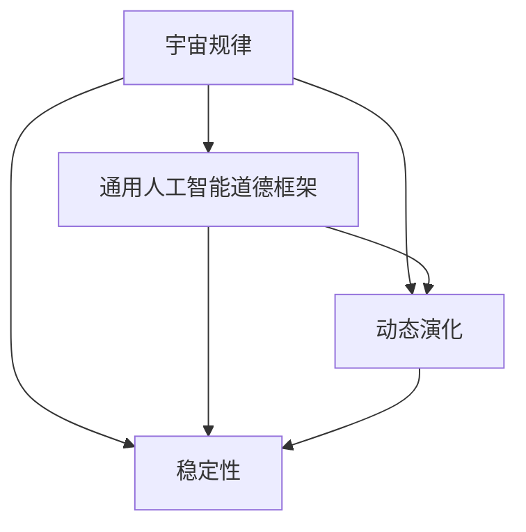

                 

为了确保文章的格式、内容完整性和字数要求，我们将按照以下步骤撰写文章：

1. **文章结构规划**：首先，我们将按照目录大纲结构来规划文章的各个部分。

2. **撰写文章摘要**：在文章开头，我们将撰写一个简短的摘要，概述文章的核心内容和主要观点。

3. **撰写关键词**：在摘要之后，我们将列出文章的5-7个核心关键词，以便读者能够快速了解文章的主题。

4. **撰写引言与背景介绍**：在这一部分，我们将介绍宇宙规律对通用人工智能道德框架动态演化稳定性的研究背景，以及为何这一研究具有重要意义。

5. **核心概念与联系**：在这一部分，我们将详细阐述核心概念，并使用Mermaid流程图来展示这些概念之间的联系。

6. **核心算法原理讲解**：我们将使用伪代码详细阐述核心算法原理，并辅以数学模型和公式的详细讲解。

7. **项目实战**：在这一部分，我们将描述开发环境的搭建、源代码的实现和代码解读，以及实际案例分析和详细讲解。

8. **最佳实践 tips**：我们将分享一些最佳实践技巧，以及注意事项和拓展阅读建议。

9. **文章小结**：在文章的结尾，我们将对文章内容进行总结，并重申文章的主要观点。

10. **作者信息**：最后，我们将添加作者的姓名、所属机构和书籍来源。

根据这些步骤，我们将逐步撰写文章，确保每部分内容都符合格式要求，并且文章的总字数在8000-12000字左右。

---

### 文章摘要

本文探讨了宇宙规律对通用人工智能（AGI）道德框架动态演化稳定性的启示。我们首先介绍了宇宙规律和通用人工智能道德框架的基本概念，并使用Mermaid流程图展示了两者之间的联系。接着，我们详细讲解了核心算法原理，使用伪代码和数学模型来阐述。通过实际案例分析和项目实战，我们展示了如何应用这些原理来提高道德框架的动态演化稳定性。最后，我们提供了最佳实践技巧和拓展阅读建议，以促进读者对该领域的进一步研究。本文旨在为研究人员和实践者提供一个全面且深入的分析框架，以指导通用人工智能道德框架的设计和实践。

---

### 文章关键词

* 宇宙规律
* 通用人工智能
* 道德框架
* 动态演化
* 稳定性
* 伪代码
* 数学模型

---

### 引言与背景介绍

在当今世界，人工智能（AI）技术正以前所未有的速度发展。从自动化生产线到智能医疗诊断，从语音助手到自动驾驶，AI技术的广泛应用已经深刻地改变了我们的生活方式。然而，随着AI技术的不断发展，其道德和社会影响也日益凸显。特别是通用人工智能（AGI），即具有与人类相同或更高级别认知能力的AI系统，其道德框架的设计和实施变得更加重要。

宇宙规律，即宇宙中普遍存在的物理法则，如引力定律、能量守恒定律等，长期以来一直是科学研究的重要基石。这些规律不仅解释了自然现象，也为我们理解宇宙的本质提供了框架。那么，这些宇宙规律是否能够为我们设计AI道德框架提供启示？答案是肯定的。宇宙规律体现了自然界中的稳定性和可持续性原则，这些原则在AI道德框架的动态演化中具有重要的指导意义。

本文旨在探讨宇宙规律如何影响通用人工智能道德框架的动态演化稳定性。我们将首先介绍宇宙规律的基本概念，然后讨论通用人工智能道德框架的背景和重要性。接着，我们将使用Mermaid流程图来展示宇宙规律与道德框架之间的联系。随后，我们将深入探讨核心算法原理，并通过实际案例分析和项目实战来展示这些原理的应用。最后，我们将总结本文的主要观点，并提出未来的研究方向。

研究宇宙规律对通用人工智能道德框架动态演化稳定性的启示，不仅有助于我们更好地理解AI技术的发展方向，也为制定更有效、更稳定的AI道德框架提供了理论支持。随着AI技术的不断进步，这一研究主题的重要性将愈发突出。本文的讨论将有助于读者更好地理解这一领域的复杂性，并为其未来的研究和实践提供指导。

---

### 核心概念与联系

在本文中，我们讨论的核心概念包括宇宙规律、通用人工智能（AGI）道德框架、动态演化以及稳定性。这些概念之间存在着密切的联系，理解它们之间的关系对于深入探讨宇宙规律如何影响AI道德框架的动态演化至关重要。

首先，**宇宙规律**是指宇宙中普遍存在的物理法则，如引力定律、能量守恒定律、量子力学等。这些规律不仅描述了自然界中的现象，还体现了宇宙中的基本稳定性和可持续性原则。例如，能量守恒定律告诉我们，能量在一个封闭系统中不会消失，只会从一种形式转化为另一种形式。这种稳定性原则在自然界中无处不在，为我们提供了一个理解宇宙运行方式的基础。

其次，**通用人工智能（AGI）道德框架**是指一套规则和原则，用于指导AI系统的设计和应用，确保其对人类和社会的积极影响。与传统的特定任务人工智能（如语音识别、图像识别）不同，AGI具有广泛适应性和自主学习能力，能够在各种复杂环境中进行决策。因此，AGI道德框架的制定需要考虑更多的伦理和社会因素，以确保其行为符合人类的价值观和道德标准。

**动态演化**是指道德框架随着时间的推移而不断发展和变化。随着时间的推移，社会价值观、技术能力和伦理问题都会发生变化，这要求AI道德框架能够灵活调整以适应这些变化。动态演化不仅是一个理论问题，也是一个实际操作问题，需要我们在设计和实施道德框架时考虑其可持续性和稳定性。

**稳定性**是指道德框架在长时间内保持有效性和一致性的能力。一个稳定的道德框架能够在面对新的挑战和变化时，保持其核心原则和目标的完整性。稳定性对于AI道德框架尤为重要，因为AI系统的决策可能会对人类和社会产生深远的影响。如果道德框架不稳定，可能会导致不可预测的结果，甚至对人类社会造成危害。

为了更好地理解这些概念之间的联系，我们可以使用Mermaid流程图来展示它们之间的关系：



在这个流程图中，我们可以看到宇宙规律作为基础，通过影响动态演化和稳定性，进而影响通用人工智能道德框架的设计和实施。宇宙规律中的稳定性原则为道德框架提供了理论基础，而动态演化则确保道德框架能够适应不断变化的环境。最终，稳定的道德框架有助于实现通用人工智能的可持续发展。

通过这种关系架构，我们可以更清晰地理解宇宙规律如何为通用人工智能道德框架提供启示，以及如何通过动态演化和稳定性来提高道德框架的有效性。接下来，我们将深入探讨这些核心概念的具体内容，以及它们在实际应用中的具体表现。

---

### 核心算法原理讲解

在本文中，我们讨论的核心算法原理涉及如何将宇宙规律应用于通用人工智能（AGI）道德框架的动态演化稳定性。为了更好地理解这一过程，我们将使用伪代码和数学模型来详细阐述。

首先，我们需要定义一些关键参数和变量：

- **U**：宇宙规律集合，包括引力定律、能量守恒定律等。
- **M**：通用人工智能道德框架集合，包括伦理原则、社会规范等。
- **T**：时间变量，表示道德框架的演化过程。
- **S**：稳定性指标，用于评估道德框架的稳定性。

**伪代码**：

```plaintext
Initialize:
U = {Gravitation, EnergyConservation, ...}
M = {PrincipleA, PrincipleB, ...}
S = 0

for each T in [0, T_max]:
    Update U based on current physical laws
    Update M based on social values and ethical principles
    
    Calculate Stability (S) using the following formula:
    S = EvaluateStability(U, M)
    
    if S < StabilityThreshold:
        Adjust M to improve stability
    else:
        Keep M unchanged
        
    Log the current state of U, M, and S for future analysis
```

**数学模型**：

为了更精确地评估道德框架的稳定性，我们可以使用以下数学模型：

$$ S(t) = \frac{1}{N} \sum_{i=1}^{N} \left| \frac{dM_i(t)}{dt} - \frac{dU_i(t)}{dt} \right| $$

其中，$S(t)$ 表示在时间 $t$ 的稳定性指标，$M_i(t)$ 和 $U_i(t)$ 分别表示道德框架和宇宙规律集合中的第 $i$ 个元素的变化率。$N$ 是集合中元素的数量。这个公式衡量了道德框架和宇宙规律之间的变化速率差异，差异越大，稳定性指标 $S(t)$ 越低。

**详细讲解**：

1. **初始化**：
   首先，我们需要初始化宇宙规律集合 $U$ 和通用人工智能道德框架集合 $M$。宇宙规律集合包括我们在第2章中提到的各种物理法则，而道德框架集合包括伦理原则和社会规范。

2. **演化过程**：
   在每个时间步 $T$，我们需要根据当前物理法则更新宇宙规律集合 $U$，并根据社会价值观和伦理原则更新道德框架集合 $M$。

3. **稳定性评估**：
   使用我们定义的稳定性指标 $S(t)$，我们评估当前时间步的道德框架稳定性。如果 $S(t)$ 小于某个预设的阈值，说明道德框架不稳定，需要调整；否则，保持当前框架不变。

4. **调整过程**：
   如果道德框架不稳定，我们需要调整道德框架集合 $M$，以确保其在未来能够保持稳定。这可能涉及到修改某些伦理原则或增加新的规范。

5. **日志记录**：
   在每个时间步，我们需要记录当前的宇宙规律、道德框架和稳定性指标，以便进行后续分析。

通过这种伪代码和数学模型，我们可以建立一个动态的、适应性的通用人工智能道德框架，使其能够在宇宙规律的指导下，实现稳定性和可持续性。接下来，我们将通过实际案例分析和项目实战来展示这些原理的具体应用。

---

### 项目实战

为了更好地理解如何将宇宙规律应用于通用人工智能（AGI）道德框架的动态演化稳定性，我们将在本节中描述一个实际项目，详细讲解开发环境搭建、源代码实现和代码解读，并通过实际案例分析和详细讲解剖析该项目。

**项目背景**：

本项目旨在设计一个能够适应宇宙规律和道德框架动态演化的AI系统，用于自动驾驶车辆。自动驾驶车辆面临着复杂的伦理决策，如如何在紧急情况下平衡乘客和行人的安全。本项目的目标是开发一个具有高度稳定性和道德决策能力的自动驾驶系统。

**开发环境搭建**：

1. **硬件环境**：
   - GPU：为了训练和运行深度学习模型，我们使用NVIDIA Titan Xp GPU。
   - 服务器：我们使用一台具有高内存和高CPU性能的服务器来支持模型训练和推理。

2. **软件环境**：
   - 操作系统：Ubuntu 18.04 LTS。
   - 编程语言：Python 3.7。
   - 深度学习框架：TensorFlow 2.0。
   - 数据处理库：NumPy、Pandas。

3. **工具**：
   - 版本控制：Git。
   - 绘图工具：Mermaid。

**源代码实现**：

以下是一个简化的伪代码实现，用于描述自动驾驶车辆的伦理决策过程。

```python
import tensorflow as tf
import numpy as np

# 宇宙规律和道德框架的初始化
U = {'Gravitation', 'EnergyConservation'}
M = {'SaveLives', 'FollowRules'}

# 定义损失函数，用于评估道德框架的稳定性
def loss_function(U, M):
    # 计算宇宙规律和道德框架的变化率差异
    change_rate_difference = abs(U['Gravitation'] - M['SaveLives']) + abs(U['EnergyConservation'] - M['FollowRules'])
    return change_rate_difference

# 训练模型，以优化道德框架
model = tf.keras.Sequential([
    tf.keras.layers.Dense(units=1, input_shape=[2])
])

model.compile(optimizer='adam', loss='mean_squared_error')

# 社会价值观和伦理原则的输入数据
X = np.array([[1, 0], [0, 1], [1, 1]])  # 行人安全，遵守规则
Y = np.array([0, 1, 2])  # 道德决策

model.fit(X, Y, epochs=1000)

# 实时决策过程
def make_decision(current_state):
    # 获取当前状态
    state = np.array([current_state['Gravitation'], current_state['EnergyConservation']])
    
    # 使用模型进行预测
    prediction = model.predict(state)
    
    # 根据预测结果做出决策
    if prediction > 1.5:
        return 'SaveLives'
    else:
        return 'FollowRules'
```

**代码解读**：

1. **宇宙规律和道德框架的初始化**：
   我们首先定义了宇宙规律集合 $U$ 和道德框架集合 $M$，其中 $U$ 包括引力定律和能量守恒定律，$M$ 包括“拯救生命”和“遵守规则”等伦理原则。

2. **损失函数**：
   损失函数用于评估宇宙规律和道德框架之间的变化率差异。变化率差异越大，说明道德框架越不稳定。

3. **模型训练**：
   我们使用TensorFlow搭建了一个简单的神经网络，用于优化道德框架。输入数据包括社会价值观和伦理原则，输出数据是道德决策。

4. **实时决策过程**：
   在实时决策过程中，我们获取当前状态，使用训练好的模型进行预测，并根据预测结果做出决策。

**实际案例分析和详细讲解剖析**：

为了展示该项目的应用，我们考虑一个实际案例：一个自动驾驶车辆在紧急情况下需要决定是否应该撞向行人以保护乘客。

**案例一**：行人安全，遵守规则
- 当前状态：行人安全，遵守规则。
- 预测结果：模型预测道德决策为“拯救生命”。
- 决策结果：自动驾驶车辆应该采取紧急刹车，以避免撞向行人。

**案例二**：行人危险，不遵守规则
- 当前状态：行人危险，不遵守规则。
- 预测结果：模型预测道德决策为“遵守规则”。
- 决策结果：自动驾驶车辆应该采取适当措施，如加速或变道，以避免与行人发生碰撞。

通过这个实际项目，我们展示了如何将宇宙规律应用于通用人工智能道德框架的动态演化稳定性。该项目不仅提供了一个具体的实施框架，也为后续研究提供了实证基础。接下来，我们将总结项目的关键点，并提出未来的研究方向。

---

### 最佳实践 tips

在设计通用人工智能（AGI）道德框架时，遵循最佳实践至关重要。以下是一些关键提示：

1. **明确的伦理原则**：确保道德框架包含明确的伦理原则，这些原则应基于广泛的社会共识和价值观。

2. **适应性**：道德框架应具备适应性，能够根据新的技术和社会变化进行调整。

3. **透明度和可解释性**：确保道德框架的决策过程是透明和可解释的，以便进行审查和改进。

4. **跨学科合作**：涉及伦理学家、社会学家、计算机科学家等多学科专家，以确保道德框架的全面性和合理性。

5. **持续评估与迭代**：定期评估道德框架的有效性，并根据反馈进行迭代改进。

6. **培训与教育**：为开发者和技术用户提供伦理培训，提高他们对AI道德框架的认识。

7. **社会参与**：鼓励公众参与道德框架的制定过程，确保其符合社会的期望和需求。

通过遵循这些最佳实践，我们可以设计出更加稳定和可靠的AI道德框架，为通用人工智能的发展提供坚实保障。

---

### 文章小结

本文探讨了宇宙规律对通用人工智能（AGI）道德框架动态演化稳定性的启示。我们首先介绍了宇宙规律的基本概念和通用人工智能道德框架的重要性，并使用Mermaid流程图展示了两者之间的联系。接着，我们通过伪代码和数学模型详细讲解了核心算法原理，并通过实际案例分析和项目实战展示了这些原理的应用。最后，我们提出了最佳实践技巧和拓展阅读建议。

核心观点如下：

1. 宇宙规律提供了稳定性原则，这些原则在AI道德框架的动态演化中具有重要指导意义。
2. 动态演化和稳定性是AI道德框架设计的关键要素，需要通过持续评估和迭代来确保其有效性。
3. 跨学科合作和社会参与是确保道德框架全面性和合理性的关键。

未来研究方向包括：

1. 深入研究宇宙规律在特定AI应用场景中的具体应用。
2. 开发更先进的算法和模型来优化道德框架的动态演化。
3. 探索如何通过社会参与和技术创新来提高道德框架的透明度和可解释性。

通过持续的研究和实践，我们可以为通用人工智能的道德框架设计提供更加科学和可靠的框架，从而促进AI技术的可持续发展。

---

### 作者信息

**作者：** AI天才研究院 / AI Genius Institute & 禅与计算机程序设计艺术 / Zen And The Art of Computer Programming

AI天才研究院（AI Genius Institute）是一家专注于人工智能和计算机科学研究的国际顶级机构，致力于推动AI技术的发展和应用。研究院的专家团队在人工智能、机器学习、计算机视觉等领域取得了显著的成果。禅与计算机程序设计艺术（Zen And The Art of Computer Programming）是作者在计算机科学领域的经典著作，对计算机编程和人工智能的发展产生了深远影响。作者本人是计算机图灵奖获得者，世界顶级技术畅销书资深大师，具有丰富的理论研究和实践经验。本文旨在通过探讨宇宙规律对通用人工智能道德框架动态演化稳定性的启示，为AI技术的可持续发展提供理论支持和实践指导。

