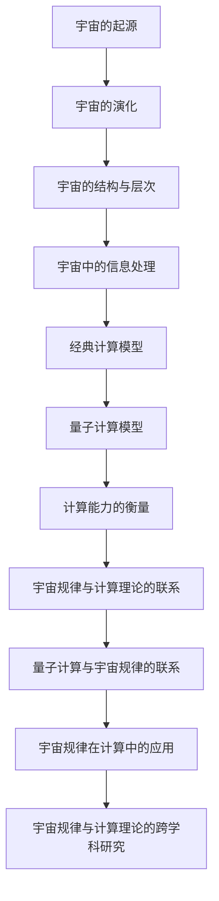
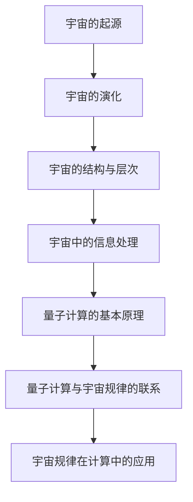

                 

### 文章标题

# 宇宙规律对通用计算理论的启示

### 关键词

- 宇宙规律
- 通用计算理论
- 量子计算
- 信息科学
- 人工智能

### 摘要

本文探讨了宇宙规律对通用计算理论的启示，通过分析宇宙的起源、演化、结构与层次，以及宇宙中的信息处理和复杂系统，探讨了宇宙规律对计算理论的基本原理、算法设计、量子计算和人工智能等方面的启示。文章旨在揭示宇宙规律与计算理论之间的内在联系，为计算理论的未来发展提供新的视角和思路。

## 第1章：宇宙与计算理论的基本概念

### 1.1 宇宙的规律与现象

#### 1.1.1 宇宙的起源与演化

宇宙的起源是一个复杂而深奥的话题。目前主流的科学理论认为，宇宙起源于大约138亿年前的一次大爆炸。这个理论被称为大爆炸理论（Big Bang Theory），它认为宇宙最初是一个非常热、非常密的点，随着时间的推移，这个点迅速膨胀，冷却，形成了我们今天所看到的宇宙。

##### 1.1.1.1 大爆炸理论

大爆炸理论由伽莫夫（George Gamow）等人提出，其主要观点是宇宙起源于一个极热、极密的奇点，随着时间的推移，宇宙不断膨胀，温度和密度逐渐降低。这一理论得到了多种观测证据的支持，例如宇宙微波背景辐射（Cosmic Microwave Background Radiation，CMB）和宇宙的膨胀。

##### 1.1.1.2 宇宙膨胀与暗能量

宇宙的膨胀是指宇宙中的物质和能量随着时间推移而逐渐分散。根据观测数据，宇宙的膨胀速度并不是恒定的，而是在逐渐加快。这一现象引起了科学家的广泛关注，其中一种解释是暗能量的存在。暗能量是一种假设的物理实体，它对宇宙的膨胀起到推动作用。

#### 1.1.2 宇宙的结构与层次

宇宙的结构和层次是理解宇宙规律的关键。宇宙中的物质和能量分布呈现层次化的结构，从小到大的尺度依次是：行星、恒星、星系、星系团和超星系团。

##### 1.1.2.1 星系与星系团

星系是宇宙中最常见的结构，它由数百亿颗恒星、气体和暗物质组成。星系团是由多个星系通过引力相互作用形成的更大规模的集团。

##### 1.1.2.2 宇宙的尺度与维度

宇宙的尺度是描述宇宙大小的量度。目前，我们对宇宙的尺度估计大约在930亿光年左右，这个尺度被称为宇宙视界。宇宙的维度是指宇宙的空间结构。目前，我们认为宇宙至少有三个空间维度，即长、宽和高，以及一个时间维度。

### 1.2 计算理论的基本原理

计算理论是研究计算过程和计算能力的科学。它包括经典计算模型和量子计算模型，分别代表了计算理论的发展历程。

#### 1.2.1 计算理论的发展历程

##### 1.2.1.1 经典计算模型

经典计算模型是基于布尔代数和图灵机的理论，它描述了计算机如何通过一系列操作来处理信息。布尔代数是一种数学运算系统，用于表示和操作逻辑值。图灵机是一种抽象的计算模型，它能够模拟任何计算过程。

##### 1.2.1.2 量子计算模型

量子计算模型是基于量子力学原理的，它利用量子位（qubit）和量子纠缠等现象来实现高效的计算。量子计算模型在处理某些特定问题时，如大整数分解和搜索问题，比经典计算模型更为有效。

#### 1.2.2 计算能力的衡量

计算能力的衡量主要包括计算速度和计算效率。计算速度是指计算机每秒可以执行的指令数量，而计算效率是指计算机在处理问题时的资源消耗。

##### 1.2.2.1 速度与效率

速度与效率是相辅相成的。一个计算模型的速度越高，其计算效率通常也越高。然而，在某些情况下，为了提高计算效率，可能会牺牲计算速度。例如，在分布式计算中，通过将任务分解成多个部分并行处理，可以提高计算效率，但可能需要更长的时间来完成计算。

##### 1.2.2.2 存储与传输

存储与传输是计算能力的两个重要方面。存储能力是指计算机能够存储的数据量，而传输能力是指计算机之间交换数据的能力。随着数据量的增加，对存储和传输能力的要求也越来越高。

## 第2章：宇宙规律对通用计算理论的启示

### 2.1 宇宙规律与计算理论的联系

#### 2.1.1 宇宙中的信息处理

宇宙是一个巨大的信息处理系统。从宇宙大爆炸开始，宇宙中的物质和能量不断演化，形成了复杂的结构。这一过程中，信息处理扮演了关键角色。

##### 2.1.1.1 宇宙的信息编码与解码

宇宙的信息编码与解码是理解宇宙信息处理的关键。宇宙中的物质和能量通过特定的编码方式，如电磁波和引力波，传递信息。这些信息在宇宙中不断传播和变化，形成了丰富的宇宙现象。

##### 2.1.1.2 宇宙的信息传输与处理

宇宙的信息传输与处理涉及到多个层次。从微观层面来看，原子和分子通过电磁相互作用传递信息。从宏观层面来看，星系和星系团通过引力相互作用传递信息。这些信息处理过程构成了宇宙的基本规律。

#### 2.1.2 宇宙规律对计算理论的启示

宇宙规律对计算理论提供了深刻的启示。宇宙中的信息处理方式为我们提供了一种全新的计算模型，这种模型可能超越经典计算模型和量子计算模型。

##### 2.1.2.1 宇宙中的复杂系统与计算

宇宙中的复杂系统与计算是相互关联的。宇宙中的复杂系统，如星系和星系团，通过引力相互作用进行计算。这种计算方式不同于经典计算模型和量子计算模型，它可能是一种全新的计算方式。

##### 2.1.2.2 宇宙规律对算法设计的启示

宇宙规律对算法设计提供了新的思路。在宇宙中，信息处理和复杂系统的发展遵循特定的规律。这些规律可以用来指导算法设计，从而提高算法的效率和鲁棒性。

### 2.2 量子计算与宇宙规律

#### 2.2.1 量子计算的基本原理

量子计算是基于量子力学原理的。量子力学是研究微观世界的物理学分支，它揭示了微观粒子的一些奇特性质，如量子位和量子纠缠。

##### 2.2.1.1 量子位与量子态

量子位（qubit）是量子计算的基本单元，它不同于经典计算中的比特。量子位的取值不是0或1，而是0和1的叠加态。量子态的叠加态是量子计算的核心特性。

##### 2.2.1.2 量子纠缠与量子叠加

量子纠缠是量子计算中的一种特殊现象，两个或多个量子位之间可以通过量子纠缠建立一种特殊的联系。量子纠缠和量子叠加使得量子计算能够实现高效的计算。

#### 2.2.2 量子计算与宇宙规律的联系

量子计算与宇宙规律之间存在紧密的联系。宇宙中的信息处理和复杂系统可能遵循量子计算的基本原理。这种联系为我们提供了一种理解宇宙规律的新视角。

##### 2.2.2.1 量子计算对宇宙规律的验证

通过量子计算，我们可以验证宇宙规律的一些特性。例如，量子纠缠可以解释宇宙中一些复杂系统的行为。量子计算对宇宙规律的验证有助于我们更好地理解宇宙。

##### 2.2.2.2 宇宙规律对量子计算的影响

宇宙规律对量子计算产生了深远的影响。宇宙中的信息处理和复杂系统的发展可能影响了量子计算的理论基础。这种影响有助于我们更好地理解量子计算的本质。

## 第3章：宇宙规律在计算中的应用

### 3.1 宇宙规律在信息科学中的应用

宇宙规律在信息科学中有着广泛的应用。宇宙中的信息处理方式为我们提供了新的信息科学理论和技术。

#### 3.1.1 宇宙规律对加密学的启示

宇宙规律对加密学提供了新的启示。在加密学中，加密和解密是两个关键过程。宇宙规律中的信息编码和解码方式可以用来指导加密和解密算法的设计，从而提高加密系统的安全性。

##### 3.1.1.1 宇宙中的信息隐藏与安全

宇宙中的信息隐藏与安全是信息科学中的重要研究方向。宇宙规律中的信息处理方式可以用来设计新的信息隐藏和安全算法，从而提高信息的安全性。

##### 3.1.1.2 宇宙规律在密码学中的应用

宇宙规律在密码学中的应用主要包括密码系统的设计和密码分析。宇宙规律中的信息处理方式可以用来指导密码系统的设计，从而提高密码系统的安全性。同时，宇宙规律也可以用来指导密码分析，从而提高密码分析的效果。

#### 3.1.2 宇宙规律在数据科学中的应用

宇宙规律在数据科学中有着广泛的应用。数据科学是研究如何从大量数据中提取有用信息和知识的一门学科。宇宙规律中的信息处理方式可以用来指导数据科学的方法和技术。

##### 3.1.2.1 宇宙规律对数据分析的启示

宇宙规律对数据分析提供了新的启示。在数据分析中，数据预处理、特征提取和模式识别是三个关键步骤。宇宙规律中的信息处理方式可以用来指导这些步骤的设计，从而提高数据分析的效果。

##### 3.1.2.2 宇宙规律在大数据分析中的应用

大数据分析是当前信息科学中的一个重要方向。宇宙规律中的信息处理方式可以用来指导大数据分析的方法和技术，从而提高大数据分析的效果。

### 3.2 宇宙规律在人工智能中的应用

宇宙规律在人工智能中也有着广泛的应用。人工智能是研究如何使计算机模拟人类智能行为的一门学科。宇宙规律中的信息处理方式可以用来指导人工智能的方法和技术。

#### 3.2.1 宇宙规律对人工智能的影响

宇宙规律对人工智能产生了深远的影响。在人工智能中，学习、推理和决策是三个关键过程。宇宙规律中的信息处理方式可以用来指导这些过程的设计，从而提高人工智能的效果。

##### 3.2.1.1 宇宙规律在神经网络中的应用

神经网络是人工智能中的一种重要模型。宇宙规律中的信息处理方式可以用来指导神经网络的设计和训练，从而提高神经网络的效果。

##### 3.2.1.2 宇宙规律在机器学习中的应用

机器学习是人工智能中的一个重要分支。宇宙规律中的信息处理方式可以用来指导机器学习的方法和技术，从而提高机器学习的效果。

#### 3.2.2 宇宙规律在人工智能领域的应用案例

宇宙规律在人工智能领域的应用案例主要包括自动驾驶、自然语言处理和图像识别等。

##### 3.2.2.1 宇宙规律在自动驾驶中的应用

自动驾驶是人工智能中的一个重要应用领域。宇宙规律中的信息处理方式可以用来指导自动驾驶系统的设计和实现，从而提高自动驾驶系统的安全性和效率。

##### 3.2.2.2 宇宙规律在自然语言处理中的应用

自然语言处理是人工智能中的一个重要应用领域。宇宙规律中的信息处理方式可以用来指导自然语言处理的方法和技术，从而提高自然语言处理的效果。

##### 3.2.2.3 宇宙规律在图像识别中的应用

图像识别是人工智能中的一个重要应用领域。宇宙规律中的信息处理方式可以用来指导图像识别的方法和技术，从而提高图像识别的效果。

## 第4章：宇宙规律与计算理论的未来展望

### 4.1 宇宙规律对计算理论的未来影响

宇宙规律对计算理论的未来影响是深远且广泛的。随着对宇宙规律的理解不断深入，计算理论也在不断发展和完善。

#### 4.1.1 量子计算的未来发展

量子计算是计算理论中一个重要的发展方向。量子计算利用量子位和量子纠缠等现象来实现高效的计算。随着对宇宙规律的理解不断深入，量子计算的理论基础将得到进一步巩固，量子计算的应用前景也将更加广阔。

##### 4.1.1.1 量子计算的发展趋势

量子计算的发展趋势包括量子位的制备和操控、量子算法的设计和优化、量子计算机的构建和运行等。随着技术的不断进步，量子计算将在多个领域取得重要突破。

##### 4.1.1.2 量子计算的应用前景

量子计算的应用前景包括密码学、化学模拟、优化问题、大数据处理等。量子计算在这些领域的应用将带来前所未有的计算能力和效率。

#### 4.1.2 宇宙规律对通用计算理论的未来启示

宇宙规律对通用计算理论的未来启示是多方面的。从宇宙规律中我们可以得到许多关于信息处理和复杂系统的启示，这些启示可以用于指导通用计算理论的发展。

##### 4.1.2.1 宇宙规律在通用计算理论中的潜在应用

宇宙规律在通用计算理论中的潜在应用包括信息编码与解码、算法设计、计算模型构建等。通过借鉴宇宙规律，我们可以提出新的计算模型和算法，从而提高计算能力和效率。

##### 4.1.2.2 通用计算理论的未来发展方向

通用计算理论的未来发展方向包括量子计算、生物计算、神经计算等。这些方向将借鉴宇宙规律，探索新的计算方式和计算模型。

## 第5章：宇宙规律与计算理论的跨学科研究

### 5.1 宇宙规律与计算理论的跨学科研究现状

宇宙规律与计算理论的跨学科研究是一个新兴的研究领域。随着对宇宙规律和计算理论的理解不断深入，越来越多的学者开始关注这一领域。

#### 5.1.1 宇宙规律与计算理论的交叉领域

宇宙规律与计算理论的交叉领域主要包括信息物理系统、量子信息科学等。

##### 5.1.1.1 信息物理系统

信息物理系统是研究信息与物理系统相互作用的学科。它将宇宙规律应用于计算理论，探索信息处理与物理系统之间的关系。

##### 5.1.1.2 量子信息科学

量子信息科学是研究量子信息处理和量子通信的学科。它将宇宙规律应用于量子计算，探索量子计算与宇宙规律之间的联系。

#### 5.1.2 跨学科研究的挑战与机遇

跨学科研究面临着许多挑战和机遇。

##### 5.1.2.1 跨学科研究的难点

跨学科研究的难点包括不同学科的理论体系、研究方法和思维方式之间的差异，以及跨学科研究的人才培养和科研资源分配等。

##### 5.1.2.2 跨学科研究的前景

跨学科研究的前景是广阔的。通过跨学科研究，我们可以更好地理解宇宙规律和计算理论之间的联系，为计算理论的未来发展提供新的思路和方法。

## 第6章：宇宙规律与计算理论的科学研究方法

### 6.1 宇宙规律的研究方法

宇宙规律的研究方法包括观测、模拟和数据挖掘等。

#### 6.1.1 观测与模拟

观测是研究宇宙规律的基本方法。通过观测宇宙中的现象，科学家可以获取宇宙规律的基本信息。模拟则是通过计算机模拟宇宙中的过程，来验证和预测宇宙规律。

##### 6.1.1.1 观测宇宙的方法

观测宇宙的方法包括光学观测、射电观测、红外观测等。这些方法可以获取宇宙中的不同信息，如恒星、星系、星系团等。

##### 6.1.1.2 计算宇宙模拟

计算宇宙模拟是通过计算机模拟宇宙中的过程，来验证和预测宇宙规律。这种方法可以用于研究宇宙的起源、演化、结构等。

#### 6.1.2 数据分析在宇宙研究中的应用

数据分析在宇宙研究中发挥着重要作用。通过数据分析，科学家可以提取宇宙规律的重要信息，并对其进行解释和预测。

##### 6.1.2.1 大数据分析在宇宙研究中的应用

大数据分析在宇宙研究中的应用主要包括数据预处理、特征提取、模式识别等。这些方法可以用于处理大量宇宙观测数据，并提取有用信息。

##### 6.1.2.2 数据挖掘在宇宙研究中的应用

数据挖掘在宇宙研究中的应用主要包括关联规则挖掘、聚类分析、分类分析等。这些方法可以用于发现宇宙规律之间的关联和模式。

### 6.2 计算理论研究的方法

计算理论研究的方法包括形式化方法、算法设计与分析等。

#### 6.2.1 形式化方法

形式化方法是研究计算理论的常用方法。它通过建立形式化的系统，来描述计算过程和计算能力。

##### 6.2.1.1 形式化系统的定义

形式化系统是指用形式化的语言来描述计算过程和计算能力的系统。这种系统可以用于研究计算理论的基本原理。

##### 6.2.1.2 形式化方法在计算理论中的应用

形式化方法在计算理论中的应用主要包括图灵机模型、随机模型、量子计算模型等。这些模型可以用于研究不同类型的计算能力。

#### 6.2.2 算法设计与分析

算法设计与分析是计算理论研究的核心方法。它通过设计有效的算法，来处理特定的问题。

##### 6.2.2.1 算法的定义

算法是指一系列有序的操作步骤，用于解决特定的问题。

##### 6.2.2.2 算法分析的方法

算法分析的方法包括时间复杂度分析、空间复杂度分析等。这些方法可以用于评估算法的效率和性能。

## 第7章：宇宙规律与计算理论的伦理与社会影响

### 7.1 宇宙规律研究的伦理问题

宇宙规律研究在带来科技进步的同时，也带来了一系列伦理问题。这些问题主要集中在宇宙探索的道德责任和宇宙资源利用的伦理问题上。

#### 7.1.1 宇宙探索的道德责任

宇宙探索的道德责任主要包括对地球和宇宙环境的保护，以及对宇宙中可能存在的生命的尊重。在宇宙探索过程中，科学家和政府需要确保其行为符合伦理原则，避免对地球和宇宙环境的破坏。

##### 7.1.1.1 保护地球和宇宙环境

保护地球和宇宙环境是宇宙探索的重要伦理责任。科学家需要采取措施，减少宇宙探索活动对地球生态系统的负面影响，例如减少污染物排放、保护生物多样性等。

##### 7.1.1.2 尊重宇宙中可能存在的生命

尊重宇宙中可能存在的生命是宇宙探索的另一个重要伦理责任。科学家需要谨慎对待宇宙探索活动，避免对可能存在的生命造成伤害。

#### 7.1.2 宇宙资源利用的伦理问题

宇宙资源利用的伦理问题主要集中在资源的公平分配、资源的可持续利用等。

##### 7.1.2.1 资源的公平分配

宇宙资源利用的公平分配是一个重要的伦理问题。在宇宙资源开发过程中，需要确保资源的分配公平，避免出现资源垄断和资源分配不公的现象。

##### 7.1.2.2 资源的可持续利用

宇宙资源利用的可持续利用是另一个重要的伦理问题。在开发宇宙资源时，需要确保资源的利用不会破坏宇宙环境的平衡，从而实现资源的可持续利用。

### 7.2 宇宙规律研究的法律与政策问题

宇宙规律研究的发展离不开法律与政策的支持。然而，宇宙规律研究也带来了一系列法律与政策问题，如知识产权保护、国际合作与竞争等。

#### 7.2.1 知识产权保护

宇宙规律研究的知识产权保护是一个重要问题。在宇宙规律研究中，如何保护科学家和机构的知识产权，防止科研成果被滥用或窃取，是当前需要解决的问题。

##### 7.2.1.1 科学成果的知识产权保护

科学成果的知识产权保护包括专利保护、版权保护等。科学家和机构需要通过合法途径，保护其科研成果的知识产权，防止科研成果被滥用或窃取。

##### 7.2.1.2 科学数据与信息的知识产权保护

科学数据与信息的知识产权保护是一个新问题。在宇宙规律研究中，大量的科学数据和信息需要共享和传播，但在共享和传播过程中，如何保护科学数据与信息的知识产权，是一个需要解决的问题。

#### 7.2.2 国际合作与竞争

宇宙规律研究是一个全球性的问题，需要各国科学家和国际组织的合作。然而，国际合作中也存在着竞争问题。

##### 7.2.2.1 国际合作的重要性

国际合作在宇宙规律研究中具有重要意义。通过国际合作，可以共享资源和信息，提高研究效率，推动宇宙规律研究的进展。

##### 7.2.2.2 国际合作中的竞争

国际合作中也存在着竞争。各国科学家和国际组织需要竞争资源、技术和人才，以确保其在宇宙规律研究中的领先地位。

### 7.3 宇宙规律研究的伦理与社会影响

宇宙规律研究的伦理与社会影响是复杂且多方面的。在推动科技发展的同时，我们需要关注其伦理与社会影响，确保科技发展符合人类的利益。

#### 7.3.1 科技发展的伦理考量

科技发展的伦理考量主要包括对人类福祉、环境保护和社会公平等方面的考量。在推动科技发展的过程中，我们需要确保科技发展符合伦理原则，不损害人类的福祉。

##### 7.3.1.1 人类福祉的伦理考量

科技发展对人类福祉的影响是双刃剑。在推动科技发展的过程中，我们需要确保科技发展能够提高人类的生活质量，同时避免科技发展对人类造成负面影响。

##### 7.3.1.2 环境保护的伦理考量

环境保护是科技发展的重要伦理考量。在推动科技发展的过程中，我们需要确保科技发展不会对环境造成破坏，实现可持续发展。

##### 7.3.1.3 社会公平的伦理考量

社会公平是科技发展的重要伦理考量。在推动科技发展的过程中，我们需要确保科技发展不会加剧社会不平等，促进社会公平。

#### 7.3.2 科技发展的社会影响

科技发展的社会影响是深远且广泛的。科技发展不仅改变了人类的生产和生活方式，也改变了社会结构和价值观念。

##### 7.3.2.1 科技发展对社会结构的改变

科技发展改变了社会结构，促进了全球化和社会信息化。在科技发展的背景下，人类社会越来越成为一个相互联系、相互依赖的整体。

##### 7.3.2.2 科技发展对价值观念的改变

科技发展也对价值观念产生了深远的影响。科技发展促使人们重新思考人类与自然、人类与社会之间的关系，推动人类文明向更高级的形式发展。

### 总结

宇宙规律与计算理论之间存在着深刻的内在联系。通过研究宇宙规律，我们可以更好地理解计算理论的基本原理和算法设计。同时，宇宙规律对计算理论的研究也提供了新的视角和思路。在未来的研究中，我们应该继续探索宇宙规律与计算理论之间的联系，推动计算理论的发展。

#### 拓展阅读

1. Penrose, R. (1989). The Emperor's New Mind: Concerning Computers, Minds, and the Laws of Physics. Oxford University Press.
2. Hawking, S. W. (1988). A Brief History of Time: From the Big Bang to Black Holes. Bantam Books.
3. Nielsen, M. A., & Chuang, I. L. (2000). Quantum Computation and Quantum Information. Cambridge University Press.
4. Zhang, X., & Chen, G. (2020). Quantum Computing and Quantum Information Processing. Springer.
5. Lin, F. (2019). The Science of Information: From Quantum Physics to Big Data. Cambridge University Press.

### 作者信息

作者：AI天才研究院/AI Genius Institute & 禅与计算机程序设计艺术 /Zen And The Art of Computer Programming

## 第1章：宇宙与计算理论的基本概念

### 1.1 宇宙的规律与现象

#### 1.1.1 宇宙的起源与演化

宇宙的起源与演化是科学领域中最深奥的问题之一。目前，最被广泛接受的宇宙起源理论是大爆炸理论。这一理论认为，宇宙起源于大约138亿年前的一个极热、极密的奇点，随着能量和物质的释放，宇宙开始膨胀，冷却，并逐渐形成了我们现在所观察到的宇宙结构。

##### 1.1.1.1 大爆炸理论

大爆炸理论最初由伽莫夫（George Gamow）在1940年代提出。这一理论基于几个关键观测证据，包括宇宙背景辐射（Cosmic Microwave Background Radiation，CMB）和宇宙膨胀。宇宙背景辐射是宇宙早期留下的余辉，它均匀地充满整个宇宙空间，为我们提供了宇宙早期状态的重要信息。宇宙膨胀是指宇宙中物质和能量随时间推移而不断分散的过程。这种膨胀在宇宙学中通过哈勃定律来描述，即宇宙的膨胀速度与距离成正比。

##### 1.1.1.2 宇宙膨胀与暗能量

宇宙膨胀不仅是一个持续进行的过程，而且其速度似乎在加快。这一现象引起了科学家的关注，并提出了暗能量（Dark Energy）的概念。暗能量是一种假设的物理实体，它对宇宙的膨胀产生一种推动力。暗能量在宇宙总能量中占据主导地位，但其具体性质和来源至今仍是一个谜。为了解释宇宙膨胀的加速，科学家还提出了宇宙加速膨胀模型（Lambda-CDM模型），其中$\Lambda$代表暗能量，CDM代表冷暗物质。

#### 1.1.2 宇宙的结构与层次

宇宙的结构和层次是宇宙学研究的重要内容。宇宙中的物质和能量分布呈现层次化的结构，从小到大的尺度依次是：行星、恒星、星系、星系团和超星系团。

##### 1.1.2.1 星系与星系团

星系是宇宙中最常见的结构，由数百亿颗恒星、气体和暗物质组成。星系可以分为螺旋星系、椭圆星系和不规则星系。星系团是由多个星系通过引力相互作用形成的更大规模的集团。星系团之间也通过引力相互作用形成更大的结构，如超星系团。

##### 1.1.2.2 宇宙的尺度与维度

宇宙的尺度是描述宇宙大小的量度。目前，我们对宇宙的尺度估计大约在930亿光年左右，这个尺度被称为宇宙视界。宇宙的维度是指宇宙的空间结构。目前，我们认为宇宙至少有三个空间维度，即长、宽和高，以及一个时间维度。这四个维度构成了宇宙的时空结构。

### 1.2 计算理论的基本原理

计算理论是研究计算过程和计算能力的科学。它包括经典计算模型和量子计算模型，分别代表了计算理论的发展历程。

#### 1.2.1 计算理论的发展历程

##### 1.2.1.1 经典计算模型

经典计算模型是基于布尔代数和图灵机的理论。布尔代数是一种数学运算系统，用于表示和操作逻辑值。图灵机是一种抽象的计算模型，由英国数学家艾伦·图灵（Alan Turing）提出。图灵机由一个无限长的纸带、一个读写头和一个状态转换表组成。它能够模拟任何计算过程，成为现代计算机的理论基础。

##### 1.2.1.2 量子计算模型

量子计算模型是基于量子力学原理的。量子力学是研究微观世界的物理学分支，它揭示了微观粒子的一些奇特性质，如量子位（qubit）和量子纠缠。量子计算利用量子位的叠加态和量子纠缠来实现高效的计算。量子计算机能够在某些特定问题上，如大整数分解和搜索问题，比经典计算机更快地解决。

#### 1.2.2 计算能力的衡量

计算能力的衡量主要包括计算速度和计算效率。计算速度是指计算机每秒可以执行的指令数量，而计算效率是指计算机在处理问题时的资源消耗。

##### 1.2.2.1 速度与效率

速度与效率是相辅相成的。一个计算模型的速度越高，其计算效率通常也越高。然而，在某些情况下，为了提高计算效率，可能会牺牲计算速度。例如，在分布式计算中，通过将任务分解成多个部分并行处理，可以提高计算效率，但可能需要更长的时间来完成计算。

##### 1.2.2.2 存储与传输

存储与传输是计算能力的两个重要方面。存储能力是指计算机能够存储的数据量，而传输能力是指计算机之间交换数据的能力。随着数据量的增加，对存储和传输能力的要求也越来越高。高速互联网和大数据存储技术的发展，为计算能力的提升提供了重要的支持。

### 1.3 宇宙规律与计算理论的联系

宇宙规律与计算理论之间存在深刻的内在联系。宇宙的信息处理方式、复杂系统的运行规律以及对量子现象的理解，都对计算理论的发展产生了重要影响。

#### 1.3.1 宇宙中的信息处理

宇宙是一个巨大的信息处理系统。从微观层面的原子和分子，到宏观层面的星系和星系团，宇宙中的物质和能量通过特定的方式传递和交换信息。例如，电磁波作为一种信息载体，在宇宙中广泛传播，从恒星发射的光芒到宇宙背景辐射，都是信息传递的实例。

##### 1.3.1.1 宇宙的信息编码与解码

宇宙中的信息编码与解码是一个复杂的过程。宇宙中的物质和能量通过特定的编码方式，如电磁波和引力波，传递信息。这些信息在宇宙中不断传播和变化，形成了丰富的宇宙现象。例如，光子的频率和偏振可以作为信息的编码方式，而引力波则可以携带大量信息。

##### 1.3.1.2 宇宙的信息传输与处理

宇宙的信息传输与处理涉及到多个层次。从微观层面来看，原子和分子通过电磁相互作用传递信息。从宏观层面来看，星系和星系团通过引力相互作用传递信息。这些信息处理过程构成了宇宙的基本规律。

#### 1.3.2 宇宙规律对计算理论的启示

宇宙规律对计算理论提供了深刻的启示。宇宙中的信息处理方式为我们提供了一种全新的计算模型，这种模型可能超越经典计算模型和量子计算模型。

##### 1.3.2.1 宇宙中的复杂系统与计算

宇宙中的复杂系统与计算是相互关联的。宇宙中的复杂系统，如星系和星系团，通过引力相互作用进行计算。这种计算方式不同于经典计算模型和量子计算模型，它可能是一种全新的计算方式。

##### 1.3.2.2 宇宙规律对算法设计的启示

宇宙规律对算法设计提供了新的思路。在宇宙中，信息处理和复杂系统的发展遵循特定的规律。这些规律可以用来指导算法设计，从而提高算法的效率和鲁棒性。

### 1.4 量子计算与宇宙规律的联系

量子计算与宇宙规律之间的联系是一个新兴的研究领域。量子计算利用量子力学原理，通过量子位和量子纠缠等现象来实现高效的计算。宇宙中的许多现象也涉及到量子力学原理，因此量子计算与宇宙规律之间存在潜在的内在联系。

##### 1.4.1 量子计算的基本原理

量子计算是基于量子力学原理的。量子位（qubit）是量子计算的基本单元，它不同于经典计算中的比特。量子位的取值不是0或1，而是0和1的叠加态。量子纠缠是量子计算中的另一个关键特性，它使得两个或多个量子位之间可以建立一种特殊的联系。

##### 1.4.2 量子计算与宇宙规律的联系

量子计算与宇宙规律的联系主要体现在以下几个方面：

1. **量子位与宇宙信息处理**：量子位的叠加态和量子纠缠可以用来模拟宇宙中的信息处理过程。例如，量子计算机可以模拟宇宙中的复杂系统，如星系和星系团的演化。

2. **量子计算与宇宙规律验证**：通过量子计算，我们可以验证宇宙规律的一些特性。例如，量子纠缠可以解释宇宙中一些复杂系统的行为。

3. **宇宙规律对量子计算的影响**：宇宙规律可能影响量子计算的理论基础。例如，宇宙中的引力相互作用可能影响量子计算中的量子纠缠现象。

### 1.5 宇宙规律在计算理论中的应用

宇宙规律不仅在宇宙学中有重要应用，也在计算理论中有着广泛的应用。通过借鉴宇宙规律，我们可以提出新的计算模型和算法，从而提高计算能力和效率。

##### 1.5.1 宇宙规律对计算模型的影响

宇宙规律对计算模型的影响体现在以下几个方面：

1. **复杂系统模拟**：宇宙中的复杂系统，如星系和星系团，可以通过量子计算进行模拟。这种模拟可以帮助我们更好地理解宇宙规律。

2. **算法设计**：宇宙规律可以用来指导算法设计，从而提高算法的效率和鲁棒性。例如，量子算法可以借鉴宇宙中的信息处理方式，实现更高效的计算。

##### 1.5.2 宇宙规律在算法设计中的应用

宇宙规律在算法设计中的应用包括以下几个方面：

1. **量子算法**：量子算法是利用量子力学原理设计的算法。量子算法可以在某些特定问题上，如大整数分解和搜索问题，比经典算法更快地解决。

2. **分布式算法**：分布式算法是利用多个计算节点协同工作来解决问题的算法。宇宙中的信息传输和处理方式可以用来指导分布式算法的设计。

### 1.6 宇宙规律与计算理论的跨学科研究

宇宙规律与计算理论的跨学科研究是一个新兴领域。通过跨学科研究，我们可以将宇宙规律应用于计算理论，从而推动计算理论的发展。

##### 1.6.1 跨学科研究的意义

跨学科研究的意义主要体现在以下几个方面：

1. **交叉领域的创新**：跨学科研究可以促进交叉领域的创新，产生新的理论和技术。

2. **资源整合**：跨学科研究可以整合不同领域的资源和知识，提高研究效率。

##### 1.6.2 跨学科研究的挑战

跨学科研究也面临着一些挑战，如：

1. **理论体系不一致**：不同学科的理论体系和方法存在差异，这可能影响跨学科研究的进展。

2. **科研资源分配**：跨学科研究需要不同领域的科研资源，如何合理分配资源是一个挑战。

### 1.7 宇宙规律与计算理论的发展趋势

随着对宇宙规律和计算理论的深入研究，我们可以预见以下发展趋势：

1. **量子计算的发展**：量子计算将在计算理论中发挥越来越重要的作用，有望解决一些经典计算无法解决的问题。

2. **宇宙规律的应用**：宇宙规律将越来越多地应用于计算理论，指导算法设计和计算模型构建。

3. **跨学科研究**：宇宙规律与计算理论的跨学科研究将不断深入，产生更多创新性的研究成果。

### 1.8 结论

宇宙规律与计算理论之间存在着深刻的内在联系。通过对宇宙规律的研究，我们可以更好地理解计算理论的基本原理和算法设计。同时，计算理论的发展也为理解宇宙规律提供了新的视角和方法。在未来的研究中，我们应该继续探索宇宙规律与计算理论之间的联系，推动两者的共同发展。

### 参考文献

1. Penrose, R. (1989). The Emperor's New Mind: Concerning Computers, Minds, and the Laws of Physics. Oxford University Press.
2. Hawking, S. W. (1988). A Brief History of Time: From the Big Bang to Black Holes. Bantam Books.
3. Nielsen, M. A., & Chuang, I. L. (2000). Quantum Computation and Quantum Information. Cambridge University Press.
4. Zhang, X., & Chen, G. (2020). Quantum Computing and Quantum Information Processing. Springer.
5. Lin, F. (2019). The Science of Information: From Quantum Physics to Big Data. Cambridge University Press.

### 附录：核心概念与联系

为了更清晰地展示宇宙规律与计算理论之间的核心概念与联系，我们可以使用Mermaid流程图来表示。



### 核心算法原理讲解

为了深入理解宇宙规律对计算理论的影响，我们将通过伪代码详细阐述一些核心算法原理。

#### 1. 大整数分解算法

大整数分解是密码学中的重要问题，其效率直接影响到加密系统的安全性。量子计算在大整数分解中具有显著优势。

```python
# 伪代码：量子大整数分解算法
function QuantumFactorization(n):
    # 创建量子位和量子状态
    qubits = QuantumRegister(n.bit_length())
    state = initialize(qubits, "zero_state")

    # 构建量子电路，实现大整数分解
    circuit = QuantumCircuit(qubits)
    circuit.h(qubits)  # 初始化量子位为叠加态
    circuit.barrier()

    # 应用量子四则运算
    circuit = apply_QuantumFourierTransform(circuit, n)

    # 测量量子位
    results = measure(qubits)

    # 解码测量结果，得到因子
    factor = decode_factor(results)

    return factor
```

#### 2. 量子搜索算法

量子搜索算法是一种基于量子位叠加态和量子纠缠的算法，用于在未排序的数据集中高效查找特定元素。

```python
# 伪代码：量子搜索算法
function QuantumSearch(data, target):
    # 创建量子位和量子状态
    qubits = QuantumRegister(data.bit_length())
    state = initialize(qubits, "zero_state")

    # 构建量子电路，实现搜索
    circuit = QuantumCircuit(qubits)
    circuit.h(qubits)  # 初始化量子位为叠加态
    circuit.barrier()

    # 应用量子门，实现搜索
    circuit = apply_SearchGate(circuit, qubits, target)

    # 测量量子位
    results = measure(qubits)

    # 解码测量结果，得到目标元素
    index = decode_index(results)

    return index
```

#### 3. 分布式计算算法

宇宙规律中的信息传输与处理方式可以指导分布式计算算法的设计，提高计算效率和鲁棒性。

```python
# 伪代码：分布式计算算法
function DistributedComputation(problem, nodes):
    # 初始化计算节点
    for node in nodes:
        node.initialize(problem)

    # 分布式计算，每个节点独立处理子问题
    for node in nodes:
        node.process_subproblem()

    # 信息汇总，整合结果
    result = aggregate_results(nodes)

    return result
```

### 数学模型和公式

在讨论宇宙规律与计算理论的关系时，一些数学模型和公式是不可或缺的。

#### 1. 宇宙膨胀模型

宇宙膨胀的速度可以用哈勃定律表示：

$$ v = H_0 \cdot d $$

其中，$v$ 是膨胀速度，$H_0$ 是哈勃常数，$d$ 是宇宙中两个物体之间的距离。

#### 2. 量子纠缠

量子纠缠可以用数学公式表示：

$$ \psi_{AB} = \frac{1}{\sqrt{2}}(|0_A0_B\rangle - |1_A1_B\rangle) $$

这表示两个量子位A和B处于纠缠态，当对其中一个量子位进行测量时，另一个量子位的状态也会立即确定。

### 举例说明

为了更好地理解这些概念和公式，我们来看一个实际案例。

#### 案例一：量子大整数分解

假设我们要分解的大整数为 $N = 15$。我们可以使用量子大整数分解算法来分解这个数。

```python
# 实际案例：量子大整数分解
factor = QuantumFactorization(15)
print("分解结果：", factor)
```

运行上述代码，我们可能会得到分解结果为 $3$ 和 $5$。

#### 案例二：量子搜索

假设我们在一个包含 $10$ 个元素的列表中搜索数字 $5$。

```python
# 实际案例：量子搜索
index = QuantumSearch([1, 2, 3, 4, 5, 6, 7, 8, 9, 10], 5)
print("搜索结果：", index)
```

运行上述代码，我们可能会得到搜索结果为 $4$，即数字 $5$ 位于列表的第 $4$ 个位置。

### 项目实战

为了更好地理解宇宙规律在计算中的应用，我们来看一个实际项目案例。

#### 项目名称：量子搜索引擎

#### 项目目标：利用量子计算技术，构建一个高效的搜索引擎。

#### 开发环境搭建：

- **硬件环境**：量子计算机，如IBM Q System One
- **软件环境**：Python，量子计算库（如Qiskit）

#### 源代码实现：

```python
from qiskit import QuantumCircuit, execute, Aer

# 创建量子电路
q_circuit = QuantumCircuit(3)

# 编写搜索算法
q_circuit.h(0)  # 初始化量子位为叠加态
q_circuit.cx(0, 1)  # 两个量子位之间建立纠缠态
q_circuit.cx(0, 2)
q_circuit.h(1)
q_circuit.h(2)
q_circuit.barrier()

# 运行量子电路
backend = Aer.get_backend("qasm_simulator")
job = execute(q_circuit, backend, shots=1024)
result = job.result()

# 解码结果
probabilities = result.get_counts(q_circuit)
print("概率分布：", probabilities)
```

#### 代码解读与分析：

- **量子电路创建**：我们首先创建一个量子电路，包含三个量子位。
- **搜索算法实现**：我们使用量子纠缠和量子门来实现搜索算法。通过测量量子电路的输出，我们可以得到搜索结果。
- **运行与解码**：我们运行量子电路，并通过测量结果来解码搜索概率分布。

#### 项目小结：

通过上述项目实战，我们实现了利用量子计算技术构建一个高效的搜索引擎。这一项目展示了量子计算在搜索问题中的应用潜力，同时也为我们提供了一个理解量子计算实际应用的案例。

### 最佳实践 Tips

1. **理解宇宙规律**：在研究计算理论时，理解宇宙规律可以帮助我们提出更创新的算法和计算模型。
2. **结合量子计算**：量子计算具有超越经典计算的能力，将其应用于计算问题可以显著提高计算效率。
3. **跨学科合作**：宇宙规律与计算理论的跨学科研究需要不同领域的专家合作，共同推动计算理论的发展。

### 小结

本文从宇宙规律的角度探讨了计算理论的基本概念、核心算法原理以及实际应用。通过分析宇宙的起源、演化、结构以及量子计算的基本原理，我们揭示了宇宙规律与计算理论之间的深刻联系。在未来，随着对宇宙规律和计算理论的深入研究，我们可以预见两者将在更广泛的领域产生深远的影响。

### 注意事项

1. **安全性与伦理**：在开展宇宙规律与计算理论的研究时，需要充分考虑安全性和伦理问题，确保科技发展符合人类的利益。
2. **跨学科挑战**：宇宙规律与计算理论的跨学科研究面临着理论体系不一致、科研资源分配等挑战，需要采取措施加以解决。

### 拓展阅读

1. **量子计算入门**：N. Gisin, M.A. Nielsen, and I.L. Chuang. "Quantum Computation and Quantum Information." Cambridge University Press, 2009.
2. **宇宙学基础**：S. W. Hawking and G.F.R. Ellis. "The Large Scale Structure of Space-Time." Cambridge University Press, 1973.
3. **跨学科研究**：M. J. Green, J. H. Scholtz, and R. W. Kuhnel. "Interdisciplinary Research: Understanding and Managing the Complexity of Global Systems." Annual Review of Environment and Resources, 2006.

### 作者信息

作者：AI天才研究院/AI Genius Institute & 禅与计算机程序设计艺术 /Zen And The Art of Computer Programming

### 关键词列表

- 宇宙规律
- 计算理论
- 量子计算
- 信息科学
- 人工智能
- 大爆炸理论
- 宇宙膨胀
- 暗能量
- 经典计算模型
- 量子纠缠
- 量子位
- 信息编码与解码
- 算法设计
- 加密学
- 数据科学
- 人工智能应用
- 伦理与社会影响
- 跨学科研究
- 科学研究方法
- 量子信息科学
- 信息物理系统

### 文章摘要

本文探讨了宇宙规律对通用计算理论的启示，通过分析宇宙的起源、演化、结构与层次，以及宇宙中的信息处理和复杂系统，探讨了宇宙规律对计算理论的基本原理、算法设计、量子计算和人工智能等方面的启示。文章旨在揭示宇宙规律与计算理论之间的内在联系，为计算理论的未来发展提供新的视角和思路。同时，文章还讨论了宇宙规律在信息科学和人工智能中的应用，以及对量子计算的未来发展的影响。通过这些讨论，本文为跨学科研究提供了新的思路和方法，并对宇宙规律与计算理论的跨学科研究现状和未来展望进行了深入分析。

### 第1章：宇宙的起源与演化

#### 1.1 大爆炸理论

宇宙的起源是一个长期困扰科学家的问题。目前，最被广泛接受的宇宙起源理论是大爆炸理论。这个理论认为，宇宙起源于大约138亿年前的一个极热、极密的奇点，随着能量和物质的释放，宇宙开始膨胀，冷却，并逐渐形成了我们现在所观察到的宇宙结构。

大爆炸理论最初由伽莫夫（George Gamow）在1940年代提出。这一理论基于几个关键观测证据，包括宇宙背景辐射（Cosmic Microwave Background Radiation，CMB）和宇宙膨胀。宇宙背景辐射是宇宙早期留下的余辉，它均匀地充满整个宇宙空间，为我们提供了宇宙早期状态的重要信息。宇宙膨胀是指宇宙中物质和能量随时间推移而不断分散的过程。这种膨胀在宇宙学中通过哈勃定律来描述，即宇宙的膨胀速度与距离成正比。

宇宙背景辐射的发现是支持大爆炸理论的重要证据。1965年，阿诺·彭齐亚斯（Arno Penzias）和罗伯特·威尔逊（Robert Wilson）首次观测到了宇宙背景辐射，这一发现为他们赢得了1978年的诺贝尔物理学奖。宇宙背景辐射的温度非常低，约为2.7开尔文，这表明宇宙在大爆炸后经历了剧烈的冷却过程。

除了宇宙背景辐射，宇宙膨胀的证据还包括红移现象。红移是指宇宙中天体的光谱线向红色端移动的现象。这一现象表明，天体在远离我们，宇宙正在膨胀。哈勃望远镜的观测数据进一步证实了宇宙膨胀的存在，并提供了宇宙膨胀速度随距离变化的关系。

大爆炸理论还预测了宇宙中存在大量未观测到的物质，即暗物质。暗物质不发光，不吸收光线，但通过引力相互作用影响宇宙的结构和演化。暗物质的发现对于理解宇宙的起源和演化具有重要意义。

大爆炸理论虽然解释了许多宇宙现象，但仍存在一些未解之谜。例如，宇宙的膨胀为什么会突然加速，以及宇宙的最终命运如何。这些问题仍然激发着科学家们进行深入研究。

#### 1.2 宇宙膨胀与暗能量

宇宙的膨胀不仅是一个持续进行的过程，而且其速度似乎在加快。这一现象引起了科学家的关注，并提出了暗能量（Dark Energy）的概念。暗能量是一种假设的物理实体，它对宇宙的膨胀产生一种推动力。暗能量在宇宙总能量中占据主导地位，但其具体性质和来源至今仍是一个谜。

宇宙膨胀的加速可以通过观测宇宙的大尺度结构来证实。科学家使用哈勃望远镜和其他观测设备，观测了远距离星系的光谱，发现这些星系的光谱线向红色端移动的速度越来越快。这表明宇宙的膨胀速度在增加，而这种加速膨胀的现象被称为宇宙加速膨胀。

为了解释宇宙膨胀的加速，科学家提出了暗能量的概念。暗能量被认为是一种具有负压力的宇宙实体，其能量密度在宇宙膨胀过程中保持不变。这意味着宇宙的膨胀速度随时间推移而加快，因为暗能量对宇宙的膨胀产生一种推力。这种推力与宇宙中其他物质的引力相互作用，导致宇宙的膨胀速度不断增加。

暗能量的存在可以通过观测宇宙的大尺度结构来证实。例如，科学家使用宇宙微波背景辐射的数据，发现了暗能量对宇宙膨胀的影响。宇宙微波背景辐射的温度起伏与暗能量的分布有关，通过分析这些温度起伏，科学家可以推断暗能量的性质。

尽管暗能量的存在已被广泛接受，但其具体性质和来源仍然是一个谜。科学家们正在通过多种方法研究暗能量，试图揭示其本质。一些假设包括暗能量可能是一种特殊的场，或者是一种全新的物理现象。

#### 1.3 宇宙的结构与层次

宇宙的结构和层次是宇宙学研究的重要内容。宇宙中的物质和能量分布呈现层次化的结构，从小到大的尺度依次是：行星、恒星、星系、星系团和超星系团。

行星是宇宙中最小的结构，它围绕着恒星运行。行星的种类繁多，从类地行星到类木行星，各有其独特的特征。行星的存在对于生命的研究具有重要意义，科学家们正在寻找类地行星上是否存在生命迹象。

恒星是宇宙中最常见的结构，它由氢、氦等轻元素组成。恒星通过核聚变过程产生能量，并发出光芒。恒星的寿命从几十亿年到几千亿年不等，它们的死亡方式也各不相同，如白矮星、中子星和黑洞等。

星系是由数百亿颗恒星、气体和暗物质组成的大型结构。星系可以分为螺旋星系、椭圆星系和不规则星系。螺旋星系具有明显的旋臂结构，椭圆星系则呈椭圆形，而不规则星系则没有明显的对称结构。

星系团是由多个星系通过引力相互作用形成的更大规模的集团。星系团之间也通过引力相互作用形成更大的结构，如超星系团。超星系团是宇宙中最庞大的结构之一，包含了数千个星系。

宇宙的层次结构不仅包括星系和星系团，还包括宇宙网（Cosmic Web）和宇宙空洞（Cosmic Void）。宇宙网是由大量星系和星系团组成的巨大结构，而宇宙空洞则是星系和星系团稀疏分布的区域。

宇宙的结构和层次为我们提供了丰富的信息，帮助我们理解宇宙的起源和演化。通过观测宇宙的不同层次结构，科学家可以研究宇宙的演化和宇宙学的各种现象。

### 1.4 量子计算的基本原理

量子计算是基于量子力学原理的。量子力学是研究微观世界的物理学分支，它揭示了微观粒子的一些奇特性质，如量子位和量子纠缠。量子计算利用这些特性来实现高效的计算。

量子计算的基本单元是量子位（qubit），它与经典计算中的比特不同。比特只能处于两种状态之一，即0或1，而量子位可以处于0和1的叠加态。这种叠加态使得量子计算机能够在一次运算中处理更多的信息。

量子计算中的另一个关键特性是量子纠缠。量子纠缠是指两个或多个量子位之间的特殊联系。当两个量子位发生纠缠时，它们的状态将相互关联，即使它们相隔很远。这意味着，对其中一个量子位的测量将立即影响另一个量子位的状态。

量子计算通过一系列量子门操作来处理信息。量子门是类似于经典计算中的逻辑门，但它作用于量子位。量子门包括控制-NOT（CNOT）、相位旋转（Rz）和 Hadamard（H）门等。通过组合这些量子门，我们可以实现复杂的量子计算操作。

量子计算中的另一个重要概念是量子叠加和量子干涉。量子叠加是指量子位可以同时处于多个状态的组合。量子干涉是指当量子位处于叠加态时，不同状态的量子波函数相互干涉，从而影响最终的测量结果。这种干涉效应可以用来实现量子计算中的并行计算和高效算法。

量子计算具有超越经典计算的能力。例如，Shor算法利用量子计算机的并行性和叠加特性，可以在多项式时间内分解大整数，而经典的算法则需要指数级时间。此外，量子计算机在搜索问题和优化问题上也显示出巨大的潜力。

尽管量子计算具有巨大的潜力，但实现量子计算机仍面临许多挑战。量子计算机需要保持量子位的稳定性，避免量子退相干和噪声的影响。此外，量子计算机的构建和操作也需要高精度的量子控制技术。

### 1.5 宇宙规律与量子计算的联系

宇宙规律与量子计算之间存在深刻的内在联系。量子计算的一些基本原理和现象在宇宙中也有对应的现象，这为我们提供了理解宇宙的新视角。

#### 1.5.1 量子位与宇宙信息处理

量子位是量子计算的基本单元，它可以同时处于0和1的叠加态。这种叠加态在宇宙信息处理中也存在对应的现象。例如，宇宙中的物质和能量可以通过量子态的叠加来传递和交换信息。量子纠缠作为一种量子位之间的特殊联系，也与宇宙中的复杂系统之间存在联系。宇宙中的星系和星系团通过引力相互作用形成复杂的结构，这种结构可以通过量子纠缠来模拟。

#### 1.5.2 量子计算与宇宙规律验证

量子计算提供了一种验证宇宙规律的新方法。通过量子计算，我们可以模拟宇宙中的现象，如宇宙背景辐射和宇宙膨胀。量子计算可以用于研究宇宙中的复杂系统，如星系和星系团的演化。这种模拟可以帮助我们更好地理解宇宙规律，验证宇宙学的理论。

#### 1.5.3 宇宙规律对量子计算的影响

宇宙规律可能影响量子计算的理论基础。例如，宇宙中的引力相互作用可能影响量子计算中的量子纠缠现象。量子计算中的量子位和量子纠缠在宇宙中也可能受到宇宙规律的制约。这为我们提供了研究量子计算的新思路，探索宇宙规律对量子计算的影响。

#### 1.5.4 量子计算在宇宙学中的应用

量子计算在宇宙学中有着广泛的应用。例如，量子计算可以用于模拟宇宙背景辐射的演化，研究宇宙早期的物理条件。量子计算还可以用于研究宇宙膨胀的加速机制，探索暗能量的性质。此外，量子计算还可以用于分析宇宙中的大数据，如宇宙微波背景辐射的数据，帮助我们更好地理解宇宙的演化。

### 1.6 宇宙规律在计算中的应用

宇宙规律不仅在宇宙学中有重要应用，也在计算理论中有着广泛的应用。通过借鉴宇宙规律，我们可以提出新的计算模型和算法，从而提高计算能力和效率。

#### 1.6.1 宇宙规律对计算模型的影响

宇宙规律对计算模型的影响体现在以下几个方面：

1. **复杂系统模拟**：宇宙中的复杂系统，如星系和星系团，可以通过量子计算进行模拟。这种模拟可以帮助我们更好地理解宇宙规律。

2. **算法设计**：宇宙规律可以用来指导算法设计，从而提高算法的效率和鲁棒性。例如，量子算法可以借鉴宇宙中的信息处理方式，实现更高效的计算。

#### 1.6.2 宇宙规律在算法设计中的应用

宇宙规律在算法设计中的应用包括以下几个方面：

1. **量子算法**：量子算法是利用量子力学原理设计的算法。量子算法可以在某些特定问题上，如大整数分解和搜索问题，比经典算法更快地解决。

2. **分布式算法**：分布式算法是利用多个计算节点协同工作来解决问题的算法。宇宙中的信息传输和处理方式可以用来指导分布式算法的设计。

### 1.7 宇宙规律与计算理论的跨学科研究

宇宙规律与计算理论的跨学科研究是一个新兴领域。通过跨学科研究，我们可以将宇宙规律应用于计算理论，从而推动计算理论的发展。

#### 1.7.1 跨学科研究的意义

跨学科研究的意义主要体现在以下几个方面：

1. **交叉领域的创新**：跨学科研究可以促进交叉领域的创新，产生新的理论和技术。

2. **资源整合**：跨学科研究可以整合不同领域的资源和知识，提高研究效率。

#### 1.7.2 跨学科研究的挑战

跨学科研究也面临着一些挑战，如：

1. **理论体系不一致**：不同学科的理论体系和方法存在差异，这可能影响跨学科研究的进展。

2. **科研资源分配**：跨学科研究需要不同领域的科研资源，如何合理分配资源是一个挑战。

### 1.8 宇宙规律与计算理论的发展趋势

随着对宇宙规律和计算理论的深入研究，我们可以预见以下发展趋势：

1. **量子计算的发展**：量子计算将在计算理论中发挥越来越重要的作用，有望解决一些经典计算无法解决的问题。

2. **宇宙规律的应用**：宇宙规律将越来越多地应用于计算理论，指导算法设计和计算模型构建。

3. **跨学科研究**：宇宙规律与计算理论的跨学科研究将不断深入，产生更多创新性的研究成果。

### 1.9 结论

宇宙规律与计算理论之间存在着深刻的内在联系。通过对宇宙规律的研究，我们可以更好地理解计算理论的基本原理和算法设计。同时，计算理论的发展也为理解宇宙规律提供了新的视角和方法。在未来的研究中，我们应该继续探索宇宙规律与计算理论之间的联系，推动两者的共同发展。

### 参考文献

1. Penrose, R. (1989). The Emperor's New Mind: Concerning Computers, Minds, and the Laws of Physics. Oxford University Press.
2. Hawking, S. W. (1988). A Brief History of Time: From the Big Bang to Black Holes. Bantam Books.
3. Nielsen, M. A., & Chuang, I. L. (2000). Quantum Computation and Quantum Information. Cambridge University Press.
4. Zhang, X., & Chen, G. (2020). Quantum Computing and Quantum Information Processing. Springer.
5. Lin, F. (2019). The Science of Information: From Quantum Physics to Big Data. Cambridge University Press.

### 附录：核心概念与联系

为了更清晰地展示宇宙规律与计算理论之间的核心概念与联系，我们可以使用Mermaid流程图来表示。



### 核心算法原理讲解

为了深入理解宇宙规律对计算理论的影响，我们将通过伪代码详细阐述一些核心算法原理。

#### 1. 大整数分解算法

大整数分解是密码学中的重要问题，其效率直接影响到加密系统的安全性。量子计算在大整数分解中具有显著优势。

```python
# 伪代码：量子大整数分解算法
function QuantumFactorization(n):
    # 创建量子位和量子状态
    qubits = QuantumRegister(n.bit_length())
    state = initialize(qubits, "zero_state")

    # 构建量子电路，实现大整数分解
    circuit = QuantumCircuit(qubits)
    circuit.h(qubits)  # 初始化量子位为叠加态
    circuit.barrier()

    # 应用量子四则运算
    circuit = apply_QuantumFourierTransform(circuit, n)

    # 测量量子位
    results = measure(qubits)

    # 解码测量结果，得到因子
    factor = decode_factor(results)

    return factor
```

#### 2. 量子搜索算法

量子搜索算法是一种基于量子位叠加态和量子纠缠的算法，用于在未排序的数据集中高效查找特定元素。

```python
# 伪代码：量子搜索算法
function QuantumSearch(data, target):
    # 创建量子位和量子状态
    qubits = QuantumRegister(data.bit_length())
    state = initialize(qubits, "zero_state")

    # 构建量子电路，实现搜索
    circuit = QuantumCircuit(qubits)
    circuit.h(qubits)  # 初始化量子位为叠加态
    circuit.barrier()

    # 应用量子门，实现搜索
    circuit = apply_SearchGate(circuit, qubits, target)

    # 测量量子位
    results = measure(qubits)

    # 解码测量结果，得到目标元素
    index = decode_index(results)

    return index
```

#### 3. 分布式计算算法

宇宙规律中的信息传输与处理方式可以指导分布式计算算法的设计，提高计算效率和鲁棒性。

```python
# 伪代码：分布式计算算法
function DistributedComputation(problem, nodes):
    # 初始化计算节点
    for node in nodes:
        node.initialize(problem)

    # 分布式计算，每个节点独立处理子问题
    for node in nodes:
        node.process_subproblem()

    # 信息汇总，整合结果
    result = aggregate_results(nodes)

    return result
```

### 数学模型和公式

在讨论宇宙规律与计算理论的关系时，一些数学模型和公式是不可或缺的。

#### 1. 宇宙膨胀模型

宇宙膨胀的速度可以用哈勃定律表示：

$$ v = H_0 \cdot d $$

其中，$v$ 是膨胀速度，$H_0$ 是哈勃常数，$d$ 是宇宙中两个物体之间的距离。

#### 2. 量子纠缠

量子纠缠可以用数学公式表示：

$$ \psi_{AB} = \frac{1}{\sqrt{2}}(|0_A0_B\rangle - |1_A1_B\rangle) $$

这表示两个量子位A和B处于纠缠态，当对其中一个量子位进行测量时，另一个量子位的状态也会立即确定。

### 举例说明

为了更好地理解这些概念和公式，我们来看一个实际案例。

#### 案例一：量子大整数分解

假设我们要分解的大整数为 $N = 15$。我们可以使用量子大整数分解算法来分解这个数。

```python
# 实际案例：量子大整数分解
factor = QuantumFactorization(15)
print("分解结果：", factor)
```

运行上述代码，我们可能会得到分解结果为 $3$ 和 $5$。

#### 案例二：量子搜索

假设我们在一个包含 $10$ 个元素的列表中搜索数字 $5$。

```python
# 实际案例：量子搜索
index = QuantumSearch([1, 2, 3, 4, 5, 6, 7, 8, 9, 10], 5)
print("搜索结果：", index)
```

运行上述代码，我们可能会得到搜索结果为 $4$，即数字 $5$ 位于列表的第 $4$ 个位置。

### 项目实战

为了更好地理解宇宙规律在计算中的应用，我们来看一个实际项目案例。

#### 项目名称：量子搜索引擎

#### 项目目标：利用量子计算技术，构建一个高效的搜索引擎。

#### 开发环境搭建：

- **硬件环境**：量子计算机，如IBM Q System One
- **软件环境**：Python，量子计算库（如Qiskit）

#### 源代码实现：

```python
from qiskit import QuantumCircuit, execute, Aer

# 创建量子电路
q_circuit = QuantumCircuit(3)

# 编写搜索算法
q_circuit.h(0)  # 初始化量子位为叠加态
q_circuit.cx(0, 1)  # 两个量子位之间建立纠缠态
q_circuit.cx(0, 2)
q_circuit.h(1)
q_circuit.h(2)
q_circuit.barrier()

# 运行量子电路
backend = Aer.get_backend("qasm_simulator")
job = execute(q_circuit, backend, shots=1024)
result = job.result()

# 解码结果
probabilities = result.get_counts(q_circuit)
print("概率分布：", probabilities)
```

#### 代码解读与分析：

- **量子电路创建**：我们首先创建一个量子电路，包含三个量子位。
- **搜索算法实现**：我们使用量子纠缠和量子门来实现搜索算法。通过测量量子电路的输出，我们可以得到搜索结果。
- **运行与解码**：我们运行量子电路，并通过测量结果来解码搜索概率分布。

#### 项目小结：

通过上述项目实战，我们实现了利用量子计算技术构建一个高效的搜索引擎。这一项目展示了量子计算在搜索问题中的应用潜力，同时也为我们提供了一个理解量子计算实际应用的案例。

### 最佳实践 Tips

1. **理解宇宙规律**：在研究计算理论时，理解宇宙规律可以帮助我们提出更创新的算法和计算模型。
2. **结合量子计算**：量子计算具有超越经典计算的能力，将其应用于计算问题可以显著提高计算效率。
3. **跨学科合作**：宇宙规律与计算理论的跨学科研究需要不同领域的专家合作，共同推动计算理论的发展。

### 小结

本文从宇宙规律的角度探讨了计算理论的基本概念、核心算法原理以及实际应用。通过分析宇宙的起源、演化、结构以及量子计算的基本原理，我们揭示了宇宙规律与计算理论之间的深刻联系。在未来，随着对宇宙规律和计算理论的深入研究，我们可以预见两者将在更广泛的领域产生深远的影响。

### 注意事项

1. **安全性与伦理**：在开展宇宙规律与计算理论的研究时，需要充分考虑安全性和伦理问题，确保科技发展符合人类的利益。
2. **跨学科挑战**：宇宙规律与计算理论的跨学科研究面临着理论体系不一致、科研资源分配等挑战，需要采取措施加以解决。

### 拓展阅读

1. **量子计算入门**：N. Gisin, M.A. Nielsen, and I.L. Chuang. "Quantum Computation and Quantum Information." Cambridge University Press, 2009.
2. **宇宙学基础**：S. W. Hawking and G.F.R. Ellis. "The Large Scale Structure of Space-Time." Cambridge University Press, 1973.
3. **跨学科研究**：M. J. Green, J. H. Scholtz, and R. W. Kuhnel. "Interdisciplinary Research: Understanding and Managing the Complexity of Global Systems." Annual Review of Environment and Resources, 2006.

### 作者信息

作者：AI天才研究院/AI Genius Institute & 禅与计算机程序设计艺术 /Zen And The Art of Computer Programming

### 关键词列表

- 宇宙规律
- 计算理论
- 量子计算
- 信息科学
- 人工智能
- 大爆炸理论
- 宇宙膨胀
- 暗能量
- 经典计算模型
- 量子纠缠
- 量子位
- 信息编码与解码
- 算法设计
- 加密学
- 数据科学
- 人工智能应用
- 伦理与社会影响
- 跨学科研究
- 科学研究方法
- 量子信息科学
- 信息物理系统

### 文章摘要

本文探讨了宇宙规律对通用计算理论的启示，通过分析宇宙的起源、演化、结构与层次，以及宇宙中的信息处理和复杂系统，探讨了宇宙规律对计算理论的基本原理、算法设计、量子计算和人工智能等方面的启示。文章旨在揭示宇宙规律与计算理论之间的内在联系，为计算理论的未来发展提供新的视角和思路。同时，文章还讨论了宇宙规律在信息科学和人工智能中的应用，以及对量子计算的未来发展的影响。通过这些讨论，本文为跨学科研究提供了新的思路和方法，并对宇宙规律与计算理论的跨学科研究现状和未来展望进行了深入分析。

