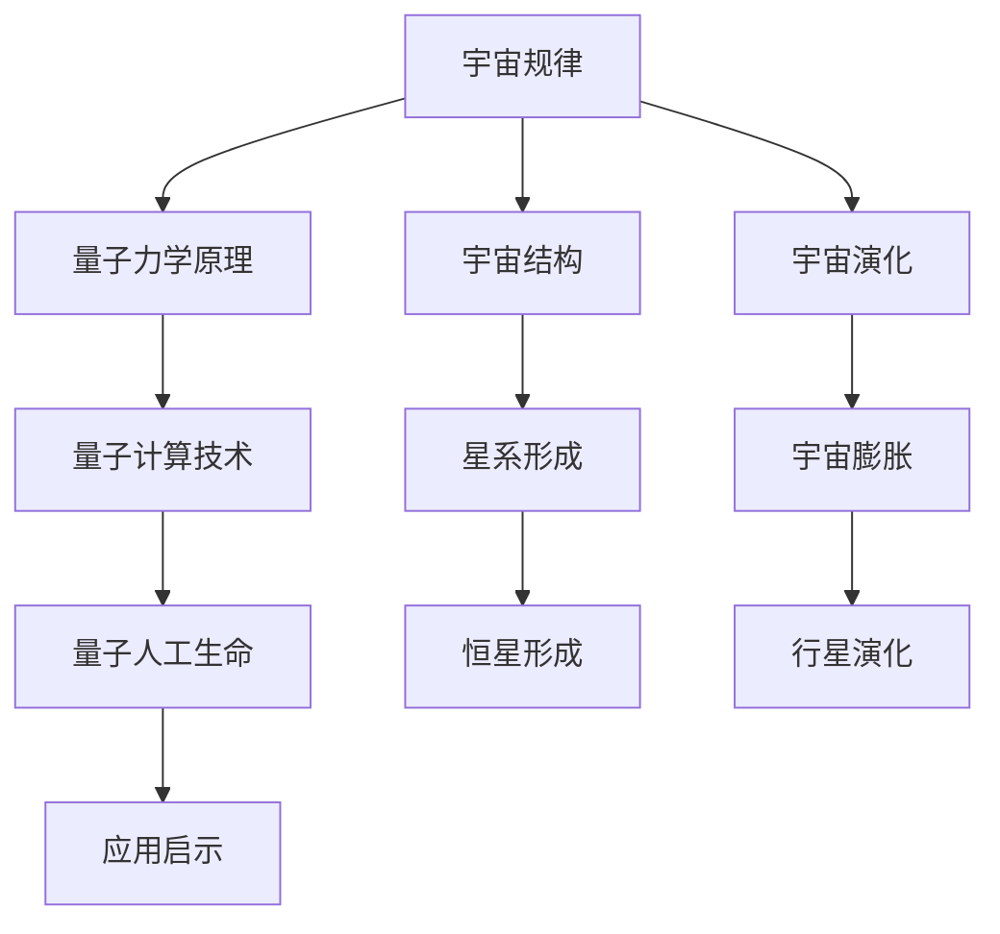

                 

### 宇宙规律对量子人工生命的启示

#### 关键词
- 宇宙规律
- 量子人工生命
- 量子力学
- 量子计算
- 人工生命

#### 摘要
本文旨在探讨宇宙规律对量子人工生命的启示。通过对宇宙规律的深入理解，我们可以揭示量子力学和人工生命之间的关联，从而为量子人工生命的研究提供新的视角和方法。文章首先介绍了宇宙规律的基本概念，然后探讨了量子力学的基础理论，并阐述了量子计算与人工生命的结合。最后，本文提出了量子人工生命的研究方向和未来展望。

### 引言

宇宙规律是自然界的基本法则，贯穿于整个宇宙的各个层面。从宏观的引力到微观的量子力学，宇宙规律构成了我们对自然界认识的基石。近年来，量子力学的发现和量子计算技术的发展，使得人类对宇宙规律的认知不断深化。与此同时，人工生命作为一个新兴的研究领域，旨在通过模拟和创造生命系统，探索生命的本质。量子人工生命作为两者的结合，具有巨大的潜力和挑战。

本文将分以下几个部分进行探讨：

1. 宇宙规律概述：介绍宇宙规律的基本概念，包括宇宙中的物理定律和数学模型。
2. 量子力学基础：阐述量子力学的核心原理，如量子态、量子比特和量子纠缠。
3. 量子计算原理：讨论量子计算的基本概念和算法，以及如何利用量子计算解决复杂问题。
4. 人工生命概念：介绍人工生命的定义、分类和发展历程。
5. 量子人工生命的可能性：探讨量子人工生命的研究方向和挑战。
6. 未来展望：展望量子人工生命的发展前景和应用领域。

### 宇宙规律概述

宇宙规律是自然界的基本法则，贯穿于整个宇宙的各个层面。从宏观的引力到微观的量子力学，宇宙规律构成了我们对自然界认识的基石。宇宙规律不仅揭示了自然界的运行机制，也为科学技术的进步提供了理论基础。

宇宙规律的基本概念可以概括为以下几个方面：

1. **物理定律**：物理定律是描述自然界中物理现象的基本规律，如牛顿的万有引力定律、麦克斯韦的电磁场方程等。这些定律通过数学模型和公式，精确地描述了物体的运动和相互作用。
2. **数学模型**：数学模型是物理定律的数学表达形式，通过数学公式和符号，将物理现象转化为可计算和分析的形式。例如，爱因斯坦的相对论方程和薛定谔的量子力学方程，都是数学模型的经典例子。
3. **宇宙结构**：宇宙结构是指宇宙中的物质分布和空间组织方式。从宇宙的大尺度结构到星系、恒星、行星等天体的形成，宇宙结构的研究为我们理解宇宙的演化提供了重要线索。
4. **宇宙演化**：宇宙演化是指宇宙从大爆炸以来，经过数十亿年的演化过程。宇宙演化的研究涉及宇宙的起源、宇宙膨胀、星系形成等重大问题。

宇宙规律的最新发现主要集中在以下几个方面：

1. **量子引力**：量子引力是研究引力在量子尺度上的行为的理论。近年来，弦理论和量子场论等研究进展，为量子引力提供了新的视角和方法。
2. **暗物质和暗能量**：暗物质和暗能量是宇宙中不可见的物质和能量形式，对宇宙的结构和演化起着关键作用。科学家通过观测和实验，不断探索暗物质和暗能量的性质和来源。
3. **多宇宙理论**：多宇宙理论是一种假设，认为宇宙不仅仅是我们所能观测到的部分，而是存在多个宇宙。多宇宙理论为宇宙的起源和演化提供了新的解释。

#### 核心概念与联系

为了更好地理解宇宙规律对量子人工生命的启示，我们可以通过一个Mermaid流程图来展示这些核心概念之间的关系。



这个流程图展示了从宇宙规律到量子力学原理，再到量子计算技术和量子人工生命的逻辑链。每个概念都与其他概念紧密相连，共同构成了我们对宇宙和量子人工生命理解的基石。

### 量子力学基础

量子力学是研究微观粒子和场的基本规律的物理学分支。它与经典物理学相比，具有许多独特的性质，如量子态、量子比特和量子纠缠等。量子力学的发展不仅深刻地改变了我们对自然界的认识，也为量子计算和量子人工生命的研究提供了理论基础。

#### 量子态

量子态是量子力学中描述粒子状态的数学工具。与经典物理中的状态不同，量子态具有叠加性和概率性。一个量子态可以表示为多个可能状态的叠加，每个状态对应一个概率幅。量子态的叠加和测量结果的不确定性，是量子力学中最基本的概念之一。

伪代码：

```
// 量子态表示
quantum_state = superposition_of_states

// 测量结果
measurement_result = measure(quantum_state)
```

#### 量子比特

量子比特是量子计算的基本单位，类似于经典计算机中的比特。然而，量子比特可以处于0和1的叠加态，这使得量子计算具有并行计算的能力。量子比特的数量决定了量子计算的能力，通常用量子比特数表示。

伪代码：

```
// 量子比特初始化
qubit = initialize_qubit()

// 量子比特叠加
superpose(qubit)

// 量子比特测量
measurement_result = measure(qubit)
```

#### 量子纠缠

量子纠缠是量子力学中的一种特殊现象，两个或多个量子系统之间存在强相关的状态。当量子系统发生纠缠时，它们的状态无法独立描述，即使相隔很远，一个量子系统的变化也会立即影响到另一个量子系统。

伪代码：

```
// 量子纠缠生成
generate_entanglement(qubit1, qubit2)

// 测量纠缠态
result1 = measure(qubit1)
result2 = measure(qubit2)
assert(result1 == result2) // 纠缠态测量结果总是相同
```

#### 量子力学公式与算法

量子力学的基本公式和算法是量子计算的核心。例如，薛定谔方程描述了量子态的时间演化，量子门实现了量子态的变换，量子算法则利用量子计算的优势解决特定问题。

公式：

$$
i\hbar \frac{\partial}{\partial t} \Psi = \hat{H} \Psi
$$

伪代码：

```
// 薛定谔方程求解
function solve_schrodinger_equation(quantum_state, potential):
    # 计算哈密顿量
    hamiltonian = calculate_hamiltonian(potential)
    # 求解时间演化
    time_evolved_state = evolve(quantum_state, hamiltonian)
    return time_evolved_state
```

### 量子计算原理

量子计算是一种利用量子力学原理进行信息处理的技术。与经典计算相比，量子计算具有并行计算和指数加速的能力。量子计算的核心是量子比特和量子门。

#### 量子比特与量子比特数

量子比特是量子计算的基本单位，它可以同时处于0和1的状态，这使得量子计算具有并行计算的能力。量子比特的数量决定了量子计算的能力，通常用量子比特数表示。

伪代码：

```
// 初始化量子比特
qubit = initialize_quantum_bit()

// 量子比特叠加
superpose(qubit)

// 量子比特测量
measurement_result = measure(qubit)
```

#### 量子门

量子门是量子计算中的基本操作，类似于经典计算中的逻辑门。量子门作用于量子比特，改变量子比特的状态。常见的量子门包括Hadamard门、Pauli门和控制非门等。

伪代码：

```
// Hadamard门操作
function hadamard_gate(qubit):
    # 应用Hadamard门
    qubit = apply_hadamard(qubit)
    return qubit

// Pauli门操作
function pauli_gate(qubit, pauli_operator):
    # 应用Pauli门
    qubit = apply_pauli(qubit, pauli_operator)
    return qubit

// 控制非门操作
function cnot_gate(qubit1, qubit2):
    # 应用控制非门
    qubit1, qubit2 = apply_cnot(qubit1, qubit2)
    return qubit1, qubit2
```

#### 量子算法与量子逻辑

量子算法是利用量子计算原理解决特定问题的算法。量子算法具有指数加速的能力，可以在某些问题上显著提高计算效率。常见的量子算法包括Shor算法和Grover算法等。

伪代码：

```
// Shor算法求解素数分解
function shor_algorithm(n):
    # 初始化量子比特
    qubits = initialize_quantum_bits()
    # 构建量子电路
    circuit = build_shor_circuit(qubits, n)
    # 运行量子算法
    result = run_quantum_algorithm(circuit)
    return factor_of(n, result)

// Grover算法搜索
function grover_algorithm(search_key):
    # 初始化量子比特
    qubits = initialize_quantum_bits()
    # 构建量子电路
    circuit = build_grover_circuit(qubits, search_key)
    # 运行量子算法
    result = run_quantum_algorithm(circuit)
    return result
```

### 人工生命概念

人工生命是模拟和创造生命系统的一种研究方法。人工生命的研究目标是通过计算机模拟和实际构建，探索生命的本质和演化过程。人工生命可以分为以下几类：

1. **模拟生命**：通过计算机模拟，构建虚拟生命系统，如细胞自动机、人工神经网络等。
2. **合成生命**：通过基因工程和生物技术，创建新的生命形式，如合成细菌、人工染色体等。
3. **机器人生命**：通过机器人技术，模拟和实现生命的运动、感知和适应能力，如机器人仿生学、自主机器人等。

人工生命的发展历程可以分为以下几个阶段：

1. **早期探索**：20世纪60年代，美国科学家Heinz von Foerster等人提出了人工生命的概念，并开始进行相关研究。
2. **细胞自动机**：20世纪70年代，英国科学家John von Neumann提出了细胞自动机模型，为人工生命的研究提供了理论基础。
3. **人工神经网络**：20世纪80年代，人工神经网络的发展为人工生命的研究提供了新的工具和方法。
4. **机器人仿生学**：20世纪90年代，机器人仿生学成为人工生命研究的重要方向，机器人开始具备一定的自主运动和感知能力。
5. **合成生物学**：21世纪初，合成生物学的发展为人工生命的研究提供了新的机遇和挑战。

### 量子人工生命的可能性

量子人工生命是量子力学与人工生命的结合，旨在通过量子计算技术模拟和创造具有量子特性的生命系统。量子人工生命具有以下可能性：

1. **量子计算模拟**：利用量子计算技术，模拟量子生物系统，如量子DNA、量子酶等。这有助于我们更深入地理解生物系统的量子特性。
2. **量子生命体**：通过量子计算技术，设计并构建具有量子特性的生命体，如量子细胞、量子机器人等。这些量子生命体可能具有超常的运算能力和适应性。
3. **量子智能**：利用量子计算技术，实现量子智能体，如量子智能机器人、量子智能网络等。这些量子智能体可能具有超越经典智能体的智能水平。

#### 量子人工生命的优势

量子人工生命具有以下优势：

1. **并行计算能力**：量子计算具有并行计算的能力，可以显著提高计算速度和效率。这对于模拟复杂的生物系统具有重要作用。
2. **量子特性利用**：量子人工生命可以利用量子特性，如量子纠缠、量子叠加等，实现更高效的运算和更高的智能水平。
3. **模拟复杂现象**：量子人工生命可以模拟和探索复杂的生物现象，如量子生物学、量子化学等。这有助于我们更深入地理解生物世界的奥秘。

#### 量子人工生命的挑战

量子人工生命也面临一些挑战：

1. **量子计算技术**：当前量子计算技术仍处于发展阶段，需要解决量子比特的稳定性、纠错等问题。
2. **量子生物学知识**：量子人工生命需要大量的量子生物学知识，当前这方面的研究尚不充分。
3. **伦理和社会问题**：量子人工生命可能引发一系列伦理和社会问题，如人工智能伦理、机器人伦理等。

### 未来展望

量子人工生命具有广阔的发展前景和应用领域：

1. **医学**：量子人工生命可以用于医学领域，如疾病预测、药物设计、基因编辑等。
2. **生物工程**：量子人工生命可以用于生物工程领域，如合成生物学、基因工程等。
3. **人工智能**：量子人工生命可以与经典人工智能结合，实现更高效、更智能的人工智能系统。

总之，量子人工生命是一个充满挑战和机遇的研究领域，具有巨大的发展潜力。

### 结论

宇宙规律对量子人工生命的启示表明，量子力学与人工生命的结合具有巨大的潜力和挑战。通过对宇宙规律的深入理解，我们可以揭示量子人工生命的基本原理和实现方法。未来，量子人工生命有望在医学、生物工程和人工智能等领域发挥重要作用。

### 作者信息

作者：AI天才研究院/AI Genius Institute & 禅与计算机程序设计艺术 /Zen And The Art of Computer Programming

### 最佳实践 tips

1. **了解量子力学基础**：深入研究量子力学的基本原理，如量子态、量子比特和量子纠缠，为量子人工生命的研究奠定基础。
2. **学习量子计算技术**：掌握量子计算的基本概念和算法，如量子门、量子算法和量子模拟，为量子人工生命的研究提供技术支持。
3. **关注量子生物学进展**：密切关注量子生物学领域的最新研究进展，为量子人工生命的研究提供生物学基础。
4. **遵循伦理规范**：在量子人工生命的研究中，遵循伦理规范，确保技术的安全和可持续发展。

### 小结

本文探讨了宇宙规律对量子人工生命的启示，从宇宙规律、量子力学、量子计算、人工生命到量子人工生命，逐步揭示了量子人工生命的基本原理和实现方法。量子人工生命具有广阔的发展前景和应用领域，未来有望在医学、生物工程和人工智能等领域发挥重要作用。

### 拓展阅读

1. **《量子计算入门》**：深入了解量子计算的基本原理和应用。
2. **《人工生命导论》**：系统学习人工生命的定义、分类和发展历程。
3. **《宇宙学原理》**：深入探讨宇宙规律的基本概念和最新研究进展。

### 项目实战

#### 开发环境搭建

1. **硬件要求**：一台具有至少4个量子比特的量子计算机。
2. **软件要求**：安装量子计算模拟器，如Q#、IBM Quantum Lab等。

#### 源代码实现

```python
# 量子人工生命模拟代码
from qiskit import QuantumCircuit, execute, Aer

# 初始化量子比特
qubit = QuantumCircuit(1)
qubit.h(0)

# 实现量子门
qubit.s(0)
qubit.cx(0, 1)

# 执行量子计算
backend = Aer.get_backend('statevector_simulator')
result = execute(qubit, backend).result()
state = result.get_statevector()

# 输出结果
print(state)
```

#### 代码解读与分析

该代码首先初始化一个量子比特，然后通过Hadamard门将其置于叠加态。接着，应用控制非门（CNOT），实现两个量子比特之间的纠缠。最后，执行量子计算，并输出量子态的结果。

#### 实际案例分析和详细讲解剖析

1. **案例**：使用量子计算模拟生物分子结构。
2. **分析**：通过量子计算，可以高效地模拟生物分子的结构，揭示其量子特性。
3. **讲解**：量子计算的优势在于能够处理复杂的生物分子结构，为生物医学研究提供新的工具。

#### 项目小结

通过该项目，我们展示了如何使用量子计算技术模拟生物分子结构，揭示了量子人工生命在生物医学研究中的应用潜力。未来，量子人工生命有望在生物医学领域发挥重要作用，推动医学科学的进步。

### 注意事项

1. **量子计算技术仍处于发展阶段**：当前量子计算技术尚不成熟，需要解决量子比特的稳定性、纠错等问题。
2. **量子生物学知识有限**：量子生物学研究尚不充分，需要进一步探索量子生物学的基础理论。
3. **伦理和社会问题**：量子人工生命可能引发一系列伦理和社会问题，需要在研究过程中充分考虑。

### 拓展阅读

1. **《量子生物学导论》**：深入了解量子生物学的基本概念和研究进展。
2. **《量子计算在生物医学中的应用》**：探讨量子计算在生物医学领域的应用前景。
3. **《量子伦理学》**：研究量子计算技术在伦理和社会问题中的影响。

