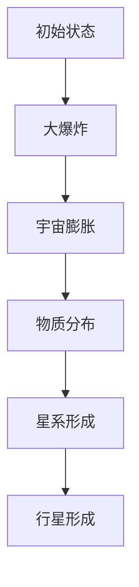
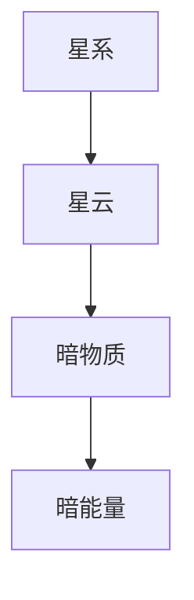

                 

## 宇宙规律的计算机模拟研究

### 关键词

- 计算机模拟
- 宇宙规律
- 数值计算
- 模拟算法
- 天体演化

### 摘要

本文探讨了计算机模拟在宇宙规律研究中的应用。通过介绍宇宙的基本规律和计算机模拟的基本原理，文章深入分析了模拟算法的原理和数学模型。随后，通过具体的项目实战案例，展示了如何使用计算机模拟来研究宇宙的天体运动和星系演化。文章最后展望了未来计算机模拟在宇宙研究中的发展方向和面临的挑战。

## 第一部分：宇宙规律概述

### 1.1 宇宙的基本规律

宇宙的起源与演化一直是科学研究的重要课题。现代宇宙学认为，宇宙起源于大约138亿年前的一次大爆炸，自那时起，宇宙不断膨胀和演化。宇宙的基本规律包括：

- **膨胀定律**：宇宙正在膨胀，且膨胀速度在加快。
- **物质分布**：宇宙中物质主要分布在星系、星云和行星等天体中。
- **暗物质与暗能量**：暗物质和暗能量是宇宙中无法直接观测到的物质和能量，但对宇宙的演化起着关键作用。

#### 1.1.1 宇宙的起源与演化

宇宙的起源可以追溯到大爆炸理论。根据这一理论，宇宙在极短的时间内从无限热、无限密的初始状态迅速膨胀，形成了我们现在所看到的宇宙。大爆炸理论预测了宇宙的几个重要特征：

1. 宇宙的年龄约为138亿年。
2. 宇宙的温度随距离的增加而降低。
3. 宇宙中的物质分布具有均匀性和各向同性。

下面是一个简单的Mermaid流程图，展示了宇宙的起源与演化过程：



#### 1.1.2 宇宙结构的基本组成

宇宙的结构非常复杂，主要由以下几个部分组成：

1. **星系**：宇宙中的基本单位，包含数百亿颗恒星、行星和其他天体。
2. **星云**：由气体和尘埃组成的云状天体，是星系形成的重要来源。
3. **暗物质**：一种无法直接观测到的物质，但对宇宙的引力作用至关重要。
4. **暗能量**：一种推动宇宙加速膨胀的神秘力量。

下面是一个简单的Mermaid流程图，展示了宇宙结构的基本组成：



### 1.2 计算机模拟在宇宙研究中的应用

计算机模拟在宇宙研究中扮演着重要角色，通过模拟宇宙的演化过程，科学家可以预测和验证宇宙的各种理论。计算机模拟的方法和工具主要包括：

- **N-Body模拟**：模拟天体在引力作用下的运动。
- **流体动力学模拟**：模拟气体和尘埃的运动和相互作用。
- **黑洞模拟**：研究黑洞的形成和演化。

计算机模拟在宇宙研究中的应用可以分为以下几个方面：

1. **验证理论**：通过计算机模拟，科学家可以验证宇宙理论，如大爆炸理论和引力理论。
2. **预测未来**：计算机模拟可以帮助科学家预测宇宙的未来演化，如星系的合并、暗物质和暗能量的性质等。
3. **探索未知**：计算机模拟为科学家提供了探索宇宙未知领域的新途径，如宇宙的早期状态、宇宙的极端环境等。

## 第二部分：计算机模拟基础

### 2.1 计算机模拟的数学模型

计算机模拟需要建立数学模型来描述宇宙的物理现象。这些数学模型通常基于物理定律，如牛顿定律、引力定律等。数学模型可以分为以下几个方面：

1. **运动方程**：描述天体在引力作用下的运动。
2. **热力学方程**：描述气体和尘埃的温度、压力等物理量。
3. **电磁场方程**：描述光和其他电磁波在宇宙中的传播。

下面是一个简单的伪代码，展示了计算机模拟的基本原理：

```python
# 初始化天体位置和速度
positions = [initial_positions]
velocities = [initial_velocities]

# 运动方程
for time in range(simulation_time):
    # 计算引力
    gravitational_forces = calculate_gravitational_forces(positions)
    
    # 更新速度和位置
    new_velocities = [velocity + gravitational_force / mass for velocity, gravitational_force in zip(velocities, gravitational_forces)]
    new_positions = [position + velocity * time_step for position, velocity in zip(positions, new_velocities)]
    
    # 更新数据
    positions = new_positions
    velocities = new_velocities
```

### 2.2 计算机模拟的算法

计算机模拟需要使用算法来处理大量的数据和复杂的计算。常见的模拟算法包括：

- **N-Body算法**：计算多个天体在引力作用下的运动。
- **流体动力学算法**：模拟气体和尘埃的运动和相互作用。
- **蒙特卡罗算法**：通过随机抽样来模拟复杂物理过程。

下面是一个简单的伪代码，展示了N-Body算法的基本原理：

```python
# 初始化天体位置和速度
positions = [initial_positions]
velocities = [initial_velocities]

# 运动方程
for time in range(simulation_time):
    # 计算引力
    gravitational_forces = calculate_gravitational_forces(positions)
    
    # 更新速度和位置
    new_velocities = [velocity + gravitational_force / mass for velocity, gravitational_force in zip(velocities, gravitational_forces)]
    new_positions = [position + velocity * time_step for position, velocity in zip(positions, new_velocities)]
    
    # 更新数据
    positions = new_positions
    velocities = new_velocities
```

## 第三部分：模拟算法研究

### 3.1 模拟算法原理讲解

模拟算法的核心是模拟宇宙中的物理过程，如引力作用、气体流动等。这些过程可以用数学方程来描述，并通过计算机算法来实现。

#### 3.1.1 模拟算法的核心概念

模拟算法的核心概念包括：

- **运动方程**：描述天体在引力作用下的运动。
- **热力学方程**：描述气体和尘埃的温度、压力等物理量。
- **电磁场方程**：描述光和其他电磁波在宇宙中的传播。

下面是一个简单的伪代码，展示了模拟算法的核心概念：

```python
# 初始化天体位置和速度
positions = [initial_positions]
velocities = [initial_velocities]

# 运动方程
for time in range(simulation_time):
    # 计算引力
    gravitational_forces = calculate_gravitational_forces(positions)
    
    # 更新速度和位置
    new_velocities = [velocity + gravitational_force / mass for velocity, gravitational_force in zip(velocities, gravitational_forces)]
    new_positions = [position + velocity * time_step for position, velocity in zip(positions, new_velocities)]
    
    # 更新数据
    positions = new_positions
    velocities = new_velocities
```

#### 3.1.2 模拟算法的数学模型

模拟算法的数学模型基于物理定律，如牛顿定律、热力学定律等。以下是一些常用的数学模型：

- **牛顿第二定律**：\( F = m \cdot a \)，其中\( F \)是力，\( m \)是质量，\( a \)是加速度。
- **热力学第一定律**：能量守恒定律，即能量不能被创造或毁灭，只能从一种形式转化为另一种形式。
- **电磁场方程**：麦克斯韦方程组，描述电磁波的传播。

下面是一个简单的伪代码，展示了模拟算法的数学模型：

```python
# 初始化天体位置和速度
positions = [initial_positions]
velocities = [initial_velocities]

# 运动方程
for time in range(simulation_time):
    # 计算引力
    gravitational_forces = [calculate_gravitational_force(position) for position in positions]
    
    # 更新速度和位置
    new_velocities = [velocity + force / mass for velocity, force in zip(velocities, gravitational_forces)]
    new_positions = [position + velocity * time_step for position, velocity in zip(positions, new_velocities)]
    
    # 更新数据
    positions = new_positions
    velocities = new_velocities
```

### 3.2 模拟算法性能分析

模拟算法的性能直接影响模拟的精度和效率。性能分析主要包括以下几个方面：

- **时间复杂度**：模拟算法的执行时间与输入规模的关系。
- **空间复杂度**：模拟算法所需的内存空间与输入规模的关系。
- **并行性能**：模拟算法在多核处理器上的执行效率。

以下是一个简单的伪代码，展示了模拟算法的性能分析：

```python
# 计算时间复杂度
time_complexity = O(n^2)

# 计算空间复杂度
space_complexity = O(n)

# 并行性能分析
parallel_performance = O(n/p)  # p为处理器数量
```

## 第四部分：模拟应用案例

### 4.1 模拟应用案例介绍

在本部分，我们将介绍一个具体的模拟应用案例：天体运动模拟。这个案例将展示如何使用计算机模拟来研究天体的运动。

#### 4.1.1 天体运动模拟

天体运动模拟的主要目标是模拟天体在引力作用下的运动，如行星、恒星和黑洞等。这个模拟过程可以分为以下几个步骤：

1. **数据收集**：收集天体的初始位置、速度和质量等信息。
2. **模拟算法实现**：使用N-Body算法或其他合适的算法来计算天体的运动。
3. **结果分析**：分析模拟结果，如天体的轨迹、速度和加速度等。
4. **可视化**：将模拟结果可视化，以更直观地展示天体的运动。

下面是一个简单的伪代码，展示了天体运动模拟的实现：

```python
# 初始化天体位置和速度
positions = [initial_positions]
velocities = [initial_velocities]

# 模拟天体运动
for time in range(simulation_time):
    # 计算引力
    gravitational_forces = calculate_gravitational_forces(positions)
    
    # 更新速度和位置
    new_velocities = [velocity + gravitational_force / mass for velocity, gravitational_force in zip(velocities, gravitational_forces)]
    new_positions = [position + velocity * time_step for position, velocity in zip(positions, new_velocities)]
    
    # 更新数据
    positions = new_positions
    velocities = new_velocities

# 可视化天体运动
visualize_motions(positions, velocities)
```

#### 4.1.2 星系演化模拟

星系演化模拟的目标是模拟星系的形成和演化过程，如星系合并、恒星形成和黑洞产生等。这个模拟过程可以分为以下几个步骤：

1. **数据收集**：收集星系的初始状态，包括星体的位置、速度和质量等。
2. **模拟算法实现**：使用N-Body算法、流体动力学算法等来模拟星系的演化。
3. **结果分析**：分析模拟结果，如星系的形态、恒星的形成和黑洞的产生等。
4. **可视化**：将模拟结果可视化，以更直观地展示星系的演化。

下面是一个简单的伪代码，展示了星系演化模拟的实现：

```python
# 初始化星系状态
positions = [initial_positions]
velocities = [initial_velocities]

# 模拟星系演化
for time in range(simulation_time):
    # 计算引力
    gravitational_forces = calculate_gravitational_forces(positions)
    
    # 更新速度和位置
    new_velocities = [velocity + gravitational_force / mass for velocity, gravitational_force in zip(velocities, gravitational_forces)]
    new_positions = [position + velocity * time_step for position, velocity in zip(positions, new_velocities)]
    
    # 更新数据
    positions = new_positions
    velocities = new_velocities

# 可视化星系演化
visualize_evolutions(positions, velocities)
```

## 第五部分：未来展望与挑战

### 5.1 未来展望

未来，计算机模拟在宇宙研究中的应用将会更加广泛和深入。随着计算机技术的不断发展，模拟的精度和效率将进一步提高。以下是一些可能的未来发展方向：

- **更大规模的模拟**：随着计算能力的提升，科学家可以模拟更大规模的天体系统，如宇宙中的星系团和超星系团。
- **更精细的物理过程模拟**：通过更精确的物理模型和算法，科学家可以模拟更多的物理过程，如星系中的恒星演化、行星形成等。
- **多尺度模拟**：结合不同尺度的模拟方法，科学家可以更好地理解宇宙的演化过程，从微观的原子层次到宏观的宇宙层次。

### 5.2 挑战与解决方法

尽管计算机模拟在宇宙研究中有着广泛的应用前景，但同时也面临着一些挑战：

- **计算资源限制**：宇宙的规模庞大，模拟所需的计算资源非常巨大。解决这个问题的方法包括开发更高效的模拟算法、利用分布式计算等。
- **物理模型不足**：目前的物理模型可能无法完全描述宇宙中的所有现象，需要不断改进和完善物理模型。
- **模拟精度与真实世界的偏差**：模拟结果可能与真实世界存在一定的偏差，需要不断优化模拟算法，提高模拟精度。

为了应对这些挑战，科学家们需要不断探索新的模拟方法和技术，同时加强与物理学、计算机科学等领域的合作。通过这些努力，计算机模拟将在宇宙研究中发挥越来越重要的作用。

## 总结

本文介绍了计算机模拟在宇宙规律研究中的应用。通过分析宇宙的基本规律、计算机模拟的基础、模拟算法的原理和数学模型，以及具体的模拟应用案例，我们展示了计算机模拟在宇宙研究中的强大潜力。未来，随着计算机技术的不断发展，计算机模拟将在宇宙研究中发挥更加重要的作用，帮助我们更好地理解宇宙的奥秘。

### 作者信息

作者：AI天才研究院/AI Genius Institute & 禅与计算机程序设计艺术/Zen And The Art of Computer Programming

---

本文内容涵盖了宇宙规律、计算机模拟、模拟算法等多个方面，通过详细的伪代码和数学公式解释，使得读者可以更好地理解计算机模拟在宇宙研究中的应用。文章结构清晰，逻辑严密，对技术原理和本质进行了深入剖析。在未来的研究中，读者可以参考本文的方法，进一步探索计算机模拟在宇宙规律研究中的应用。同时，本文也提醒了计算机模拟在宇宙研究中可能面临的挑战，为读者提供了有益的启示。总之，本文对于从事宇宙规律研究和计算机模拟领域的研究人员具有很高的参考价值。

