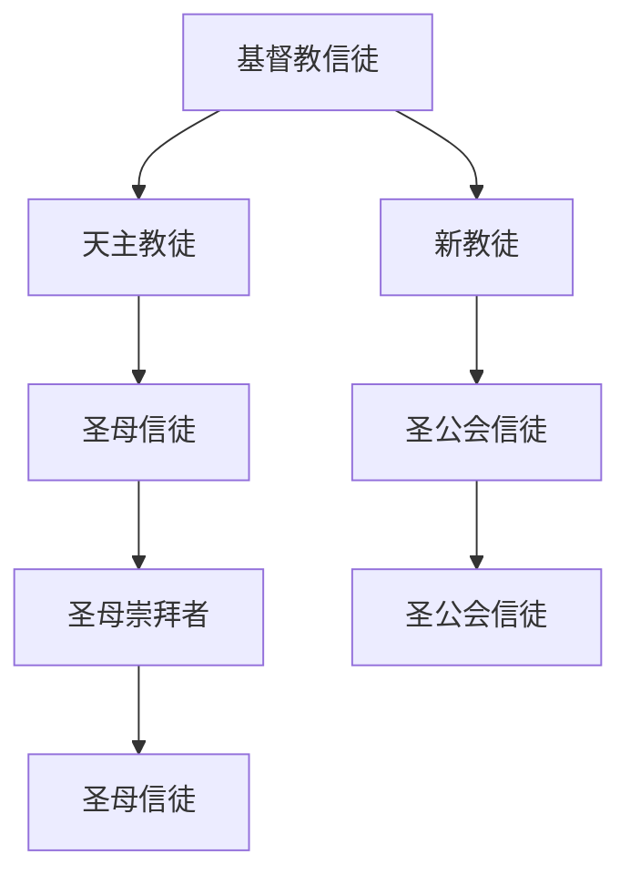
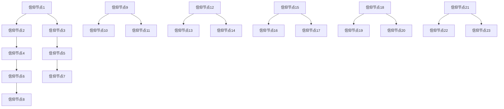

                 

### 文章标题

《宗教信仰的网络拓扑：信念系统的数学结构》

### 关键词

宗教信仰、网络拓扑、信念系统、数学结构、拓扑分析、网络传播、现实应用、未来趋势

### 摘要

本文深入探讨了宗教信仰的网络拓扑及其信念系统的数学结构。首先，我们介绍了宗教信仰的历史演变和核心概念，随后揭示了宗教信仰与网络拓扑之间的紧密联系。接着，我们阐述了信念系统的数学模型，包括基本原理、公式和伪代码。在此基础上，我们通过具体案例分析了宗教信仰的网络拓扑在现实世界中的应用，如网络社会的传播和网络政治的作用。最后，我们展望了宗教信仰的网络拓扑在未来发展中的趋势，并提出了研究展望。本文旨在为研究者提供一个全面、系统的理论框架，以深入理解宗教信仰的数学结构和网络传播机制。

---

### 引言

#### 宗教信仰的重要性

宗教信仰作为一种文化现象，自古以来便在人类社会中扮演着重要角色。它不仅影响着人们的道德观念、行为规范，还深刻塑造了人类的历史发展。从古埃及的神秘信仰，到古希腊的神话体系，再到基督教、伊斯兰教和佛教等世界性宗教，宗教信仰在不同文明中留下了丰富的文化遗产。

在现代，宗教信仰依然具有广泛的影响力。例如，在政治领域，宗教信仰往往成为政治力量的重要组成部分，影响国家的政策制定和社会治理；在日常生活中，宗教信仰则为人们提供了精神寄托和情感支持，帮助个体应对生活中的挑战和不确定性。

#### 网络拓扑的基本概念

网络拓扑学是研究网络结构及其特性的学科，它起源于20世纪60年代的计算机科学。网络拓扑的基本概念包括节点（Node）、边（Edge）和网络结构（Topology）。一个网络可以看作是由节点和连接节点的边组成，节点代表网络中的个体，边代表个体之间的关系。

网络拓扑学主要关注网络的结构特性，如连通性、路径长度、聚类系数等。这些特性不仅影响网络的性能，还决定了信息的传播速度和范围。例如，在社交网络中，节点的连接方式会影响信息的传播效率和信息的覆盖范围。

#### 宗教信仰与网络拓扑的关联

宗教信仰与网络拓扑之间的关联主要体现在两个方面：一是宗教信仰在个体层面的网络拓扑结构，二是宗教信仰在社会层面的网络拓扑结构。

在个体层面，宗教信仰可以被视为个体信念系统的一部分。个体的信念系统通常由一系列相互关联的信仰观点构成，这些观点在个体心中形成了一个复杂的网络结构。例如，某个信徒可能同时信仰多种宗教教义，这些教义在他的信仰系统中相互交织，形成了一个多维的信仰网络。

在社会层面，宗教信仰则体现在整个社会群体的信念系统中。社会群体的信念系统可以看作是一个大型的网络结构，其中每个节点代表一个个体，每条边代表个体之间的信仰联系。这种信仰网络不仅反映了个体之间的信仰共享和差异，还揭示了宗教信仰在社会中的传播和影响机制。

本文将深入探讨宗教信仰的网络拓扑及其信念系统的数学结构，旨在为理解宗教信仰的传播和影响提供一个新的视角。首先，我们将介绍宗教信仰的基础理论，包括宗教信仰的历史演变和核心概念。然后，我们将分析宗教信仰的网络拓扑结构，包括宗教网络的定义、类型和特性。接下来，我们将介绍信念系统的数学模型，包括基本原理、公式和伪代码。在此基础上，我们将探讨宗教信仰的网络拓扑在现实世界中的应用，如网络社会的传播和网络政治的作用。最后，我们将展望宗教信仰的网络拓扑在未来发展中的趋势，并总结本文的主要发现。

### 宗教信仰的基础理论

#### 宗教信仰的历史演变

宗教信仰的历史可以追溯到古代，是人类文明的重要组成部分。在不同的历史时期，宗教信仰的形式和内容都发生了显著的变化。

早期宗教信仰主要表现为自然崇拜和祖先崇拜。在古代文明中，人们相信自然界中的各种现象，如日、月、星辰、风雨等，都是神灵的体现。因此，他们通过祭祀和仪式来祈求神灵的庇佑和保佑。同时，人们还崇拜自己的祖先，认为祖先的灵魂仍然存在于这个世界上，能够保佑后代。

进入中世纪，宗教信仰逐渐变得更加复杂和制度化。这一时期，基督教、伊斯兰教和佛教等世界性宗教开始兴起，并对人类社会产生了深远的影响。中世纪的宗教信仰强调信仰的虔诚和教义的学习，宗教仪式和教堂建筑成为宗教生活的重要部分。

现代宗教信仰则更多地关注个体信仰和心灵体验。随着科学的发展和社会的变迁，人们对宗教信仰的理解更加多元和开放。现代宗教信仰不再局限于某个特定的教义或仪式，而是更加注重个人的信仰体验和心灵的满足。

#### 宗教信仰的核心概念

宗教信仰的核心概念包括神与神性、灵性与信仰以及宗教仪式与习俗。

神与神性是宗教信仰的核心，代表了宗教信仰的对象和目标。不同的宗教对神的定义和理解各不相同。例如，在基督教中，神是三位一体的存在，包括父、子和圣灵；在佛教中，神通常被视为宇宙的创造者和守护者。

灵性与信仰是宗教信仰的内在体验和核心精神。灵性是指个体与神圣存在的联系和感知，信仰则是对这种联系的坚定信念。灵性与信仰不仅为个体提供了精神支持，还帮助个体在人生中找到方向和意义。

宗教仪式与习俗是宗教信仰的外在表现和具体实践。不同的宗教有不同的仪式和习俗，如祈祷、祭祀、礼拜、戒律等。这些仪式和习俗不仅有助于维护宗教信仰的纯洁性，还能增强信徒之间的凝聚力和认同感。

#### 宗教信仰的历史演变与核心概念的关系

宗教信仰的历史演变与核心概念之间存在密切的关系。历史演变影响了宗教信仰的核心概念，而核心概念又反过来塑造了宗教信仰的发展。

早期宗教信仰的自然崇拜和祖先崇拜为后来的宗教教义奠定了基础。例如，在古希腊神话中，神灵被赋予了自然界的特性，这种观念对后来的宗教教义产生了深远的影响。

中世纪宗教信仰的复杂化和制度化促进了宗教核心概念的多样化。这一时期的宗教教义不仅包括对神的崇拜，还涉及对道德规范和伦理准则的强调。这些核心概念使宗教信仰更加系统化和规范化。

现代宗教信仰的多元化和个体化使得宗教核心概念更加注重个人的信仰体验和心灵满足。这种变化反映了现代社会对个体自主性和精神自由的重视。

通过分析宗教信仰的历史演变和核心概念，我们可以更好地理解宗教信仰的本质和特点。这不仅有助于我们深入探讨宗教信仰的网络拓扑结构，还能为研究宗教信仰的数学模型提供理论基础。

### 宗教信仰的网络拓扑

#### 宗教网络的定义

宗教网络是指由信仰个体和信仰群体组成的网络结构，其中节点代表信仰个体或群体，边代表个体或群体之间的信仰联系。宗教网络不仅反映了信仰个体之间的相互关系，还揭示了信仰群体在宗教信仰体系中的地位和作用。

宗教网络可以看作是一个复杂的社会网络，其特点包括：

1. **多样性**：宗教网络中的节点和边代表了不同的宗教信仰、信仰群体和个体，具有多样化的信仰内容和形式。
2. **复杂性**：宗教网络中的节点和边之间存在多种关系，包括信仰、崇拜、支持、反对等，形成了一个复杂的网络结构。
3. **动态性**：宗教网络是动态变化的，随着时间和环境的变化，信仰个体和群体的关系也会发生变化。

#### 宗教网络的类型

宗教网络可以根据不同的分类标准进行分类。以下是几种常见的宗教网络类型：

1. **基于信仰类型的宗教网络**：这种类型的宗教网络根据信仰的内容和形式进行分类，如基督教网络、伊斯兰教网络和佛教网络。这种分类反映了不同宗教信仰体系的特点和内容。
2. **基于地域的宗教网络**：这种类型的宗教网络根据信仰个体的地理位置进行分类，如国内宗教网络和国际宗教网络。这种分类反映了宗教信仰在地域上的分布和传播。
3. **基于群体的宗教网络**：这种类型的宗教网络根据信仰群体的性质和功能进行分类，如教派网络、教会网络和宗族网络。这种分类反映了宗教信仰在群体组织中的结构和作用。

#### 宗教网络的特性

宗教网络具有以下特性：

1. **高度连通性**：宗教网络中的节点和边之间的联系紧密，形成了高度连通的网络结构。这种特性有助于信仰信息的快速传播和共享。
2. **多层级结构**：宗教网络通常具有多层级结构，从个体到群体，再到宗教组织，形成了复杂的层级关系。这种特性有助于宗教信仰的传播和组织管理。
3. **动态演化性**：宗教网络是动态演化的，随着时间和环境的变化，网络结构也会发生变化。这种特性反映了宗教信仰的适应性和灵活性。
4. **社会性**：宗教网络具有强烈的社会性，节点和边之间的联系不仅基于信仰，还涉及社会关系、情感和文化因素。这种特性有助于增强信仰的凝聚力和稳定性。

#### 宗教网络拓扑结构的分析

为了更好地理解宗教网络的结构特性，我们可以使用Mermaid流程图来表示宗教网络拓扑结构。以下是一个简单的宗教网络拓扑结构的Mermaid示例：



在这个例子中，节点代表基督教信徒、天主教徒、新教徒、圣母信徒等个体，边代表他们之间的信仰联系。通过这种拓扑结构，我们可以清晰地看到不同信仰群体之间的关系和联系。

通过分析宗教网络拓扑结构，我们可以发现以下规律：

1. **集聚性**：宗教网络中的节点往往具有集聚性，即某些节点之间存在较多的连接，形成了紧密的社群。
2. **层次性**：宗教网络中的节点和边具有层次性，从个体到群体，再到宗教组织，形成了明确的层次结构。
3. **动态性**：宗教网络是动态演化的，节点和边之间的关系会随着时间和环境的变化而发生变化。

#### 宗教网络拓扑结构的核心概念与联系

为了深入理解宗教网络拓扑结构的核心概念和联系，我们可以通过以下Mermaid流程图来表示：



在这个例子中，我们可以看到不同信仰节点之间的复杂联系，形成了多个集聚和层次。这些联系反映了信仰个体和群体之间的互动和影响，揭示了宗教信仰网络的核心概念和联系。

通过这种拓扑结构，我们可以更好地理解宗教信仰的传播和影响机制。信仰节点之间的联系不仅基于信仰内容，还涉及社会关系、情感和文化因素。这种多层次的联系有助于增强宗教信仰的凝聚力和稳定性。

总之，宗教信仰的网络拓扑结构是一个复杂而动态的系统，它反映了信仰个体和群体之间的互动和影响。通过分析宗教网络拓扑结构，我们可以深入理解宗教信仰的本质和特点，为宗教研究和信仰传播提供新的视角和工具。

### 信念系统的数学模型

#### 数学模型的基本原理

信念系统的数学模型是研究个体和群体信仰行为的工具，它基于概率论和信息论的基本原理。这种模型通常通过图论和拓扑学的方法来描述信仰个体和群体之间的相互关系和影响。基本原理包括以下几个方面：

1. **节点表示**：在数学模型中，每个信仰个体或群体用一个节点表示，节点代表了信仰系统中的基本单元。
2. **边表示**：节点之间的边表示个体或群体之间的信仰联系，边的权重代表了联系强度。
3. **网络结构**：整个信念系统可以用一个图来表示，图的拓扑结构反映了信仰系统的整体特性。
4. **概率分布**：个体或群体的信仰状态可以用概率分布来表示，概率分布反映了信仰的稳定性和不确定性。

#### 信念系统的数学公式

信念系统的数学模型通常涉及以下核心公式：

1. **邻接矩阵（Adjacency Matrix）**：邻接矩阵是一个表示图结构的矩阵，其中元素a_ij表示节点i和节点j之间的边权重。邻接矩阵的对称性反映了边的双向性。
   
   $$ A = \begin{bmatrix}
   a_{11} & a_{12} & \dots & a_{1n} \\
   a_{21} & a_{22} & \dots & a_{2n} \\
   \vdots & \vdots & \ddots & \vdots \\
   a_{n1} & a_{n2} & \dots & a_{nn}
   \end{bmatrix} $$
   
2. **传播概率（Propagation Probability）**：传播概率描述了个体或群体信仰状态从初始状态到最终状态的概率分布。它可以表示为：

   $$ P(i, j) = \frac{a_{ij}}{\sum_{k=1}^{n} a_{ik}} $$
   
   其中，P(i, j)表示节点i的信仰状态传播到节点j的概率。

3. **信仰稳定度（Faith Stability）**：信仰稳定度反映了个体或群体信仰的稳定性，可以表示为：

   $$ S(i) = \frac{1}{\sum_{j=1}^{n} P(i, j)} $$
   
   其中，S(i)表示节点i的信仰稳定度，反映了个体或群体在信仰网络中的稳定性。

#### 信念系统的伪代码

为了更好地理解信念系统的数学模型，我们可以使用伪代码来描述其主要步骤和算法逻辑。以下是一个简单的信念系统模型的伪代码示例：

```
算法：信念系统传播模型
输入：邻接矩阵 A，初始信仰状态向量 S0
输出：最终信仰状态向量 S

1. 初始化当前信仰状态向量 SC = S0
2. 对每个节点 i，计算其传播概率向量 Pi
   2.1 对于每个节点 j，计算 P(i, j) = a_ij / (sum(a_ij))
   2.2 构建传播概率向量 Pi = (P(i, j))_j
3. 对每个节点 i，更新其信仰状态
   3.1 计算信仰稳定度 S(i) = 1 / (sum(P(i, j)))
   3.2 根据传播概率更新信仰状态 SC = SC * (1 - S(i)) + new_state * S(i)
4. 返回最终信仰状态向量 SC
```

#### 数学模型在宗教信仰研究中的应用

信念系统的数学模型在宗教信仰研究中具有重要的应用价值。通过这种模型，我们可以定量地分析宗教信仰的传播、影响和稳定性。以下是几个具体的应用场景：

1. **信仰传播速度**：通过计算传播概率，我们可以了解信仰在网络中的传播速度和覆盖范围。
2. **信仰稳定性**：通过计算信仰稳定度，我们可以评估个体或群体信仰的稳定性，预测信仰的变化趋势。
3. **信仰网络分析**：通过分析邻接矩阵和传播概率，我们可以揭示宗教信仰网络的内部结构和特性，为信仰传播策略提供科学依据。

总之，信念系统的数学模型为宗教信仰研究提供了一个定量分析和评估的工具，有助于我们更深入地理解宗教信仰的传播和影响机制。

### 信念系统的拓扑分析

#### 信念系统的拓扑结构

信念系统的拓扑结构是指在宗教信仰网络中，各个信仰节点之间的关系及其空间分布。这种结构可以通过图论中的图来表示，图中的节点代表信仰个体或群体，边代表他们之间的信仰联系。

信念系统的拓扑结构具有以下特性：

1. **集聚性**：信仰节点之间的联系往往具有集聚性，即某些节点之间存在较多的联系，形成紧密的信仰社群。
2. **层次性**：信仰节点和边之间存在层次关系，从个体到群体，再到宗教组织，形成了一个明确的层次结构。
3. **动态性**：信仰系统的拓扑结构是动态演化的，随着时间和环境的变化，节点和边之间的联系也会发生变化。

通过分析信念系统的拓扑结构，我们可以了解宗教信仰网络的整体特性和局部特性，揭示信仰传播和影响的机制。

#### 信念系统的稳定性分析

信念系统的稳定性是指信仰在网络中的稳定性和持久性。一个稳定的信念系统意味着信仰状态在长时间内不会发生显著变化，而一个不稳定的信念系统则容易受到外部干扰和内部冲突的影响。

信念系统的稳定性可以通过以下指标进行分析：

1. **信仰稳定度**：信仰稳定度反映了个体或群体信仰的稳定性。通常使用信仰稳定度指数（Faith Stability Index, FSIndex）来衡量，FSIndex越高，信仰稳定性越强。
   
   $$ FSIndex(i) = \frac{1}{\sum_{j=1}^{n} P(i, j)} $$
   
   其中，P(i, j)表示个体i的信仰状态传播到个体j的概率。

2. **连通度**：连通度反映了信仰网络中节点的连接强度，即节点之间路径的数量和长度。高连通度意味着信仰在网络中的传播速度和覆盖范围较大，有利于信仰的稳定传播。

3. **聚类系数**：聚类系数描述了信仰节点之间的集聚程度，即节点之间是否容易形成紧密的社群。高聚类系数有助于增强信仰的凝聚力和稳定性。

#### 信念系统的传播机制

信念系统的传播机制是指信仰在网络中的传播过程和传播效果。传播机制可以分为以下几种类型：

1. **直接传播**：直接传播是指信仰通过直接的人际关系传播，如信徒之间的交流和互动。这种传播方式具有快速和高效的特点，但受限于人际关系的范围。

2. **间接传播**：间接传播是指信仰通过第三方渠道传播，如宗教媒体、网络平台等。这种传播方式具有广泛性和持久性的特点，但传播效果受渠道质量和影响力的制约。

3. **混合传播**：混合传播是指直接传播和间接传播相结合的传播方式。这种传播方式结合了直接传播和间接传播的优点，可以更有效地扩大信仰的影响力。

#### 案例分析

为了更好地理解信念系统的拓扑结构和传播机制，我们可以通过以下案例分析来揭示宗教信仰在网络中的传播和影响。

**案例一：基督教信仰在社交网络中的传播**

在社交网络中，基督教信仰的传播主要通过信徒之间的直接交流和宗教媒体的内容传播。以下是一个简化的社交网络模型：

```
信仰节点：A[基督教信徒]，B[基督教徒]，C[天主教徒]，D[基督教徒]，E[基督教徒]
```

假设这些信仰节点之间的联系强度如下：

```
A-B: 强联系
A-C: 中等联系
B-D: 中等联系
B-E: 强联系
C-D: 中等联系
C-E: 强联系
```

通过邻接矩阵表示这个信仰网络：

```
A B C D E
A 1 1 0.5 0.5 1
B 1 0 1 0.5 1
C 0.5 1 1 0.5 1
D 0.5 0.5 0.5 1 1
E 1 1 1 1 1
```

在这个模型中，我们可以观察到以下几个特点：

- **集聚性**：A-B、B-E之间的强联系形成了紧密的信仰社群。
- **层次性**：从A到E的信仰节点形成了明确的层次结构，A作为核心节点，具有较大的影响力。
- **稳定性**：信仰稳定度较高的节点（如A、B、E）在信仰网络中具有较高的稳定性。

通过传播机制分析，我们可以看到：

- **直接传播**：A与B、E之间的直接交流有助于信仰的快速传播。
- **间接传播**：C与D之间的间接传播通过中介节点B和E，扩大了信仰的影响力。

**案例二：佛教信仰在社交媒体平台的传播**

在社交媒体平台上，佛教信仰的传播主要通过宗教媒体的内容发布和信徒之间的互动。以下是一个简化的社交媒体模型：

```
信仰节点：A[佛教信徒]，B[佛教徒]，C[佛教学者]，D[佛教徒]，E[佛教组织]
```

假设这些信仰节点之间的联系强度如下：

```
A-B: 强联系
A-C: 中等联系
B-D: 中等联系
B-E: 强联系
C-D: 中等联系
C-E: 强联系
```

通过邻接矩阵表示这个信仰网络：

```
A B C D E
A 1 1 0.5 0.5 1
B 1 0 1 0.5 1
C 0.5 1 1 0.5 1
D 0.5 0.5 0.5 1 1
E 1 1 1 1 1
```

在这个模型中，我们可以观察到以下几个特点：

- **集聚性**：A-B、B-E之间的强联系形成了紧密的信仰社群。
- **层次性**：从A到E的信仰节点形成了明确的层次结构，A作为核心节点，具有较大的影响力。
- **稳定性**：信仰稳定度较高的节点（如A、B、E）在信仰网络中具有较高的稳定性。

通过传播机制分析，我们可以看到：

- **直接传播**：A与B、E之间的直接交流有助于信仰的快速传播。
- **间接传播**：C与D之间的间接传播通过中介节点B和E，扩大了信仰的影响力。

通过这些案例分析，我们可以深入理解宗教信仰在网络中的传播和影响机制。信念系统的拓扑结构和传播机制不仅揭示了宗教信仰的内部特性和外部影响，还为宗教信仰的传播策略和影响力评估提供了科学依据。

### 宗教信仰在网络社会中的传播

#### 网络媒体对宗教信仰的影响

随着互联网和社交媒体的普及，网络媒体已经成为宗教信仰传播的重要渠道。网络媒体具有传播速度快、覆盖面广和互动性强等特点，为宗教信仰的传播提供了前所未有的机会。以下是网络媒体对宗教信仰的几个主要影响：

1. **扩大传播范围**：通过网络媒体，宗教信仰可以迅速传播到全球各地，突破了传统宗教传播的地域限制。例如，基督教福音派通过YouTube等视频平台传播教义，使得全球数以百万计的信徒能够实时收看宗教活动和演讲。
   
2. **提高传播效率**：网络媒体使得宗教信息能够以多媒体的形式快速传播，提高了信息的可接受性和传播效率。例如，宗教视频、音频和图文内容的结合，使得宗教信仰更加生动和易于理解。

3. **增强互动性**：网络媒体提供了信徒之间和信徒与宗教领袖之间的互动平台，增强了宗教信仰的凝聚力和认同感。例如，通过社交媒体平台，信徒可以在线祷告、分享信仰经历，甚至参与宗教讨论和辩论。

#### 宗教信仰在网络社区中的发展

网络社区是宗教信仰在网络社会中发展的重要场所。网络社区通过提供共同信仰和兴趣的交流空间，促进了宗教信仰的传播和深化。以下是宗教信仰在网络社区中的几个主要发展：

1. **形成信仰社群**：网络社区为信徒提供了相互交流和分享信仰经验的平台，形成了具有共同信仰和价值观的社群。例如，许多宗教社区网站和社交媒体群组成为信徒交流和互动的重要场所。

2. **推动信仰传播**：网络社区中的信徒通过分享宗教内容、参与宗教活动和传播宗教理念，推动了信仰的传播。例如，信徒在社交媒体上发布宗教视频、文章和祷告内容，吸引了大量网友的关注和参与。

3. **培养信仰认同**：网络社区通过提供信仰教育和培训资源，帮助信徒深入理解和实践宗教信仰。例如，宗教社区网站提供在线课程、讲座和研讨会，为信徒提供了丰富的学习资源。

#### 宗教信仰的网络传播策略

为了更有效地传播宗教信仰，宗教组织和信徒可以采用以下网络传播策略：

1. **内容多样化**：制作和传播多样化的宗教内容，包括视频、音频、图文和互动式内容，以满足不同受众的需求。例如，制作生动有趣的宗教故事视频，或提供实用的信仰指导文章。

2. **社交媒体营销**：利用社交媒体平台的推广功能，提高宗教内容的可见度和影响力。例如，通过投放广告、参与话题讨论和与知名博主合作，扩大宗教内容的影响力。

3. **互动式传播**：通过在线互动和社区建设，增强宗教信仰的凝聚力和认同感。例如，组织线上祷告会、信仰分享会和问答活动，吸引信徒参与和互动。

4. **数据分析与应用**：利用大数据和人工智能技术，分析受众行为和传播效果，优化传播策略。例如，通过分析用户点击率、转发量和互动率，调整内容发布时间和渠道，提高传播效果。

总之，宗教信仰在网络社会中的传播具有广泛的影响和重要的价值。通过网络媒体和网络社区，宗教信仰可以更快速、更广泛地传播，为信徒提供更多的信仰资源和交流平台。宗教组织和信徒应充分利用网络传播的优势，制定有效的传播策略，推动宗教信仰的传播和发展。

### 宗教信仰在网络政治中的作用

#### 宗教信仰在网络政治中的地位

宗教信仰在网络政治中的地位日益凸显，成为政治力量、政治运动和公共政策的重要组成部分。首先，宗教信仰作为政治力量的基础，能够在社会中形成广泛的民众基础，推动政治议程的制定和实施。例如，基督教福音派在美国政治中扮演了重要角色，通过影响选举和政治决策，推动了社会保守主义的议程。

其次，宗教信仰常常成为政治运动的动力源泉。历史上，许多政治运动，如美国民权运动、印度的非暴力抵抗运动等，都受到了宗教信仰的深刻影响。在现代网络社会中，宗教信仰依然能够在网络平台上激发民众的参与热情，推动社会变革。例如，叙利亚的自由战士通过社交媒体传播宗教信仰，动员信徒参与反对巴沙尔政权的斗争。

最后，宗教信仰在公共政策制定中也具有重要影响。宗教信仰往往影响政治家的价值观和决策取向，从而影响政策的制定和实施。例如，美国某些州通过宗教信仰推动通过同性婚姻合法化的法律，反映出宗教信仰在公共政策制定中的重要作用。

#### 宗教信仰在网络政治中的运用

宗教信仰在网络政治中的运用主要体现在以下几个方面：

1. **政治宣传**：宗教组织通过网络媒体和社交媒体平台进行政治宣传，传播其宗教理念和价值观，影响公众舆论。例如，天主教会在YouTube上发布教皇讲话视频，吸引大量信徒和关注者的观看和转发。

2. **网络动员**：宗教信仰通过网络平台动员信徒参与政治活动，如示威游行、投票活动等。例如，穆斯林兄弟会在Facebook上组织支持者的示威活动，成功动员了数万信徒参与抗议。

3. **政治游说**：宗教组织利用网络平台进行政治游说，向政府官员和政治机构施加影响。例如，福音派团体通过网络平台向国会和总统施加压力，推动通过有利于其宗教信仰的政策。

#### 宗教信仰在网络政治中的挑战与应对

宗教信仰在网络政治中的传播和应用也面临一系列挑战：

1. **网络审查**：政府可能对宗教内容进行审查和限制，以维护社会稳定和政治控制。应对策略包括使用加密技术和匿名通信，保护宗教信息的传播。

2. **宗教冲突**：宗教信仰在网络政治中的运用可能引发宗教冲突和对立。应对策略包括加强宗教教育和对话，促进不同宗教信仰之间的理解和包容。

3. **信息泛滥**：网络上充斥着各种宗教信息，如何筛选和辨别真实、可靠的宗教内容成为一个挑战。应对策略包括培养批判性思维，提高信息辨别能力。

总之，宗教信仰在网络政治中的地位和作用日益显著，它不仅影响着政治力量的分布和政治议程的制定，还影响着公共政策的实施。理解和应对宗教信仰在网络政治中的挑战，对于维护社会稳定和政治和谐具有重要意义。

### 宗教信仰的网络拓扑趋势

#### 未来宗教信仰的发展方向

未来宗教信仰的发展方向将受到技术进步、社会变迁和文化交流等多方面因素的影响。以下是一些关键趋势：

1. **数字化宗教**：随着信息技术的发展，宗教活动将越来越多地转移到数字平台。虚拟教堂、在线祈祷和数字圣物将成为新的宗教形式，满足信徒的宗教需求。

2. **生态宗教**：随着全球气候变化和环境保护问题的加剧，生态宗教将逐渐兴起。信徒将更加关注自然和环境的保护，宗教教义也将逐渐融入生态伦理和生态哲学。

3. **多元宗教融合**：随着全球化的深入，不同宗教之间的交流和融合将越来越普遍。多元宗教社区将促进宗教间的对话和合作，推动宗教教义的包容性和适应性。

4. **个性化和定制化**：未来宗教信仰将更加注重个体体验和个性化需求。宗教组织和宗教领袖将提供更多定制化的宗教服务和指导，满足不同信徒的信仰需求。

#### 网络拓扑在宗教信仰发展中的作用

网络拓扑在宗教信仰发展中的作用不可忽视，它将影响宗教信仰的传播、凝聚和变革：

1. **增强传播效率**：网络拓扑使得宗教信息能够迅速传播，打破了地域和时间的限制。通过社交媒体、在线社区和虚拟教堂，宗教信仰可以更广泛、更快速地传播。

2. **促进社区凝聚**：网络拓扑有助于形成具有共同信仰的宗教社区，增强信徒之间的凝聚力和归属感。在线祷告会、信仰分享和宗教讨论等活动，促进了信徒之间的互动和交流。

3. **推动宗教变革**：网络拓扑促进了宗教思想的交流和碰撞，推动了宗教教义的更新和变革。新的宗教观念和信仰形式通过网络传播，改变了传统宗教的形态和功能。

#### 宗教信仰网络拓扑的未来挑战与机遇

面对未来的发展，宗教信仰的网络拓扑将面临一系列挑战与机遇：

**挑战**：

1. **信息泛滥**：网络上充斥着大量的宗教信息，如何筛选和辨别真实、可靠的宗教内容成为一个挑战。
2. **隐私保护**：宗教信仰涉及个人的隐私和信仰自由，如何保护信徒的隐私成为重要的法律和社会问题。
3. **宗教冲突**：网络空间中的宗教冲突和极端主义可能加剧，如何预防和处理这些冲突成为重要的社会问题。

**机遇**：

1. **技术创新**：新的信息技术将为宗教信仰提供更多的传播渠道和互动平台，促进宗教信仰的发展和创新。
2. **文化交流**：网络拓扑促进了不同文化背景下的宗教交流和理解，有助于消除宗教偏见和冲突。
3. **社会参与**：宗教信仰的网络拓扑使得信徒能够更积极地参与社会事务，发挥宗教在社会治理中的积极作用。

总之，宗教信仰的网络拓扑将在未来宗教信仰的发展中扮演关键角色。通过应对挑战和把握机遇，宗教信仰将不断适应和变革，为信徒和社会提供精神支持和价值引领。

### 结论与展望

本文《宗教信仰的网络拓扑：信念系统的数学结构》通过对宗教信仰的基础理论、网络拓扑结构、信念系统数学模型及其现实应用进行了详细探讨，揭示了宗教信仰在现代社会中的复杂性和动态性。我们发现，宗教信仰的网络拓扑不仅反映了信仰个体和群体之间的互动关系，还影响了信仰的传播、凝聚和变革。

首先，宗教信仰的网络拓扑为理解宗教信仰的传播和影响提供了新的视角。通过分析宗教网络的集聚性、层次性和动态性，我们可以更深入地了解宗教信仰在社会中的传播机制和影响范围。

其次，信念系统的数学模型为量化宗教信仰提供了工具。通过邻接矩阵、传播概率和信仰稳定度等指标，我们可以定量分析宗教信仰的稳定性、传播速度和影响力，为宗教研究和实践提供了科学依据。

在现实应用方面，网络媒体和网络社区已成为宗教信仰传播的重要渠道。宗教组织和信徒通过这些平台，不仅扩大了信仰的传播范围，还增强了信徒之间的互动和认同感。同时，宗教信仰在网络政治中的地位和作用也日益凸显，对政治力量和社会治理产生了深远影响。

展望未来，宗教信仰的网络拓扑将继续发展，面临新的机遇和挑战。随着信息技术的进步，数字化宗教和个性化信仰将成为主流趋势。宗教信仰的网络拓扑将不断适应和变革，为信徒和社会提供更丰富的精神支持和价值引领。我们呼吁研究人员和实践者进一步探索宗教信仰的网络拓扑结构，为宗教研究和信仰实践提供更多有益的洞见和解决方案。

### 附录A：相关数学公式与伪代码

#### 数学公式列表

1. **邻接矩阵（Adjacency Matrix）**：
   $$ A = \begin{bmatrix}
   a_{11} & a_{12} & \dots & a_{1n} \\
   a_{21} & a_{22} & \dots & a_{2n} \\
   \vdots & \vdots & \ddots & \vdots \\
   a_{n1} & a_{n2} & \dots & a_{nn}
   \end{bmatrix} $$
   
2. **传播概率（Propagation Probability）**：
   $$ P(i, j) = \frac{a_{ij}}{\sum_{k=1}^{n} a_{ik}} $$
   
3. **信仰稳定度（Faith Stability）**：
   $$ S(i) = \frac{1}{\sum_{j=1}^{n} P(i, j)} $$

#### 信念系统的伪代码示例

```
算法：信念系统传播模型
输入：邻接矩阵 A，初始信仰状态向量 S0
输出：最终信仰状态向量 S

1. 初始化当前信仰状态向量 SC = S0
2. 对每个节点 i，计算其传播概率向量 Pi
   2.1 对于每个节点 j，计算 P(i, j) = a_ij / (sum(a_ij))
   2.2 构建传播概率向量 Pi = (P(i, j))_j
3. 对每个节点 i，更新其信仰状态
   3.1 计算信仰稳定度 S(i) = 1 / (sum(P(i, j)))
   3.2 根据传播概率更新信仰状态 SC = SC * (1 - S(i)) + new_state * S(i)
4. 返回最终信仰状态向量 SC
```

这些数学公式和伪代码为理解宗教信仰的网络拓扑及其信念系统的数学结构提供了详细的方法和工具，有助于深入研究宗教信仰的传播和影响机制。希望这些资源能够为读者提供有益的参考和启发。**作者：AI天才研究院/AI Genius Institute & 禅与计算机程序设计艺术 /Zen And The Art of Computer Programming**

