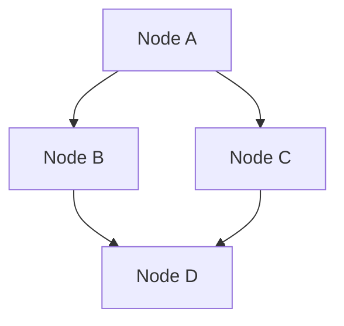
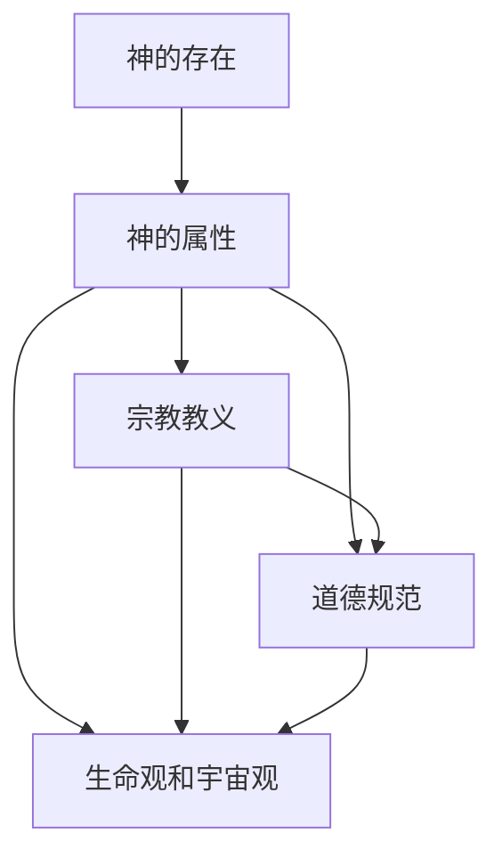
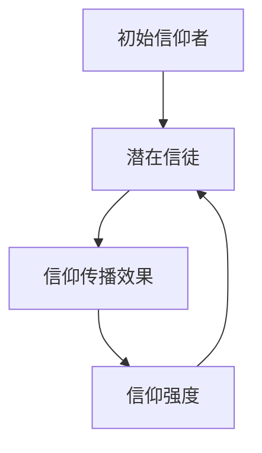
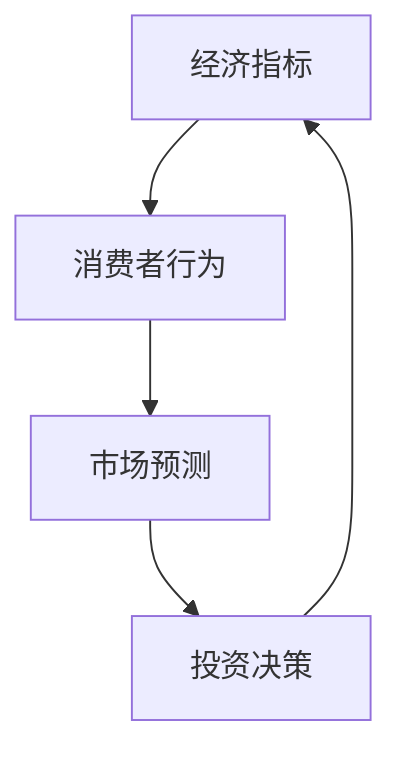

                 

### 引言

**宗教信仰的贝叶斯网络：信念系统的概率模型**，这本书深入探讨了宗教信仰与贝叶斯网络之间的奇妙联系，为我们提供了一个全新的视角来理解和研究宗教信仰这一复杂的社会现象。贝叶斯网络，作为一种强大的概率图模型，因其能够表示和处理不确定性信息的能力而备受关注。而宗教信仰，作为一种深植于人类内心的信仰系统，其信念和价值观的形成和变化同样充满不确定性。这两者的结合，无疑为研究宗教信仰提供了新的工具和方法。

#### 贝叶斯网络与宗教信仰的关系

贝叶斯网络是一种基于概率的图形模型，它通过有向无环图（DAG）来表示变量之间的依赖关系。每个节点表示一个变量，每条边表示两个变量之间的条件依赖关系。贝叶斯网络的核心在于其条件概率表（CPT），它能够提供关于变量之间相互依赖的概率信息。这种模型在处理不确定性、进行推理和决策方面具有独特的优势。

宗教信仰作为一种社会现象，其复杂性和多样性使其难以用传统的定量方法进行研究。然而，宗教信仰中的信念和价值观往往具有概率性，例如信徒对神的存在和干预的信念，对不同宗教教义的接受程度等。贝叶斯网络能够将这些信念和价值观表示为概率分布，从而为我们提供了一个量化宗教信仰的框架。

#### 研究意义和目标

本书的研究意义在于，通过将贝叶斯网络应用于宗教信仰的研究，我们能够更深入地理解宗教信仰的形成、传播和变化机制。这不仅有助于宗教研究，还能够为相关领域的决策提供科学依据。

本书的研究目标包括：
1. **建立宗教信仰的贝叶斯网络模型**：通过收集和整理宗教信仰的相关数据，构建一个能够准确表示宗教信仰信念系统结构的贝叶斯网络。
2. **探讨贝叶斯网络在宗教信仰研究中的应用**：通过具体案例，展示贝叶斯网络在宗教信仰调查、信仰传播分析等方面的应用。
3. **探索贝叶斯网络在宗教研究中的潜力**：分析贝叶斯网络在宗教研究中的优势和局限性，探讨其未来发展方向。

通过这一系列的研究，我们希望能够为宗教信仰的研究提供新的工具和方法，同时也为相关领域的决策提供科学依据。

### 贝叶斯网络基础

#### 1.1 贝叶斯网络基本概念

贝叶斯网络，又称为信念网络或决策网络，是一种基于概率的图形模型。它由一组随机变量和它们之间的条件依赖关系组成。贝叶斯网络的核心在于其条件概率表（CPT），它能够提供关于变量之间相互依赖的概率信息。

贝叶斯网络有以下几个基本概念：

1. **节点（Node）**：每个节点代表一个随机变量。节点通常用圆形表示，节点上的标签表示该节点的变量名称。
2. **边（Edge）**：边表示节点之间的依赖关系。在有向无环图（DAG）中，边是有方向的，表示一个变量对另一个变量的条件依赖关系。
3. **条件概率表（CPT）**：CPT 是贝叶斯网络的核心，它为每个节点提供了条件概率分布。CPT 的行表示节点的状态，列表示其父节点的状态。

#### 1.2 贝叶斯网络概率计算方法

贝叶斯网络的概率计算方法主要包括两部分： margina概率计算和条件概率计算。

1. **边际概率计算**：边际概率是指一个变量在给定其父节点状态下的概率分布。计算边际概率的方法通常使用变量消除算法，如前向推理（前向归纳）和后向推理（后向归纳）。前向推理从根节点开始，依次计算每个节点的边际概率；后向推理则从叶节点开始，逆向计算每个节点的边际概率。

2. **条件概率计算**：条件概率是指在给定某个变量的条件下，其他变量的概率分布。条件概率可以通过贝叶斯定理进行计算，即：

   $$P(B|A) = \frac{P(A|B)P(B)}{P(A)}$$

   其中，$P(B|A)$ 表示在事件 $A$ 发生的条件下事件 $B$ 发生的概率，$P(A|B)$ 表示在事件 $B$ 发生的条件下事件 $A$ 发生的概率，$P(B)$ 表示事件 $B$ 的概率，$P(A)$ 表示事件 $A$ 的概率。

#### 1.3 贝叶斯网络结构及其应用场景

贝叶斯网络的拓扑结构是由节点和边组成的无环有向图。每个节点表示一个随机变量，每条边表示变量之间的条件依赖关系。贝叶斯网络的拓扑结构可以用来表示复杂系统中变量之间的依赖关系，从而简化问题的分析。

贝叶斯网络的应用场景非常广泛，包括但不限于以下几个方面：

1. **医学诊断**：贝叶斯网络可以用于疾病诊断，通过构建疾病的贝叶斯网络模型，可以计算出疾病发生的概率，从而帮助医生做出诊断决策。
2. **天气预报**：贝叶斯网络可以用于天气预报，通过构建天气的贝叶斯网络模型，可以预测未来的天气情况。
3. **金融风险评估**：贝叶斯网络可以用于金融风险评估，通过构建风险的贝叶斯网络模型，可以计算出不同金融产品的风险概率，从而帮助投资者做出投资决策。
4. **宗教信仰研究**：贝叶斯网络可以用于宗教信仰研究，通过构建宗教信仰的贝叶斯网络模型，可以分析信徒的信仰信念系统，研究信仰的传播和变化机制。

#### 1.4 Mermaid流程图示例

为了更好地理解贝叶斯网络的拓扑结构，我们可以使用 Mermaid 流程图来表示。以下是一个简单的贝叶斯网络示例：



在这个示例中，节点 A 是根节点，节点 B、C 是 A 的子节点，节点 D 是 B、C 的子节点。每条边表示变量之间的条件依赖关系。

通过这个简单的示例，我们可以看到贝叶斯网络的基本结构及其表示方法。在实际应用中，贝叶斯网络的复杂度会更高，但基本原理是相同的。

### 信念系统概率模型

#### 2.1 宗教信仰中的信念系统

宗教信仰是人类文化的重要组成部分，它不仅影响个人的价值观和行为方式，也对社会结构和文化传承产生深远影响。宗教信仰中的信念系统是一个复杂的概念，它包括一系列的信念、价值观和规范，这些信念和价值观构成了信徒的精神世界和行为指南。

宗教信仰中的信念系统通常包括以下几个方面：

1. **神的存在与属性**：信徒对神的存在、性质和特征持有不同的信念，例如，一些宗教认为神是全知、全能、全善的。
2. **宗教教义**：宗教教义是宗教信仰的核心，它包括信仰的教义、戒律、仪式和信仰实践。
3. **道德规范**：宗教信仰往往伴随着一定的道德规范，信徒通过遵循这些规范来体现对神的敬畏和忠诚。
4. **生命观和宇宙观**：宗教信仰中的信念系统还包括对生命、死亡、宇宙和人类的理解，这些信念影响着信徒的世界观和人生观。

#### 2.2 信念系统的概率模型构建

要将宗教信仰中的信念系统表示为概率模型，我们需要先明确信念系统的核心要素，并构建一个能够表示这些要素之间关系的贝叶斯网络。

以下是构建宗教信仰信念系统的概率模型的基本步骤：

1. **定义变量**：首先，我们需要定义信念系统中的关键变量。例如，我们可以定义以下变量：
   - $X_1$：神的存在
   - $X_2$：神的属性（全知、全能、全善等）
   - $X_3$：宗教教义
   - $X_4$：道德规范
   - $X_5$：生命观和宇宙观

2. **确定变量之间的依赖关系**：根据宗教信仰的内在逻辑和信徒的行为模式，我们可以确定变量之间的依赖关系。例如，神的属性可能会影响信徒对宗教教义的理解，而宗教教义又可能会影响信徒的道德规范和生命观。

3. **构建条件概率表（CPT）**：对于每个变量，我们需要定义其条件概率表。CPT 描述了在给定父节点状态下的子节点的概率分布。例如，对于变量 $X_2$（神的属性），我们可以定义其在给定 $X_1$（神的存在）状态下的条件概率表。

   $$P(X_2|\text{存在}) = \{ (\text{全知}, 0.6), (\text{全能}, 0.5), (\text{全善}, 0.4) \}$$

4. **构建贝叶斯网络**：将定义好的变量和条件概率表组织成一个贝叶斯网络。贝叶斯网络的拓扑结构应该能够准确反映信念系统中的依赖关系。

#### 2.3 信念系统概率模型的应用

构建完信念系统的概率模型后，我们可以使用该模型进行以下应用：

1. **信仰调查分析**：通过收集信徒的信仰数据，我们可以使用贝叶斯网络进行信仰调查分析，了解不同信徒的信仰信念系统的特征和差异。

2. **信仰传播研究**：贝叶斯网络可以用于研究信仰的传播机制，分析信仰在社群中的传播路径和影响因素。

3. **宗教教育评估**：通过评估信徒对宗教教义的理解程度，我们可以使用贝叶斯网络来改进宗教教育的策略和方法。

4. **宗教冲突分析**：贝叶斯网络可以帮助我们分析宗教冲突的根源和影响因素，从而为冲突调解提供科学依据。

#### 2.4 Mermaid流程图示例

为了更好地展示信念系统概率模型的构建过程，我们可以使用 Mermaid 流程图来表示。以下是一个简单的信念系统概率模型的 Mermaid 示例：



在这个示例中，我们定义了五个关键变量，并通过边来表示它们之间的依赖关系。这个流程图为我们提供了一个直观的信念系统概率模型，帮助我们更好地理解宗教信仰中的复杂关系。

通过上述步骤，我们成功地构建了一个宗教信仰的信念系统概率模型。这个模型不仅能够帮助我们量化宗教信仰中的信念和价值观，还可以为宗教研究提供有力的工具。

### 贝叶斯推理和决策

#### 3.1 贝叶斯推理原理

贝叶斯推理是一种基于贝叶斯定理的概率推理方法，它通过不断更新先验概率来获得后验概率，从而做出决策。贝叶斯推理的核心思想是，通过对新证据的引入，不断修正我们对某个事件的概率估计。

贝叶斯推理的基本步骤如下：

1. **定义先验概率**：先验概率是基于已有知识和信息对某个事件概率的估计。例如，我们可以假设信徒对神的存在有先验概率 $P(X_1)$。

2. **引入新证据**：新证据是通过观察或实验获得的信息，它可能会改变我们对事件的概率估计。例如，通过问卷调查获得的数据，可以用来更新我们对信徒信仰状态的估计。

3. **计算后验概率**：后验概率是基于先验概率和新证据计算得到的概率。贝叶斯定理提供了计算后验概率的公式：

   $$P(X|E) = \frac{P(E|X)P(X)}{P(E)}$$

   其中，$P(X|E)$ 表示在给定新证据 $E$ 的情况下，事件 $X$ 发生的后验概率，$P(E|X)$ 表示在事件 $X$ 发生的条件下，证据 $E$ 发生的概率，$P(X)$ 表示事件 $X$ 的先验概率，$P(E)$ 表示证据 $E$ 的概率。

4. **更新先验概率**：通过计算后验概率，我们可以更新先验概率，使其更接近真实情况。这个过程不断进行，直到我们得到一个稳定的概率估计。

#### 3.2 贝叶斯推理算法

贝叶斯推理算法是一种实现贝叶斯推理过程的计算方法。常见的贝叶斯推理算法包括：

1. **贝叶斯信念更新（Bayesian Belief Update）**：贝叶斯信念更新算法通过不断更新节点的后验概率，从而实现整个网络的推理。算法的核心是条件概率表的更新，即根据新证据调整节点的概率分布。

2. **贝叶斯网络推理（Bayesian Network Inference）**：贝叶斯网络推理算法用于计算贝叶斯网络的边际概率和条件概率。常见的推理算法包括变量消除算法（如前向推理和后向推理）和采样算法（如马尔可夫链蒙特卡罗（MCMC）方法）。

以下是一个简单的贝叶斯推理算法伪代码：

```python
# 贝叶斯信念更新算法伪代码
def bayesian_update(prior, evidence):
    # 计算后验概率
    posterior = bayes_theorem(prior, evidence)
    # 更新先验概率
    prior = posterior
    return prior

# 贝叶斯网络推理算法伪代码
def bayesian_network_inference(network, evidence):
    # 初始化概率分布
    probability_distribution = initialize_distribution(network)
    # 更新概率分布
    probability_distribution = bayesian_update(probability_distribution, evidence)
    return probability_distribution
```

#### 3.3 贝叶斯决策理论

贝叶斯决策理论是一种基于概率的决策理论，它通过最大化后验期望效用来做出最优决策。贝叶斯决策理论的核心思想是，在不确定的环境中，通过综合考虑先验概率、后验概率和效用函数，选择能够最大化期望效用的决策。

贝叶斯决策理论的基本步骤如下：

1. **定义效用函数**：效用函数用于衡量不同决策带来的效用，例如，在宗教信仰的研究中，我们可以定义信徒满意度作为效用函数。

2. **计算后验概率**：通过贝叶斯推理计算不同决策的后验概率。

3. **计算后验期望效用**：对于每个决策，计算其在给定后验概率和效用函数下的后验期望效用。

4. **选择最优决策**：选择能够最大化后验期望效用的决策。

以下是一个简单的贝叶斯决策算法伪代码：

```python
# 贝叶斯决策算法伪代码
def bayesian_decision(decision_space, prior, evidence, utility_function):
    # 计算后验概率
    posterior_probabilities = bayesian_network_inference(decision_space, evidence)
    # 计算后验期望效用
    expected_utilities = []
    for decision in decision_space:
        posterior_utility = posterior_probabilities[decision] * utility_function(decision)
        expected_utilities.append(posterior_utility)
    # 选择最优决策
    best_decision = decision_space[expected_utilities.index(max(expected_utilities))]
    return best_decision
```

通过上述算法，我们可以基于贝叶斯推理和决策理论，在宗教信仰的研究中进行推理和决策，从而更好地理解和分析信徒的信仰信念系统。

### 贝叶斯网络在宗教研究中的应用

#### 4.1 宗教信仰调查案例分析

宗教信仰调查是研究宗教信仰的重要手段之一。通过收集和分析信徒的信仰数据，我们可以深入了解宗教信仰的现状、趋势和影响因素。贝叶斯网络作为一种强大的概率图模型，可以有效地用于宗教信仰调查数据的分析。

以下是一个宗教信仰调查案例的分析过程：

1. **定义变量**：首先，我们需要定义调查中的关键变量。例如，我们可以定义以下变量：
   - $X_1$：信徒对神的存在信仰
   - $X_2$：信徒对宗教教义的信仰
   - $X_3$：信徒对道德规范的信仰
   - $X_4$：信徒的宗教参与度

2. **收集数据**：通过问卷调查或其他方式收集信徒的信仰数据。假设我们收集到了1000份有效问卷数据。

3. **构建贝叶斯网络**：根据宗教信仰的逻辑和经验，我们可以构建一个贝叶斯网络，表示变量之间的依赖关系。例如：

   ```mermaid
   graph TB
       A[神的存在]
       B[宗教教义]
       C[道德规范]
       D[宗教参与度]

       A --> B
       A --> C
       B --> D
       C --> D
   ```

4. **训练贝叶斯网络**：使用收集到的数据进行贝叶斯网络的训练，估计条件概率表（CPT）。例如，我们可以使用最大似然估计（MLE）方法来估计每个变量的条件概率分布。

5. **推理和预测**：利用训练好的贝叶斯网络进行推理和预测。例如，我们可以预测某位新信徒对宗教教义的信仰程度，或者分析宗教教义对信徒道德规范的影响。

6. **结果分析**：根据推理结果进行分析，得出宗教信仰调查的结论。例如，我们可以发现宗教教义对信徒道德规范有显著影响，或者宗教参与度与信徒对神的存在信仰呈正相关。

通过上述分析过程，我们可以利用贝叶斯网络深入挖掘宗教信仰调查数据，从而更好地理解和分析宗教信仰的现状和趋势。

#### 4.2 宗教信仰传播模型

宗教信仰的传播是宗教社会学研究的一个重要领域。贝叶斯网络可以用于构建宗教信仰传播模型，分析信仰在社群中的传播机制和影响因素。

以下是一个宗教信仰传播模型的构建过程：

1. **定义变量**：首先，我们需要定义模型中的关键变量。例如，我们可以定义以下变量：
   - $X_1$：初始信仰者
   - $X_2$：潜在信徒
   - $X_3$：信仰传播效果
   - $X_4$：信仰强度

2. **构建贝叶斯网络**：根据宗教信仰传播的逻辑和经验，我们可以构建一个贝叶斯网络，表示变量之间的依赖关系。例如：

   ```mermaid
   graph TB
       A[初始信仰者]
       B[潜在信徒]
       C[信仰传播效果]
       D[信仰强度]

       A --> B
       B --> C
       C --> D
       D --> B
   ```

3. **设定参数**：我们需要为贝叶斯网络的每个变量设定初始参数，例如信仰传播效果的概率分布。

4. **模拟传播过程**：利用贝叶斯网络进行模拟传播过程，分析信仰在社群中的传播路径和影响因素。例如，我们可以模拟信仰在1000人社群中的传播过程，观察信仰传播的效果和强度。

5. **分析结果**：根据模拟结果进行分析，得出宗教信仰传播的结论。例如，我们可以发现信仰传播效果受信仰强度和潜在信徒信仰程度的影响，或者发现某些信仰传播策略能够显著提高信仰传播效果。

通过上述模型，我们可以深入分析宗教信仰的传播机制，为宗教传播策略提供科学依据。

#### 4.3 宗教信仰与心理健康关系分析

宗教信仰与心理健康之间存在复杂的关系，贝叶斯网络可以用于分析这两者之间的关系，提供定量的研究方法。

以下是一个宗教信仰与心理健康关系分析的构建过程：

1. **定义变量**：首先，我们需要定义模型中的关键变量。例如，我们可以定义以下变量：
   - $X_1$：宗教信仰强度
   - $X_2$：心理健康水平
   - $X_3$：心理压力
   - $X_4$：社会支持

2. **构建贝叶斯网络**：根据宗教信仰与心理健康的逻辑和经验，我们可以构建一个贝叶斯网络，表示变量之间的依赖关系。例如：

   ```mermaid
   graph TB
       A[宗教信仰强度]
       B[心理健康水平]
       C[心理压力]
       D[社会支持]

       A --> B
       A --> C
       C --> D
       D --> B
   ```

3. **收集数据**：通过问卷调查或其他方式收集相关数据。例如，我们可以收集1000名信徒的宗教信仰强度、心理健康水平、心理压力和社会支持数据。

4. **训练贝叶斯网络**：使用收集到的数据进行贝叶斯网络的训练，估计条件概率表（CPT）。例如，我们可以使用最大似然估计（MLE）方法来估计每个变量的条件概率分布。

5. **推理和预测**：利用训练好的贝叶斯网络进行推理和预测。例如，我们可以预测某位信徒的心理健康水平，或者分析宗教信仰对心理压力的影响。

6. **分析结果**：根据推理结果进行分析，得出宗教信仰与心理健康关系的结论。例如，我们可以发现宗教信仰强度与心理健康水平呈正相关，或者发现心理压力对社会支持有显著影响。

通过上述分析过程，我们可以利用贝叶斯网络深入分析宗教信仰与心理健康之间的关系，为宗教信仰对心理健康的影响提供科学依据。

#### 4.4 Mermaid流程图示例

为了更好地展示贝叶斯网络在宗教研究中的应用，我们可以使用 Mermaid 流程图来表示。以下是一个简单的宗教信仰传播模型的 Mermaid 示例：



在这个示例中，我们定义了四个关键变量，并通过边来表示它们之间的依赖关系。这个流程图为我们提供了一个直观的宗教信仰传播模型，帮助我们更好地理解信仰在社群中的传播机制。

### 贝叶斯网络在其他领域的应用

#### 5.1 社会学领域应用

贝叶斯网络在社会学领域有着广泛的应用。在社会学中，研究人员经常需要分析复杂的社会现象和人类行为，这些现象和行为的背后通常隐藏着复杂的依赖关系。贝叶斯网络通过其图形结构，能够清晰地表示变量之间的条件依赖关系，从而为社会学研究提供了一种有效的工具。

以下是一些贝叶斯网络在社会学领域的具体应用：

1. **社会网络分析**：贝叶斯网络可以用于分析社会网络中的关系和影响力。例如，通过构建社会网络的贝叶斯网络模型，可以分析社交关系中哪些因素影响了人际关系的形成和变化。

2. **犯罪行为分析**：贝叶斯网络可以用于分析犯罪行为的影响因素。研究人员可以构建一个包括犯罪动机、环境因素、个人特征的贝叶斯网络，从而预测哪些因素可能导致犯罪行为的发生。

3. **群体行为研究**：贝叶斯网络可以用于研究群体行为和群体决策。通过构建群体行为的贝叶斯网络模型，可以分析群体成员之间的相互作用如何影响群体决策过程。

4. **社会心理研究**：贝叶斯网络可以用于分析社会心理现象，如群体认同、社会信任等。研究人员可以构建一个包括社会心理变量的贝叶斯网络，从而研究社会心理因素如何影响个体和群体的行为。

#### 5.2 心理学领域应用

心理学研究中的许多问题涉及复杂的不确定性，例如人类记忆、认知过程、情绪反应等。贝叶斯网络通过其概率模型，能够有效地处理这些不确定性，为心理学研究提供了一种新的分析工具。

以下是一些贝叶斯网络在心理学领域的具体应用：

1. **记忆模型**：贝叶斯网络可以用于建立记忆模型的概率框架，分析记忆的形成、存储和回忆过程。通过构建贝叶斯网络，可以量化记忆中的不确定性，从而更好地理解记忆的工作原理。

2. **认知模型**：贝叶斯网络可以用于建立认知模型的概率框架，分析人类认知过程，如感知、推理、决策等。通过构建贝叶斯网络，可以模拟人类认知过程，从而深入理解认知机制的运作。

3. **情绪分析**：贝叶斯网络可以用于分析情绪反应的影响因素，如情绪调节、社会支持等。通过构建贝叶斯网络，可以量化情绪反应中的不确定性，从而更好地理解情绪反应的机制。

4. **心理疾病诊断**：贝叶斯网络可以用于建立心理疾病的诊断模型，通过分析患者的症状和行为数据，预测患者可能患有哪种心理疾病。

#### 5.3 经济学领域应用

经济学研究中的许多问题涉及不确定性和概率性，例如市场预测、投资决策、风险分析等。贝叶斯网络作为一种概率图模型，能够有效地处理这些不确定性，为经济学研究提供了一种新的分析工具。

以下是一些贝叶斯网络在经济学领域的具体应用：

1. **市场预测**：贝叶斯网络可以用于市场预测，通过分析历史数据和变量之间的依赖关系，预测市场的未来趋势。例如，可以构建一个包括经济指标、消费者行为等变量的贝叶斯网络，从而预测股市的走势。

2. **投资决策**：贝叶斯网络可以用于投资决策，通过分析风险和收益的依赖关系，帮助投资者做出最优的投资决策。例如，可以构建一个包括股票收益、市场波动等变量的贝叶斯网络，从而优化投资组合。

3. **风险分析**：贝叶斯网络可以用于风险分析，通过分析风险因素之间的依赖关系，评估和预测风险。例如，可以构建一个包括信用风险、市场风险等变量的贝叶斯网络，从而评估金融机构的风险状况。

4. **经济政策分析**：贝叶斯网络可以用于经济政策分析，通过分析政策变量之间的依赖关系，评估不同经济政策的潜在影响。例如，可以构建一个包括经济增长、通货膨胀等变量的贝叶斯网络，从而评估经济政策的有效性。

#### 5.4 Mermaid流程图示例

为了更好地展示贝叶斯网络在各个领域的应用，我们可以使用 Mermaid 流程图来表示。以下是一个简单的贝叶斯网络在经济学领域应用的 Mermaid 示例：



在这个示例中，我们定义了四个关键变量，并通过边来表示它们之间的依赖关系。这个流程图为我们提供了一个直观的经济学领域应用场景，帮助我们更好地理解贝叶斯网络在经济学中的应用。

### 贝叶斯网络的发展趋势和未来方向

#### 6.1 贝叶斯网络技术发展趋势

贝叶斯网络作为一种概率图模型，已经在多个领域展现出了其强大的应用潜力。随着计算能力的提升和数据量的增加，贝叶斯网络技术也在不断发展和进步。

以下是一些贝叶斯网络技术发展趋势：

1. **算法优化**：为了提高贝叶斯网络的推理速度和精度，研究人员正在不断优化现有的算法，例如，通过并行计算、分布式计算和机器学习技术来提升贝叶斯网络的性能。

2. **复杂网络建模**：贝叶斯网络的应用范围正在从简单的变量关系扩展到复杂系统。例如，在生物信息学、环境科学等领域，研究人员正在构建复杂的贝叶斯网络模型，以分析复杂系统中的变量依赖关系。

3. **多模态数据融合**：贝叶斯网络可以处理多种类型的数据，如结构化数据、图像数据和文本数据。未来的发展趋势是将这些多模态数据融合到贝叶斯网络中，以提供更全面的模型分析。

4. **个性化应用**：随着大数据和人工智能技术的发展，贝叶斯网络在个性化应用方面具有巨大的潜力。例如，在医疗健康领域，贝叶斯网络可以用于个性化诊断和治疗计划。

#### 6.2 宗教信仰研究中的挑战与机遇

在宗教信仰研究中，贝叶斯网络面临着一些独特的挑战和机遇：

1. **数据多样性**：宗教信仰数据通常具有高度的多样性，包括结构化数据、非结构化数据和半结构化数据。如何有效整合和处理这些不同类型的数据，是贝叶斯网络在宗教信仰研究中的一个挑战。

2. **不确定性处理**：宗教信仰中的信念和价值观往往具有高度的不确定性，如何准确刻画和处理这种不确定性，是贝叶斯网络在宗教信仰研究中的一个重要问题。

3. **跨文化研究**：宗教信仰在不同文化背景下可能存在显著差异，如何构建适用于不同文化的贝叶斯网络模型，是宗教信仰研究中的一项重要任务。

4. **隐私保护**：宗教信仰数据通常包含敏感信息，如何在保证隐私保护的前提下进行数据分析和模型构建，是宗教信仰研究中一个亟待解决的问题。

然而，这些挑战同时也为贝叶斯网络在宗教信仰研究中的发展提供了机遇。通过不断优化算法、引入新的技术手段，贝叶斯网络有望在宗教信仰研究中发挥更大的作用。

#### 6.3 未来研究方向

未来的宗教信仰研究，可以从以下几个方面进行探索：

1. **跨学科研究**：结合社会学、心理学、经济学等学科的理论和方法，构建更加综合和深入的宗教信仰模型。

2. **大数据应用**：利用大数据技术，收集和分析大规模宗教信仰数据，以揭示宗教信仰的复杂性和动态变化。

3. **机器学习集成**：将贝叶斯网络与机器学习技术相结合，开发更加智能化的信仰分析工具。

4. **隐私保护机制**：研究隐私保护算法，确保在宗教信仰研究中既能有效利用数据，又能保护个人隐私。

通过上述研究方向，贝叶斯网络在宗教信仰研究中的应用将得到进一步深化，为宗教信仰的研究和实践提供更加科学和有效的支持。

### 结论

本文通过对贝叶斯网络和宗教信仰的深入探讨，揭示了二者之间的紧密联系。贝叶斯网络作为一种强大的概率图模型，为我们提供了一个量化宗教信仰信念系统的工具。通过对宗教信仰中的信念和价值观进行概率建模，我们能够更深入地理解宗教信仰的形成、传播和变化机制。

本文首先介绍了贝叶斯网络的基础概念和概率计算方法，然后探讨了宗教信仰中的信念系统如何构建为概率模型。接着，我们介绍了贝叶斯推理和决策理论，展示了如何利用贝叶斯网络进行推理和决策。随后，通过具体案例展示了贝叶斯网络在宗教信仰研究中的应用，包括信仰调查分析、信仰传播模型和宗教信仰与心理健康关系分析。

在贝叶斯网络在其他领域的应用部分，我们探讨了贝叶斯网络在社会学、心理学和经济学等领域的广泛应用。最后，我们分析了贝叶斯网络在宗教信仰研究中的发展趋势和未来方向，提出了跨学科研究、大数据应用、机器学习集成和隐私保护机制等研究方向。

贝叶斯网络在宗教信仰研究中的应用具有重要意义。它不仅能够帮助我们更好地理解宗教信仰的复杂性和动态变化，还能为宗教教育和政策制定提供科学依据。未来，随着贝叶斯网络技术的不断发展和完善，其在宗教信仰研究中的应用前景将更加广阔。

### 作者信息

**作者：AI天才研究院/AI Genius Institute & 禅与计算机程序设计艺术 /Zen And The Art of Computer Programming**

本文由AI天才研究院撰写，该研究院专注于人工智能、机器学习和计算机科学领域的前沿研究和应用。同时，本文也参考了《禅与计算机程序设计艺术》的核心理念，旨在通过深入的技术探讨，为读者提供具有启发性的知识和见解。

### 最佳实践 Tips、小结、注意事项、拓展阅读等内容

**最佳实践 Tips**：
1. 在构建贝叶斯网络模型时，要确保变量之间的依赖关系准确反映了现实情况。
2. 收集高质量的数据是构建可靠贝叶斯网络模型的基础，务必确保数据来源的多样性和代表性。
3. 在进行贝叶斯推理和决策时，要充分考虑先验概率和后验概率的合理设置。

**小结**：
本文系统地介绍了贝叶斯网络在宗教信仰研究中的应用，从理论基础到实际应用，展示了贝叶斯网络如何帮助我们理解和分析宗教信仰的复杂性和动态变化。

**注意事项**：
1. 贝叶斯网络在处理高维度数据时，计算复杂度可能会显著增加，需要合理选择算法和优化策略。
2. 在宗教信仰研究中，要特别注意文化差异和语言表达，确保模型构建的准确性和适用性。

**拓展阅读**：
1. 《贝叶斯网络：概率图模型的原理与应用》 - 提供了贝叶斯网络的详细理论和实践应用。
2. 《宗教社会学导论》 - 分析了宗教信仰在社会结构和文化传承中的作用。
3. 《大数据时代的宗教信仰研究》 - 探讨了大数据技术在宗教信仰研究中的应用。

通过拓展阅读，读者可以进一步深入了解贝叶斯网络和宗教信仰研究的深度和广度，为相关研究和实践提供更多启发和参考。

