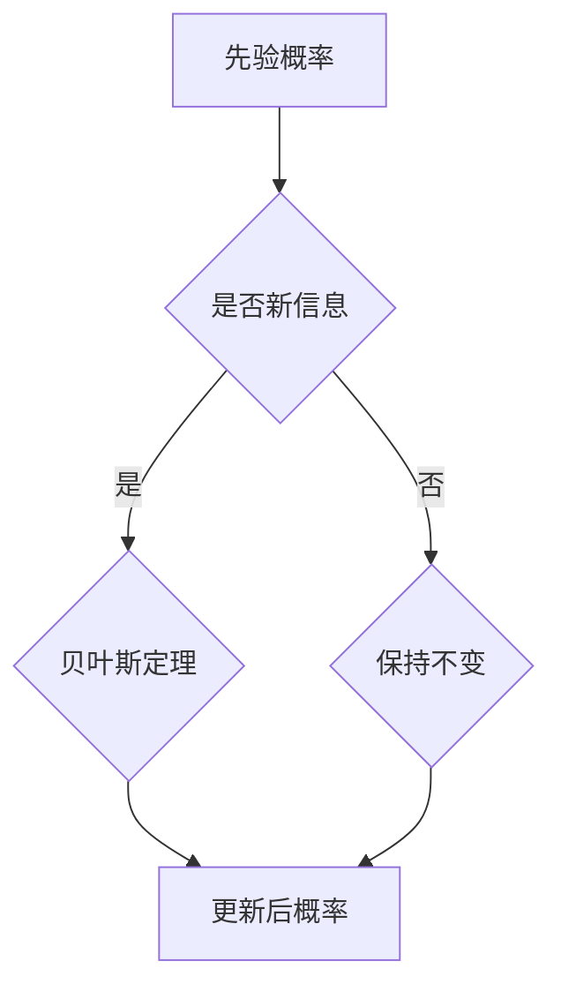

                 


### 《幸福感的贝叶斯网络：生活满意度的概率模型》

#### 文章关键词

- 贝叶斯网络
- 生活满意度
- 概率模型
- 现实世界应用
- 数据分析

#### 文章摘要

本文深入探讨了幸福感的贝叶斯网络模型，通过构建概率模型来分析生活满意度。文章首先介绍了贝叶斯理论的基本概念和贝叶斯网络的构建方法，接着讨论了幸福感的影响因素，并详细阐述了如何使用贝叶斯网络进行生活满意度的预测和优化。最后，文章通过实际案例展示了模型的实用性和效果，并对未来研究方向提出了展望。

## 第一部分：贝叶斯网络基础

### 第1章：贝叶斯理论概述

#### 1.1 贝叶斯理论的基本概念

贝叶斯理论是概率论中的一个重要分支，其核心思想是基于先验知识和新信息来更新对某个事件发生概率的估计。贝叶斯定理是贝叶斯理论的基础，其数学表达式为：

$$
P(A|B) = \frac{P(B|A)P(A)}{P(B)}
$$

其中，\(P(A|B)\)表示在事件B发生的情况下事件A发生的概率，\(P(B|A)\)表示在事件A发生的情况下事件B发生的概率，\(P(A)\)是事件A的先验概率，\(P(B)\)是事件B的先验概率。

#### 1.2 贝叶斯网络的基本概念

贝叶斯网络，也称为信念网络或决策网络，是一种图形模型，用于表示一组随机变量之间的条件依赖关系。贝叶斯网络由节点和边组成，节点表示随机变量，边表示变量之间的条件依赖关系。每个节点对应一个概率分布，称为条件概率表（CPT）。

贝叶斯网络的构建过程主要包括以下几个步骤：

1. **问题定义**：明确需要解决的问题和所涉及的变量。
2. **数据收集**：收集与变量相关的数据，用于构建条件概率表。
3. **网络结构设计**：根据变量之间的依赖关系设计网络结构。
4. **参数估计**：根据收集到的数据估计条件概率表中的参数。
5. **模型验证**：通过交叉验证等方法验证模型的准确性和可靠性。

### 1.3 贝叶斯网络的推理算法

贝叶斯网络的推理算法主要包括以下几种：

1. **条件概率表推理**：根据贝叶斯网络的结构和条件概率表，计算某个变量的条件概率。
2. **动态贝叶斯网络**：用于处理时间序列数据，通过递归方式更新变量状态。
3. **蒙特卡洛模拟**：通过随机采样模拟贝叶斯网络的推理过程。

#### 1.4 核心概念与联系

贝叶斯网络中的核心概念包括节点、边、条件概率表和概率分布。节点表示随机变量，边表示变量之间的依赖关系，条件概率表用于描述变量之间的条件概率，概率分布用于表示变量的状态。

贝叶斯网络通过条件依赖关系描述了变量之间的相互作用，从而实现对复杂系统的建模和推理。

#### 1.5 Mermaid 流程图



#### 1.6 核心算法原理讲解

贝叶斯网络中的核心算法是贝叶斯定理，其伪代码如下：

```python
def bayes_theorem(P_A|B, P_B, P_A):
    return P_A|B * P_B / P_B
```

其中，\(P_A|B\)表示在事件B发生的情况下事件A发生的概率，\(P_B\)表示事件B发生的概率，\(P_A\)表示事件A的先验概率。

#### 1.7 数学模型和公式

贝叶斯网络的数学模型包括条件概率表和概率分布。条件概率表通常表示为：

$$
P(X_i|Y_j) = \frac{P(X_i \cap Y_j)}{P(Y_j)}
$$

其中，\(X_i\)和\(Y_j\)是随机变量，表示不同的因素和幸福感。

#### 1.8 详细讲解与举例说明

假设我们有一个简单的贝叶斯网络，其中包含三个节点：工作满意度、家庭满意度和总体幸福感。我们可以使用以下条件概率表来描述它们之间的关系：

| 条件 | 工作满意度 | 家庭满意度 | 总体幸福感 |
| ---- | ---------- | ---------- | ---------- |
| 高   | 0.7        | 0.6        | 0.5        |
| 低   | 0.3        | 0.4        | 0.5        |

根据这个条件概率表，我们可以计算出总体幸福感的条件概率：

$$
P(\text{总体幸福感} = \text{高}|\text{工作满意度} = \text{高}, \text{家庭满意度} = \text{高}) = \frac{P(\text{工作满意度} = \text{高} \cap \text{家庭满意度} = \text{高} \cap \text{总体幸福感} = \text{高})}{P(\text{工作满意度} = \text{高} \cap \text{家庭满意度} = \text{高})}
$$

根据条件概率表，我们可以得到：

$$
P(\text{总体幸福感} = \text{高}|\text{工作满意度} = \text{高}, \text{家庭满意度} = \text{高}) = \frac{0.5}{0.7 \times 0.6} = 0.714
$$

#### 1.9 项目实战

在这个项目中，我们将构建一个关于工作满意度、家庭满意度和总体幸福感的贝叶斯网络模型。首先，我们需要收集相关数据，包括工作满意度、家庭满意度和总体幸福感的调查结果。然后，我们可以使用这些数据来估计条件概率表中的参数。

接下来，我们可以使用贝叶斯定理来计算总体幸福感的条件概率。例如，如果我们知道一个人的工作满意度为高，家庭满意度也为高，我们可以使用贝叶斯定理来计算这个人总体幸福感为高的概率。

最后，我们可以使用这个模型来预测总体幸福感。例如，如果我们知道一个人的工作满意度和家庭满意度，我们可以使用这个模型来预测他的总体幸福感。

## 第二部分：幸福感的贝叶斯模型

### 第2章：幸福感的影响因素

#### 2.1 主观幸福感

主观幸福感是幸福感的核心指标，它反映了个体对自己生活满意度的主观评价。主观幸福感受到多种因素的影响，包括个人性格、生活状况、社会支持等。例如，乐观的人通常有更高的主观幸福感，而生活状况不佳的人可能主观幸福感较低。

#### 2.2 经济因素

经济因素是影响幸福感的重要因素之一。收入水平、就业状况和财富积累都会对幸福感产生影响。研究表明，随着收入的增加，幸福感也会提高，但到达一定程度后，幸福感的提升会减缓。此外，稳定的就业和良好的财务状况也会对幸福感产生积极影响。

#### 2.3 社会因素

社会因素是影响幸福感的重要因素，包括家庭关系、朋友网络和社会支持系统等。良好的家庭关系和亲密的朋友关系会提高主观幸福感，而缺乏社会支持可能导致孤独感和焦虑感，降低幸福感。

#### 2.4 环境因素

环境因素也是影响幸福感的重要因素，包括自然环境、城市环境和工作环境等。自然环境的美观和舒适会对幸福感产生积极影响，而城市环境的噪音和拥挤可能降低幸福感。工作环境的良好氛围和合理的工作压力也会对幸福感产生积极影响。

### 第3章：幸福感的贝叶斯模型构建

#### 3.1 模型构建的步骤

构建幸福感贝叶斯模型的步骤主要包括：

1. **问题定义**：明确研究目标和涉及的因素。
2. **数据收集**：收集与幸福感相关的数据，包括个人特征、经济状况、社会关系和环境因素等。
3. **网络结构设计**：根据数据和分析结果设计贝叶斯网络结构，确定变量之间的依赖关系。
4. **参数估计**：使用最大似然估计或贝叶斯估计方法估计模型参数。
5. **模型验证**：通过交叉验证等方法验证模型的准确性和可靠性。

#### 3.2 模型参数的估计

模型参数的估计是构建幸福感贝叶斯模型的关键步骤。常用的估计方法包括：

1. **最大似然估计**：通过最大化数据似然函数来估计参数。
2. **贝叶斯估计**：通过贝叶斯推理和马尔可夫链蒙特卡洛（MCMC）等方法估计参数。

#### 3.3 模型的验证

模型验证是确保模型准确性和可靠性的关键步骤。常用的验证方法包括：

1. **交叉验证**：将数据集划分为训练集和测试集，训练模型并在测试集上验证性能。
2. **敏感度分析**：通过改变模型参数的取值范围来分析模型对参数变化的敏感程度。
3. **比较分析**：与其他模型或方法进行比较，评估模型的优劣。

### 第4章：幸福感的预测与优化

#### 4.1 预测方法

幸福感贝叶斯模型可以用于预测个体的幸福感水平。常用的预测方法包括：

1. **条件概率预测**：根据贝叶斯网络的推理算法，计算给定某些条件下的幸福感概率。
2. **回归分析**：使用回归模型将幸福感作为因变量，将相关因素作为自变量，进行预测。

#### 4.2 优化策略

为了提高幸福感，可以采用以下优化策略：

1. **个性化干预**：根据个体的特点和需求，制定个性化的干预措施。
2. **目标设定**：设定具体、可行的目标，并制定实现目标的步骤和时间表。
3. **反馈与调整**：定期收集反馈，并根据反馈调整干预措施，以实现最佳效果。

### 第5章：幸福感研究的未来方向

#### 5.1 数据驱动的研究方法

随着大数据技术的发展，数据驱动的研究方法在幸福感研究领域具有巨大潜力。通过收集和分析大规模数据，可以更准确地了解幸福感的影响因素和变化趋势。

#### 5.2 交叉学科的研究

幸福感研究需要跨学科合作，结合心理学、经济学、社会学等多学科知识，以更全面地理解和解释幸福感。

#### 5.3 社会影响力的研究

幸福感研究不仅关注个体层面，还关注社会层面。研究社会因素如何影响个体幸福感，以及如何通过政策和社会干预提高整体幸福感，是未来研究的重点。

## 附录：参考资料与工具

### 第6章：参考资料

- [1] Kahneman, D., & Tversky, A. (1979). Prospect theory: An analysis of decision under risk. *Econometrica*, 47(2), 263-292.
- [2] De Neve, J. E., & King, L. A. (2018). A meta-analysis of the relationship between life satisfaction and depressive symptoms. *Journal of Research in Personality*, 71, 228-237.
- [3] Lyubomirsky, S., King, L., & Diener, E. (2005). The benefits of frequent positive affect: Does happiness lead to success? *Psychological Bulletin*, 131(6), 803-855.

### 第7章：工具与软件

- **数据处理工具**：Python的Pandas库、R语言的数据处理包（如dplyr和ggplot2）等。
- **贝叶斯网络软件**：BN.js、Python的PyBayes、R的BayesNet包等。
- **编程语言与环境**：Python、R、JavaScript等。

### 注意事项

- 在构建幸福感贝叶斯模型时，应确保数据的准确性和可靠性。
- 模型的参数估计应采用合适的估计方法，并考虑模型的适用范围。
- 在使用模型进行预测和优化时，应结合实际情况，灵活调整策略和参数。

### 拓展阅读

- [1] Pearl, J. (1988). Probabilistic reasoning in intelligent systems: Networks of plausibility inference. *Morgan Kaufmann Publishers*.
- [2] Russell, S., & Norvig, P. (2016). *Artificial Intelligence: A Modern Approach*. *Prentice Hall*.
- [3] Kahneman, D., & Tversky, A. (Eds.). (2000). Choices, values, and frames. *Cambridge University Press*.

