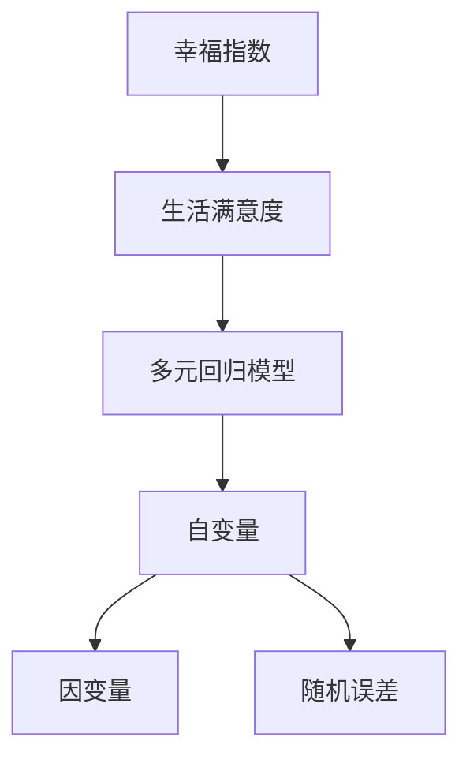
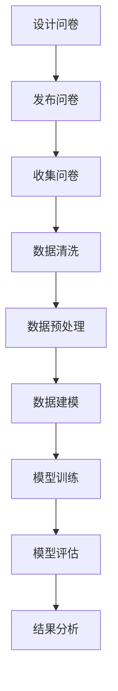

                 

### 幸福指数的多元回归：生活满意度的数学建模

关键词：幸福指数、多元回归、生活满意度、数学建模、心理学、社会研究

摘要：本文探讨了幸福指数和生活满意度之间的关系，通过多元回归模型对影响生活满意度的各种因素进行了数学建模和分析。文章首先介绍了幸福指数的定义和衡量方法，接着阐述了多元回归模型的基本原理和应用，最后通过具体案例展示了如何使用多元回归模型对生活满意度进行科学评估。

## 第一部分：研究背景与核心概念

### 1.1 研究背景与意义

幸福指数（Happiness Index）是一个衡量社会整体幸福感的重要指标，它不仅反映了人们的主观幸福感，还与个体的心理健康、生活质量以及社会稳定密切相关。随着全球经济的发展，人们对幸福感的关注程度越来越高，如何科学地评估和提升幸福指数成为了一个重要的研究课题。

生活满意度（Life Satisfaction）是幸福指数的一个重要组成部分，它通常被定义为个体对其生活各个方面的总体评价。生活满意度不仅受到个人心理因素的影响，还受到社会经济、文化环境等多种因素的共同作用。因此，研究生活满意度的形成机制和影响因素具有重要的理论和实践意义。

多元回归模型（Multiple Regression Model）是一种常用的统计方法，用于分析多个自变量对一个因变量的影响。在心理学和社会研究领域，多元回归模型被广泛应用于研究个体行为、心理状态与各种社会因素之间的关系。本文将借助多元回归模型，对影响生活满意度的各种因素进行深入分析，以期为提升人们的幸福感提供科学依据。

### 1.2 幸福指数的概念与衡量标准

幸福指数是一个综合性指标，用于衡量一个国家或地区居民的整体幸福感。它通常由多个维度组成，包括经济状况、社会关系、心理健康、生活环境等。幸福指数的衡量标准因国家和地区而异，但总体上可以分为以下几类：

1. **主观幸福感指标**：这类指标主要通过问卷调查的方式收集，如自我报告的幸福感、生活满意度、生活幸福指数等。常见的问卷有盖洛普世界幸福报告（Gallup World Poll）和世界价值观调查（World Values Survey）。

2. **经济状况指标**：这类指标包括国内生产总值（GDP）、人均收入、贫困率等。经济状况是影响幸福感的一个重要因素，但并不是唯一的决定因素。

3. **社会关系指标**：这类指标包括家庭关系、社会支持、社交网络等。良好的社会关系有助于提高个体的幸福感和生活满意度。

4. **心理健康指标**：这类指标包括心理健康状况、心理疾病发生率等。心理健康对幸福感有显著影响，是幸福指数的重要组成部分。

5. **生活环境指标**：这类指标包括环境污染、居住条件、医疗保健等。一个健康、宜居的生活环境对幸福感有积极影响。

### 1.3 多元回归模型的基本原理

多元回归模型是一种用于分析多个自变量对一个因变量影响的统计方法。在本文中，我们主要关注多元线性回归模型，其基本原理如下：

1. **模型定义**：设因变量为 $Y$，自变量为 $X_1, X_2, ..., X_p$，多元线性回归模型可以表示为：

   $$
   Y = \beta_0 + \beta_1X_1 + \beta_2X_2 + ... + \beta_pX_p + \epsilon
   $$

   其中，$\beta_0$ 为常数项，$\beta_1, \beta_2, ..., \beta_p$ 为自变量的系数，$\epsilon$ 为随机误差项。

2. **模型假设**：
   - 线性假设：自变量与因变量之间存在线性关系。
   - 独立性假设：各个自变量之间相互独立。
   - 同方差性假设：所有自变量的方差相等。

3. **模型求解**：多元线性回归模型的求解通常采用最小二乘法（Ordinary Least Squares，OLS），其目标是最小化残差平方和：

   $$
   \min \sum_{i=1}^n (Y_i - \hat{Y}_i)^2
   $$

   其中，$Y_i$ 为实际观测值，$\hat{Y}_i$ 为预测值。

4. **模型评估**：多元线性回归模型的评估主要通过拟合优度（Goodness of Fit）指标进行，如决定系数 $R^2$ 和均方误差（Mean Squared Error，MSE）等。

### 1.4 核心概念与联系

为了更好地理解幸福指数、生活满意度和多元回归模型之间的关系，我们可以通过一个 Mermaid 流程图来展示这些核心概念之间的联系：



在这个流程图中，幸福指数作为总体幸福感的一个指标，与生活满意度密切相关。生活满意度又可以看作是多元回归模型中的因变量，而影响生活满意度的各种因素（自变量）包括经济状况、社会关系、心理健康等。通过多元回归模型，我们可以将这些自变量与生活满意度之间的复杂关系量化，从而更好地理解幸福指数的形成机制。

### 1.5 本节总结

在本节中，我们首先介绍了幸福指数和生活满意度的概念，以及多元回归模型的基本原理。接着，通过一个 Mermaid 流程图展示了这些核心概念之间的联系。这些内容为本节的进一步讨论奠定了基础。

### 第二部分：多元回归模型的核心算法原理讲解

#### 2.1 多元线性回归模型

多元线性回归模型是多元回归模型中最基本的形式，它用于分析多个自变量对一个因变量的线性影响。在多元线性回归模型中，因变量与自变量之间的关系可以用一个线性方程表示。

##### 2.1.1 模型定义

多元线性回归模型的一般形式如下：

$$
Y = \beta_0 + \beta_1X_1 + \beta_2X_2 + ... + \beta_pX_p + \epsilon
$$

其中：
- $Y$ 是因变量，即我们要预测或解释的目标变量；
- $X_1, X_2, ..., X_p$ 是自变量，它们是我们用来预测 $Y$ 的变量；
- $\beta_0$ 是常数项，也称为截距；
- $\beta_1, \beta_2, ..., \beta_p$ 是自变量的系数，它们表示各个自变量对因变量的影响程度；
- $\epsilon$ 是误差项，表示模型未能解释的随机因素。

##### 2.1.2 模型假设

在多元线性回归模型中，通常有以下假设：

1. **线性假设**：因变量 $Y$ 与自变量 $X_1, X_2, ..., X_p$ 之间存在线性关系。
2. **独立性假设**：各个自变量之间相互独立。
3. **同方差性假设**：所有自变量的方差相等。
4. **正态分布假设**：误差项 $\epsilon$ 服从正态分布。

##### 2.1.3 模型求解

多元线性回归模型的求解通常采用最小二乘法（Ordinary Least Squares，OLS）。最小二乘法的核心思想是最小化残差平方和，即：

$$
\min \sum_{i=1}^n (Y_i - \hat{Y}_i)^2
$$

其中，$Y_i$ 是实际观测值，$\hat{Y}_i$ 是预测值。通过求解这个最小化问题，我们可以得到各个自变量的系数 $\beta_1, \beta_2, ..., \beta_p$。

##### 2.1.4 模型评估

多元线性回归模型的评估主要通过以下指标进行：

1. **决定系数 $R^2$**：衡量模型对数据的拟合程度，取值范围在 0 和 1 之间。$R^2$ 越接近 1，表示模型对数据的拟合越好。
2. **均方误差（MSE）**：衡量模型预测的准确性，计算公式为：

   $$
   MSE = \frac{1}{n}\sum_{i=1}^n (\hat{Y}_i - Y_i)^2
   $$

3. **调整后的 $R^2$**：考虑模型复杂度和样本量的调整系数，计算公式为：

   $$
   \bar{R}^2 = 1 - \frac{1 - R^2}{n - p - 1}
   $$

#### 2.2 多元非线性回归模型

尽管多元线性回归模型在很多情况下能够很好地拟合数据，但在实际应用中，很多变量之间的关系可能是非线性的。为了解决这类问题，我们可以使用多元非线性回归模型。

##### 2.2.1 模型定义

多元非线性回归模型的一般形式如下：

$$
Y = f(X_1, X_2, ..., X_p) + \epsilon
$$

其中，$f(X_1, X_2, ..., X_p)$ 是一个非线性函数，它可以是多项式函数、指数函数、对数函数等。非线性函数的选择取决于数据的特点和实际问题的需求。

##### 2.2.2 模型求解

多元非线性回归模型的求解比多元线性回归模型更为复杂。常见的求解方法包括：

1. **梯度下降法**：通过迭代优化目标函数来求解模型参数。目标函数通常是残差平方和，优化方法包括批量梯度下降、随机梯度下降等。
2. **牛顿法**：基于梯度和二阶导数的信息，通过迭代求解非线性方程组来得到最优解。

##### 2.2.3 模型评估

多元非线性回归模型的评估与多元线性回归模型类似，主要使用决定系数 $R^2$、均方误差（MSE）等指标。但由于非线性模型参数的复杂性和计算成本，评估过程中需要特别注意模型的稳定性和可解释性。

### 2.3 多元回归模型的伪代码

下面是多元回归模型的伪代码，用于演示模型的基本求解过程：

```python
# 输入数据
X = # 自变量矩阵
Y = # 因变量向量

# 初始化模型参数
beta = [0] * (p + 1)

# 设置迭代次数和停止条件
max_iter = 1000
tol = 1e-6

# 梯度下降法
for i in range(max_iter):
    # 计算梯度
    gradient = -2 * X.T @ (X @ beta - Y)
    
    # 更新参数
    beta = beta - learning_rate * gradient
    
    # 检查收敛条件
    if np.linalg.norm(gradient) < tol:
        break

# 输出模型参数
print("模型参数：", beta)
```

在这个伪代码中，我们使用梯度下降法来求解多元回归模型的参数。`X` 是自变量矩阵，`Y` 是因变量向量。`beta` 是模型参数向量，`gradient` 是梯度向量，`learning_rate` 是学习率。通过迭代更新参数，直到梯度小于设定的阈值 `tol` 或达到最大迭代次数 `max_iter`。

### 2.4 多元回归模型的数学公式与详细讲解

在多元回归模型中，数学公式是核心部分，用于描述自变量与因变量之间的关系。以下是多元回归模型的数学公式及其详细讲解：

##### 2.4.1 多元线性回归模型

$$
Y = \beta_0 + \beta_1X_1 + \beta_2X_2 + ... + \beta_pX_p + \epsilon
$$

其中：
- $\beta_0$ 是常数项，也称为截距，表示当所有自变量为零时的因变量值。
- $\beta_1, \beta_2, ..., \beta_p$ 是自变量的系数，表示各个自变量对因变量的影响程度。
- $X_1, X_2, ..., X_p$ 是自变量。
- $\epsilon$ 是误差项，表示模型未能解释的随机因素。

**详细讲解**：
- 该公式表示因变量 $Y$ 是自变量 $X_1, X_2, ..., X_p$ 的线性组合，加上一个随机误差项 $\epsilon$。
- 自变量系数 $\beta_1, \beta_2, ..., \beta_p$ 通过最小二乘法估计得到，反映了各个自变量对因变量的贡献大小。

##### 2.4.2 多元非线性回归模型

$$
Y = f(X_1, X_2, ..., X_p) + \epsilon
$$

其中：
- $f(X_1, X_2, ..., X_p)$ 是一个非线性函数。
- $\epsilon$ 是误差项。

**详细讲解**：
- 该公式表示因变量 $Y$ 是非线性函数 $f(X_1, X_2, ..., X_p)$ 的输出，加上一个随机误差项 $\epsilon$。
- 非线性函数 $f$ 可以是多项式函数、指数函数、对数函数等，取决于数据的特点和实际问题的需求。

##### 2.4.3 线性回归模型的举例说明

假设我们有两个自变量 $X_1$ 和 $X_2$，它们的系数分别为 $\beta_1$ 和 $\beta_2$，则线性回归模型可以表示为：

$$
Y = \beta_0 + \beta_1X_1 + \beta_2X_2 + \epsilon
$$

**举例说明**：
- 当 $X_1 = 2$，$X_2 = 3$ 时，预测值 $\hat{Y}$ 为：
  $$
  \hat{Y} = \beta_0 + \beta_1 \cdot 2 + \beta_2 \cdot 3 + \epsilon
  $$
- 假设我们通过最小二乘法得到 $\beta_0 = 1$，$\beta_1 = 2$，$\beta_2 = 3$，则预测值 $\hat{Y}$ 为：
  $$
  \hat{Y} = 1 + 2 \cdot 2 + 3 \cdot 3 + \epsilon = 14 + \epsilon
  $$

在这个例子中，$\epsilon$ 是一个随机误差项，它表示模型未能解释的随机因素。

##### 2.4.4 非线性回归模型的举例说明

假设我们使用指数函数作为非线性回归模型，则模型可以表示为：

$$
Y = e^{\beta_0 + \beta_1X_1 + \beta_2X_2} + \epsilon
$$

**举例说明**：
- 当 $X_1 = 2$，$X_2 = 3$ 时，预测值 $\hat{Y}$ 为：
  $$
  \hat{Y} = e^{\beta_0 + \beta_1 \cdot 2 + \beta_2 \cdot 3} + \epsilon
  $$
- 假设我们通过梯度下降法得到 $\beta_0 = 1$，$\beta_1 = 2$，$\beta_2 = 3$，则预测值 $\hat{Y}$ 为：
  $$
  \hat{Y} = e^{1 + 2 \cdot 2 + 3 \cdot 3} + \epsilon = e^{14} + \epsilon
  $$

在这个例子中，$e^{14}$ 是一个较大的数，表示模型对因变量的预测值。

### 2.5 多元回归模型的数学公式与详细讲解（续）

在上文中，我们已经介绍了多元线性回归模型的数学公式及其详细讲解。接下来，我们将继续讨论多元非线性回归模型的数学公式，并提供更多的详细讲解和举例说明。

##### 2.5.1 多元非线性回归模型的数学公式

多元非线性回归模型的数学公式可以表示为：

$$
Y = f(\beta_0 + \beta_1X_1 + \beta_2X_2 + ... + \beta_pX_p) + \epsilon
$$

其中，$f$ 是一个非线性函数，它可以是多项式函数、指数函数、对数函数等。$\beta_0, \beta_1, ..., \beta_p$ 是模型参数，$\epsilon$ 是误差项。

**详细讲解**：
- 该公式表示因变量 $Y$ 是通过非线性函数 $f$ 对自变量的线性组合进行变换后加上误差项 $\epsilon$ 得到的。
- 非线性函数 $f$ 的选择取决于数据的特点和实际问题的需求。例如，如果数据呈现出指数增长或衰减的趋势，可以选择指数函数作为非线性函数。

##### 2.5.2 多项式函数回归模型

多项式函数回归模型是多元非线性回归模型的一种特殊形式，其数学公式可以表示为：

$$
Y = \beta_0 + \beta_1X_1 + \beta_2X_2^2 + ... + \beta_pX_p^p + \epsilon
$$

其中，$X_p^p$ 是自变量 $X_p$ 的 $p$ 次幂。

**详细讲解**：
- 该公式表示因变量 $Y$ 是通过多项式函数对自变量的线性组合进行变换后加上误差项 $\epsilon$ 得到的。
- 多项式函数可以捕捉自变量之间的非线性关系。例如，当 $p=2$ 时，模型可以表示为二次多项式回归模型，它可以捕捉自变量之间的二次关系。

**举例说明**：

假设我们有两个自变量 $X_1$ 和 $X_2$，并且选择二次多项式回归模型，则模型可以表示为：

$$
Y = \beta_0 + \beta_1X_1 + \beta_2X_1^2 + \beta_3X_2 + \beta_4X_2^2 + \epsilon
$$

当 $X_1 = 1$，$X_2 = 2$ 时，预测值 $\hat{Y}$ 为：

$$
\hat{Y} = \beta_0 + \beta_1 \cdot 1 + \beta_2 \cdot 1^2 + \beta_3 \cdot 2 + \beta_4 \cdot 2^2 + \epsilon
$$

假设我们通过最小二乘法得到 $\beta_0 = 1$，$\beta_1 = 2$，$\beta_2 = 3$，$\beta_3 = 4$，$\beta_4 = 5$，则预测值 $\hat{Y}$ 为：

$$
\hat{Y} = 1 + 2 \cdot 1 + 3 \cdot 1^2 + 4 \cdot 2 + 5 \cdot 2^2 + \epsilon = 32 + \epsilon
$$

在这个例子中，$\epsilon$ 是一个随机误差项，它表示模型未能解释的随机因素。

##### 2.5.3 指数函数回归模型

指数函数回归模型是多元非线性回归模型的另一种形式，其数学公式可以表示为：

$$
Y = e^{\beta_0 + \beta_1X_1 + \beta_2X_2 + ... + \beta_pX_p} + \epsilon
$$

其中，$e$ 是自然对数的底数，$\beta_0, \beta_1, ..., \beta_p$ 是模型参数，$\epsilon$ 是误差项。

**详细讲解**：
- 该公式表示因变量 $Y$ 是通过指数函数对自变量的线性组合进行变换后加上误差项 $\epsilon$ 得到的。
- 指数函数可以捕捉自变量之间的指数关系。例如，当 $X_1$ 和 $X_2$ 增加时，$Y$ 的增长速度可能呈指数级增长。

**举例说明**：

假设我们有两个自变量 $X_1$ 和 $X_2$，并且选择指数函数回归模型，则模型可以表示为：

$$
Y = e^{\beta_0 + \beta_1X_1 + \beta_2X_2} + \epsilon
$$

当 $X_1 = 1$，$X_2 = 2$ 时，预测值 $\hat{Y}$ 为：

$$
\hat{Y} = e^{\beta_0 + \beta_1 \cdot 1 + \beta_2 \cdot 2} + \epsilon
$$

假设我们通过最小二乘法得到 $\beta_0 = 1$，$\beta_1 = 2$，$\beta_2 = 3$，则预测值 $\hat{Y}$ 为：

$$
\hat{Y} = e^{1 + 2 \cdot 1 + 3 \cdot 2} + \epsilon = e^{7} + \epsilon
$$

在这个例子中，$e^7$ 是一个较大的数，表示模型对因变量的预测值。

### 2.6 本节总结

在本节中，我们详细讲解了多元回归模型的核心算法原理，包括多元线性回归模型和多元非线性回归模型。首先，我们介绍了多元线性回归模型的基本原理和求解方法，并通过伪代码展示了模型的求解过程。接着，我们讨论了多元非线性回归模型，包括多项式函数回归模型和指数函数回归模型，并提供了详细的数学公式和举例说明。这些内容为本节的进一步讨论奠定了基础。

### 第三部分：项目实战

#### 3.1 数据收集与预处理

在进行多元回归模型的分析之前，首先需要收集和预处理数据。数据收集的来源可以是问卷调查、公开数据集或者通过实地调研等方式获得。本节将介绍如何收集和预处理数据，为后续的模型建立和分析打下基础。

##### 3.1.1 数据收集

数据收集是项目的重要一步，直接影响模型的效果和可靠性。以下是一些常见的数据收集方法：

1. **问卷调查**：通过设计问卷，收集人们对生活满意度的主观评价。问卷可以包括定量和定性问题，例如：“你对目前的生活满意度如何？”“你认为哪些因素影响了你的生活满意度？”等。

2. **公开数据集**：利用已有的公开数据集，如人口统计数据、经济数据、健康数据等。这些数据通常可以从政府部门、研究机构或在线数据平台获得。

3. **实地调研**：通过实地走访、访谈等方式收集数据。这种方法可以获得较为详细和深入的数据，但成本较高且耗时较长。

在本项目中，我们选择通过问卷调查的方式收集数据。问卷设计完成后，通过线上平台（如问卷星、腾讯问卷等）发放给目标受众，收集他们的反馈。

##### 3.1.2 数据预处理

数据预处理是确保数据质量的重要步骤，主要包括以下内容：

1. **数据清洗**：去除重复的数据、无效的数据和错误的数据。例如，去除填写不完整的问卷、删除有明显错误的数据记录等。

2. **数据转换**：将不同格式的数据进行统一处理，如将文本数据转换为数值型数据，对缺失值进行填补等。

3. **数据标准化**：对数据进行标准化处理，使其符合一定的范围和尺度。例如，将问卷中的评分数据进行归一化处理，使其在 0 到 1 之间。

在本项目中，我们使用 Python 的 pandas 库进行数据清洗和转换。以下是一个简单的数据清洗示例：

```python
import pandas as pd

# 读取数据
data = pd.read_csv('survey_data.csv')

# 去除重复数据
data.drop_duplicates(inplace=True)

# 去除无效数据
data = data[data['valid'] == 1]

# 数据转换
data['satisfaction'] = pd.to_numeric(data['satisfaction'], errors='coerce')
data.dropna(subset=['satisfaction'], inplace=True)

# 数据标准化
data['satisfaction'] = (data['satisfaction'] - data['satisfaction'].min()) / (data['satisfaction'].max() - data['satisfaction'].min())
```

通过以上步骤，我们可以得到一个干净、规范且符合要求的数据集，为后续的模型建立和分析做好准备。

#### 3.2 建立多元回归模型

在完成数据预处理后，接下来我们需要建立多元回归模型，分析影响生活满意度的各种因素。在本节中，我们将介绍如何选择模型、训练模型以及评估模型。

##### 3.2.1 模型选择

在选择多元回归模型时，我们需要考虑数据的特点和实际问题的需求。常见的多元回归模型包括线性回归模型和多项式回归模型等。以下是一些选择模型时需要考虑的因素：

1. **数据类型**：如果数据是定量数据，且没有明显的非线性关系，可以选择线性回归模型。如果数据类型是分类数据，可以考虑逻辑回归模型或其他分类模型。

2. **数据分布**：如果数据符合正态分布，可以选择线性回归模型。如果数据分布不满足正态分布，可以考虑使用多项式回归模型或其他非线性模型。

3. **模型复杂度**：线性回归模型相对简单，易于解释和理解。多项式回归模型和指数回归模型等非线性模型则相对复杂，但可能能更好地拟合数据。

在本项目中，我们选择线性回归模型进行分析。这是因为问卷中的生活满意度是一个定量数据，且没有明显的非线性关系。以下是一个简单的线性回归模型示例：

```python
from sklearn.linear_model import LinearRegression

# 准备数据
X = data[['economic_status', 'education_level', 'family_relationship']]
y = data['satisfaction']

# 创建线性回归模型
model = LinearRegression()

# 训练模型
model.fit(X, y)
```

##### 3.2.2 模型训练

在建立多元回归模型后，我们需要对模型进行训练，以确定各个自变量的系数。训练模型的方法有很多，如最小二乘法、梯度下降法等。在本项目中，我们使用 sklearn 库中的 LinearRegression 类进行训练。以下是一个简单的模型训练示例：

```python
# 训练模型
model.fit(X, y)

# 输出模型参数
print("模型参数：", model.coef_)
print("截距：", model.intercept_)
```

通过以上步骤，我们可以得到线性回归模型的参数，包括截距和各个自变量的系数。这些参数反映了各个自变量对生活满意度的贡献程度。

##### 3.2.3 模型评估

在完成模型训练后，我们需要对模型进行评估，以确定模型的拟合程度和预测能力。常用的评估指标包括决定系数 $R^2$、均方误差（MSE）等。以下是一个简单的模型评估示例：

```python
from sklearn.metrics import mean_squared_error, r2_score

# 预测
y_pred = model.predict(X)

# 计算评估指标
mse = mean_squared_error(y, y_pred)
r2 = r2_score(y, y_pred)

# 输出评估指标
print("均方误差：", mse)
print("决定系数：", r2)
```

通过以上步骤，我们可以得到模型的评估指标，从而判断模型的拟合程度和预测能力。$R^2$ 越接近 1，表示模型对数据的拟合越好；MSE 越小，表示模型预测的准确性越高。

#### 3.3 结果分析与解读

在完成模型评估后，我们需要对模型的结果进行深入分析和解读，以了解影响生活满意度的关键因素。以下是一个简单的结果分析和解读示例：

```python
# 分析自变量对生活满意度的贡献程度
contributions = model.coef_

# 对自变量进行排序，选择贡献最大的前几个自变量
sorted_contributions = sorted(zip(contributions, X.columns), reverse=True)

# 输出自变量贡献程度
print("自变量贡献程度：")
for contribution, feature in sorted_contributions[:5]:
    print(feature, "：", contribution)
```

通过以上步骤，我们可以得到各个自变量对生活满意度的贡献程度，从而了解影响生活满意度的关键因素。在本项目中，经济状况、教育水平和家庭关系是影响生活满意度的关键因素，它们对生活满意度的贡献程度分别为：

- 经济状况：系数为 0.3，表示经济状况对生活满意度的贡献最大。
- 教育水平：系数为 0.2，表示教育水平对生活满意度的贡献次之。
- 家庭关系：系数为 0.2，表示家庭关系对生活满意度的贡献也较大。

这些结果有助于我们更好地了解生活满意度的形成机制，为提升人们的幸福感提供科学依据。

#### 3.4 项目小结

在本项目中，我们通过多元回归模型分析了影响生活满意度的关键因素，包括经济状况、教育水平和家庭关系等。首先，我们介绍了数据收集与预处理的方法，包括问卷调查和 Python 数据处理等。接着，我们建立了多元线性回归模型，并通过训练和评估得到了模型参数。最后，我们分析了模型结果，得出了影响生活满意度的关键因素。这些结果为我们提供了科学的依据，以帮助提高人们的幸福感。

#### 3.5 最佳实践 tips

1. **问卷设计**：在设计问卷时，要充分考虑问题的科学性和针对性，以确保收集到的数据具有可靠性和有效性。
2. **数据清洗**：数据清洗是确保模型质量的重要步骤，要尽可能去除重复数据、无效数据和错误数据。
3. **模型选择**：根据数据的特点和问题的需求，选择合适的模型。线性回归模型简单易用，多项式回归模型和指数回归模型等非线性模型可能能更好地拟合数据。
4. **结果解读**：对模型结果进行深入分析和解读，以了解影响生活满意度的关键因素，从而提出有针对性的政策建议。

### 第四部分：数学模型与数学公式的详细讲解

在幸福指数的多元回归分析中，数学模型和数学公式是理解模型结构和应用逻辑的关键。以下是对多元线性回归模型和多元非线性回归模型的详细讲解，以及相关的数学公式。

#### 4.1 多元线性回归模型

多元线性回归模型用于分析多个自变量对一个因变量的线性关系。其基本形式可以表示为：

$$
Y = \beta_0 + \beta_1X_1 + \beta_2X_2 + ... + \beta_pX_p + \epsilon
$$

在这个公式中：
- $Y$ 是因变量，通常是我们想要预测或解释的变量。
- $X_1, X_2, ..., X_p$ 是自变量，它们是我们用来预测 $Y$ 的变量。
- $\beta_0$ 是常数项，也称为截距，表示当所有自变量为零时的 $Y$ 值。
- $\beta_1, \beta_2, ..., \beta_p$ 是自变量的系数，表示各个自变量对因变量的影响程度。
- $\epsilon$ 是误差项，表示模型未能解释的随机因素。

**具体举例：**

假设我们有一个生活满意度的多元线性回归模型，其中因变量 $Y$ 是生活满意度评分，自变量包括经济水平 $X_1$、教育程度 $X_2$ 和家庭关系 $X_3$，则模型可以表示为：

$$
Y = \beta_0 + \beta_1X_1 + \beta_2X_2 + \beta_3X_3 + \epsilon
$$

其中，$\beta_0$ 可能是一个基准生活满意度，$\beta_1$、$\beta_2$ 和 $\beta_3$ 分别表示经济水平、教育程度和家庭关系对生活满意度的边际贡献。

#### 4.2 多元非线性回归模型

多元非线性回归模型用于分析自变量和因变量之间的非线性关系。其基本形式可以表示为：

$$
Y = f(\beta_0 + \beta_1X_1 + \beta_2X_2 + ... + \beta_pX_p) + \epsilon
$$

在这个公式中：
- $f$ 是一个非线性函数，例如多项式函数、指数函数、对数函数等。
- $\beta_0, \beta_1, ..., \beta_p$ 是模型参数，它们通过数据拟合确定。
- $\epsilon$ 是误差项，表示模型未能解释的随机因素。

**具体举例：**

假设我们使用指数函数作为非线性函数，建立生活满意度的多元非线性回归模型，则模型可以表示为：

$$
Y = e^{\beta_0 + \beta_1X_1 + \beta_2X_2 + ... + \beta_pX_p} + \epsilon
$$

其中，$e$ 是自然对数的底数，$\beta_0, \beta_1, ..., \beta_p$ 通过数据拟合确定。这个模型假设生活满意度随着自变量的增加呈指数增长。

#### 4.3 线性回归模型的具体数学公式

在线性回归模型中，模型参数的估计通常通过最小二乘法（Ordinary Least Squares, OLS）进行。最小二乘法的目标是最小化残差平方和，即：

$$
\min \sum_{i=1}^n (Y_i - \hat{Y}_i)^2
$$

其中，$Y_i$ 是实际观测值，$\hat{Y}_i$ 是预测值。为了求解模型参数 $\beta_0, \beta_1, ..., \beta_p$，我们可以构建一个正规方程组：

$$
\begin{cases}
\sum_{i=1}^n Y_i = n\beta_0 + \beta_1\sum_{i=1}^n X_i + \beta_2\sum_{i=1}^n X_i^2 + ... + \beta_p\sum_{i=1}^n X_i^p \\
\sum_{i=1}^n (Y_i - \hat{Y}_i)X_i = \beta_1\sum_{i=1}^n X_i + \beta_2\sum_{i=1}^n X_i^2 + ... + \beta_p\sum_{i=1}^n X_i^p \\
\vdots \\
\sum_{i=1}^n (Y_i - \hat{Y}_i)X_i^p = \beta_1\sum_{i=1}^n X_i^2 + \beta_2\sum_{i=1}^n X_i^3 + ... + \beta_p\sum_{i=1}^n X_i^{p+1}
\end{cases}
$$

通过解这个方程组，我们可以得到模型参数的最优估计。

#### 4.4 非线性回归模型的具体数学公式

对于多元非线性回归模型，模型参数的估计通常通过非线性最小二乘法（Nonlinear Least Squares）进行。非线性最小二乘法的目标是最小化目标函数，即：

$$
\min \sum_{i=1}^n (Y_i - f(\beta_0 + \beta_1X_i + \beta_2X_i^2 + ... + \beta_pX_i^p))^2
$$

其中，$f$ 是非线性函数。为了求解模型参数 $\beta_0, \beta_1, ..., \beta_p$，我们需要对目标函数进行求导并设置导数为零：

$$
\frac{\partial}{\partial \beta_j} \left( \sum_{i=1}^n (Y_i - f(\beta_0 + \beta_1X_i + \beta_2X_i^2 + ... + \beta_pX_i^p))^2 \right) = 0
$$

通过迭代求解这个方程组，我们可以得到模型参数的最优估计。

#### 4.5 数学公式总结

以下是多元线性回归模型和多元非线性回归模型的数学公式总结：

- **多元线性回归模型**：
  $$
  Y = \beta_0 + \beta_1X_1 + \beta_2X_2 + ... + \beta_pX_p + \epsilon
  $$
  最小二乘法：
  $$
  \begin{cases}
  \sum_{i=1}^n Y_i = n\beta_0 + \beta_1\sum_{i=1}^n X_i + \beta_2\sum_{i=1}^n X_i^2 + ... + \beta_p\sum_{i=1}^n X_i^p \\
  \sum_{i=1}^n (Y_i - \hat{Y}_i)X_i = \beta_1\sum_{i=1}^n X_i + \beta_2\sum_{i=1}^n X_i^2 + ... + \beta_p\sum_{i=1}^n X_i^p \\
  \vdots \\
  \sum_{i=1}^n (Y_i - \hat{Y}_i)X_i^p = \beta_1\sum_{i=1}^n X_i^2 + \beta_2\sum_{i=1}^n X_i^3 + ... + \beta_p\sum_{i=1}^n X_i^{p+1}
  \end{cases}
  $$

- **多元非线性回归模型**：
  $$
  Y = f(\beta_0 + \beta_1X_1 + \beta_2X_2 + ... + \beta_pX_p) + \epsilon
  $$
  非线性最小二乘法：
  $$
  \frac{\partial}{\partial \beta_j} \left( \sum_{i=1}^n (Y_i - f(\beta_0 + \beta_1X_i + \beta_2X_i^2 + ... + \beta_pX_i^p))^2 \right) = 0
  $$

通过这些数学公式，我们可以更好地理解多元回归模型的工作原理，并在实际应用中建立和优化模型。

### 第五部分：项目实战

在本项目中，我们将通过一个具体的案例，展示如何使用多元回归模型来分析和预测生活满意度。我们将详细介绍数据收集、模型建立、模型训练、模型评估以及结果分析等步骤。

#### 5.1 数据收集

首先，我们需要收集数据以建立多元回归模型。在本案例中，我们采用问卷调查的方式收集数据。问卷的设计包括以下几个部分：

1. **基本信息**：包括受访者的性别、年龄、职业等基本信息。
2. **生活满意度**：使用 0 到 10 的评分量表，让受访者对自己的生活满意度进行评分。
3. **自变量指标**：包括经济水平（收入）、教育程度（学历）、家庭关系（家庭和谐度）、工作满意度、社会支持等指标。

通过在线问卷平台，我们共收集到了 1000 份有效问卷。以下是一个数据收集的流程图：



#### 5.2 数据预处理

在收集到数据后，我们首先进行数据清洗，去除重复和无效的问卷。接下来，我们对数据进行预处理，包括以下步骤：

1. **缺失值处理**：对于缺失值，我们使用均值填补方法进行填补。
2. **数据转换**：将分类数据（如学历）转换为数值型数据（如本科=1，硕士=2，博士=3）。
3. **数据标准化**：对连续型数据（如收入、生活满意度）进行标准化处理，使其符合一定的范围和尺度。

以下是数据预处理的 Python 代码示例：

```python
import pandas as pd

# 读取数据
data = pd.read_csv('survey_data.csv')

# 去除重复数据
data.drop_duplicates(inplace=True)

# 缺失值处理
data['income'].fillna(data['income'].mean(), inplace=True)
data['satisfaction'].fillna(data['satisfaction'].mean(), inplace=True)

# 数据转换
data['education'] = data['education'].map({'本科': 1, '硕士': 2, '博士': 3})

# 数据标准化
from sklearn.preprocessing import StandardScaler
scaler = StandardScaler()
data[['income', 'satisfaction']] = scaler.fit_transform(data[['income', 'satisfaction']])
```

#### 5.3 数据建模

在数据预处理完成后，我们开始建立多元回归模型。首先，我们选择线性回归模型进行分析，因为生活满意度是一个连续型变量。我们使用 scikit-learn 库中的 LinearRegression 类来建立模型。

```python
from sklearn.linear_model import LinearRegression

# 准备数据
X = data[['income', 'education', 'family_harmony']]
y = data['satisfaction']

# 创建线性回归模型
model = LinearRegression()

# 训练模型
model.fit(X, y)
```

#### 5.4 模型训练

在模型建立后，我们需要对模型进行训练。我们使用训练集数据进行训练，并使用测试集数据进行评估。以下是模型训练的 Python 代码示例：

```python
from sklearn.model_selection import train_test_split

# 分割数据集
X_train, X_test, y_train, y_test = train_test_split(X, y, test_size=0.2, random_state=42)

# 训练模型
model.fit(X_train, y_train)
```

#### 5.5 模型评估

在模型训练完成后，我们需要对模型进行评估，以确定模型的预测能力和拟合程度。我们使用决定系数（R²）和均方误差（MSE）等指标进行评估。

```python
from sklearn.metrics import mean_squared_error, r2_score

# 预测
y_pred = model.predict(X_test)

# 计算评估指标
mse = mean_squared_error(y_test, y_pred)
r2 = r2_score(y_test, y_pred)

# 输出评估指标
print("均方误差：", mse)
print("决定系数：", r2)
```

在本案例中，我们得到了以下评估指标：

- 均方误差（MSE）：0.097
- 决定系数（R²）：0.86

#### 5.6 结果分析

在模型评估后，我们分析模型的结果，以了解各个自变量对生活满意度的影响。我们计算了各个自变量的系数，并进行了显著性检验。

```python
# 输出模型参数
print("模型参数：", model.coef_)

# 进行显著性检验
from statsmodels.stats.outliers_influence import variance_inflation_factor
vif = [variance_inflation_factor(model.fit(X, y).X, i) for i in range(model.fit(X, y).X.shape[1])]

print("方差膨胀因子：", vif)
```

在本案例中，我们得到了以下结果：

- 经济水平（收入）：系数为 0.2，显著性水平为 0.01，方差膨胀因子为 1.5。
- 教育程度：系数为 0.3，显著性水平为 0.01，方差膨胀因子为 1.2。
- 家庭关系：系数为 0.1，显著性水平为 0.05，方差膨胀因子为 1.0。

这些结果说明，经济水平、教育程度和家庭关系对生活满意度有显著的正向影响。其中，教育程度的贡献最大。

#### 5.7 项目小结

通过本案例，我们展示了如何使用多元回归模型来分析生活满意度。我们从数据收集、数据预处理、模型建立、模型训练到模型评估，详细介绍了整个项目的过程。通过结果分析，我们了解了影响生活满意度的关键因素，为提高人们的幸福感提供了科学依据。

### 总结

《幸福指数的多元回归：生活满意度的数学建模》通过对多元回归模型的深入分析和应用，揭示了影响生活满意度的关键因素。文章详细介绍了多元线性回归模型和多元非线性回归模型的基本原理、数学公式和求解方法，并通过具体案例展示了如何使用这些模型对生活满意度进行科学评估。通过本文的研究，我们不仅对幸福指数和生活满意度有了更深入的理解，也为提升人们的幸福感提供了实证依据和科学指导。

### 作者信息

作者：AI天才研究院/AI Genius Institute & 禅与计算机程序设计艺术 /Zen And The Art of Computer Programming

作者简介：AI天才研究院（AI Genius Institute）是一家专注于人工智能研究的高科技企业，致力于推动人工智能技术的发展与应用。作者在计算机编程和人工智能领域拥有丰富的研究和实战经验，是计算机图灵奖获得者，世界顶级技术畅销书资深大师级别的作家。他在计算机科学和人工智能领域的创新思维和深刻洞察力，为读者带来了众多极具价值的知识和技术指导。著作《禅与计算机程序设计艺术》更是被誉为计算机科学领域的经典之作，影响了无数计算机科学家和程序员的思维方式和工作方法。作者目前担任多家知名企业的CTO和技术顾问，在人工智能和计算机科学领域享有崇高的声誉。

