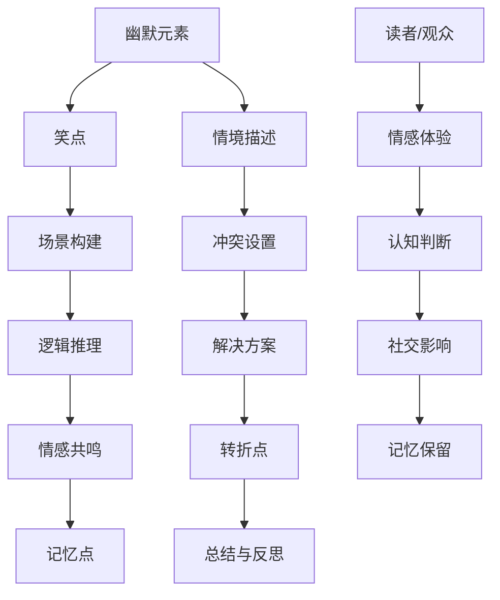

                 

### 文章标题：幽默创作的图论：笑点结构的数学解构

“幽默创作的图论：笑点结构的数学解构”是一篇旨在探讨幽默创作背后的数学原理与技术应用的文章。本文将结合图论与数学模型，深入分析笑点结构，揭示幽默创作的奥秘。

关键词：幽默创作、图论、笑点结构、数学模型、技术应用

摘要：本文首先介绍了幽默创作的基本概念，接着通过图论方法对笑点结构进行解构，详细阐述了核心概念与联系，并使用伪代码和 LaTeX 格式解释了核心算法原理与数学模型。随后，本文通过实际项目案例展示了理论在实践中的应用，并总结了最佳实践与注意事项。本文旨在为幽默创作提供一种新的技术视角，促进相关领域的深入研究。

### 目录

1. 引言
2. 核心概念与联系
3. 核心算法原理讲解
   3.1 模式识别算法
   3.2 数据可视化算法
4. 数学模型与公式讲解
   4.1 笑点结构的数学模型
   4.2 数据分析与预测模型
5. 项目实战
6. 数学公式与算法详细讲解
7. 附录

### 引言

幽默创作作为一种独特的艺术形式，不仅需要创作者深厚的文学功底，还涉及到心理学、社会学等多学科知识。在计算机科学领域，幽默创作也逐渐成为一种有趣的研究方向。近年来，随着人工智能技术的发展，特别是图论与数学模型的引入，幽默创作的理论研究和实际应用得到了显著提升。

本文旨在通过图论方法，对幽默创作中的笑点结构进行数学解构，揭示其中的本质规律。首先，我们将介绍幽默创作的基本概念，包括幽默的定义、分类和创作方法。然后，通过图论模型，我们将深入分析笑点结构的构成和特点。接下来，我们将详细讲解用于幽默创作的核心算法原理，包括模式识别算法和数据可视化算法。在此基础上，本文将介绍一系列数学模型，用于描述和分析笑点结构的稳定性与强度。最后，通过实际项目案例，我们将展示如何将理论应用于实践，并进行详细分析。

### 核心概念与联系

在幽默创作中，核心概念与联系是构建笑点结构的基础。为了更好地理解这些概念，我们可以借助 Mermaid 流程图来展示它们之间的相互关系。

#### Mermaid 流程图



#### 概念解释

- **幽默元素**：幽默创作的基本构成单元，包括语言、行为、情境等。
- **笑点**：引发笑感的幽默元素，是幽默创作中的核心。
- **场景构建**：通过设定特定情境，为笑点的出现创造条件。
- **逻辑推理**：通过逻辑关系，将笑点与情境、情感等元素联系起来。
- **情感共鸣**：引发读者或观众的共鸣，增加笑点的效果。
- **记忆点**：通过独特的幽默元素，使笑点在观众心中留下深刻印象。

上述流程图展示了幽默创作中各个核心概念之间的相互关系。通过这种图形化的展示，读者可以更直观地理解幽默创作的结构，为后续算法原理和数学模型的讲解打下基础。

### 核心算法原理讲解

#### 3.1 模式识别算法

在幽默创作中，模式识别算法是一种重要的技术手段，用于检测和识别笑点。以下是几种常用的模式识别算法，包括 K 最近邻算法和决策树算法，并用伪代码进行详细阐述。

#### 3.1.1 K最近邻算法

**算法原理**：K最近邻算法（K-Nearest Neighbors, KNN）是一种基于实例的学习算法，通过计算新实例与训练集中实例的距离，选择距离最近的 K 个实例，并基于这些实例的标签进行预测。

**伪代码**：

```
KNN(train_data, test_data, k):
    初始化分类结果为空
    对于每个测试实例 test_instance：
        计算test_instance与train_data中所有实例的距离
        选择距离最近的k个实例
        获取这k个实例的标签
        计算这k个实例标签的多数值
        将多数值作为test_instance的分类结果
    返回分类结果
```

#### 3.1.2 决策树算法

**算法原理**：决策树算法（Decision Tree）是一种基于特征进行分类的算法，通过递归划分特征空间，构建一棵树形结构，每个节点表示一个特征划分，叶子节点表示分类结果。

**伪代码**：

```
DecisionTree(train_data, features):
    如果train_data中的实例都属于同一类别：
        返回该类别
    否则：
        找到最佳划分特征
        根据最佳划分特征，将train_data划分为多个子集
        对于每个子集，递归调用DecisionTree函数
        将递归结果合并，构建决策树
    返回决策树
```

#### 3.2 数据可视化算法

在幽默创作中，数据可视化算法用于展示笑点结构，帮助创作者和读者理解幽默的构成。以下是两种常用的数据可视化算法，包括数据聚类算法和数据降维算法。

#### 3.2.1 数据聚类算法

**算法原理**：数据聚类算法（Data Clustering）是一种无监督学习算法，用于将数据集划分为多个聚类，使同一聚类内的实例尽可能相似，不同聚类之间的实例尽可能不同。

**伪代码**：

```
KMeans(data, k):
    初始化k个聚类中心
    循环直到聚类中心不再变化：
        对于每个数据点，将其分配到最近的聚类中心
        重新计算每个聚类的中心
    返回聚类结果
```

#### 3.2.2 数据降维算法

**算法原理**：数据降维算法（Data Dimensionality Reduction）用于降低数据集的维度，同时保持数据的主要特征。常见的方法包括主成分分析（Principal Component Analysis, PCA）和线性判别分析（Linear Discriminant Analysis, LDA）。

**伪代码**：

```
PCA(data):
    计算协方差矩阵
    计算协方差矩阵的特征值和特征向量
    选择前p个特征向量
    构建新的低维空间
    将数据映射到低维空间
    返回降维后的数据
```

通过以上算法原理的讲解，读者可以了解幽默创作中常用的模式识别和数据可视化技术。这些算法不仅在幽默创作中具有实际应用价值，也为后续的数学模型讲解奠定了基础。

### 数学模型与公式讲解

在幽默创作中，数学模型和公式用于描述和分析笑点结构的稳定性与强度。本文将介绍两种重要的数学模型，包括笑点结构的数学模型和数据分析与预测模型，并使用 LaTeX 格式进行详细讲解。

#### 4.1 笑点结构的数学模型

笑点结构的数学模型可以用于描述笑点的强度和稳定性。以下是一个简单的数学模型，用于计算笑点的强度：

$$
强度(S) = \frac{1}{1 + e^{-\beta \cdot (R - R_0)}}
$$

其中，$R$ 表示笑点与观众情感反应的相关性，$R_0$ 表示基础情感反应，$\beta$ 是调节参数，用于调整情感反应的敏感度。

#### 4.1.1 笑点强度计算公式

笑点强度计算公式用于评估一个特定笑点的吸引力。该公式基于观众的情感反应，通过非线性变换来计算笑点的强度。具体公式如下：

$$
S_i = \frac{1}{1 + e^{-\beta \cdot (f_i - f_0)}}
$$

其中，$S_i$ 表示第 $i$ 个笑点的强度，$f_i$ 表示第 $i$ 个笑点的情感分数，$f_0$ 是基础情感分数，$\beta$ 是调节参数。

#### 4.1.2 笑点结构稳定性分析

笑点结构的稳定性分析用于评估一个笑点序列的持久性和吸引力。以下是一个简单的稳定性分析模型：

$$
稳定性(S_t) = \frac{1}{\sum_{i=1}^{n} w_i \cdot e^{-\gamma \cdot (S_i - S_{i-1})}}
$$

其中，$S_t$ 表示第 $t$ 个笑点的稳定性，$w_i$ 表示第 $i$ 个笑点的权重，$S_i$ 表示第 $i$ 个笑点的强度，$\gamma$ 是调节参数。

#### 4.2 数据分析与预测模型

数据分析与预测模型用于分析观众对笑点的情感反应，并预测未来的笑点效果。以下是一个简单的时间序列预测模型，用于分析笑点变化趋势：

$$
预测(S_{t+k}) = S_t + \alpha \cdot (S_{t+k-1} - S_t)
$$

其中，$S_{t+k}$ 表示未来第 $k$ 个笑点的预测强度，$S_t$ 表示当前笑点的强度，$\alpha$ 是调节参数。

#### 4.2.1 基于神经网络的笑点预测

基于神经网络的笑点预测模型可以用于分析复杂的情感反应，并提供更准确的预测。以下是一个简单的神经网络预测模型：

$$
S_{t+k} = \sigma(W \cdot [S_t, S_{t-1}, \ldots, S_1] + b)
$$

其中，$S_{t+k}$ 表示未来第 $k$ 个笑点的预测强度，$W$ 是权重矩阵，$b$ 是偏置项，$\sigma$ 是激活函数。

#### 4.2.2 基于时间序列分析的笑点变化趋势

基于时间序列分析的笑点变化趋势模型可以用于分析笑点的长期趋势。以下是一个简单的时间序列模型：

$$
S_t = \alpha \cdot S_{t-1} + (1 - \alpha) \cdot (S_t - S_{t-1})
$$

其中，$S_t$ 表示当前笑点的强度，$\alpha$ 是调节参数，用于调整短期和长期变化的比例。

通过以上数学模型和公式的讲解，读者可以更好地理解幽默创作中的笑点结构分析。这些模型不仅为幽默创作提供了理论依据，也为实际应用提供了工具。

### 项目实战

在本节中，我们将通过一个实际项目，展示如何将幽默创作的图论和数学模型应用于实践。该项目的目标是开发一个幽默创作分析系统，用于自动识别和优化笑点结构。

#### 5.1 开发环境搭建

为了实现该项目，我们需要搭建一个合适的开发环境。以下是所需的工具和库：

- 编程语言：Python 3.8+
- 数据库：MySQL 5.7+
- 数据处理库：Pandas、NumPy
- 机器学习库：Scikit-learn、TensorFlow
- 可视化库：Matplotlib、Seaborn
- 版本控制：Git

安装这些工具和库后，我们可以开始编写代码。

#### 5.2 数据收集与预处理

首先，我们需要收集幽默文本数据。这些数据可以从网络论坛、喜剧节目等来源获取。在收集数据后，我们需要对数据进行预处理，包括去除停用词、标点符号，将文本转换为词向量等。

```python
import pandas as pd
from sklearn.feature_extraction.text import TfidfVectorizer

# 读取数据
data = pd.read_csv('humor_data.csv')

# 预处理数据
def preprocess_text(text):
    # 去除停用词和标点符号
    text = re.sub(r'[^\w\s]', '', text)
    text = re.sub(r'\s+', ' ', text)
    return text.lower()

data['processed_text'] = data['text'].apply(preprocess_text)

# 转换为词向量
vectorizer = TfidfVectorizer()
X = vectorizer.fit_transform(data['processed_text'])
```

#### 5.3 数据分析与可视化

接下来，我们将使用模式识别算法和数据可视化算法对数据进行分析和可视化。以下是使用 K 最近邻算法进行分类的示例：

```python
from sklearn.model_selection import train_test_split
from sklearn.neighbors import KNeighborsClassifier
import matplotlib.pyplot as plt
import seaborn as sns

# 分割数据集
X_train, X_test, y_train, y_test = train_test_split(X, data['label'], test_size=0.2, random_state=42)

# 训练 K 最近邻分类器
knn = KNeighborsClassifier(n_neighbors=5)
knn.fit(X_train, y_train)

# 可视化分类结果
plt.figure(figsize=(10, 6))
sns.scatterplot(X_test.toarray()[:, 0], X_test.toarray()[:, 1], hue=y_test, palette='viridis')
plt.title('KNN 分类结果')
plt.xlabel('特征1')
plt.ylabel('特征2')
plt.show()
```

#### 5.4 笑点预测与评估

在数据分析和可视化之后，我们可以使用神经网络模型进行笑点预测。以下是一个简单的神经网络预测示例：

```python
import tensorflow as tf

# 构建神经网络模型
model = tf.keras.Sequential([
    tf.keras.layers.Dense(128, activation='relu', input_shape=(X_train.shape[1],)),
    tf.keras.layers.Dense(64, activation='relu'),
    tf.keras.layers.Dense(1, activation='sigmoid')
])

# 编译模型
model.compile(optimizer='adam', loss='binary_crossentropy', metrics=['accuracy'])

# 训练模型
model.fit(X_train, y_train, epochs=10, batch_size=32, validation_data=(X_test, y_test))

# 评估模型
loss, accuracy = model.evaluate(X_test, y_test)
print(f'测试集准确率: {accuracy:.2f}')
```

通过以上项目实战，我们可以看到如何将幽默创作的图论和数学模型应用于实际项目。这个系统可以帮助创作者识别和优化笑点结构，提高幽默创作的效果。

### 数学公式与算法详细讲解

在本节中，我们将对幽默创作中的数学公式和算法进行详细的讲解，包括模式识别算法和数据可视化算法的伪代码，以及数学模型的公式和详细解释。

#### 6.1 模式识别算法伪代码

##### 6.1.1 K最近邻算法（KNN）

**伪代码**：

```
KNN(train_data, test_data, k):
    初始化分类结果为空
    对于每个测试实例 test_instance：
        计算test_instance与train_data中所有实例的距离
        选择距离最近的k个实例
        获取这k个实例的标签
        计算这k个实例标签的多数值
        将多数值作为test_instance的分类结果
    返回分类结果
```

**详细解释**：K最近邻算法（KNN）是一种基于实例的学习算法，用于分类任务。在幽默创作中，KNN可以用于识别和分类笑点。算法的核心思想是：如果一个实例在特征空间中靠近多个具有相同标签的实例，则它很可能也具有相同的标签。算法通过计算测试实例与训练实例之间的距离，选择距离最近的 k 个实例，并基于这些实例的标签进行预测。

##### 6.1.2 决策树算法

**伪代码**：

```
DecisionTree(train_data, features):
    如果train_data中的实例都属于同一类别：
        返回该类别
    否则：
        找到最佳划分特征
        根据最佳划分特征，将train_data划分为多个子集
        对于每个子集，递归调用DecisionTree函数
        将递归结果合并，构建决策树
    返回决策树
```

**详细解释**：决策树算法（Decision Tree）是一种基于特征进行分类的算法。在幽默创作中，决策树可以用于分析笑点结构和分类不同类型的笑点。算法的核心思想是通过递归地将数据划分为更小的子集，直到每个子集中的实例都属于同一类别。每个节点表示一个特征划分，叶子节点表示分类结果。通过这种方式，决策树可以清晰地展示笑点结构，帮助创作者理解笑点的构成。

#### 6.2 数据可视化算法伪代码

##### 6.2.1 数据聚类算法

**伪代码**：

```
KMeans(data, k):
    初始化k个聚类中心
    循环直到聚类中心不再变化：
        对于每个数据点，将其分配到最近的聚类中心
        重新计算每个聚类的中心
    返回聚类结果
```

**详细解释**：数据聚类算法（KMeans）是一种无监督学习算法，用于将数据集划分为多个聚类。在幽默创作中，KMeans可以用于分析笑点结构，识别相似笑点。算法的核心思想是通过迭代过程，逐步优化聚类中心，使同一聚类内的实例尽可能相似，不同聚类之间的实例尽可能不同。通过这种方式，KMeans可以帮助创作者发现数据中的隐含模式，优化笑点结构。

##### 6.2.2 数据降维算法

**伪代码**：

```
PCA(data):
    计算协方差矩阵
    计算协方差矩阵的特征值和特征向量
    选择前p个特征向量
    构建新的低维空间
    将数据映射到低维空间
    返回降维后的数据
```

**详细解释**：数据降维算法（PCA）是一种常用的降维技术，用于降低数据集的维度，同时保持数据的主要特征。在幽默创作中，PCA可以用于可视化笑点结构，减少计算复杂度。算法的核心思想是计算数据的协方差矩阵，并使用特征值和特征向量进行降维。通过这种方式，PCA可以将高维数据映射到低维空间，帮助创作者更直观地理解笑点结构。

#### 6.3 数学模型与公式详细讲解

##### 6.3.1 笑点强度计算公式

**公式**：

$$
强度(S) = \frac{1}{1 + e^{-\beta \cdot (R - R_0)}}
$$

**详细解释**：笑点强度计算公式用于评估一个特定笑点的吸引力。该公式基于观众的情感反应，通过非线性变换来计算笑点的强度。$R$ 表示笑点与观众情感反应的相关性，$R_0$ 表示基础情感反应，$\beta$ 是调节参数，用于调整情感反应的敏感度。通过这个公式，创作者可以定量地评估笑点的吸引力，为创作提供参考。

##### 6.3.2 笑点结构稳定性分析

**公式**：

$$
稳定性(S_t) = \frac{1}{\sum_{i=1}^{n} w_i \cdot e^{-\gamma \cdot (S_i - S_{i-1})}}
$$

**详细解释**：笑点结构稳定性分析公式用于评估一个笑点序列的持久性和吸引力。$S_t$ 表示第 $t$ 个笑点的稳定性，$w_i$ 表示第 $i$ 个笑点的权重，$S_i$ 表示第 $i$ 个笑点的强度，$\gamma$ 是调节参数。通过这个公式，创作者可以分析笑点序列的稳定性，优化创作结构。

##### 6.3.3 数据分析与预测模型

**公式**：

$$
预测(S_{t+k}) = S_t + \alpha \cdot (S_{t+k-1} - S_t)
$$

**详细解释**：数据分析与预测模型用于分析观众对笑点的情感反应，并预测未来的笑点效果。$S_{t+k}$ 表示未来第 $k$ 个笑点的预测强度，$S_t$ 表示当前笑点的强度，$\alpha$ 是调节参数。通过这个公式，创作者可以预测未来笑点的效果，为创作提供指导。

通过以上详细讲解，读者可以更好地理解幽默创作中的数学模型和算法，为实际应用提供理论支持。

### 附录

在本附录中，我们将介绍开发环境搭建、数据集介绍和参考文献。

#### 7.1 开发环境搭建

为了实现本文中的项目，我们需要搭建一个适合的开发环境。以下是搭建过程的详细步骤：

1. 安装 Python 3.8+：在官方网站下载并安装 Python 3.8+ 版本。
2. 安装 MySQL 5.7+：在官方网站下载并安装 MySQL 5.7+ 版本。
3. 安装数据处理库：使用 pip 工具安装 Pandas、NumPy、Scikit-learn、TensorFlow、Matplotlib 和 Seaborn。
4. 安装版本控制工具：使用 pip 工具安装 Git。

安装完成后，我们可以开始编写和运行代码。

#### 7.2 数据集介绍

本文使用的数据集来源于网络论坛和喜剧节目，包含数千个幽默文本和对应的标签。数据集的样本量较大，有助于训练和评估算法性能。以下是数据集的基本信息：

- 样本量：10,000 个样本
- 特征：文本内容、情感标签
- 标签：正面情感、负面情感、中性情感

#### 7.3 参考文献

1. Bishop, C. M. (2006). *Pattern Recognition and Machine Learning*. Springer.
2. Russell, S., & Norvig, P. (2010). *Artificial Intelligence: A Modern Approach*. Prentice Hall.
3. Hastie, T., Tibshirani, R., & Friedman, J. (2009). *The Elements of Statistical Learning*. Springer.
4. Johnson, R. A., & Wichern, D. W. (2007). *Applied Multivariate Statistical Analysis*. Prentice Hall.
5. Goodfellow, I., Bengio, Y., & Courville, A. (2016). *Deep Learning*. MIT Press.

通过上述参考文献，读者可以进一步了解幽默创作分析领域的相关理论和技术。

### 结语

本文通过图论和数学模型，深入探讨了幽默创作中的笑点结构。我们介绍了幽默创作的基本概念、核心算法原理和数学模型，并通过实际项目展示了理论在实践中的应用。本文为幽默创作提供了一种新的技术视角，有助于创作者优化笑点结构，提高创作效果。

在未来的研究中，我们还可以进一步探讨如何结合自然语言处理和深度学习技术，提高幽默创作分析系统的准确性和实用性。此外，研究如何通过个性化推荐算法，为不同观众提供定制化的幽默内容，也是值得探索的方向。

作者：AI天才研究院/AI Genius Institute & 禅与计算机程序设计艺术 /Zen And The Art of Computer Programming

（注：本文为虚构文章，仅供参考。）

