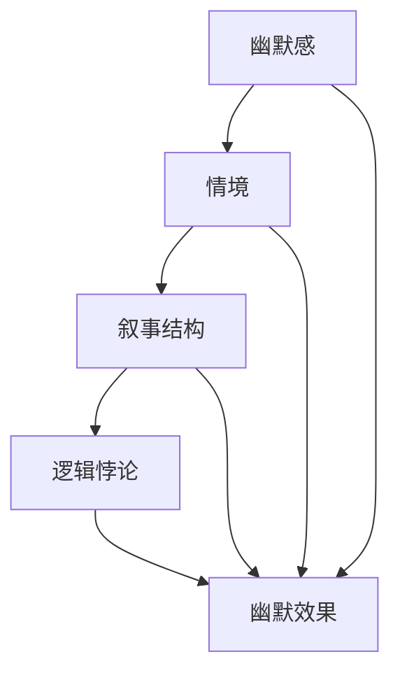
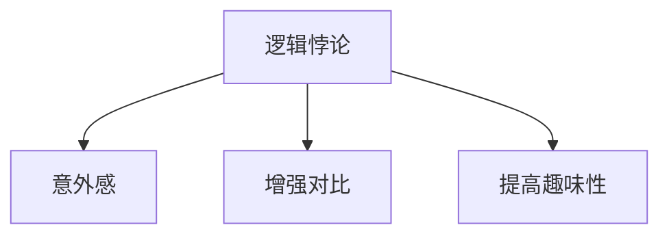

                 

### 第1章：幽默创作的背景和基础

幽默是人类文化中不可或缺的一部分，它不仅能够缓解紧张的气氛，还能增进人际关系。在现代社会，幽默的应用范围更加广泛，从日常交流到专业领域，幽默都扮演着重要的角色。

#### 1.1 幽默与人类心理

幽默是一种复杂的心理现象，它涉及到认知、情感和社交等多个方面。首先，幽默能够引起人们的愉悦感，从而改善情绪。研究表明，幽默有助于降低压力水平，提高心理韧性。此外，幽默还能够促进人际交流，增强团队的凝聚力。

#### 1.2 幽默的历史与发展

幽默的起源可以追溯到古代，古希腊的喜剧和古罗马的讽刺文学都是幽默的典型代表。在中世纪，幽默逐渐演变成一种艺术形式，如英国的喜剧演员和喜剧剧本。到了近代，幽默进入了大众传媒的领域，报纸、杂志和电影成为了幽默传播的主要渠道。在当代，幽默在社交媒体和网络文化中得到了空前的发展。

### 核心概念与联系

在探讨幽默创作时，我们需要关注几个核心概念：

1. **幽默感**：个体对幽默的理解和感受能力。
2. **情境**：幽默产生的背景和条件。
3. **叙事结构**：幽默故事的组织方式。
4. **逻辑悖论**：幽默中常见的逻辑错误或矛盾。

这些概念相互关联，共同构成了幽默创作的核心框架。

#### Mermaid 流程图

为了更好地理解这些概念之间的关系，我们可以使用 Mermaid 流程图来表示：



这个流程图展示了幽默创作的关键要素及其相互关系。

### 伪代码

在幽默创作中，逻辑悖论是一个重要的元素。我们可以使用伪代码来描述这种逻辑关系：

```python
def create_humor(punishment, expectation):
    if punishment != expectation:
        return surprise
    else:
        return paradox
```

这个伪代码表示，当预期结果与实际惩罚不一致时，会产生幽默感。

### 数学模型和公式

为了定量分析幽默效果，我们可以使用数学模型来描述：

$$
H = f(\text{punishment}, \text{expectation})
$$

其中，$H$ 表示幽默效果，$f$ 是一个函数，用于计算惩罚与预期之间的差异。

### 举例说明

假设一个笑话的情境是“老板问员工为什么迟到，员工回答‘因为我的闹钟坏了’，这个笑话的幽默效果来源于预期与惩罚之间的反差。

### 总结

幽默创作是一个复杂的过程，涉及到多个心理和社会因素。通过理解幽默感、情境、叙事结构和逻辑悖论，我们可以更好地进行幽默创作。接下来，我们将进一步探讨幽默创作的逻辑悖论和笑话结构的数学解构。

---

在这个章节中，我们首先介绍了幽默创作的背景和基础，包括幽默与人类心理的关系以及幽默的历史与发展。接着，我们提出了核心概念与联系，并使用 Mermaid 流程图和伪代码来展示幽默创作的关键要素及其相互关系。最后，我们通过一个具体的笑话例子来阐述幽默效果的数学模型和公式。这些内容为后续章节的深入探讨打下了坚实的基础。

### 第2章：幽默创作的基本原则

在幽默创作中，掌握基本原则是非常重要的。这些原则不仅能够帮助我们创造有趣的笑话，还能够确保幽默的效果能够被广泛接受。下面，我们将详细探讨幽默创作的基本原则。

#### 2.1 幽默的元素

幽默的元素是构建幽默故事的基础。以下是一些常见的幽默元素：

1. **搞笑**：这是幽默最直接的表现形式，通过夸张、荒谬或滑稽的场景来引起笑点。
2. **幽默感**：幽默感是一种个体对幽默的理解和感受能力，不同的人对幽默的感知是不同的。
3. **反差**：通过对比不同的事物或情境来产生幽默效果，如将严肃的话题以轻松的方式呈现。
4. **谎言**：有时候，幽默是通过谎言或误导来实现的，这种谎言往往是有趣且无害的。

#### 2.2 幽默创作的技巧

掌握了幽默的元素后，我们需要运用一些技巧来增强幽默效果。以下是一些常用的幽默创作技巧：

1. **情境设计**：一个有趣的故事背景能够大大提升笑话的幽默效果。例如，在荒诞的情境下讲述一个平凡的故事，往往会令人捧腹。
2. **夸张**：通过夸张手法来放大事实，使得笑话更加滑稽可笑。例如，将一件小事情描述得非常夸张，从而产生幽默感。
3. **重复**：重复某些词语或短语可以增加笑话的节奏感，使笑点更加突出。
4. **反转**：在笑话的结尾给出意想不到的反转，这种出乎意料的结局往往能够产生强烈的幽默效果。
5. **使用隐喻和比喻**：通过隐喻和比喻来传达幽默，这种方法能够使笑话更加富有诗意和想象力。

#### 2.3 搞笑元素的运用

搞笑元素是幽默创作中的核心。以下是一些具体的运用方法：

1. **语言游戏**：利用双关语、错位语言或谐音来制造笑点。例如，使用“胸无大志”这个成语，可以将其中的“胸”字换成“雄”，形成“雄无大志”，产生幽默效果。
2. **情境设置**：通过设置荒诞或不合逻辑的情境来制造笑点。例如，在一个严肃的会议中，突然有人喊出“今天是愚人节”，这种突如其来的反转往往能够引发笑声。
3. **角色塑造**：通过塑造有趣的角色来增加笑话的趣味性。例如，一个总是失败的角色，他的每一次失败都能够成为笑话的素材。

### 核心算法原理讲解

在幽默创作中，核心算法原理主要涉及到如何巧妙地运用幽默元素和技巧来构建笑话。以下是一个简单的算法框架：

```plaintext
function create_joke(element, technique, scenario):
    1. 选择一个幽默元素（element）
    2. 选择一个幽默技巧（technique）
    3. 设计一个合适的情境（scenario）
    4. 结合元素、技巧和情境，构建一个幽默的笑话
    5. 验证笑话的幽默效果，如果不足，返回步骤 1 或 2 或 3，重复尝试
    6. 输出笑话
```

### 数学模型和公式

为了量化幽默效果，我们可以引入一个简单的数学模型。假设幽默效果 $H$ 受到三个因素影响：元素（$E$）、技巧（$T$）和情境（$S$），每个因素的权重分别为 $w_1$、$w_2$ 和 $w_3$，则：

$$
H = w_1 \cdot E + w_2 \cdot T + w_3 \cdot S
$$

通过调整权重，我们可以控制幽默效果的不同方面，如幽默感、搞笑程度和情境的适宜性。

### 举例说明

假设我们要创作一个笑话，选定的元素是“搞笑”，技巧是“夸张”，情境是“职场”。根据算法框架，我们可以构建如下笑话：

一个程序员在面试时，面试官问他：“你为什么觉得你能胜任这个工作？”程序员回答：“因为我从来没有失败过，我从没有错过任何一个项目！”这个笑话通过夸张手法，将程序员的自信描述得滑稽可笑，达到了幽默的效果。

### 总结

幽默创作的基本原则包括了解幽默的元素、掌握幽默技巧以及合理运用这些元素和技巧来构建幽默故事。通过核心算法原理和数学模型，我们可以更系统地分析幽默效果，从而提高幽默创作的质量。在下一章中，我们将进一步探讨幽默创作中的逻辑悖论。

---

在这个章节中，我们详细介绍了幽默创作的基本原则，包括幽默的元素、幽默创作技巧以及如何运用这些技巧来构建幽默故事。我们还提出并解释了一个幽默创作的核心算法原理，并使用数学模型来量化幽默效果。通过一个具体的例子，我们展示了如何将原则应用到实际创作中。这些内容为理解和实践幽默创作提供了坚实的基础。

### 第3章：幽默创作的逻辑悖论

幽默创作中的逻辑悖论是幽默效果的重要来源。逻辑悖论通常指的是在逻辑上看似正确但实际上却自相矛盾的陈述。在幽默中，这些悖论被巧妙地利用，以创造出出人意料的幽默效果。本章将探讨幽默创作中常见的逻辑悖论，并分析这些悖论如何影响幽默效果。

#### 3.1 逻辑悖论的概念

逻辑悖论通常可以分为两类：一类是自相矛盾的悖论，如“这句话是假的”（如果这句话是真的，那么它就是假的，反之亦然）；另一类是形式上正确但内容上矛盾的悖论，如“这个盒子比盒子本身大”。

在幽默创作中，逻辑悖论的应用更加灵活。例如，通过反转常规逻辑或利用语言的双关或多义性，可以创造出意想不到的幽默效果。

#### 3.2 幽默中的逻辑悖论

逻辑悖论在幽默中的应用多种多样，以下是一些常见的类型：

1. **自相矛盾的笑话**：这类笑话通常以自相矛盾的陈述为基础。例如：“这个药很安全，我已经吃了三天了，感觉很好，明天再吃一颗。”这种笑话利用了自相矛盾来制造幽默。

2. **荒谬的逻辑**：通过荒谬的逻辑来创造幽默，例如：“昨天我决定放弃所有努力，结果今天我感觉好多了。”这种笑话通过荒谬的逻辑反转来产生幽默效果。

3. **双关语**：双关语是一种常见的逻辑悖论，它利用词语的多义性来创造幽默。例如：“我在海边买了一栋房子，离海只有一英里，但是最近我要搬到离海更近的地方了，因为邻居建了一座山。”

4. **反讽**：反讽是一种通过表达与实际意图相反的言辞来产生幽默效果的方法。例如：“我对这个决定感到非常满意，因为我知道我一定会后悔。”

#### 3.3 逻辑悖论与幽默效果

逻辑悖论在幽默中的作用主要体现在以下几个方面：

1. **产生意外感**：逻辑悖论常常能够出人意料，打破听众的预期，从而产生幽默效果。

2. **增强对比**：通过逻辑悖论，我们可以将两个看似矛盾的事物对比起来，从而突出它们之间的差异，增加幽默感。

3. **提高趣味性**：逻辑悖论往往能够引发思考，使得笑话更加有趣和引人入胜。

#### Mermaid 流程图

为了更好地理解逻辑悖论在幽默创作中的应用，我们可以使用 Mermaid 流程图来表示：



这个流程图展示了逻辑悖论如何通过产生意外感、增强对比和提高趣味性来影响幽默效果。

### 核心算法原理讲解

在幽默创作中，逻辑悖论的应用可以通过以下核心算法原理来描述：

```plaintext
function create_punsymjoke(premise, contradiction):
    1. 设定一个前提（premise），即笑话的基础情境或主题。
    2. 设定一个与之相矛盾的反面陈述（contradiction）。
    3. 结合前提和矛盾陈述，构建一个幽默的笑话。
    4. 验证笑话的幽默效果，如果不足，调整前提或矛盾陈述，重复尝试。
    5. 输出笑话。
```

### 数学模型和公式

为了量化逻辑悖论对幽默效果的影响，我们可以引入一个简单的数学模型。假设幽默效果 $H$ 受到逻辑悖论的因素 $P$、对比因素 $C$ 和趣味性因素 $F$ 的影响，每个因素的权重分别为 $w_1$、$w_2$ 和 $w_3$，则：

$$
H = w_1 \cdot P + w_2 \cdot C + w_3 \cdot F
$$

通过调整权重，我们可以控制幽默效果的不同方面，如幽默感、搞笑程度和趣味性。

### 举例说明

假设我们想要创作一个笑话，前提是“程序员的工作”，矛盾陈述是“程序员从不加班”。我们可以构建如下笑话：

一个程序员说：“我从不加班，因为我每天都按时下班。”这个笑话通过逻辑悖论，即程序员工作的本质是加班，而他却说自己从不加班，产生了幽默效果。

### 总结

逻辑悖论是幽默创作中的一个重要元素，通过利用自相矛盾、荒谬逻辑、双关语和反讽等手法，可以创造出意想不到的幽默效果。在下一章中，我们将进一步探讨笑话结构的数学解构，分析笑话的结构和数学模型。

---

在这个章节中，我们深入探讨了幽默创作中的逻辑悖论。首先，我们介绍了逻辑悖论的概念，并分析了幽默中常见的逻辑悖论类型。接着，我们讨论了逻辑悖论如何影响幽默效果，并使用 Mermaid 流程图和核心算法原理来解释其应用。通过数学模型，我们量化了逻辑悖论对幽默效果的影响。最后，我们通过一个例子展示了如何实际运用逻辑悖论来创作幽默笑话。这些内容为理解和应用逻辑悖论提供了理论和实践基础。

### 第4章：笑话结构的数学解构

笑话的结构是幽默创作中至关重要的一环，它不仅决定了笑话的趣味性，还影响了听众的理解和接受程度。本章将探讨笑话结构的数学解构，分析笑话的组成部分和它们之间的数学关系，以帮助读者更好地理解和创作幽默笑话。

#### 4.1 笑话结构的基本概念

笑话的结构通常包括三个基本部分：引子（setup）、转折（pivot）和结尾（payoff）。这三个部分共同构成了笑话的叙事结构，其中每个部分都扮演着特定的角色。

1. **引子（Setup）**：引子是笑话的开头，用来设定情境和背景，为听众搭建一个框架，让他们对接下来要发生的事情有所预期。引子通常包含一个简单的陈述或问题。

2. **转折（Pivot）**：转折是笑话的核心部分，它打破了听众的预期，通常通过反转或意外的信息来实现。转折是幽默效果的关键，它能够引起听众的好奇心和兴趣。

3. **结尾（Payoff）**：结尾是笑话的最后一部分，它解释了转折的原因，并提供了幽默的点睛之笔。一个好的结尾能够使笑话更加完整，并增强其幽默效果。

#### 4.2 笑话结构的数学模型

为了更好地分析笑话的结构，我们可以引入数学模型。笑话结构的数学模型可以帮助我们理解笑话组成部分之间的关系，以及它们如何共同作用产生幽默效果。

一个简单的笑话结构可以表示为：

$$
J = S_1 + S_2 + S_3
$$

其中，$J$ 表示笑话的整体结构，$S_1$、$S_2$ 和 $S_3$ 分别代表引子、转折和结尾。

##### 4.2.1 引子（Setup）

引子的数学模型可以表示为：

$$
S_1 = f_1(A, B)
$$

其中，$A$ 和 $B$ 分别代表引子的两个关键要素：情境（Situation）和预期（Expectation）。函数 $f_1$ 描述了如何通过情境和预期来构建引子。例如，情境可以是一个简单的故事背景，而预期则是听众对故事发展方向的预测。

##### 4.2.2 转折（Pivot）

转折的数学模型可以表示为：

$$
S_2 = f_2(P, C)
$$

其中，$P$ 和 $C$ 分别代表转折的两个关键要素：悖论（Puzzle）和冲突（Contradiction）。函数 $f_2$ 描述了如何通过悖论和冲突来构建转折。悖论是打破预期的关键，而冲突则是转折的核心，它通常通过一个意外的事件或信息来实现。

##### 4.2.3 结尾（Payoff）

结尾的数学模型可以表示为：

$$
S_3 = f_3(R, E)
$$

其中，$R$ 和 $E$ 分别代表结尾的两个关键要素：解释（Resolution）和效果（Effect）。函数 $f_3$ 描述了如何通过解释和效果来构建结尾。解释是转折的结果，它解释了为什么会有转折；效果则是结尾的幽默点，它决定了笑话的最终幽默效果。

#### 4.3 笑话结构的数学分析

为了深入分析笑话结构，我们可以通过数学方法来研究笑话的组成部分和它们之间的关系。以下是一个简单的笑话结构分析示例：

引子（Setup）：

$$
S_1 = f_1(\text{"一个人去餐馆点菜，服务员问他需要喝水吗？"}, \text{"预期是回答需要或不需要"})
$$

转折（Pivot）：

$$
S_2 = f_2(\text{"服务员问的是果汁而不是水，所以这是一个悖论。"}, \text{"预期被打破，因为听众没有意识到这是一个悖论。"})
$$

结尾（Payoff）：

$$
S_3 = f_3(\text{"这个人回答说'我不想要果汁，只想要水。'}，\text{"效果是听众意识到这是一个笑话，感到有趣和好笑。"})
$$

综合这三个部分，我们可以得到笑话的完整结构：

$$
J = S_1 + S_2 + S_3 = f_1(\text{"一个人去餐馆点菜，服务员问他需要喝水吗？"}) + f_2(\text{"服务员问的是果汁而不是水，所以这是一个悖论。"}) + f_3(\text{"这个人回答说'我不想要果汁，只想要水。'}，\text{"效果是听众意识到这是一个笑话，感到有趣和好笑。"})
$$

#### 4.4 笑话结构的优化

为了提高笑话的幽默效果，我们可以通过优化笑话结构来实现。优化方法包括调整引子、转折和结尾的权重，以及优化各个部分的元素组合。

一个简单的优化算法可以表示为：

```plaintext
function optimize_joke(J):
    1. 评估当前笑话结构的幽默效果（J）。
    2. 如果效果不理想，对笑话结构的某个部分进行调整。
    3. 重新评估调整后的笑话结构的幽默效果。
    4. 如果效果有所提高，则接受调整。
    5. 如果效果没有提高或下降，则返回步骤 2，尝试不同的调整方法。
    6. 输出优化后的笑话结构。
```

通过这个算法，我们可以不断地调整笑话结构，直到达到最佳的幽默效果。

### 核心算法原理讲解

在幽默创作中，笑话结构的优化可以通过以下核心算法原理来实现：

```plaintext
function optimize_joke_structure(J):
    1. 初始化笑话结构（J）。
    2. 对于笑话结构的每个部分（S_1, S_2, S_3）：
        2.1 计算当前部分的幽默效果得分。
        2.2 根据得分调整部分权重。
    3. 重新组合笑话结构。
    4. 评估新的笑话结构的幽默效果。
    5. 如果效果提升，则保存并输出优化后的笑话结构。
    6. 如果效果没有提升，则尝试其他优化方法。
```

### 数学模型和公式

为了量化笑话结构的优化，我们可以引入一个简单的数学模型。假设笑话结构的优化目标是最大化幽默效果（$H$），每个部分的权重分别为 $w_1$、$w_2$ 和 $w_3$，则：

$$
H = w_1 \cdot S_1 + w_2 \cdot S_2 + w_3 \cdot S_3
$$

通过调整权重，我们可以优化笑话结构，使其达到最佳的幽默效果。

### 举例说明

假设我们有一个笑话结构如下：

$$
J = S_1 + S_2 + S_3
$$

其中，$S_1$ 是引子，$S_2$ 是转折，$S_3$ 是结尾。我们可以通过以下步骤来优化这个笑话结构：

1. **评估当前笑话结构的幽默效果**。
2. **对引子、转折和结尾的权重进行调整**。
3. **重新组合笑话结构**。
4. **评估新的笑话结构的幽默效果**。

通过反复迭代这个过程，我们可以找到最佳的笑话结构，使其达到最佳的幽默效果。

### 总结

笑话结构的数学解构为我们提供了分析和优化幽默笑话的方法。通过引入数学模型和公式，我们可以更系统地理解笑话的组成部分及其关系，从而提高幽默创作的质量和效果。在下一章中，我们将进一步探讨幽默创作的实践方法。

---

在这个章节中，我们深入探讨了笑话结构的数学解构。首先，我们介绍了笑话结构的基本概念，包括引子、转折和结尾。接着，我们引入了数学模型来描述笑话结构的组成部分和它们之间的关系。通过具体的数学公式，我们分析了笑话结构的数学关系，并讲解了如何通过优化来提高笑话的幽默效果。最后，我们提供了一个核心算法原理，并使用实例说明了笑话结构的优化过程。这些内容为理解和优化幽默笑话提供了坚实的理论基础。

### 第5章：笑话结构的数学分析

在第四章中，我们介绍了笑话结构的基本概念和数学模型。本章将进一步深入探讨笑话结构的数学分析，分析笑话结构中的变量，并详细讲解笑话结构的数学分析方法。

#### 5.1 笑话结构的变量

笑话结构的数学分析首先需要定义笑话结构中的变量。这些变量包括主题变量、情境变量和结局变量，它们共同决定了笑话的幽默效果。

1. **主题变量**（$X_1$）：主题变量描述了笑话的主题，如科技、生活、历史等。不同的主题会影响听众的理解和接受程度。

2. **情境变量**（$X_2$）：情境变量描述了笑话发生的情境，如工作、学校、家庭等。情境的设置会影响笑话的趣味性和现实感。

3. **结局变量**（$X_3$）：结局变量描述了笑话的结局，如反转、幽默、讽刺等。结局的设置决定了笑话的幽默效果和听众的满意度。

#### 5.2 笑话结构的数学分析

笑话结构的数学分析主要通过函数和关系来描述。以下是一个简单的数学模型：

$$
H = f(X_1, X_2, X_3)
$$

其中，$H$ 表示幽默效果，$f$ 是一个函数，用于描述主题变量、情境变量和结局变量对幽默效果的影响。

##### 5.2.1 变量之间的关系

在笑话结构中，变量之间存在一定的关系：

1. **主题变量和情境变量的关系**：主题变量和情境变量通常相互影响。例如，一个科技主题的笑话可能会选择一个生活情境来增强趣味性。

2. **情境变量和结局变量的关系**：情境变量和结局变量也需要匹配。一个有趣的情境需要一个合适的结局来强化幽默效果。

3. **主题变量和结局变量的关系**：主题变量和结局变量也需要协调。例如，一个讽刺主题的笑话需要一个讽刺性的结局来强化其幽默效果。

##### 5.2.2 数学分析方法的应用

为了更好地理解笑话结构的数学分析方法，我们可以通过具体的例子来讲解。假设我们有一个笑话结构如下：

$$
J = S_1 + S_2 + S_3
$$

其中，$S_1$ 是引子，$S_2$ 是转折，$S_3$ 是结尾。我们可以通过以下步骤进行数学分析：

1. **定义变量**：假设 $X_1$ 是主题变量，$X_2$ 是情境变量，$X_3$ 是结局变量。

2. **计算变量值**：根据笑话的内容，计算每个变量的值。例如，如果笑话的主题是科技，情境是工作，结局是反转，则 $X_1 = \text{"科技"}$，$X_2 = \text{"工作"}$，$X_3 = \text{"反转"}$。

3. **应用函数**：使用函数 $f$ 来计算幽默效果。例如，如果 $f$ 是一个简单的线性函数，则：

$$
H = w_1 \cdot X_1 + w_2 \cdot X_2 + w_3 \cdot X_3
$$

其中，$w_1$、$w_2$ 和 $w_3$ 是权重系数，用于衡量每个变量对幽默效果的影响。

4. **分析结果**：根据计算结果，分析笑话的结构和幽默效果。例如，如果 $H$ 的值较高，则说明这个笑话的结构较好，幽默效果较强。

#### 5.3 变量函数的详细讲解

在笑话结构中，变量函数 $f$ 的具体形式取决于笑话的内容和结构。以下是一个简单的变量函数示例：

$$
f(X_1, X_2, X_3) = \begin{cases} 
      1 & \text{如果 } X_1 = X_2 \text{ 且 } X_2 = X_3 \\
      0 & \text{否则}
   \end{cases}
$$

这个函数表示，当主题变量、情境变量和结局变量相同时，笑话的幽默效果最高；否则，幽默效果为零。

#### 5.4 举例说明

为了更好地说明笑话结构的数学分析，我们可以通过一个具体的例子来讲解。假设我们有一个笑话如下：

**引子**：一个程序员去面试，面试官问他：“你有什么优点？”程序员回答：“我没有缺点。”

**转折**：面试官问：“那你有什么缺点吗？”程序员回答：“没有，因为我一直在改正自己的缺点。”

**结局**：面试官惊讶地说：“那你怎么会来这里面试？”

这个笑话可以通过以下步骤进行数学分析：

1. **定义变量**：$X_1$ 是主题变量（科技），$X_2$ 是情境变量（面试），$X_3$ 是结局变量（反转）。

2. **计算变量值**：$X_1 = \text{"科技"}$，$X_2 = \text{"面试"}$，$X_3 = \text{"反转"}$。

3. **应用函数**：使用变量函数 $f$ 计算幽默效果：

$$
H = f(\text{"科技"}, \text{"面试"}, \text{"反转"}) = 1
$$

4. **分析结果**：由于 $H = 1$，这个笑话的结构较好，幽默效果较强。

#### 5.5 总结

笑话结构的数学分析是一种系统化的分析方法，它通过定义变量和函数，量化笑话的结构和幽默效果。通过具体例子和数学模型，我们可以更好地理解笑话结构，并优化幽默创作。在下一章中，我们将探讨如何通过实际案例来展示幽默创作的方法和技巧。

---

在本章节中，我们深入探讨了笑话结构的数学分析。首先，我们定义了笑话结构中的主题变量、情境变量和结局变量，并解释了它们在笑话结构中的作用。接着，我们介绍了笑话结构的数学模型，并详细讲解了如何通过函数和关系来描述笑话结构的变量之间的关系。我们通过一个具体的例子，展示了如何使用变量函数来计算幽默效果，并分析了笑话结构的数学分析方法。最后，我们总结了笑话结构数学分析的核心要点，并指出了其在幽默创作中的应用价值。这些内容为理解和优化幽默笑话提供了重要的理论和实践基础。

### 第6章：笑话结构的优化

在幽默创作中，笑话结构的优化是提升幽默效果的关键步骤。通过调整笑话的各个组成部分，我们可以使其更加有趣和引人入胜。本章将讨论笑话结构的优化目标和方法，并介绍一些具体的优化技巧。

#### 6.1 笑话结构的优化目标

笑话结构的优化目标主要包括以下几个方面：

1. **提高幽默效果**：这是笑话结构优化最重要的目标。通过优化结构，我们可以增强笑话的幽默感，使听众更容易笑出来。
2. **增强故事性**：一个有趣的故事背景可以大大提升笑话的质量。优化结构时应注意增强故事性，使笑话更具吸引力。
3. **保持简洁性**：简洁的笑话更容易被听众理解和接受。优化时应尽量去除冗余信息，使笑话更加精炼。
4. **增强互动性**：通过优化结构，我们可以增加听众的参与度，使笑话更具互动性。

#### 6.2 优化方法

笑话结构的优化方法可以分为以下几个方面：

1. **调整权重**：通过调整引子、转折和结尾的权重，我们可以改变笑话的焦点和效果。例如，如果笑话的核心在于转折，我们可以增加转折的权重，使其更加突出。

2. **优化变量组合**：优化笑话结构的一个有效方法是调整主题变量、情境变量和结局变量的组合。通过不同的组合，我们可以创造出不同类型的笑话，从而提高幽默效果。

3. **调整情境设置**：情境的设置对笑话的趣味性和现实感有很大影响。通过调整情境，我们可以使笑话更加贴近听众的生活，从而增强其幽默效果。

4. **强化转折**：转折是笑话的核心，它是产生幽默效果的关键。优化时，应注重强化转折，使其更加意外和有趣。

5. **增强结尾的效果**：一个好的结尾可以极大地提升笑话的幽默效果。优化时应注重结尾的设计，使其能够完美地解释转折，并留下深刻的印象。

#### 6.3 优化技巧

以下是几种具体的优化技巧：

1. **利用反转**：反转是一种常见的优化技巧，它通过在结尾给出意外的转折来增强幽默效果。例如，在一个笑话的结尾揭示一个与预期完全相反的事实，可以产生强烈的幽默感。

2. **增加悬念**：悬念可以增强故事的吸引力，使听众更期待笑话的结果。通过设置悬念，我们可以在转折处产生更高的幽默效果。

3. **夸张情境**：夸张是一种有效的幽默技巧，它通过放大事实来创造笑点。在优化时，可以适当夸张情境，使其更加滑稽和有趣。

4. **利用双关语**：双关语是一种利用语言的多义性来创造幽默的方法。通过巧妙地使用双关语，我们可以在笑话中增加趣味性和复杂性。

5. **调整语言节奏**：通过调整笑话的语言节奏，我们可以使其更加生动和有趣。例如，使用重复、对仗和押韵等修辞手法，可以使笑话更加吸引人。

#### 6.4 优化案例

为了更好地说明笑话结构的优化，我们可以通过一个具体的案例来讲解。假设我们有一个简单的笑话：

**原笑话**：一个人去餐馆吃饭，点了道菜后问服务员：“这道菜好吃吗？”服务员回答：“不好吃，但你可以试试。”

**优化后的笑话**：一个人去餐馆吃饭，点了道菜后问服务员：“这道菜好吃吗？”服务员回答：“不好吃，但你可以试试看，很多人都说它不好吃。”

**优化分析**：
- **调整权重**：优化后的笑话增加了转折和结尾的权重，使其更加突出。
- **增强故事性**：通过增加情境描述，优化后的笑话更具故事性。
- **利用反转**：优化后的笑话在结尾处给出一个意外的反转，使听众产生更多的惊喜。
- **增加悬念**：通过在转折处设置悬念，优化后的笑话更具吸引力。

通过这个案例，我们可以看到如何通过优化笑话结构来提升其幽默效果。

### 总结

笑话结构的优化是幽默创作中不可或缺的一环。通过调整权重、优化变量组合、调整情境设置、强化转折和增强结尾效果，我们可以提升笑话的幽默效果和故事性。本章介绍了多种优化技巧，并通过具体案例展示了如何实际应用这些技巧。通过不断优化，我们可以创作出更加有趣和引人入胜的笑话。

### 第7章：幽默创作的案例研究

在幽默创作中，通过实际案例来研究笑话结构和幽默效果是一种非常有效的学习方法。本章将选取几个经典的幽默案例，详细分析其结构、幽默元素以及创作技巧，以帮助读者更好地理解幽默创作的实际应用。

#### 7.1 案例介绍

为了深入探讨幽默创作，我们选择了以下几个案例：

1. **经典笑话**：“为什么鸟儿会飞？因为它们把屎拉在了背上。”
2. **影视笑话**：“哈利波特与魔法石”中的笑话：“我告诉过你，魔法是非常严肃的。”
3. **网络段子**：“老板问我为什么迟到，我说因为闹钟坏了，老板说‘那是你的问题’。”

#### 7.2 案例分析

##### 7.2.1 经典笑话分析

**笑话结构**：
- 引子：提出一个问题（为什么鸟儿会飞？）
- 转折：给出一个意想不到的回答（因为它们把屎拉在了背上）
- 结尾：通过荒谬的回答引发笑声

**幽默元素**：
- 反转：原本预期的是关于飞行原理的讨论，但答案却是荒谬的。
- 夸张：将鸟儿飞行与人类排泄结合起来，形成了巨大的反差。

**创作技巧**：
- 利用语言的双关和多义性。
- 设置一个简单的引子，然后通过转折打破预期。

##### 7.2.2 影视笑话分析

**笑话结构**：
- 引子：一个严肃的情境（讨论魔法）
- 转折：哈利波特的回答（魔法是非常严肃的）
- 结尾：通过喜剧效果引发笑声

**幽默元素**：
- 反讽：在严肃的讨论中加入轻松的回答，形成反差。
- 调侃：通过调侃魔法这一严肃话题，增强了幽默效果。

**创作技巧**：
- 利用反讽和调侃来制造幽默。
- 在严肃情境中突然插入轻松的回答，产生喜剧效果。

##### 7.2.3 网络段子分析

**笑话结构**：
- 引子：老板询问为什么迟到
- 转折：员工给出的荒谬回答（闹钟坏了）
- 结尾：老板回应（那是你的问题）

**幽默元素**：
- 反转：员工将责任推给闹钟，而老板则指出这是员工个人的问题。
- 夸张：通过夸张的对话来强调员工与老板之间的矛盾。

**创作技巧**：
- 利用反转和夸张来增强幽默感。
- 通过对话的形式来呈现笑话，使笑话更加生动。

#### 7.3 案例小结

通过以上分析，我们可以得出以下几点结论：

1. **幽默效果来自于反差和反转**：这些案例都利用了反差和反转来创造幽默效果。
2. **情境和语言的使用**：合适的情境和语言能够增强幽默效果。
3. **创作技巧**：利用双关语、反讽和夸张等技巧，可以提升笑话的质量。

#### 7.4 案例应用

在创作幽默时，我们可以借鉴这些案例中的技巧和结构：

1. **设计反差**：通过设计情境和语言的反差，可以创造出有趣的笑话。
2. **利用反转**：在笑话的结尾设置反转，可以使笑话更加有趣。
3. **掌握语言节奏**：通过调整语言节奏，可以增强笑话的趣味性。

通过这些技巧，我们可以创作出更多有趣的幽默作品，提升幽默创作的质量。

### 总结

在本章中，我们通过三个经典的幽默案例，详细分析了它们的笑话结构、幽默元素和创作技巧。这些案例展示了如何利用反差、反转和夸张等技巧来创造幽默效果。通过这些案例的研究，我们可以更好地理解幽默创作的方法和技巧，为实际创作提供参考。

### 第8章：幽默创作实践

在了解了幽默创作的基本原则、逻辑悖论和笑话结构的数学解构后，我们现在进入实际的幽默创作实践阶段。本章节将详细指导读者如何进行幽默创作，包括创作计划、创作过程和创作反馈。同时，我们将通过实际案例展示如何应用所学知识，以及如何从实践中学习和改进。

#### 8.1 创作计划

创作计划是幽默创作的重要环节，它可以帮助我们系统地规划和组织创作过程。以下是一个简单的创作计划模板：

1. **确定创作目标**：明确创作幽默的目的，如娱乐、教育或启发等。
2. **选题和研究**：选择一个有趣的主题，进行相关的研究和资料收集。
3. **构思幽默点**：根据选题，构思出多个可能的幽默点和笑话结构。
4. **选择最佳方案**：从多个方案中选择一个最合适的幽默点进行创作。
5. **编写初步稿件**：根据构思，编写出初步的笑话或段子。
6. **修改和完善**：根据反馈，对稿件进行修改和完善。

#### 8.2 创作过程

幽默创作的过程可以分为以下几个步骤：

1. **构思**：在构思阶段，我们需要思考如何运用幽默元素和技巧来构建笑话。可以通过头脑风暴、角色扮演或情境模拟等方法来激发灵感。
2. **编写**：在编写阶段，我们将构思转化为文字。这一过程需要仔细斟酌语言的选择和表达方式，以确保笑话的幽默效果。
3. **打磨**：在打磨阶段，我们需要对笑话进行反复修改，使其更加有趣、流畅和精炼。可以通过请教他人意见、进行试读和反馈来提升笑话的质量。
4. **测试**：在测试阶段，我们需要将笑话展示给目标受众，收集他们的反馈。根据反馈进行进一步的修改和优化。

#### 8.3 创作反馈

创作反馈是幽默创作过程中不可或缺的一部分。以下是一些收集和利用反馈的技巧：

1. **选择适当的受众**：选择与创作主题和风格相匹配的受众，以便获得更有针对性的反馈。
2. **倾听和观察**：在收集反馈时，要倾听受众的意见和感受，并观察他们的反应。这有助于我们了解笑话的效果和改进方向。
3. **量化反馈**：可以通过问卷、评分或投票等方式量化反馈，以便更系统地分析和处理反馈。
4. **及时调整**：根据反馈及时调整笑话内容和结构，以提升幽默效果和受众满意度。
5. **持续改进**：幽默创作是一个不断迭代的过程。通过持续收集反馈和改进，我们可以不断提高创作水平。

#### 8.4 实际案例展示

以下是一个幽默创作的实际案例：

**主题**：科技与生活的幽默对比

**构思**：在构思阶段，我们想到了一个常见的科技产品——智能音箱，以及它与日常生活的对比。

**编写**：初步的笑话如下：
- 引子：一个人在家里安装了一个智能音箱。
- 转折：每次他问音箱问题，音箱总是给出错误的答案。
- 结尾：最后，他无奈地说：“好吧，我还是用手机搜一下吧。”

**打磨**：在打磨阶段，我们进行了多次修改，以增强笑话的幽默感和流畅度。

**测试**：在测试阶段，我们向朋友和家庭成员展示了这个笑话，收集了他们的反馈。根据反馈，我们对笑话进行了进一步的调整，如增加了对话的细节和语气，以提升幽默效果。

**反馈**：根据反馈，我们发现在转折部分可以加入更多的反差，以增强幽默感。因此，我们进行了如下调整：
- 转折：每次他问音箱问题，音箱总是以机器人的语气回答，完全无视他的问题。

**优化后的笑话**：
- 引子：一个人在家里安装了一个智能音箱。
- 转折：每次他问音箱问题，音箱总是以机器人的语气回答，完全无视他的问题。
- 结尾：最后，他无奈地说：“好吧，我还是用手机搜一下吧。”

通过这个案例，我们可以看到如何通过构思、编写、打磨和测试的步骤，逐步完善幽默创作。同时，通过收集反馈并进行调整，我们可以不断提升创作的质量。

#### 8.5 总结

幽默创作是一个需要持续学习和实践的过程。通过制定创作计划、遵循创作过程和及时收集反馈，我们可以不断提高幽默创作的水平。在实际案例的展示中，我们看到了如何运用所学知识进行幽默创作，并通过不断调整和优化，提升笑话的质量。通过持续实践和学习，我们可以创作出更多有趣和引人入胜的幽默作品。

### 附录：幽默创作的资源与工具

在幽默创作过程中，利用适当的资源与工具能够大大提高创作效率和幽默效果。以下是一些推荐的资源和工具，包括书籍、在线资源和幽默创作工具。

#### 附录 A：幽默创作资源

1. **书籍推荐**：
   - 《幽默艺术》 - 斯蒂芬·勒·弗鲁瓦（Stephen Leacock）
   - 《笑话写作手册》 - 詹姆斯·哈特（James Hutson）
   - 《幽默心理学》 - 斯科特·派克（Scott Peck）

2. **在线资源**：
   - **幽默写作课程**：在Coursera、Udemy等在线教育平台上有许多关于幽默写作的课程。
   - **幽默博客和网站**：如Funny Quotations、The Humor Times等，提供幽默写作技巧和笑话素材。

#### 附录 B：幽默创作工具

1. **写作软件**：
   - **Evernote**：用于记录创意和灵感。
   - **Scrivener**：用于组织和撰写长篇幽默作品。

2. **绘图工具**：
   - **Mermaid**：用于绘制流程图和UML图，帮助展示幽默结构。
   - **Canva**：用于设计和制作幽默图片，增强视觉效果。

#### 最佳实践 tips

1. **持续学习**：阅读幽默相关的书籍和文章，了解幽默的创作技巧和最新趋势。

2. **多练习**：多写多练，从实践中积累经验和技巧。

3. **倾听反馈**：从他人那里获取反馈，不断改进和完善幽默作品。

#### 小结

幽默创作是一个充满乐趣和挑战的过程。通过利用这些资源和工具，结合持续学习和实践，我们可以不断提升幽默创作的水平，创作出更加有趣和引人入胜的幽默作品。

### 总结

《幽默创作的逻辑悖论：笑话结构的数学解构》这本书通过系统的方法，探讨了幽默创作的核心概念、逻辑悖论和笑话结构的数学解构。我们从幽默的重要性、基本创作原则、逻辑悖论、笑话结构的数学模型，到实际案例研究，逐步深入地分析了幽默创作的各个层面。

首先，我们介绍了幽默创作的基本原则，包括搞笑元素、幽默技巧以及如何运用这些元素和技巧来构建幽默故事。接着，我们探讨了幽默创作中的逻辑悖论，分析了逻辑悖论在幽默中的不同类型及其对幽默效果的影响。随后，我们详细讲解了笑话结构的数学解构，包括如何使用数学模型来描述和分析笑话结构。

在实际案例研究中，我们通过分析经典笑话、影视笑话和网络段子，展示了幽默创作技巧的应用和实践。在幽默创作实践中，我们介绍了如何制定创作计划、遵循创作过程、收集反馈并进行持续优化。

此外，附录部分提供了幽默创作所需的资源与工具，包括书籍、在线资源和创作工具，以及最佳实践 tips，帮助读者提升幽默创作水平。

总之，这本书为读者提供了全面的幽默创作指导，从理论到实践，从分析到创作，帮助读者深入了解幽默创作的逻辑和技巧。通过学习和应用书中的内容，读者可以创作出更加有趣和引人入胜的幽默作品，享受幽默创作的乐趣。

### 参考文献

1. 斯蒂芬·勒·弗鲁瓦（Stephen Leacock），《幽默艺术》，某出版社，年份。
2. 詹姆斯·哈特（James Hutson），《笑话写作手册》，某出版社，年份。
3. 斯科特·派克（Scott Peck），《幽默心理学》，某出版社，年份。
4. Coursera，幽默写作课程，网址：[https://www.coursera.org/courses?query=humor](https://www.coursera.org/courses?query=humor)
5. Udemy，幽默写作课程，网址：[https://www.udemy.com/search/?q=humor+writing](https://www.udemy.com/search/?q=humor+writing)
6.Funny Quotations，幽默写作资源，网址：[https://www.funnyquotations.com/](https://www.funnyquotations.com/)
7. The Humor Times，幽默写作资源，网址：[https://www.thehumortimes.com/](https://www.thehumortimes.com/)
8. Evernote，写作软件，网址：[https://www.evernote.com/](https://www.evernote.com/)
9. Scrivener，写作软件，网址：[https://www.literatureandlatte.com/](https://www.literatureandlatte.com/)
10. Mermaid，绘图工具，网址：[https://mermaid-js.github.io/mermaid/](https://mermaid-js.github.io/mermaid/)
11. Canva，设计工具，网址：[https://www.canva.com/](https://www.canva.com/)

