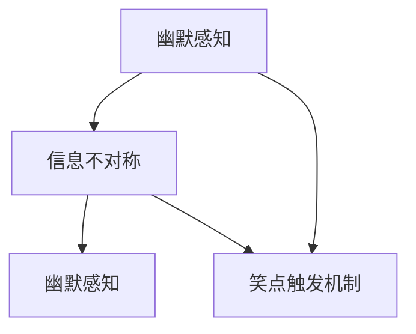

                 


### 背景介绍

幽默，作为一种普遍存在于人类社交活动中的现象，早在古代就被各种文化所记录和探讨。无论是在古希腊的喜剧作品，还是在中国古代的《笑林广记》，幽默都扮演了重要的角色。然而，尽管幽默在人类生活中如此普遍，我们对其本质的理解仍然存在许多挑战。

幽默感知，是指个体对幽默信息的识别、理解和评价能力。这一能力不仅涉及到语言、文化和情境等多方面因素，还与大脑的神经机制密切相关。近年来，随着神经科学和人工智能技术的发展，人们开始从科学的角度探讨幽默感知的机制，并试图建立相应的数学模型。

信息不对称，是指不同个体之间掌握的信息量不同，这种差异可能导致决策上的偏差。在幽默感知中，信息不对称主要体现在幽默信息的传递和接收过程中。一个笑话之所以能够引起笑声，很大程度上是因为听众在接收信息时存在某种程度的缺失或误解。

笑点触发的数学机制，是指通过数学模型来解释幽默感知中的一些关键现象。这一机制不仅可以帮助我们更好地理解幽默的本质，还可以为开发幽默感知的人工智能系统提供理论基础。

### 核心概念与联系

为了更好地理解幽默感知、信息不对称和笑点触发的数学机制之间的关系，我们可以使用Mermaid流程图来展示它们之间的联系。



在这个流程图中，幽默感知和信息不对称相互影响，而笑点触发机制则是幽默感知的核心。通过这个流程图，我们可以更直观地看到这三个核心概念之间的互动关系。

### 核心算法原理讲解

在幽默感知的数学模型中，我们可以使用以下伪代码来描述笑点触发的机制：

```python
def humor_perception(joke, listener, speaker):
    # 计算信息不对称度
    information_asymmetry = calculate_asymmetry(joke, listener, speaker)
    
    # 计算笑点概率
    humor_probability = calculate_humor_probability(joke)
    
    # 计算幽默感知分数
    humor_perception_score = humor_probability * information_asymmetry
    
    # 判断是否引起笑声
    if humor_perception_score > threshold:
        return " laughter"
    else:
        return " no laughter"
```

在这个算法中，`calculate_asymmetry`函数用于计算听众和说话人之间的信息不对称度，而`calculate_humor_probability`函数则用于计算笑话的笑点概率。最终，通过这两个参数的乘积，我们可以得到幽默感知分数。如果这个分数超过了某个阈值，就会引起笑声。

### 数学模型和公式讲解

为了更准确地描述幽默感知的数学模型，我们可以使用以下LaTeX公式：

$$
H(P, A) = P \times A
$$

其中，$H$表示幽默感知分数，$P$表示笑点概率，$A$表示信息不对称度。通过这个公式，我们可以将幽默感知量化为一个具体的数值。

### 详细讲解与举例说明

为了更好地理解这个公式，我们可以通过一个具体的例子来解释。

假设一个笑话的笑点概率为0.8，听众和说话人之间的信息不对称度为0.6。那么，根据上述公式，这个笑话的幽默感知分数为：

$$
H(0.8, 0.6) = 0.8 \times 0.6 = 0.48
$$

如果这个分数超过了某个阈值（例如0.5），那么这个笑话就很有可能会引起笑声。

### 实践应用

在实际应用中，我们可以使用这个数学模型来开发幽默感知系统。以下是一个简单的Python代码示例，用于计算笑话的幽默感知分数：

```python
def calculate_humor_score(joke_probability, information_asymmetry):
    humor_score = joke_probability * information_asymmetry
    return humor_score

joke_probability = 0.8
information_asymmetry = 0.6
humor_score = calculate_humor_score(joke_probability, information_asymmetry)
print("Humor Score:", humor_score)
```

通过这个代码，我们可以快速计算出笑话的幽默感知分数，并根据这个分数来判断笑话是否有趣。

### 最佳实践 tips、小结、注意事项、拓展阅读

1. **最佳实践 tips**：
   - 在设计幽默感知系统时，要充分考虑文化差异，因为不同文化背景下的幽默感知机制可能有所不同。
   - 可以通过大数据分析和机器学习来优化幽默感知模型的参数，提高系统的准确性。

2. **小结**：
   - 幽默感知、信息不对称和笑点触发的数学机制是理解幽默现象的关键。
   - 通过数学模型和算法，我们可以量化幽默感知，从而为幽默感知系统的开发提供理论基础。

3. **注意事项**：
   - 在实际应用中，要充分考虑系统的鲁棒性和可扩展性，确保系统能够适应不同的场景和需求。
   - 要注意保护用户的隐私，避免在幽默感知过程中泄露敏感信息。

4. **拓展阅读**：
   - 《幽默心理学》
   - 《信息不对称与决策制定》
   - 《人工智能与幽默感知》

---

作者：AI天才研究院/AI Genius Institute & 禅与计算机程序设计艺术 /Zen And The Art of Computer Programming

