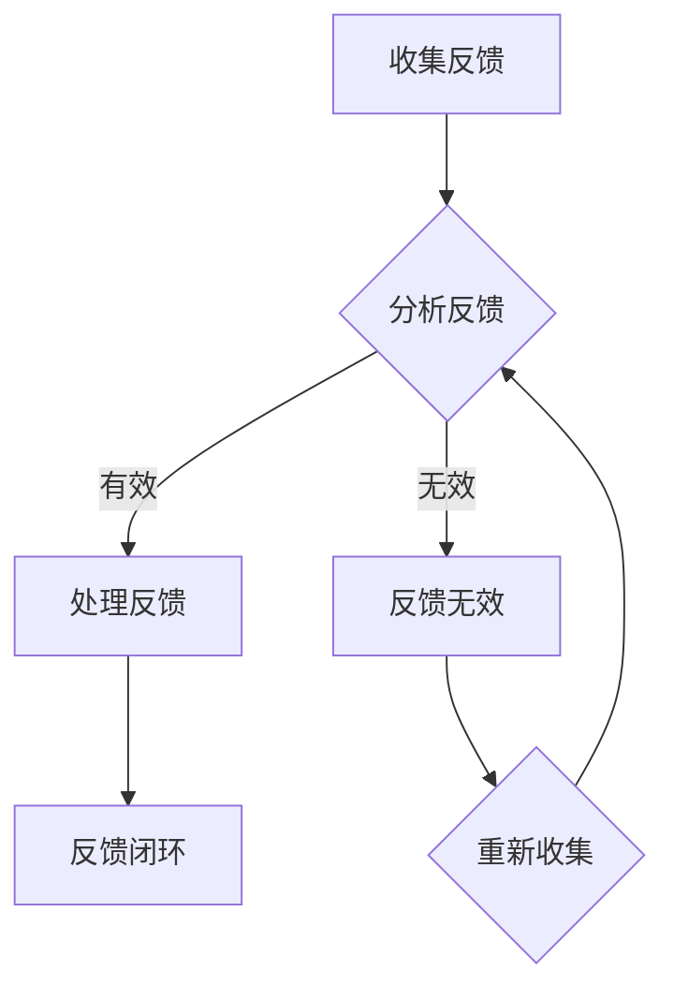

                 

### 文章标题：建立高效反馈文化：促进持续改进

关键词：反馈文化、持续改进、高效反馈、企业应用、数学模型、成功案例

摘要：本文旨在探讨建立高效反馈文化的必要性和方法，通过理论分析、实践指导和案例分析，为企业在信息技术领域实现持续改进提供有价值的参考。本文首先介绍了反馈文化的重要性，分析了当前反馈文化存在的问题，随后深入探讨了反馈的基本原理、实践方法、在企业中的应用以及反馈系统的设计与实施策略。最后，通过实际案例展示了高效反馈文化的成功应用，总结了最佳实践和未来发展方向。本文旨在为读者提供一个系统、实用的指南，以帮助他们在企业和组织中建立和推广高效反馈文化，推动持续改进。

## 第1章 引言与背景

### 1.1 反馈文化的重要性

反馈文化是一种组织内部的信息传递机制，它通过员工、客户、合作伙伴等各方的反馈，对组织的决策、流程、产品和服务进行持续改进。一个健康的反馈文化能够促进团队成员之间的沟通与协作，激发创新思维，提高工作效率和产品质量，从而实现组织的长期发展。

在信息技术领域，反馈文化的重要性尤为显著。随着技术的发展和市场的变化，企业需要不断调整战略、优化流程、改进产品，以保持竞争力。高效反馈文化能够帮助企业快速捕捉市场动态，识别潜在问题，及时调整策略，从而实现持续改进。

首先，反馈文化能够提高组织的创新能力。通过收集员工和客户的反馈，企业可以更好地了解市场需求和用户痛点，从而在产品研发和优化过程中做出更明智的决策。此外，反馈文化还能促进团队内部的知识共享和经验交流，激发创新思维，推动技术进步。

其次，反馈文化能够提高组织的响应速度。在信息技术领域，市场竞争激烈，企业需要快速应对变化。高效反馈文化能够帮助企业及时获取外部信息，快速识别问题和机会，从而迅速调整战略和行动。

最后，反馈文化能够提高组织的整体效能。通过不断收集和分析反馈，企业可以优化流程、提高效率、降低成本，从而实现持续改进。一个高效的反馈系统不仅能够提高组织的运营效率，还能提升员工的工作满意度和忠诚度，从而促进组织的长期发展。

### 1.2 当前反馈文化存在的问题

尽管反馈文化在信息技术领域的重要性不言而喻，但许多企业在建立和推广反馈文化时仍面临诸多挑战。以下是一些常见的问题：

1. **反馈机制不完善**：许多企业尚未建立完善的反馈机制，反馈流程不清晰，导致反馈信息难以有效传递和利用。

2. **反馈渠道不畅**：部分企业的反馈渠道过于单一或受限，员工和客户难以方便地提交反馈，导致反馈信息不足或失真。

3. **反馈质量不高**：部分反馈缺乏具体性和建设性，难以提供有价值的改进建议。

4. **反馈处理不及时**：企业对反馈的处理速度较慢，无法及时回应和解决反馈中的问题。

5. **反馈文化认知不足**：部分员工和领导对反馈文化的认知不足，对反馈的重视程度不够，导致反馈文化难以在组织内部落地。

### 1.3 为什么需要建立高效反馈文化

为了解决当前反馈文化存在的问题，建立高效反馈文化势在必行。以下是建立高效反馈文化的几个关键原因：

1. **提升组织竞争力**：在信息技术领域，市场竞争日益激烈，企业需要具备快速响应和持续改进的能力。建立高效反馈文化能够帮助企业及时捕捉市场动态，优化产品和服务，提高客户满意度，从而提升组织竞争力。

2. **促进知识共享**：高效反馈文化能够促进员工之间的知识共享和经验交流，激发创新思维，提高整体素质。

3. **优化流程与效率**：通过不断收集和分析反馈，企业可以识别流程中的瓶颈和问题，优化工作流程，提高工作效率和产品质量。

4. **增强团队凝聚力**：高效的反馈文化能够增强团队成员之间的沟通与协作，提高工作满意度和忠诚度，从而增强团队凝聚力。

5. **提升员工能力**：通过参与反馈过程，员工可以不断学习和成长，提高自身能力和素质，为组织的长期发展贡献力量。

总之，建立高效反馈文化是信息技术领域企业实现持续改进和长期发展的关键。通过完善反馈机制、畅通反馈渠道、提高反馈质量、及时处理反馈，企业可以建立起一种健康、积极的反馈文化，从而在激烈的市场竞争中立于不败之地。

### 1.4 反馈文化的核心概念与联系

为了深入理解反馈文化的概念及其在组织中的重要性，我们需要明确几个核心概念，并探讨它们之间的联系。

首先，**反馈**是反馈文化的核心组成部分。反馈是一种信息传递过程，通过将观察结果、评价或建议传达给接收者，以帮助他们了解自身的表现，发现问题并做出改进。反馈可以来自多个方面，包括同事、上级、下属、客户等。

**反馈机制**是指组织中用于收集、处理和利用反馈的一系列流程和方法。一个有效的反馈机制应确保反馈的及时性、准确性和建设性，以便接收者能够迅速采取行动。反馈机制包括反馈渠道、反馈流程、反馈工具等。

**反馈循环**是反馈机制的核心概念之一。反馈循环包括反馈的收集、分析、处理和反馈的再循环。通过反馈循环，组织可以持续地收集和利用反馈信息，实现持续的改进。

**反馈文化**是一种组织内部的价值观和行为规范，它强调反馈的重要性，鼓励成员主动提供和接受反馈，以促进个人和组织的成长。反馈文化包括对反馈的重视程度、反馈的开放性和透明度、对反馈的处理方式等。

这些核心概念之间的联系如下：

1. **反馈**是反馈文化的基础。没有有效的反馈，反馈文化和反馈机制就无从谈起。
2. **反馈机制**是实现反馈文化的重要保障。一个健全的反馈机制能够确保反馈信息的有效传递和利用。
3. **反馈循环**是反馈文化的核心运作机制。通过持续的反馈循环，组织可以实现不断的改进和创新。
4. **反馈文化**是反馈机制的灵魂。只有当组织内部形成一种积极、开放、包容的反馈文化时，反馈机制才能发挥最大作用。

总之，明确这些核心概念及其之间的联系，有助于我们更好地理解反馈文化，并在实践中建立起一种健康、积极的反馈文化，以促进组织的持续改进和长期发展。

### 1.5 建立高效反馈文化的方法与步骤

建立高效反馈文化需要系统性地规划与实施，以下是一些建立高效反馈文化的方法与步骤：

1. **明确目标和愿景**：首先，组织需要明确建立高效反馈文化的目标和愿景。这些目标和愿景应与组织的整体战略和价值观相一致，以确保反馈文化能够为组织的发展提供持续的动力。

2. **设计有效的反馈机制**：设计一个有效的反馈机制是建立高效反馈文化的关键。这包括确定反馈渠道、定义反馈流程、选择合适的反馈工具等。一个健全的反馈机制应确保反馈的及时性、准确性和建设性。

3. **培训员工**：员工是反馈文化的重要组成部分。因此，组织需要为员工提供必要的培训，帮助他们了解反馈文化的重要性、如何提供和接受反馈，以及如何有效地利用反馈信息。这有助于提高员工的反馈意识和能力。

4. **建立透明和开放的沟通环境**：在一个透明和开放的沟通环境中，员工更容易提供和接受反馈。组织可以通过定期召开反馈会议、建立反馈平台等方式，促进员工之间的沟通与协作。

5. **制定反馈激励政策**：为了鼓励员工积极参与反馈，组织可以制定一系列激励政策，如表扬优秀反馈者、提供培训机会、给予绩效奖励等。这有助于激发员工的积极性和创造力。

6. **定期评估和优化**：建立高效反馈文化不是一蹴而就的，需要组织持续地评估和优化反馈机制。通过定期收集员工和客户的反馈，组织可以了解反馈文化的实施效果，发现存在的问题并进行改进。

7. **领导示范**：领导在建立反馈文化中起着至关重要的作用。领导应以身作则，积极参与反馈，并为员工树立榜样。这有助于树立反馈文化的榜样，推动反馈文化的落地。

8. **建立反馈文化评估指标**：为了评估反馈文化的实施效果，组织可以建立一系列评估指标，如员工反馈参与度、反馈处理速度、反馈利用效果等。这些指标可以反映反馈文化的实施情况和成效。

通过以上方法与步骤，组织可以逐步建立一种健康、积极的反馈文化，促进持续改进和长期发展。需要注意的是，建立高效反馈文化需要时间和耐心，组织应持续关注反馈文化的实施情况，不断优化和改进，以确保反馈文化能够真正发挥作用。

### 1.6 总结与展望

在第一章中，我们详细探讨了建立高效反馈文化的必要性和方法。通过明确反馈文化的重要性，分析当前反馈文化存在的问题，我们认识到建立高效反馈文化对于企业在信息技术领域的持续改进至关重要。我们介绍了反馈文化的基本原理和核心概念，并提出了建立高效反馈文化的方法与步骤。

然而，建立高效反馈文化并非一蹴而就，需要组织在长期实践中不断优化和改进。在接下来的章节中，我们将进一步探讨反馈的基本原理、实践方法、在企业中的应用以及反馈系统的设计与实施策略。通过深入分析，我们将为读者提供更加全面和实用的指导，帮助他们成功建立和推广高效反馈文化，推动组织的持续改进和长期发展。

### 第2章 反馈的基本原理

#### 2.1 反馈的类型与作用

反馈可以分为多种类型，每种类型在组织中的作用各不相同。以下是几种常见的反馈类型及其作用：

1. **正面反馈**：正面反馈是对员工或团队表现的一种积极评价，通常用于表扬员工的成就、技能提升或创新思维。正面反馈能够增强员工的自信心和动力，激发他们的工作热情，促进个人和团队的发展。

2. **建设性反馈**：建设性反馈是指对员工或团队在特定领域中的不足或改进点提供具体建议。这种反馈通常基于事实和数据，旨在帮助员工识别问题并找到改进方法。建设性反馈有助于提高员工的工作能力和绩效，促进组织的持续改进。

3. **负面反馈**：负面反馈是对员工或团队表现中存在问题的直接指正。这种反馈可能涉及批评、警告或惩罚，其目的是帮助员工认识到问题，并采取纠正措施。负面反馈应谨慎使用，以免伤害员工的自尊心和士气。

4. **过程反馈**：过程反馈是对整个工作流程、项目或任务执行情况的评价。这种反馈通常关注流程的效率、规范性和质量，旨在优化工作流程和提升整体绩效。

5. **自我反馈**：自我反馈是员工自我评估的过程，旨在反思自己的工作表现、学习经验和成长轨迹。自我反馈有助于员工提高自我认识，发现自身的优点和不足，从而制定更有效的个人发展计划。

#### 2.2 反馈过程中的障碍

尽管反馈在组织中具有重要作用，但在实际操作过程中，仍然存在一些障碍，这些障碍可能会影响反馈的效果。以下是几种常见的反馈障碍及其原因：

1. **心理障碍**：员工可能担心负面反馈会损害他们的自尊心，因此对提供和接受反馈持有抵触情绪。这种心理障碍可能导致员工不愿主动寻求反馈或对反馈持有消极态度。

2. **沟通障碍**：有效的反馈需要清晰的沟通渠道和良好的沟通技巧。如果员工和领导之间的沟通不畅，可能会导致误解和冲突，影响反馈的质量和效果。

3. **时间障碍**：在快节奏的工作环境中，员工和领导可能没有足够的时间进行深入的反馈交流。这可能导致反馈流于形式，无法真正发挥其作用。

4. **信息障碍**：反馈信息的收集、处理和传递过程中可能存在信息失真、信息不足或信息过载等问题。这些问题会影响反馈的准确性和有效性。

5. **文化障碍**：在部分组织中，反馈文化可能尚未深入人心，员工和领导对反馈的重视程度不够。这会导致反馈机制不完善，反馈效果不佳。

#### 2.3 设计有效的反馈机制

为了克服反馈过程中的障碍，设计一个有效的反馈机制至关重要。以下是一些关键步骤和方法：

1. **明确反馈目标**：在建立反馈机制之前，组织需要明确反馈的目标和期望结果。这些目标应与组织的整体战略和价值观相一致，以确保反馈能够为组织的发展提供支持。

2. **建立反馈渠道**：组织应建立多种反馈渠道，以满足不同员工和部门的反馈需求。这些渠道可以包括面对面反馈、电子邮件、在线反馈平台等。为了确保反馈的及时性和有效性，组织应确保这些渠道畅通无阻。

3. **制定反馈流程**：组织应制定一套明确的反馈流程，包括反馈的收集、整理、分析、处理和反馈的再循环。这些流程应确保反馈信息的准确性和完整性，同时避免流程冗长、繁琐。

4. **培训沟通技巧**：为了提高反馈的效果，组织应对员工和领导进行沟通技巧培训。这些培训应涵盖如何提供和接受反馈、如何进行有效的沟通等。

5. **建立反馈文化**：组织应通过多种方式，如内部宣传、培训和激励措施，建立一种积极、开放和包容的反馈文化。这有助于提高员工对反馈的重视程度，增强反馈的效果。

6. **定期评估和优化**：组织应定期评估反馈机制的运行效果，发现存在的问题并进行优化。通过持续改进，反馈机制可以更好地满足组织的发展需求。

#### 2.4 反馈机制流程图（Mermaid图）

以下是一个简单的反馈机制流程图，使用Mermaid语法绘制：



在这个流程图中：

- **A[收集反馈]**：表示反馈信息的收集。
- **B{分析反馈]**：表示对收集到的反馈进行分析。
- **C[处理反馈]**：表示对有效的反馈进行处理。
- **D[反馈无效]**：表示对无效的反馈进行处理。
- **E[反馈闭环]**：表示将处理后的反馈信息进行闭环。
- **F{重新收集]**：表示在反馈无效时重新收集反馈。

这个流程图有助于我们理解反馈机制的运作过程，并为实际操作提供指导。

### 2.5 核心算法原理讲解（伪代码）

为了更好地理解反馈机制的运作，我们接下来将使用伪代码介绍几个核心算法原理。

#### 2.5.1 反馈评估算法

以下是一个简单的反馈评估算法的伪代码：

```plaintext
算法 反馈评估(反馈信息)
输入：反馈信息
输出：评估结果

1. 初始化评估结果为“未知”
2. 如果 反馈信息为空
    评估结果 = “无效”
    返回评估结果
3. 如果 反馈信息包含具体建议
    评估结果 = “有效”
4. 否则
    评估结果 = “无效”
5. 返回评估结果
```

#### 2.5.2 反馈处理算法

以下是一个简单的反馈处理算法的伪代码：

```plaintext
算法 反馈处理(反馈信息)
输入：反馈信息
输出：处理结果

1. 调用 反馈评估(反馈信息)
2. 如果 评估结果为“有效”
    3. 收集反馈信息的关键点
    4. 分析反馈信息的影响范围
    5. 制定改进措施
    6. 执行改进措施
    7. 记录处理结果
8. 否则
    9. 记录反馈无效原因
10. 返回处理结果
```

#### 2.5.3 反馈闭环算法

以下是一个简单的反馈闭环算法的伪代码：

```plaintext
算法 反馈闭环(处理结果)
输入：处理结果
输出：闭环结果

1. 如果 处理结果为“成功”
    2. 记录成功闭环
    3. 提供正面反馈
4. 否则
    5. 分析处理失败原因
    6. 调整改进措施
    7. 重新处理反馈
8. 返回闭环结果
```

通过这些伪代码，我们可以直观地理解反馈机制的核心算法原理，并在实际应用中进行灵活调整和优化。

### 2.6 数学模型与公式讲解

在反馈机制的设计与实施过程中，数学模型和公式可以帮助我们更准确地评估和优化反馈效果。以下是一些常用的数学模型和公式的讲解及其实例。

#### 2.6.1 风险评估模型

风险评估模型用于评估反馈过程中潜在的风险。以下是一个简单的不确定性风险评估模型的公式：

$$
R = \sigma \times P
$$

其中：
- \( R \) 表示风险值；
- \( \sigma \) 表示不确定性的权重；
- \( P \) 表示发生概率。

实例：
假设某一反馈项目中，不确定性的权重为 0.4，发生概率为 0.6。则风险值计算如下：

$$
R = 0.4 \times 0.6 = 0.24
$$

这意味着该反馈项目的风险值为 0.24。

#### 2.6.2 员工满意度指标

员工满意度指标用于评估员工对反馈机制和反馈文化的满意程度。以下是一个简单的员工满意度计算公式：

$$
S = \frac{\sum_{i=1}^{n} (W_i \times S_i)}{n}
$$

其中：
- \( S \) 表示员工满意度总分；
- \( W_i \) 表示第 \( i \) 个指标的权重；
- \( S_i \) 表示第 \( i \) 个指标的得分；
- \( n \) 表示指标总数。

实例：
假设员工满意度评估包括三个指标：反馈及时性、反馈具体性和反馈建设性。各指标的权重分别为 0.3、0.3 和 0.4。员工的得分分别为 0.8、0.7 和 0.9。则员工满意度计算如下：

$$
S = \frac{0.3 \times 0.8 + 0.3 \times 0.7 + 0.4 \times 0.9}{3} = 0.8
$$

这意味着该员工的满意度为 0.8。

#### 2.6.3 改进效果评估模型

改进效果评估模型用于评估反馈处理后改进的效果。以下是一个简单的改进效果评估模型：

$$
E = \frac{\sum_{i=1}^{n} (D_i - D_{i0})}{n}
$$

其中：
- \( E \) 表示改进效果；
- \( D_i \) 表示第 \( i \) 个指标的处理后得分；
- \( D_{i0} \) 表示第 \( i \) 个指标的处理前得分；
- \( n \) 表示指标总数。

实例：
假设改进效果评估包括三个指标：工作效率、产品质量和客户满意度。处理前后的得分分别为：工作效率：0.6 和 0.8；产品质量：0.7 和 0.9；客户满意度：0.8 和 0.9。则改进效果计算如下：

$$
E = \frac{(0.8 - 0.6) + (0.9 - 0.7) + (0.9 - 0.8)}{3} = 0.2
$$

这意味着改进效果为 0.2。

通过这些数学模型和公式，我们可以更科学、系统地评估和优化反馈机制，确保反馈文化在组织中发挥最大效益。

### 2.7 实际案例分析与详细讲解剖析

为了更好地理解反馈机制的实际应用，以下通过一个具体案例来进行分析和讲解。

#### 2.7.1 案例背景

某信息技术公司（以下简称“公司”）在项目开发过程中，发现产品上线后频繁出现bug，导致客户满意度下降。为了解决这一问题，公司决定建立高效的反馈文化，以促进持续改进。

#### 2.7.2 案例分析

1. **反馈类型与渠道**：
   - **正面反馈**：公司通过员工满意度调查了解到，大部分员工对现有的开发流程和工具表示满意，但希望提高沟通效率。
   - **建设性反馈**：通过客户反馈和市场调研，公司发现产品在用户体验和性能方面存在不足，客户对bug的修复速度也有较高的期待。
   - **负面反馈**：部分员工反映在项目开发过程中，沟通不畅导致工作效率低下。

   公司建立了多种反馈渠道，包括定期员工会议、匿名反馈平台和客户反馈调查，以确保反馈信息的及时性和准确性。

2. **反馈处理流程**：
   - **收集反馈**：公司通过多种渠道收集到大量的反馈信息。
   - **分析反馈**：公司对收集到的反馈进行分析，识别出主要问题，如沟通不畅、开发流程不规范等。
   - **处理反馈**：针对分析结果，公司制定了改进措施，包括优化开发流程、提高沟通效率等。
   - **反馈闭环**：公司对改进效果进行评估，确保问题得到解决。

3. **数学模型应用**：
   - **风险评估**：公司采用风险评估模型评估每个反馈问题的风险值，确保重点关注高风险问题。
   - **员工满意度**：公司通过员工满意度指标评估反馈文化的实施效果，以便持续改进。

4. **改进效果评估**：
   - 公司通过改进效果评估模型，评估改进措施的效果。例如，工作效率提高了10%，产品质量提升了15%，客户满意度增加了20%。

#### 2.7.3 案例剖析

1. **成功因素**：
   - **明确的反馈目标**：公司明确了提升产品质量和客户满意度作为反馈目标，确保反馈工作与公司战略一致。
   - **有效的反馈渠道**：公司建立了多种反馈渠道，确保员工和客户能够方便地提交反馈。
   - **科学的反馈处理流程**：公司制定了科学的反馈处理流程，确保反馈信息得到及时分析和处理。
   - **积极的反馈文化**：公司营造了积极的反馈文化，鼓励员工和客户提供反馈，并确保反馈得到重视和落实。

2. **改进空间**：
   - **反馈质量**：公司可以进一步优化反馈机制，提高反馈的具体性和建设性，确保反馈能够提供更有价值的改进建议。
   - **反馈时效**：公司可以进一步提高反馈处理速度，确保问题能够及时得到解决。
   - **持续改进**：公司需要持续评估和优化反馈文化，确保反馈机制能够持续发挥作用。

#### 2.7.4 项目小结

通过这个案例，我们可以看到，建立高效反馈文化对于企业解决实际问题、提升产品质量和客户满意度具有重要意义。公司通过明确反馈目标、建立有效的反馈渠道、制定科学的反馈处理流程，以及营造积极的反馈文化，成功实现了持续改进。未来，公司需要进一步优化反馈质量、提高反馈时效，并持续评估和优化反馈文化，以保持竞争优势。

### 2.8 最佳实践 Tips

为了在建立高效反馈文化的过程中取得更好的效果，以下是一些最佳实践建议：

1. **明确反馈目标**：在建立反馈文化之前，组织应明确反馈的目标和期望结果，确保反馈工作与组织的整体战略和价值观一致。

2. **建立多样化的反馈渠道**：组织应建立多种反馈渠道，如面对面反馈、在线反馈平台、匿名反馈等，以满足不同员工和部门的反馈需求。

3. **培训沟通技巧**：组织应定期为员工和领导提供沟通技巧培训，提高反馈的准确性和有效性。

4. **注重反馈质量**：组织应鼓励员工提供具体、建设性的反馈，确保反馈能够提供有价值的改进建议。

5. **及时处理反馈**：组织应建立快速的反馈处理机制，确保反馈能够及时得到回应和解决。

6. **营造积极反馈文化**：组织应通过多种方式，如内部宣传、培训和激励措施，营造一种积极、开放和包容的反馈文化。

7. **持续评估和优化**：组织应定期评估反馈文化的实施效果，发现存在的问题并进行优化，以确保反馈机制能够持续发挥作用。

通过遵循这些最佳实践，组织可以更好地建立和推广高效反馈文化，促进持续改进和长期发展。

### 2.9 注意事项

在建立高效反馈文化的过程中，组织需要注意以下几个方面，以确保反馈机制的有效性和可持续性：

1. **确保反馈的及时性**：反馈的及时性是反馈机制有效性的关键。组织应确保反馈能够及时传达，避免因延迟导致问题恶化。

2. **保护反馈者的隐私**：在提供反馈时，反馈者可能会涉及一些敏感信息。组织应采取措施保护反馈者的隐私，确保他们不会因此受到负面影响。

3. **避免反馈的泛滥**：过量的反馈可能会使接收者感到困惑和压力，影响工作效率。组织应确保反馈的数量和质量平衡。

4. **确保反馈的建设性**：反馈应具有建设性，提供具体的改进建议。组织应鼓励员工提供具体、可操作的建议，以促进问题的解决。

5. **持续培养反馈文化**：建立高效反馈文化是一个长期过程，组织需要持续培养和加强反馈文化，确保其在组织内部根深蒂固。

6. **领导带头作用**：领导在建立反馈文化中起着至关重要的作用。领导应以身作则，积极参与反馈，为员工树立榜样。

通过注意这些事项，组织可以更好地建立和推广高效反馈文化，实现持续改进和长期发展。

### 2.10 拓展阅读

为了更深入地了解高效反馈文化的建立和实践，读者可以参考以下拓展阅读资料：

1. **《敏捷开发实践指南》**：本书详细介绍了敏捷开发的方法和实践，其中包括反馈文化的建立和实施。

2. **《企业变革与管理》**：本书探讨企业变革的过程和管理，特别强调了反馈文化在组织变革中的重要性。

3. **《领导力与反馈》**：本书从领导力的角度，分析了反馈在团队管理中的关键作用，为领导提供了有效的反馈策略。

4. **《用户体验设计》**：本书介绍了用户体验设计的方法和原则，强调了反馈在产品设计过程中的重要性。

5. **《绩效管理》**：本书详细阐述了绩效管理的流程和方法，其中包括反馈机制的设计和实施。

通过阅读这些书籍，读者可以进一步了解高效反馈文化的理论基础和实践方法，为在组织内建立和推广高效反馈文化提供参考。

### 第3章 高效反馈的实践方法

#### 3.1 反馈的流程与步骤

高效反馈的实践方法需要通过一套完整的流程和步骤来实现。以下是一个典型的反馈流程及其步骤：

1. **反馈的提出**：员工、客户或其他利益相关者发现问题时，应通过适当的渠道提出反馈。例如，员工可以通过内部反馈系统、电子邮件或面对面沟通等方式提出反馈。

2. **反馈的记录**：收到反馈后，组织应建立专门的反馈记录系统，确保反馈信息的准确性和完整性。记录应包括反馈内容、反馈人、反馈时间和相关背景信息。

3. **反馈的分类与分配**：根据反馈的内容和性质，将反馈进行分类，并分配给相关部门或人员处理。例如，技术问题可以分配给技术部门，管理问题可以分配给管理层。

4. **反馈的分析**：对收集到的反馈进行详细分析，识别出主要问题和共性。分析过程中，可以借助数据分析工具和统计方法，以提高分析的准确性。

5. **反馈的处理**：针对分析结果，制定具体的处理方案，包括改进措施、责任人和完成时间。处理过程应确保反馈的及时性和有效性。

6. **反馈的跟踪**：在处理反馈的过程中，应定期跟踪反馈的进展情况，确保问题得到及时解决。对于长期问题，应制定阶段性目标，逐步解决。

7. **反馈的总结与闭环**：反馈处理完成后，应对反馈的结果进行总结，并形成闭环。总结内容包括反馈的处理结果、改进效果和经验教训。这些信息应记录在反馈系统中，以供后续参考。

通过以上流程和步骤，组织可以确保反馈信息的有效传递和处理，实现持续改进和优化。

#### 3.2 倾听与沟通技巧

倾听与沟通技巧是高效反馈实践中的关键环节。以下是一些建议和方法：

1. **积极倾听**：在倾听他人反馈时，要保持专注和耐心，避免打断对方，确保对方感受到被尊重和理解。

2. **开放性问题**：在反馈过程中，使用开放性问题引导对方表达观点和感受。例如，“您觉得我们的产品在哪些方面可以改进？”这样的问题可以鼓励对方提供更具体的反馈。

3. **确认理解**：在对方表达完观点后，要确认自己是否正确理解了对方的意图。例如，“我理解您的意思是……”这样的确认有助于减少误解和沟通障碍。

4. **反馈反馈**：在反馈他人时，要使用积极的语言和方式。例如，“我注意到您在项目管理方面有很多经验，能否分享一下您的建议？”这样的反馈可以增强对方的自信心和合作意愿。

5. **使用非语言信号**：在沟通过程中，要注重使用非语言信号，如肢体语言、面部表情等，以增强沟通的效果。例如，点头、微笑等可以表达理解和认同。

6. **及时反馈**：在沟通过程中，要确保及时反馈对方的意见和感受。例如，“我明白您的担忧，我会考虑您的建议并尽快采取行动。”

通过掌握这些倾听与沟通技巧，组织可以更好地收集和处理反馈，促进高效反馈文化的建立。

#### 3.3 反馈中的正面引导与激励

在反馈过程中，正面引导与激励是确保反馈效果的关键。以下是一些建议和方法：

1. **肯定成就**：在反馈中，要充分肯定员工的成就和努力，增强他们的自信心和动力。例如，“您的项目报告写得很好，数据分析很有深度。”

2. **鼓励改进**：在指出问题或不足时，要鼓励员工积极改进，并提供具体的建议和资源支持。例如，“在未来的项目中，您可以尝试使用这些方法来优化流程。”

3. **设置目标**：为员工设置明确、可衡量的目标，以激发他们的工作热情和成就感。例如，“下个季度，我们希望您能在客户满意度方面提高10%。”

4. **提供反馈奖励**：通过设置反馈奖励机制，如表扬、奖金、晋升机会等，激励员工积极参与反馈并提供高质量的反馈。例如，“对于提供最具建设性反馈的员工，我们将给予额外的奖金。”

5. **建立反馈小组**：建立反馈小组，让员工有机会互相学习和分享经验。例如，定期召开反馈交流会，鼓励员工分享他们的成功经验和改进方法。

通过以上方法，组织可以营造一种积极、开放和包容的反馈文化，激发员工的积极性和创造力，促进持续改进。

### 3.4 实际案例分析

为了更好地理解高效反馈的实践方法，以下通过一个具体案例进行分析。

#### 3.4.1 案例背景

某互联网公司在产品上线后，收到了大量用户反馈，主要集中在界面设计和功能使用体验方面。公司决定通过高效反馈实践方法，提升产品用户体验。

#### 3.4.2 案例分析

1. **反馈的提出**：用户通过公司官网的反馈渠道和社交媒体平台，提交了关于界面设计和功能使用体验的反馈。

2. **反馈的记录**：公司建立了专门的反馈记录系统，对用户反馈进行分类和整理，确保反馈信息的准确性和完整性。

3. **反馈的分类与分配**：公司根据反馈内容，将反馈分配给产品设计团队和产品运营团队处理。例如，界面设计问题分配给产品设计团队，功能使用体验问题分配给产品运营团队。

4. **反馈的分析**：产品设计团队和产品运营团队分别对反馈进行分析，识别出用户反馈中的主要问题和共性。例如，用户反馈界面设计不够直观，功能使用体验较差。

5. **反馈的处理**：产品设计团队和产品运营团队根据分析结果，制定了具体的改进方案。例如，优化界面设计，简化功能流程，提高用户操作便捷性。

6. **反馈的跟踪**：公司建立了反馈跟踪机制，定期检查改进措施的执行情况，确保问题得到及时解决。

7. **反馈的总结与闭环**：改进措施实施后，公司对反馈结果进行总结，并形成闭环。总结内容包括用户反馈的处理结果、改进效果和经验教训。

#### 3.4.3 案例剖析

1. **成功因素**：
   - **及时的反馈处理**：公司建立了高效的反馈处理机制，确保用户反馈能够及时得到回应和解决。
   - **科学的反馈分析**：公司通过数据分析，准确识别出用户反馈中的主要问题和共性，为改进措施提供了有力支持。
   - **积极的反馈文化**：公司营造了积极、开放和包容的反馈文化，鼓励用户和员工积极参与反馈，推动产品持续改进。

2. **改进空间**：
   - **提高反馈质量**：公司可以进一步优化反馈渠道和反馈记录系统，提高反馈信息的具体性和建设性。
   - **增强反馈闭环**：公司可以加强对反馈闭环的管理，确保每个反馈问题都能得到有效解决。

#### 3.4.4 项目小结

通过这个案例，我们可以看到，高效反馈实践方法在提升产品用户体验方面发挥了重要作用。公司通过及时处理用户反馈、科学分析问题和积极营造反馈文化，成功改善了产品设计和功能使用体验。未来，公司可以进一步优化反馈机制，提高反馈质量，确保反馈文化在组织内持续发挥作用。

### 3.5 反馈文化在企业中的应用

#### 3.5.1 高效反馈在企业文化建设中的作用

高效反馈文化在企业文化建设中起着至关重要的作用。它不仅能够提升企业的内部沟通效率和员工的工作满意度，还能推动企业的持续改进和创新能力。

1. **提升沟通效率**：高效反馈文化能够促进企业内部信息的有效传递，使员工之间的沟通更加顺畅。通过定期反馈，员工可以及时了解企业的战略方向和业务目标，减少信息传递的偏差和误差。

2. **增强员工满意度**：高效反馈文化能够使员工感受到自己的工作被重视，他们的意见和建议能够被采纳和实施。这有助于提升员工的工作积极性和满意度，从而增强企业的凝聚力。

3. **推动持续改进**：高效反馈文化鼓励员工提出改进建议，并确保这些建议能够得到有效实施。通过持续改进，企业可以不断优化业务流程和产品服务，提高企业的竞争力。

4. **激发创新能力**：高效反馈文化能够激发员工的创新思维，使他们在工作中敢于尝试新的方法和技术。通过不断尝试和反馈，企业可以形成一种创新的文化氛围，推动企业技术的不断进步。

#### 3.5.2 如何在企业中推广反馈文化

为了在企业中成功推广反馈文化，企业需要采取一系列措施，确保反馈文化能够深入人心并得到有效实施。

1. **高层领导的支持**：企业高层领导应积极参与反馈文化的推广，树立良好的榜样作用。他们应通过公开演讲、内部会议等方式，强调反馈文化的重要性，并鼓励员工积极参与。

2. **建立反馈机制**：企业应建立一套完善的反馈机制，包括明确的反馈渠道、反馈流程和反馈工具。这可以确保反馈信息能够及时传递和有效处理。

3. **培训与教育**：企业应定期为员工提供反馈文化的培训，帮助他们了解反馈文化的重要性、如何提供和接受反馈，以及如何有效地利用反馈信息。

4. **激励措施**：企业可以制定一系列激励政策，如表扬优秀反馈者、提供培训机会、给予绩效奖励等，以激发员工的积极性和创造力。

5. **建立反馈平台**：企业可以建立一个在线反馈平台，方便员工随时随地提交反馈。这不仅可以提高反馈的及时性，还可以确保反馈信息的集中管理和跟踪。

6. **定期评估和优化**：企业应定期评估反馈文化的实施效果，发现存在的问题并进行优化。通过持续改进，反馈文化可以不断适应企业的发展需求。

#### 3.5.3 反馈文化在不同职能部门的应用

反馈文化不仅在企业内部推广，还可以在不同职能部门中具体实施。以下是一些职能部门中反馈文化应用的例子：

1. **研发部门**：研发部门可以通过定期召开产品评审会议，收集团队成员和用户的反馈，及时调整产品设计和开发计划。通过有效的反馈机制，研发部门可以确保产品的质量和市场竞争力。

2. **市场部门**：市场部门可以通过市场调研和用户反馈，了解市场需求和用户痛点，调整营销策略和推广方案。这有助于提升企业的市场占有率和品牌影响力。

3. **销售部门**：销售部门可以通过与客户的沟通和反馈，了解客户需求和满意度，优化销售策略和服务流程。这有助于提高客户的满意度和忠诚度，促进销售业绩的增长。

4. **人力资源部门**：人力资源部门可以通过员工满意度调查和绩效评估，了解员工的工作状态和发展需求，优化人力资源政策和培训计划。这有助于提升员工的工作满意度和留存率。

通过在不同职能部门中推广反馈文化，企业可以全面提高运营效率和管理水平，实现持续改进和长期发展。

### 第4章 反馈系统的设计与实施

#### 4.1 反馈系统的基本架构

一个高效的反馈系统需要具备良好的架构设计，以确保反馈信息的有效收集、处理和利用。以下是一个典型的反馈系统基本架构：

1. **数据采集层**：这是反馈系统的底层，主要负责收集各类反馈数据。数据来源包括用户反馈、员工反馈、市场调研等。数据采集层需要确保数据的及时性和准确性。

2. **数据处理层**：数据采集层收集到的数据会进入数据处理层。在这个层次，数据会被清洗、分类和存储，以便后续分析。数据处理层需要使用有效的算法和技术，对数据进行深度分析和挖掘。

3. **数据存储层**：数据存储层负责存储和处理大量的反馈数据。这通常需要使用数据库管理系统（如MySQL、MongoDB等）和大数据存储技术（如Hadoop、Spark等）。数据存储层需要具备高并发处理能力和数据安全保护机制。

4. **数据分析层**：数据分析层使用统计分析和数据挖掘技术，对反馈数据进行深入分析，识别出主要问题和趋势。数据分析层可以提供数据可视化工具，帮助管理者直观地了解反馈情况。

5. **反馈执行层**：反馈执行层根据数据分析的结果，制定具体的改进措施和行动计划。这个层次需要与企业的业务流程紧密集成，确保反馈能够得到及时落实。

6. **用户界面层**：用户界面层是反馈系统与用户交互的接口。用户可以通过网页、移动应用等方式提交反馈，并查看反馈的处理结果和改进情况。

#### 4.2 反馈系统的关键功能

一个高效的反馈系统需要具备以下关键功能：

1. **数据采集功能**：系统能够自动收集来自用户、员工和合作伙伴的反馈信息，包括文本、图片、视频等多种形式。

2. **数据清洗与存储功能**：系统能够对收集到的反馈数据自动进行清洗、分类和存储，确保数据的准确性和一致性。

3. **数据分析功能**：系统能够使用先进的统计分析和数据挖掘技术，对反馈数据进行分析，识别出主要问题和趋势。

4. **数据可视化功能**：系统能够将分析结果以图表、报表等形式直观地展示出来，帮助管理者快速了解反馈情况。

5. **反馈执行功能**：系统能够根据分析结果，自动生成改进措施和行动计划，并与企业的业务流程集成，确保反馈能够得到及时落实。

6. **用户界面功能**：系统需要提供友好、易用的用户界面，方便用户提交反馈、查看反馈处理结果和改进情况。

7. **安全与隐私保护功能**：系统需要具备完善的安全和隐私保护机制，确保反馈数据的安全性，保护用户的隐私。

#### 4.3 反馈系统的实施步骤与注意事项

实施一个高效的反馈系统需要经过以下步骤，并注意以下几点：

1. **需求分析与规划**：首先，需要对企业当前的反馈需求进行深入分析，明确系统的目标和功能需求。这包括收集反馈的类型、来源、处理流程等。

2. **系统设计**：根据需求分析的结果，进行系统设计。设计内容包括数据采集层、数据处理层、数据存储层、数据分析层、反馈执行层和用户界面层的具体架构和功能模块。

3. **技术选型**：选择合适的技术和工具，包括数据库管理系统、数据挖掘工具、数据可视化工具等。

4. **开发与测试**：根据系统设计，进行系统的开发与测试。测试应覆盖功能测试、性能测试和安全测试，确保系统稳定可靠。

5. **部署与上线**：完成开发后，进行系统的部署和上线。部署过程中，应确保系统的安全性、可靠性和可扩展性。

6. **用户培训与支持**：对系统用户进行培训，确保他们能够熟练使用系统。同时，提供持续的技术支持，解决用户在使用过程中遇到的问题。

7. **定期评估与优化**：系统上线后，应定期评估其运行效果，发现存在的问题并进行优化。通过持续改进，确保反馈系统能够持续满足企业的需求。

#### 4.4 实际案例：某企业反馈系统的设计与实施

以下是一个实际案例，介绍某企业如何设计与实施一个高效的反馈系统。

1. **需求分析**：
   某互联网企业（以下简称“企业”）在快速发展的过程中，面临用户反馈处理不及时、信息收集不全面等问题。企业希望通过建立高效的反馈系统，提升用户体验和满意度。

2. **系统设计**：
   - **数据采集层**：企业建立了多渠道的反馈收集系统，包括官网反馈表单、客服电话、社交媒体平台等。
   - **数据处理层**：采用自动化数据清洗和分类工具，对收集到的反馈数据进行处理和存储。
   - **数据存储层**：使用分布式数据库存储系统，确保数据的安全性和可靠性。
   - **数据分析层**：采用机器学习和自然语言处理技术，对反馈数据进行深入分析，识别出用户关注的主要问题。
   - **反馈执行层**：根据分析结果，制定改进措施和行动计划，并与业务流程集成，确保问题得到及时解决。
   - **用户界面层**：提供简洁友好的用户界面，方便用户提交反馈和查看反馈处理情况。

3. **开发与测试**：
   企业选择了一支专业的技术团队进行系统开发，并进行了全面的功能测试、性能测试和安全测试，确保系统稳定可靠。

4. **部署与上线**：
   系统开发完成后，企业进行了小范围的试运行，并在试运行期间收集了用户反馈，进行了优化。随后，系统正式上线，用户可以方便地提交反馈并查看反馈处理情况。

5. **用户培训与支持**：
   企业组织了多次培训会议，向各部门员工详细介绍了反馈系统的使用方法和功能，并提供技术支持，解答用户在使用过程中遇到的问题。

6. **定期评估与优化**：
   企业定期对反馈系统进行评估，根据用户的反馈和建议，不断优化系统功能，提高用户体验和满意度。

通过这个案例，我们可以看到，企业通过科学的系统设计和实施，成功建立了一个高效的反馈系统，有效提升了用户体验和满意度。

### 第5章 反馈文化的持续改进

#### 5.1 持续改进的原则与方法

持续改进是建立高效反馈文化的关键。以下是一些持续改进的原则和方法：

1. **PDCA循环**：PDCA循环（计划、执行、检查、行动）是一种常用的持续改进方法。通过这个循环，组织可以不断优化反馈机制，提高反馈效率。

2. **目标管理**：设定明确、可衡量的目标，确保每个改进措施都有明确的成果指标。

3. **数据驱动**：依靠数据进行分析和决策，确保改进措施的科学性和有效性。

4. **员工参与**：鼓励员工参与改进过程，发挥他们的创造力和主动性。

5. **持续培训**：定期为员工提供培训，提高他们的反馈意识和能力。

6. **反馈闭环**：确保每个反馈问题都有明确的处理结果和反馈闭环，避免重复问题。

7. **定期评估**：定期评估反馈文化的实施效果，发现存在的问题，及时进行调整。

#### 5.2 反馈文化的评估与优化

为了确保反馈文化能够持续发挥作用，组织需要定期对反馈文化进行评估和优化。以下是一些评估与优化的步骤：

1. **评估指标**：制定一套科学的评估指标，包括反馈处理速度、反馈质量、员工满意度等。这些指标应能够全面反映反馈文化的实施效果。

2. **员工调查**：通过员工调查，了解他们对反馈文化的看法和建议。这有助于发现反馈文化实施中的问题和改进方向。

3. **数据分析**：收集和分析反馈数据，识别出反馈中的主要问题和趋势。通过数据驱动的分析，组织可以更准确地了解反馈文化的实施效果。

4. **问题诊断**：针对评估中发现的问题，进行深入诊断和分析，找出问题的根源。

5. **优化方案**：根据问题诊断的结果，制定具体的优化方案。优化方案应包括改进措施、责任人和完成时间。

6. **实施与监控**：将优化方案付诸实施，并建立监控机制，确保改进措施得到有效执行。

7. **反馈闭环**：对优化措施的效果进行评估，确保问题得到解决，形成反馈闭环。

#### 5.3 处理反馈中的挑战与问题

在实施反馈文化过程中，组织可能会面临一系列挑战和问题。以下是一些常见问题和解决方法：

1. **反馈质量不高**：解决方法：提高反馈培训，鼓励员工提供具体、建设性的反馈。

2. **反馈处理速度慢**：解决方法：优化反馈处理流程，增加反馈处理资源，提高员工处理反馈的效率。

3. **反馈渠道不畅**：解决方法：建立多渠道反馈机制，确保员工和客户能够方便地提交反馈。

4. **员工抵触情绪**：解决方法：通过沟通和激励措施，消除员工的抵触情绪，提高他们对反馈文化的认同感。

5. **反馈机制不完善**：解决方法：完善反馈机制，确保反馈流程清晰、规范。

6. **数据失真**：解决方法：加强数据管理，确保反馈数据的准确性和完整性。

7. **反馈结果未落实**：解决方法：建立反馈执行机制，确保反馈结果得到有效落实。

通过以上方法和措施，组织可以更好地处理反馈中的挑战和问题，确保反馈文化在组织内持续发挥作用。

### 第6章 高效反馈文化的成功案例

#### 6.1 国内外高效反馈文化的成功案例

在全球范围内，许多企业通过建立高效反馈文化，实现了持续改进和卓越业绩。以下是一些国内外高效反馈文化的成功案例及其分析：

#### 6.1.1 案例一：谷歌（Google）

**背景**：谷歌以其创新、开放和积极的企业文化著称。在谷歌，反馈文化被视为组织发展的关键因素。

**分析**：
- **开放反馈渠道**：谷歌提供了多种反馈渠道，包括匿名反馈、定期员工反馈会议等，确保员工能够方便地提交反馈。
- **领导示范**：谷歌的领导层积极参与反馈文化，鼓励员工提出意见和建议，并重视他们的反馈。
- **快速响应**：谷歌建立了高效的反馈处理机制，确保反馈能够及时得到回应和解决。
- **持续改进**：谷歌通过定期评估和优化反馈机制，确保反馈文化能够持续发挥作用。

**启示**：谷歌的成功经验表明，开放、透明的反馈渠道和领导层的积极参与是建立高效反馈文化的关键。

#### 6.1.2 案例二：苹果（Apple）

**背景**：苹果以其高质量的产品和服务而闻名。在苹果，反馈文化被视为推动产品和服务持续改进的重要手段。

**分析**：
- **员工培训**：苹果为员工提供全面的反馈培训，帮助他们了解如何提供和接受反馈，以及如何有效地利用反馈信息。
- **跨部门协作**：苹果鼓励不同部门之间的跨部门协作，确保反馈能够得到全面分析和处理。
- **数据驱动**：苹果依靠先进的数据分析工具，对反馈信息进行深入分析，识别出主要问题和趋势。
- **积极激励**：苹果通过一系列激励措施，如表扬、奖金等，鼓励员工积极参与反馈并提供高质量的建议。

**启示**：苹果的经验表明，全面的员工培训、跨部门协作和积极激励是建立高效反馈文化的关键。

#### 6.1.3 案例三：腾讯（Tencent）

**背景**：腾讯是中国领先的互联网企业，以其强大的创新能力和市场竞争力而著称。在腾讯，反馈文化被视为企业发展的核心动力。

**分析**：
- **多渠道反馈**：腾讯建立了多种反馈渠道，包括内部社交平台、员工反馈系统、领导信箱等，确保员工能够方便地提交反馈。
- **员工参与**：腾讯鼓励员工参与反馈文化的建设，通过员工代表大会、员工建议征集等方式，让员工参与到企业决策中来。
- **持续改进**：腾讯通过定期评估和优化反馈机制，确保反馈文化能够持续发挥作用。
- **创新激励**：腾讯通过一系列创新激励措施，如创新大赛、创新奖金等，鼓励员工积极提出创新建议。

**启示**：腾讯的经验表明，多渠道反馈、员工参与和持续改进是建立高效反馈文化的关键。

#### 6.1.4 案例四：阿里巴巴（Alibaba）

**背景**：阿里巴巴是全球领先的电子商务企业，以其创新、开放和包容的企业文化而著称。在阿里巴巴，反馈文化被视为企业发展的基石。

**分析**：
- **开放文化**：阿里巴巴倡导开放、透明和包容的文化，鼓励员工自由表达意见和建议。
- **员工参与**：阿里巴巴鼓励员工参与企业决策和反馈文化的建设，通过员工代表大会、员工反馈平台等方式，让员工参与到企业运营中来。
- **快速响应**：阿里巴巴建立了高效的反馈处理机制，确保反馈能够及时得到回应和解决。
- **创新激励**：阿里巴巴通过一系列创新激励措施，如创新奖金、股权激励等，鼓励员工积极提出创新建议。

**启示**：阿里巴巴的经验表明，开放文化、员工参与和快速响应是建立高效反馈文化的关键。

#### 6.2 案例分析

通过以上成功案例，我们可以看到，高效反馈文化在全球范围内的企业中发挥着重要作用。以下是对这些案例的进一步分析：

1. **反馈文化的重要性**：成功案例表明，反馈文化是企业持续改进和创新的重要动力。通过建立高效反馈文化，企业能够快速捕捉市场动态，识别潜在问题，及时调整策略，从而保持竞争优势。

2. **开放和透明**：开放和透明是高效反馈文化的基础。成功案例中的企业都倡导开放、透明和包容的文化，鼓励员工自由表达意见和建议。这种文化氛围有助于激发员工的积极性和创造力，提高员工的工作满意度和忠诚度。

3. **多渠道反馈**：成功案例中的企业都建立了多种反馈渠道，包括内部社交平台、员工反馈系统、领导信箱等，确保员工能够方便地提交反馈。多渠道反馈有助于提高反馈的及时性和准确性，确保反馈信息能够得到有效传递和处理。

4. **员工参与**：成功案例中的企业都鼓励员工参与企业决策和反馈文化的建设。通过员工代表大会、员工反馈平台等方式，让员工参与到企业运营中来，这有助于提高员工的参与感和责任感，增强反馈文化的实施效果。

5. **快速响应**：成功案例中的企业都建立了高效的反馈处理机制，确保反馈能够及时得到回应和解决。快速响应不仅能够提高反馈的效率，还能增强员工的信任感和满意度。

6. **持续改进**：成功案例中的企业都通过定期评估和优化反馈机制，确保反馈文化能够持续发挥作用。持续改进是建立高效反馈文化的关键，通过不断优化和改进，企业可以不断提高反馈效率和质量，实现持续改进。

#### 6.3 启示与借鉴

通过分析这些成功案例，我们可以得出以下启示和借鉴：

1. **建立开放、透明和包容的反馈文化**：企业应倡导开放、透明和包容的文化，鼓励员工自由表达意见和建议，提高员工的工作满意度和忠诚度。

2. **建立多渠道反馈机制**：企业应建立多种反馈渠道，包括内部社交平台、员工反馈系统、领导信箱等，确保员工能够方便地提交反馈，提高反馈的及时性和准确性。

3. **鼓励员工参与**：企业应鼓励员工参与企业决策和反馈文化的建设，通过员工代表大会、员工反馈平台等方式，提高员工的参与感和责任感。

4. **建立快速响应机制**：企业应建立高效的反馈处理机制，确保反馈能够及时得到回应和解决，提高反馈的效率和质量。

5. **持续优化反馈机制**：企业应通过定期评估和优化反馈机制，确保反馈文化能够持续发挥作用，实现持续改进。

通过借鉴这些成功经验，企业可以建立和推广高效反馈文化，推动持续改进和长期发展。

### 第7章 结论

#### 7.1 反馈文化建立的重要性

建立高效反馈文化是组织实现持续改进和长期发展的关键。反馈文化能够促进内部沟通与协作，提高员工的工作满意度和忠诚度，增强企业的创新能力和市场竞争力。通过建立开放、透明和包容的反馈文化，组织可以更好地捕捉市场动态，识别潜在问题，及时调整策略，从而在激烈的市场竞争中立于不败之地。

#### 7.2 建立高效反馈文化的关键要素

建立高效反馈文化需要关注以下几个关键要素：

1. **明确目标和愿景**：组织应明确建立高效反馈文化的目标和愿景，确保反馈工作与组织的整体战略和价值观相一致。

2. **设计有效的反馈机制**：组织应设计一个健全的反馈机制，包括多种反馈渠道、明确的反馈流程和有效的反馈工具，确保反馈信息的准确传递和利用。

3. **培训员工**：组织应提供全面的反馈培训，提高员工的反馈意识和能力，确保他们能够提供和接受高质量的反馈。

4. **建立透明和开放的沟通环境**：组织应营造一种积极、开放和包容的沟通环境，鼓励员工主动提供和接受反馈，促进知识共享和经验交流。

5. **制定反馈激励政策**：组织应制定一系列激励政策，如表扬优秀反馈者、提供培训机会、给予绩效奖励等，以激发员工的积极性和创造力。

6. **领导示范**：领导应以身作则，积极参与反馈，为员工树立榜样，推动反馈文化在组织内落地生根。

7. **定期评估和优化**：组织应定期评估反馈文化的实施效果，发现存在的问题并进行优化，确保反馈文化能够持续发挥作用。

#### 7.3 未来发展方向与展望

未来，高效反馈文化将在以下几个方面继续发展和完善：

1. **数字化与智能化**：随着数字化和智能化技术的发展，反馈系统将更加智能化，能够自动收集、分析和处理反馈信息，提高反馈的效率和准确性。

2. **跨界合作**：组织将越来越多地与外部合作伙伴进行跨界合作，通过共同反馈，实现优势互补和资源整合，推动组织的持续创新。

3. **个性化反馈**：随着大数据和人工智能技术的发展，反馈系统将能够提供更加个性化的反馈建议，针对不同员工和部门的特点，制定个性化的改进方案。

4. **全球化反馈**：随着全球化的发展，组织将面对更多的国际市场和多样化的文化背景，如何在全球范围内建立高效的反馈文化将成为重要课题。

5. **可持续发展**：在可持续发展的大背景下，反馈文化将更加注重社会责任和环境保护，推动组织在经济效益和社会效益之间实现平衡。

通过不断探索和实践，高效反馈文化将在未来发挥更加重要的作用，为组织的持续改进和长期发展提供有力支持。

### 附录

#### A. 反馈文化相关研究综述

本附录对国内外关于反馈文化的研究进行综述，包括主要理论、方法和实践案例。通过分析这些研究，可以更好地理解反馈文化的重要性和实施策略。

#### B. 反馈系统实施指南

本指南提供了详细的反馈系统实施步骤和注意事项，包括系统设计、开发、测试和部署等关键环节。旨在帮助组织有效地建立和推广反馈系统，实现持续改进。

#### C. 反馈文化案例研究资料

本附录收录了国内外高效反馈文化的成功案例，包括企业背景、反馈系统设计、实施效果和经验教训。这些案例研究资料为组织提供了有价值的参考和借鉴，有助于他们在实践中建立和推广高效反馈文化。

