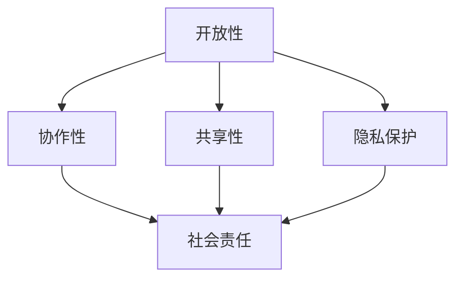

                 


### 引言

#### 开放科学运动的背景和重要性

开放科学运动是一场正在全球范围内兴起的变革，它旨在打破传统的科学研究和知识传播的壁垒，促进全球范围内的知识共享和协作。在这个信息爆炸的时代，科学知识的产生和应用速度越来越快，但与此同时，科学知识的获取和传播也面临着诸多挑战。传统科学研究的封闭性、知识产权的争夺、科学资源的分配不均等问题，严重制约了科学研究的进步和社会发展的速度。

开放科学运动的核心思想是开放性、协作性和共享性。它倡导科学研究过程和成果的公开透明，鼓励科学家之间的合作与交流，推动科学知识的广泛传播和应用。开放科学运动不仅有助于提高科研效率和科技创新能力，还可以促进全球科学共同体的形成，推动科学和社会的可持续发展。

#### 本文的结构和目标

本文旨在深入探讨开放科学运动的概念、背景、核心原则和实践方法，旨在为读者提供一个全面而系统的理解。文章将分为两部分：第一部分介绍开放科学的基础，包括历史发展、哲学与伦理、技术基础和社会影响；第二部分探讨开放科学的实践，包括开放数据的收集与处理、开放协作的研究方法、政策与法规以及案例分析。

本文的目标是帮助读者了解开放科学的重要性和意义，掌握开放科学的实践方法，并为未来的科学研究和知识传播提供一些有价值的思考和参考。

### 背景介绍

#### 开放科学的历史与发展

开放科学运动的起源可以追溯到20世纪中叶，随着计算机技术的兴起和互联网的普及，科学研究和知识传播的方式发生了深刻的变革。在这个时期，科学家们开始意识到，通过开放和共享科学资源和知识，可以极大地提高科研效率和科技创新能力。

最早的开放科学运动可以追溯到20世纪60年代，当时一些科学家开始倡导科研论文的开放获取。这一倡议的推动者包括物理学家理查德·斯托曼（Richard Stallman）和生物学家保罗·戴维斯（Paul Davis），他们在1971年共同发表了《科学共同体宣言》（The Scientific Community Manifesto），呼吁科学家们共同推动科学知识和成果的公开共享。

20世纪90年代，互联网的兴起为开放科学运动提供了新的机遇。1991年，蒂姆·伯纳斯-李（Tim Berners-Lee）创建了万维网（World Wide Web），使得信息传输和共享变得更加便捷和高效。1999年，开放获取运动（Open Access Movement）正式诞生，它主张科研论文应该免费、开放地提供给公众，以便所有人都可以自由地获取和使用这些知识。

进入21世纪，开放科学运动得到了进一步的发展和推广。2001年，开放获取出版联盟（Open Access Publishing Coalition）成立，旨在促进开放获取出版模式的发展。2003年，科学社交网络平台ResearchGate上线，为科学家提供了一个在线交流与合作的新平台。近年来，越来越多的学术机构和科研组织开始采纳开放科学的原则和实践，推动了科学研究的透明性和开放性。

#### 开放科学运动在全球的扩展

开放科学运动在全球范围内的扩展是一个不断发展的过程，不同国家和地区在这一运动中的参与程度和实施策略各不相同。北美地区，尤其是美国，是开放科学运动的发源地和重要推动力量。美国的许多学术机构和科研组织，如麻省理工学院（MIT）、加州大学（UC系列）、哈佛大学（Harvard University）等，都在积极推动开放科学运动。美国国家科学基金会（NSF）、美国国家卫生研究院（NIH）等政府机构也制定了相关政策，鼓励科研人员和机构采用开放科学的方法。

欧洲在开放科学运动中同样扮演了重要角色。许多欧洲国家，如英国、德国、法国等，都有大量的学术机构和科研组织参与开放科学运动。欧洲研究委员会（European Research Council, ERC）和欧盟第七框架计划（FP7）等政府机构，也提供了大量的资金和资源，支持开放科学项目和研究。

亚洲地区，随着经济的快速发展和科研实力的提升，越来越多的国家和地区开始重视开放科学运动。中国、日本、韩国等国家的政府和学术机构，也在积极推动开放科学运动的发展。中国科技部、国家自然科学基金委等机构，都出台了相关政策，鼓励开放科学的研究和实践。

在全球范围内，开放科学运动的发展呈现出以下几个趋势：

1. **政策支持与法规制定**：越来越多的国家和政府机构开始制定相关政策，支持开放科学的发展。这些政策包括资金支持、知识产权保护、科研评估体系的调整等。

2. **开放平台和工具的发展**：随着互联网技术的进步，越来越多的开放平台和工具应运而生，如ResearchGate、GitHub、OpenStreetMap等，为科学家提供了一个开放、协作的科研环境。

3. **科研文化的转变**：开放科学的理念逐渐深入人心，越来越多的科研人员开始接受和践行开放科学的原则，科研文化也在逐渐转变。

4. **国际合作与交流**：开放科学运动不仅在国内推进，也在国际间形成了广泛的合作与交流。跨国科研项目、学术会议、开放科学联盟等，都是国际合作与交流的重要形式。

#### 开放科学与中国的发展

在中国，开放科学运动的发展可以追溯到20世纪90年代。随着互联网的普及和科研环境的改善，中国的学术机构和科研组织开始逐渐接受开放科学的理念。近年来，中国的政府机构和学术机构在开放科学方面取得了显著的进展。

1. **政策支持**：中国科技部、国家自然科学基金委等机构，相继出台了多项政策，支持开放科学的研究和实践。例如，《国家科技创新规划（2016-2020年）》明确提出，要推动开放科学的发展，构建开放、协作的科研环境。

2. **科研基础设施**：中国建设了一批开放科学基础设施，如国家自然基金委的开放科研平台、科技部的科学数据共享服务平台等，为科研人员提供了丰富的科学资源和数据。

3. **学术会议与活动**：中国举办了多场关于开放科学的学术会议和活动，如“开放科学国际论坛”、“全国开放科学研讨会”等，促进了国内外的开放科学交流与合作。

4. **科研文化的转变**：随着开放科学理念的普及，越来越多的中国科研人员开始接受和践行开放科学的原则，科研文化也在逐渐转变。

总之，开放科学运动在全球范围内的发展，不仅为科学研究带来了新的机遇和挑战，也为人类社会的发展提供了新的动力。中国在这一运动中的积极参与，不仅有助于提升自身的科研实力，也为全球科学共同体的建设做出了重要贡献。

### 核心概念与联系

#### 开放科学的哲学与伦理

开放科学的哲学与伦理是其发展的重要基础。理解开放科学的核心价值，有助于我们深入探讨其对社会和科研的影响。以下是对开放科学哲学与伦理的详细探讨，并附上核心概念之间的关系架构 Mermaid 流程图。

#### 核心概念

1. **开放性（Openness）**：开放性是开放科学的核心理念之一，它强调科学研究和知识传播的透明度和可及性。开放性包括科研数据的开放、科研过程的开放和科研成果的开放。

2. **协作性（Collaboration）**：协作性是开放科学的重要特征，它强调科学家之间的合作与交流。通过协作，科学家可以共享资源和知识，提高科研效率，促进科学进步。

3. **共享性（Sharing）**：共享性是开放科学的核心目标之一，它强调科学知识和成果的共享，使更多的人能够受益于科学研究的成果。

4. **隐私保护（Privacy Protection）**：在开放科学中，隐私保护是一个重要的问题。开放科学要求公开科研数据和成果，但这并不意味着可以忽视隐私保护。隐私保护与开放性之间存在一定的矛盾，需要在实践中找到平衡点。

5. **社会责任（Social Responsibility）**：开放科学不仅关注科学研究的成果，还关注其对社会的长远影响。社会责任要求科学家在研究过程中考虑到社会需求，推动科学知识的应用和社会进步。

#### 关系架构 Mermaid 流程图

下面是一个 Mermaid 流程图，展示了这些核心概念之间的关系：



#### 详细解释

1. **开放性与协作性**：开放性是协作性的基础。只有当科研数据和过程是开放的时候，科学家之间的协作才能顺利进行。协作性反过来也促进了开放性的实现，因为科学家之间的合作需要共享资源和知识。

2. **开放性与共享性**：开放性和共享性是相互促进的。开放性提供了共享的基础，而共享性则是开放性的最终目标。通过开放性，科学知识和成果可以更广泛地传播，使更多的人受益。

3. **开放性与隐私保护**：开放性要求公开科研数据和成果，但隐私保护要求保护个人和机构的隐私。在开放科学中，隐私保护与开放性之间存在一定的矛盾。为了解决这个问题，需要在实践中找到平衡点，例如采用匿名化、加密等技术手段，确保在公开科研数据的同时保护隐私。

4. **开放性与社会责任**：开放科学不仅关注科学研究的成果，还关注其对社会的长远影响。社会责任要求科学家在研究过程中考虑到社会需求，推动科学知识的应用和社会进步。

5. **协作性与社会责任**：协作性是实现社会责任的重要途径。通过科学家之间的合作，可以更好地理解社会需求，推动科学知识的应用，实现科学和社会的可持续发展。

#### 伪代码

为了更好地理解这些概念之间的关系，我们可以使用伪代码来描述它们之间的互动：

```plaintext
function openScienceConcepts() {
    // 开放性
    openness()

    // 协作性
    collaboration()

    // 共享性
    sharing()

    // 隐私保护
    privacyProtection()

    // 社会责任
    socialResponsibility()

    // 关系描述
    relationshipDescription()

    // 输出
    printConceptRelationship()
}

// 执行核心概念与联系函数
openScienceConcepts()
```

#### 数学模型和公式

在开放科学中，数学模型和公式是理解和应用科学知识的重要工具。以下是一个简单的数学模型，用于描述开放科学中科研数据共享的数量与科学家数量之间的关系：

$$
N = \frac{D \cdot C}{P}
$$

其中，$N$ 表示共享的科研数据数量，$D$ 表示科研数据的总量，$C$ 表示科学家的协作程度，$P$ 表示隐私保护的水平。这个模型表明，科研数据共享的数量与科研数据的总量和科学家的协作程度成正比，与隐私保护的水平成反比。

#### 举例说明

假设一个科研团队有10名科学家，他们共享了100个科研数据，并且采用了一系列隐私保护措施，使得隐私保护水平为0.8。根据上述公式，我们可以计算出科研数据共享的数量：

$$
N = \frac{100 \cdot 10}{0.8} = 1250
$$

这意味着，在这个假设的例子中，通过协作和隐私保护，科研团队共享了1250个科研数据。

#### 结论

通过上述探讨，我们可以看到，开放科学的哲学与伦理是一个复杂而多维的概念，它不仅包括开放性、协作性、共享性等核心原则，还涉及到隐私保护和社会责任等重要方面。理解这些核心概念之间的关系，有助于我们更好地把握开放科学的本质和目标，推动科学知识的传播和应用，实现科学和社会的可持续发展。

### 开放科学的哲学与伦理

#### 核心价值

开放科学的核心价值在于其开放性、协作性和共享性，这三个核心原则共同构成了开放科学的基本框架，并深刻影响了科学研究的各个层面。

**1. 开放性（Openness）**

开放性是开放科学的首要原则，它强调科研过程和科研成果的透明度和可及性。开放性包括以下几个方面：

- **数据开放**：科学家应该公开他们的实验数据和研究结果，以便其他研究人员可以验证、复现和扩展这些研究。
- **过程开放**：科研过程应该是公开和透明的，包括实验设计、数据收集、分析方法等，这有助于提高科研的公正性和可信度。
- **成果开放**：科研论文、报告和其他科研成果应该免费、无障碍地提供给公众，使更多的人能够访问和使用这些知识。

**2. 协作性（Collaboration）**

协作性是开放科学的另一个核心原则，它强调科学家之间的合作与交流。协作性不仅提高了科研效率，还促进了科学知识的创新和传播。以下是协作性在科学研究中的几个关键方面：

- **多学科合作**：开放科学鼓励不同学科之间的合作，通过跨学科的研究，可以解决单一学科难以应对的复杂问题。
- **跨国合作**：开放科学促进了国际间的科研合作，跨国科研项目和学术交流有助于共享资源和知识，推动全球科学进步。
- **社群合作**：开放科学鼓励科研人员与公众、政策制定者、工业界等多方参与，形成科学共同体，共同推动科学和社会的可持续发展。

**3. 共享性（Sharing）**

共享性是开放科学的最终目标，它强调科学知识和成果的广泛传播和应用。共享性不仅有助于提高科研效率，还可以推动科学知识的社会化，使更多人受益。

- **知识共享**：科学家应该共享他们的研究成果，使得更多的人能够学习和应用这些知识。
- **资源共享**：开放科学鼓励科研设备和资源的共享，这有助于提高资源利用率，降低科研成本。
- **成果应用**：科研成果应该被广泛应用于社会各个领域，推动科技创新和社会进步。

#### 开放性与隐私保护

在开放科学中，隐私保护是一个重要的议题。开放性要求科研数据和成果的公开，但隐私保护则强调保护个人和机构的隐私。这两者之间看似存在矛盾，但实际上可以在实践中找到平衡。

- **匿名化**：为了保护隐私，科学家可以对数据进行匿名化处理，确保个人身份不被泄露。
- **数据加密**：通过数据加密技术，科学家可以保护数据的安全性，确保数据在传输和存储过程中的保密性。
- **隐私保护政策**：科研机构和组织可以制定隐私保护政策，规范数据的收集、使用和共享，确保隐私保护与开放性之间的平衡。

#### 开放科学与社会责任

开放科学不仅关注科研成果的共享和应用，还强调科学家对社会的责任。社会责任要求科学家在研究过程中考虑到社会需求，推动科学知识的社会化，促进社会进步。

- **科研伦理**：科学家应该遵循科研伦理，确保研究的公正性和透明度。
- **科技应用**：科学家应该积极推动科研成果的应用，解决社会问题，提高生活质量。
- **公众参与**：科学家应该鼓励公众参与科研活动，提高公众的科学素养，促进科学知识的普及。

#### 伦理问题

在开放科学中，还存在一些伦理问题，如知识产权、数据共享与隐私保护等。解决这些问题需要科学家、政策制定者和公众的共同努力。

- **知识产权**：如何平衡知识产权保护和开放性，是开放科学中的一个重要问题。一方面，知识产权保护鼓励创新；另一方面，开放科学要求科研成果的共享。在实践中，可以通过合理设置知识产权期限和范围，以及开放获取许可等方式，实现二者的平衡。
- **数据共享**：在数据共享过程中，如何保护数据提供者的权益，确保数据的安全性和隐私性，是开放科学中的一个挑战。科研机构和组织应该制定明确的数据共享政策，规范数据的使用和管理。
- **隐私保护**：在开放科学中，如何确保个人和机构的隐私不受侵犯，是另一个重要问题。通过数据匿名化、加密等技术手段，以及隐私保护政策，可以在开放性和隐私保护之间找到平衡。

#### 结论

开放科学的哲学与伦理是一个复杂而多维的概念，它不仅包括开放性、协作性和共享性等核心原则，还涉及到隐私保护和社会责任等重要方面。理解这些核心概念之间的关系，有助于我们更好地把握开放科学的本质和目标，推动科学知识的传播和应用，实现科学和社会的可持续发展。科学家、政策制定者和公众都应共同努力，为开放科学的健康发展贡献力量。

### 开放科学的技术基础

#### 技术环境

开放科学的技术环境为科学研究和知识传播提供了坚实的基础。随着互联网、云计算、大数据和人工智能等技术的发展，开放科学的技术环境得到了极大的提升。以下是对这些技术的详细探讨：

1. **互联网**：互联网是开放科学的基础设施，它使得全球范围内的科学研究和知识传播变得更加便捷和高效。通过互联网，科学家可以随时随地访问和共享科研数据、论文和其他资源。

2. **云计算**：云计算提供了强大的计算和存储资源，使得科学家能够处理海量数据，进行复杂的计算和分析。云计算的弹性计算和分布式存储能力，有助于提高科研效率和降低成本。

3. **大数据**：大数据技术为开放科学提供了强大的数据分析和挖掘能力。科学家可以利用大数据技术，从海量数据中提取有价值的信息，发现新的研究问题和创新点。

4. **人工智能**：人工智能技术在开放科学中的应用日益广泛，它可以帮助科学家自动化数据分析和模型构建，提高科研效率和准确性。此外，人工智能还可以用于预测和决策支持，为科学研究提供新的工具和方法。

5. **区块链**：区块链技术具有去中心化、不可篡改和透明等特点，为开放科学提供了可靠的数据管理和认证机制。科学家可以利用区块链技术，确保科研数据的真实性和完整性。

#### 开放科学的关键技术

1. **开放获取出版（Open Access Publishing）**：开放获取出版是一种新兴的出版模式，它使得科研成果免费、无障碍地提供给公众。开放获取出版通过互联网和数字出版技术，实现了科研成果的快速传播和广泛共享。

2. **开放数据（Open Data）**：开放数据是指科研过程中产生的数据，如实验数据、观测数据等，这些数据对其他研究人员具有很高的价值。开放数据通过互联网和数据库技术，实现了数据的开放共享，促进了科学研究的透明性和协作性。

3. **数据共享平台（Data Sharing Platforms）**：数据共享平台是一种在线工具，它为科学家提供了一个集中存储、共享和管理科研数据的平台。科学家可以在这些平台上发布和共享自己的数据，也可以获取和利用其他研究者的数据。

4. **协作工具（Collaboration Tools）**：协作工具为科学家提供了一个在线合作和交流的环境，使得他们可以方便地共享资源和知识，进行协同研究。常见的协作工具包括GitHub、Google Docs、Confluence等。

5. **科学社交网络（Science Social Networks）**：科学社交网络是一种基于互联网的社交平台，它为科学家提供了一个交流和合作的渠道。科学家可以在这些平台上分享研究成果、提问和回答问题，建立合作关系。

#### 技术在开放科学中的角色与影响

1. **提高科研效率**：技术为科学家提供了强大的工具和方法，使他们能够更快速、更准确地处理和分析大量数据，从而提高科研效率。

2. **促进知识传播**：技术使得科研成果的传播和共享变得更加便捷，促进了科学知识的广泛传播和应用。

3. **增强协作能力**：技术为科学家提供了一个在线合作和交流的环境，使得他们可以方便地共享资源和知识，进行协同研究。

4. **提升科研透明度**：技术使得科研过程和成果的公开和透明成为可能，增强了科研的公正性和可信度。

5. **降低科研成本**：技术降低了科研设备和资源的成本，使得更多的科学家能够进行高质量的研究。

#### 技术发展的趋势与挑战

1. **技术发展趋势**：
   - **云计算和大数据技术的进一步发展**：云计算和大数据技术将继续提升科研效率和数据管理能力，为科学家提供更强大的工具和方法。
   - **人工智能和区块链技术的融合**：人工智能和区块链技术的融合，将为开放科学带来新的应用场景和解决方案。
   - **开放获取出版的普及**：随着公众对开放获取出版需求的增加，开放获取出版将越来越普及，科研成果的传播和共享将更加广泛。

2. **技术挑战**：
   - **数据隐私和安全**：在开放科学中，如何保护数据隐私和安全是一个重要的挑战。科学家需要采取有效的数据保护措施，确保数据的安全性和完整性。
   - **数据管理和标准化**：随着数据的多样性和复杂性增加，如何有效地管理和标准化数据成为一个挑战。科学家需要开发新的数据管理工具和标准，提高数据的质量和可操作性。
   - **技术普及和培训**：技术发展的速度非常快，科学家需要不断学习和更新自己的技能，以适应新技术的发展。同时，科研机构和组织需要为科学家提供足够的技术支持和培训，帮助他们更好地利用新技术。

#### 结论

开放科学的技术基础是科学研究和知识传播的重要支撑。互联网、云计算、大数据、人工智能等技术的发展，为开放科学提供了强大的工具和方法。这些技术不仅提高了科研效率和知识传播的效率，还增强了科研的透明度和协作能力。然而，开放科学也面临着数据隐私和安全、数据管理和标准化等挑战。科学家、科研机构和政策制定者需要共同努力，推动开放科学技术的进一步发展，为科学和社会的可持续发展贡献力量。

### 开放科学的社会影响

#### 开放科学对知识共享的影响

开放科学的核心原则之一是知识共享，这一理念已经在全球范围内产生了深远的影响。开放科学通过打破传统的知识壁垒，实现了科研数据和成果的广泛传播，极大地促进了知识的共享和传播。

首先，开放科学使得科研成果更加透明和可及。科研论文、实验数据和研究成果可以通过开放获取平台免费提供给公众，使得任何人都可以随时随地访问和利用这些知识。这种透明度和可及性不仅提高了科研成果的传播速度，还增强了科研的公正性和可信度。

其次，开放科学促进了知识的创新和交叉融合。开放获取的科研资源和数据为科学家提供了丰富的素材，使得他们可以更容易地进行跨学科研究。例如，生物学家可以利用物理学和计算机科学的方法来解决生物学问题，从而推动科学知识的创新和进步。

此外，开放科学还促进了知识的社会化应用。科研成果不仅局限于学术圈子，还广泛应用于工业、农业、医疗、教育等各个领域，提高了社会生产力和生活质量。例如，开放科学在医疗领域的应用，使得更多的人能够受益于最新的研究成果，提高了医疗服务的质量和效率。

#### 开放科学对科研效率的影响

开放科学不仅促进了知识共享，还显著提高了科研效率。以下是开放科学对科研效率的几个关键影响：

首先，开放科学通过数据共享和协作，降低了科研的重叠和重复。科学家可以通过共享已有的数据和研究结果，避免重复性的研究工作，从而节省时间和资源。这种协作和共享机制有助于提高科研资源的利用效率。

其次，开放科学提供了强大的数据分析和计算工具，使得科学家能够更高效地进行数据分析和模型构建。云计算和大数据技术的应用，使得科学家可以处理海量数据，进行复杂的计算和分析，从而提高科研的准确性和效率。

此外，开放科学还促进了科研流程的透明化和标准化。开放获取的科研数据和成果，使得科研过程和结果更加公开和透明，有助于提高科研的公正性和可信度。同时，科研流程的标准化也有助于提高科研的效率，减少错误和重复劳动。

#### 开放科学对教育的影响

开放科学对教育产生了深远的影响，使得教育更加开放和多样。以下是开放科学对教育的几个关键影响：

首先，开放科学为教育提供了丰富的教学资源。开放获取的科研论文、数据集和实验结果，为教师和学生提供了大量的教学素材，使得教育内容更加丰富和多样化。

其次，开放科学促进了教育模式的创新。在线学习平台和开放教育资源的普及，使得学生可以根据自己的需求和兴趣进行自主学习，打破了传统教育的时空限制。这种自主学习模式不仅提高了学生的学习效果，还培养了学生的独立思考和创新能力。

此外，开放科学还促进了教育公平。开放获取的教育资源使得更多的人有机会接受高质量的教育，尤其是那些地处偏远地区或经济条件较差的学生。通过开放科学，教育资源的分配更加均衡，有助于缩小教育差距，促进教育公平。

#### 开放科学对创新生态的影响

开放科学不仅对科研和教育产生了深远影响，还对创新生态产生了重要的推动作用。以下是开放科学对创新生态的几个关键影响：

首先，开放科学促进了科技创新的协作和共享。科学家、研究人员、企业和政府机构通过开放获取的平台和工具，可以方便地进行协作和知识共享，加速科技创新的进程。

其次，开放科学为创业和创新提供了丰富的资源和机会。开放获取的科研数据和成果，为创业者提供了创新的素材和灵感，有助于他们开发出更具竞争力的新产品和服务。

此外，开放科学还促进了科技创新与产业界的结合。科研机构和企业通过开放获取的平台，可以更好地进行技术交流和合作，推动科技成果的转化和应用，提高产业竞争力。

#### 结论

开放科学对知识共享、科研效率、教育以及创新生态产生了深远的影响。通过打破传统的知识壁垒，开放科学促进了知识的广泛传播和创新，提高了科研效率和教育质量，推动了科技创新和产业升级。面对未来，我们应继续推进开放科学的发展，充分发挥其社会影响力，为科学和社会的可持续发展贡献力量。

### 开放数据的收集与处理

#### 开放数据的来源与类型

开放数据是开放科学的核心组成部分，它指的是可以自由获取、使用和再利用的数据。这些数据来源于各种渠道，包括政府机构、学术机构、非营利组织、企业和个人。以下是对开放数据主要来源和类型的详细探讨：

1. **政府机构**：政府是开放数据的重要来源之一。许多国家政府通过官方网站或数据开放平台，公开了大量公共数据，如气象数据、交通数据、地理空间数据等。这些数据对于科学研究、公共服务和经济发展具有重要意义。

2. **学术机构**：学术机构也是开放数据的重要提供者。许多大学和研究机构通过自己的数据开放平台，公开了科研数据、实验数据和教育资源。这些数据对于学术交流和知识共享具有重要价值。

3. **非营利组织**：非营利组织通过项目和活动，收集和提供了大量开放数据。例如，国际非营利组织OpenStreetMap通过社区协作，提供了一个免费的地理空间数据平台，为各种应用提供了基础数据。

4. **企业和商业机构**：企业和商业机构也在开放数据的提供中发挥了重要作用。许多企业通过开放API（应用程序接口）和数据集，开放了商业数据、用户数据和传感器数据，这些数据为创新和商业应用提供了丰富的资源。

5. **个人和社群**：个人和社群也是开放数据的重要来源。通过在线协作平台和社区，个人和社群可以共同收集、整理和分享数据。例如，社交媒体平台上的用户数据、志愿者收集的环境数据等。

#### 开放数据的收集方法

收集开放数据的方法多种多样，以下是一些常见的收集方法：

1. **自动化采集**：通过自动化工具，如网络爬虫，可以大规模地采集互联网上的公开数据。网络爬虫可以自动访问网站、下载网页内容和数据，从而实现数据的自动化采集。

2. **问卷调查**：通过设计问卷，向特定群体或公众发放，收集他们的意见、行为和态度数据。问卷调查可以在线进行，也可以通过手机、电子邮件等方式进行。

3. **传感器采集**：通过部署各种传感器，如气象传感器、环境传感器等，可以实时采集环境数据。这些传感器可以通过无线网络或云平台传输数据，实现远程监控和采集。

4. **社区协作**：通过社区协作平台，如论坛、社交媒体等，可以鼓励用户共同收集和分享数据。这种社区协作方式有助于收集多样化的数据，提高数据的质量和覆盖面。

5. **公开数据平台**：通过访问政府机构、学术机构和商业机构的公开数据平台，可以直接获取到高质量的开放数据。这些平台通常提供了数据检索、下载和使用指南，方便用户获取数据。

#### 开放数据的处理与分析

开放数据的处理和分析是开放科学的重要组成部分，以下是对开放数据处理和分析方法的详细探讨：

1. **数据清洗**：数据清洗是数据处理的第一步，它包括去除重复数据、处理缺失值、纠正错误数据等。通过数据清洗，可以提高数据的质量和可靠性，为后续分析奠定基础。

2. **数据整合**：开放数据通常来源于不同的渠道，格式和数据结构可能各不相同。数据整合是将不同来源和格式的数据整合到一个统一格式或数据模型中，以便进行统一分析和处理。

3. **数据挖掘**：数据挖掘是利用统计方法和机器学习算法，从大量数据中提取有价值的信息和知识。通过数据挖掘，可以揭示数据中的隐藏模式、趋势和关系，为科学研究和决策提供支持。

4. **数据可视化**：数据可视化是将数据转换为图表、图形等形式，使数据更加直观、易懂。通过数据可视化，可以更好地展示数据的特征和趋势，帮助科学家和决策者理解和分析数据。

5. **数据共享**：数据共享是将处理后的开放数据公开发布，使更多的人能够访问和使用这些数据。通过数据共享，可以促进知识传播和合作研究，推动科学和社会的发展。

#### 开放数据的存储与共享

开放数据的存储和共享是开放科学的重要保障，以下是对开放数据存储和共享方法的详细探讨：

1. **分布式存储**：分布式存储是将数据存储在多个节点上，通过分布式系统来管理和访问数据。分布式存储具有高可用性、高可靠性和高扩展性，适用于大规模开放数据的存储。

2. **云存储**：云存储是将数据存储在云服务器上，通过云服务提供商来管理和访问数据。云存储具有弹性扩展、低成本和高可靠性的优势，适用于开放数据的长期存储和管理。

3. **数据仓库**：数据仓库是一种用于存储和管理大规模数据的数据库系统，它支持复杂的查询和分析操作。通过数据仓库，可以有效地管理和访问开放数据，为科研和决策提供支持。

4. **数据共享平台**：数据共享平台是用于存储、共享和管理开放数据的在线平台。通过数据共享平台，科学家可以方便地发布、共享和获取数据，促进知识传播和合作研究。

5. **开放获取**：开放获取是一种数据共享策略，它使得开放数据免费、无障碍地提供给公众。通过开放获取，可以最大限度地提高数据的使用率和影响力，促进科学和社会的发展。

#### 结论

开放数据的收集与处理是开放科学的重要组成部分，它为科学研究和知识传播提供了丰富的数据资源。通过多种数据收集方法、数据处理和分析技术以及数据存储和共享机制，开放科学实现了数据的透明化、协作化和共享化。面对未来，我们应继续推动开放数据的发展，充分发挥其社会影响力，为科学和社会的可持续发展贡献力量。

### 开放协作的研究方法

#### 开放协作的概念与模式

开放协作是指通过开放性和协作性原则，促进科学家、研究人员、学生、公众和其他利益相关者之间的合作与知识共享。开放协作打破了传统科研模式中的壁垒，推动了科学研究过程中的透明性、共享性和公平性。以下是开放协作的几种主要概念和模式：

1. **开放实验室（Open Laboratory）**：开放实验室是一种基于开放性原则的科研实验室，它允许外部研究人员和学生进入实验室，参与科研活动。开放实验室通过提供开放访问和资源共享，促进了科研合作和知识传播。

2. **开源科研（Open Science Research）**：开源科研是一种基于协作和共享原则的科研模式，它鼓励科学家将研究计划、数据、代码和成果公开，以供其他研究人员复制、扩展和验证。开源科研提高了科研的透明度和可信度，促进了科学进步。

3. **开放数据共享（Open Data Sharing）**：开放数据共享是指科研人员将数据公开发布，以便其他研究人员可以访问、分析和利用这些数据。开放数据共享通过数据共享平台、数据仓库等工具，实现了科研数据的透明化和共享化。

4. **合作研究网络（Collaborative Research Networks）**：合作研究网络是由多个科研机构、大学和企业组成的合作网络，它通过在线协作平台和工具，促进研究人员之间的沟通和合作。合作研究网络有助于整合资源、共享知识和加快科研成果的转化。

#### 开放协作的工具与技术

开放协作的实现离不开一系列工具和技术的支持，以下是一些常见的开放协作工具和技术：

1. **版本控制系统（Version Control Systems，VCS）**：版本控制系统如Git和Mercurial，用于管理和追踪代码和文档的变更。版本控制系统提供了代码的版本管理和协作功能，使得多个开发者可以方便地协同工作。

2. **协作平台（Collaborative Platforms）**：协作平台如GitHub、Google Docs和Confluence，提供了在线协作、文档共享和项目管理功能。协作平台使得团队成员可以实时沟通、共享资源和协作完成任务。

3. **云计算和容器技术**：云计算和容器技术如Docker和Kubernetes，提供了灵活的部署和扩展能力，使得科研团队可以方便地共享计算资源和实验环境。云计算和容器技术有助于提高科研效率和协作效果。

4. **科学社交网络（Science Social Networks）**：科学社交网络如ResearchGate和Academia.edu，为科研人员提供了一个交流、分享和合作的平台。科学社交网络促进了科研人员的学术交流和合作机会。

5. **在线调查和问卷工具**：在线调查和问卷工具如SurveyMonkey和Google Forms，用于收集和整理研究数据。这些工具可以帮助研究人员快速获取和分析反馈，提高研究过程的协作性和效率。

#### 开放协作的实际应用

开放协作在实际科研中得到了广泛应用，以下是一些开放协作的实际应用案例：

1. **多学科合作**：开放协作促进了多学科合作，科学家可以跨越学科界限，共同解决复杂的科研问题。例如，生物学家、计算机科学家和物理学家可以共同研究生物信息学问题，通过开放数据和协作工具，提高研究的效率和质量。

2. **跨国科研合作**：开放协作促进了跨国科研合作，科学家可以通过开放平台和工具，跨越地理障碍，共同开展研究。例如，欧洲核子研究中心（CERN）通过开放协作，吸引了全球科学家参与大型强子对撞机（LHC）的研究。

3. **开放式创新**：开放协作促进了开放式创新，企业、大学和研究机构可以通过合作，共同研发新产品和服务。例如，一些科技公司通过开源项目和合作研究，吸引了全球开发者的参与，推动了技术创新。

4. **教育合作**：开放协作在教育领域也发挥了重要作用，教师和学生可以通过在线平台和工具，共享教学资源、讨论学术问题，提高教学效果和学习体验。

#### 开放协作的挑战与未来

尽管开放协作在科研中具有巨大潜力，但它也面临着一些挑战：

1. **数据隐私与安全**：开放协作需要处理大量敏感数据，如何保护数据隐私和安全是一个重要挑战。科学家需要采取有效的数据保护措施，确保数据的安全性和完整性。

2. **知识产权问题**：开放协作可能会涉及知识产权的归属和利益分配问题，如何平衡知识产权保护和开放性是一个难题。科学家需要制定合理的知识产权政策，确保合作过程中的权益保护。

3. **协作管理**：开放协作涉及多个参与者，如何有效管理协作过程，协调各方利益，确保项目进度和质量，是一个挑战。科研机构和组织需要建立有效的协作管理机制，提高协作效率和成果质量。

面对这些挑战，未来开放协作的发展方向包括：

1. **加强数据保护与安全**：通过采用加密、匿名化和访问控制等技术手段，加强数据保护与安全，确保开放协作中的数据安全。

2. **完善知识产权政策**：制定和完善知识产权政策，明确知识产权归属和利益分配，促进开放协作的可持续发展。

3. **建立协作管理机制**：建立科学、高效的协作管理机制，提高协作效率和成果质量，确保开放协作项目的顺利进行。

#### 结论

开放协作是一种促进科研创新和知识共享的重要模式，它通过开放性和协作性原则，实现了科研资源的共享和优化。尽管开放协作面临一些挑战，但通过技术创新和管理优化，可以克服这些问题，推动开放协作的可持续发展。未来，开放协作将继续在科研、教育和社会创新中发挥重要作用，为科学和社会的可持续发展贡献力量。

### 开放科学的政策与法规

#### 开放科学政策的发展

开放科学政策的发展是推动开放科学运动的重要手段。随着全球范围内开放科学运动的推进，各国政府机构和科研组织纷纷出台了相关政策，以支持和推动开放科学的发展。

1. **美国**：美国在开放科学政策方面走在世界前列。美国国家科学基金会（NSF）、美国国家卫生研究院（NIH）等机构，都出台了相关政策，要求科研人员在申请科研项目时，提交开放获取出版的计划和方案。此外，美国还推出了“开放获取倡议”（Open Access Initiative），鼓励学术期刊和出版社采用开放获取模式。

2. **欧洲**：欧洲在开放科学政策方面也取得了显著进展。欧洲研究委员会（ERC）、欧洲分子生物学实验室（EMBL）等机构，都制定了相关政策，支持开放科学的研究和实践。欧盟第七框架计划（FP7）和地平线2020计划（Horizon 2020）等大型科研项目，也要求科研成果以开放获取的形式发布。

3. **中国**：中国在开放科学政策方面也取得了积极进展。中国科技部、国家自然科学基金委等机构，相继出台了多项政策，支持开放科学的研究和实践。例如，《国家科技创新规划（2016-2020年）》明确提出，要推动开放科学的发展，构建开放、协作的科研环境。此外，中国还启动了“国家科技报告服务系统”，推动科技报告的开放共享。

4. **其他国家和地区**：除了上述国家和地区外，许多国家和地区也在积极推动开放科学政策。例如，加拿大、澳大利亚、日本等，都出台了相关政策，支持开放科学的发展。

#### 国际开放科学法规概览

国际开放科学法规的制定和实施，有助于推动全球开放科学运动的发展。以下是对一些重要国际开放科学法规的概览：

1. **开放获取出版法规**：许多国家制定了开放获取出版法规，要求科研成果以开放获取的形式发布。例如，美国的“国家科学基金会开放获取政策”（NSF Open Access Policy）和欧盟的“地平线2020计划开放获取法规”（Horizon 2020 Open Access Regulation）等。

2. **数据共享法规**：数据共享法规旨在促进科研数据的开放共享。例如，欧盟的“开放数据法规”（EU Open Data Regulation）和美国的“开放政府数据法”（Open Government Data Act）等。

3. **知识产权法规**：知识产权法规在开放科学中具有重要意义。一些国家制定了知识产权法规，以保护科研人员的知识产权，同时推动科研成果的开放共享。例如，美国的“创新法案”（Innovation Act）和欧盟的“知识产权战略”（IPR Strategy）等。

4. **科研评估法规**：科研评估法规旨在推动科研评估的公开透明。一些国家制定了科研评估法规，要求科研评估过程和结果公开，提高科研评估的公正性和可信度。例如，欧盟的“科研评估框架”（Research Assessment Framework）和中国的“国家自然科学基金评估办法”（NSFC Evaluation Regulations）等。

#### 中国开放科学政策与实践

中国在开放科学政策与实践方面取得了显著进展。以下是中国开放科学政策与实践的几个关键方面：

1. **政策制定**：中国科技部、国家自然科学基金委等机构，相继出台了多项政策，支持开放科学的研究和实践。例如，《国家科技创新规划（2016-2020年）》明确提出，要推动开放科学的发展，构建开放、协作的科研环境。

2. **平台建设**：中国建设了一批开放科学平台，如国家自然基金委的开放科研平台、科技部的科学数据共享服务平台等，为科研人员提供了丰富的科学资源和数据。

3. **学术会议与活动**：中国举办了多场关于开放科学的学术会议和活动，如“开放科学国际论坛”、“全国开放科学研讨会”等，促进了国内外的开放科学交流与合作。

4. **科研文化转变**：随着开放科学理念的普及，越来越多的中国科研人员开始接受和践行开放科学的原则，科研文化也在逐渐转变。

#### 开放科学政策对发展的推动作用

开放科学政策对开放科学的发展具有显著的推动作用，以下是从不同角度分析开放科学政策对发展的推动作用：

1. **提高科研透明度和可信度**：开放科学政策促进了科研过程和成果的公开透明，提高了科研的公正性和可信度。通过开放获取出版和科研数据共享，科研成果得到了更广泛的关注和验证，有助于提高科研的透明度和可信度。

2. **促进知识传播和应用**：开放科学政策促进了科学知识的广泛传播和应用。开放获取的科研成果使得更多的人可以自由地获取和使用这些知识，推动了科学知识的传播和应用，提高了科学技术的创新和转化效率。

3. **推动科研合作与交流**：开放科学政策促进了科研合作与交流。通过开放平台和工具，科研人员可以方便地进行合作和交流，共享资源和知识，提高了科研的协作效率和国际影响力。

4. **降低科研成本和提高效率**：开放科学政策降低了科研成本，提高了科研效率。通过开放数据和资源共享，科研人员可以避免重复劳动，节省科研资源和时间，提高了科研效率和成果质量。

5. **促进科研与社会发展**：开放科学政策促进了科研与社会发展的结合。开放科学不仅关注科研成果的共享和应用，还关注其对社会的长远影响。通过开放科学政策，科研人员可以更好地了解社会需求，推动科研成果的应用，提高社会生产力和生活质量。

#### 结论

开放科学政策的发展是推动开放科学运动的重要手段。通过政策制定、平台建设、学术会议与活动等方式，各国政府和科研组织在推动开放科学的发展方面取得了显著进展。开放科学政策对科研透明度、知识传播、科研合作、科研成本和社会发展等方面产生了积极的影响。未来，应继续加强开放科学政策的制定和实施，推动开放科学的可持续发展，为科学和社会的可持续发展贡献力量。

### 开放科学的案例分析

#### 国外开放科学案例分析

1. **哈佛大学开放科学计划**

哈佛大学开放科学计划（Harvard Open Science Project，HOpenSci）是一个旨在推动开放科学研究和教育的项目。该项目通过提供工具和资源，帮助研究人员进行开放科学实践。例如，HOpenSci提供了一个名为“open citation”的工具，它允许用户跟踪和引用开放获取论文。此外，HOpenSci还组织了一系列工作坊和研讨会，帮助科研人员掌握开放科学的实践方法。

**成功与挑战**：
- **成功**：HOpenSci通过提供工具和资源，促进了开放科学实践，提高了科研成果的透明度和可及性。此外，该项目还促进了科研人员之间的协作和知识共享。
- **挑战**：在推广过程中，HOpenSci面临了科研人员对开放科学理念接受度不高、技术使用障碍等问题。此外，如何确保开放科学项目的可持续发展也是一个挑战。

2. **普林斯顿开放获取计划**

普林斯顿开放获取计划（Princeton Open Access Policy）是普林斯顿大学实施的一项政策，要求所有教职员工在发表学术成果时，至少要有一个版本的论文是开放获取的。该政策旨在确保科研成果的广泛传播和利用。

**成功与挑战**：
- **成功**：普林斯顿开放获取计划显著提高了科研成果的开放获取率，促进了知识的传播和应用。此外，该政策还提高了普林斯顿大学在学术界的影响力。
- **挑战**：在政策实施过程中，普林斯顿大学面临了资金压力，特别是在支付开放获取出版费用方面。此外，如何平衡开放获取与知识产权保护也是一个挑战。

3. **英国开放获取期刊**

英国开放获取期刊（UK Open Access Journals）是一系列致力于提供开放获取学术期刊的出版项目。这些期刊通过开放获取政策，使得科研成果可以免费、无障碍地提供给公众。

**成功与挑战**：
- **成功**：英国开放获取期刊项目显著提高了科研成果的开放获取率，促进了知识的传播和应用。此外，这些期刊通过提供高质量的学术内容，增强了学术界的国际影响力。
- **挑战**：在运营过程中，英国开放获取期刊面临了资金不足、作者投稿量不稳定等问题。此外，如何保证期刊的学术质量和影响力，也是一个持续性的挑战。

#### 国内开放科学案例分析

1. **中国科学院开放科学计划**

中国科学院开放科学计划（CAS Open Science Project）是中国科学院推动开放科学的一项重要举措。该计划通过建设开放科学平台、提供科研资源和工具等方式，促进开放科学实践。

**成功与挑战**：
- **成功**：中国科学院开放科学计划通过提供丰富的科研资源和工具，促进了科研人员之间的协作和知识共享。此外，该项目还通过开放科学平台，提高了科研成果的透明度和可及性。
- **挑战**：在项目实施过程中，中国科学院面临了科研人员对开放科学理念接受度不高、技术使用障碍等问题。此外，如何确保开放科学项目的可持续发展也是一个挑战。

2. **清华大学开放获取期刊**

清华大学开放获取期刊（Tsinghua Open Access Journals，TOAJ）是清华大学推出的一系列开放获取学术期刊。这些期刊通过开放获取政策，使得科研成果可以免费、无障碍地提供给公众。

**成功与挑战**：
- **成功**：清华大学开放获取期刊项目显著提高了科研成果的开放获取率，促进了知识的传播和应用。此外，这些期刊通过提供高质量的学术内容，增强了学术界的国际影响力。
- **挑战**：在运营过程中，清华大学开放获取期刊面临了资金不足、作者投稿量不稳定等问题。此外，如何保证期刊的学术质量和影响力，也是一个持续性的挑战。

#### 案例分析中的成功与挑战

通过以上案例分析，我们可以总结出开放科学实践中的几个关键成功因素和挑战：

**成功因素**：
- **政策支持**：开放科学政策的支持是成功的关键。政策可以提供资金、资源和法律保障，推动开放科学的发展。
- **平台建设**：开放科学平台的建设为科研人员提供了便利，促进了知识的共享和协作。
- **科研文化转变**：科研文化的转变是开放科学成功的重要因素。科研人员对开放科学理念的接受和践行，有助于推动开放科学的发展。
- **国际合作**：国际合作有助于共享资源和知识，推动开放科学的全球发展。

**挑战**：
- **数据隐私与安全**：在开放科学中，如何保护数据隐私和安全是一个重要挑战。
- **知识产权保护**：平衡开放获取与知识产权保护之间的关系，是开放科学面临的挑战。
- **资金支持**：开放科学项目通常需要大量的资金支持，资金不足可能影响项目的持续发展。
- **技术使用障碍**：科研人员对开放科学工具和技术的接受度和使用能力，可能影响开放科学的推广和实施。

#### 开放科学案例的启示与建议

通过对国外和国内开放科学案例的分析，我们可以得出以下启示和建议：

1. **加强政策支持**：政府机构和科研组织应制定和实施开放科学政策，提供资金、资源和法律保障，推动开放科学的发展。

2. **建设开放科学平台**：科研机构和组织应建设开放科学平台，提供科研资源和工具，促进科研人员之间的协作和知识共享。

3. **培养科研文化**：通过教育和培训，培养科研人员对开放科学理念的接受和践行，推动科研文化的转变。

4. **加强国际合作**：积极参与国际开放科学合作，共享资源和知识，推动开放科学的全球发展。

5. **确保数据隐私与安全**：在开放科学中，应采取有效的数据保护措施，确保数据隐私和安全。

6. **平衡开放获取与知识产权保护**：制定合理的知识产权政策，确保开放获取与知识产权保护的平衡。

7. **提供技术支持**：为科研人员提供开放科学工具和技术的培训和支持，提高他们的接受度和使用能力。

通过上述启示和建议，我们可以更好地推动开放科学的发展，促进科学知识的传播和应用，为科学和社会的可持续发展贡献力量。

### 结论

#### 开放科学的重要性

开放科学作为一种新型的科学研究模式，已经在全球范围内产生了深远的影响。它通过开放性、协作性和共享性原则，打破了传统科研模式中的壁垒，促进了科学知识的广泛传播和应用。开放科学不仅提高了科研效率，推动了科技创新，还推动了教育和社会的进步。在全球化和信息化迅速发展的今天，开放科学的重要性日益凸显。

#### 开放科学的核心原则

开放科学的核心原则包括开放性、协作性和共享性。开放性强调科研过程和成果的透明度和可及性，为科学知识的传播和应用提供了基础。协作性强调科学家之间的合作与交流，促进了科学资源的共享和科研效率的提升。共享性强调科学知识和成果的广泛传播和应用，使得更多人能够受益于科学研究的成果。这三个核心原则共同构成了开放科学的基本框架，是开放科学健康发展的基石。

#### 开放科学的发展趋势

随着互联网、云计算、大数据和人工智能等技术的快速发展，开放科学正朝着更加智能化、协作化和全球化的方向发展。未来，开放科学将更加依赖于先进技术的支持，实现科研过程的自动化、数据分析和决策支持的智能化。同时，开放科学将更加注重跨学科合作和跨国合作，推动全球科学共同体的形成。此外，开放科学将更加注重知识产权保护和隐私保护，实现开放性和安全性的平衡。

#### 开放科学的未来挑战

尽管开放科学在发展中取得了显著成就，但仍面临着一系列挑战。首先，数据隐私和安全问题仍然是一个重要的挑战。在开放科学中，如何保护数据隐私和安全，确保数据的真实性和完整性，是亟待解决的问题。其次，知识产权保护与开放获取之间的平衡也是一个难题。如何在保障知识产权的同时，推动科学知识的广泛传播，需要政策制定者和科研人员的共同努力。此外，开放科学的发展还需要充足的资金支持和技术支持，这需要政府、企业和科研机构的共同努力。

#### 未来展望

展望未来，开放科学将继续在科研、教育和社会创新中发挥重要作用。通过加强政策支持、平台建设、科研文化和国际合作，开放科学将推动科学知识的广泛传播和应用，提高科研效率和社会创新力。开放科学不仅有助于提升国家的科技实力，也为全球科学共同体的建设做出了重要贡献。面对未来，我们应继续推动开放科学的发展，充分发挥其社会影响力，为科学和社会的可持续发展贡献力量。

### 扩展阅读

#### 参考文献

1. Suber, P. (2012). *Open Access*. MIT Press.
2. Smith, R. (2013). *Open Science: The True Meaning*. Journal of Librarianship and Scholarly Communication, 1(1), eP1076.
3. National Science Foundation. (n.d.). *NSF Open Access Policy*. Retrieved from https://www.nsf.gov/blogs/beyondboundaries/post NSF_Open_Access_Policy_130609.jsp
4. European Commission. (2018). *Open Access to Scientific Publications and Research Data*. Retrieved from https://ec.europa.eu/programmes/horizon2020/en/h2020-sections/open-access-to-scientific-publications-and-research-data

#### 网络资源

1. Open Access Week. (n.d.). *What is Open Access?.* Retrieved from https://www.openaccessweek.org/page/what-is-open-access
2. Open Knowledge Foundation. (n.d.). *Open Data Handbook*. Retrieved from https://okfnpedia.org/wiki/Open_Data_Handbook
3. Harvard Open Science Project. (n.d.). *What is Open Science?.* Retrieved from https://hopensci.github.io/Open-Science-Definition/

#### 相关书籍

1. Allam, A. (2018). *Open Science: The Essential Guide to Implementing Open Research Practices*. Palgrave Macmillan.
2. Green, J. (2016). *Open Science in Motion: From the Web of Data to the Web of Actions*. Springer.

通过上述参考文献和资源，读者可以进一步了解开放科学的理论和实践，掌握开放科学的相关知识和技能，为科研工作提供有益的指导和参考。

---

作者：AI天才研究院/AI Genius Institute & 禅与计算机程序设计艺术 /Zen And The Art of Computer Programming

