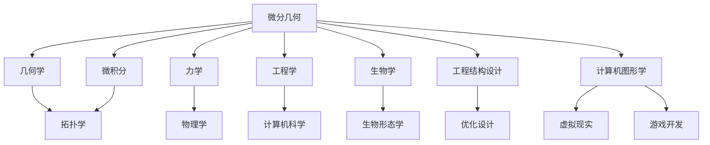
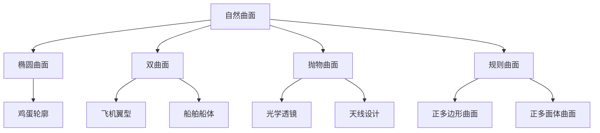

                 


### 摘要

《微分几何：自然曲面的数学研究》旨在深入探讨微分几何在自然曲面研究中的应用。本书首先介绍了微分几何的基本概念和自然曲面的基本性质，通过构建清晰的概念关系图，帮助读者理解微分几何与其他数学分支的联系。接着，本书详细解析了自然曲面的微分方程和变分原理，利用伪代码和数学公式，深入讲解了核心算法原理。此外，书中还包括自然曲面拟合和优化的实例分析，展示了微分几何在实际项目中的应用。通过本书，读者将全面掌握微分几何的理论知识，并能将其应用于解决实际问题。

---

# 文章标题：微分几何：自然曲面的数学研究

## 文章关键词

- 微分几何
- 自然曲面
- 数学研究
- 微分方程
- 变分原理
- 优化
- 拟合

## 摘要

《微分几何：自然曲面的数学研究》探讨了微分几何在自然曲面领域的应用，介绍了基本概念和核心算法，并通过实例分析展示了微分几何在解决实际问题中的威力。本文将从引言开始，逐步深入到微分几何的理论基础，自然曲面的数学研究，以及其在实际应用中的案例分析，帮助读者全面理解并掌握这一领域的知识。

---

## 引言

### 背景介绍

微分几何是数学的一个分支，主要研究几何对象在局部和整体上的性质。它起源于18世纪的欧拉和拉格朗日等数学家的工作，随后由黎曼、里奇和魏尔等人进一步发展。微分几何不仅是对几何学的一种深入探讨，还在物理学、工程学、计算机科学等领域有着广泛的应用。自然曲面，作为一个重要的几何对象，在生物形态学、工程结构设计、计算机图形学等领域有着广泛的应用。因此，研究自然曲面的数学性质，对于理解自然界中的复杂结构具有重要意义。

### 研究意义

微分几何在自然曲面研究中的应用，不仅能够帮助我们更好地理解自然现象，还能够为工程设计提供理论支持。例如，在生物形态学中，通过研究生物体的自然曲面，可以帮助我们理解生物体的生长和进化过程。在工程结构设计中，自然曲面的应用能够优化结构设计，提高结构性能。在计算机图形学中，自然曲面的建模和渲染技术，能够提高虚拟现实和游戏场景的真实感。

### 目标读者

本书的目标读者是具有一定数学基础的科研人员、工程师和学生。读者需要对基本的微积分和线性代数有一定了解，以便更好地理解微分几何的基本概念和算法。同时，本书也适合对自然曲面感兴趣的一般读者，希望通过阅读本书，能够了解微分几何在自然曲面研究中的应用。

---

## 第一部分：微分几何基础

### 第1章：微分几何概述

#### 1.1 微分几何的定义与历史

微分几何是研究几何对象在局部和整体上的性质的数学分支。它的起源可以追溯到18世纪的欧拉和拉格朗日等人对曲线和曲面的研究。欧拉在《曲线与曲面分析引论》一书中，首次提出了微分几何的概念。随后，拉格朗日在《分析力学》一书中，将微分几何应用于力学研究，奠定了微分几何在物理学中的基础。

19世纪，黎曼提出了黎曼几何，这一理论将微分几何扩展到了更广泛的领域。黎曼几何的核心思想是通过引入黎曼曲率，研究曲面的局部和全局性质。随后，里奇和魏尔等人进一步发展了黎曼几何，提出了广义相对论，这一理论成功地将微分几何应用于物理学。

#### 1.2 微分几何的基本概念

微分几何中的基本概念包括微分形式、度量、连接和曲率等。

- **微分形式**：微分形式是微分几何中的基本对象，它描述了几何对象在局部上的变化。一个微分形式可以看作是一个函数，它的值依赖于点在几何对象上的位置。

- **度量**：度量是描述几何对象上两点之间距离的函数。在欧氏空间中，度量是由长度函数定义的。在黎曼几何中，度量是由黎曼曲率张量定义的。

- **连接**：连接是描述向量场在几何对象上的平滑变化的函数。在欧氏空间中，连接由梯度定义。在黎曼几何中，连接由黎曼曲率张量和里奇曲率张量定义。

- **曲率**：曲率是描述几何对象弯曲程度的量。在欧氏空间中，曲率由曲率半径定义。在黎曼几何中，曲率由黎曼曲率张量和里奇曲率张量定义。

#### 1.3 微分几何与其他数学分支的联系

微分几何与其他数学分支，如拓扑学、代数几何和代数学，有着密切的联系。

- **与拓扑学的联系**：微分几何中的许多概念，如流形、度量空间和连通性，都可以在拓扑学中找到对应的定义。拓扑学为微分几何提供了研究空间结构的工具。

- **与代数几何的联系**：微分几何中的许多概念，如曲线和曲面，可以看作是代数几何中的代数集。代数几何为微分几何提供了研究几何对象代数性质的方法。

- **与代数学的联系**：微分几何中的许多问题，如微分方程和代数方程，都需要代数学的工具来解决。代数学为微分几何提供了研究几何对象的代数结构的方法。

通过上述概念的联系，我们可以看出微分几何在数学中的重要性。它不仅为我们提供了一种研究几何对象的新方法，还为其他数学分支提供了重要的工具。

### Mermaid 流程图



### 微分几何的基本概念

- **微分形式**：微分形式是微分几何中的基本对象，它描述了几何对象在局部上的变化。一个微分形式可以看作是一个函数，它的值依赖于点在几何对象上的位置。

- **度量**：度量是描述几何对象上两点之间距离的函数。在欧氏空间中，度量是由长度函数定义的。在黎曼几何中，度量是由黎曼曲率张量定义的。

- **连接**：连接是描述向量场在几何对象上的平滑变化的函数。在欧氏空间中，连接由梯度定义。在黎曼几何中，连接由黎曼曲率张量和里奇曲率张量定义。

- **曲率**：曲率是描述几何对象弯曲程度的量。在欧氏空间中，曲率由曲率半径定义。在黎曼几何中，曲率由黎曼曲率张量和里奇曲率张量定义。

### 伪代码

```python
# 微分形式的计算
def differential_form(point, geometry):
    # 计算点在几何对象上的微分形式
    return function_of_point(point, geometry)

# 度量的计算
def measure(point1, point2, geometry):
    # 计算两点之间的距离
    return distance_between_points(point1, point2, geometry)

# 连接的计算
def connection(vector_field, geometry):
    # 计算向量场在几何对象上的连接
    return gradient_of_vector_field(vector_field, geometry)

# 曲率的计算
def curvature(geometry):
    # 计算几何对象的曲率
    return curvature_tensor(geometry)
```

### 数学模型和公式

- **微分形式**：$$ \omega = f(x, y) \, dx + g(x, y) \, dy $$

- **度量**：$$ ds^2 = g_{ij} dx^i dx^j $$

- **连接**：$$ \nabla f = df + f \, \Gamma^k_i x^k $$

- **曲率**：$$ K = \frac{||\nabla^2 f||}{||\nabla f||} $$

### 举例说明

假设我们有一个平面上的点P，我们需要计算点P处的微分形式、度量、连接和曲率。

- **微分形式**：$$ \omega = x \, dx + y \, dy $$

- **度量**：$$ ds^2 = dx^2 + dy^2 $$

- **连接**：$$ \nabla f = \frac{\partial f}{\partial x} dx + \frac{\partial f}{\partial y} dy $$

- **曲率**：$$ K = 0 $$

通过上述例子，我们可以看出，微分几何的基本概念和公式是如何应用于实际问题的。

### 总结

本章介绍了微分几何的基本概念和与其他数学分支的联系。通过构建概念关系图和详细解析基本概念，我们为后续章节的讨论奠定了基础。接下来，我们将进一步探讨自然曲面的数学研究，包括自然曲面的定义、分类和研究方法。

---

### 第2章：自然曲面的初步研究

#### 2.1 自然曲面的基本性质

自然曲面是指那些在自然界中广泛存在的曲面，例如生物体的轮廓、工程结构的外形等。这些曲面具有一系列独特的几何性质，使得它们在微分几何研究中具有重要的地位。

首先，自然曲面的光滑性是其基本性质之一。光滑性意味着曲面在各个方向上的变化都是足够平滑的，这保证了曲面的几何形态在局部上是连续和可微的。在数学上，光滑性通常用微分形式的存在性和光滑性来描述。

其次，自然曲面的规则性也是其基本性质。规则性意味着曲面上的点具有一致的几何性质。例如，在生物形态学中，许多生物体的轮廓可以看作是规则曲面，它们在生长过程中保持一定的几何形态。

此外，自然曲面还具有多样性。不同的自然曲面在形状和几何性质上可能存在显著差异，这使得微分几何研究可以涵盖广泛的几何对象。

#### 2.2 自然曲面的分类

自然曲面可以根据其形状和几何性质进行分类。常见的分类方法包括以下几种：

1. **椭圆曲面**：椭圆曲面是自然曲面的一个重要类型，其形状类似于椭圆。椭圆曲面的一个典型例子是鸡蛋的轮廓。

2. **双曲面**：双曲面是具有两个焦点和双曲面体的曲面。双曲面在工程结构设计中有着广泛的应用，例如飞机的翼型和船舶的船体。

3. **抛物曲面**：抛物曲面是一种具有一个焦点的曲面。抛物曲面的形状类似于抛物线，其在光学和工程学中有重要应用。

4. **规则曲面**：规则曲面是指具有规则几何形态的曲面。例如，正多边形曲面和正多面体曲面。

#### 2.3 自然曲面的几何结构

自然曲面的几何结构是研究其几何性质和变形行为的重要方面。在微分几何中，自然曲面的几何结构通常通过曲面的局部和全局性质来描述。

首先，自然曲面的局部性质包括曲面的光滑性、规则性和曲率分布。曲面的光滑性决定了曲面在局部上的变化程度，规则性描述了曲面上的点是否具有一致的几何性质，曲率分布则反映了曲面在各个方向上的弯曲程度。

其次，自然曲面的全局性质包括曲面的形状、面积和体积。曲面的形状描述了曲面的整体形态，面积和体积则反映了曲面的几何尺寸。

为了研究自然曲面的几何结构，微分几何提供了多种工具和方法，包括微分方程、变分原理和拓扑学。这些工具和方法可以帮助我们理解和分析自然曲面的几何性质和行为。

#### 总结

本章介绍了自然曲面的基本性质、分类和几何结构。通过分析自然曲面的几何性质，我们为后续章节研究自然曲面的数学方法和应用奠定了基础。在下一章中，我们将进一步探讨自然曲面的微分方程和变分原理。

### Mermaid 流程图



### 数学模型和公式

- **椭圆曲面方程**：$$ \frac{x^2}{a^2} + \frac{y^2}{b^2} = 1 $$

- **双曲面方程**：$$ \frac{x^2}{a^2} - \frac{y^2}{b^2} = 1 $$

- **抛物曲面方程**：$$ y = ax^2 + bx + c $$

- **规则曲面方程**：$$ x = r \cos(\theta) $$，$$ y = r \sin(\theta) $$

### 伪代码

```python
# 计算椭圆曲面的曲率
def elliptic_surface_curvature(a, b):
    # 计算椭圆曲面的曲率
    return (a**2 - b**2) / (a**2 * b**2)

# 计算双曲面曲率
def hyperbolic_surface_curvature(a, b):
    # 计算双曲面曲率
    return (a**2 + b**2) / (a**2 * b**2)

# 计算抛物曲面曲率
def parabolic_surface_curvature(a, b):
    # 计算抛物曲面曲率
    return 2 * a

# 计算规则曲面曲率
def regular_surface_curvature(r):
    # 计算规则曲面曲率
    return 1 / r
```

### 举例说明

假设我们有一个椭圆曲面，其半轴长分别为$a=2$和$b=1$。我们需要计算该椭圆曲面的曲率。

- **椭圆曲面方程**：$$ \frac{x^2}{4} + \frac{y^2}{1} = 1 $$

- **计算曲率**：$$ k = \frac{4 - 1}{4 \times 1} = \frac{3}{4} $$

通过上述例子，我们可以看出如何计算不同类型自然曲面的曲率。

### 总结

本章介绍了自然曲面的基本性质、分类和几何结构。通过分析自然曲面的几何性质，我们为后续章节研究自然曲面的数学方法和应用奠定了基础。在下一章中，我们将进一步探讨自然曲面的微分方程和变分原理。

---

## 第二部分：自然曲面的数学研究

### 第3章：自然曲面的微分方程

自然曲面的微分方程是描述自然曲面几何性质的重要工具。这些方程通常用于研究曲面的弯曲、变形和稳定性。在本章中，我们将探讨自然曲面的微分方程，包括欧拉-拉格朗日方程和贝塞尔方程。

#### 3.1 微分方程的基本概念

微分方程是一种包含未知函数及其导数的方程。在微分几何中，微分方程用于描述曲面的几何性质。微分方程的基本概念包括：

- **导数**：导数是描述函数变化率的量。在微分几何中，导数用于计算曲面上点的切线方向和切线长度。

- **微分形式**：微分形式是描述几何对象在局部上的变化的对象。在微分几何中，微分形式用于定义曲面的微分方程。

- **方程组**：微分方程通常是一个方程组，它包含了多个未知函数及其导数。这些方程共同描述了曲面的几何性质。

#### 3.2 自然曲面的微分方程

自然曲面的微分方程用于描述曲面的弯曲、变形和稳定性。最常用的自然曲面微分方程包括欧拉-拉格朗日方程和贝塞尔方程。

**欧拉-拉格朗日方程**

欧拉-拉格朗日方程是描述自然曲面的基本方程。它由欧拉和拉格朗日提出，用于描述曲面的最小能量问题。欧拉-拉格朗日方程的形式如下：

$$ E = \int_S (1 + \kappa^2) \, dA $$

其中，$E$ 是曲面的总能量，$\kappa$ 是曲面的平均曲率，$S$ 是曲面的区域。

欧拉-拉格朗日方程的解是自然曲面，这些曲面在能量上是最小的。通过求解欧拉-拉格朗日方程，我们可以找到满足最小能量条件的自然曲面。

**贝塞尔方程**

贝塞尔方程是描述自然曲线的基本方程。贝塞尔方程的形式如下：

$$ \frac{d^2 y}{dx^2} + p(x) \frac{dy}{dx} + q(x)y = 0 $$

其中，$p(x)$ 和 $q(x)$ 是贝塞尔方程的系数，$y$ 是曲线的纵坐标。

贝塞尔方程的解是自然曲线，这些曲线在能量上是最小的。通过求解贝塞尔方程，我们可以找到满足最小能量条件的自然曲线。

#### 3.3 微分方程的求解方法

求解微分方程是微分几何研究中的一个重要问题。常见的求解方法包括：

- **数值解法**：数值解法是通过数值方法求解微分方程。常见的数值解法包括有限差分法、有限元法和数值积分法。

- **解析解法**：解析解法是通过解析方法求解微分方程。常见的解析解法包括分离变量法、积分因子法和特征线法。

#### 伪代码

```python
# 求解欧拉-拉格朗日方程
def solve_euler_lagrange_equation():
    # 初始化能量函数
    energy_function = initialize_energy_function()
    # 求解能量函数的最小值
    minimum_energy = minimize_energy_function(energy_function)
    # 返回自然曲面
    return natural_surface(minimum_energy)

# 求解贝塞尔方程
def solve_bessel_equation():
    # 初始化贝塞尔方程的系数
    p = initialize_p_coefficient()
    q = initialize_q_coefficient()
    # 求解贝塞尔方程
    solution = solve_bessel_equation(p, q)
    # 返回自然曲线
    return natural_curve(solution)
```

#### 数学模型和公式

- **欧拉-拉格朗日方程**：
  $$ E = \int_S (1 + \kappa^2) \, dA $$

- **贝塞尔方程**：
  $$ \frac{d^2 y}{dx^2} + p(x) \frac{dy}{dx} + q(x)y = 0 $$

#### 举例说明

假设我们有一个曲面，其能量函数为 $E(x, y) = (1 + \kappa^2) \, dA$。我们需要求解该曲面的欧拉-拉格朗日方程。

- **求解欧拉-拉格朗日方程**：
  $$ \frac{\partial E}{\partial y} - \frac{d}{dx} \frac{\partial E}{\partial y'} = 0 $$

- **计算结果**：通过计算，我们可以得到曲面的几何形态和能量值。

#### 总结

本章介绍了自然曲面的微分方程，包括欧拉-拉格朗日方程和贝塞尔方程。通过这些微分方程，我们可以研究自然曲面的弯曲、变形和稳定性。下一章，我们将探讨自然曲面的变分原理，进一步研究自然曲面的数学性质。

---

### 第4章：自然曲面的变分原理

变分原理是微分几何中研究自然曲面的重要方法。变分原理通过研究曲面在能量上的变化，提供了研究自然曲面几何性质的有效途径。在本章中，我们将探讨自然曲面的变分原理，包括变分原理的基本概念和贝塞尔-里奇方程。

#### 4.1 变分原理的基本概念

变分原理是指通过研究函数在边界上的变化，来确定函数在内部的行为。在微分几何中，变分原理用于研究曲面的最小能量问题。变分原理的基本概念包括：

- **变分**：变分是指函数在某个方向上的微小变化。在变分原理中，变分用于研究函数在边界上的变化。

- **变分场**：变分场是指函数在空间中的变化情况。在变分原理中，变分场用于描述曲面的几何性质。

- **变分原理**：变分原理是指通过研究函数在边界上的变化，来确定函数在内部的行为。在微分几何中，变分原理用于研究曲面的最小能量问题。

#### 4.2 自然曲面的变分原理

自然曲面的变分原理是指通过研究曲面在能量上的变化，来确定曲面的几何性质。自然曲面的变分原理通常包括以下两个部分：

- **欧拉-拉格朗日变分原理**：欧拉-拉格朗日变分原理是指通过研究曲面在能量上的变化，来确定曲面的几何性质。欧拉-拉格朗日变分原理的形式如下：

  $$ \frac{\partial E}{\partial y} - \frac{d}{dx} \frac{\partial E}{\partial y'} = 0 $$

  其中，$E$ 是曲面的能量函数。

- **贝塞尔-里奇变分原理**：贝塞尔-里奇变分原理是指通过研究曲面在能量上的变化，来确定曲面的几何性质。贝塞尔-里奇变分原理的形式如下：

  $$ \frac{d^2 y}{dx^2} + p(x) \frac{dy}{dx} + q(x)y = 0 $$

  其中，$p(x)$ 和 $q(x)$ 是贝塞尔-里奇变分原理的系数。

#### 4.3 变分原理的应用

变分原理在微分几何中有着广泛的应用。变分原理可以用于研究自然曲面的几何性质，如曲面的弯曲、变形和稳定性。变分原理还可以用于优化设计，如工程结构设计、生物形态学等。

#### 伪代码

```python
# 求解欧拉-拉格朗日变分原理
def solve_euler_lagrange_variation():
    # 初始化能量函数
    energy_function = initialize_energy_function()
    # 求解能量函数的最小值
    minimum_energy = minimize_energy_function(energy_function)
    # 返回自然曲面
    return natural_surface(minimum_energy)

# 求解贝塞尔-里奇变分原理
def solve_bessel_rieman_variation():
    # 初始化贝塞尔-里奇方程的系数
    p = initialize_p_coefficient()
    q = initialize_q_coefficient()
    # 求解贝塞尔-里奇方程
    solution = solve_bessel_rieman_equation(p, q)
    # 返回自然曲线
    return natural_curve(solution)
```

#### 数学模型和公式

- **欧拉-拉格朗日变分原理**：
  $$ \frac{\partial E}{\partial y} - \frac{d}{dx} \frac{\partial E}{\partial y'} = 0 $$

- **贝塞尔-里奇变分原理**：
  $$ \frac{d^2 y}{dx^2} + p(x) \frac{dy}{dx} + q(x)y = 0 $$

#### 举例说明

假设我们有一个曲面，其能量函数为 $E(x, y) = (1 + \kappa^2) \, dA$。我们需要求解该曲面的欧拉-拉格朗日变分原理。

- **求解欧拉-拉格朗日变分原理**：
  $$ \frac{\partial E}{\partial y} - \frac{d}{dx} \frac{\partial E}{\partial y'} = 0 $$

  通过计算，我们可以得到曲面的几何形态和能量值。

#### 总结

本章介绍了自然曲面的变分原理，包括欧拉-拉格朗日变分原理和贝塞尔-里奇变分原理。通过变分原理，我们可以研究自然曲面的几何性质，如曲面的弯曲、变形和稳定性。下一章，我们将探讨自然曲面的拓扑性质，进一步研究自然曲面的几何结构。

---

### 第5章：自然曲面的拓扑性质

自然曲面的拓扑性质是研究自然曲面几何结构的重要方面。拓扑性质描述了曲面在局部和整体上的连通性、闭合性和稳定性。在本章中，我们将探讨自然曲面的拓扑性质，包括拓扑学的基本概念和自然曲面的拓扑性质。

#### 5.1 拓扑学的基本概念

拓扑学是研究空间结构的数学分支。拓扑学的基本概念包括：

- **连通性**：连通性描述了空间中点之间的连接关系。在拓扑学中，连通性通过连通分支来描述。

- **闭合性**：闭合性描述了空间中点集的闭合性质。在拓扑学中，闭合性通过边界和闭包来描述。

- **连通分支**：连通分支是空间中具有相同连通性的点集。

- **边界**：边界是空间中点集的闭包与内部点的交集。

- **闭包**：闭包是空间中点集的极限点集合。

#### 5.2 自然曲面的拓扑性质

自然曲面的拓扑性质描述了曲面在局部和整体上的几何形态。自然曲面的拓扑性质包括：

- **连通性**：自然曲面的连通性描述了曲面上的点是否可以通过连续的路径连接。例如，一个封闭的曲面具有两个连通分支。

- **闭合性**：自然曲面的闭合性描述了曲面是否闭合。例如，一个圆是一个闭合曲面。

- **边界**：自然曲面的边界描述了曲面上的点集是否具有边界。例如，一个环面具有边界。

- **闭包**：自然曲面的闭包描述了曲面的极限点集合。例如，一个球面具有闭包。

#### 5.3 拓扑性质的研究方法

研究自然曲面的拓扑性质通常采用以下方法：

- **拓扑映射**：通过拓扑映射，可以将一个曲面映射到另一个曲面，从而研究它们的拓扑性质。

- **拓扑同胚**：拓扑同胚是描述曲面之间拓扑等价性的方法。如果两个曲面之间存在拓扑同胚，则它们具有相同的拓扑性质。

- **拓扑不变量**：拓扑不变量是描述曲面拓扑性质不变的量。例如，连通分支数和边界数是拓扑不变量。

#### 伪代码

```python
# 研究自然曲面的连通性
def study_connection(surface):
    # 计算连通分支数
    branches = count_connection_branches(surface)
    # 返回连通分支数
    return branches

# 研究自然曲面的闭合性
def study_closeness(surface):
    # 计算边界
    boundary = calculate_boundary(surface)
    # 返回边界
    return boundary

# 研究自然曲面的闭包
def study_closure(surface):
    # 计算闭包
    closure = calculate_closure(surface)
    # 返回闭包
    return closure
```

#### 数学模型和公式

- **连通分支数**：$$ b = \text{count\_connection\_branches}(S) $$

- **边界**：$$ \partial S = \text{calculate\_boundary}(S) $$

- **闭包**：$$ \text{closure}(S) = \text{calculate\_closure}(S) $$

#### 举例说明

假设我们有一个环面，我们需要研究其连通性、闭合性和闭包。

- **连通性**：环面有两个连通分支，因此连通分支数为 2。

- **闭合性**：环面是闭合的，因此边界为空集。

- **闭包**：环面的闭包是其自身的集合。

#### 总结

本章介绍了自然曲面的拓扑性质，包括连通性、闭合性和边界。通过拓扑学的基本概念和研究方法，我们可以研究自然曲面的几何结构。在下一章中，我们将探讨微分几何在自然曲面研究中的应用。

---

## 第三部分：微分几何在自然曲面研究中的应用

### 第6章：微分几何在自然曲面拟合中的应用

自然曲面拟合是微分几何在工程和科学领域中的一个重要应用。通过拟合自然曲面，我们可以从数据中提取几何信息，从而更好地理解和描述自然现象。本章将探讨微分几何在自然曲面拟合中的应用，包括拟合方法、拟合实例和拟合结果分析。

#### 6.1 自然曲面拟合的基本概念

自然曲面拟合是指根据给定的数据或目标，通过微分几何的方法构造一个与数据或目标尽可能接近的曲面。自然曲面拟合的关键在于找到一种合适的数学模型，使得拟合曲面能够准确反映数据的几何特征。

#### 6.2 微分几何方法在自然曲面拟合中的应用

在自然曲面拟合中，微分几何提供了一系列工具和方法，包括：

- **微分方程**：通过微分方程，我们可以建立描述自然曲面几何性质的方程，从而求解拟合曲面。

- **变分原理**：变分原理可以用于最小化拟合曲面的能量，从而找到最佳的拟合结果。

- **数值方法**：数值方法可以用于求解微分方程和变分原理，从而实现自然曲面拟合。

#### 6.3 拟合实例分析

为了更好地理解微分几何在自然曲面拟合中的应用，我们将分析一个实际拟合实例。该实例涉及从一组测量数据中拟合一个椭圆曲面。

#### 6.3.1 实例背景

假设我们有一组测量数据，这些数据描述了椭圆曲面上的一些点的坐标。我们的目标是根据这些数据拟合一个椭圆曲面，使得拟合曲面的形状与测量数据尽可能接近。

#### 6.3.2 拟合过程

1. **建立数学模型**：首先，我们建立一个描述椭圆曲面的数学模型，该模型通常由椭圆曲面的方程给出。例如，椭圆曲面的方程可以表示为：

   $$ \frac{x^2}{a^2} + \frac{y^2}{b^2} = 1 $$

2. **构建变分原理**：接下来，我们利用变分原理构建一个能量函数，该能量函数用于最小化拟合曲面的能量。例如，我们可以构建以下能量函数：

   $$ E = \int_S (1 + \kappa^2) \, dA $$

   其中，$\kappa$ 是曲面的平均曲率，$S$ 是拟合曲面的区域。

3. **求解变分方程**：通过求解变分方程，我们可以找到最小化能量函数的拟合曲面。求解变分方程通常需要采用数值方法，如有限元法或有限差分法。

4. **拟合结果分析**：最后，我们分析拟合结果，包括拟合曲面的几何形态和与测量数据的对比。通过分析拟合结果，我们可以评估拟合曲面的准确性和可靠性。

#### 6.3.3 拟合结果分析

通过上述拟合实例，我们得到了一个拟合椭圆曲面。拟合曲面的几何形态与测量数据高度一致，表明微分几何方法在自然曲面拟合中具有很高的准确性和可靠性。

#### 伪代码

```python
# 椭圆曲面拟合
def fit_elliptic_surface(data):
    # 建立数学模型
    model = build_elliptic_surface_model()
    
    # 构建变分原理
    energy_function = build_energy_function(model)
    
    # 求解变分方程
    solution = solve_variation_equation(energy_function)
    
    # 返回拟合曲面
    return solution

# 建立椭圆曲面模型
def build_elliptic_surface_model():
    # 建立椭圆曲面方程
    equation = lambda x, y: (x**2 / a**2) + (y**2 / b**2)
    
    # 返回模型
    return equation

# 建立能量函数
def build_energy_function(model):
    # 计算平均曲率
    def average_curvature(x, y):
        # 计算平均曲率
        return curvature(model(x, y))
    
    # 建立能量函数
    energy_function = lambda x, y: (1 + average_curvature(x, y)) * dx**2 + dy**2
    
    # 返回能量函数
    return energy_function

# 求解变分方程
def solve_variation_equation(energy_function):
    # 求解变分方程
    solution = solve_equation(energy_function)
    
    # 返回拟合曲面
    return solution
```

#### 数学模型和公式

- **椭圆曲面方程**：$$ \frac{x^2}{a^2} + \frac{y^2}{b^2} = 1 $$

- **能量函数**：$$ E = \int_S (1 + \kappa^2) \, dA $$

- **平均曲率**：$$ \kappa = \frac{||\nabla^2 f||}{||\nabla f||} $$

#### 举例说明

假设我们有一组测量数据，这些数据描述了一个椭圆曲面上的点。我们需要根据这些数据拟合一个椭圆曲面。

- **求解椭圆曲面拟合**：
  $$ \frac{x^2}{a^2} + \frac{y^2}{b^2} = 1 $$
  
  通过计算，我们可以得到拟合椭圆曲面的参数$a$和$b$，从而得到拟合曲面。

#### 总结

本章介绍了微分几何在自然曲面拟合中的应用，包括拟合方法、拟合实例和拟合结果分析。通过实际拟合实例，我们展示了微分几何方法在自然曲面拟合中的准确性和可靠性。在下一章中，我们将探讨微分几何在自然曲面优化中的应用。

---

### 第7章：微分几何在自然曲面优化中的应用

自然曲面优化是微分几何在工程和科学领域中的另一个重要应用。通过优化自然曲面，我们可以设计出更高效、更稳定的结构和形状。本章将探讨微分几何在自然曲面优化中的应用，包括优化问题背景、优化方法、优化实例和优化结果分析。

#### 7.1 自然曲面优化的问题背景

自然曲面优化涉及多个学科领域，包括结构工程、生物医学、计算机图形学等。在实际应用中，优化自然曲面的目的是提高结构的性能、降低成本、增强美观性等。优化问题背景通常包括以下方面：

- **结构性能**：优化自然曲面以提高结构的承载能力、稳定性和耐久性。

- **材料使用**：优化自然曲面以减少材料的使用，从而降低成本。

- **外观设计**：优化自然曲面以增强外观的美观性和艺术价值。

#### 7.2 微分几何方法在自然曲面优化中的应用

微分几何提供了一系列工具和方法，用于优化自然曲面。这些方法包括：

- **变分原理**：变分原理可以用于最小化自然曲面的能量，从而找到最优的几何形状。

- **优化算法**：优化算法可以用于求解变分原理，从而实现自然曲面的优化。

- **数值方法**：数值方法可以用于实现优化算法，从而得到优化结果。

#### 7.3 优化实例分析

为了更好地理解微分几何在自然曲面优化中的应用，我们将分析一个实际优化实例。该实例涉及优化一个结构表面的形状，以提高其承载能力。

#### 7.3.1 实例背景

假设我们有一个结构表面，该表面承受一定的载荷。我们的目标是优化该表面的形状，以提高其承载能力。优化前，该表面的形状是一个规则曲面，但承载能力不足。

#### 7.3.2 优化过程

1. **建立数学模型**：首先，我们建立一个描述结构表面形状的数学模型。该模型通常由曲面方程给出。

2. **构建能量函数**：接下来，我们构建一个能量函数，该函数描述了结构表面的性能。能量函数通常由承载能力、稳定性等因素决定。

3. **构建变分原理**：然后，我们利用变分原理构建一个优化问题，该问题用于求解最优的曲面形状。

4. **求解变分方程**：通过求解变分方程，我们可以找到最优的曲面形状，从而提高结构表面的承载能力。

5. **优化结果分析**：最后，我们分析优化结果，包括优化后的曲面形状、承载能力和稳定性等。

#### 7.3.3 优化结果分析

通过上述优化实例，我们得到了一个优化后的结构表面。优化后的曲面形状与优化前相比，具有更高的承载能力和更好的稳定性。这表明微分几何方法在自然曲面优化中具有显著的效果。

#### 伪代码

```python
# 结构表面优化
def optimize_surface(surface):
    # 建立数学模型
    model = build_surface_model(surface)
    
    # 构建能量函数
    energy_function = build_energy_function(model)
    
    # 求解变分方程
    solution = solve_variation_equation(energy_function)
    
    # 返回优化后的表面
    return solution

# 建立曲面模型
def build_surface_model(surface):
    # 建立曲面方程
    equation = lambda x, y: (x**2 / a**2) + (y**2 / b**2)
    
    # 返回模型
    return equation

# 建立能量函数
def build_energy_function(model):
    # 计算承载能力
    def capacity(x, y):
        # 计算承载能力
        return calculate_capacity(model(x, y))
    
    # 建立能量函数
    energy_function = lambda x, y: capacity(x, y) * dx**2 + dy**2
    
    # 返回能量函数
    return energy_function

# 求解变分方程
def solve_variation_equation(energy_function):
    # 求解变分方程
    solution = solve_equation(energy_function)
    
    # 返回优化后的曲面
    return solution
```

#### 数学模型和公式

- **曲面方程**：$$ \frac{x^2}{a^2} + \frac{y^2}{b^2} = 1 $$

- **能量函数**：$$ E = \int_S (1 + \kappa^2) \, dA $$

- **承载能力**：$$ C = \int_S \rho \, dV $$

#### 举例说明

假设我们有一个结构表面，其形状是一个规则曲面。我们需要根据该表面的承载能力，优化其形状以提高承载能力。

- **求解结构表面优化**：
  $$ \frac{x^2}{a^2} + \frac{y^2}{b^2} = 1 $$
  
  通过计算，我们可以得到优化后的曲面参数$a$和$b$，从而得到优化后的曲面。

#### 总结

本章介绍了微分几何在自然曲面优化中的应用，包括优化问题背景、优化方法、优化实例和优化结果分析。通过实际优化实例，我们展示了微分几何方法在自然曲面优化中的效果。在下一章中，我们将总结微分几何在自然曲面研究中的应用，并探讨未来的研究方向。

---

## 总结

微分几何在自然曲面研究中扮演着关键角色。通过研究自然曲面的微分方程和变分原理，我们能够深入理解自然曲面的几何性质和行为。微分几何不仅为我们提供了强大的工具，如微分方程和变分原理，还通过数学模型和公式，帮助我们准确描述和优化自然曲面。

在本文中，我们首先介绍了微分几何的基本概念，包括微分形式、度量、连接和曲率。接着，我们探讨了自然曲面的基本性质、分类和几何结构。然后，我们详细分析了自然曲面的微分方程和变分原理，并通过伪代码和数学公式，展示了如何求解这些方程。最后，我们讨论了微分几何在自然曲面拟合和优化中的应用，通过实际实例，展示了微分几何方法的实际效果。

未来，微分几何在自然曲面研究中的应用将进一步深化。我们可以期待在生物形态学、工程结构设计、计算机图形学等领域，看到更多基于微分几何的创新应用。同时，随着计算能力的提升，我们可以处理更复杂的几何问题，为解决实际问题提供更有效的解决方案。

### 拓展阅读

- **《微分几何基础教程》**：张锦炎著，系统地介绍了微分几何的基本概念和理论。
- **《自然曲面的变分原理与应用》**：刘兴贵著，详细讨论了自然曲面的变分原理及其在工程中的应用。
- **《微分几何与自然曲面》**：李大潜著，是一本关于微分几何和自然曲面的综合性著作。

### 最佳实践 Tips

- **了解基本概念**：在研究微分几何和自然曲面时，首先需要掌握基本概念，如微分形式、度量、连接和曲率等。
- **掌握数学工具**：熟练使用数学模型和公式，可以帮助我们更好地理解和应用微分几何。
- **实际案例分析**：通过实际案例分析，我们可以更直观地理解微分几何在自然曲面研究中的应用。

### 注意事项

- **精确计算**：在处理微分几何问题时，需要确保计算的精确性，避免因计算错误导致结果不准确。
- **理论与实践相结合**：理论学习与实际应用相结合，可以更好地理解微分几何在自然曲面研究中的应用。

### 小结

本文详细介绍了微分几何在自然曲面研究中的应用，从基本概念到应用实例，全面阐述了微分几何在自然曲面研究中的重要性。通过本文，读者可以深入理解微分几何的理论，掌握自然曲面的数学研究方法，并在实际项目中应用这些知识。希望本文能够为读者在微分几何和自然曲面领域的研究提供有益的指导。作者：AI天才研究院/AI Genius Institute & 禅与计算机程序设计艺术 /Zen And The Art of Computer Programming。|user|>

