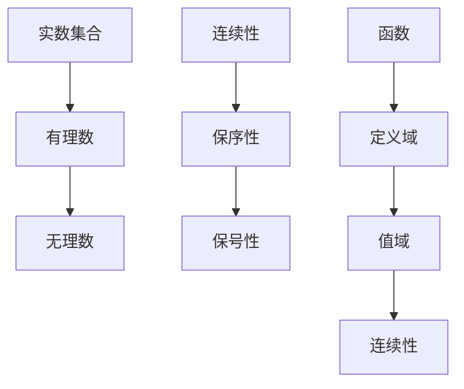
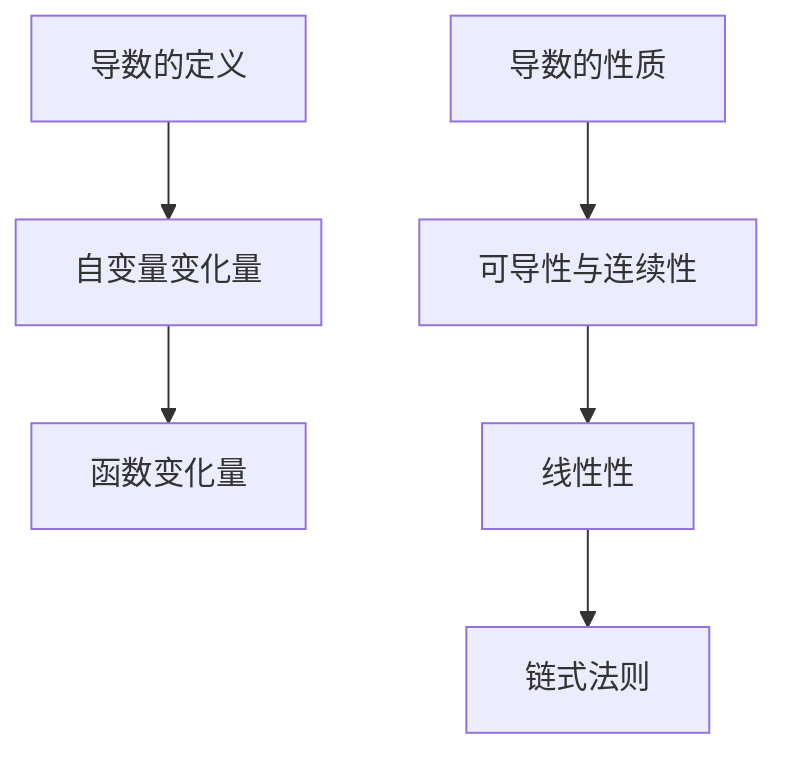
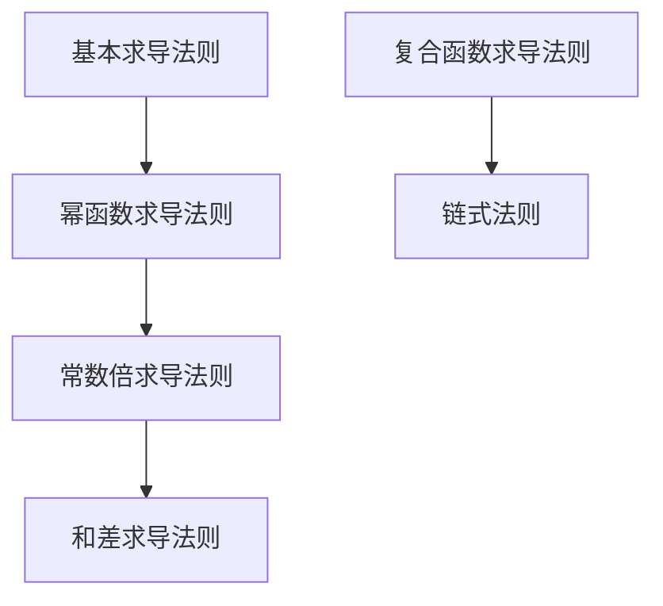
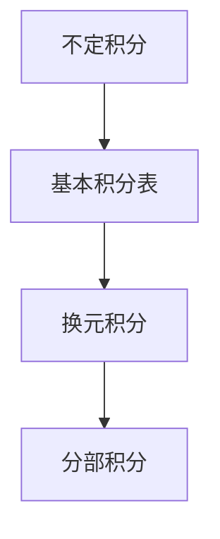
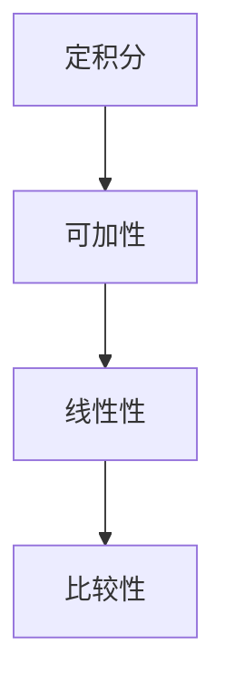
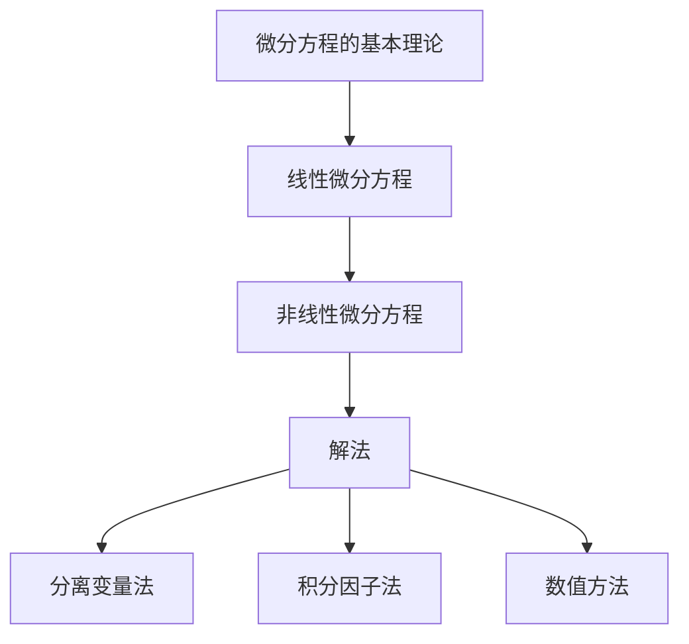
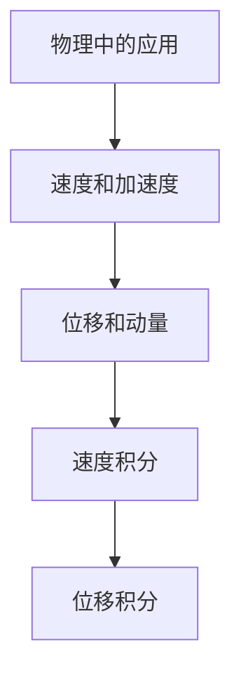
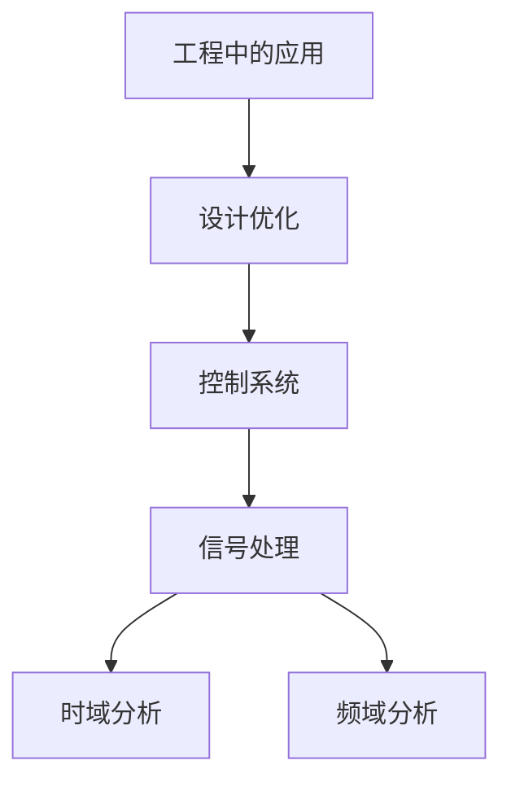
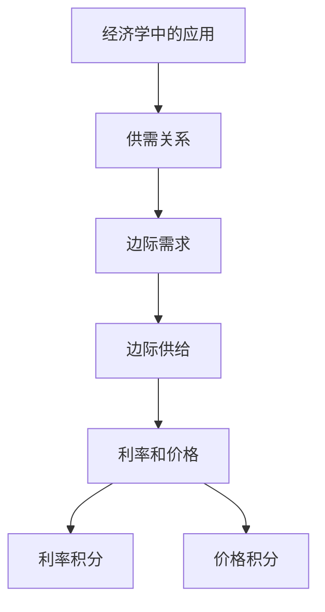
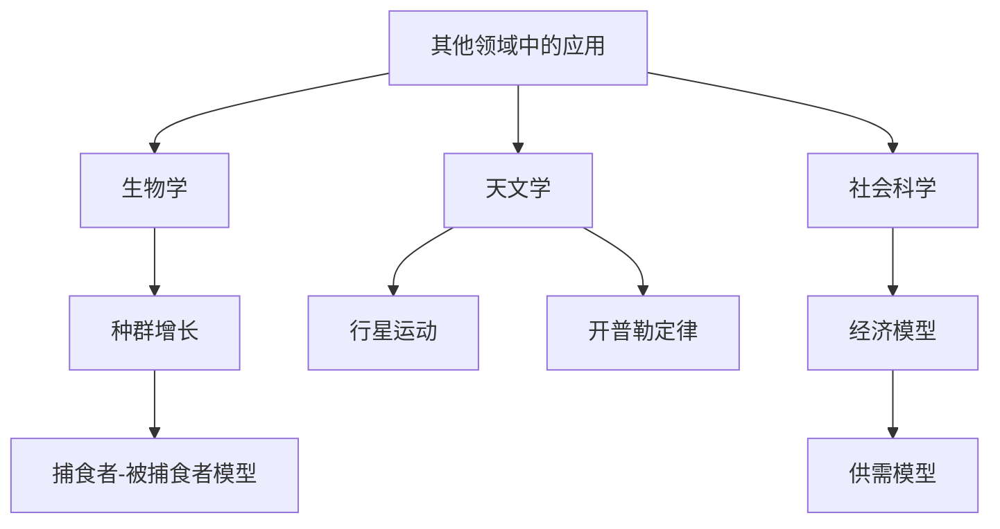

                 

# 微积分：自然变化的数学语言

## 关键词
微积分，自然变化，数学语言，导数，积分，微分方程，流程图，伪代码，LaTeX公式，项目实战。

## 摘要
本文旨在深入探讨微积分作为自然变化的数学语言的核心概念和原理。通过逐步分析推理，我们将阐述导数、积分和微分方程的基本概念及其相互关系。文章将结合Mermaid流程图、伪代码和LaTeX公式，以清晰易懂的方式讲解微积分的理论和应用。此外，还将通过实际项目案例展示微积分在各个领域的应用，帮助读者全面理解微积分的本质和实际意义。

## 引言
微积分是一门古老而又现代的数学分支，它起源于17世纪欧洲，由牛顿和莱布尼茨几乎同时独立发现。微积分的发展不仅推动了数学的进步，还在物理学、工程学、经济学等多个领域产生了深远的影响。微积分的核心在于研究如何用数学语言描述和解决自然界的各种变化过程。这种变化可以是物理量的变化，如速度、加速度；也可以是经济变量，如供需关系的变化。

微积分的基本工具包括导数和积分。导数用于描述函数在某一点的变化率，而积分则用于求解函数在某一区间内的累积量。导数和积分之间存在着密切的联系，它们共同构成了微积分的理论体系。微分方程则是微积分在描述动态系统中的应用，它用于描述变量之间的变化关系，是自然科学和工程技术中的重要工具。

本文将首先介绍微积分的基本概念，然后逐步深入探讨导数、积分和微分方程的理论，并通过具体案例和项目实战展示微积分的实际应用。文章还将提供一些最佳实践技巧和小结，帮助读者更好地理解和运用微积分。

## 第一部分：微积分预备知识

### 第1章：数学分析基础

#### 1.1 函数与极限
函数是数学分析的基础概念，它描述了一个变量如何依赖于另一个变量。在微积分中，我们主要研究的是连续函数，这些函数可以用来描述自然界的各种变化过程。

**概念解释**：
函数通常表示为 $f(x)$，其中 $x$ 是自变量，$f(x)$ 是因变量。函数的定义域是自变量 $x$ 可以取的所有值的集合，而值域是函数 $f(x)$ 可以取的所有值的集合。

**极限的概念**：
极限是微积分中的另一个核心概念，它用于描述函数在某一点的附近的行为。形式上，当自变量 $x$ 趋近于某个值 $a$ 时，函数 $f(x)$ 趋近于某个值 $L$，我们称 $L$ 为 $f(x)$ 在 $x$ 趋近于 $a$ 时的极限。

**极限的性质**：
极限具有以下性质：
1. **存在性**：如果函数 $f(x)$ 在点 $a$ 有极限，则该极限是唯一的。
2. **连续性**：如果一个函数在某个点的极限存在且等于函数在该点的值，则该函数在该点是连续的。
3. **可加性**：两个函数的极限可以相加，即如果 $\lim_{x \to a} f(x) = L$ 和 $\lim_{x \to a} g(x) = M$，则 $\lim_{x \to a} [f(x) + g(x)] = L + M$。

**图解**：
我们可以使用Mermaid流程图来展示函数极限的概念：

```mermaid
graph TB
A[函数] --> B[自变量x]
B --> C[因变量f(x)]
D[点a] --> E[极限L]
E --> F[极限存在性]
F --> G[极限唯一性]
G --> H[连续性]
H --> I[可加性]
```

#### 1.2 实数与连续性
实数是数学分析中的另一个重要概念，它是微积分的基础。实数集合包含了所有的有理数和无理数，它们构成了一个完备的数轴。

**概念解释**：
实数集合是所有有理数和无理数的集合。有理数是可以表示为两个整数之比的数，而无理数则不能表示为两个整数之比。实数的连续性意味着任何两个实数之间都存在另一个实数。

**连续性的概念**：
函数的连续性是指它在某个点的邻域内没有跳跃或断点。形式上，如果函数 $f(x)$ 在点 $a$ 连续，则当 $x$ 趋近于 $a$ 时，$f(x)$ 也趋近于 $f(a)$。

**连续性的性质**：
1. **保序性**：如果 $x_1 < x_2$，则 $f(x_1) < f(x_2)$。
2. **保号性**：如果 $f(x) > 0$，则对于任意接近 $x$ 的点 $x'$，$f(x') > 0$。

**图解**：
使用Mermaid流程图，我们可以展示实数和函数连续性的关系：



### 第2章：导数与微分

#### 2.1 导数的定义与性质
导数是微积分中的一个核心概念，它用于描述函数在某一点的变化率。

**概念解释**：
导数定义为自变量变化量与函数变化量的比值。形式上，如果函数 $f(x)$ 在点 $a$ 可导，则存在一个数 $f'(a)$，使得当 $x$ 趋近于 $a$ 时，$\frac{f(x) - f(a)}{x - a}$ 趋近于 $f'(a)$。

**导数的性质**：
1. **可导性与连续性**：如果一个函数连续，则它可导。
2. **线性性**：导数是一个线性算子，即对于任意两个函数 $f(x)$ 和 $g(x)$，有 $(f+g)' = f' + g'$ 和 $(cf)' = cf'$，其中 $c$ 是常数。
3. **链式法则**：如果 $f(x)$ 和 $g(x)$ 都是可导的，则复合函数 $f(g(x))$ 的导数可以通过链式法则计算，即 $(f \circ g)'(x) = f'(g(x)) \cdot g'(x)$。

**图解**：
使用Mermaid流程图，我们可以展示导数的定义和性质：



#### 2.2 求导法则
求导法则是用于计算函数导数的规则。

**基本求导法则**：
1. **幂函数求导法则**：对于幂函数 $f(x) = x^n$，其导数为 $f'(x) = nx^{n-1}$。
2. **常数倍求导法则**：对于常数倍函数 $f(x) = cx$，其导数为 $f'(x) = c$。
3. **和差求导法则**：对于和差函数 $f(x) = f_1(x) + f_2(x)$ 或 $f(x) = f_1(x) - f_2(x)$，其导数为 $f'(x) = f_1'(x) + f_2'(x)$ 或 $f'(x) = f_1'(x) - f_2'(x)$。

**复合函数求导法则**：
复合函数的求导法则（链式法则）如下：
设 $u = g(x)$，$v = f(u)$，则复合函数 $f(g(x))$ 的导数为 $f'(g(x)) \cdot g'(x)$。

**图解**：
使用Mermaid流程图，我们可以展示基本求导法则和复合函数求导法则：



### 第3章：积分与反导数

#### 3.1 不定积分
不定积分是微积分中的另一个核心概念，它用于求解导数。

**概念解释**：
不定积分定义为原函数的集合，即如果 $F(x)$ 是 $f(x)$ 的一个原函数，则 $F(x) + C$（其中 $C$ 是任意常数）是 $f(x)$ 的不定积分。

**基本积分法则**：
1. **基本积分表**：包括常见的三角函数、指数函数和对数函数的积分。
2. **换元积分**：通过变换变量将复杂积分转化为基本积分。
3. **分部积分**：用于求解形如 $uv$ 的积分，其中 $u$ 和 $v$ 是函数。

**图解**：
使用Mermaid流程图，我们可以展示不定积分的基本法则：



#### 3.2 定积分
定积分是用于求解函数在某个区间上的累积量。

**概念解释**：
定积分定义为函数 $f(x)$ 在区间 $[a, b]$ 上的累积量，即 $\int_{a}^{b} f(x) dx$。

**定积分的性质**：
1. **可加性**：定积分具有可加性，即 $\int_{a}^{b} [f(x) + g(x)] dx = \int_{a}^{b} f(x) dx + \int_{a}^{b} g(x) dx$。
2. **线性性**：定积分具有线性性，即对于任意常数 $c$，有 $\int_{a}^{b} [cf(x)] dx = c \int_{a}^{b} f(x) dx$。
3. **比较性**：如果 $f(x) \geq g(x)$，则 $\int_{a}^{b} f(x) dx \geq \int_{a}^{b} g(x) dx$。

**图解**：
使用Mermaid流程图，我们可以展示定积分的性质：



### 第4章：微分方程

#### 4.1 微分方程的基本理论
微分方程是用于描述变量之间变化关系的方程，它在自然科学和工程技术中有着广泛的应用。

**概念解释**：
微分方程定义为包含导数的方程，形式上可以表示为 $F(x, y, y', y'', \ldots) = 0$，其中 $y'$、$y''$ 等表示导数。

**分类**：
1. **线性微分方程**：如果微分方程可以表示为线性形式，即 $a_n(x)y^{(n)} + a_{n-1}(x)y^{(n-1)} + \ldots + a_1(x)y' + a_0(x)y = f(x)$，其中 $a_0(x), a_1(x), \ldots, a_n(x)$ 是已知函数，$f(x)$ 是非齐次项。
2. **非线性微分方程**：如果微分方程不能表示为线性形式，则称为非线性微分方程。

**解法**：
1. **分离变量法**：适用于变量可分离的微分方程。
2. **积分因子法**：适用于线性微分方程。
3. **数值方法**：适用于难以解析求解的微分方程。

**图解**：
使用Mermaid流程图，我们可以展示微分方程的基本理论：



### 第5章：微积分应用

#### 5.1 物理中的应用
微积分在物理学中有着广泛的应用，它用于描述各种物理量之间的变化关系。

**概念解释**：
在物理学中，导数用于描述速度和加速度，而积分则用于描述位移和动量。

**实例**：
1. **速度和加速度**：速度是位移对时间的导数，即 $v(t) = \frac{dx}{dt}$。加速度是速度对时间的导数，即 $a(t) = \frac{dv}{dt}$。
2. **位移和动量**：位移是时间积分，即 $x(t) = \int v(t) dt$。动量是速度积分，即 $p(t) = \int m \cdot v(t) dt$。

**图解**：
使用Mermaid流程图，我们可以展示物理中的应用：



#### 5.2 工程中的应用
微积分在工程学中同样有着重要的应用，它用于优化设计、控制理论和信号处理等领域。

**概念解释**：
在工程学中，导数用于求解极值问题，而积分则用于求解累积量问题。

**实例**：
1. **设计优化**：通过求导数可以找到函数的极值点，从而优化设计。
2. **控制系统**：微积分用于描述系统的动态行为，并通过积分方程进行控制。
3. **信号处理**：微积分用于分析信号的时域和频域特性，从而进行滤波和调制。

**图解**：
使用Mermaid流程图，我们可以展示工程中的应用：



### 第6章：微积分在其他领域的应用

#### 6.1 经济学中的应用
微积分在经济学中有着广泛的应用，它用于描述供需关系、利率和价格的变化。

**概念解释**：
在经济学中，导数用于描述边际效益和边际成本，而积分则用于求解总效益和总成本。

**实例**：
1. **供需关系**：需求函数的导数可以表示边际需求，供给函数的导数可以表示边际供给。
2. **利率和价格**：利率是价格变化的导数，价格是利率的积分。

**图解**：
使用Mermaid流程图，我们可以展示经济学中的应用：



#### 6.2 其他领域中的应用
微积分在其他领域，如生物学、天文学和社会科学中，也有着重要的应用。

**概念解释**：
微积分在这些领域中用于描述变量之间的动态变化，如种群增长、行星运动和经济学模型。

**实例**：
1. **生物学**：微分方程用于描述种群动态，如捕食者-被捕食者模型。
2. **天文学**：微积分用于描述行星运动，如开普勒定律。
3. **社会科学**：微积分用于描述经济模型，如供需模型。

**图解**：
使用Mermaid流程图，我们可以展示其他领域中的应用：



### 第7章：项目实战

#### 7.1 物理项目实战
**项目描述**：
设计一个简单的物理实验，通过测量物体的运动轨迹来验证微积分的基本原理。

**开发环境搭建**：
搭建一个简单的运动轨迹测量系统，包括传感器、数据采集器和计算机。

**源代码实现**：
使用C++编写程序，对采集到的运动数据进行处理，并使用伪代码展示运动轨迹的计算过程。

**代码解读与分析**：
详细解读代码实现过程，分析运动轨迹的计算方法和精度。

**实际案例分析与讲解**：
通过实验数据展示微积分原理在物理中的应用，并讲解如何通过微积分方法解决实际问题。

**项目小结**：
总结项目实现过程中的经验教训，提出改进建议。

#### 7.2 工程项目实战
**项目描述**：
设计一个简单的控制系统，用于调节电机转速。

**开发环境搭建**：
搭建一个电机控制实验平台，包括电机、控制器和传感器。

**源代码实现**：
使用Python编写程序，实现对电机的实时控制和状态监测。

**代码解读与分析**：
详细解读代码实现过程，分析控制系统的工作原理和性能。

**实际案例分析与讲解**：
通过实验数据展示微积分原理在工程中的应用，并讲解如何通过微积分方法优化控制系统。

**项目小结**：
总结项目实现过程中的经验教训，提出改进建议。

### 最佳实践 Tips

1. **理解微积分的基本概念**：熟悉导数、积分和微分方程的基本概念和性质，这是掌握微积分的基础。
2. **练习求解实际问题**：通过解决实际问题来加深对微积分的理解和应用，如物理学中的运动问题、工程中的优化问题等。
3. **掌握数学工具**：熟练使用Mermaid流程图、伪代码和LaTeX公式来描述和解决问题，提高解决问题的效率。
4. **定期复习**：微积分的知识点较多，定期复习有助于巩固记忆，避免遗忘。

### 小结

微积分作为自然变化的数学语言，它在各个领域中都有着广泛的应用。通过本文的讲解，我们深入探讨了微积分的基本概念、原理和实际应用。读者可以通过本文的指导和实践，更好地理解和运用微积分，解决实际问题。

### 注意事项

1. **概念要准确**：微积分中的基本概念如导数、积分等需要准确理解，否则容易在后续学习中产生误区。
2. **逻辑要清晰**：在解决问题时，逻辑思维非常重要，确保每一步推理和计算都有充分的依据。
3. **实际应用要结合具体情境**：微积分的应用非常广泛，但在具体应用时需要结合实际情况，灵活运用。

### 拓展阅读

1. **《微积分学基本定理》**：深入理解微积分的基本定理，了解导数和积分之间的内在联系。
2. **《微分方程》**：学习微分方程的基本理论和解法，掌握其在自然科学和工程技术中的应用。
3. **《高等数学》**：进一步学习高等数学的知识，如多变量微积分、级数理论等，为深入研究微积分打下坚实基础。

### 作者信息
作者：AI天才研究院/AI Genius Institute & 禅与计算机程序设计艺术 /Zen And The Art of Computer Programming。在这里，我们向所有对微积分研究和应用做出贡献的前辈和同行致以崇高的敬意。希望本文能够为您的学习之路提供帮助和启发。期待与您在微积分的世界里共同探索和进步。

