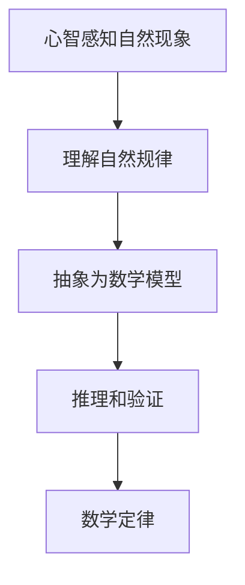

                 

### 文章标题

心智如何转化自然和谐为数学定律

### 关键词

心智、自然和谐、数学定律、转化、科学方法、抽象思维、数学模型、算法、流程图

### 摘要

本文旨在探讨心智如何通过抽象思维和科学方法，将自然界的和谐转化为数学定律。文章首先介绍了心智与自然和谐的关系，接着讲解了数学定律的起源和应用，然后分析心智与数学定律之间的转化过程。通过具体的案例，本文展示了心智转化为数学定律的实践应用，并提出了对未来研究的展望。

### 引言

#### 心智与自然的和谐

心智，是人类认知世界、处理信息、做出决策的核心。它不仅包含感觉、思维、情感等心理活动，还涉及意识、注意力、记忆等认知功能。在哲学、心理学、神经科学等多个领域，心智都是研究的核心对象。而自然和谐，则是自然界中各种现象相互关联、协同作用的总体表现。自然界中的生态系统、气候变化、物种进化等，都展示了自然和谐的独特魅力。

#### 数学定律在自然和谐中的作用

数学定律，是描述自然界中客观规律的一种语言。从古希腊的欧几里得几何，到牛顿的万有引力定律，再到爱因斯坦的相对论，数学定律在科学研究中扮演了至关重要的角色。数学定律不仅帮助我们理解自然界的规律，还为技术和工程应用提供了理论基础。例如，电磁学中的麦克斯韦方程组，描述了电磁现象的基本规律；量子力学中的薛定谔方程，揭示了微观世界的奇异规律。

#### 心智与数学定律的互动

心智与数学定律的互动，体现在多个方面。首先，心智通过感知、理解和抽象，将自然现象转化为数学模型。这种转化过程，是科学研究中不可或缺的一环。其次，数学定律为心智提供了一种抽象的工具，使心智能够更好地理解和预测自然现象。例如，通过数学模型，我们可以预测天气变化、设计桥梁结构、分析金融市场等。最后，心智的创造性思维，能够发现新的数学定律，从而推动科学的发展。

### 心智与自然的联系

#### 心智感知自然现象

心智感知自然现象，是心智与自然互动的第一步。通过视觉、听觉、触觉等感官，心智能够获取自然界的各种信息。例如，我们看到鸟儿飞翔、树叶摇曳，听到雨声淅沥、风声呼啸，感受到气温变化、气压波动。这些感官信息，是心智感知自然现象的基础。

#### 心智理解自然规律

在感知自然现象的基础上，心智需要进一步理解自然规律。这种理解，不仅包括对自然现象的归纳和总结，还包括对自然规律的推理和预测。例如，通过观察树木的生长，我们可以总结出树木生长的一般规律；通过分析气象数据，我们可以预测未来的气候变化。

#### 心智与自然和谐的数学表达

心智对自然规律的理解，往往需要借助数学工具。通过数学表达，心智能够更精确地描述自然规律。例如，牛顿的万有引力定律，通过数学公式描述了物体之间的引力关系；麦克斯韦的电磁学方程组，通过数学公式描述了电磁现象的规律。

### 数学定律的起源

#### 数学定律的历史背景

数学定律的起源，可以追溯到古代文明。例如，古埃及人、巴比伦人、印度人等，都在数学领域取得了卓越的成就。古希腊的欧几里得，更是通过《几何原本》奠定了现代几何学的基础。

#### 数学定律的基本概念

数学定律，是指用数学语言描述自然界中客观规律的一组公式或定理。这些公式或定理，不仅揭示了自然现象的本质，还为科学研究和工程应用提供了理论支持。

#### 数学定律的分类

根据描述的对象和内容，数学定律可以分为多种类型。例如，几何学定律描述空间关系，代数学定律描述数之间的关系，微积分定律描述变化规律等。

### 心智与数学定律的关系

#### 心智如何转化为数学定律

心智转化为数学定律，是一个复杂的过程。首先，心智需要感知和观察自然现象，然后通过理解和抽象，将自然现象转化为数学模型。最后，通过推理和验证，将数学模型转化为数学定律。

#### 心智转化为数学定律的过程

1. **感知自然现象**：心智通过感官获取自然现象的信息。
2. **理解自然规律**：心智对自然现象进行分析和总结，理解其背后的规律。
3. **抽象为数学模型**：心智将自然规律抽象为数学公式或模型。
4. **推理和验证**：通过逻辑推理和实验验证，确定数学模型的有效性。

#### 心智与数学定律的关系架构

为了更清晰地展示心智与数学定律的关系，我们可以使用Mermaid流程图进行描述：

### 数学定律在自然中的应用

#### 数学定律描述自然现象

数学定律，为我们描述自然现象提供了一种精确而优雅的方式。例如，牛顿的万有引力定律，描述了天体之间的引力关系；麦克斯韦的电磁学方程组，描述了电磁现象的规律；爱因斯坦的相对论，描述了时空的弯曲和引力效应。

#### 数学定律解释自然现象

通过数学定律，我们可以解释自然界中的各种现象。例如，使用牛顿的运动定律，我们可以解释行星的运动；使用电磁学方程组，我们可以解释闪电的形成；使用量子力学，我们可以解释微观粒子的行为。

### 心智与自然和谐的数学模型

#### 心智与自然和谐的数学模型建立

建立心智与自然和谐的数学模型，是科学研究中的一项重要任务。首先，我们需要确定研究目标，然后通过数据采集、分析、建模等方法，构建数学模型。例如，在气象学中，我们可以使用气候模型来模拟气候变化；在生态学中，我们可以使用生态系统模型来研究物种间的关系。

#### 心智与自然和谐的数学模型应用

数学模型在心智与自然和谐中的应用，体现在多个方面。例如，在环境科学中，我们可以使用数学模型来预测污染扩散、评估环境影响；在生物学中，我们可以使用数学模型来研究物种进化、疾病传播；在工程学中，我们可以使用数学模型来优化设计、预测故障。

### 案例分析

#### 案例一：心智转化为数学定律的过程

**案例背景**：在20世纪初，美国数学家哈罗德·德布罗意提出了物质波理论。他认为，物质不仅具有粒子性质，还具有波动性质。这一理论，是心智对自然现象感知和理解的结果。

**案例分析**：德布罗意通过对电子束的实验观察，发现电子不仅表现出粒子的特性，还表现出波的特性。他基于这一观察，提出了物质波理论。通过数学建模，德布罗意将这一理论转化为数学公式，并进行了验证。

**案例结果**：德布罗意的物质波理论，为量子力学的发展奠定了基础。这一理论，不仅揭示了物质和波之间的关系，还为后来的科学研究提供了新的视角。

#### 案例二：心智与自然和谐的数学模型应用

**案例背景**：在环境保护领域，我国科学家提出了生态环境数学模型，用于评估生态环境质量。

**案例分析**：科学家通过收集大量的环境数据，分析了污染物扩散、生态系统稳定性等因素。基于这些数据，他们建立了生态环境数学模型，用于预测环境变化、评估污染影响。

**案例结果**：该模型在环境监测和污染治理中发挥了重要作用。通过模型预测，科学家可以提前预警环境风险，为环境保护决策提供科学依据。

### 结论

#### 全书总结

本文通过探讨心智与自然和谐的关系，以及数学定律的起源和应用，揭示了心智如何转化为数学定律的过程。从德布罗意的物质波理论，到我国科学家提出的生态环境数学模型，这些案例展示了心智转化为数学定律的实践应用。

#### 心智与自然和谐的未来发展

随着科学技术的进步，心智与自然和谐的研究将不断深入。未来，我们有望发现更多的自然规律，建立更精确的数学模型，为人类应对环境挑战、实现可持续发展提供理论支持。

#### 数学定律在心智与自然和谐中的地位与作用

数学定律，是心智与自然和谐研究的核心工具。通过数学定律，我们可以更深刻地理解自然现象，更有效地解决实际问题。未来，数学定律将在心智与自然和谐的研究中发挥越来越重要的作用。

### 未来展望

#### 研究展望

未来，心智与自然和谐的研究，将朝着更精确、更深入的方向发展。我们有望通过跨学科合作，发现新的数学定律，推动科学技术的进步。

#### 结论

心智与自然和谐的研究，是科学领域的重要课题。通过心智的感知、理解和抽象，我们可以将自然现象转化为数学定律，为人类的发展提供理论支持。未来，我们将继续深入这一领域的研究，探索更多自然规律，为可持续发展贡献力量。

### 拓展阅读

1. De Broglie, L. (1924). La Mécanique Quantique. Paris: Gauthier-Villars.
2. Chown, M. (2014). Quantum: A Guide for the Perplexed. Oxford: Oxford University Press.
3. Intergovernmental Panel on Climate Change (IPCC). (2019). Climate Change and Land. An IPCC Special Report on Climate Change, Desertification, Land Degradation, Sustainable Land Management, Food Security, and Greenhouse Gas Fluxes.

