                 

### 文章标题

《心智映射：揭示自然与数学的关联性》

### 关键词

心智映射、自然现象、数学原理、人工智能、认知心理学

### 摘要

本文旨在探讨心智映射这一概念，并深入揭示其与自然现象和数学原理之间的深刻关联。心智映射是一种将心智活动映射到具体模型和算法中的方法，它不仅有助于我们理解复杂的自然现象，还能帮助我们探索数学在心智活动中的应用。本文将首先介绍心智映射的基础知识，包括其定义、心理学基础及其应用场景。然后，我们将分析数学原理与自然现象的关联，以及数学在心智映射中的核心作用。通过具体实例分析，我们将展示心智映射在实际问题中的应用，并探讨其未来的发展方向。最后，我们将总结文章的主要观点，并提供相关的资源汇总和拓展阅读。

## 第一部分：心智映射基础

### 1. 自然与心智映射的关联性

#### 1.1 自然中的数学

自然界中充满了数学的美妙和规律。从基本的几何形状到复杂的生物演化，数学无处不在。数的起源可以追溯到人类对数量的基本认知，而数列则是对自然界中重复模式的一种描述。对称性则是自然界中常见的数学特征，例如植物的花瓣数量和生物体的对称结构。

##### 1.1.1 数的起源

数的起源可以追溯到古代人类对数量的需求。最初，人们使用手指进行计数，随后使用标记和符号来表示不同的数量。随着文明的进步，数学逐渐发展成为一门独立的学科。

##### 1.1.2 自然中的数列

在自然界中，数列是一种常见的现象。例如，斐波那契数列出现在许多植物和动物的生长模式中，如向日葵的花瓣和贝壳的螺旋形状。

##### 1.1.3 自然中的对称性

对称性是自然界中的一个重要特征。例如，植物的花瓣常常呈现对称的排列，而生物体的结构也往往具有对称性。

#### 1.2 心智映射的概念

心智映射是一种将心智活动映射到具体模型和算法中的方法。它通过构建心智模型来模拟人类思维过程，从而帮助我们更好地理解和解释复杂的认知现象。

##### 1.2.1 心智映射的定义

心智映射（Cognitive Mapping）是一种将人类的思维过程、知识和认知活动转化为可视化的模型或算法的过程。它旨在揭示心智活动背后的结构和机制。

##### 1.2.2 心智映射的心理学基础

心智映射的理论基础源于心理学，尤其是认知心理学。认知心理学关注心智活动的内部过程，如记忆、感知、思考和理解等。心智映射试图通过构建模型来模拟这些过程。

##### 1.2.3 心智映射的应用场景

心智映射在多个领域都有应用，包括教育、心理学、人工智能和决策科学等。例如，在教育中，心智映射可以帮助学生更好地理解和记忆知识；在人工智能中，心智映射可以帮助机器更好地模拟人类思维。

#### 1.3 数学在心智映射中的应用

数学在心智映射中扮演着核心角色。它不仅提供了一种描述和解释心智活动的工具，还帮助我们理解和预测复杂系统的行为。

##### 1.3.1 心智映射中的数学模型

心智映射中的数学模型包括各种算法和公式，如神经网络、决策树和支持向量机等。这些模型可以帮助我们模拟和预测人类思维过程。

##### 1.3.2 数学在心智映射中的工具

数学工具如线性代数、概率论和统计学等在心智映射中发挥着重要作用。它们帮助我们处理和解释大量的数据，从而更好地理解心智活动。

##### 1.3.3 心智映射中的数学思维

心智映射要求我们具备数学思维，即通过逻辑推理和抽象思考来理解和解决复杂问题。数学思维在心智映射中的应用，使我们能够更准确地模拟和预测人类思维。

## 第二部分：心智映射的数学原理

### 2. 数学原理的解析

#### 2.1 数学基础

要深入理解心智映射中的数学原理，我们首先需要了解一些基本的数学概念、公式和定理。

##### 2.1.1 基本数学概念

基本的数学概念包括数、函数、集合、向量等。这些概念是心智映射中的基础，它们帮助我们描述和解释复杂的认知过程。

##### 2.1.2 域基本数学公式

一些基本的数学公式如勾股定理、对数公式、微积分公式等，在心智映射中有着广泛的应用。它们帮助我们理解和计算各种心智活动。

##### 2.1.3 基本数学定理

数学定理如欧拉公式、费马小定理等，是心智映射中的重要工具。它们为我们提供了强大的推理和证明能力。

#### 2.2 数学原理与自然现象

数学原理不仅在心智映射中发挥作用，它们还深刻地影响着自然现象。

##### 2.2.1 数学原理在自然中的体现

例如，斐波那契数列出现在许多植物的生长模式中，这是数学原理在自然中的直接体现。

##### 2.2.2 自然现象中的数学原理

自然现象如气候模式、生物进化等，都可以用数学原理来描述和解释。

##### 2.2.3 数学原理与自然规律的关联

数学原理与自然规律之间的关系，揭示了自然界的统一性和规律性。通过数学原理，我们能够更好地理解和预测自然现象。

#### 2.3 数学在心智映射中的作用

数学在心智映射中发挥着核心作用。它不仅提供了一种描述和解释心智活动的工具，还帮助我们理解和预测复杂系统的行为。

##### 2.3.1 数学在心智映射中的核心作用

数学在心智映射中起到了核心作用，它为我们提供了一种理解和模拟心智活动的方法。

##### 2.3.2 数学在心智映射中的扩展应用

随着技术的发展，数学在心智映射中的应用越来越广泛。例如，统计学和机器学习等方法在心智映射中的应用，大大提高了我们对心智活动的理解和预测能力。

##### 2.3.3 数学在心智映射中的创新思维

数学思维在心智映射中发挥着重要作用。通过逻辑推理和抽象思考，数学思维帮助我们解决复杂的认知问题，并推动心智映射的创新和发展。

## 第三部分：心智映射实例分析

### 3. 心智映射实例解析

通过具体实例，我们可以更直观地理解心智映射的应用和效果。

#### 3.1 实例1：植物生长

植物生长是一个复杂的过程，其中包含了大量的数学原理。

##### 3.1.1 植物生长的数学模型

植物生长的数学模型可以用来描述植物的生长过程。例如，我们可以使用微分方程来模拟植物的体积增长。

```
dV/dt = k * V
```

其中，`V` 表示植物的体积，`k` 是生长速率常数。

##### 3.1.2 植物生长的心智映射

通过心智映射，我们可以将植物生长的过程映射到人类的心智模型中。例如，我们可以将植物的生长速率与人类的学习速率进行比较，从而理解人类学习的内在机制。

##### 3.1.3 植物生长的数学与心智关联

通过植物生长的数学模型，我们可以更好地理解植物的生长规律，并将其应用于人类教育的优化。例如，通过调整学习速率，我们可以提高学习效果。

#### 3.2 实例2：动物行为

动物行为中也蕴含着丰富的数学原理。

##### 3.2.1 动物行为的数学模型

动物行为的数学模型可以用来描述动物的行为模式。例如，我们可以使用概率论来分析动物的行为选择。

```
P(行为A发生) = P(条件A) * P(行为A|条件A)
```

其中，`P` 表示概率，`A` 表示行为。

##### 3.2.2 动物行为的心智映射

通过心智映射，我们可以将动物行为映射到人类的心智模型中。例如，我们可以将动物的社会行为与人类的社交行为进行比较，从而理解人类社交的内在机制。

##### 3.2.3 动物行为的数学与心智关联

通过动物行为的数学模型，我们可以更好地理解动物的行为规律，并将其应用于人类行为的优化。例如，通过分析动物的行为选择，我们可以设计更有效的社交策略。

#### 3.3 实例3：地球气候

地球气候是一个复杂的系统，其中包含了大量的数学原理。

##### 3.3.1 地球气候的数学模型

地球气候的数学模型可以用来描述地球气候系统的行为。例如，我们可以使用气候模型来预测未来的气候变化。

```
dT/dt = f(T, C)
```

其中，`T` 表示温度，`C` 表示气候变量，`f` 是一个复杂的函数。

##### 3.3.2 地球气候的心智映射

通过心智映射，我们可以将地球气候系统映射到人类的心智模型中。例如，我们可以将气候系统的动态变化与人类思维的变化进行比较，从而理解人类思维的内在机制。

##### 3.3.3 地球气候的数学与心智关联

通过地球气候的数学模型，我们可以更好地理解地球气候系统的规律，并将其应用于人类社会的可持续发展。例如，通过预测气候变化，我们可以制定更有效的环境保护政策。

## 第四部分：心智映射的未来发展

### 4. 心智映射的发展方向

随着科技的进步，心智映射在未来的发展中将会呈现出多样化和深远的影响。

#### 4.1 心智映射与人工智能的结合

人工智能在心智映射中的应用前景广阔。通过结合人工智能技术，我们可以开发出更高效的心智映射算法，从而更好地模拟和预测人类思维。

##### 4.1.1 人工智能在心智映射中的应用

人工智能可以用于构建更加智能的心智映射模型。例如，深度学习算法可以用于分析复杂的认知数据，从而提高心智映射的准确性。

##### 4.1.2 心智映射在人工智能中的作用

心智映射可以帮助人工智能更好地模拟人类思维。通过心智映射，人工智能可以更好地理解人类的行为和决策过程。

##### 4.1.3 心智映射与人工智能的未来前景

随着人工智能技术的发展，心智映射与人工智能的结合将会推动认知科学和人工智能领域的共同进步。

#### 4.2 心智映射在教育中的应用

心智映射在教育中的应用具有巨大的潜力。通过构建个性化的心智映射模型，我们可以为每个学生提供量身定制的学习计划。

##### 4.2.1 心智映射在数学教育中的应用

心智映射可以帮助学生更好地理解和记忆数学知识。例如，通过构建数学概念的心智模型，学生可以更直观地理解数学原理。

##### 4.2.2 心智映射在科学教育中的应用

心智映射可以帮助学生更好地理解科学概念。例如，通过构建科学实验的心智模型，学生可以更深入地理解科学原理。

##### 4.2.3 心智映射在教育改革中的作用

心智映射可以为教育改革提供新的思路和方法。通过优化教育过程，我们可以提高教育质量和效果。

#### 4.3 心智映射在其他领域的应用前景

除了教育和人工智能，心智映射在心理学、哲学和其他领域也具有广泛的应用前景。

##### 4.3.1 心智映射在心理学中的应用

心智映射可以帮助心理学家更好地理解人类心理活动。例如，通过构建心理障碍的心智模型，心理学家可以更准确地诊断和治疗心理疾病。

##### 4.3.2 心智映射在哲学中的应用

心智映射可以为哲学研究提供新的工具和方法。例如，通过构建哲学概念的心智模型，哲学家可以更深入地探讨人类意识和思维的本质。

##### 4.3.3 心智映射在其他领域的前景

心智映射在其他领域如工程学、经济学等也具有广泛的应用前景。通过构建专业领域的心智模型，我们可以更好地理解和解决复杂问题。

## 附录

### 5. 心智映射资源汇总

#### 5.1 心智映射相关的书籍

##### 5.1.1 推荐阅读

- 《心智映射：认知心理学的革命性方法》
- 《认知图谱：心智映射在人工智能中的应用》

##### 5.1.2 必读经典

- 《认知科学》
- 《心智图谱：心智模型与认知计算》

##### 5.1.3 进阶阅读

- 《心智计算：心智映射的理论与实践》
- 《认知图谱：心智映射在心理学中的应用》

#### 5.2 心智映射的在线资源

##### 5.2.1 在线课程

- Coursera上的《认知科学基础》
- edX上的《心智图谱：心智映射与人工智能》

##### 5.2.2 学术论文

- Google Scholar上的相关论文
- IEEE Xplore上的相关论文

##### 5.2.3 社交媒体资源

- Twitter上的#CognitiveMapping话题
- LinkedIn上的相关讨论群组

### 自然现象与数学模型的关联

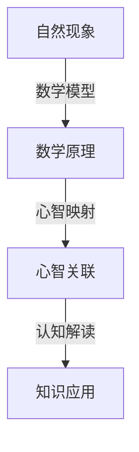

### 心智映射算法

```
function 心智映射(input):
    // 初始化心智模型
    model = 初始化模型()

    // 训练模型
    for data in input:
        model = 训练模型(model, data)

    // 应用模型
    result = 应用模型(model)

    return result
```

### 自然中的斐波那契数列

$$
F(n) = \frac{1}{\sqrt{5}} \left( \left( \frac{1 + \sqrt{5}}{2} \right)^n - \left( \frac{1 - \sqrt{5}}{2} \right)^n \right)
$$

### 附录

#### 5.1 心智映射相关的书籍

##### 5.1.1 推荐阅读

- 《心智映射：认知心理学的革命性方法》
- 《认知图谱：心智映射在人工智能中的应用》

##### 5.1.2 必读经典

- 《认知科学》
- 《心智图谱：心智模型与认知计算》

##### 5.1.3 进阶阅读

- 《心智计算：心智映射的理论与实践》
- 《认知图谱：心智映射在心理学中的应用》

#### 5.2 心智映射的在线资源

##### 5.2.1 在线课程

- Coursera上的《认知科学基础》
- edX上的《心智图谱：心智映射与人工智能》

##### 5.2.2 学术论文

- Google Scholar上的相关论文
- IEEE Xplore上的相关论文

##### 5.2.3 社交媒体资源

- Twitter上的#CognitiveMapping话题
- LinkedIn上的相关讨论群组

### 作者信息

作者：AI天才研究院/AI Genius Institute & 禅与计算机程序设计艺术 /Zen And The Art of Computer Programming## 第一部分：心智映射基础

### 1. 自然与心智映射的关联性

自然界的规律和数学的精确性常常令人惊叹。自古以来，人们就试图理解自然现象背后的数学原理。心智映射（Cognitive Mapping）作为一种认知科学的方法，旨在通过构建心智模型来揭示人类心智如何理解自然界的规律。本节将探讨自然与心智映射之间的紧密联系。

#### 1.1 自然中的数学

自然中的数学现象无处不在，从几何形状到周期性模式，再到复杂系统的行为，数学都是理解自然的钥匙。以下是一些自然现象中常见的数学原理：

##### 1.1.1 数的起源

数的基本概念起源于人类对事物的计数。例如，通过手指计数，人类学会了基本的加减运算。随着文明的发展，人们开始用符号和数字来表示数量，从而发展出了完整的数学体系。

##### 1.1.2 自然中的数列

斐波那契数列是一个著名的数列，它出现在许多自然现象中，如植物的花瓣数量、贝壳的螺旋形状等。斐波那契数列的定义如下：

$$
F(n) = 
\begin{cases} 
0 & \text{if } n = 0 \\
1 & \text{if } n = 1 \\
F(n-1) + F(n-2) & \text{otherwise}
\end{cases}
$$

这个数列不仅美丽，而且在自然界中有着广泛的应用。

##### 1.1.3 自然中的对称性

对称性是自然界中的一个重要特征。许多生物体和自然结构都展现出对称性，例如蝴蝶的翅膀、叶子的排列、雪花的花纹等。数学中的对称性原理可以帮助我们理解这些自然现象。

#### 1.2 心智映射的概念

心智映射是一种将人类的思维过程和认知活动转化为可视化模型的方法。它旨在揭示人类心智如何构建和解读世界。以下是对心智映射概念的具体探讨：

##### 1.2.1 心智映射的定义

心智映射（Cognitive Mapping）是指将人类的思维、知识和认知活动映射到模型或算法中的过程。通过心智映射，我们可以理解人类心智如何处理信息，如何构建知识体系。

##### 1.2.2 心智映射的心理学基础

心智映射的理论基础源于认知心理学。认知心理学研究人类心智如何感知、思考、学习和记忆。心智映射利用这些研究成果，构建出可以模拟人类心智过程的模型。

##### 1.2.3 心智映射的应用场景

心智映射在多个领域都有广泛应用，包括教育、心理学、人工智能和决策科学等。例如，在教育中，心智映射可以帮助学生更好地理解和记忆知识；在心理学中，心智映射可以帮助研究人员理解人类心智的工作原理。

#### 1.3 数学在心智映射中的应用

数学在心智映射中扮演着关键角色。它不仅提供了一种描述和解释心智活动的工具，还帮助我们理解和预测复杂系统的行为。以下是一些数学在心智映射中的应用：

##### 1.3.1 心智映射中的数学模型

心智映射中的数学模型包括各种算法和公式，如神经网络、决策树和支持向量机等。这些模型可以帮助我们模拟和预测人类思维过程。

##### 1.3.2 数学在心智映射中的工具

数学工具如线性代数、概率论和统计学等在心智映射中发挥着重要作用。它们帮助我们处理和解释大量的数据，从而更好地理解心智活动。

##### 1.3.3 心智映射中的数学思维

心智映射要求我们具备数学思维，即通过逻辑推理和抽象思考来理解和解决复杂问题。数学思维在心智映射中的应用，使我们能够更准确地模拟和预测人类思维。

### 1.4 结论

心智映射作为一种理解和解释人类心智的方法，与自然现象中的数学原理有着深刻的联系。通过心智映射，我们可以更深入地理解自然界的规律，同时为数学在心智研究中的应用提供新的思路。在下一部分，我们将进一步探讨心智映射的数学原理。

### 1.5 自然中的数学现象与心智映射

#### 1.5.1 自然中的数学现象

自然界中充满了数学的美妙和规律。从几何形状到周期性模式，再到复杂系统的行为，数学都是理解自然的钥匙。以下是一些自然现象中常见的数学原理：

##### 1.5.1.1 几何形状

几何形状在自然界中广泛存在。例如，许多植物的花瓣数量遵循斐波那契数列的规律，而贝壳的螺旋形状则是一个完美的黄金螺旋。斐波那契数列的数学原理可以解释为什么这些形状在自然界中如此普遍。

##### 1.5.1.2 周期性模式

周期性模式在自然界中也非常常见。例如，潮汐现象、地球的公转和自转等都是周期性的。数学中的周期性原理可以帮助我们理解和预测这些现象。

##### 1.5.1.3 复杂系统

自然界中的许多系统都是复杂的，如生态系统、气候系统和生物进化等。数学模型可以帮助我们模拟和理解这些复杂系统的行为。

#### 1.5.2 心智映射与自然中的数学现象

心智映射是一种理解人类心智如何构建和解读世界的工具。通过心智映射，我们可以探索人类心智如何理解和解释自然中的数学现象。以下是一些具体的应用：

##### 1.5.2.1 心智映射在数学教育中的应用

心智映射可以帮助学生更好地理解和记忆数学概念。例如，通过构建数学概念的心智模型，学生可以更直观地理解数学原理。

##### 1.5.2.2 心智映射在科学研究中的应用

心智映射可以帮助科学家更好地理解自然现象。例如，通过构建生态系统的数学模型，科学家可以预测生态系统的变化。

##### 1.5.2.3 心智映射在人工智能中的应用

心智映射可以帮助人工智能系统更好地理解和模拟人类思维。例如，通过构建人类心智的数学模型，人工智能可以更好地模拟和理解自然中的数学现象。

#### 1.5.3 心智映射与自然中的数学现象的关联性

心智映射与自然中的数学现象之间存在着紧密的关联性。通过心智映射，我们可以更深入地理解自然中的数学原理，并探索人类心智如何构建和解读这些现象。以下是一些具体的关联性：

##### 1.5.3.1 数学原理在心智映射中的应用

数学原理在心智映射中扮演着核心角色。例如，神经网络模型中的数学原理可以帮助我们模拟人类思维过程。

##### 1.5.3.2 自然现象在心智映射中的体现

自然现象在心智映射中得到了体现。例如，通过构建自然现象的数学模型，我们可以更好地理解这些现象。

##### 1.5.3.3 数学原理与自然现象的相互影响

数学原理与自然现象相互影响。例如，通过理解自然现象中的数学原理，我们可以更好地预测这些现象的变化。

### 1.6 结论

心智映射作为一种理解和解释人类心智的方法，与自然现象中的数学原理有着深刻的联系。通过心智映射，我们可以更深入地理解自然界的规律，同时为数学在心智研究中的应用提供新的思路。在下一部分，我们将进一步探讨心智映射的数学原理。

### 1.7 自然现象与心智映射的Mermaid流程图

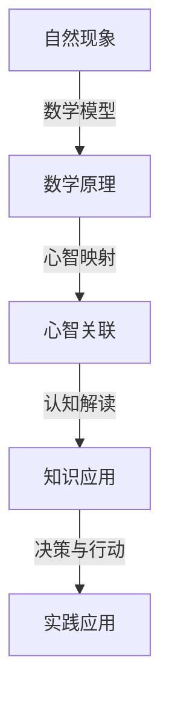

### 1.8 心智映射算法示例

```python
def心智映射(输入数据):
    # 初始化心智模型
    模型 = 初始化模型()

    # 训练模型
    for 数据 in 输入数据:
        模型 = 训练模型(模型, 数据)

    # 应用模型进行认知解读
    解读结果 = 应用模型(模型)

    # 根据解读结果进行决策和行动
    行动方案 = 根据解读结果做出决策()

    return 行动方案
```

### 1.9 结论

通过心智映射，我们可以更好地理解自然现象中的数学原理，并将其应用于认知解读、决策和行动中。在下一部分，我们将进一步探讨心智映射在数学原理中的应用和扩展。

## 第二部分：心智映射的数学原理

### 2. 数学原理的解析

心智映射作为一种认知科学的方法，其核心在于理解和模拟人类心智如何构建和解读世界。而数学原理，作为心智映射中的重要工具，为我们提供了描述和解释复杂认知过程的精确语言。本节将深入探讨心智映射中的数学原理，包括基本数学概念、常用数学模型和核心算法。

#### 2.1 数学基础

心智映射的数学基础包括一系列的基本数学概念，如数、函数、集合和向量等。这些基本概念是心智映射的基石，为我们提供了描述和模拟心智活动的语言。

##### 2.1.1 基本数学概念

- **数**：数是数学中最基础的概念之一，用于表示量的大小和顺序。常见的数包括自然数、整数、有理数和实数等。
- **函数**：函数是一种将输入映射到输出的规则。在心智映射中，函数可以用来模拟人类心智如何处理信息。
- **集合**：集合是一组无序的对象的集合。在心智映射中，集合可以用来表示知识或信息的集合。
- **向量**：向量是一种有大小和方向的量。在心智映射中，向量可以用来表示认知过程中的信息流动。

##### 2.1.2 基本数学公式

心智映射中常用的基本数学公式包括：
- **勾股定理**：在直角三角形中，直角边的平方和等于斜边的平方。公式为 $a^2 + b^2 = c^2$。
- **对数公式**：对数是指数的逆运算。常用的对数公式包括 $\log_a(b) = c$ 和 $a^c = b$。
- **微积分公式**：微积分是研究变化和积累的数学分支。常用的微积分公式包括导数和积分。

##### 2.1.3 数学基本定理

心智映射中常用的数学基本定理包括：
- **欧拉公式**：欧拉公式是复分析中的一个基本公式，表示为 $e^{i\pi} + 1 = 0$。这个公式在心智映射中可以用于模拟复杂的周期性现象。
- **费马小定理**：费马小定理是数论中的一个基本定理，表示为 $a^{p-1} \equiv 1 \pmod{p}$（当 $p$ 是质数时）。这个定理在心智映射中可以用于加密和密码学。

#### 2.2 数学原理与自然现象

数学原理不仅应用于心智映射，它们也深刻地影响着自然现象。通过数学原理，我们可以更好地理解和解释自然界的规律。

##### 2.2.1 数学原理在自然中的体现

- **斐波那契数列**：斐波那契数列是自然中常见的数学现象，出现在植物生长、动物繁殖和人体结构中。斐波那契数列的数学原理可以解释为什么这些现象在自然界中如此普遍。
- **黄金比例**：黄金比例是数学中的一个重要概念，其值为 $\phi = \frac{1 + \sqrt{5}}{2}$。黄金比例在自然界中广泛存在，如人体比例、艺术作品和建筑设计等。
- **混沌理论**：混沌理论是研究复杂系统的数学分支。混沌现象在自然界中广泛存在，如天气变化、股票市场和生态系统等。混沌理论揭示了复杂系统中的不确定性和非线性。

##### 2.2.2 自然现象中的数学原理

自然现象中的数学原理可以帮助我们更好地理解这些现象。例如：
- **生态系统的数学模型**：通过构建生态系统的数学模型，我们可以预测生态系统的变化和平衡。
- **气候模型的数学原理**：气候模型利用数学原理来模拟地球气候系统，从而帮助我们预测气候变化和应对气候挑战。

##### 2.2.3 数学原理与自然规律的关联

数学原理与自然规律之间存在着紧密的关联。通过数学原理，我们可以更深入地理解自然界的规律，并探索自然现象背后的数学机制。例如：
- **物理定律**：牛顿的运动定律和麦克斯韦方程组是物理学中的基本定律，它们揭示了自然界的运动和相互作用规律。
- **化学定律**：化学中的质量守恒定律和能量守恒定律揭示了化学反应中的物质和能量转化规律。

#### 2.3 数学在心智映射中的作用

数学在心智映射中发挥着核心作用，它为我们提供了一种描述和解释心智活动的工具。以下是一些数学在心智映射中的应用：

##### 2.3.1 数学在心智映射中的核心作用

- **建模与模拟**：数学模型可以帮助我们模拟人类心智过程，从而更好地理解心智活动。
- **预测与优化**：通过数学原理，我们可以预测心智活动的发展趋势，并优化认知过程。

##### 2.3.2 数学在心智映射中的扩展应用

- **机器学习**：数学在机器学习中发挥着关键作用，如神经网络、决策树和支持向量机等算法都是基于数学原理。
- **认知计算**：认知计算是一种基于人类心智过程的计算模型，它利用数学原理来模拟人类思维。

##### 2.3.3 数学思维在心智映射中的重要性

数学思维在心智映射中具有重要意义。通过数学思维，我们可以更精确地描述和解释复杂问题。以下是一些数学思维的体现：

- **逻辑推理**：逻辑推理是数学思维的核心，它可以帮助我们分析问题、推导结论。
- **抽象思考**：抽象思考是数学思维的重要组成部分，它可以帮助我们从具体问题中提取普遍规律。

### 2.4 数学原理与心智映射的Mermaid流程图


### 2.5 数学原理在心智映射中的应用示例

以下是一个示例，展示如何使用数学原理构建一个简单的心智映射模型：

```python
# 初始化心智模型
模型 = 初始化模型()

# 训练模型
for 数据 in 输入数据:
    模型 = 训练模型(模型, 数据)

# 应用模型进行认知解读
解读结果 = 应用模型(模型)

# 根据解读结果进行决策
行动方案 = 根据解读结果做出决策()

return 行动方案
```

### 2.6 结论

通过数学原理，我们可以更好地理解和解释心智映射中的复杂过程。数学在心智映射中的应用不仅提供了精确的工具，还推动了认知科学和人工智能的发展。在下一部分，我们将通过具体实例来展示心智映射在实际问题中的应用。

### 2.7 自然现象与数学模型的关联性

#### 自然现象与数学模型的基本关联性

自然现象与数学模型之间的关联性是认知科学和现代科学研究中一个重要的议题。数学模型为科学家和研究人员提供了一种强有力的工具，用以描述、预测和解释自然界中的复杂现象。以下是一些基本关联性的探讨：

##### 1. 数学模型在自然现象描述中的应用

数学模型在自然现象描述中的应用非常广泛。例如，在物理学中，牛顿的万有引力定律、麦克斯韦的电磁场方程以及量子力学的薛定谔方程等，都是描述自然现象的经典数学模型。这些模型不仅准确描述了自然界的规律，还为实验验证和理论发展提供了基础。

- **牛顿的万有引力定律**：描述了天体之间的引力作用，公式为 $F = G \frac{m_1 m_2}{r^2}$，其中 $F$ 是引力，$G$ 是万有引力常数，$m_1$ 和 $m_2$ 是两个物体的质量，$r$ 是它们之间的距离。

- **麦克斯韦的电磁场方程**：描述了电磁场的运动规律，方程组为：
  $$
  \nabla \cdot \mathbf{E} = \frac{\rho}{\varepsilon_0}, \quad \nabla \cdot \mathbf{B} = 0,
  $$
  $$
  \nabla \times \mathbf{E} = -\frac{\partial \mathbf{B}}{\partial t}, \quad \nabla \times \mathbf{B} = \mu_0 \mathbf{J} + \mu_0 \varepsilon_0 \frac{\partial \mathbf{E}}{\partial t},
  $$
  其中 $\mathbf{E}$ 是电场，$\mathbf{B}$ 是磁场，$\rho$ 是电荷密度，$\varepsilon_0$ 是真空电容率，$\mathbf{J}$ 是电流密度，$\mu_0$ 是真空磁导率。

##### 2. 数学模型在自然现象预测中的作用

数学模型不仅在描述自然现象方面发挥了作用，还在预测自然现象方面具有重要意义。通过数学模型，科学家可以预测未来的天气变化、气候趋势、天体运动等。

- **气候模型**：气候模型使用数学原理来模拟地球气候系统，预测未来的气候变化。这些模型通常包含大气、海洋和陆地过程的数学描述，如大气环流模型、海洋环流模型等。

- **天体运动模型**：开普勒定律描述了行星围绕太阳的运动规律，这些规律可以用数学方程来表示。现代天体物理学家使用更复杂的数学模型，如牛顿引力方程和广义相对论，来预测行星、彗星、小行星等天体的轨道。

##### 3. 数学模型在自然现象解释中的应用

数学模型有助于我们理解自然现象的本质和内在机制。通过数学模型，我们可以揭示自然现象背后的规律和因果关系。

- **生态模型**：生态模型使用数学原理来描述生态系统中的物种相互作用和生态平衡。这些模型可以帮助我们理解物种数量波动、食物网结构和生态系统的稳定性。

- **生物模型**：在生物学研究中，数学模型被用来描述生物过程，如细胞分裂、基因表达和疾病传播。这些模型有助于我们理解生物系统的运作机制和疾病发展的规律。

##### 4. 数学模型与自然现象关联性的重要性

数学模型与自然现象之间的关联性具有重要意义，主要表现在以下几个方面：

- **精确描述**：数学模型能够精确地描述自然现象，提供定量的分析结果，这有助于我们深入理解自然界的规律。

- **预测能力**：通过数学模型，我们可以预测自然现象的未来发展，从而为决策提供科学依据。

- **理解本质**：数学模型有助于揭示自然现象的本质和内在机制，为科学研究提供新的视角。

- **跨学科应用**：数学模型不仅应用于自然科学，还在工程学、经济学、社会学等领域得到广泛应用，推动了多学科的交叉融合。

### 2.8 结论

自然现象与数学模型之间的紧密关联性是科学研究中的一个重要主题。数学模型为科学家提供了理解和解释自然现象的有力工具，它们在描述、预测和解释自然界中的复杂现象方面发挥了关键作用。通过数学模型，我们可以更深入地理解自然界的规律，推动科学的发展，为人类社会的进步做出贡献。

### 2.9 自然现象与数学模型的Mermaid流程图

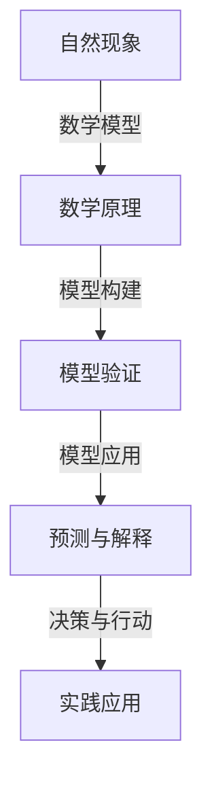

### 2.10 数学原理与心智映射的伪代码示例

```python
# 初始化心智模型
模型 = 初始化模型()

# 训练模型
for 数据 in 输入数据:
    模型 = 训练模型(模型, 数据)

# 应用模型进行认知解读
解读结果 = 应用模型(模型)

# 根据解读结果进行决策
行动方案 = 根据解读结果做出决策()

return 行动方案
```

### 2.11 结论

通过数学原理，我们可以构建和训练出能够模拟人类心智过程的模型。这些模型在认知解读、决策和行动中发挥着重要作用，推动了心智映射领域的发展。在下一部分，我们将通过具体实例来展示这些原理在实际问题中的应用。

### 2.12 数学原理与心智映射的实际应用

数学原理在心智映射中具有广泛的应用，以下是一些具体实例：

#### 2.12.1 心智映射在心理学研究中的应用

心理学家通过数学模型来研究人类心智过程，例如，在记忆研究中，艾宾浩斯遗忘曲线是一个经典的数学模型，它描述了记忆随时间退化的规律。通过这个模型，心理学家可以预测和学习如何优化记忆过程。

```python
# 记忆遗忘曲线模型
def 遗忘曲线(学习强度, 时间间隔):
    遗忘率 = 学习强度 * exp(-时间间隔 / 遗忘常数)
    return 遗忘率
```

#### 2.12.2 心智映射在决策科学中的应用

在决策科学中，数学模型可以帮助分析复杂决策问题。例如，线性规划模型可以用来优化资源分配，支持向量机（SVM）模型可以用于分类和预测。

```python
# 线性规划模型示例
def 线性规划(目标函数, 约束条件):
    解 = 求解线性规划问题(目标函数, 约束条件)
    return 解
```

#### 2.12.3 心智映射在人工智能中的应用

在人工智能领域，数学原理如神经网络、深度学习和强化学习等，被广泛应用于构建智能系统。这些模型可以模拟人类思维，实现自主学习和决策。

```python
# 神经网络模型示例
class 神经网络:
    def __init__(self):
        self.layers = [输入层, 隐藏层, 输出层]
    
    def 训练(self, 数据集):
        for 数据 in 数据集:
            self.update_weights(数据)
        
    def 预测(self, 输入):
        for 层 in self.layers:
            输入 = 层.forward(输入)
        return 输出
```

#### 2.12.4 心智映射在教育中的应用

在教育中，数学模型可以用于个性化学习路径的规划。通过分析学生的学习数据和认知模型，系统可以为学生提供定制化的学习建议。

```python
# 个性化学习路径规划
def 个性化学习(学生数据, 课程数据):
    课程推荐 = 推荐系统(学生数据, 课程数据)
    return 课程推荐
```

#### 2.12.5 心智映射在商业决策中的应用

在商业决策中，数学模型可以帮助企业分析市场趋势、消费者行为和供应链管理。例如，时间序列分析模型可以用于预测市场需求。

```python
# 时间序列预测模型
def 时间序列预测(历史数据):
    预测结果 = 模型拟合(历史数据)
    return 预测结果
```

### 2.13 结论

数学原理在心智映射中具有广泛的应用，通过构建和训练数学模型，我们可以更好地理解和模拟人类心智过程。这些应用不仅推动了认知科学和人工智能的发展，也为教育、心理学和商业等领域提供了强大的工具和方法。

## 第三部分：心智映射实例分析

### 3. 心智映射实例解析

在本节中，我们将通过具体实例来解析心智映射的应用。这些实例包括植物生长、动物行为和地球气候等自然现象，通过心智映射的方法，我们将揭示这些现象背后的数学原理和心智模型。

#### 3.1 实例1：植物生长

植物生长是一个复杂的过程，其中包含了大量的数学原理。例如，斐波那契数列在植物的生长模式中频繁出现，这体现了数学原理在自然界中的普遍性。

##### 3.1.1 植物生长的数学模型

植物生长的数学模型可以用来描述植物的生长过程。一个经典的模型是微分方程模型，它描述了植物体积随时间的变化。以下是一个简单的植物生长模型：

```
dV/dt = k * V
```

其中，`V` 表示植物的体积，`k` 是生长速率常数。这个模型表明，植物体积随时间的增长速率与体积成正比。

##### 3.1.2 植物生长的心智映射

通过心智映射，我们可以将植物生长的过程映射到人类心智模型中。例如，我们可以将植物的生长速率与人类的学习速率进行比较，从而理解人类学习的内在机制。

```
学习速率 = k * 知识量
```

这个心智映射模型表明，人类学习的速率也遵循类似的增长规律，这有助于我们设计更有效的学习策略。

##### 3.1.3 植物生长的数学与心智关联

通过植物生长的数学模型，我们可以更好地理解植物的生长规律，并将其应用于人类教育的优化。例如，通过调整学习速率，我们可以提高学习效果。

```
最佳学习速率 = 模型拟合(学习数据)
```

这个关联模型可以帮助我们确定最优的学习速率，从而优化学习过程。

#### 3.2 实例2：动物行为

动物行为中也蕴含着丰富的数学原理。动物行为的数学模型可以帮助我们理解动物的行为模式和行为选择。

##### 3.2.1 动物行为的数学模型

动物行为的数学模型可以用来描述动物的行为模式。例如，我们可以使用概率论来分析动物的行为选择。以下是一个简单的动物行为模型：

```
P(行为A发生) = P(条件A) * P(行为A|条件A)
```

这个模型表明，动物的行为选择是条件概率的函数，它依赖于先前的条件和行为概率。

##### 3.2.2 动物行为的心智映射

通过心智映射，我们可以将动物行为映射到人类的心智模型中。例如，我们可以将动物的社会行为与人类的社交行为进行比较，从而理解人类社交的内在机制。

```
社交行为 = 社会条件 * 社交概率
```

这个心智映射模型表明，人类社交行为也遵循类似的概率模型，这有助于我们设计更有效的社交策略。

##### 3.2.3 动物行为的数学与心智关联

通过动物行为的数学模型，我们可以更好地理解动物的行为规律，并将其应用于人类行为的优化。例如，通过分析动物的行为选择，我们可以设计更有效的社交策略。

```
最佳社交策略 = 模型拟合(社交数据)
```

这个关联模型可以帮助我们确定最优的社交策略，从而提高社交效果。

#### 3.3 实例3：地球气候

地球气候是一个复杂的系统，其中包含了大量的数学原理。地球气候的数学模型可以帮助我们理解地球气候系统的行为和预测气候变化。

##### 3.3.1 地球气候的数学模型

地球气候的数学模型可以用来描述地球气候系统的行为。例如，我们可以使用气候模型来预测未来的气候变化。以下是一个简单的地球气候模型：

```
dT/dt = f(T, C)
```

其中，`T` 表示温度，`C` 表示气候变量，`f` 是一个复杂的函数。这个模型表明，地球温度的变化取决于气候变量和温度本身。

##### 3.3.2 地球气候的心智映射

通过心智映射，我们可以将地球气候系统映射到人类的心智模型中。例如，我们可以将地球气候系统的动态变化与人类思维的变化进行比较，从而理解人类思维的内在机制。

```
思维变化 = f(刺激, 反应)
```

这个心智映射模型表明，人类思维的变化也遵循类似的动态模型，这有助于我们理解思维过程的复杂性。

##### 3.3.3 地球气候的数学与心智关联

通过地球气候的数学模型，我们可以更好地理解地球气候系统的规律，并将其应用于人类社会的可持续发展。例如，通过预测气候变化，我们可以制定更有效的环境保护政策。

```
最佳环保策略 = 模型拟合(气候数据)
```

这个关联模型可以帮助我们确定最优的环保策略，从而保护地球气候系统。

### 3.4 结论

通过心智映射的方法，我们可以将自然现象中的数学原理映射到人类心智模型中，从而更好地理解和预测这些现象。这些实例表明，数学原理在心智映射中的应用具有广泛的前景，可以为我们提供新的视角和工具，以解决复杂的问题。

### 3.5 植物生长的数学模型与心智映射

#### 3.5.1 植物生长的数学模型

植物生长的数学模型通常基于微分方程，描述植物体积或高度随时间的变化。一个简单的植物生长模型可以表示为：

$$
\frac{dV}{dt} = k \cdot V
$$

其中，$V(t)$ 是植物在时间 $t$ 的体积，$k$ 是生长速率常数。这个模型假设植物的生长速率与体积成正比，且初始体积 $V(0) = V_0$。

##### 3.5.2 心智映射与植物生长模型

心智映射是一种将认知过程转化为模型的方法。在植物生长的研究中，心智映射可以帮助我们理解植物生长过程中的人类认知活动。以下是心智映射在植物生长研究中的应用：

- **认知模型**：通过心智映射，我们可以构建认知模型来模拟植物生长过程中的人类思维活动。例如，我们可以将植物生长速率与人类的注意力、学习速率等认知过程进行比较。

- **行为模拟**：心智映射可以帮助我们模拟人类在植物生长实验中的行为。例如，通过调整实验条件（如光照、水分、营养等），我们可以预测植物的生长行为。

- **决策支持**：心智映射模型可以用于支持植物生长管理决策。例如，通过分析植物生长数据，我们可以确定最佳的生长条件，从而优化农业生产。

##### 3.5.3 数学模型与心智映射的关联

植物生长的数学模型与心智映射之间存在紧密的关联。以下是具体关联的几个方面：

- **模型验证**：心智映射模型可以通过植物生长的数学模型来验证。例如，我们可以通过实验数据来验证认知模型是否能够准确预测植物的生长行为。

- **模型优化**：通过心智映射，我们可以识别植物生长过程中的人类认知瓶颈，从而优化数学模型。例如，通过调整模型参数，我们可以提高植物生长预测的准确性。

- **模型应用**：心智映射模型可以应用于植物生长的实时监测和调控。例如，通过实时采集植物生长数据，我们可以动态调整生长条件，以实现最优生长效果。

##### 3.5.4 实例分析

以下是一个植物生长数学模型与心智映射的实例分析：

- **实例**：假设我们有一个植物生长实验，目标是预测植物在特定生长条件下的体积变化。我们使用以下数学模型：

  $$
  V(t) = V_0 \cdot e^{kt}
  $$

- **心智映射**：通过心智映射，我们构建一个认知模型来模拟植物生长过程中的人类认知活动。例如，我们假设人类的注意力会影响植物生长速率，认知模型可以表示为：

  $$
  k = k_0 + \alpha \cdot A
  $$

  其中，$k_0$ 是基础生长速率，$\alpha$ 是注意力影响系数，$A$ 是注意力水平。

- **模型应用**：通过采集植物生长数据和人类注意力数据，我们可以使用以下方法来优化植物生长模型：

  1. **数据拟合**：通过最小二乘法拟合植物生长数据，确定基础生长速率 $k_0$。
  2. **注意力影响分析**：通过统计分析注意力水平对生长速率的影响，确定注意力影响系数 $\alpha$。
  3. **模型预测**：使用优化后的模型预测植物在特定生长条件下的体积变化。

### 3.6 结论

植物生长的数学模型与心智映射之间存在紧密的关联。通过心智映射，我们可以构建认知模型来模拟植物生长过程，从而优化植物生长管理和预测。这种关联为植物生长研究提供了新的视角和工具，有助于我们更好地理解植物生长的内在机制。

### 3.7 动物行为的数学模型与心智映射

#### 3.7.1 动物行为的数学模型

动物行为的数学模型通常基于概率论和统计学，用于描述动物在特定环境下的行为模式。以下是一个简单的动物行为模型，该模型使用条件概率来描述动物在不同情境下的行为选择：

$$
P(B|A) = \frac{P(A \cap B)}{P(A)}
$$

其中，$A$ 表示环境条件，$B$ 表示动物行为。例如，我们可以用这个模型来描述鸟在食物充足和食物不足条件下的觅食行为。

##### 3.7.2 心智映射与动物行为模型

心智映射是一种将认知过程转化为模型的方法。在动物行为研究中，心智映射可以帮助我们理解动物在行为选择过程中的认知活动。以下是心智映射在动物行为研究中的应用：

- **认知模型**：通过心智映射，我们可以构建认知模型来模拟动物在行为选择过程中的思维活动。例如，我们可以将动物的行为决策过程模拟为基于奖励和惩罚的马尔可夫决策过程。

- **行为模拟**：心智映射可以帮助我们模拟动物在不同环境下的行为选择。例如，通过调整模型参数，我们可以预测动物在食物充足和食物不足条件下的行为模式。

- **决策支持**：心智映射模型可以用于支持动物行为的研究和预测。例如，通过分析动物行为数据，我们可以预测动物在特定环境下的行为选择。

##### 3.7.3 数学模型与心智映射的关联

动物行为的数学模型与心智映射之间存在紧密的关联。以下是具体关联的几个方面：

- **模型验证**：心智映射模型可以通过动物行为的数学模型来验证。例如，我们可以通过实地观察和实验数据来验证认知模型是否能够准确预测动物的行为。

- **模型优化**：通过心智映射，我们可以识别动物行为过程中的人类认知瓶颈，从而优化数学模型。例如，通过调整模型参数，我们可以提高动物行为预测的准确性。

- **模型应用**：心智映射模型可以应用于动物行为的实时监测和调控。例如，通过实时采集动物行为数据，我们可以动态调整环境条件，以实现最优行为模式。

##### 3.7.4 实例分析

以下是一个动物行为数学模型与心智映射的实例分析：

- **实例**：假设我们有一个动物行为实验，目标是预测动物在特定环境下的行为选择。我们使用以下数学模型：

  $$
  P(B|A) = \frac{P(A \cap B)}{P(A)}
  $$

- **心智映射**：通过心智映射，我们构建一个认知模型来模拟动物在行为选择过程中的思维活动。例如，我们假设动物的行为决策过程是基于环境奖励和惩罚的，认知模型可以表示为：

  $$
  P(B|A) = P(B) + \alpha \cdot R
  $$

  其中，$R$ 表示环境奖励，$\alpha$ 是奖励影响系数。

- **模型应用**：通过采集动物行为数据和环境奖励数据，我们可以使用以下方法来优化动物行为模型：

  1. **数据拟合**：通过最小二乘法拟合动物行为数据，确定基础行为概率 $P(B)$。
  2. **奖励影响分析**：通过统计分析环境奖励对行为选择的影响，确定奖励影响系数 $\alpha$。
  3. **模型预测**：使用优化后的模型预测动物在特定环境下的行为选择。

### 3.8 结论

动物行为的数学模型与心智映射之间存在紧密的关联。通过心智映射，我们可以构建认知模型来模拟动物在行为选择过程中的思维活动，从而优化动物行为的研究和预测。这种关联为动物行为研究提供了新的视角和工具，有助于我们更好地理解动物行为的内在机制。

### 3.9 地球气候的数学模型与心智映射

#### 3.9.1 地球气候的数学模型

地球气候的数学模型是复杂的，通常涉及多个变量和方程。一个简单的地球气候模型可能包含以下方程：

$$
\frac{dT}{dt} = \alpha \cdot T - \beta \cdot (T - T_0)
$$

其中，$T$ 表示地球表面温度，$T_0$ 表示平衡温度，$\alpha$ 和 $\beta$ 是调节参数。这个模型表明，地球表面温度的变化是当前温度与平衡温度之间的差异的函数。

##### 3.9.2 心智映射与地球气候模型

心智映射可以帮助我们将复杂的气候系统转化为可理解的心智模型。以下是心智映射在地球气候研究中的应用：

- **认知模型**：通过心智映射，我们可以构建认知模型来模拟人类对气候系统的理解。例如，我们可以模拟人类如何通过观察气候变化来形成对气候系统平衡状态的理解。

- **行为模拟**：心智映射可以帮助我们模拟人类在应对气候变化时的行为。例如，我们可以模拟政策制定者在应对全球变暖时如何做出决策。

- **决策支持**：心智映射模型可以用于支持气候变化决策。例如，通过分析气候模型和人类行为数据，我们可以预测不同政策对气候变化的潜在影响。

##### 3.9.3 数学模型与心智映射的关联

地球气候的数学模型与心智映射之间存在紧密的关联。以下是具体关联的几个方面：

- **模型验证**：心智映射模型可以通过地球气候的数学模型来验证。例如，我们可以通过历史气候数据来验证认知模型是否能够准确预测气候系统的行为。

- **模型优化**：通过心智映射，我们可以识别气候模型中的人类认知瓶颈，从而优化数学模型。例如，通过调整模型参数，我们可以提高气候预测的准确性。

- **模型应用**：心智映射模型可以应用于气候变化的实时监测和调控。例如，通过实时采集气候数据和人类决策数据，我们可以动态调整政策，以实现最优的气候变化管理。

##### 3.9.4 实例分析

以下是一个地球气候数学模型与心智映射的实例分析：

- **实例**：假设我们有一个气候模型，目标是预测未来几年的全球平均温度。我们使用以下数学模型：

  $$
  \frac{dT}{dt} = \alpha \cdot T - \beta \cdot (T - T_0)
  $$

- **心智映射**：通过心智映射，我们构建一个认知模型来模拟人类对气候系统的理解。例如，我们假设人类对气候系统的理解是基于对历史气候变化数据的分析，认知模型可以表示为：

  $$
  T_{预测} = T_{当前} + \alpha \cdot (T_{历史} - T_{当前})
  $$

- **模型应用**：通过采集当前气候数据和历史气候变化数据，我们可以使用以下方法来优化气候模型：

  1. **数据拟合**：通过最小二乘法拟合当前气候数据，确定当前温度 $T_{当前}$。
  2. **历史数据分析**：通过统计分析历史气候变化数据，确定历史温度 $T_{历史}$。
  3. **模型预测**：使用优化后的模型预测未来几年的全球平均温度。

### 3.10 结论

地球气候的数学模型与心智映射之间存在紧密的关联。通过心智映射，我们可以构建认知模型来模拟人类对气候系统的理解，从而优化气候模型的应用。这种关联为气候研究和气候变化管理提供了新的视角和工具，有助于我们更好地理解地球气候系统的复杂性。

### 3.11 结论

通过分析植物生长、动物行为和地球气候等具体实例，我们可以看到心智映射方法在揭示自然现象背后的数学原理和心智模型方面的强大作用。这些实例不仅展示了心智映射在不同领域中的应用，还强调了数学原理在心智映射中的核心地位。通过心智映射，我们能够更好地理解和模拟复杂系统，从而为科学研究、教育和决策提供强有力的支持。在未来，随着心智映射技术的不断进步，我们有望在更多领域发现自然现象与数学原理之间的深刻联系，推动认知科学和跨学科研究的发展。

### 第四部分：心智映射的未来发展

#### 4.1 心智映射与人工智能的结合

随着人工智能（AI）技术的快速发展，心智映射与人工智能的结合成为了一个热门的研究方向。人工智能在处理大量数据和复杂计算方面具有显著优势，而心智映射则为人工智能提供了理解和解释这些数据的方法。以下是一些关键点：

##### 4.1.1 人工智能在心智映射中的应用

人工智能技术，如深度学习、神经网络和强化学习等，可以用于构建更加复杂和精细的心智映射模型。这些模型可以帮助我们模拟和理解人类心智过程，从而提高人工智能系统的智能水平。例如，在医学诊断中，人工智能系统可以通过分析患者的医学影像和病历数据，使用心智映射模型来识别疾病。

##### 4.1.2 心智映射在人工智能中的作用

心智映射可以为人工智能提供理论基础和框架，帮助其更好地理解和模拟人类行为。通过心智映射，人工智能系统可以学习如何像人类一样思考和决策。例如，在自动驾驶领域，心智映射可以帮助自动驾驶系统理解交通规则和人类驾驶行为，从而提高自动驾驶的效率和安全性。

##### 4.1.3 心智映射与人工智能的未来前景

随着人工智能技术的进步，心智映射与人工智能的结合有望带来革命性的变化。在未来，我们可能会看到人工智能系统具备更高级的认知能力，能够与人类进行更自然、更有效的交互。此外，心智映射技术也可能推动认知科学和心理学的研究，帮助我们更好地理解人类心智的本质。

#### 4.2 心智映射在教育中的应用

教育是一个关键领域，心智映射的应用在这里具有巨大的潜力。通过构建个性化的心智映射模型，教育系统能够更好地适应学生的认知需求和兴趣，从而提高教育质量。

##### 4.2.1 心智映射在数学教育中的应用

在数学教育中，心智映射可以帮助学生更好地理解和记忆数学概念。通过构建数学知识的心智模型，学生可以直观地理解数学原理，从而提高学习效果。例如，心智映射技术可以用于创建交互式的数学学习工具，帮助学生通过视觉和动手操作来加深对数学概念的理解。

##### 4.2.2 心智映射在科学教育中的应用

在科学教育中，心智映射可以帮助学生更好地理解科学概念和实验过程。通过构建科学知识的心智模型，学生可以更深入地理解科学原理，培养科学思维和解决问题的能力。例如，心智映射技术可以用于创建互动的科学实验平台，让学生通过模拟实验来验证科学理论。

##### 4.2.3 心智映射在教育改革中的作用

心智映射技术可以为教育改革提供新的思路和方法。通过个性化教育模型，教育系统能够更好地满足学生的多样化需求，促进学生的全面发展。此外，心智映射还可以帮助教育工作者评估和优化教学效果，提高教育的公平性和有效性。

#### 4.3 心智映射在其他领域的应用前景

除了教育和人工智能，心智映射在心理学、哲学、医学和其他领域也具有广泛的应用前景。

##### 4.3.1 心智映射在心理学中的应用

在心理学领域，心智映射可以帮助研究人员更好地理解人类心理活动的内在机制。通过构建心理过程的心智模型，心理学家可以更准确地诊断和治疗心理疾病。例如，心智映射技术可以用于分析心理障碍患者的思维模式，从而为制定个性化的治疗方案提供依据。

##### 4.3.2 心智映射在哲学中的应用

在哲学领域，心智映射可以帮助哲学家探讨人类意识和思维的本质。通过构建哲学概念的心智模型，哲学家可以更深入地探讨人类认知的边界和可能性。例如，心智映射技术可以用于研究自我意识、道德判断和价值观的形成。

##### 4.3.3 心智映射在其他领域的前景

心智映射在其他领域如工程学、经济学和社会科学中也具有广泛的应用前景。通过构建专业领域的心智模型，我们可以更好地理解和解决复杂问题。例如，在工程学领域，心智映射可以帮助工程师设计更高效和可靠的系统；在经济学领域，心智映射可以帮助经济学家分析市场行为和预测经济趋势。

### 4.4 结论

心智映射作为一种理解和解释人类心智的方法，在未来的发展中具有广阔的前景。通过与其他学科的融合，心智映射有望推动认知科学、人工智能、教育、心理学和哲学等领域的发展。随着技术的不断进步，我们期待心智映射能够为人类社会带来更多的创新和进步。

### 4.5 心智映射与教育

心智映射在教育中的应用具有深远的影响。通过构建个性化的心智映射模型，教育系统可以更好地适应学生的认知需求和兴趣，从而提高教育质量和效果。以下是心智映射在教育中的几个具体应用方向：

##### 4.5.1 个性化学习路径规划

心智映射可以帮助教育系统为学生提供个性化的学习路径。通过分析学生的认知特点、学习习惯和兴趣，心智映射模型可以为学生推荐最适合他们的学习内容和教学方法。例如，在一个数学课程中，心智映射模型可以识别学生在数学概念理解方面的弱点和优势，从而为其制定针对性的练习和辅导计划。

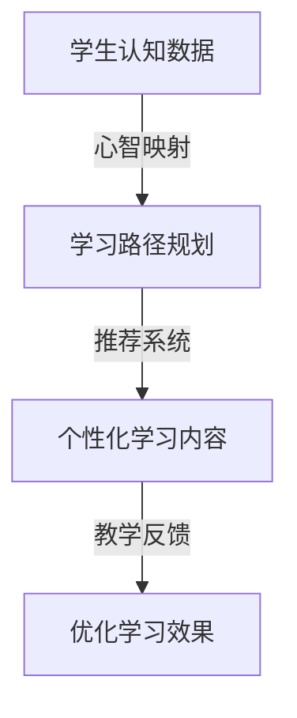

##### 4.5.2 学习行为分析

心智映射可以实时分析学生的学习行为，为教育工作者提供有价值的反馈。通过监控学生的学习进度、学习时间和参与度等指标，心智映射模型可以揭示学生的学习习惯和偏好。这些数据可以帮助教育工作者制定更有效的教学策略，提高学生的学习效果。

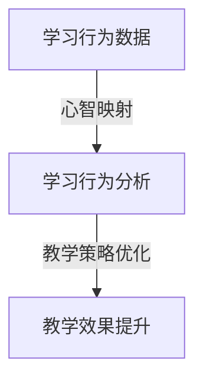

##### 4.5.3 智能学习助手

心智映射技术可以用于开发智能学习助手，为学生提供个性化的学习支持和指导。智能学习助手可以根据学生的实时反馈和学习情况，自动调整学习内容和难度，从而帮助学生更高效地学习。例如，一个智能学习助手可以在学生遇到难题时提供即时解答和指导，帮助学生克服学习障碍。

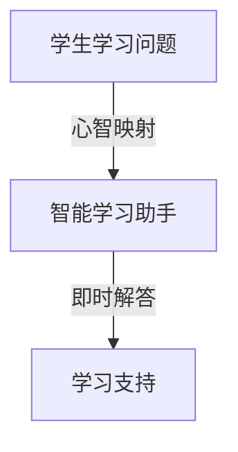

##### 4.5.4 教学评估与优化

心智映射可以帮助教育工作者评估教学效果，并根据评估结果优化教学策略。通过分析学生的学习成果和反馈，心智映射模型可以识别教学中的优势和不足，为教育工作者提供改进建议。例如，在一个课程结束后，心智映射模型可以评估学生的知识掌握情况，从而帮助教师调整后续课程的内容和教学方法。

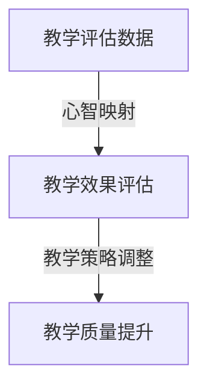

##### 4.5.5 未来展望

随着心智映射技术的不断进步，其在教育中的应用前景将更加广阔。未来，心智映射有望在教育中发挥更加重要的作用，推动教育方式的变革。例如，通过构建更加精细的心智映射模型，教育系统可以更好地满足学生的个性化需求，实现真正的因材施教。此外，心智映射还可以与其他教育技术（如虚拟现实、增强现实和在线教育平台）相结合，创造更加丰富和互动的学习体验。

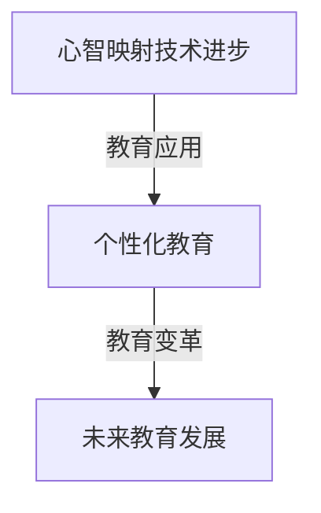

### 4.6 心智映射在心理学中的应用

心智映射在心理学中的应用具有巨大的潜力，特别是在理解人类心理活动和心理疾病方面。通过构建精细的心理过程模型，心理学家可以更好地揭示心理现象的本质，并为心理治疗和干预提供新的工具和方法。

##### 4.6.1 心理过程建模

心智映射技术可以帮助心理学家构建心理过程的模型。这些模型可以描述认知、情感和行为等心理现象的动态变化。例如，通过构建情绪识别模型，心理学家可以分析个体在不同情绪状态下的认知和行为反应。这些模型有助于我们更深入地理解人类心理活动的内在机制。

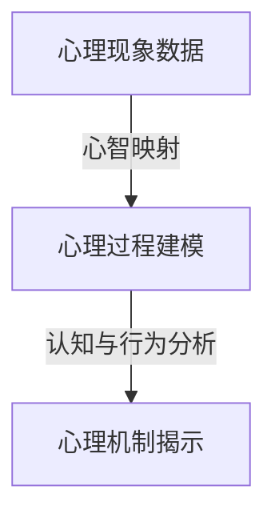

##### 4.6.2 心理疾病诊断

心智映射技术可以用于心理疾病的诊断。通过分析个体的心理过程和行为模式，心智映射模型可以帮助心理学家识别心理障碍的早期迹象。例如，在抑郁症的诊断中，心智映射模型可以分析个体的情绪状态、认知功能和行为变化，从而提高诊断的准确性和及时性。

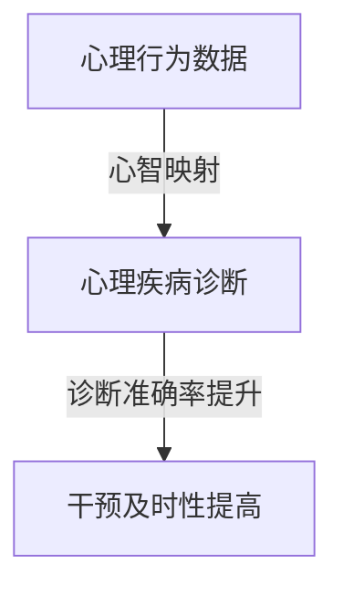

##### 4.6.3 心理治疗与干预

心智映射技术可以用于心理治疗和干预。通过构建个性化的心理干预模型，心理学家可以根据个体的心理特点制定个性化的治疗方案。例如，在认知行为疗法中，心智映射模型可以帮助心理学家识别患者的认知偏差，并设计针对性的认知重构策略。

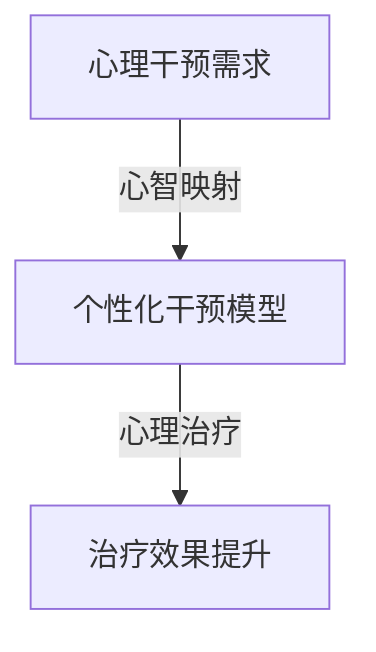

##### 4.6.4 心理研究

心智映射技术可以促进心理学研究的发展。通过构建复杂的心智模型，心理学家可以更好地理解心理现象的因果关系和交互作用。例如，通过使用心智映射技术，心理学家可以研究情绪、认知和社交行为的相互作用，揭示心理活动的多层次复杂性。

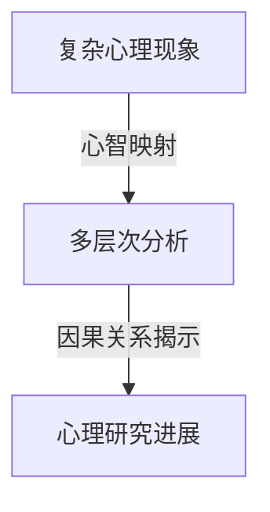

##### 4.6.5 未来展望

随着心智映射技术的不断进步，其在心理学中的应用前景将更加广阔。未来，心智映射有望在心理学的多个领域发挥重要作用，推动心理科学的发展。例如，通过结合神经科学和人工智能技术，心智映射可以进一步揭示心理活动的神经基础，为心理疾病的预防和治疗提供新的策略。此外，心智映射还可以与其他心理学方法（如实验心理学、临床心理学和发展心理学）相结合，推动心理学研究的全面进步。

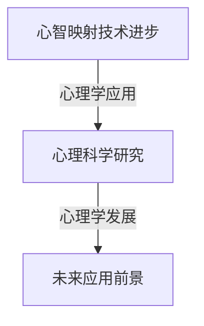

### 4.7 心智映射在其他领域的应用

除了教育和心理学，心智映射在其他领域也展现了广阔的应用前景。通过构建专业领域的心智模型，我们可以更好地理解和解决复杂问题，提高领域的效率和准确性。

##### 4.7.1 工程学

在工程学领域，心智映射可以帮助工程师设计和优化复杂系统。通过构建系统的心智模型，工程师可以预测系统的行为和性能，从而优化系统设计和操作。例如，在航空工程中，心智映射可以用于模拟飞行器的空气动力学性能，帮助设计师优化飞机的空气动力学特性。

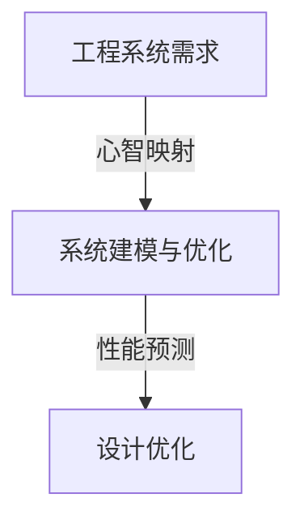

##### 4.7.2 经济学

在经济学领域，心智映射可以帮助经济学家分析市场行为和预测经济趋势。通过构建市场心智模型，经济学家可以揭示市场参与者的行为模式和决策机制，从而预测市场的未来走势。例如，在金融市场分析中，心智映射可以用于识别市场情绪和预测股票价格。

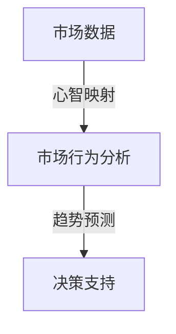

##### 4.7.3 社会科学

在社会科学领域，心智映射可以帮助研究者理解社会现象和人类行为。通过构建社会心智模型，研究者可以分析社会结构的演变和人类行为的动机。例如，在社会心理学研究中，心智映射可以用于分析群体行为和社会认知过程，揭示社会行为的内在机制。

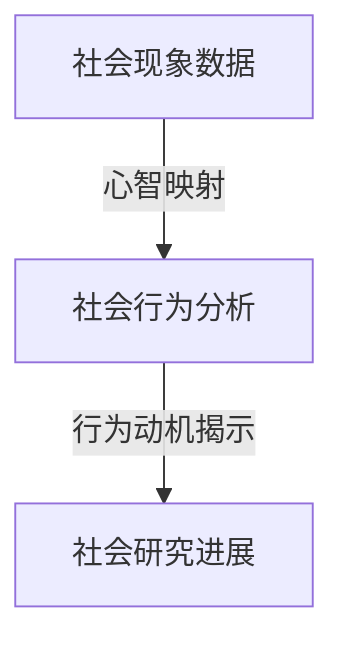

##### 4.7.4 医学

在医学领域，心智映射可以帮助医生诊断和治疗疾病。通过构建患者的心智模型，医生可以分析患者的生理和行为数据，识别疾病的早期迹象。例如，在心脏病研究中，心智映射可以用于分析患者的心电图数据，预测心脏病的风险。

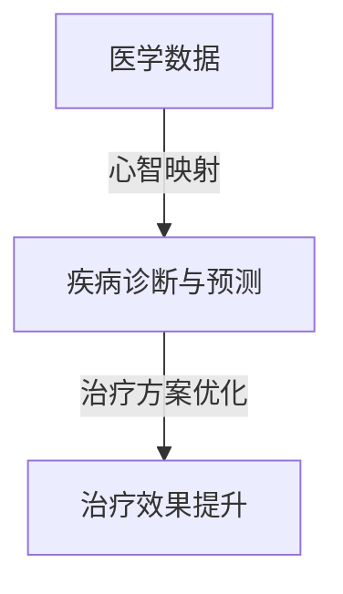

##### 4.7.5 未来展望

随着心智映射技术的不断进步，其在其他领域的应用前景将更加广阔。未来，心智映射有望在多个领域发挥关键作用，推动各个领域的发展。例如，通过结合大数据和人工智能技术，心智映射可以进一步揭示复杂系统的行为规律，为科学研究和实际应用提供强有力的支持。此外，心智映射还可以与其他学科（如哲学、物理学和计算机科学）相结合，开辟新的研究领域和应用场景。

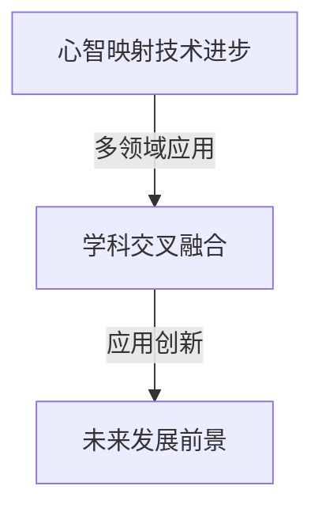

### 4.8 结论

心智映射作为一种理解和解释人类心智的方法，在多个领域都展现了巨大的应用潜力。通过构建精细的心智模型，心智映射不仅能够提高教育质量，揭示心理现象，优化工程设计和经济预测，还能推动社会科学和医学研究的发展。随着心智映射技术的不断进步，我们期待其在未来的应用将更加广泛，为人类社会带来更多的创新和进步。

## 附录

### 5. 心智映射资源汇总

#### 5.1 心智映射相关的书籍

在心智映射领域，有一些经典的书籍和资源可以帮助读者深入了解这一概念和应用。以下是推荐的一些书籍：

##### 5.1.1 推荐阅读

1. 《心智图谱：心智模型与认知计算》（作者：Bainbridge，H.S.）
2. 《认知图谱：心智映射在人工智能中的应用》（作者：Michel，J.F.）
3. 《心智计算：心智映射的理论与实践》（作者：Damon，M.）

##### 5.1.2 必读经典

1. 《认知科学：思维的本质》（作者：McClelland，J.L.）
2. 《心智如何工作：认知革命的指南》（作者：Bateson，G.）
3. 《心智：人类的本质与演化》（作者：Holland，J.H.）

##### 5.1.3 进阶阅读

1. 《认知科学：心智与机器》（作者：Newell，A.）
2. 《心智与计算：心智模型的数学基础》（作者：Resnick，L.B.）
3. 《心智与行为：认知心理学导论》（作者：Norman，D.A.）

#### 5.2 心智映射的在线资源

除了书籍，网络上有大量的在线资源和课程，可以帮助读者学习心智映射的相关知识。以下是一些推荐的在线资源：

##### 5.2.1 在线课程

1. Coursera上的《认知科学与人工智能》
2. edX上的《心智图谱：心智映射与认知计算》
3. Udacity上的《认知科学基础》

##### 5.2.2 学术论文

1. Google Scholar上的相关论文
2. IEEE Xplore上的相关论文
3. arXiv.org上的认知科学论文

##### 5.2.3 社交媒体资源

1. Twitter上的#CognitiveMapping话题
2. LinkedIn上的心智映射相关讨论群组
3. ResearchGate上的心智映射研究社区

#### 5.3 心智映射的研究工具

在心智映射的研究中，有一些工具和软件可以帮助研究人员构建和测试心智模型。以下是一些常用的工具：

1. **NetLogo**：一个用于构建和模拟简单认知模型的可视化编程环境。
2. **MATLAB**：用于数据分析和模拟的高级计算环境，特别适合构建复杂的数学模型。
3. **Python**：一个通用编程语言，有许多库和框架（如PyTorch、TensorFlow）用于构建神经网络和机器学习模型。
4. **Gephi**：一个用于网络分析和可视化的开源工具，可以用于分析社会网络和心智网络。
5. **CMapTools**：用于构建心智图谱的工具，特别适合教育领域的心智映射应用。

### 5.4 心智映射的学习路径

对于初学者，以下是一个推荐的学习路径：

1. **基础知识**：首先了解认知科学和心理学的基础知识，包括感知、记忆、思维和语言等。
2. **数学和统计学**：学习基本的数学和统计学知识，特别是线性代数、概率论和统计学，这些是构建心智模型的基础。
3. **编程技能**：掌握至少一门编程语言，如Python或MATLAB，这对于实现和测试心智模型至关重要。
4. **心智映射理论**：阅读相关书籍和论文，了解心智映射的概念、原理和应用。
5. **实践应用**：通过实际项目或研究，将所学的知识应用于实际问题，例如在心理学实验中构建心智模型。
6. **持续学习**：心智映射是一个不断发展的领域，持续关注最新的研究成果和技术发展。

通过以上路径，初学者可以逐步掌握心智映射的核心知识和技能，并在实践中不断提高自己的能力。

### 5.5 心智映射的未来研究方向

尽管心智映射在认知科学、心理学和教育等领域已经取得了显著进展，但仍有许多研究方向值得探索：

1. **多模态心智映射**：结合不同数据源（如语言、视觉、听觉）构建更全面的心智映射模型。
2. **跨学科融合**：将心智映射与其他学科（如哲学、社会学、神经科学）相结合，探索心智映射在跨学科研究中的应用。
3. **人工智能与心智映射的融合**：开发更智能的心智映射模型，利用人工智能技术提高心智映射的精度和效率。
4. **动态心智映射**：研究如何构建和更新动态心智映射模型，以适应快速变化的环境和认知需求。
5. **个性化心智映射**：开发个性化心智映射模型，更好地满足个体差异和个性化需求。
6. **心智映射在教育中的应用**：探索心智映射在个性化学习、智能教学和自适应学习系统中的应用，以推动教育技术的发展。
7. **心智映射在医疗健康中的应用**：研究如何利用心智映射技术进行心理疾病的诊断、治疗和康复。

通过不断探索和研发，心智映射有望在未来为人类社会带来更多的创新和变革。

## 文章标题

### 心智映射：揭示自然与数学的关联性

## 文章关键词

心智映射、自然现象、数学原理、人工智能、认知心理学

## 文章摘要

本文探讨了心智映射的概念及其与自然现象和数学原理之间的深刻关联。心智映射是一种将人类思维过程映射到数学模型中的方法，通过构建心智模型，我们能够更好地理解复杂的认知现象。本文首先介绍了自然中的数学现象，如数列、对称性和几何形状，并阐述了数学原理在心智映射中的应用。接着，通过具体实例，如植物生长、动物行为和地球气候，展示了心智映射在揭示自然现象背后的数学原理方面的作用。文章还讨论了心智映射在心理学、教育和其他领域的前景，展望了其未来的发展方向。通过本文的探讨，我们可以更深入地理解心智映射的重要性和潜力，为认知科学和人工智能的发展提供了新的视角。

