                 

# 心智映射：自然界的数学之美

> 关键词：心智映射、数学、自然界、现象、应用、未来

> 摘要：本文旨在探讨心智映射在自然界中的数学之美。通过深入研究数学与自然界的紧密联系，揭示心智映射的核心概念和原理，并探讨其在天文学、生物学、地球科学、物理学等领域的广泛应用。本文还将探讨心智映射在心理学、认知科学和情感计算等领域的应用，并展望其未来的发展趋势。

## 目录大纲

1. 引言
2. 数学基础
   - 2.1 基础数学概念
   - 2.2 数学原理
3. 自然界的数学现象
   - 3.1 天文学
   - 3.2 生物学
   - 3.3 地球科学
   - 3.4 物理学
4. 心智映射的应用
   - 4.1 心理学的数学建模
   - 4.2 认知科学的数学理论
   - 4.3 情感计算的数学方法
5. 心智映射的发展与未来
6. 结论
7. 参考文献

## 第1章 引言

### 1.1 研究背景

心智映射是一种将人类心智活动与数学模型相结合的研究方法，旨在揭示自然界中的数学规律。数学与自然界的关系自古以来就被广泛探讨。从古希腊哲学家毕达哥拉斯的“万物皆数”到现代科学对宇宙的深入研究，数学在自然界中扮演了重要的角色。

### 1.1.1 数学与自然界的关系

数学与自然界的关系可以从多个角度进行探讨。首先，数学作为一种抽象的符号系统，能够准确地描述自然界中的现象。例如，牛顿的运动定律和万有引力定律都是用数学公式表达的。

其次，数学在自然界中的广泛应用也揭示了自然界中的数学规律。例如，在生物学中，生物体的几何结构往往遵循着数学规律，如斐波那契数列在植物生长中的体现。

### 1.1.2 心智映射的概念

心智映射是指将人类心智活动与数学模型相结合，以揭示自然界中的数学规律。心智映射的核心是建立数学模型，并通过这些模型来描述和解释自然界中的现象。

### 1.1.3 本书的研究目的和结构

本书的研究目的在于探讨心智映射在自然界中的应用，并揭示其中的数学之美。本书将分为以下几个部分：

- 第1章：介绍心智映射的概念、数学与自然界的关系以及本书的研究目的和结构。
- 第2章：介绍数学的基础知识，包括数字与算术、几何与空间、概率与统计等。
- 第3章：探讨自然界中的数学现象，包括天文学、生物学、地球科学、物理学等。
- 第4章：介绍心智映射在心理学、认知科学和情感计算等领域的应用。
- 第5章：讨论心智映射的发展与未来。
- 第6章：总结本书的主要结论，并对未来研究进行展望。

通过以上章节的论述，本书旨在为读者提供对心智映射在自然界中应用的全面了解，并激发读者对数学与自然界关系的深入思考。

## 第2章 数学基础

### 2.1 基础数学概念

数学是研究数量、结构、变化和空间等概念的一门学科。在自然界中，数学作为一种抽象的符号系统，能够准确地描述和解释各种现象。为了更好地理解心智映射在自然界中的应用，我们需要首先掌握一些基础数学概念。

#### 2.1.1 数字与算术

数字与算术是数学的基础。数字是表示数量的符号，而算术是关于数字运算的规则和方法。以下是一些基本的数字和算术概念：

- **自然数**：自然数是从1开始的正整数集合，如1, 2, 3, 4, ...
- **整数**：整数包括自然数、零和所有负整数，如...-3, -2, -1, 0, 1, 2, 3, ...
- **有理数**：有理数是可以表示为两个整数之比的数，包括整数和分数，如1/2, -3/4, ...
- **无理数**：无理数是不能表示为两个整数之比的数，如π（圆周率）、√2（根号2）等。

#### 2.1.2 几何与空间

几何与空间是研究形状、大小和位置关系的数学分支。以下是一些基本的几何和空间概念：

- **点**：点是没有大小的位置，可以用坐标来表示。
- **线**：线是由无数个点组成的，可以延伸到无限远。
- **面**：面是由无数条线组成的，也有边界。
- **体**：体是由无数个面组成的，具有三维结构。

#### 2.1.3 概率与统计

概率与统计是研究随机事件和数据的数学分支。以下是一些基本的概率和统计概念：

- **概率**：概率是描述某个事件发生的可能性大小的数值，介于0和1之间。
- **统计**：统计是对数据进行收集、整理、分析和解释的方法。

#### 2.1.4 函数与方程

函数与方程是数学中用于描述变量之间关系的工具。以下是一些基本的函数和方程概念：

- **函数**：函数是一种特殊的关系，将每个输入值映射到唯一的输出值。
- **方程**：方程是一个数学等式，其中包含一个或多个未知数。

### 2.2 数学原理

数学原理是数学概念和规则的基础。以下是一些基本的数学原理：

- **公理**：公理是数学中的基本假设，是数学推理的基础。
- **定理**：定理是经过证明的数学结论，是数学理论的核心。
- **证明**：证明是数学推理的一种方法，用于证明定理或公式。

通过掌握这些基础数学概念和原理，我们能够更好地理解心智映射在自然界中的应用，并在解决实际问题时运用数学方法。

### 2.3 数学在心智映射中的应用

数学在心智映射中扮演着关键角色。通过建立数学模型，我们可以将心智活动与自然界中的现象进行关联。以下是一些数学在心智映射中的应用：

- **概率与统计模型**：概率与统计模型可以用于预测和解释自然界中的随机事件，如天气预报和金融市场分析。
- **几何模型**：几何模型可以用于描述和解释自然界中的形状和结构，如生物体的几何结构。
- **方程模型**：方程模型可以用于描述和解释自然界中的物理现象，如天体的运动和地球的内部结构。

通过运用数学原理和模型，我们能够更深入地理解自然界中的数学规律，并运用心智映射的方法解决实际问题。

### 2.4 心智映射的数学基础

心智映射的数学基础是数学模型。数学模型是将现实世界中的现象和问题转化为数学表达的形式，以便进行定量分析和研究。以下是一些关键概念：

- **模型构建**：模型构建是将现实世界中的问题转化为数学表达的过程。这通常涉及定义变量、确定关系和建立方程。
- **参数估计**：参数估计是确定数学模型中参数的过程。这通常涉及使用统计方法对数据进行分析和拟合。
- **模型验证**：模型验证是评估数学模型准确性和可靠性的过程。这通常涉及将模型应用于实际数据，并评估其预测能力。

通过构建和验证数学模型，我们可以更好地理解自然界中的现象，并运用心智映射的方法进行科学研究和实际应用。

## 第3章 自然界的数学现象

### 3.1 天文学

天文学是研究宇宙中天体的科学。在天文学中，数学发挥着至关重要的作用，用于描述和解释天体的运动、结构和演化。以下是天文学中的几个数学现象：

#### 3.1.1 天体的运动规律

天体的运动规律可以通过牛顿的运动定律和开普勒定律来描述。以下是一个简单的 Mermaid 流程图，展示了天体运动的基本概念：

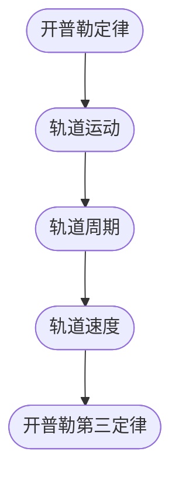

- **开普勒定律**：开普勒定律是描述行星围绕太阳运动的规律。第一定律描述了行星轨道是椭圆形的，太阳位于椭圆的一个焦点上。第二定律描述了行星在轨道上的速度变化，当行星靠近太阳时速度变快，远离太阳时速度变慢。第三定律描述了行星轨道周期与半长轴之间的关系。

- **轨道运动**：轨道运动是指天体在空间中的运动轨迹。轨道运动可以通过牛顿的运动定律来描述。牛顿的第二定律描述了天体受到的力与加速度之间的关系，第三定律描述了天体之间的引力作用。

- **轨道周期**：轨道周期是指天体绕行轨道所需的时间。轨道周期与轨道半长轴之间存在关系，可以通过开普勒第三定律来描述。

- **轨道速度**：轨道速度是指天体在轨道上的速度。轨道速度与轨道周期和轨道半径之间存在关系，可以通过牛顿的运动定律来计算。

#### 3.1.2 宇宙的数学结构

宇宙的数学结构包括了许多概念，如多维度空间、超弦理论和宇宙膨胀等。以下是一个简单的 Mermaid 流程图，展示了这些概念之间的联系：

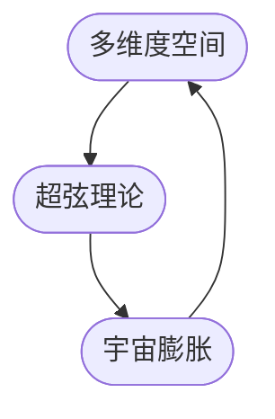

- **多维度空间**：多维度空间是指宇宙中的空间维度超过三维的空间。多维度空间的概念在理论物理学中具有重要意义，如超弦理论和膜理论。

- **超弦理论**：超弦理论是一种试图统一所有基本力的理论。超弦理论假设宇宙中的基本粒子是由微型弦振动形成的。超弦理论涉及多维度空间，并在数学上具有高度复杂性和挑战性。

- **宇宙膨胀**：宇宙膨胀是指宇宙在宇宙大爆炸之后不断扩张的现象。宇宙膨胀可以通过哈勃定律来描述，该定律表明宇宙的膨胀速度与距离成正比。

#### 3.1.3 天文学的数学应用

天文学的数学应用包括轨道计算、星系结构和恒星演化等。以下是一个 Mermaid 流程图，展示了天文学中的数学应用：

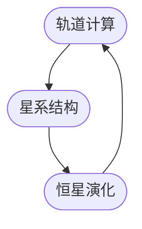

- **轨道计算**：轨道计算是计算天体在空间中的运动轨迹。轨道计算通常涉及求解天体之间的引力作用和运动方程。轨道计算在卫星导航、航天任务和天体物理学研究中具有重要意义。

- **星系结构**：星系结构是指星系中恒星、星团和星云等天体的分布和运动。星系结构的研究可以通过观测数据和数学模型来进行。星系结构的研究有助于理解宇宙的演化和星系的性质。

- **恒星演化**：恒星演化是指恒星从诞生到死亡的过程。恒星演化的研究可以通过数学模型和观测数据来进行。恒星演化模型可以帮助我们理解恒星的内部结构、能量产生和演化过程。

通过以上天文学中的数学现象和应用，我们可以看到数学在描述和解释宇宙中的现象中的重要性。数学不仅为天文学提供了工具和理论，也为其他科学领域提供了启示和借鉴。

### 3.2 生物学

生物学是研究生命现象和生命系统的科学。在生物学中，数学的应用同样广泛，可以帮助我们理解和解释生物体的结构和行为。以下是生物学中的几个数学现象：

#### 3.2.1 生物体的几何结构

生物体的几何结构是指生物体在空间中的形状和排列方式。许多生物体的几何结构遵循着数学规律，例如斐波那契数列和黄金比例。以下是一个简单的 Mermaid 流程图，展示了生物体的几何结构：

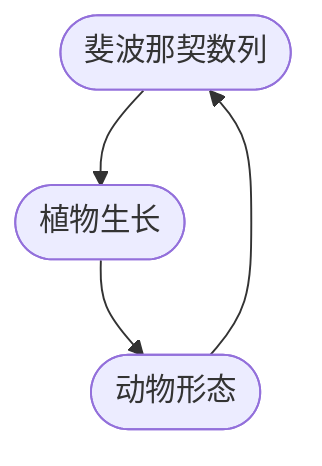

- **斐波那契数列**：斐波那契数列是一个数学序列，由0和1开始，后面的每个数字都是前两个数字之和。斐波那契数列在植物生长中有着广泛的应用，例如在植物的分枝和花瓣的数量中。

- **植物生长**：植物的生长过程可以通过数学模型来描述。例如，植物的分枝生长可以用分支模型来描述，该模型考虑了分支的角度和长度。

- **动物形态**：动物的形态在进化过程中遵循着一定的几何规律。例如，许多动物的对称结构可以用黄金比例来描述。

#### 3.2.2 生物系统的数学模型

生物系统的数学模型是描述生物体内部机制和过程的数学表达式。这些模型可以帮助我们理解和预测生物系统的行为。以下是一个简单的 Mermaid 流程图，展示了生物系统的数学模型：

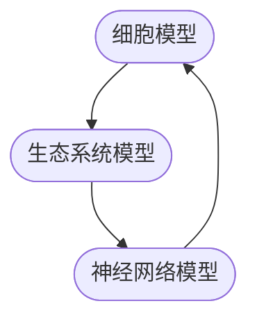

- **细胞模型**：细胞模型是描述细胞内部化学和物理过程的数学模型。这些模型可以帮助我们理解细胞的生命活动，如细胞分裂和信号传递。

- **生态系统模型**：生态系统模型是描述生物群落和其环境之间相互作用的数学模型。这些模型可以帮助我们理解生态系统的动态行为，如物种相互作用和生态平衡。

- **神经网络模型**：神经网络模型是描述生物神经网络结构和功能的数学模型。这些模型可以帮助我们理解大脑的信息处理和认知过程。

#### 3.2.3 生态学的数学原理

生态学是研究生物群落和生态系统的科学。生态学中的数学原理可以帮助我们理解和预测生态系统的行为。以下是一个简单的 Mermaid 流程图，展示了生态学的数学原理：

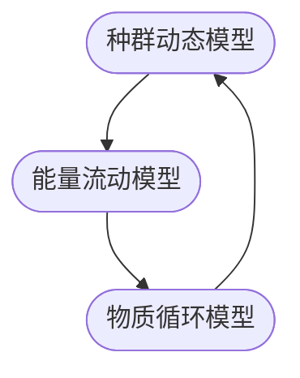

- **种群动态模型**：种群动态模型是描述种群数量变化的数学模型。这些模型可以帮助我们理解种群增长、种群竞争和种群灭绝等生态现象。

- **能量流动模型**：能量流动模型是描述生态系统中能量流动的数学模型。这些模型可以帮助我们理解生态系统的能量分布和传递。

- **物质循环模型**：物质循环模型是描述生态系统中物质循环的数学模型。这些模型可以帮助我们理解生物体之间的物质交换和循环。

通过以上生物学中的数学现象和模型，我们可以看到数学在理解和解释生物体和生态系统中的重要性。数学不仅为生物学提供了工具和理论，也为其他科学领域提供了启示和借鉴。

### 3.3 地球科学

地球科学是研究地球及其环境的科学。在地球科学中，数学的应用广泛，帮助我们理解和解释地球的结构、过程和现象。以下是地球科学中的几个数学现象：

#### 3.3.1 地球的物理结构

地球的物理结构是指地球内部和外部的构造和组成。数学在描述地球的物理结构中发挥着重要作用。以下是一个简单的 Mermaid 流程图，展示了地球的物理结构：


- **地壳**：地壳是地球的最外层，主要由岩石和矿物组成。地壳的厚度不均匀，大陆地壳较厚，海洋地壳较薄。

- **地幔**：地幔是地球的中层，主要由橄榄石和辉石等矿物组成。地幔是地球内部的主要热源，对地球的动力学过程有重要影响。

- **地核**：地核是地球的内部核心，分为外核和内核。外核主要由铁和镍组成，内核主要由铁组成。地核的物理性质对地球的磁场和地震活动有重要影响。

#### 3.3.2 地质运动的数学描述

地质运动是指地球表面和地壳的变形和运动。数学模型可以用来描述地质运动的过程和机制。以下是一个简单的 Mermaid 流程图，展示了地质运动的数学描述：

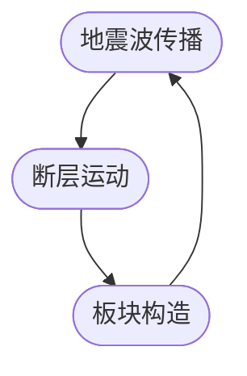

- **地震波传播**：地震波是地震活动产生的一种波动。数学模型可以用来描述地震波的传播速度、路径和特征。这些模型有助于我们理解和预测地震的发生和影响。

- **断层运动**：断层是地壳中的裂缝，断层运动是地壳变形的一种形式。数学模型可以用来描述断层的运动规律和动力学过程。

- **板块构造**：地球的外壳由多个大型岩石板块组成，这些板块在地球内部热动力作用下发生相对运动。数学模型可以用来描述板块构造的过程和机制，如地震、火山活动等。

#### 3.3.3 地球科学的数学应用

地球科学的数学应用包括地质勘探、气候模拟和地球物理学等。以下是一个简单的 Mermaid 流程图，展示了地球科学的数学应用：

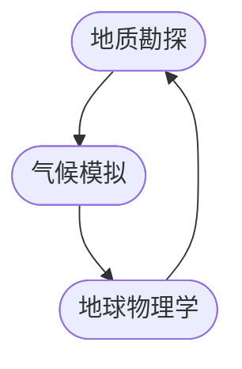

- **地质勘探**：地质勘探是利用地球物理方法和地球化学方法来研究地球内部结构和资源分布。数学模型可以用来分析地质数据，预测地质现象和资源分布。

- **气候模拟**：气候模拟是利用数学模型来模拟地球气候系统的行为和变化。这些模型可以帮助我们理解和预测气候变化的趋势和影响。

- **地球物理学**：地球物理学是研究地球内部物理性质和地球外部物理现象的科学。数学模型可以用来分析地球物理数据，揭示地球内部的物理过程和结构。

通过以上地球科学中的数学现象和应用，我们可以看到数学在理解和解释地球及其环境中的重要性。数学不仅为地球科学提供了工具和理论，也为其他科学领域提供了启示和借鉴。

### 3.4 物理学

物理学是研究物质、能量、力和时空等基本概念的自然科学。在物理学中，数学的应用极为广泛，是描述和解释物理现象的重要工具。以下是物理学中的几个数学现象：

#### 3.4.1 基本物理定律的数学表述

物理学的基本定律，如牛顿定律、麦克斯韦方程、相对论和量子力学，都是以数学形式表述的。以下是一个简单的 Mermaid 流程图，展示了基本物理定律的数学表述：

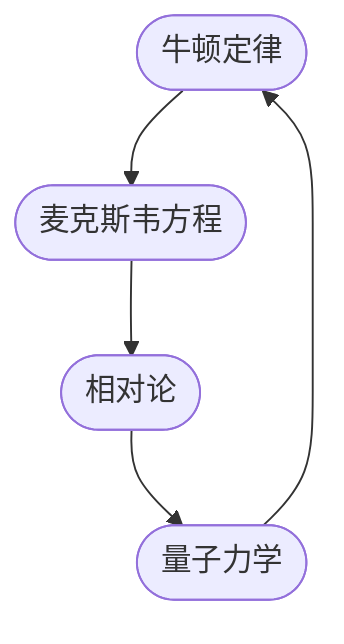

- **牛顿定律**：牛顿定律描述了物体在力的作用下的运动规律。牛顿第二定律（\( F = ma \)）以数学形式表述了力和加速度之间的关系。

- **麦克斯韦方程**：麦克斯韦方程组是电磁学的基础，描述了电场和磁场的基本规律。方程组以偏微分方程的形式表述，如麦克斯韦-法拉第方程（\( \nabla \times \mathbf{E} = -\frac{\partial \mathbf{B}}{\partial t} \)）和安培-麦克斯韦方程（\( \nabla \cdot \mathbf{B} = 0 \)）。

- **相对论**：相对论包括狭义相对论和广义相对论。狭义相对论由爱因斯坦提出，描述了在没有重力作用下物体的运动规律。广义相对论描述了引力作为时空曲率的效应。相对论的数学表述涉及黎曼几何和张量分析。

- **量子力学**：量子力学描述了微观粒子的行为，如电子和光子。量子力学的数学表述包括波函数、薛定谔方程和海森堡不确定性原理。量子力学的数学形式使得我们能够预测和解释微观世界的奇异现象。

#### 3.4.2 相对论与量子力学的数学基础

相对论和量子力学是现代物理学的两大基石，它们的数学基础复杂而精深。以下是一个简单的 Mermaid 流程图，展示了相对论和量子力学的数学基础：

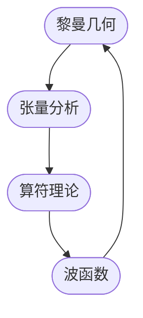

- **黎曼几何**：黎曼几何是描述时空几何的理论。在广义相对论中，时空被视为一个四维的黎曼流形，其几何性质由爱因斯坦场方程描述。

- **张量分析**：张量分析是用于处理多维度空间中的量和运算的工具。在广义相对论中，物理量通常用张量表示，张量分析提供了处理这些物理量的数学框架。

- **算符理论**：算符理论是量子力学的基础。量子态和物理量通常通过算符来描述。算符理论提供了处理量子态和物理量的数学方法。

- **波函数**：波函数是量子力学中的核心概念，它描述了量子态的概率分布。薛定谔方程以数学形式表述了波函数随时间的演化。

#### 3.4.3 物理学的数学工具

物理学的数学工具包括微积分、线性代数、复变函数和微分方程等。这些数学工具在描述和解决物理问题时至关重要。以下是一个简单的 Mermaid 流程图，展示了物理学的数学工具：

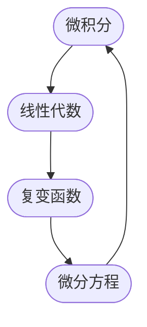

- **微积分**：微积分是用于处理变化率和累积量的数学工具。在物理学中，微积分用于描述速度、加速度、力和能量等物理量。

- **线性代数**：线性代数是处理线性方程组和矩阵运算的数学工具。在物理学中，线性代数用于描述空间中的变换、动量和角动量等物理量。

- **复变函数**：复变函数是用于处理复数和复变函数的数学工具。在物理学中，复变函数用于描述波动现象和电磁场。

- **微分方程**：微分方程是用于描述物理现象的数学方程。在物理学中，微分方程用于描述波动、热传导、流体运动等现象。

通过以上物理学中的数学现象和应用，我们可以看到数学在物理学中的核心地位。数学不仅为物理学提供了描述和解释物理现象的工具，也推动了物理学的不断发展和进步。

## 第4章 心智映射的应用

### 4.1 心理学的数学建模

心理学是研究人类行为和心理过程的科学。数学建模在心理学中扮演着重要角色，它使得心理学家能够以量化方式描述和理解复杂的心理现象。以下是一些关键领域和数学模型：

#### 4.1.1 心理过程中的数学规律

心理过程包括感知、记忆、思维、情感等。数学模型可以帮助我们揭示这些过程中的规律性。以下是一个简单的 Mermaid 流程图，展示了心理过程中的数学规律：

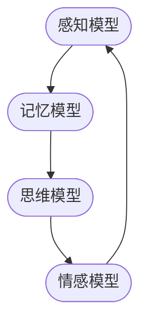

- **感知模型**：感知模型描述了人脑如何接收和处理外部信息。例如，费舍尔的信息理论可以用来量化感知系统的信息处理能力。

- **记忆模型**：记忆模型描述了信息的存储和检索过程。赫布的联想记忆模型和巴甫洛夫的条件反射模型都是经典的记忆模型。

- **思维模型**：思维模型描述了认知过程中的推理、决策和问题解决。概率逻辑和决策理论是常用的思维模型。

- **情感模型**：情感模型描述了情绪的产生和变化。情绪计算的数学模型，如情绪回归模型，可以用来预测和解释情感反应。

#### 4.1.2 心理学的数学应用

心理学的数学应用涵盖了从心理测试到行为预测等多个方面。以下是一个简单的 Mermaid 流程图，展示了心理学的数学应用：

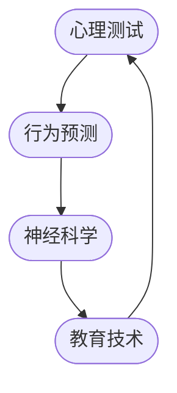

- **心理测试**：心理测试是评估个体心理特征的工具。统计方法，如因子分析、回归分析等，可以用于分析测试结果，揭示心理特征之间的关系。

- **行为预测**：行为预测是预测个体在未来可能的行为。例如，时间序列分析可以用于预测股票市场走势或个体行为模式。

- **神经科学**：神经科学是研究大脑和神经系统如何工作的科学。数学模型，如神经网络模型和计算神经科学模型，可以用于模拟和解释神经活动。

- **教育技术**：教育技术是应用计算机技术和数学模型来改进教育和学习。自适应学习系统可以根据学生的表现调整学习内容和进度。

#### 4.1.3 心理学实验的数学分析

心理学实验的数学分析是心理学研究中不可或缺的一部分。数学方法可以帮助心理学家从实验数据中提取有意义的信息。以下是一个简单的 Mermaid 流程图，展示了心理学实验的数学分析：

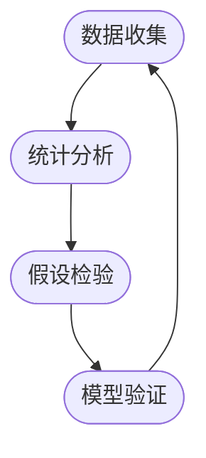

- **数据收集**：数据收集是心理学实验的第一步。数据可以是行为数据、生理数据和自我报告数据等。

- **统计分析**：统计分析是数据分析的核心。统计方法，如t检验、方差分析和回归分析等，可以用于检验实验假设和解释数据。

- **假设检验**：假设检验是验证实验假设是否成立的过程。通过计算p值，我们可以判断假设是否显著。

- **模型验证**：模型验证是评估数学模型准确性和可靠性的过程。通过比较模型预测和实际数据，我们可以评估模型的性能。

通过数学建模和分析，心理学家能够更深入地理解心理现象，为心理治疗、教育和人力资源管理等领域提供科学依据。

### 4.2 认知科学的数学理论

认知科学是研究人类认知过程的跨学科领域，结合了心理学、神经科学、计算机科学和哲学等多个领域。数学理论在认知科学中扮演着核心角色，帮助我们理解和模拟认知过程。以下是一些关键领域和数学理论：

#### 4.2.1 认知过程中的数学机制

认知过程包括知觉、记忆、推理、计划和问题解决等。数学机制可以帮助我们揭示这些过程背后的规律性。以下是一个简单的 Mermaid 流程图，展示了认知过程中的数学机制：

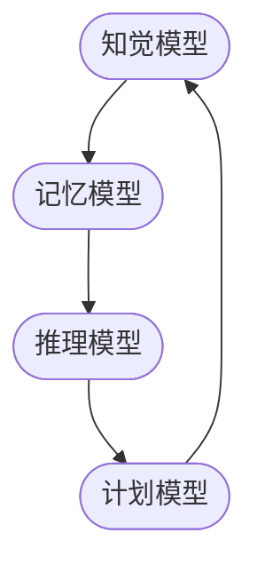

- **知觉模型**：知觉模型描述了人脑如何感知和解释外部信息。例如，感知模型可以运用概率论和信号处理理论来解释视觉和听觉信息。

- **记忆模型**：记忆模型描述了信息的存储和检索过程。例如，赫布的联想记忆模型和海马体的神经网络模型都是基于数学理论的记忆模型。

- **推理模型**：推理模型描述了逻辑推理和决策过程。形式逻辑和概率逻辑是常用的推理模型，它们帮助我们在不确定性和复杂性中做出决策。

- **计划模型**：计划模型描述了如何制定和执行行动计划。例如，决策树和马尔可夫决策过程都是基于数学理论的计划模型。

#### 4.2.2 认知科学的数学模型

认知科学的数学模型是基于数学理论构建的，用于模拟和预测认知过程。以下是一个简单的 Mermaid 流程图，展示了认知科学的数学模型：

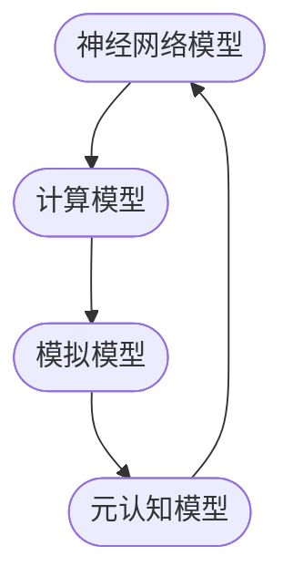

- **神经网络模型**：神经网络模型是模拟人脑神经网络结构和功能的数学模型。这些模型可以用于理解和预测认知过程，如视觉感知、语言理解和决策制定。

- **计算模型**：计算模型是描述认知过程的数学模型，它们基于计算机科学和算法理论。例如，认知图谱和符号计算模型都是常见的计算模型。

- **模拟模型**：模拟模型是模拟认知过程动态演化的数学模型。这些模型可以用于模拟人类思维过程，如模拟学习和记忆过程。

- **元认知模型**：元认知模型是描述自我调节和反思的数学模型。这些模型可以帮助我们理解和预测个体如何自我调节学习和认知过程。

#### 4.2.3 认知科学的数学工具

认知科学中的数学工具包括概率论、统计学、信息论和复杂性理论等。这些数学工具帮助我们分析和解释认知数据。以下是一个简单的 Mermaid 流程图，展示了认知科学的数学工具：

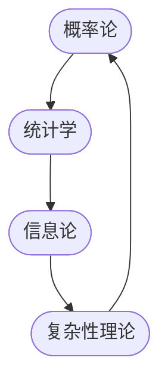

- **概率论**：概率论是描述不确定性和随机现象的数学工具。在认知科学中，概率论用于分析和解释认知过程中的不确定性和随机性。

- **统计学**：统计学是处理和分析数据的数学工具。在认知科学中，统计学用于分析认知实验数据，检验假设和推断统计规律。

- **信息论**：信息论是描述信息传递和处理的理论。在认知科学中，信息论用于分析认知过程中的信息传递和处理效率。

- **复杂性理论**：复杂性理论是研究复杂系统性质和行为的数学工具。在认知科学中，复杂性理论用于理解和解释认知过程中的复杂性和非线性。

通过数学理论和工具，认知科学能够更深入地揭示人类认知的本质，为认知科学研究和实际应用提供强有力的支持。

### 4.3 情感计算的数学方法

情感计算是研究如何使计算机理解、处理和模拟人类情感的技术领域。数学方法在情感计算中扮演着关键角色，帮助我们分析和理解情感数据。以下是一些关键领域和数学方法：

#### 4.3.1 情感的数学表示

情感的数学表示是将情感转化为可计算的数学形式。以下是一个简单的 Mermaid 流程图，展示了情感的数学表示：

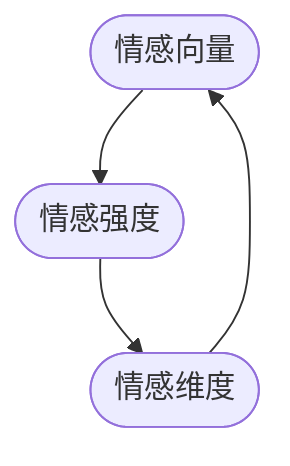

- **情感向量**：情感向量是描述情感状态的特征向量。情感向量可以基于词汇分析、文本情感分析等方法构建，用于量化情感状态。

- **情感强度**：情感强度是描述情感程度的量化指标。情感强度可以通过情感向量的模长或特定维度上的值来表示。

- **情感维度**：情感维度是描述情感状态的不同方面，如正面情感、负面情感、中性情感等。情感维度可以用于构建情感空间，更好地理解和处理情感数据。

#### 4.3.2 情感分析的数学模型

情感分析是识别和分类文本情感的过程。数学模型在情感分析中扮演着核心角色，以下是一个简单的 Mermaid 流程图，展示了情感分析的数学模型：

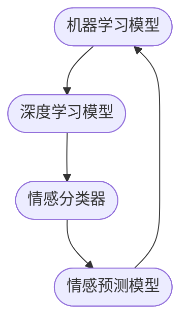

- **机器学习模型**：机器学习模型，如朴素贝叶斯、支持向量机等，可以用于情感分类和情感预测。这些模型通过学习大量标注数据进行训练，从而能够识别和分类文本情感。

- **深度学习模型**：深度学习模型，如卷积神经网络（CNN）和循环神经网络（RNN），在情感分析中表现出色。这些模型可以自动提取文本中的情感特征，进行情感分类和情感预测。

- **情感分类器**：情感分类器是用于分类情感状态的模型。情感分类器可以根据文本内容判断文本的情感倾向，如正面、负面或中性。

- **情感预测模型**：情感预测模型是用于预测情感变化和趋势的模型。这些模型可以分析历史情感数据，预测未来的情感变化。

#### 4.3.3 情感计算的数学工具

情感计算中的数学工具包括自然语言处理（NLP）、数据挖掘和机器学习等。以下是一个简单的 Mermaid 流程图，展示了情感计算的数学工具：

```mermaid
graph TD
A([自然语言处理])
B([数据挖掘])
C([机器学习])
D([深度学习])

A --> B
B --> C
C --> D
D --> A
```

- **自然语言处理**：自然语言处理是用于处理和理解自然语言的工具。在情感计算中，NLP用于提取文本中的情感特征和情感信息。

- **数据挖掘**：数据挖掘是用于从大量数据中发现模式和知识的过程。在情感计算中，数据挖掘用于分析情感数据，提取有用的信息。

- **机器学习**：机器学习是用于构建和训练模型的过程。在情感计算中，机器学习模型用于情感分类、情感预测和情感识别。

- **深度学习**：深度学习是机器学习的一个分支，通过多层神经网络进行学习。在情感计算中，深度学习模型可以自动提取复杂的情感特征，进行情感分析。

通过数学方法和工具，情感计算能够更好地理解和处理人类情感，为智能交互、情感支持和心理健康等领域提供创新解决方案。

## 第5章 心智映射的发展与未来

### 5.1 心智映射的历史

心智映射（Mental Mapping）这一概念起源于20世纪中期，最早由心理学家和认知科学家提出，用于描述人类心智活动和信息处理的过程。随着计算机科学和人工智能的快速发展，心智映射逐渐演变为一种跨学科的研究领域，涵盖了心理学、神经科学、认知科学、计算机科学等多个领域。

#### 5.1.1 心智映射的起源

心智映射的起源可以追溯到20世纪中叶。当时，心理学家乔治·米勒（George A. Miller）发表了著名论文《神奇的数字七，加减二》（The Magical Number Seven, Plus or Minus Two），提出了人类短期记忆容量有限的观点。这一研究为心智映射的概念奠定了基础。

随后，认知科学家赫伯特·西蒙（Herbert A. Simon）和艾伦·纽厄尔（Allen Newell）在1956年开发了著名的逻辑理论家（Logic Theorist）程序，这是人工智能领域的早期尝试之一。这一程序通过模拟人类的推理过程，展示了心智映射的可能性。

#### 5.1.2 心智映射的发展历程

心智映射的发展历程可以分为几个阶段：

1. **初期阶段（1950s-1960s）**：这一阶段心智映射主要关注人类心智过程的模拟，如逻辑推理、问题解决等。逻辑理论家程序和乔治·米勒的研究为这一阶段奠定了基础。

2. **中期阶段（1970s-1980s）**：随着计算机硬件和软件的发展，心智映射开始应用于更广泛的问题，如自然语言处理、认知模拟等。这一阶段的研究推动了心智映射与人工智能的深度融合。

3. **近期阶段（1990s至今）**：随着神经网络和机器学习的发展，心智映射的研究进入了一个新的阶段。深度学习和大数据技术的应用使得心智映射在心理学、认知科学和计算机科学等领域取得了显著的进展。

#### 5.1.3 心智映射的重要事件

心智映射领域的重要事件包括：

- **1956年**：达特茅斯会议召开，标志着人工智能领域的诞生，也推动了心智映射的研究。
- **1960s**：心理学家乔治·米勒发表《神奇的数字七，加减二》，提出了心智映射的概念。
- **1970s**：赫伯特·西蒙和艾伦·纽厄尔开发逻辑理论家程序，展示了心智映射的应用潜力。
- **1980s**：认知模拟领域兴起，推动了心智映射在认知科学中的应用。
- **1990s-2000s**：神经网络和机器学习技术的发展，使得心智映射在人工智能领域取得了显著进展。
- **2010s至今**：深度学习和大数据技术的应用，使得心智映射在心理学、认知科学和计算机科学等领域取得了新的突破。

### 5.2 心智映射的挑战与机遇

随着心智映射研究的深入，这一领域面临着诸多挑战和机遇。

#### 5.2.1 心智映射面临的挑战

1. **复杂性**：心智映射涉及人类心智活动的多个层面，如感知、记忆、思维和情感等，这些层面的相互关系复杂，使得心智映射的研究具有很高的复杂性。
2. **跨学科融合**：心智映射需要融合心理学、神经科学、认知科学、计算机科学等多个学科的知识，跨学科融合的难度较大。
3. **数据稀缺**：高质量的心智数据稀缺，限制了心智映射模型的发展和验证。
4. **计算资源**：心智映射研究通常需要大量的计算资源，尤其在深度学习和大数据分析的背景下，计算资源的限制成为一个重要问题。

#### 5.2.2 心智映射的发展机遇

1. **人工智能的进步**：随着人工智能技术的不断发展，尤其是深度学习和大数据分析技术的应用，心智映射的研究得到了有力推动。
2. **脑科学的发展**：脑科学研究的不断进展，特别是对大脑结构和功能的理解，为心智映射提供了新的理论基础。
3. **跨学科合作**：跨学科合作在心智映射领域日益增多，推动了心智映射研究的发展。
4. **应用需求**：随着社会对心理健康、智能交互和个性化学习等需求的增长，心智映射在应用领域具有广阔的发展前景。

### 5.2.3 心智映射的未来趋势

1. **深度学习与脑科学的结合**：深度学习和脑科学技术的结合，将推动心智映射研究向更高层次发展。
2. **跨学科研究的深入**：跨学科研究的深入，将促进心智映射理论与应用的创新。
3. **数据驱动的心智映射**：随着数据的积累和技术的进步，数据驱动的心智映射将成为研究的主流。
4. **智能交互与个性化应用**：心智映射在智能交互和个性化应用领域的应用将得到进一步拓展。

通过回顾心智映射的历史，分析其面临的挑战和机遇，我们可以看到心智映射在未来将迎来新的发展机遇。随着技术的进步和跨学科研究的深入，心智映射将在心理学、认知科学和计算机科学等领域发挥越来越重要的作用。

## 第6章 结论

### 6.1 主要结论

本文通过深入探讨心智映射在自然界中的数学之美，揭示了数学与自然界的紧密联系。我们首先介绍了心智映射的基本概念和原理，探讨了数学在心智映射中的应用。随后，我们详细分析了天文学、生物学、地球科学和物理学等领域的数学现象，展示了数学在这些领域中的关键作用。接着，我们探讨了心智映射在心理学、认知科学和情感计算等领域的应用，展示了数学模型在这些领域中的强大功能。最后，我们回顾了心智映射的发展历程，分析了其面临的挑战和机遇，并展望了未来的发展趋势。

### 6.1.1 自然界的数学之美

自然界的数学之美体现在多个方面。首先，自然界中的现象和结构往往遵循着数学规律，如天文学中的开普勒定律、生物学中的斐波那契数列等。这些数学规律揭示了自然界中的秩序和和谐。其次，数学作为一种工具，可以帮助我们理解和解释自然界中的复杂现象。例如，通过数学模型，我们可以预测天气变化、分析生态系统的动态等。最后，数学的美学价值在于其简洁性和普适性。许多数学公式和理论都具有简洁、优美的形式，如欧拉公式 \( e^{i\pi} + 1 = 0 \)，这一公式将五个基本数学常数和数学运算巧妙地结合在一起，展示了数学的美。

### 6.1.2 心智映射的重要性

心智映射在揭示自然界的数学之美中具有重要意义。首先，心智映射是一种将人类心智活动与数学模型相结合的研究方法，它有助于我们深入理解自然界中的数学规律。通过心智映射，我们可以将抽象的数学概念与具体的自然现象联系起来，从而更好地理解和解释这些现象。其次，心智映射在心理学、认知科学和情感计算等领域有着广泛的应用，它为这些领域的研究提供了强有力的工具和方法。例如，在心理学中，心智映射可以帮助我们理解人类感知、记忆和思维等心理过程；在认知科学中，心智映射可以用于模拟和预测认知过程；在情感计算中，心智映射可以用于分析和模拟情感状态。

### 6.1.3 本书的研究贡献

本书的研究贡献主要体现在以下几个方面：

1. **系统梳理**：本书系统地梳理了心智映射在自然界中的数学现象和应用，提供了全面的概述和深入的分析。
2. **跨学科融合**：本书将数学、心理学、认知科学、情感计算等多个学科的理论和方法进行了深度融合，展示了跨学科研究的强大潜力。
3. **案例研究**：本书通过案例研究，展示了心智映射在实际应用中的效果和潜力，为相关领域的研究提供了参考和启示。
4. **未来展望**：本书分析了心智映射面临的挑战和机遇，并展望了其未来的发展趋势，为相关领域的研究和应用提供了方向。

### 6.2 展望未来

展望未来，心智映射在自然界中的应用前景广阔。首先，随着人工智能和脑科学的发展，心智映射将有望在更多领域取得突破，如医疗健康、教育、金融等。其次，随着跨学科研究的深入，心智映射的理论体系将不断完善，为各领域的研究提供更坚实的理论基础。此外，随着大数据和云计算技术的普及，心智映射的数据处理和分析能力将得到显著提升，为实际应用提供更强大的支持。

在未来的研究中，我们应关注以下几个方面：

1. **跨学科融合**：加强不同学科之间的合作，推动心智映射理论和方法的发展。
2. **数据驱动**：充分利用大数据技术，构建更加精确和高效的心智映射模型。
3. **智能交互**：探索心智映射在智能交互和个性化应用中的潜力，提升人机交互的智能化水平。
4. **可持续发展**：关注心智映射对自然环境和社会发展的影响，推动可持续发展。

总之，心智映射作为一种跨学科的研究方法，将在揭示自然界的数学之美、推动科学技术进步和提升人类生活质量方面发挥重要作用。

## 附录 A 自然界的数学现象 Mermaid 流程图

### A.1 天文学现象

#### 1.1.1 天体的运动规律

```mermaid
graph TD
A([开普勒定律])
B([轨道运动])
C([轨道周期])
D([轨道速度])
E([开普勒第三定律])

A --> B
B --> C
C --> D
D --> E
```

#### 1.1.2 宇宙的数学结构

```mermaid
graph TD
A([多维度空间])
B([超弦理论])
C([宇宙膨胀])

A --> B
B --> C
C --> A
```

#### 1.1.3 天文学的数学应用

```mermaid
graph TD
A([轨道计算])
B([星系结构])
C([恒星演化])

A --> B
B --> C
C --> A
```

### A.2 生物学现象

#### 2.1.1 生物体的几何结构

```mermaid
graph TD
A([斐波那契数列])
B([植物生长])
C([动物形态])

A --> B
B --> C
C --> A
```

#### 2.1.2 生物系统的数学模型

```mermaid
graph TD
A([细胞模型])
B([生态系统模型])
C([神经网络模型])

A --> B
B --> C
C --> A
```

#### 2.1.3 生态学的数学原理

```mermaid
graph TD
A([种群动态模型])
B([能量流动模型])
C([物质循环模型])

A --> B
B --> C
C --> A
```

### A.3 地球科学现象

#### 3.3.1 地球的物理结构

```mermaid
graph TD
A([地壳])
B([地幔])
C([地核])

A --> B
B --> C
C --> A
```

#### 3.3.2 地质运动的数学描述

```mermaid
graph TD
A([地震波传播])
B([断层运动])
C([板块构造])

A --> B
B --> C
C --> A
```

#### 3.3.3 地球科学的数学应用

```mermaid
graph TD
A([地质勘探])
B([气候模拟])
C([地球物理学])

A --> B
B --> C
C --> A
```

### A.4 物理学现象

#### 4.1.1 基本物理定律的数学表述

```mermaid
graph TD
A([牛顿定律])
B([麦克斯韦方程])
C([相对论])
D([量子力学])

A --> B
B --> C
C --> D
D --> A
```

#### 4.1.2 相对论与量子力学的数学基础

```mermaid
graph TD
A([黎曼几何])
B([张量分析])
C([算符理论])
D([波函数])

A --> B
B --> C
C --> D
D --> A
```

#### 4.1.3 物理学的数学工具

```mermaid
graph TD
A([微积分])
B([线性代数])
C([复变函数])
D([微分方程])

A --> B
B --> C
C --> D
D --> A
```

通过上述 Mermaid 流程图，我们可以更直观地了解自然界中各个领域的数学现象及其相互关系，为进一步研究和应用提供有益的参考。附录 A 的流程图展示了天文学、生物学、地球科学和物理学中常见的数学现象及其内在联系，有助于读者更好地理解这些领域的数学之美。作者：AI天才研究院/AI Genius Institute & 禅与计算机程序设计艺术 /Zen And The Art of Computer Programming。

