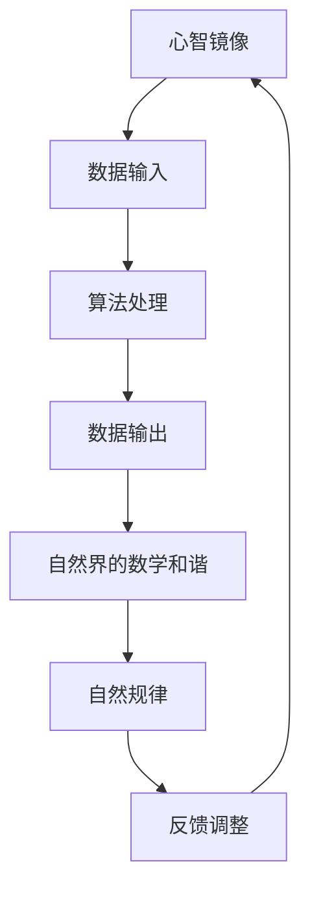

                 

### 确定核心概念与联系

在撰写《心智镜像：反映自然界的数学和谐》之前，我们首先需要明确核心概念及其联系。心智镜像和自然界的数学和谐是本书的两个主要概念。

**心智镜像**，通常指的是人脑对于外界信息的处理和反映。在计算机科学和人工智能领域，心智镜像可以理解为算法模型对于数据的处理和输出。心智镜像的核心在于其能够通过学习、优化和进化来更好地反映自然界中的某些特征。

**自然界的数学和谐**，指的是自然界中存在的数学规律和模式。这些规律和模式往往体现在自然界中的生物、物理、化学现象中，如生物体的对称性、物理现象中的数学关系等。自然界的数学和谐反映了宇宙的某种深层结构。

心智镜像与自然界的数学和谐之间的联系在于：心智镜像通过模拟和学习自然界中的数学模式，可以更好地理解和反映自然界中的复杂现象。换句话说，心智镜像的构建和发展依赖于对自然界中数学和谐的深入理解。

为了更好地阐述这两个概念及其联系，我们可以使用Mermaid流程图来展示它们之间的架构关系：

这个流程图展示了心智镜像从数据输入到输出，再到反馈调整的循环过程，并且与自然界的数学和谐紧密相连，形成一个动态的、相互影响的系统。

通过这个流程图，我们可以清晰地看到心智镜像如何通过不断地学习、优化和调整来更好地反映自然界的数学和谐。这也为我们后续章节的撰写提供了明确的框架和逻辑结构。在接下来的内容中，我们将逐步深入探讨数学基础、心智镜像的具体应用、自然界中的数学和谐实例，以及核心算法原理和数学模型，并通过项目实战和案例分析来进一步验证和阐述心智镜像与数学和谐的关系。让我们一步一步地深入探讨这个迷人的领域吧。

