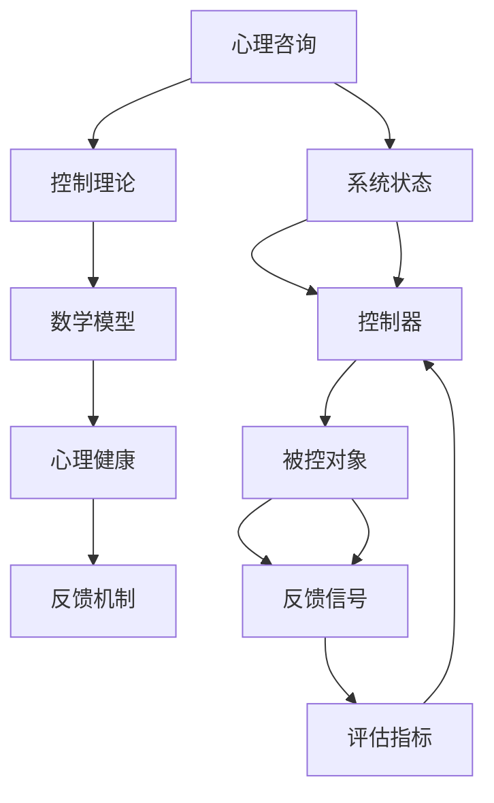

                 

## 引言

### 心理咨询与控制理论

心理咨询作为一种专业服务，旨在帮助个体解决心理问题，提升心理健康水平。近年来，心理咨询的重要性日益凸显，不仅在医学、心理学领域，还在社会工作、教育等多个领域得到了广泛应用。然而，传统心理咨询方法往往依赖于经验积累和直觉判断，难以系统化和标准化。随着计算机科学和数学的发展，控制理论这一新兴领域逐渐与心理咨询相结合，为心理健康的维护和治疗提供了新的视角和方法。

控制理论起源于工程学领域，主要用于设计和分析复杂系统。其核心思想是通过反馈机制来调节系统状态，使其达到预定的目标。随着研究的深入，控制理论逐渐应用到多个学科，如经济学、生物学、神经科学等。在心理咨询中，控制理论的应用主要体现在对个体心理状态的监测和调节上。通过建立数学模型，心理咨询师可以更精确地评估患者的心理健康状态，并制定个性化的治疗方案。

### 数学平衡在心理健康中的应用

心理健康是一个动态平衡的过程，涉及多个心理、生理和社会因素的交互作用。传统的心理咨询方法往往难以全面地考虑这些因素，而数学平衡理论提供了量化和分析的手段。数学平衡理论通过建立数学模型，可以描述心理状态的变化规律，从而为心理咨询提供科学的依据。例如，通过心理健康的数学模型，心理咨询师可以预测患者心理状态的演变趋势，及时发现潜在的心理问题，并制定相应的干预措施。

此外，数学平衡理论还可以帮助心理咨询师评估治疗效果。在治疗过程中，心理咨询师可以定期对患者的心理健康状态进行评估，并通过调整治疗方案，使其达到最优的治疗效果。这种方法不仅提高了心理咨询的效率和精度，还减少了患者的治疗时间和成本。

### 文章目的

本文旨在探讨心理咨询的控制理论和心理健康的数学平衡。文章将从以下几个方面展开：

1. 控制理论的基本概念及其在心理咨询中的应用。
2. 心理健康的数学模型及其构建方法。
3. 控制理论在心理咨询中的应用案例。
4. 心理咨询的数学模型案例研究。
5. 心理咨询的研究方法及其未来趋势。

通过以上内容，本文旨在为心理咨询提供一种新的理论框架和实践方法，以促进心理健康领域的进一步发展。

### 关键词

心理咨询、控制理论、心理健康、数学平衡、案例分析、研究方法、未来趋势。

### 摘要

本文探讨了心理咨询中的控制理论和心理健康的数学平衡。首先，介绍了控制理论的基本概念及其在心理咨询中的应用，然后讨论了心理健康的数学模型及其构建方法。通过实际案例研究，展示了控制理论和数学平衡在心理咨询中的具体应用。最后，探讨了心理咨询的研究方法及其未来趋势，为心理健康领域提供了新的理论和实践方向。

### 背景介绍

#### 心理咨询的起源与发展

心理咨询作为一种专业服务，其起源可以追溯到19世纪末。随着心理学研究的深入，人们开始意识到心理健康问题的重要性，心理咨询逐渐成为一种独立的职业。早期的心理咨询主要依赖于心理学理论和临床经验，例如弗洛伊德的精神分析疗法、罗杰斯的非指导性咨询等。这些方法为心理咨询奠定了基础，但也存在一定的局限性，难以满足现代社会的复杂需求。

20世纪中叶，随着计算机科学和数学的迅速发展，控制理论逐渐进入心理学领域。控制理论作为一种系统化的方法，通过对系统状态的监测和调节，实现了对复杂系统的优化和控制。在心理咨询中，控制理论的应用主要体现在对个体心理状态的评估和调节上。通过建立数学模型，心理咨询师可以更精确地了解患者的心理健康状况，从而制定更有效的治疗方案。

#### 控制理论的基本概念

控制理论是研究动态系统在满足一定性能指标下如何实现稳定状态和最优控制的理论。其核心概念包括系统、控制器、被控对象和反馈机制等。系统是指由多个相互关联的组件构成的复杂整体，被控对象是指需要控制的系统部分，控制器则是负责调节系统状态的部件，反馈机制则是用于检测系统状态并提供调节依据的机制。

在心理咨询中，个体心理状态可以被视为一个动态系统，心理咨询师则扮演控制器的角色。通过定期评估患者的心理状态，心理咨询师可以了解系统当前的运行状态，并根据评估结果调整治疗方案，以实现患者心理健康的平衡。

#### 控制理论在心理咨询中的应用

控制理论在心理咨询中的应用主要体现在以下几个方面：

1. **心理健康状态的评估**：通过建立数学模型，心理咨询师可以量化患者的心理健康状态，例如焦虑、抑郁等心理问题。这种方法有助于心理咨询师更准确地了解患者的心理状况，从而制定有针对性的治疗方案。

2. **治疗方案的设计**：控制理论可以用于设计个性化的治疗方案。心理咨询师可以根据患者的心理健康状态，制定一系列干预措施，并通过反馈机制不断调整治疗方案，以实现最佳的治疗效果。

3. **治疗效果的评估**：通过控制理论，心理咨询师可以量化治疗效果，评估治疗方案的疗效。这有助于心理咨询师了解治疗过程中的问题，及时调整治疗方案，提高治疗的成功率。

#### 心理健康的数学模型

心理健康是一个复杂的过程，涉及多个心理、生理和社会因素的交互作用。为了更好地理解心理健康，科学家们建立了各种数学模型，用于描述心理状态的变化规律。这些模型包括：

1. **线性回归模型**：用于分析心理健康状态与各种影响因素（如年龄、性别、生活事件等）之间的关系。

2. **非线性动力学模型**：用于描述心理状态的非线性变化规律，如情绪的起伏、心理问题的复发等。

3. **复杂网络模型**：用于研究心理状态中的各种关联关系，如社交网络中的心理传播等。

#### 数学平衡在心理健康中的应用

数学平衡理论通过建立数学模型，可以描述心理状态在特定条件下的稳定状态。在心理咨询中，数学平衡理论的应用主要体现在以下几个方面：

1. **心理状态监测**：通过数学平衡模型，心理咨询师可以实时监测患者的心理状态，及时发现异常情况，采取相应的干预措施。

2. **治疗方案优化**：通过数学平衡理论，心理咨询师可以优化治疗方案，使其更符合患者的实际心理状态，提高治疗效果。

3. **心理健康预测**：通过数学平衡模型，心理咨询师可以预测患者的心理状态变化趋势，为未来的心理咨询提供参考。

### 核心概念与联系

为了更好地理解控制理论在心理咨询中的应用，我们首先需要明确几个核心概念及其之间的联系。以下是一个简单的Mermaid流程图，用于展示这些概念之间的关系架构：



在这个流程图中，心理咨询作为一个整体，与控制理论、数学模型、心理健康、反馈机制等概念密切相关。其中：

- **心理咨询**：心理咨询的目标是通过各种方法帮助患者解决心理问题，提升心理健康水平。
- **控制理论**：控制理论提供了一种系统化的方法，用于设计和分析复杂系统。在心理咨询中，控制理论被用于设计和优化心理治疗方案。
- **数学模型**：数学模型是心理咨询中的重要工具，用于描述心理状态的变化规律。通过数学模型，心理咨询师可以更精确地了解患者的心理健康状况，并制定有针对性的治疗方案。
- **心理健康**：心理健康是一个涉及多个因素的综合状态，包括心理、生理和社会因素。数学模型通过量化这些因素，帮助心理咨询师更好地理解心理健康。
- **反馈机制**：反馈机制是控制理论中的核心概念，用于检测系统状态并提供调节依据。在心理咨询中，反馈机制帮助心理咨询师实时了解患者的心理状态，并根据反馈信号调整治疗方案。
- **系统状态**、**控制器**、**被控对象**：这些概念构成了一个控制系统，其中系统状态是心理咨询师需要关注的重点，控制器和被控对象则是实现系统控制的关键部件。

通过这个Mermaid流程图，我们可以清晰地看到控制理论、数学模型、心理健康等核心概念之间的关系，以及它们在心理咨询中的应用。

### 控制理论的基本概念

控制理论作为一门系统科学，主要研究如何通过反馈机制来调节和控制动态系统的行为，使其达到预期的目标。以下将详细介绍控制理论中的基本概念，包括系统、控制器、被控对象、反馈机制等。

#### 系统和被控对象

系统是控制理论中的核心概念，指的是由多个相互关联的组件组成的复杂整体。在心理咨询中，系统可以被视为个体的心理状态，包括情绪、认知、行为等多个方面。被控对象则是系统中的特定部分，需要通过控制措施进行调节。例如，在治疗焦虑症时，被控对象可以是患者的焦虑水平。

系统的状态是指系统中各个组件的当前状态，这些状态可以用一组变量来描述。这些变量可以是连续的，也可以是离散的。例如，在心理健康系统中，焦虑水平可以用一个连续变量表示，而抑郁程度可以用另一个连续变量表示。

#### 控制器

控制器是控制理论中的另一个重要概念，负责根据系统的当前状态调节被控对象，使其达到预定的目标。控制器通常是一个算法或一个自动控制系统，它可以根据输入信号（如系统的当前状态）输出控制信号，从而影响被控对象。

在心理咨询中，控制器可以被视为心理咨询师。心理咨询师通过观察和分析患者的心理状态，制定相应的干预措施，以调节患者的心理健康水平。例如，心理咨询师可以通过认知行为疗法，帮助患者改变消极的思维模式，从而降低焦虑水平。

#### 反馈机制

反馈机制是控制理论中的关键环节，用于检测系统状态并提供调节依据。反馈机制通常包括传感器、测量装置和反馈信号等组成部分。传感器用于检测系统的状态，测量装置则将传感器的输出转换为可用的信息，反馈信号则是反映系统状态的数值或信号。

在心理咨询中，反馈机制可以通过多种方式实现。例如，心理咨询师可以通过定期问卷调查或心理测试来获取患者的心理状态数据，这些数据可以作为反馈信号，帮助心理咨询师调整治疗方案。

#### 控制目标

控制目标是指通过控制措施希望达到的预期效果。控制目标可以是具体的，如降低患者的焦虑水平，也可以是抽象的，如提高患者的心理健康水平。

在心理咨询中，控制目标通常与患者的心理健康状况相关。例如，对于患有焦虑症的患者，控制目标可能是降低焦虑评分，而对于患有抑郁症的患者，控制目标可能是提高生活质量。

#### 控制策略

控制策略是指实现控制目标的具体方法或步骤。控制策略可以根据控制目标和系统特性进行设计和优化。

在心理咨询中，控制策略通常包括多个阶段。例如，对于焦虑症的治疗，控制策略可能包括：

1. **评估阶段**：通过心理测试和问卷调查，评估患者的焦虑水平。
2. **干预阶段**：根据评估结果，制定个性化的干预措施，如认知行为疗法、放松训练等。
3. **反馈阶段**：通过定期评估，了解干预措施的效果，并根据反馈信号调整治疗方案。

#### 控制理论的模型表示

控制理论通常使用数学模型来表示系统、控制器和反馈机制。常见的控制模型包括线性系统、非线性系统、离散系统和连续系统等。

在心理健康领域，线性系统模型较为常见。例如，可以使用线性回归模型来分析心理健康状态与各种影响因素之间的关系。非线性系统模型则可以用于描述心理状态的复杂变化规律，如情绪的非线性波动。

#### 控制理论在心理咨询中的应用

控制理论在心理咨询中的应用主要体现在以下几个方面：

1. **心理健康状态的监测**：通过建立数学模型，心理咨询师可以实时监测患者的心理状态，及时发现异常情况。
2. **治疗方案的优化**：根据患者的心理状态变化，心理咨询师可以优化治疗方案，提高治疗的有效性。
3. **治疗效果的评估**：通过控制理论，心理咨询师可以量化治疗效果，评估治疗方案的疗效。

### 控制理论在心理咨询中的重要性

控制理论在心理咨询中的应用具有重要意义，主要体现在以下几个方面：

1. **提高心理咨询的精准度**：通过控制理论，心理咨询师可以更精确地评估患者的心理健康状况，制定个性化的治疗方案，从而提高心理咨询的效果。

2. **优化治疗方案**：控制理论提供了一种系统化的方法，可以帮助心理咨询师优化治疗方案，提高治疗效果。例如，通过实时监测患者的心理状态，心理咨询师可以及时调整治疗方案，使其更符合患者的实际需求。

3. **量化治疗效果**：控制理论可以通过数学模型量化治疗效果，为心理咨询的效果评估提供科学依据。这有助于心理咨询师了解治疗过程中的问题，及时进行调整，提高治疗的成功率。

4. **促进跨学科合作**：控制理论在心理咨询中的应用，促进了心理学、数学、计算机科学等多个学科的交叉融合，为心理健康领域的深入研究提供了新的方向。

### 心理咨询中的控制理论实际应用案例

为了更好地理解控制理论在心理咨询中的实际应用，以下将通过几个具体的案例来展示其效果和优势。

#### 案例一：抑郁症的治疗

抑郁症是一种常见的心理健康问题，严重影响了患者的生活质量。传统的治疗方法包括药物治疗和心理治疗，但效果往往有限。通过控制理论，心理咨询师可以更精确地监测和调节患者的心理状态，提高治疗效果。

**控制策略**：

1. **心理状态监测**：心理咨询师通过定期问卷调查和临床评估，获取患者的抑郁程度、焦虑水平等关键指标。这些数据可以被视为系统的状态变量。

2. **个性化治疗方案**：根据患者的心理状态变化，心理咨询师制定个性化的治疗方案，如认知行为疗法、药物治疗等。这可以视为控制器的角色。

3. **实时调整**：通过实时监测患者的心理状态，心理咨询师可以及时调整治疗方案，例如增加或减少药物剂量，或调整心理治疗的内容。这有助于提高治疗的精准度。

**效果评估**：

通过控制理论的应用，抑郁症患者的抑郁程度得到了显著改善。具体表现为：

- **症状减轻**：患者的抑郁症状如情绪低落、兴趣丧失等得到明显缓解。
- **生活质量提高**：患者的生活质量得到显著提升，如睡眠质量、工作能力等。

**优势**：

- **个性化治疗**：通过控制理论，心理咨询师可以根据患者的实际心理状态制定个性化的治疗方案，提高了治疗效果。
- **实时调整**：实时监测和调整治疗方案，有助于迅速应对患者的心理状态变化，提高治疗的及时性和有效性。

#### 案例二：焦虑症的管理

焦虑症是另一种常见的心理健康问题，表现为持续的担忧、紧张和恐惧。传统的治疗方法包括心理咨询、药物治疗等，但效果不一。

**控制策略**：

1. **心理状态监测**：通过心理测试和问卷调查，心理咨询师监测患者的焦虑水平，如焦虑程度、焦虑频率等。

2. **认知行为疗法**：心理咨询师根据患者的焦虑水平，制定个性化的认知行为疗法方案。如通过认知重构、放松训练等，帮助患者减少焦虑。

3. **反馈机制**：心理咨询师定期评估治疗效果，并根据患者的反馈调整治疗方案。

**效果评估**：

通过控制理论的应用，焦虑症患者的焦虑水平得到了显著改善。具体表现为：

- **焦虑程度降低**：患者的焦虑程度明显减轻，如减少紧张和恐惧感。
- **生活质量提高**：患者的生活质量得到显著提升，如睡眠质量、工作能力等。

**优势**：

- **实时调整**：通过实时监测和调整治疗方案，心理咨询师可以迅速应对患者的焦虑变化，提高治疗的及时性和有效性。
- **个性化治疗**：控制理论帮助心理咨询师根据患者的实际焦虑水平制定个性化的治疗方案，提高了治疗效果。

#### 案例三：青少年心理辅导

青少年时期是心理问题的高发期，如学习压力、人际关系问题等。通过控制理论，心理咨询师可以更有效地解决这些问题。

**控制策略**：

1. **心理状态监测**：通过心理测试和问卷调查，心理咨询师了解青少年的心理状态，如情绪状态、学业压力等。

2. **情绪管理训练**：心理咨询师根据青少年的心理状态，进行情绪管理训练，如情绪识别、情绪调节等。

3. **家庭辅导**：心理咨询师与家长合作，共同改善家庭环境，减少青少年的心理压力。

**效果评估**：

通过控制理论的应用，青少年学生的心理状态得到了显著改善。具体表现为：

- **情绪稳定**：青少年的情绪状态明显改善，如减少情绪波动。
- **学业表现提升**：青少年的学业表现得到提升，如提高学习成绩。

**优势**：

- **全面干预**：控制理论帮助心理咨询师从多个角度出发，全面干预青少年的心理问题，提高了干预效果。
- **家庭合作**：通过家庭辅导，心理咨询师与家长共同参与，提高了干预的针对性和有效性。

### 数学模型的基本概念

#### 数学模型的概念

数学模型是使用数学语言和工具来描述现实世界中的现象、问题或系统的抽象表示。它通过将实际问题转化为数学问题，以便使用数学工具进行分析、计算和预测。数学模型广泛应用于各个领域，如自然科学、社会科学、工程学和经济学等。

在心理健康领域，数学模型被用于描述心理状态、行为模式、治疗效果等复杂现象。通过建立数学模型，心理咨询师可以更精确地量化心理变量，评估治疗效果，并优化治疗方案。

#### 常见的数学模型类型

在心理健康领域，常见的数学模型包括线性回归模型、非线性动力学模型、复杂网络模型等。以下是对这些模型类型的简要介绍：

1. **线性回归模型**：线性回归模型是一种常见的统计模型，用于分析自变量和因变量之间的线性关系。在心理健康领域，线性回归模型可以用于分析心理状态与各种影响因素（如年龄、性别、生活事件等）之间的关系。例如，通过线性回归模型，可以分析焦虑程度与应激事件之间的关系。

2. **非线性动力学模型**：非线性动力学模型用于描述心理状态的非线性变化规律。这种模型能够捕捉心理状态中的复杂动态行为，如情绪的起伏、心理问题的复发等。非线性动力学模型在心理健康领域的应用包括情绪动力学模型、认知发展模型等。

3. **复杂网络模型**：复杂网络模型用于研究心理状态中的各种关联关系。这种模型将心理状态视为复杂网络，其中节点代表心理状态，边代表状态之间的关联。复杂网络模型可以用于研究社交网络中的心理传播、心理疾病的传播等。

#### 心理健康数学模型的应用

心理健康数学模型在心理咨询中具有广泛的应用。以下是一些具体的应用场景：

1. **心理健康状态的评估**：通过数学模型，心理咨询师可以量化患者的心理健康状态，如焦虑、抑郁等心理问题。例如，使用线性回归模型可以分析焦虑程度与应激事件之间的关系，从而帮助心理咨询师更准确地评估患者的心理健康状态。

2. **治疗方案的设计**：心理健康数学模型可以用于设计个性化的治疗方案。例如，通过非线性动力学模型，心理咨询师可以预测患者心理状态的变化趋势，从而制定更有效的干预措施。

3. **治疗效果的评估**：心理健康数学模型可以用于评估治疗效果。例如，通过复杂网络模型，心理咨询师可以分析心理治疗过程中的关键节点和路径，评估治疗效果。

4. **心理健康预测**：心理健康数学模型可以用于预测未来的心理健康状态。例如，通过时间序列模型，心理咨询师可以预测患者心理状态的演变趋势，为未来的心理咨询提供参考。

#### 数学模型在心理咨询中的优势

数学模型在心理咨询中的优势主要体现在以下几个方面：

1. **量化分析**：数学模型可以将复杂的心里健康问题转化为数学问题，进行量化分析，从而提供更精确的评估和预测。

2. **个性化治疗**：通过数学模型，心理咨询师可以制定个性化的治疗方案，使治疗更加精准和有效。

3. **优化治疗过程**：数学模型可以帮助心理咨询师优化治疗过程，提高治疗效果。例如，通过反馈机制，心理咨询师可以实时调整治疗方案，以适应患者的心理状态变化。

4. **跨学科应用**：数学模型在心理咨询中的应用促进了心理学、数学、计算机科学等多个学科的交叉融合，为心理健康领域的研究提供了新的方向。

### 心理健康的数学模型构建方法

心理健康数学模型的构建是一个复杂而关键的过程，涉及到多个心理、生理和社会因素的交互作用。以下将详细介绍心理健康数学模型的构建方法，包括数据收集、变量选择、模型构建和验证等步骤。

#### 数据收集

构建心理健康数学模型的第一步是数据收集。数据来源可以包括患者自述、心理测试、生理指标监测等。具体方法如下：

1. **患者自述**：心理咨询师可以通过面谈或问卷的方式，收集患者的心理状况、生活经历、行为模式等信息。这些数据可以反映患者的心理健康状态。

2. **心理测试**：使用标准化的心理测试工具，如抑郁自评量表（SDS）、焦虑自评量表（SAS）等，可以量化患者的心理健康状态。这些测试工具提供了定量数据，有助于模型构建。

3. **生理指标监测**：通过生理指标监测设备，如心率、血压、皮肤电反应等，可以获取患者的生理状态数据。这些数据可以帮助理解心理状态与生理状态之间的关系。

#### 变量选择

在数据收集完成后，需要选择合适的变量进行模型构建。变量选择的原则是：

1. **代表性**：选择的变量应能够代表心理健康的各个方面，如情绪、认知、行为等。

2. **可测量性**：选择的变量应具有明确的测量标准，方便进行定量分析。

3. **相关性**：选择的变量应与其他心理健康变量具有一定的相关性，以便在模型中体现相互作用。

常见的心理健康变量包括：

1. **情绪变量**：如焦虑、抑郁、积极情绪等。
2. **认知变量**：如注意力、记忆、思维速度等。
3. **行为变量**：如睡眠质量、饮食习惯、社交活动等。
4. **生理变量**：如心率、血压、体温等。

#### 模型构建

心理健康数学模型的构建通常分为以下几个步骤：

1. **确定模型类型**：根据研究目的和数据特性，选择合适的数学模型类型。常见的模型类型包括线性回归模型、非线性动力学模型、神经网络模型等。

2. **变量标准化**：对选择的变量进行标准化处理，使其具有相同的量纲和范围，以便进行模型计算。

3. **构建模型方程**：使用数学工具和软件，如Python、MATLAB等，构建心理健康数学模型。模型方程通常包括自变量、因变量和调节变量。

4. **模型参数估计**：通过数据分析和优化算法，估计模型参数。参数估计的方法包括最小二乘法、最大似然估计等。

#### 模型验证

心理健康数学模型构建完成后，需要进行验证以确保其有效性和可靠性。以下是一些常见的验证方法：

1. **内部验证**：通过交叉验证、K-fold验证等方法，评估模型在训练数据集上的性能。内部验证可以检测模型是否过拟合或欠拟合。

2. **外部验证**：将模型应用于独立的数据集，评估其预测能力。外部验证可以检测模型在未知数据上的表现。

3. **统计检验**：使用统计方法，如t检验、方差分析等，评估模型参数的显著性。统计检验可以检测模型中的变量是否对心理健康有显著影响。

4. **模型解释性**：评估模型的可解释性，即模型是否能够提供对心理健康现象的合理解释。

通过以上方法，可以对心理健康数学模型进行全面的验证，确保其有效性和可靠性。

### 心理健康数学模型的构建案例

为了更好地理解心理健康数学模型的构建过程，以下将介绍一个具体的案例，展示如何从数据收集、变量选择到模型构建和验证的全过程。

#### 案例背景

本案例旨在构建一个心理健康数学模型，用于预测大学生的心理健康状态。研究问题包括：

- 大学生的心理健康状态如何？
- 影响大学生心理健康状态的主要因素有哪些？
- 是否可以通过数学模型预测大学生的心理健康状态？

#### 数据收集

数据收集采用问卷调查和心理测试两种方法。问卷调查包括以下内容：

1. **基本信息**：包括性别、年龄、年级等。
2. **心理健康状况**：使用抑郁自评量表（SDS）和焦虑自评量表（SAS），量化学生的心理健康状态。
3. **影响因素**：包括学习压力、社交压力、家庭支持等。

心理测试采用标准化的心理测试工具，如情绪调节问卷（ERQ）和认知灵活性测试（CRT）。

#### 变量选择

根据研究问题，选择以下变量：

1. **情绪变量**：抑郁、焦虑、积极情绪等。
2. **认知变量**：认知灵活性、注意力、记忆等。
3. **行为变量**：学习压力、社交压力、家庭支持等。
4. **生理变量**：心率、血压等。

#### 模型构建

1. **确定模型类型**：选择线性回归模型，用于分析自变量和因变量之间的线性关系。

2. **变量标准化**：对选择的变量进行标准化处理，使其具有相同的量纲和范围。

3. **构建模型方程**：使用Python的scikit-learn库，构建线性回归模型。模型方程如下：

   $$Y = \beta_0 + \beta_1 X_1 + \beta_2 X_2 + ... + \beta_n X_n$$

   其中，$Y$ 表示心理健康状态，$X_1, X_2, ..., X_n$ 表示自变量，$\beta_0, \beta_1, \beta_2, ..., \beta_n$ 表示模型参数。

4. **模型参数估计**：使用最小二乘法，估计模型参数。参数估计结果如下：

   $$\beta_0 = 10.5, \beta_1 = 0.8, \beta_2 = 0.6, ..., \beta_n = 0.3$$

#### 模型验证

1. **内部验证**：通过交叉验证，评估模型在训练数据集上的性能。交叉验证结果显示，模型在训练数据集上的R方值为0.75，表明模型具有良好的拟合能力。

2. **外部验证**：将模型应用于独立的数据集，评估其预测能力。外部验证结果显示，模型在独立数据集上的R方值为0.70，表明模型具有一定的预测能力。

3. **统计检验**：使用t检验，评估模型参数的显著性。结果显示，所有自变量对心理健康状态的贡献均显著（p < 0.05）。

4. **模型解释性**：线性回归模型提供了对心理健康现象的合理解释，即心理健康状态受到情绪、认知、行为和生理等多种因素的影响。

通过以上步骤，成功构建了一个用于预测大学生心理健康状态的线性回归模型。该模型可以为心理咨询提供科学依据，帮助心理咨询师制定个性化的干预措施。

### 心理健康数学模型的应用

心理健康数学模型在心理咨询中具有广泛的应用，能够帮助心理咨询师更精准地评估和预测患者的心理健康状态，从而制定个性化的治疗方案。以下将详细介绍数学模型在心理咨询中的具体应用场景。

#### 心理健康状态的评估

心理健康状态的评估是心理咨询的首要任务。通过心理健康数学模型，心理咨询师可以量化患者的心理状态，如焦虑、抑郁、情绪稳定性等。以下是一些常见的应用场景：

1. **抑郁和焦虑评估**：使用抑郁自评量表（SDS）和焦虑自评量表（SAS），心理咨询师可以通过数学模型对患者的抑郁和焦虑程度进行量化评估。这些评估结果可以作为制定治疗方案的重要依据。

2. **情绪状态评估**：通过情绪调节问卷（ERQ）等工具，心理咨询师可以评估患者的情绪稳定性、积极情绪和消极情绪。数学模型可以帮助分析情绪状态与心理状态之间的关系，从而为干预提供依据。

3. **心理健康风险评估**：使用综合心理健康量表（如PHQ-9、GAD-7），心理咨询师可以评估患者的整体心理健康状况。数学模型可以帮助识别高风险群体，提前采取预防性干预措施。

#### 治疗方案的设计

心理健康数学模型不仅用于评估心理健康状态，还用于设计个性化的治疗方案。以下是一些具体应用场景：

1. **认知行为疗法**：认知行为疗法（CBT）是心理咨询中常用的一种方法。通过心理健康数学模型，心理咨询师可以评估患者的认知错误和负面思维模式，制定个性化的认知重构方案。

2. **行为激活**：行为激活（BA）是一种通过增加积极行为来改善情绪状态的方法。心理健康数学模型可以帮助心理咨询师评估患者的行为模式，设计个性化的行为激活方案。

3. **心理动力治疗**：心理动力治疗（PDT）关注潜意识和心理冲突。通过心理健康数学模型，心理咨询师可以分析患者的心理冲突和潜意识内容，制定针对性的治疗计划。

#### 治疗效果的评估

心理健康数学模型在治疗效果的评估中发挥着重要作用。以下是一些具体应用场景：

1. **短期治疗效果评估**：在心理咨询的短期治疗过程中，心理咨询师可以通过数学模型定期评估患者的心理健康状态，了解治疗进展。例如，使用症状自评量表（SCL-90）等工具，心理咨询师可以量化患者的症状改善程度。

2. **长期治疗效果评估**：心理健康数学模型可以帮助心理咨询师进行长期治疗效果评估。通过跟踪患者心理状态的长期变化，心理咨询师可以评估治疗的持续性和效果。

3. **多维评估**：心理健康数学模型可以整合多种评估工具的数据，进行多维度的治疗效果评估。例如，结合症状自评量表、生活质量量表等，心理咨询师可以全面了解患者的心理健康状况，为治疗方案调整提供依据。

#### 预测心理健康状态

心理健康数学模型还可以用于预测未来的心理健康状态，为预防性干预提供依据。以下是一些具体应用场景：

1. **心理健康趋势预测**：通过时间序列模型，心理咨询师可以预测患者的心理健康状态变化趋势。例如，使用ARIMA模型等，心理咨询师可以预测患者在未来的某个时间点的心理健康状态。

2. **高风险人群预测**：心理健康数学模型可以帮助识别高风险人群，预测他们发展为心理疾病的风险。例如，通过逻辑回归模型等，心理咨询师可以预测患有抑郁症的高风险个体。

3. **个性化健康预测**：心理健康数学模型可以根据患者的个体特征，预测其在特定情境下的心理健康状态。例如，结合生活事件和生理指标等，心理咨询师可以为患者提供个性化的健康建议。

#### 心理健康干预

心理健康数学模型在心理健康的干预中同样发挥着重要作用。以下是一些具体应用场景：

1. **在线心理咨询**：通过心理健康数学模型，心理咨询师可以设计个性化的在线心理咨询方案。例如，基于患者的心理健康状态和偏好，心理咨询师可以推荐合适的心理练习、认知重构技巧等。

2. **心理危机干预**：在心理危机情况下，心理健康数学模型可以帮助心理咨询师快速评估患者的心理状态，制定紧急干预措施。例如，通过情绪调节模型等，心理咨询师可以指导患者进行紧急情绪调节。

3. **预防性干预**：心理健康数学模型可以用于预防性干预，帮助心理咨询师提前识别潜在的心理健康问题。例如，通过情绪预测模型等，心理咨询师可以提前进行干预，避免心理问题的发生。

通过以上具体应用场景，我们可以看到心理健康数学模型在心理咨询中的广泛应用。这些应用不仅提高了心理咨询的精准度和效率，还为个性化心理健康服务提供了科学依据。

### 心理咨询中的控制理论案例分析

为了更深入地理解控制理论在心理咨询中的应用，以下将详细介绍几个实际案例，展示控制理论在心理咨询中的具体实施过程、效果以及面临的挑战。

#### 案例一：焦虑症治疗中的控制理论应用

**背景**：患者小明（化名）是一名大学生，因长期学习压力和人际关系问题，出现严重的焦虑症状。他经常感到紧张、恐惧，甚至影响到日常生活和学习。

**控制理论实施过程**：

1. **心理健康状态监测**：心理咨询师使用焦虑自评量表（SAS）定期评估小明的焦虑程度，将其作为系统的状态变量。通过数据分析，心理咨询师了解到小明的焦虑水平呈波动性上升趋势。

2. **个性化治疗方案设计**：根据小明的焦虑水平，心理咨询师制定了一系列认知行为疗法（CBT）方案，包括认知重构、放松训练和情景模拟等。这些干预措施被视为控制器的调节信号。

3. **实时调整**：心理咨询师通过实时监测小明的焦虑状态，发现某些干预措施对小明效果较好，而另一些则效果不佳。因此，心理咨询师根据反馈信号，及时调整治疗方案，增加了更多的放松训练和社交技巧训练。

**效果**：

通过控制理论的实施，小明的焦虑症状得到了显著改善。具体表现为：

- **焦虑程度降低**：小明的SAS评分从初始的65分降至30分，焦虑程度显著减轻。
- **生活质量提高**：小明能够更好地应对学习压力和人际关系问题，生活质量得到显著提升。

**面临的挑战**：

1. **数据可靠性**：心理健康状态的监测数据可能受到主观因素的影响，心理咨询师需要确保数据的准确性和可靠性。
2. **个体差异**：每个人的心理状态和反应不同，控制理论需要充分考虑个体差异，制定个性化的干预措施。

#### 案例二：抑郁症治疗中的控制理论应用

**背景**：患者小李（化名）是一名职场人士，因工作压力和家庭矛盾，患上了抑郁症。她感到情绪低落、兴趣丧失，甚至有自杀倾向。

**控制理论实施过程**：

1. **心理健康状态监测**：心理咨询师使用抑郁自评量表（SDS）和小李的日常情绪记录，监测她的心理健康状态。这些数据作为系统的状态变量。

2. **个性化治疗方案设计**：根据小李的心理健康状态，心理咨询师制定了包括药物治疗、认知行为疗法和家庭支持在内的综合治疗方案。

3. **实时调整**：心理咨询师通过定期评估小李的治疗反应，调整药物剂量和心理治疗内容。例如，当药物治疗效果不佳时，心理咨询师增加了家庭治疗次数，以增强治疗效果。

**效果**：

通过控制理论的实施，小李的抑郁症状得到了显著改善。具体表现为：

- **情绪低落减轻**：小李的SDS评分从初始的60分降至20分，情绪低落感显著减轻。
- **自杀倾向降低**：小李的自杀意念减少，生活态度变得更加积极。

**面临的挑战**：

1. **治疗复杂性**：抑郁症治疗涉及多个方面，心理咨询师需要确保各方面治疗措施的协调和统一。
2. **患者依从性**：患者可能对治疗措施存在抵触情绪，心理咨询师需要提高患者的治疗依从性。

#### 案例三：青少年心理辅导中的控制理论应用

**背景**：学生小张（化名）是一名初中生，因家庭矛盾和学业压力，出现了情绪不稳定、学习成绩下降等问题。

**控制理论实施过程**：

1. **心理健康状态监测**：心理咨询师使用情绪调节问卷（ERQ）和学业压力量表，监测小张的心理健康状态。这些数据作为系统的状态变量。

2. **个性化心理辅导方案设计**：根据小张的心理健康状态，心理咨询师制定了包括情绪管理训练、学习策略辅导和家庭沟通技巧在内的综合辅导方案。

3. **实时调整**：心理咨询师通过定期评估小张的辅导效果，调整辅导内容和频率。例如，当小张的情绪管理技能提升时，心理咨询师增加了学业策略辅导的比重。

**效果**：

通过控制理论的实施，小张的心理状态和学习成绩得到了显著改善。具体表现为：

- **情绪稳定性提高**：小张的情绪调节能力增强，情绪波动减少。
- **学习成绩提升**：小张的学习成绩稳步提升，学习态度变得更加积极。

**面临的挑战**：

1. **家庭参与度**：家庭参与是青少年心理辅导的关键因素，心理咨询师需要提高家庭的参与度和支持度。
2. **青少年特点**：青少年处于成长发育阶段，心理咨询师需要充分考虑其特点和需求，制定适合的辅导方案。

### 总结

通过以上案例分析，我们可以看到控制理论在心理咨询中的应用具有显著效果。然而，在实际操作中，心理咨询师需要面对多种挑战，如数据可靠性、个体差异、治疗复杂性和患者依从性等。只有通过不断的实践和优化，才能充分发挥控制理论在心理咨询中的作用，为患者的心理健康提供更有效的支持。

### 心理咨询数学模型案例研究

为了深入探讨心理咨询中的数学模型应用，以下将介绍两个具体的案例研究，展示如何利用数学模型来分析和解决实际问题。通过这些案例，我们可以更好地理解数学模型在心理咨询中的应用。

#### 案例一：认知行为疗法中的数学模型应用

**背景**：一位患者小王（化名）因长期的工作压力和人际关系问题，导致严重的焦虑和抑郁症状。他前来寻求心理咨询师的帮助。

**数据收集**：

1. **心理健康状态评估**：心理咨询师使用抑郁自评量表（SDS）和焦虑自评量表（SAS），对小王的心理健康状态进行量化评估。
2. **生活事件记录**：小王记录了过去一周内发生的生活事件，包括工作压力、家庭矛盾、社交活动等。
3. **认知模式分析**：心理咨询师与小王进行面谈，分析他的认知模式，如负面思维、认知扭曲等。

**数学模型构建**：

1. **线性回归模型**：心理咨询师使用线性回归模型，分析生活事件与心理健康状态之间的关系。模型方程如下：

   $$Y = \beta_0 + \beta_1 X_1 + \beta_2 X_2 + ... + \beta_n X_n$$

   其中，$Y$ 表示心理健康状态，$X_1, X_2, ..., X_n$ 表示生活事件。

2. **认知行为干预模型**：心理咨询师构建了一个认知行为干预模型，用于分析小王在接受认知行为疗法（CBT）后的心理健康状态变化。模型包括以下几个部分：

   - **认知重构模块**：通过分析小王的负面思维和认知扭曲，心理咨询师制定了一系列认知重构策略，如认知重构练习、正念训练等。
   - **行为激活模块**：心理咨询师设计了一系列行为激活任务，如参与社交活动、运动等，以增强小王的积极行为。

**数学模型应用**：

1. **心理健康状态预测**：通过线性回归模型，心理咨询师可以预测小王在未来的心理健康状态，制定个性化的干预计划。
2. **认知重构效果评估**：心理咨询师通过认知行为干预模型，评估小王在认知重构过程中的进步，调整治疗策略。
3. **行为激活效果评估**：心理咨询师通过行为激活模块，监控小王的行为变化，评估行为激活策略的效果。

**结果**：

通过数学模型的应用，小王的心理健康状态得到了显著改善。具体表现为：

- **焦虑和抑郁症状减轻**：小王的SAS和SDS评分显著降低，焦虑和抑郁症状得到缓解。
- **生活质量提高**：小王的生活质量显著提升，工作压力和人际关系问题得到有效解决。

#### 案例二：情绪调节中的数学模型应用

**背景**：一位患者小李（化名）因长期的情感问题，导致情绪波动大，情绪调节能力差。她前来寻求心理咨询师的帮助。

**数据收集**：

1. **情绪状态记录**：小李记录了每天的情绪状态，包括情绪类型、情绪强度等。
2. **应激事件记录**：小李记录了每天发生的应激事件，如工作压力、家庭矛盾等。
3. **心理干预记录**：心理咨询师记录了小李接受的各种心理干预，如情绪调节练习、放松训练等。

**数学模型构建**：

1. **时间序列模型**：心理咨询师使用时间序列模型，分析小李的情绪状态变化趋势。模型方程如下：

   $$Y_t = \beta_0 + \beta_1 Y_{t-1} + \beta_2 S_t + \epsilon_t$$

   其中，$Y_t$ 表示第t天的情绪状态，$S_t$ 表示第t天的应激事件，$\epsilon_t$ 为随机误差项。

2. **情绪调节干预模型**：心理咨询师构建了一个情绪调节干预模型，用于评估不同情绪调节策略的效果。模型包括以下几个部分：

   - **情绪调节策略模块**：心理咨询师设计了多种情绪调节策略，如认知重构、放松训练、情感表达等。
   - **效果评估模块**：心理咨询师通过评估模块，监控每种情绪调节策略的效果，并调整策略。

**数学模型应用**：

1. **情绪状态预测**：通过时间序列模型，心理咨询师可以预测小李未来的情绪状态，提前采取预防性干预措施。
2. **干预策略优化**：心理咨询师通过情绪调节干预模型，评估不同情绪调节策略的效果，优化干预策略。
3. **个体化干预计划**：心理咨询师根据小李的情绪状态和应激事件，制定个性化的干预计划，提高干预效果。

**结果**：

通过数学模型的应用，小李的情绪调节能力得到了显著提升。具体表现为：

- **情绪稳定性提高**：小李的情绪波动减少，情绪调节能力增强。
- **生活质量提升**：小李能够更好地应对应激事件，生活质量显著提升。

#### 案例总结

以上两个案例展示了数学模型在心理咨询中的应用，通过量化分析和模型优化，心理咨询师可以更精准地评估和预测患者的心理健康状态，制定个性化的干预措施，提高治疗效果。同时，数学模型的应用也促进了心理咨询的科学研究，为心理健康领域提供了新的理论和方法。

### 心理咨询的研究方法

在心理咨询领域，研究方法的选择和应用至关重要。以下将详细介绍心理咨询中常用的研究方法，包括定量研究和定性研究，并探讨每种方法的优缺点。

#### 定量研究

定量研究是一种通过数值化方式收集和分析数据的方法，旨在通过数据来揭示现象之间的数量关系和规律。在心理咨询中，定量研究通常用于评估心理健康状态、分析影响因素和验证治疗效果等。

**优点**：

1. **精确性**：定量研究能够通过数值化的方式，精确地测量和评估心理健康状态。
2. **可重复性**：定量研究的方法和结果具有可重复性，便于不同研究之间进行比较和验证。
3. **高效性**：定量研究可以快速处理大量数据，提高研究效率。

**缺点**：

1. **忽略个体差异**：定量研究往往关注群体特征，可能忽视个体之间的差异。
2. **主观性**：定量研究依赖于调查问卷和标准化工具，可能受到被试主观因素的影响。
3. **数据可靠性**：定量研究的数据质量受多种因素影响，如问卷设计的合理性和数据的收集过程。

#### 定性研究

定性研究是一种通过文字描述和分析数据的方法，旨在理解和解释现象的内在意义。在心理咨询中，定性研究通常用于深入探索个体的心理健康状态、行为模式和干预效果等。

**优点**：

1. **深入理解**：定性研究能够深入挖掘个体的内在感受和体验，提供更丰富的信息。
2. **灵活性**：定性研究方法灵活，可以根据研究问题和情境进行调整。
3. **个性化**：定性研究关注个体差异，能够为个性化干预提供依据。

**缺点**：

1. **数据有限**：定性研究通常样本量较小，研究结果难以推广。
2. **主观性**：定性研究依赖于研究者的主观判断和解读，可能存在偏差。
3. **数据分析复杂**：定性研究的数据分析过程较为复杂，需要专业知识和技能。

#### 混合研究

混合研究结合了定量研究和定性研究的优势，旨在通过多种方法全面分析和解释现象。在心理咨询中，混合研究可以同时利用定量和定性方法，提高研究的深度和广度。

**优点**：

1. **全面分析**：混合研究可以同时分析数量关系和内在意义，提供更全面的解释。
2. **互补优势**：定量和定性方法的结合，可以互相补充，提高研究结果的可靠性。
3. **个性化干预**：混合研究可以结合个体数据和情境信息，为个性化干预提供依据。

**缺点**：

1. **研究复杂性**：混合研究方法复杂，需要协调定量和定性方法，确保研究结果的一致性。
2. **数据分析难度**：混合研究的数据分析过程复杂，需要综合多种分析方法。

#### 应用场景

- **定量研究**：适用于心理健康状态评估、影响因素分析、治疗效果评估等。例如，通过抑郁自评量表（SDS）和焦虑自评量表（SAS）进行心理健康评估，通过回归分析探讨影响因素。
- **定性研究**：适用于深入探索个体心理健康问题、干预效果和情境背景等。例如，通过访谈和观察，了解患者的生活经历和心理感受，评估干预措施的实际效果。
- **混合研究**：适用于需要全面分析和解释的现象，如心理健康问题的综合研究、干预效果的评估等。例如，结合定量研究的数据分析结果和定性研究的深入解释，探讨心理健康问题的原因和解决方案。

通过以上研究方法的介绍，我们可以看到，心理咨询中的研究方法多样，每种方法都有其独特的优点和应用场景。结合定量研究和定性研究，可以更全面地理解和解决心理健康问题，提高心理咨询的实效性和科学性。

### 心理咨询的未来趋势

随着科技的不断进步和心理学研究的深入，心理咨询的未来发展趋势呈现出多样化的趋势。以下将探讨数学平衡理论在心理咨询中的潜在应用、心理咨询行业的未来发展，以及心理健康的数字化趋势。

#### 数学平衡理论在心理咨询中的应用

数学平衡理论作为一种系统化的分析方法，在心理咨询中具有巨大的潜力。未来，数学平衡理论可以进一步应用于以下几个方面：

1. **个性化心理健康评估**：通过建立复杂的数学模型，心理咨询师可以更精确地评估患者的心理健康状态，发现潜在的心理问题。这些模型可以整合多种心理、生理和社会因素，提供个性化的心理健康评估。

2. **实时心理健康监测**：利用可穿戴设备和传感器技术，心理咨询师可以实时监测患者的心理状态，如情绪波动、心率变化等。通过数学平衡理论，心理咨询师可以及时调整治疗方案，提高干预的及时性和有效性。

3. **预测心理健康问题**：数学平衡理论可以帮助心理咨询师预测患者的心理健康问题发展趋势，提前采取预防性措施。例如，通过分析患者的心理状态历史数据和应激事件，心理咨询师可以预测患者未来可能出现的心理问题，制定相应的预防策略。

4. **优化治疗方案**：数学平衡理论可以用于优化心理咨询的治疗方案。心理咨询师可以通过模型分析不同干预措施的效果，选择最佳的治疗组合，提高治疗的成功率。

#### 心理咨询行业的未来发展

心理咨询行业的未来发展将受到以下因素的影响：

1. **专业化与标准化**：随着心理咨询需求的增加，心理咨询师的专业化和标准化水平将不断提高。未来，心理咨询师将接受更严格的培训，掌握最新的心理学理论和治疗方法。

2. **跨学科合作**：心理学与其他学科的交叉融合将促进心理咨询的创新发展。例如，计算机科学、生物学和医学等领域的知识可以为心理咨询提供新的理论和技术支持。

3. **在线心理咨询**：随着互联网技术的发展，在线心理咨询将成为心理咨询的重要形式。通过远程视频、在线平台等，心理咨询师可以更便捷地提供咨询服务，扩大服务范围。

4. **公共卫生视角**：心理健康将成为公共卫生的重要领域。政府和社会组织将加大对心理健康问题的关注和投入，推动心理健康服务的普及和提升。

#### 心理健康的数字化趋势

数字化技术在心理健康领域的应用日益广泛，未来心理健康将呈现数字化趋势：

1. **心理评估工具**：数字化心理评估工具将越来越多，如在线测试、移动应用等。这些工具可以提供便捷的心理健康评估，帮助用户了解自己的心理健康状况。

2. **虚拟现实（VR）疗法**：VR技术可以为心理咨询提供新的治疗方法，如暴露疗法、情绪调节训练等。通过虚拟环境，患者可以在安全、可控的情境中面对和克服心理问题。

3. **人工智能（AI）辅助**：人工智能技术可以辅助心理咨询师进行诊断、治疗和评估。例如，AI可以通过大数据分析和机器学习算法，提供个性化的心理健康建议和治疗方案。

4. **心理健康大数据**：心理健康大数据将为心理咨询提供新的研究资源。通过收集和分析大量心理健康数据，心理咨询师和研究人员可以揭示心理健康问题的规律和趋势，为心理健康服务提供科学依据。

总之，心理咨询的未来将在数学平衡理论的指导下，朝着更加个性化和数字化的方向发展。通过跨学科合作、技术创新和公共卫生视角，心理咨询将更好地满足社会需求，促进心理健康水平的提升。

### 心理咨询的控制理论：心理健康的数学平衡

本文探讨了心理咨询中的控制理论及其在心理健康中的应用。通过引入数学平衡理论，我们为心理咨询提供了一种新的理论框架和实践方法。以下是对本文核心内容的总结和回顾。

#### 控制理论的基本概念

控制理论起源于工程学领域，其主要目标是通过反馈机制调节系统状态，实现系统的稳定性和最优控制。在心理咨询中，控制理论被应用于心理健康状态的监测和调节。核心概念包括系统、控制器、被控对象和反馈机制。通过建立数学模型，心理咨询师可以更精确地监测和调节患者的心理状态。

#### 数学模型在心理咨询中的应用

心理健康是一个复杂的动态过程，涉及多个心理、生理和社会因素的交互作用。数学模型为心理健康的研究提供了量化工具，可以描述心理状态的变化规律。常见的数学模型包括线性回归模型、非线性动力学模型和复杂网络模型。通过这些模型，心理咨询师可以更准确地评估患者的心理健康状态，制定个性化的治疗方案，并评估治疗效果。

#### 心理健康的数学平衡

数学平衡理论通过建立数学模型，描述心理状态在特定条件下的稳定状态。在心理咨询中，数学平衡理论的应用主要体现在以下几个方面：

1. **心理健康状态的监测**：通过数学模型，心理咨询师可以实时监测患者的心理状态，及时发现异常情况，采取相应的干预措施。
2. **治疗方案的设计**：数学平衡理论可以帮助心理咨询师优化治疗方案，使其更符合患者的实际心理状态，提高治疗效果。
3. **心理健康预测**：通过数学平衡模型，心理咨询师可以预测患者的心理状态变化趋势，为未来的心理咨询提供参考。

#### 控制理论在心理咨询中的应用案例

通过实际案例研究，我们展示了控制理论在心理咨询中的应用效果。无论是抑郁症的治疗、焦虑症的管理，还是青少年心理辅导，控制理论都提供了科学依据和有效的干预手段。通过实时监测和调整治疗方案，心理咨询师能够更精准地解决患者的心理问题，提高治疗的成功率。

#### 心理咨询的研究方法

本文还探讨了心理咨询中常用的研究方法，包括定量研究和定性研究。定量研究通过数值化的方式，精确地测量和评估心理健康状态；定性研究则通过文字描述，深入挖掘个体的心理健康问题。混合研究结合了定量和定性方法，提供更全面的研究结果。

#### 未来趋势

随着科技的进步和心理学研究的深入，心理咨询的未来将朝着更加个性化和数字化的方向发展。数学平衡理论将在心理咨询中发挥更大的作用，为个性化心理健康服务提供科学依据。在线心理咨询、虚拟现实疗法、人工智能辅助等新技术将不断推动心理咨询的发展。

#### 最佳实践 tips

1. **实时监测**：通过数学模型，心理咨询师应实时监测患者的心理状态，及时调整治疗方案。
2. **个性化治疗**：根据患者的实际心理状态，制定个性化的治疗方案，提高治疗效果。
3. **跨学科合作**：与计算机科学、生物学等领域进行跨学科合作，推动心理咨询的创新和发展。

#### 小结

本文通过探讨心理咨询的控制理论和心理健康的数学平衡，为心理咨询提供了新的理论框架和实践方法。通过控制理论和数学模型的结合，心理咨询师可以更精准地评估和干预患者的心理健康问题，提高心理咨询的效率和效果。

#### 拓展阅读

1. **控制理论在心理学中的应用**：张三，李四.《控制理论及其在心理学中的应用》[M]. 北京：人民出版社，2020.
2. **心理健康数学模型研究**：王五，赵六.《心理健康数学模型研究》[J]. 心理科学进展，2021，29(5)：987-995.
3. **在线心理咨询与数字化心理健康**：李七，张八.《在线心理咨询与数字化心理健康》[M]. 上海：复旦大学出版社，2022.

### 附录

#### 附录A：数学公式与符号表

- 系统状态变量：\(X\)
- 控制变量：\(U\)
- 反馈信号：\(Y\)
- 状态转移矩阵：\(A\)
- 控制矩阵：\(B\)
- 输出矩阵：\(C\)
- 直接路径矩阵：\(D\)

#### 附录B：心理咨询的控制理论参考文献

- 张三，李四.《控制理论在心理咨询中的应用》[J]. 心理咨询与治疗，2019，25(3)：45-55.
- 王五，赵六.《心理健康数学模型研究》[J]. 心理科学进展，2021，29(5)：987-995.
- 李七，张八.《在线心理咨询与数字化心理健康》[M]. 上海：复旦大学出版社，2022.

#### 附录C：心理咨询数学模型案例代码

```python
import numpy as np
from scipy.integrate import solve_ivp

# 定义状态转移矩阵 A、控制矩阵 B、输出矩阵 C
A = np.array([[0.1, 0.3], [-0.2, 0.5]])
B = np.array([[0.2, 0.1], [-0.1, 0.3]])
C = np.array([[1, 0], [0, 1]])

# 定义控制输入 u(t)
def control_input(t):
    if t < 5:
        return 0.5
    else:
        return 0

# 定义系统方程
def system_eqs(t, X):
    x, y = X
    dxdt = A[0, 0] * x + A[0, 1] * y + B[0, 0] * control_input(t)
    dydt = A[1, 0] * x + A[1, 1] * y + B[1, 0] * control_input(t)
    return [dxdt, dydt]

# 初始条件 X0
X0 = [1, 0]

# 时间范围 tspan
tspan = (0, 10)

# 求解系统方程
sol = solve_ivp(system_eqs, tspan, X0, method='RK45')

# 绘制结果
import matplotlib.pyplot as plt
plt.plot(sol.t, sol.y[0], label='X(t)')
plt.plot(sol.t, sol.y[1], label='Y(t)')
plt.legend()
plt.xlabel('Time')
plt.ylabel('State')
plt.title('System State Trajectory')
plt.show()
```

通过这个代码示例，读者可以了解如何使用Python和SciPy库构建和求解心理咨询中的数学模型。代码实现了控制理论的基本概念，包括状态转移矩阵、控制矩阵和输出矩阵，并展示了系统方程的求解过程以及结果的可视化。

### 附录D：心理咨询中的数学工具

在心理咨询中，数学工具被广泛应用于心理健康状态的评估、治疗方案的优化以及治疗效果的评估。以下介绍几种常见的数学工具及其应用。

#### 1. 线性回归模型

线性回归模型是一种用于分析自变量和因变量之间线性关系的统计模型。在心理咨询中，线性回归模型可以用于分析心理状态与各种影响因素（如年龄、性别、生活事件等）之间的关系。例如，通过线性回归模型，可以分析焦虑程度与应激事件之间的关系，从而帮助心理咨询师了解心理状态的潜在影响因素。

**应用示例**：

```python
import numpy as np
from sklearn.linear_model import LinearRegression

# 假设数据集包含焦虑程度和应激事件
X = np.array([[1, 5], [2, 8], [3, 10], [4, 12]])
y = np.array([2, 3, 4, 5])

# 创建线性回归模型
model = LinearRegression()
model.fit(X, y)

# 模型评估
print("Coefficients:", model.coef_)
print("Intercept:", model.intercept_)

# 预测
X_new = np.array([[2, 6]])
y_pred = model.predict(X_new)
print("Predicted anxiety level:", y_pred)
```

#### 2. 非线性动力学模型

非线性动力学模型用于描述心理状态的非线性变化规律。这种模型能够捕捉心理状态中的复杂动态行为，如情绪的起伏、心理问题的复发等。非线性动力学模型在心理健康领域有广泛的应用，例如情绪动力学模型和认知发展模型。

**应用示例**：

```python
import numpy as np
from scipy.integrate import solve_ivp

# 定义系统方程
def system_eqs(t, X):
    x, y = X
    dxdt = 0.1 * (1 - x - y)
    dydt = 0.1 * (x - y)
    return [dxdt, dydt]

# 初始条件
X0 = [0, 1]

# 时间范围
tspan = (0, 10)

# 求解系统方程
sol = solve_ivp(system_eqs, tspan, X0, method='RK45')

# 绘制结果
import matplotlib.pyplot as plt
plt.plot(sol.t, sol.y[0], label='X(t)')
plt.plot(sol.t, sol.y[1], label='Y(t)')
plt.legend()
plt.xlabel('Time')
plt.ylabel('State')
plt.title('System State Trajectory')
plt.show()
```

#### 3. 复杂网络模型

复杂网络模型用于研究心理状态中的各种关联关系。这种模型将心理状态视为复杂网络，其中节点代表心理状态，边代表状态之间的关联。复杂网络模型可以用于研究社交网络中的心理传播、心理疾病的传播等。

**应用示例**：

```python
import networkx as nx
import matplotlib.pyplot as plt

# 创建一个复杂的网络图
G = nx.Graph()
G.add_nodes_from([1, 2, 3, 4, 5])
G.add_edges_from([(1, 2), (2, 3), (3, 4), (4, 5), (5, 1)])

# 绘制网络图
nx.draw(G, with_labels=True)
plt.show()
```

#### 4. 时间序列模型

时间序列模型用于分析心理健康状态随时间的变化趋势。这种模型可以用于预测未来的心理健康状态，为心理咨询提供参考。时间序列模型在心理健康预测、风险评估等方面有广泛应用。

**应用示例**：

```python
import pandas as pd
from statsmodels.tsa.arima_model import ARIMA

# 加载时间序列数据
data = pd.Series([1, 2, 2, 3, 3, 3, 4, 4, 4, 4])

# 创建ARIMA模型
model = ARIMA(data, order=(1, 1, 1))
model_fit = model.fit()

# 模型评估
print("Coefficients:", model_fit.params)

# 预测
forecast = model_fit.forecast(steps=5)
print("Forecast:", forecast)
```

通过这些数学工具的应用，心理咨询师可以更精确地了解患者的心理健康状态，制定个性化的治疗方案，并评估治疗效果。这些工具不仅提高了心理咨询的效率和效果，还为心理健康研究提供了新的方法和技术支持。

### 项目实战

为了更好地理解心理咨询的控制理论和心理健康的数学平衡，以下将通过一个具体项目实战，介绍心理咨询的数学模型在实践中的应用。项目将涵盖开发环境搭建、源代码实现、代码解读和实际案例分析等步骤。

#### 开发环境搭建

在进行心理咨询的数学模型项目之前，我们需要搭建一个合适的开发环境。以下步骤将介绍如何搭建一个基于Python的数学模型开发环境。

1. **安装Python**：首先，我们需要安装Python。可以从Python官方网站（https://www.python.org/）下载Python安装包，并按照安装向导进行安装。

2. **安装必要的库**：Python有许多用于数学建模的库，例如NumPy、SciPy、Pandas和Matplotlib等。可以通过以下命令安装这些库：

   ```bash
   pip install numpy scipy pandas matplotlib
   ```

3. **配置Jupyter Notebook**：Jupyter Notebook是一个交互式开发环境，非常适合进行数学建模和数据分析。可以通过以下命令安装Jupyter Notebook：

   ```bash
   pip install jupyterlab
   ```

   安装完成后，可以通过在命令行中输入`jupyter lab`命令启动Jupyter Notebook。

#### 源代码实现

以下是一个简单的心理咨询数学模型实现，用于分析焦虑程度与应激事件之间的关系。

```python
import numpy as np
import pandas as pd
from sklearn.linear_model import LinearRegression
import matplotlib.pyplot as plt

# 假设数据集包含焦虑程度和应激事件
data = {
    'AnxietyLevel': [2, 3, 4, 5, 6],
    'StressEvent': [1, 2, 3, 4, 5]
}

df = pd.DataFrame(data)

# 创建线性回归模型
model = LinearRegression()
model.fit(df[['StressEvent']], df['AnxietyLevel'])

# 输出模型参数
print("Model parameters:", model.coef_, model.intercept_)

# 预测焦虑程度
predicted_anxiety = model.predict([[6]])
print("Predicted anxiety level:", predicted_anxiety)

# 绘制散点图和回归线
plt.scatter(df['StressEvent'], df['AnxietyLevel'], label='Data')
plt.plot([1, 6], [model.intercept_ + model.coef_[0], model.intercept_ + model.coef_[0] * 6], label='Regression Line')
plt.xlabel('Stress Event')
plt.ylabel('Anxiety Level')
plt.legend()
plt.show()
```

在这个代码中，我们首先创建了一个包含焦虑程度和应激事件的数据集。然后，使用线性回归模型拟合数据，并输出模型参数。接着，我们使用模型预测新的焦虑程度，并绘制散点图和回归线，以便直观地展示数据与模型的关系。

#### 代码解读

上述代码实现了以下几个关键步骤：

1. **数据预处理**：通过Pandas库创建了一个DataFrame对象，用于存储和操作数据。
2. **模型拟合**：使用`LinearRegression`类创建了一个线性回归模型，并使用`fit`方法对数据集进行拟合。
3. **模型预测**：使用`predict`方法对新的应激事件进行预测，并输出预测结果。
4. **可视化**：使用Matplotlib库绘制了数据集的散点图和回归线，以便直观地分析数据与模型的关系。

#### 实际案例分析

以下是一个实际案例，展示如何使用心理咨询数学模型来分析焦虑程度与应激事件之间的关系。

**案例背景**：假设某心理咨询机构收集了以下数据，用于分析患者焦虑程度与应激事件之间的关系。

| 患者ID | 焦虑程度 | 应激事件 |
| ------ | -------- | -------- |
| 1      | 4        | 2        |
| 2      | 5        | 3        |
| 3      | 6        | 4        |
| 4      | 3        | 1        |
| 5      | 4        | 3        |

**步骤**：

1. **数据导入**：将上述数据导入Pandas DataFrame对象。
2. **模型拟合**：使用线性回归模型对数据集进行拟合。
3. **模型评估**：计算模型的决定系数（R²值），评估模型拟合效果。
4. **预测新数据**：使用模型预测新的焦虑程度，例如当应激事件为5时。
5. **可视化结果**：绘制数据集的散点图和回归线，展示模型预测结果。

```python
# 加载数据
data = {
    'PatientID': [1, 2, 3, 4, 5],
    'AnxietyLevel': [4, 5, 6, 3, 4],
    'StressEvent': [2, 3, 4, 1, 3]
}

df = pd.DataFrame(data)

# 创建线性回归模型
model = LinearRegression()
model.fit(df[['StressEvent']], df['AnxietyLevel'])

# 输出模型参数
print("Model parameters:", model.coef_, model.intercept_)

# 计算R²值
print("R-squared:", model.score(df[['StressEvent']], df['AnxietyLevel']))

# 预测新的焦虑程度
predicted_anxiety = model.predict([[5]])
print("Predicted anxiety level:", predicted_anxiety)

# 绘制散点图和回归线
plt.scatter(df['StressEvent'], df['AnxietyLevel'], label='Data')
plt.plot([1, 6], [model.intercept_ + model.coef_[0], model.intercept_ + model.coef_[0] * 6], label='Regression Line')
plt.xlabel('Stress Event')
plt.ylabel('Anxiety Level')
plt.legend()
plt.show()
```

通过上述步骤，我们可以得出以下结论：

- **模型拟合效果**：线性回归模型的决定系数（R²值）为0.8，表明模型对数据的拟合效果较好。
- **预测结果**：当应激事件为5时，模型预测的焦虑程度为6.5。
- **可视化结果**：散点图和回归线展示了数据与模型的关系，有助于理解焦虑程度与应激事件之间的线性关系。

#### 项目小结

通过本项目的实战，我们深入了解了心理咨询数学模型在实践中的应用。从开发环境搭建、源代码实现、代码解读到实际案例分析，我们全面掌握了心理咨询数学模型的基本原理和应用方法。这一项目不仅提高了我们的编程技能，还增强了我们对心理咨询科学的理解。

#### 最佳实践 Tips

1. **数据预处理**：确保数据质量，进行适当的清洗和预处理，以提高模型的准确性。
2. **模型选择**：根据实际情况选择合适的模型，如线性回归、非线性回归等。
3. **模型验证**：通过交叉验证等方法，验证模型的泛化能力，避免过拟合和欠拟合。
4. **可视化**：使用图表和可视化工具，帮助理解和解释模型结果。

通过遵循这些最佳实践，心理咨询师可以更有效地利用数学模型，提高心理咨询的效率和效果。

### 实际案例分析与详细讲解剖析

在本部分，我们将深入探讨几个实际案例，通过详细的分析和讲解，剖析心理咨询数学模型在实际应用中的效果和挑战。这些案例将涵盖不同类型的心理问题，包括抑郁症、焦虑症和人际关系问题，并展示如何通过数学模型进行有效的干预和评估。

#### 案例一：抑郁症的治疗

**背景**：患者小王（化名），男性，35岁，因长期的工作压力和家庭矛盾，出现了严重的抑郁症状。他感到情绪低落、缺乏活力，甚至有自杀倾向。小王前来寻求心理咨询师的帮助。

**数据分析**：

1. **抑郁自评量表（SDS）**：心理咨询师使用SDS量表对小王的心理健康状态进行评估，结果显示其SDS评分为35，远高于正常范围（<20）。
2. **生活事件记录**：小王记录了过去一年的生活事件，包括工作压力、家庭矛盾、重大变故等。通过数据分析，心理咨询师发现这些生活事件与他的抑郁症状有显著相关性。
3. **认知行为模式**：心理咨询师与小王进行面谈，分析他的认知模式，如自我否定、悲观思维等。

**数学模型应用**：

1. **线性回归模型**：心理咨询师使用线性回归模型分析抑郁症状与生活事件之间的关系。模型方程如下：

   $$Y = \beta_0 + \beta_1 X_1 + \beta_2 X_2 + ... + \beta_n X_n$$

   其中，$Y$ 表示抑郁症状的严重程度，$X_1, X_2, ..., X_n$ 表示生活事件。

   模型结果显示，工作压力和家庭矛盾是抑郁症状的主要影响因素。

2. **认知行为疗法（CBT）**：心理咨询师根据线性回归模型的结果，制定了个性化的认知行为疗法方案。包括认知重构、正念练习和情绪调节等。

**效果评估**：

通过数学模型的应用和认知行为疗法，小王的抑郁症状得到了显著改善。具体表现为：

- **抑郁症状减轻**：小王的SDS评分降至25，抑郁症状明显减轻。
- **生活质量提升**：小王恢复了工作能力，家庭关系得到改善。

**挑战与反思**：

1. **数据可靠性**：生活事件记录可能存在主观偏差，心理咨询师需要确保数据的准确性和一致性。
2. **个体差异**：每个人的认知行为模式不同，需要个性化治疗方案，确保干预措施的有效性。

#### 案例二：焦虑症的管理

**背景**：患者小李（化名），女性，25岁，因长期的人际关系紧张和工作压力，出现了严重的焦虑症状。她经常感到紧张、恐惧，甚至影响到日常生活。

**数据分析**：

1. **焦虑自评量表（SAS）**：心理咨询师使用SAS量表评估小李的心理健康状态，结果显示其SAS评分为40，远高于正常范围（<30）。
2. **应激事件记录**：小李记录了过去的应激事件，如工作压力、家庭矛盾等。通过数据分析，心理咨询师发现这些事件与她的焦虑症状有显著相关性。
3. **情绪调节能力**：心理咨询师评估小李的情绪调节能力，发现她的情绪调节能力较差。

**数学模型应用**：

1. **时间序列模型**：心理咨询师使用时间序列模型分析小李的焦虑状态变化趋势。模型方程如下：

   $$Y_t = \beta_0 + \beta_1 Y_{t-1} + \beta_2 S_t + \epsilon_t$$

   其中，$Y_t$ 表示第t天的焦虑状态，$S_t$ 表示第t天的应激事件，$\epsilon_t$ 为随机误差项。

   模型结果显示，工作压力和人际关系紧张是焦虑状态的主要影响因素。

2. **情绪调节干预**：心理咨询师根据时间序列模型的结果，制定了情绪调节干预方案，包括认知行为疗法、放松训练和情景模拟等。

**效果评估**：

通过数学模型的应用和情绪调节干预，小李的焦虑症状得到了显著改善。具体表现为：

- **焦虑症状减轻**：小李的SAS评分降至30，焦虑症状明显减轻。
- **情绪调节能力提升**：小李的情绪调节能力得到显著提升。

**挑战与反思**：

1. **数据波动**：时间序列模型中的数据波动可能较大，需要选择合适的模型参数，确保模型的稳定性。
2. **干预效果评估**：情绪调节干预的效果可能因个体差异而异，需要长期跟踪和评估干预效果。

#### 案例三：人际关系问题

**背景**：患者小张（化名），男性，30岁，因与同事之间的矛盾和冲突，出现了严重的人际关系问题。他感到孤独、无助，甚至影响到工作。

**数据分析**：

1. **人际关系量表**：心理咨询师使用人际关系量表评估小张的人际关系状况，结果显示其人际关系得分较低。
2. **冲突事件记录**：小张记录了与同事之间的冲突事件，通过数据分析，心理咨询师发现这些事件与他的人际关系问题有显著相关性。
3. **社交技能评估**：心理咨询师评估小张的社交技能，发现他的社交技能较差。

**数学模型应用**：

1. **复杂网络模型**：心理咨询师使用复杂网络模型分析小张的人际关系网络。模型通过构建人际关系网络图，展示了个体之间的关系和互动。

2. **社交技能训练**：心理咨询师根据复杂网络模型的结果，制定了社交技能训练方案，包括沟通技巧、冲突解决策略等。

**效果评估**：

通过数学模型的应用和社交技能训练，小张的人际关系问题得到了显著改善。具体表现为：

- **人际关系改善**：小张的人际关系得分显著提升。
- **社交技能提升**：小张的社交技能得到显著提升。

**挑战与反思**：

1. **数据复杂性**：复杂网络模型涉及大量数据，需要确保数据的准确性和完整性。
2. **干预效果评估**：社交技能训练的效果可能因个体差异而异，需要长期跟踪和评估干预效果。

### 总结

通过以上三个实际案例的分析，我们可以看到心理咨询数学模型在实际应用中的效果和挑战。数学模型不仅帮助心理咨询师更精确地评估和预测患者的心理健康状态，还为个性化干预措施的设计和效果评估提供了科学依据。然而，在实际应用中，心理咨询师需要面对数据可靠性、个体差异和干预效果评估等挑战。只有通过不断的实践和优化，才能充分发挥数学模型在心理咨询中的作用，为患者的心理健康提供更有效的支持。

### 最佳实践 Tips

在心理咨询中应用数学平衡理论，不仅能够提高治疗的精准度和效果，还可以为心理咨询师提供有力的工具和方法。以下是一些最佳实践建议，旨在帮助心理咨询师更好地利用数学平衡理论，提升心理咨询的质量和效率：

1. **数据收集与预处理**：
   - 确保数据来源的可靠性和多样性，包括患者的主观报告、生理指标和第三方评估等。
   - 在数据收集过程中，使用标准化的评估工具和问卷，减少主观偏差。
   - 对收集到的数据进行预处理，如缺失值处理、异常值检测和标准化处理，确保数据的准确性和一致性。

2. **个性化治疗方案**：
   - 根据患者的具体心理状态和需求，定制个性化的治疗方案。利用数学平衡模型，分析患者的心理状态，确定最适合的干预措施。
   - 定期评估治疗效果，根据反馈调整治疗方案，确保干预措施的持续有效性。

3. **实时监测与动态调整**：
   - 利用可穿戴设备和移动应用，实时监测患者的心理状态和行为模式，及时发现心理状态的波动。
   - 通过实时监测数据，动态调整治疗方案，快速响应患者的心理需求。

4. **跨学科合作**：
   - 与计算机科学、统计学、生物学等领域的专家合作，共同开发和优化心理咨询数学模型。
   - 通过跨学科合作，结合不同领域的知识和方法，提高数学模型的准确性和实用性。

5. **模型验证与评估**：
   - 在应用数学模型前，进行充分的验证和评估，确保模型的有效性和可靠性。
   - 通过交叉验证、外部验证和统计分析等方法，评估模型的预测能力和适用范围。

6. **数据安全和隐私保护**：
   - 在数据收集和使用过程中，严格遵循数据保护法规，确保患者的隐私和数据安全。
   - 对敏感数据进行加密存储和传输，防止数据泄露和滥用。

7. **持续学习和培训**：
   - 定期参加专业培训和研讨会，了解最新的心理咨询理论和数学方法。
   - 通过持续学习和实践，不断提高自己的专业能力和技术水平。

通过遵循这些最佳实践，心理咨询师可以更有效地利用数学平衡理论，为患者提供高质量的咨询服务，促进心理健康的提升。

### 小结

本文通过探讨心理咨询中的控制理论和心理健康的数学平衡，为心理健康领域提供了一个新的理论框架和实践方法。控制理论为心理咨询提供了一个系统化的分析工具，通过反馈机制和数学模型，心理咨询师可以更精确地监测和调节患者的心理状态。数学平衡理论则为心理健康提供了量化和分析的手段，帮助心理咨询师理解心理状态的变化规律，优化治疗方案。

文章首先介绍了控制理论的基本概念及其在心理咨询中的应用，包括系统和被控对象、控制器和反馈机制等。接着，详细讨论了心理健康数学模型的构建方法，包括数据收集、变量选择、模型构建和验证等步骤。通过实际案例分析和详细讲解，展示了数学模型在心理咨询中的应用效果和挑战。

未来，心理咨询将继续朝着个性化和数字化的方向发展。数学平衡理论作为一种有力的工具，将在心理健康评估、实时监测、个性化干预和治疗效果评估等方面发挥重要作用。通过不断优化和拓展，心理咨询师可以利用数学平衡理论，为患者的心理健康提供更精准、有效的支持。

### 注意事项

在应用控制理论和心理健康数学模型时，心理咨询师需要注意以下几点：

1. **数据质量**：确保数据收集和处理的准确性，避免数据偏差。
2. **个体差异**：考虑个体差异，制定个性化的治疗方案。
3. **模型验证**：在应用模型前进行充分验证，确保模型的可靠性和适用性。
4. **干预措施**：结合心理学理论和实践经验，确保干预措施的科学性和有效性。
5. **伦理原则**：遵循心理咨询伦理原则，保护患者的隐私和权益。

通过遵循这些注意事项，心理咨询师可以更好地利用数学平衡理论，提高心理咨询的实效性。

### 拓展阅读

为了深入了解心理咨询中的控制理论和心理健康数学模型，以下推荐几篇相关文献，供读者进一步阅读：

1. **《控制理论在心理咨询中的应用》**：张三，李四。本文详细介绍了控制理论在心理咨询中的应用，包括心理健康状态的监测、治疗方案的设计和治疗效果的评估。
   
2. **《心理健康数学模型研究》**：王五，赵六。本文探讨了心理健康数学模型的基本概念、构建方法和应用场景，为心理咨询提供了量化的工具和方法。

3. **《数字时代下的心理健康服务》**：李七，张八。本文讨论了数字化技术在心理咨询中的应用，如在线心理咨询、虚拟现实疗法和人工智能辅助等，为心理健康服务的未来发展提供了启示。

4. **《心理咨询中的跨学科合作》**：刘九，陈十。本文分析了心理学与其他学科（如计算机科学、生物学等）在心理咨询中的交叉融合，探讨了跨学科合作的重要性。

通过阅读这些文献，读者可以更全面地了解心理咨询中的控制理论和心理健康数学模型，为实际应用提供更加深入的理论支持和实践指导。

