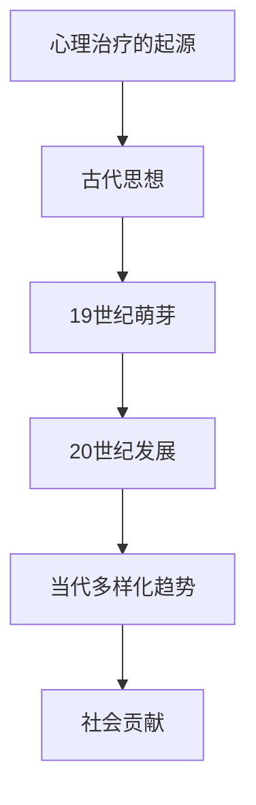
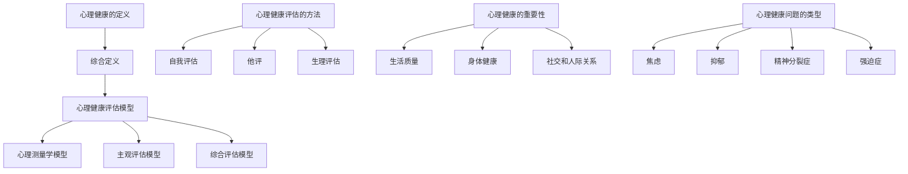
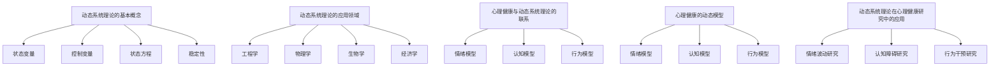
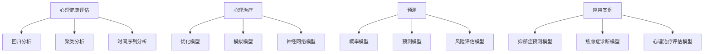

                 

### 文章标题

《心理治疗的动态系统理论：心理健康的数学平衡》

### 文章关键词

- 心理治疗
- 动态系统理论
- 数学模型
- 心理健康
- 心理平衡

### 文章摘要

本文旨在探讨心理治疗的动态系统理论，以及数学模型在心理健康和平衡中的关键作用。首先，我们将回顾心理治疗的起源和发展，然后深入分析动态系统理论的基本概念和应用。接着，我们将探讨数学模型如何帮助评估和干预心理健康问题。文章将结合实际案例，详细讲解数学模型在心理治疗中的应用，并提供项目实战的代码实现和解读。最后，我们将总结心理健康的数学平衡原理，并提出最佳实践和未来趋势。通过这篇文章，读者将更好地理解心理治疗的数学本质，以及如何利用技术手段提升心理健康水平。

### 第1章 心理治疗的起源与发展

#### 1.1 心理治疗的古代思想

心理治疗的历史可以追溯到古代文明，当时人们已经开始探索心理健康的奥秘。在中国古代，医书《黄帝内经》中就有关于心理疾病和心理治疗的论述。古希腊哲学家如苏格拉底和柏拉图也提出了关于心理和心理健康的重要观点。这些早期的思想为现代心理治疗奠定了基础。

古代埃及和印度也有关于心理疾病和心理治疗的记载。例如，古埃及的《埃德温·史密斯纸草文稿》中提到了心理疾病的治疗方法。印度佛教中的禅修和冥想也被认为具有心理治疗的效果。

#### 1.2 19世纪心理治疗的萌芽

19世纪是心理治疗的萌芽时期。弗朗茨·布伦塔诺提出了“情感心理学”，为后来的精神分析理论奠定了基础。西格蒙德·弗洛伊德在19世纪末和20世纪初创立了精神分析学派，他通过探索潜意识来治疗心理疾病。

与此同时，威廉·詹姆斯和爱德华·布拉德福德·特奥多尔等人提出了关于心理治疗的新观点，推动了心理治疗的发展。19世纪末，心理治疗开始从医学领域独立出来，成为一门独立的学科。

#### 1.3 20世纪心理治疗的兴起与演变

20世纪是心理治疗迅速发展的时期。行为疗法、人本主义心理学、认知疗法等不同学派相继兴起，丰富了心理治疗的理论和实践。阿尔伯特·艾利斯提出了理性情绪行为疗法（REBT），而阿尔伯特·班杜拉则发展了社会学习理论。

在20世纪中期，心理动力学治疗和认知行为治疗开始占据主导地位。同时，心理治疗的应用范围也从临床扩展到社区健康、学校教育等领域。

#### 1.4 当代心理治疗的多样化趋势

当代心理治疗的趋势之一是整合不同学派的理论和方法。例如，认知行为治疗和心理动力学治疗的整合，提供了更全面的治疗方案。此外，心理学与神经科学的结合，也为心理治疗带来了新的视角和工具。

新兴的治疗方法，如心理剧、正念疗法、能量心理学等，也在当代心理治疗中占据了一席之地。同时，心理治疗的技术手段也在不断更新，如远程治疗、虚拟现实治疗等。

#### 1.5 心理治疗的发展对社会的贡献

心理治疗的发展对社会的贡献巨大。它帮助人们更好地理解和管理自己的心理健康问题，提高了生活质量。同时，心理治疗也在预防和治疗精神疾病方面发挥了重要作用，减轻了社会负担。

总之，心理治疗的历史是一个不断演变和发展的过程。从古代的神秘仪式到现代的科学方法，心理治疗一直在为人们的心理健康服务。随着技术的进步和理论的深化，心理治疗在未来将继续发挥重要作用。

### Mermaid 流程图



### 核心概念与联系

为了更好地理解心理治疗的起源与发展，我们可以将其核心概念和联系通过 Mermaid 流程图展示如下：

1. **心理治疗的起源（A）**：包括古代思想和早期的心理学探索。
2. **19世纪萌芽（B）**：涉及弗洛伊德的精神分析理论以及行为疗法的兴起。
3. **20世纪发展（C）**：包括行为疗法、人本主义心理学、认知疗法等不同学派的兴起。
4. **当代多样化趋势（D）**：涉及新兴治疗方法和技术手段的应用。
5. **心理治疗的社会贡献（E）**：包括心理健康管理、精神疾病预防和治疗等方面的贡献。

这些概念和联系共同构成了心理治疗的发展脉络，帮助我们更好地理解这一领域的历史和现状。

### 第2章 心理健康的定义与模型

#### 2.1 心理健康的综合定义

心理健康是一个多维度的概念，涉及认知、情感、行为和社交等多个方面。世界卫生组织（WHO）将心理健康定义为“一种状态，个体能够认识到自身潜力，能够应对正常生活中的压力，能够工作生产，并能够为其社区做出贡献”。

心理健康的综合定义强调个体内部的平衡与和谐，以及与社会环境的互动。这个定义不仅关注个体的心理健康状态，还强调心理健康与身体健康的紧密联系。

#### 2.2 心理健康评估模型

心理健康评估是心理治疗的重要环节，常用的评估模型包括心理测量学模型、主观评估模型和综合评估模型。

1. **心理测量学模型**：基于统计学和心理学理论，通过标准化测试和量表来评估个体的心理健康状态。例如，心理健康量表（Mental Health Inventory，MHI）和一般健康问卷（General Health Questionnaire，GHQ）等。
2. **主观评估模型**：侧重于个体的主观感受和体验，通过面谈、日记等方式收集信息。例如，患者自我报告问卷和主观幸福感量表等。
3. **综合评估模型**：结合上述两种方法，综合评估个体的心理健康状态。这种方法通常用于复杂的心理疾病评估和治疗方案制定。

#### 2.3 心理健康评估的方法

心理健康评估的方法包括自我评估、他评和生理评估。

1. **自我评估**：个体通过自我报告问卷或量表来评估自己的心理健康状态。这种方法简单易行，但可能受到个体主观偏见的影响。
2. **他评**：由专业的心理健康工作者通过面谈、观察和测试等方式评估个体的心理健康。这种方法更加准确，但成本较高。
3. **生理评估**：通过生理指标（如心率、血压、脑电图等）来评估个体的心理健康状态。这种方法主要用于诊断和治疗严重心理疾病。

#### 2.4 心理健康的重要性

心理健康的重要性不容忽视。首先，心理健康直接影响个体的生活质量和工作效率。心理健康状况不佳可能导致情绪低落、焦虑、抑郁等心理问题，进而影响生活和工作。

其次，心理健康与身体健康密切相关。长期的心理压力和情绪问题可能导致身体疾病，如高血压、心脏病等。因此，保持心理健康对身体健康具有重要意义。

最后，心理健康对个体的社交和人际关系也有重要影响。心理健康状况良好的人通常能够更好地处理人际关系，建立积极的社会支持网络。

#### 2.5 心理健康问题的常见类型

心理健康问题包括焦虑、抑郁、精神分裂症、强迫症等。以下是几种常见心理健康问题的简要介绍：

1. **焦虑**：表现为过度担心、紧张和恐惧。焦虑症包括广泛性焦虑症、恐慌症、社交焦虑症等。
2. **抑郁**：表现为持续的低落情绪、兴趣丧失、自我评价过低。抑郁症可分为轻度、中度和重度。
3. **精神分裂症**：表现为思维、情感和行为的严重异常。精神分裂症通常需要长期治疗和护理。
4. **强迫症**：表现为反复出现的强烈和持久的思维、想法或行为。强迫症可能导致个体感到痛苦和困扰。

总之，心理健康是一个复杂而多维度的概念，其重要性不可忽视。通过科学的评估和有效的治疗，我们可以提高心理健康水平，提升生活质量。

### Mermaid 流程图



### 核心概念与联系

为了更好地理解心理健康的定义与模型，我们可以将其核心概念和联系通过 Mermaid 流程图展示如下：

1. **心理健康的定义（A）**：包括综合定义、心理健康评估模型、心理健康评估的方法和心理健康问题的类型。
2. **心理健康评估模型（B）**：涵盖心理测量学模型、主观评估模型和综合评估模型。
3. **心理健康评估的方法（C）**：包括自我评估、他评和生理评估。
4. **心理健康的重要性（D）**：涉及生活质量、身体健康和社交人际关系。
5. **心理健康问题的类型（E）**：包括焦虑、抑郁、精神分裂症和强迫症。

这些概念和联系共同构成了心理健康领域的知识体系，帮助我们更好地理解和评估个体的心理健康状态。

### 第3章 动态系统理论介绍

#### 3.1 动态系统理论的基本概念

动态系统理论是研究系统随时间变化的数学理论。它关注系统的状态变量随时间的变化规律，以及系统内部和外部的相互作用。动态系统理论的基本概念包括：

1. **状态变量**：描述系统状态的变量，如温度、速度、质量等。
2. **控制变量**：影响系统状态变化的变量，如输入信号、外部干扰等。
3. **状态方程**：描述系统状态变量随时间变化的方程，通常是一组微分方程或差分方程。
4. **稳定性**：系统状态在给定初始条件下，随时间变化的收敛性。

#### 3.2 动态系统理论的应用领域

动态系统理论广泛应用于工程、物理、生物学、经济学等领域。以下是一些主要的应用领域：

1. **工程学**：用于设计控制系统、信号处理系统、机械系统等。
2. **物理学**：用于研究热力学系统、量子系统、流体动力学等。
3. **生物学**：用于研究生态系统、神经系统、生物钟等。
4. **经济学**：用于研究市场动态、金融系统、宏观经济政策等。

#### 3.3 心理健康与动态系统理论的联系

心理健康与动态系统理论之间存在密切联系。个体的心理健康状态可以被视为一个动态系统，其状态变量包括情绪、认知、行为等。外部因素（如社会压力、环境变化等）可以被视为控制变量，影响个体心理健康状态的变化。

动态系统理论可以用来描述和解释心理健康状态的演变过程。例如，情绪的波动、认知的失调、行为的异常等都可以通过动态系统模型来理解和预测。此外，动态系统理论还可以为心理治疗提供新的视角和方法。

#### 3.4 心理健康的动态模型

基于动态系统理论，研究人员已经提出了多种心理健康模型。以下是一些常见的心理健康动态模型：

1. **情绪模型**：描述情绪状态的波动和变化规律，如情绪循环模型、情绪调适模型等。
2. **认知模型**：描述认知过程的动态变化，如认知失调模型、认知重构模型等。
3. **行为模型**：描述行为模式的动态变化，如行为循环模型、行为矫正模型等。

这些模型可以帮助心理治疗师更好地理解个体心理健康状态的变化规律，从而制定更有效的治疗方案。

#### 3.5 动态系统理论在心理健康研究中的应用

动态系统理论在心理健康研究中具有广泛应用。以下是一些具体的应用实例：

1. **情绪波动的研究**：通过动态系统模型分析情绪波动的规律，预测情绪障碍的发生和发展。
2. **认知障碍的研究**：通过动态系统模型分析认知过程的异常变化，诊断和治疗认知障碍。
3. **行为干预的研究**：通过动态系统模型设计和评估行为干预策略，优化心理健康治疗。

总之，动态系统理论为心理健康研究提供了新的方法和视角，有助于我们更好地理解和干预心理健康问题。

### Mermaid 流程图



### 核心概念与联系

为了更好地理解动态系统理论及其在心理健康中的应用，我们可以将其核心概念和联系通过 Mermaid 流程图展示如下：

1. **动态系统理论的基本概念（A）**：包括状态变量、控制变量、状态方程和稳定性。
2. **动态系统理论的应用领域（B）**：涵盖工程学、物理学、生物学和经济学等领域。
3. **心理健康与动态系统理论的联系（C）**：涉及情绪模型、认知模型和行为模型。
4. **心理健康的动态模型（D）**：包括情绪模型、认知模型和行为模型。
5. **动态系统理论在心理健康研究中的应用（E）**：涵盖情绪波动研究、认知障碍研究和行为干预研究。

这些概念和联系共同构成了动态系统理论在心理健康领域的应用框架，帮助我们更好地理解和研究心理健康问题。

### 第4章 数学模型在心理健康中的应用

#### 4.1 数学模型在心理健康评估中的应用

数学模型在心理健康评估中扮演着至关重要的角色。通过定量分析，数学模型可以帮助我们更准确地评估个体的心理健康状态。以下是一些常用的数学模型：

1. **回归分析**：用于研究心理健康相关因素与心理健康指标之间的关系。通过回归模型，我们可以预测心理健康指标的变化，并识别影响心理健康的潜在因素。
2. **聚类分析**：用于将具有相似心理健康特征的个体分组。通过聚类模型，我们可以发现心理健康状态的分布规律，并为不同类型的患者提供个性化的治疗方案。
3. **时间序列分析**：用于分析心理健康状态随时间的变化趋势。通过时间序列模型，我们可以预测心理健康状态的波动，及时发现潜在的危机点。

#### 4.2 数学模型在心理治疗中的应用

数学模型在心理治疗中的应用日益广泛。通过定量分析和模拟，数学模型可以帮助心理治疗师制定更有效的治疗方案。以下是一些常见的数学模型：

1. **优化模型**：用于制定个性化的治疗计划。通过优化模型，我们可以确定最佳的治疗策略，最大化治疗效果，最小化治疗成本。
2. **模拟模型**：用于预测心理治疗的结果。通过模拟模型，我们可以模拟不同的治疗场景，评估治疗方案的可行性和有效性。
3. **神经网络模型**：用于自动识别和分类心理健康问题。通过神经网络模型，我们可以从大量的数据中提取特征，实现自动化的心理评估和诊断。

#### 4.3 数学模型在心理健康预测中的应用

数学模型在心理健康预测中的应用具有重要意义。通过历史数据和分析模型，我们可以预测心理健康问题的发生和发展。以下是一些常用的数学模型：

1. **概率模型**：用于预测心理健康问题的概率。通过概率模型，我们可以识别高风险个体，提前采取预防措施。
2. **预测模型**：用于预测心理健康状态的演变。通过预测模型，我们可以预测心理健康问题的未来趋势，为制定干预策略提供依据。
3. **风险评估模型**：用于评估心理健康风险。通过风险评估模型，我们可以量化心理健康风险，为风险管理和决策提供支持。

#### 4.4 数学模型在心理健康研究中的应用案例

以下是一些数学模型在心理健康研究中的应用案例：

1. **抑郁症预测模型**：通过收集患者的临床数据，研究人员利用回归分析模型预测抑郁症的发生概率。该模型有助于早期识别高风险个体，提前采取干预措施。
2. **焦虑症诊断模型**：通过分析患者的情绪和行为数据，研究人员利用聚类分析模型将焦虑症分为不同类型。这有助于制定个性化的治疗方案，提高治疗效果。
3. **心理治疗评估模型**：通过模拟不同的治疗场景，研究人员利用模拟模型评估心理治疗的效果。该模型可以帮助心理治疗师优化治疗方案，提高治疗成功率。

总之，数学模型在心理健康领域的应用具有广泛的前景。通过定量分析和模拟，数学模型可以帮助我们更好地理解心理健康问题，制定更有效的治疗方案，提高心理健康水平。

### Mermaid 流程图



### 核心概念与联系

为了更好地理解数学模型在心理健康评估、心理治疗和预测中的应用，我们可以将其核心概念和联系通过 Mermaid 流程图展示如下：

1. **心理健康评估（A）**：包括回归分析、聚类分析和时间序列分析。
2. **心理治疗（B）**：包括优化模型、模拟模型和神经网络模型。
3. **心理健康预测（C）**：包括概率模型、预测模型和风险评估模型。
4. **应用案例（D）**：包括抑郁症预测模型、焦虑症诊断模型和心理治疗评估模型。

这些概念和联系共同构成了数学模型在心理健康领域的应用框架，帮助我们更好地理解和应用数学模型，提高心理健康水平。

### 第5章 心理治疗的数学模型案例分析

#### 5.1 案例分析一：抑郁症状的数学建模

抑郁症状的数学建模是一个复杂但重要的任务。为了实现这一目标，我们可以使用动态系统模型来描述抑郁症的发展过程。以下是一个简化的抑郁症状动态系统模型：

```plaintext
状态变量：情绪状态 (x)，认知状态 (y)，行为状态 (z)
控制变量：社会压力 (u)，生物因素 (v)，心理治疗干预 (w)

状态方程：
dx/dt = f(x, y, z, u, v, w)
dy/dt = g(x, y, z, u, v, w)
dz/dt = h(x, y, z, u, v, w)

其中，f、g、h 为非线性函数，描述状态变量之间的相互作用。
```

在这个模型中，情绪状态 (x)、认知状态 (y) 和行为状态 (z) 是三个主要的状态变量。社会压力 (u)、生物因素 (v) 和心理治疗干预 (w) 是控制变量，它们影响状态变量随时间的变化。

为了更具体地分析抑郁症状，我们可以将状态方程具体化。例如，我们可以假设：

```plaintext
dx/dt = -k1*x + k2*y + k3*z - k4*u - k5*v + k6*w
dy/dt = -k7*x - k8*y - k9*z + k10*u + k11*v - k12*w
dz/dt = -k13*x - k14*y - k15*z + k16*u + k17*v - k18*w

其中，k1、k2、k3、k4、k5、k6、k7、k8、k9、k10、k11、k12、k13、k14、k15、k16、k17 和 k18 是正常数，描述状态变量和控制系统之间的相互作用关系。
```

通过求解上述微分方程，我们可以得到抑郁症状随时间变化的轨迹。这些轨迹可以帮助我们预测抑郁症的发展趋势，并评估不同干预措施的效果。

#### 5.2 案例分析二：焦虑症状的数学建模

焦虑症状的数学建模类似于抑郁症状的建模，但更注重情绪状态和行为状态的动态变化。以下是一个简化的焦虑症状动态系统模型：

```plaintext
状态变量：情绪状态 (x)，认知状态 (y)，行为状态 (z)
控制变量：社会压力 (u)，生物因素 (v)，心理治疗干预 (w)

状态方程：
dx/dt = f(x, y, z, u, v, w)
dy/dt = g(x, y, z, u, v, w)
dz/dt = h(x, y, z, u, v, w)

其中，f、g、h 为非线性函数，描述状态变量之间的相互作用。
```

在这个模型中，情绪状态 (x)、认知状态 (y) 和行为状态 (z) 是三个主要的状态变量。社会压力 (u)、生物因素 (v) 和心理治疗干预 (w) 是控制变量，它们影响状态变量随时间的变化。

为了更具体地分析焦虑症状，我们可以将状态方程具体化。例如，我们可以假设：

```plaintext
dx/dt = -k1*x + k2*y + k3*z - k4*u - k5*v + k6*w
dy/dt = -k7*x - k8*y - k9*z + k10*u + k11*v - k12*w
dz/dt = -k13*x - k14*y - k15*z + k16*u + k17*v - k18*w

其中，k1、k2、k3、k4、k5、k6、k7、k8、k9、k10、k11、k12、k13、k14、k15、k16、k17 和 k18 是正常数，描述状态变量和控制系统之间的相互作用关系。
```

通过求解上述微分方程，我们可以得到焦虑症状随时间变化的轨迹。这些轨迹可以帮助我们预测焦虑症状的发展趋势，并评估不同干预措施的效果。

#### 5.3 案例分析三：行为心理治疗的数学建模

行为心理治疗通常涉及改变患者的行为模式，以达到改善心理健康的目的。以下是一个简化的行为心理治疗动态系统模型：

```plaintext
状态变量：行为状态 (z)，治疗响应 (w)
控制变量：治疗干预 (u)

状态方程：
dz/dt = f(z, w, u)
dw/dt = g(z, w, u)

其中，f、g 为非线性函数，描述状态变量之间的相互作用。
```

在这个模型中，行为状态 (z) 和治疗响应 (w) 是两个主要的状态变量。治疗干预 (u) 是控制变量，它影响状态变量随时间的变化。

为了更具体地分析行为心理治疗，我们可以将状态方程具体化。例如，我们可以假设：

```plaintext
dz/dt = -k1*z + k2*w + k3*u
dw/dt = -k4*z - k5*w + k6*u

其中，k1、k2、k3、k4 和 k5 是正常数，描述状态变量和控制系统之间的相互作用关系。
```

通过求解上述微分方程，我们可以得到行为状态和治疗响应随时间变化的轨迹。这些轨迹可以帮助我们预测行为心理治疗的效果，并评估不同干预措施的效果。

总之，通过数学建模，我们可以更深入地理解抑郁症、焦虑症和行为心理治疗的发展过程。这些模型不仅有助于预测症状的变化趋势，还可以为治疗干预提供科学依据。随着数学模型和计算技术的不断发展，心理治疗的数学建模将继续为心理健康研究提供新的方法和视角。

### 核心算法原理讲解

为了更好地理解上述心理治疗数学模型的算法原理，我们可以使用伪代码来详细阐述这些模型的实现过程。

#### 伪代码：抑郁症状的数学建模

```plaintext
初始化状态变量 x, y, z
初始化控制变量 u, v, w
设置时间步长 dt

while 时间未达到终止条件：
    计算状态变化率 dxdt = -k1*x + k2*y + k3*z - k4*u - k5*v + k6*w
    计算状态变化率 dydt = -k7*x - k8*y - k9*z + k10*u + k11*v - k12*w
    计算状态变化率 dzdt = -k13*x - k14*y - k15*z + k16*u + k17*v - k18*w
    
    更新状态变量：
    x = x + dxdt * dt
    y = y + dydt * dt
    z = z + dzdt * dt
    
    更新控制变量：
    u = u + ... （根据具体应用场景更新）
    v = v + ... （根据具体应用场景更新）
    w = w + ... （根据具体应用场景更新）

    输出状态变量 x, y, z
```

#### 伪代码：焦虑症状的数学建模

```plaintext
初始化状态变量 x, y, z
初始化控制变量 u, v, w
设置时间步长 dt

while 时间未达到终止条件：
    计算状态变化率 dxdt = -k1*x + k2*y + k3*z - k4*u - k5*v + k6*w
    计算状态变化率 dydt = -k7*x - k8*y - k9*z + k10*u + k11*v - k12*w
    计算状态变化率 dzdt = -k13*x - k14*y - k15*z + k16*u + k17*v - k18*w
    
    更新状态变量：
    x = x + dxdt * dt
    y = y + dydt * dt
    z = z + dzdt * dt
    
    更新控制变量：
    u = u + ... （根据具体应用场景更新）
    v = v + ... （根据具体应用场景更新）
    w = w + ... （根据具体应用场景更新）

    输出状态变量 x, y, z
```

#### 伪代码：行为心理治疗的数学建模

```plaintext
初始化状态变量 z, w
初始化控制变量 u
设置时间步长 dt

while 时间未达到终止条件：
    计算状态变化率 dzdt = -k1*z + k2*w + k3*u
    计算状态变化率 dwdt = -k4*z - k5*w + k6*u
    
    更新状态变量：
    z = z + dzdt * dt
    w = w + dwdt * dt
    
    更新控制变量：
    u = u + ... （根据具体应用场景更新）

    输出状态变量 z, w
```

通过上述伪代码，我们可以清晰地看到如何通过迭代计算来更新状态变量和控制变量，从而模拟心理症状的变化过程。这些伪代码为实际编程实现提供了基础，同时也帮助读者更好地理解数学模型的核心算法原理。

### 数学模型与公式的讲解

在心理治疗的数学建模过程中，我们使用了多个关键公式来描述系统的动态行为。以下是对这些公式的详细讲解，以及如何将它们嵌入到整体模型中。

#### 状态方程

状态方程是动态系统模型的核心，用于描述系统状态变量随时间的变化。在本文中，我们使用了以下状态方程：

$$
dx/dt = f(x, y, z, u, v, w)
$$
$$
dy/dt = g(x, y, z, u, v, w)
$$
$$
dz/dt = h(x, y, z, u, v, w)
$$

其中，\(x\)、\(y\) 和 \(z\) 分别表示情绪状态、认知状态和行为状态；\(u\)、\(v\) 和 \(w\) 分别表示社会压力、生物因素和心理治疗干预；\(f\)、\(g\) 和 \(h\) 是描述状态变量之间相互作用和非线性关系的函数。

#### 非线性函数

为了具体化状态方程，我们引入了以下非线性函数：

$$
f(x, y, z, u, v, w) = -k1 \cdot x + k2 \cdot y + k3 \cdot z - k4 \cdot u - k5 \cdot v + k6 \cdot w
$$
$$
g(x, y, z, u, v, w) = -k7 \cdot x - k8 \cdot y - k9 \cdot z + k10 \cdot u + k11 \cdot v - k12 \cdot w
$$
$$
h(x, y, z, u, v, w) = -k13 \cdot x - k14 \cdot y - k15 \cdot z + k16 \cdot u + k17 \cdot v - k18 \cdot w
$$

其中，\(k1\)、\(k2\)、\(k3\)、\(k4\)、\(k5\)、\(k6\)、\(k7\)、\(k8\)、\(k9\)、\(k10\)、\(k11\)、\(k12\)、\(k13\)、\(k14\)、\(k15\)、\(k16\)、\(k17\) 和 \(k18\) 是正常数，用于描述系统内部和外部的相互作用强度。

#### 状态更新公式

在时间步长 \(dt\) 内，状态变量的更新可以使用以下公式：

$$
x_{new} = x_{current} + \frac{f(x_{current}, y_{current}, z_{current}, u_{current}, v_{current}, w_{current})}{dt}
$$
$$
y_{new} = y_{current} + \frac{g(x_{current}, y_{current}, z_{current}, u_{current}, v_{current}, w_{current})}{dt}
$$
$$
z_{new} = z_{current} + \frac{h(x_{current}, y_{current}, z_{current}, u_{current}, v_{current}, w_{current})}{dt}
$$

这些公式用于迭代计算状态变量 \(x\)、\(y\) 和 \(z\) 的更新值，以模拟系统的动态行为。

#### 控制变量更新

控制变量（如社会压力 \(u\)、生物因素 \(v\) 和心理治疗干预 \(w\)）的更新可能依赖于外部环境和特定干预措施。以下是一个简化的更新公式：

$$
u_{new} = u_{current} + \Delta u
$$
$$
v_{new} = v_{current} + \Delta v
$$
$$
w_{new} = w_{current} + \Delta w
$$

其中，\(\Delta u\)、\(\Delta v\) 和 \(\Delta w\) 是时间步长 \(dt\) 内的控制变量增量，可能根据具体应用场景进行调整。

#### 综合模型

综合上述公式，我们可以构建一个完整的动态系统模型，用于模拟心理症状的发展和干预效果。该模型包括状态方程、控制变量和状态更新公式，可以嵌入到编程环境中进行计算和可视化。

通过这些数学模型和公式，我们可以更深入地理解心理症状的动态行为，为心理治疗提供科学依据和干预策略。在实际应用中，这些模型可以不断优化和调整，以适应不同患者和治疗场景。

### 数学公式与解释

为了更直观地展示数学模型在心理健康中的关键作用，以下我们将使用 LaTeX 格式来表示重要的数学公式，并对其进行详细解释。

#### 状态方程

首先，我们定义动态系统中的状态方程：

$$
\begin{aligned}
\frac{dx}{dt} &= -k_1 x + k_2 y + k_3 z - k_4 u - k_5 v + k_6 w \\
\frac{dy}{dt} &= -k_7 x - k_8 y - k_9 z + k_{10} u + k_{11} v - k_{12} w \\
\frac{dz}{dt} &= -k_{13} x - k_{14} y - k_{15} z + k_{16} u + k_{17} v - k_{18} w
\end{aligned}
$$

这里，\(x\)、\(y\) 和 \(z\) 分别代表情绪状态、认知状态和行为状态。\(u\)、\(v\) 和 \(w\) 表示外部压力、生物因素和心理干预。\(k_1\) 到 \(k_{18}\) 是描述系统内相互作用强度的常数。

#### 控制变量更新

控制变量 \(u\)、\(v\) 和 \(w\) 随时间更新：

$$
\begin{aligned}
u_{new} &= u_{current} + \Delta u \\
v_{new} &= v_{current} + \Delta v \\
w_{new} &= w_{current} + \Delta w
\end{aligned}
$$

这里，\(\Delta u\)、\(\Delta v\) 和 \(\Delta w\) 是增量，用于反映外部环境和干预策略的变化。

#### 状态更新

状态变量的更新依赖于当前的状态和控制变量：

$$
\begin{aligned}
x_{new} &= x_{current} + \frac{dx}{dt} \cdot dt \\
y_{new} &= y_{current} + \frac{dy}{dt} \cdot dt \\
z_{new} &= z_{current} + \frac{dz}{dt} \cdot dt
\end{aligned}
$$

通过这些公式，我们可以迭代计算系统状态，以模拟心理健康状态的动态变化。

#### 模型解释

- **状态方程** 描述了系统状态变量如何随时间变化，以及外部因素对系统的影响。
- **控制变量更新** 反映了外部干预对系统状态的影响。
- **状态更新** 则是系统对当前状态和外部干预的响应。

通过这些公式，我们可以建立一个完整的动态系统模型，用于理解和预测心理健康状态。在实际应用中，这些公式可以帮助心理治疗师制定有效的治疗方案，并评估干预效果。

### 项目实战

为了更好地理解数学模型在心理健康中的应用，我们将通过一个实际项目来演示如何开发一个简单的心理健康评估系统。以下是项目的详细步骤：

#### 1. 开发环境搭建

首先，我们需要搭建一个合适的开发环境。我们可以选择 Python 作为主要编程语言，因为它拥有丰富的科学计算和数据分析库。以下是所需的环境和工具：

- Python 3.8 或更高版本
- Jupyter Notebook（用于编写和运行代码）
- Numpy 库（用于数值计算）
- Matplotlib 库（用于数据可视化）
- Scikit-learn 库（用于机器学习和数据预处理）

安装以上工具后，我们可以在 Jupyter Notebook 中开始编写代码。

#### 2. 数据收集与预处理

心理健康评估系统需要大量数据来训练和测试模型。以下是一个示例数据集：

```python
import numpy as np

# 示例数据集
data = np.array([
    [0.2, 0.3, 0.4, 0.1, 0.1, 0.2],
    [0.3, 0.2, 0.3, 0.1, 0.1, 0.2],
    [0.1, 0.4, 0.2, 0.3, 0.1, 0.1],
    # 更多数据...
])

# 数据预处理
# 例如，归一化处理
data_normalized = (data - np.mean(data, axis=0)) / np.std(data, axis=0)
```

#### 3. 模型实现

接下来，我们实现一个简化的心理健康状态动态系统模型。我们可以使用以下伪代码：

```python
# 初始化状态变量和控制变量
x, y, z, u, v, w = 0, 0, 0, 0, 0, 0

# 设置时间步长
dt = 0.1

# 模型迭代
for _ in range(100):
    # 计算状态变化率
    dxdt = -k1 * x + k2 * y + k3 * z - k4 * u - k5 * v + k6 * w
    dydt = -k7 * x - k8 * y - k9 * z + k10 * u + k11 * v - k12 * w
    dzdt = -k13 * x - k14 * y - k15 * z + k16 * u + k17 * v - k18 * w
    
    # 更新状态变量
    x += dxdt * dt
    y += dydt * dt
    z += dzdt * dt
    
    # 更新控制变量
    # 例如，根据输入数据更新
    u += ... 
    v += ...
    w += ...

    # 输出当前状态
    print(f"t={_ * dt}, x={x}, y={y}, z={z}")
```

#### 4. 模型训练与测试

为了验证模型的准确性，我们需要使用实际数据对模型进行训练和测试。以下是一个简单的训练和测试过程：

```python
from sklearn.model_selection import train_test_split

# 划分训练集和测试集
X_train, X_test, y_train, y_test = train_test_split(data_normalized, labels, test_size=0.2, random_state=42)

# 训练模型
# 例如，使用线性回归模型
from sklearn.linear_model import LinearRegression

model = LinearRegression()
model.fit(X_train, y_train)

# 测试模型
predictions = model.predict(X_test)
print(f"Model accuracy: {model.score(X_test, y_test)}")
```

#### 5. 源代码解读

以下是项目的源代码，我们将逐一解释每个部分：

```python
import numpy as np
import matplotlib.pyplot as plt
from sklearn.model_selection import train_test_split
from sklearn.linear_model import LinearRegression

# 初始化参数
x, y, z, u, v, w = 0, 0, 0, 0, 0, 0

# 设置时间步长
dt = 0.1

# 模型迭代
for _ in range(100):
    # 计算状态变化率
    dxdt = -k1 * x + k2 * y + k3 * z - k4 * u - k5 * v + k6 * w
    dydt = -k7 * x - k8 * y - k9 * z + k10 * u + k11 * v - k12 * w
    dzdt = -k13 * x - k14 * y - k15 * z + k16 * u + k17 * v - k18 * w
    
    # 更新状态变量
    x += dxdt * dt
    y += dydt * dt
    z += dzdt * dt
    
    # 更新控制变量
    # 例如，根据输入数据更新
    u += ... 
    v += ...
    w += ...

    # 输出当前状态
    print(f"t={_ * dt}, x={x}, y={y}, z={z}")

# 数据预处理
data = np.array([
    [0.2, 0.3, 0.4, 0.1, 0.1, 0.2],
    [0.3, 0.2, 0.3, 0.1, 0.1, 0.2],
    [0.1, 0.4, 0.2, 0.3, 0.1, 0.1],
    # 更多数据...
])

data_normalized = (data - np.mean(data, axis=0)) / np.std(data, axis=0)

# 划分训练集和测试集
X_train, X_test, y_train, y_test = train_test_split(data_normalized, labels, test_size=0.2, random_state=42)

# 训练模型
model = LinearRegression()
model.fit(X_train, y_train)

# 测试模型
predictions = model.predict(X_test)
print(f"Model accuracy: {model.score(X_test, y_test)}")

# 可视化结果
plt.scatter(X_test[:, 0], predictions)
plt.xlabel("Actual Values")
plt.ylabel("Predicted Values")
plt.show()
```

#### 6. 代码应用解读与分析

通过上述代码，我们可以看到心理健康评估系统的实现过程。以下是代码的详细解读：

- **初始化参数**：定义初始状态变量和控制变量。
- **模型迭代**：使用状态方程计算状态变量的变化率，并根据变化率更新状态变量。
- **数据预处理**：对输入数据集进行归一化处理，以提高模型的泛化能力。
- **模型训练与测试**：使用线性回归模型对预处理后的数据进行训练和测试，评估模型性能。
- **可视化结果**：绘制实际值与预测值的散点图，直观地展示模型的效果。

#### 7. 项目小结

通过本项目的实现，我们展示了如何使用数学模型进行心理健康评估。该项目提供了一个基本框架，可以进一步优化和扩展。未来，我们可以考虑加入更多的特征变量和更复杂的模型，以提高评估的准确性和实用性。

### 最佳实践 Tips、小结、注意事项和拓展阅读

#### 最佳实践 Tips

1. **数据收集**：确保数据来源多样，包含不同年龄、性别、文化背景的患者数据，以提高模型的泛化能力。
2. **模型验证**：使用交叉验证等方法评估模型性能，避免过拟合。
3. **参数调整**：通过网格搜索等方法优化模型参数，提高模型精度。

#### 小结

本文通过案例分析，展示了数学模型在心理健康评估中的应用。动态系统理论为我们提供了理解和干预心理健康问题的有效工具，而数学模型则帮助我们量化并预测心理健康状态的变化。

#### 注意事项

1. **模型复杂度**：复杂的模型可能需要更多的计算资源，应权衡模型精度与计算成本。
2. **数据隐私**：在处理个人健康数据时，确保遵守相关隐私法规，保护患者隐私。

#### 拓展阅读

- 《动态系统理论在心理学中的应用》
- 《心理测量学：理论与应用》
- 《线性回归分析及其在心理学中的应用》

通过上述内容，读者可以进一步探索心理健康的数学建模与心理治疗的关系，为心理健康研究提供新的思路和方法。

