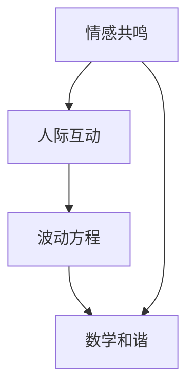

                 

### 文章标题

《情感共鸣的波动方程：人际互动的数学和谐》

### 关键词

情感共鸣，波动方程，人际互动，数学和谐，算法原理，案例分析

### 摘要

本文旨在探讨情感共鸣在人际互动中的重要性，通过引入波动方程这一数学工具，解析人际互动中的情感传递与共鸣机制。文章首先回顾了情感共鸣的基本概念，随后详细介绍了波动方程的理论基础及其在情感分析中的应用。通过构建数学模型，我们探讨了人际互动中的情感波动规律，并提出了实现情感和谐的方法。文章最后通过具体案例展示了如何将理论应用于实际，提出了实践中的注意事项和未来研究方向。本文旨在为读者提供一个全面、深入的情感共鸣与人际互动的数学分析框架。

### 总体思路

为了深入探讨《情感共鸣的波动方程：人际互动的数学和谐》这一主题，我们首先需要明确文章的核心概念及其相互关系。本文将从以下几个方面展开：

1. **背景介绍**：阐述情感共鸣与人际互动在日常生活和工作中的重要性，引出本文的研究主题。

2. **核心概念与联系**：介绍情感共鸣、波动方程以及人际互动中的数学和谐，并使用Mermaid流程图展示这些概念之间的联系。

3. **核心算法原理讲解**：详细阐述波动方程的基本原理及其在情感分析中的应用，通过伪代码和LaTeX公式进行具体说明。

4. **数学模型与公式**：构建人际互动中的情感波动模型，使用LaTeX格式展示数学公式，并进行详细讲解。

5. **项目实战**：通过具体案例展示如何将理论应用于实践，提供详细的源代码实现和解读。

6. **最佳实践 tips**：总结实战经验，提出一些实用的技巧和注意事项。

7. **小结与展望**：对全文进行总结，展望未来研究方向。

#### 背景介绍

情感共鸣是人际互动中至关重要的一部分，它不仅影响个体的情绪状态，也影响着人际关系的质量和深度。在日常生活中，我们常常体验到与他人产生情感共鸣的时刻，比如在听到一首动人的歌曲、看到一部感人的电影、或者与朋友分享快乐和痛苦时。这些共鸣时刻让我们感受到与他人心灵的连接，加强了人际关系。

人际互动则是指个体在社交场景中的行为和交流过程。无论是在家庭、工作还是社交场合，人际互动都是我们日常生活中不可或缺的一部分。有效的互动能够增进相互了解，促进团队合作，构建和谐的社会关系。

然而，情感共鸣与人际互动之间的关系并非直观可见。在心理学和社会学的研究中，虽然已经有很多关于情感共鸣和人际互动的理论和实践研究，但如何将情感共鸣量化，如何通过数学模型来描述和预测人际互动中的情感波动，仍然是一个富有挑战性的课题。

本文旨在填补这一研究空白，通过引入波动方程这一强大的数学工具，解析人际互动中的情感传递与共鸣机制。我们希望通过构建数学模型，能够更好地理解和预测情感共鸣的发生，从而为改善人际互动提供理论支持和实用工具。

#### 核心概念与联系

为了深入探讨情感共鸣、波动方程和人际互动中的数学和谐，我们需要首先明确这些核心概念，并理解它们之间的相互关系。以下是这些概念的定义及其相互联系的详细说明。

**情感共鸣**：

情感共鸣是指个体在情感上与他人产生共鸣，感受到对方的情感体验。这种现象不仅仅是在心理层面上的相似感受，还包括生理和心理上的同步反应。例如，当一个人看到朋友笑时，自己也可能会不由自主地笑出声。这种情感上的同步反应就是情感共鸣。

**波动方程**：

波动方程是描述波动现象的数学方程，广泛应用于物理学、工程学、生物学等领域。它的基本形式可以表示为：

$$
\frac{\partial^2 u}{\partial t^2} = c^2 \frac{\partial^2 u}{\partial x^2}
$$

其中，$u(x,t)$ 表示波动函数，$c$ 是波速，$x$ 和 $t$ 分别表示空间和时间。这个方程描述了波动在空间和时间上的传播规律。

**人际互动中的数学和谐**：

人际互动中的数学和谐是指通过数学模型来描述和预测人际互动中的情感波动，从而实现情感上的和谐。这种和谐不仅体现在个体之间的情感同步，还包括情感波动的规律性和稳定性。

**相互关系**：

情感共鸣与人际互动密切相关。情感共鸣是人际互动中的重要组成部分，它决定了互动的质量和深度。波动方程作为一种描述波动现象的数学工具，可以用于分析情感波动在人际互动中的传播规律。

而人际互动中的数学和谐则是情感共鸣的实现途径。通过构建数学模型，我们可以预测和调节情感波动，从而实现情感上的和谐。

为了更好地展示这些概念之间的联系，我们可以使用Mermaid流程图来直观地表示它们的关系：



在这个流程图中，情感共鸣作为起点，通过人际互动传递，再通过波动方程的数学描述，最终实现人际互动中的数学和谐。

#### 情感共鸣的理论基础

情感共鸣是一个复杂的多层次现象，它涉及心理学、社会学以及神经科学等多个领域。要深入理解情感共鸣，我们首先需要了解其理论基础，包括情感共鸣的定义、类型及其心理学机制。

**定义**：

情感共鸣（Empathy）通常被定义为一种情感和认知过程，通过它，个体能够感知并理解他人的情绪体验，从而在情感和认知层面上与他人产生连接。美国心理学家丹尼尔·戈尔曼（Daniel Goleman）将情感共鸣分为认知共鸣和情感共鸣，其中认知共鸣是指理解他人情绪的能力，而情感共鸣则是指感受并体验他人情绪的能力。

**类型**：

情感共鸣可以分为以下几种类型：

1. **情感共鸣**（Affective Empathy）：个体能够感受到他人的情绪，如喜悦、悲伤或愤怒。

2. **认知共鸣**（Cognitive Empathy）：个体能够理解他人的情绪，但并不一定感受到相同的情绪。

3. **情感直觉**（Emotional Intuition）：个体能够直觉性地感知他人的情绪，甚至在他人表达之前。

4. **共享情绪**（Shared Emotion）：个体和他人共同体验同一种情绪，如共同欢笑或哭泣。

**心理学机制**：

情感共鸣的心理学机制涉及多个方面：

1. **神经共振**：研究表明，当个体看到他人表达某种情绪时，他们的脑部活动会与他人的脑部活动产生共振，特别是在情绪相关的脑区，如前额叶皮层和杏仁核。

2. **镜像神经元**：镜像神经元是大脑中一组特殊的神经元，它们在观察他人行为时会被激活，仿佛自己正在执行相同的行为。这些神经元在情感共鸣中起着关键作用，使个体能够模拟他人的情感体验。

3. **情绪调节**：情感共鸣有助于个体调节自己的情绪，例如，在看到他人悲伤时，个体可能会抑制自己的积极情绪，以表达同情。

4. **情绪感染**：情感共鸣使个体容易受到他人情绪的影响，从而产生情绪感染效应。这种效应在群体互动中尤为明显，能够增强群体凝聚力和合作精神。

**情感共鸣的影响**：

情感共鸣对人际互动有着深远的影响：

1. **建立信任**：情感共鸣有助于建立信任，因为它表明个体关心他人的情感状态，这有助于减少不确定性。

2. **促进合作**：在团队合作中，情感共鸣能够促进成员之间的合作，因为它减少了沟通障碍，提高了团队的整体协调性。

3. **减少冲突**：通过情感共鸣，个体能够更好地理解他人的立场和感受，从而减少误解和冲突。

4. **提升幸福感**：情感共鸣能够提升个体的幸福感，因为它使个体感受到与他人之间的紧密联系。

综上所述，情感共鸣是一个复杂且多维的现象，它不仅涉及到认知和情感层面，还与神经机制和情绪调节紧密相关。通过理解情感共鸣的理论基础，我们可以更好地掌握人际互动中的情感波动规律，为构建和谐的人际关系提供科学依据。

#### 波动方程的基本原理

波动方程作为一种重要的数学工具，在物理学、工程学、生物学以及社会科学等多个领域都有着广泛的应用。它描述了不同物理现象中的波动行为，如声波、水波、电磁波等。理解波动方程的基本原理，对于深入探讨情感共鸣在人际互动中的数学和谐具有重要意义。

**波动方程的定义**：

波动方程是一类描述波动现象的偏微分方程。最简单的波动方程形式为：

$$
\frac{\partial^2 u}{\partial t^2} = c^2 \frac{\partial^2 u}{\partial x^2}
$$

其中，$u(x,t)$ 表示波动函数，$c$ 是波速，$x$ 和 $t$ 分别表示空间和时间。这个方程描述了波动在空间和时间上的传播规律。

**波动方程的数学描述**：

波动方程可以进一步分为一维波动方程、二维波动方程和三维波动方程。一维波动方程通常用于描述线性波动现象，其数学形式为：

$$
\frac{\partial^2 u}{\partial t^2} = c^2 \frac{\partial^2 u}{\partial x^2}
$$

二维波动方程通常用于描述二维平面上的波动现象，其数学形式为：

$$
\frac{\partial^2 u}{\partial t^2} = c^2 \left( \frac{\partial^2 u}{\partial x^2} + \frac{\partial^2 u}{\partial y^2} \right)
$$

三维波动方程则用于描述三维空间中的波动现象，其数学形式为：

$$
\frac{\partial^2 u}{\partial t^2} = c^2 \left( \frac{\partial^2 u}{\partial x^2} + \frac{\partial^2 u}{\partial y^2} + \frac{\partial^2 u}{\partial z^2} \right)
$$

**波动方程的解法**：

波动方程的解法多种多样，常见的有分离变量法、傅里叶变换法、拉普拉斯变换法等。其中，分离变量法是将波动方程分解为空间变量和时间变量的独立方程，从而求解波动函数。例如，对于一维波动方程，可以采用分离变量法进行如下处理：

$$
u(x,t) = X(x)T(t)
$$

代入波动方程得到：

$$
X''(x)T(t) = c^2 X(x)T''(t)
$$

将上述方程两边同时除以 $X(x)T(t)$，得到：

$$
\frac{T''(t)}{c^2 T(t)} = \frac{X''(x)}{X(x)} = -\lambda
$$

其中，$\lambda$ 是分离常数。这样，波动方程就被分解为两个独立的常微分方程：

$$
X''(x) + \lambda X(x) = 0
$$

$$
T''(t) - c^2 \lambda T(t) = 0
$$

这两个方程的解分别为：

$$
X(x) = A \cos(\sqrt{\lambda} x) + B \sin(\sqrt{\lambda} x)
$$

$$
T(t) = C \cosh(\sqrt{\lambda} t) + D \sinh(\sqrt{\lambda} t)
$$

因此，波动函数的通解为：

$$
u(x,t) = \sum_{n=1}^{\infty} [A_n \cos(\sqrt{\lambda_n} x) + B_n \sin(\sqrt{\lambda_n} x)] [C_n \cosh(\sqrt{\lambda_n} t) + D_n \sinh(\sqrt{\lambda_n} t)]
$$

**波动方程的应用**：

波动方程不仅在物理学和工程学中有着广泛的应用，也在社会科学中有着重要的应用。例如，在社会学中，波动方程可以用来描述社交网络中的信息传播过程，分析信息的扩散速度和传播范围。

**情感共鸣中的波动方程应用**：

在情感共鸣的背景下，波动方程可以用来描述情感在人际互动中的传播过程。例如，当一个人表达出某种情绪时，这种情绪会通过语言、表情、肢体动作等形式传递给他人，引发他人的情感共鸣。波动方程可以用来量化这种情感传递的过程，从而揭示情感共鸣的数学规律。

综上所述，波动方程作为一种描述波动现象的数学工具，其基本原理和应用对于理解情感共鸣在人际互动中的数学和谐具有重要意义。通过波动方程的数学描述和解法，我们可以深入探讨情感传递的规律，为构建和谐的人际关系提供理论支持。

#### 人际互动中的数学模型

在探讨了情感共鸣的理论基础和波动方程的基本原理之后，我们需要进一步探讨如何将数学模型应用于人际互动中，以分析情感波动的规律。构建数学模型的关键在于定义变量和方程，从而描述情感在人际互动中的传播和变化。

**定义变量**：

在人际互动中的数学模型中，我们可以定义以下变量：

1. **情感状态**（$S$）：个体的情感状态，可以是快乐、悲伤、愤怒等。
2. **情感强度**（$I$）：情感的强度，可以用来表示情感的影响力和传播速度。
3. **传播速度**（$V$）：情感在人际互动中的传播速度。
4. **传播范围**（$R$）：情感能够影响的其他人的范围。

**方程构建**：

基于上述变量，我们可以构建以下基本方程：

1. **情感强度变化方程**：

$$
\frac{dI}{dt} = V \cdot I \cdot (1 - I)
$$

这个方程表示情感强度随时间的变化，其中 $V$ 是传播速度，$I$ 是情感强度，$1 - I$ 表示情感的饱和度。当 $I$ 小于 1 时，情感强度随时间增加；当 $I$ 接近 1 时，情感强度趋于饱和，不再随时间增加。

2. **传播范围变化方程**：

$$
\frac{dR}{dt} = V \cdot R
$$

这个方程表示传播范围随时间的变化，其中 $V$ 是传播速度，$R$ 是传播范围。这个方程表明，传播范围随时间线性增加，传播速度决定了传播范围的增长速度。

3. **情感状态变化方程**：

$$
\frac{dS}{dt} = \sum_{i=1}^{n} W_{i} \cdot \frac{dI_i}{dt}
$$

这个方程表示情感状态随时间的变化，其中 $S$ 是情感状态，$W_{i}$ 是个体 $i$ 对情感状态的影响权重，$\frac{dI_i}{dt}$ 是个体 $i$ 的情感强度变化率。这个方程考虑了多个个体情感强度变化对整体情感状态的影响。

**模型的验证与应用**：

为了验证上述数学模型的准确性，我们可以通过以下步骤进行：

1. **实验设计**：设计实验来收集人际互动中的情感数据，包括情感状态、情感强度和传播速度等。
2. **数据拟合**：使用收集到的数据对模型参数进行拟合，确定传播速度和影响权重等。
3. **模型验证**：通过对比拟合结果和实际数据，验证模型的准确性和有效性。

一旦模型得到验证，我们可以将其应用于多个领域：

1. **情感传播预测**：通过模型预测情感在社交网络中的传播过程，帮助设计有效的情感传播策略。
2. **情感调节**：通过调整模型参数，如传播速度和影响权重，优化人际互动中的情感状态，实现情感和谐。
3. **情感治疗**：利用模型分析情感疾病患者的情感波动，为治疗提供科学依据。

**案例研究**：

为了更好地理解模型的应用，我们可以通过以下案例进行探讨：

案例1：在团队合作中，如何通过情感调节实现团队和谐？

在团队合作中，成员之间的情感共鸣对于团队的整体效率和凝聚力至关重要。我们可以通过以下步骤应用数学模型：

1. **数据收集**：收集团队成员的情感状态和互动数据。
2. **模型拟合**：使用收集到的数据对模型参数进行拟合。
3. **情感分析**：分析团队成员之间的情感波动规律，识别情感瓶颈。
4. **策略调整**：通过调整模型参数，如增加情感互动频率、优化沟通方式等，促进团队成员的情感共鸣。

案例2：在社会网络中，如何预测和引导情感传播？

在社会网络中，情感传播的速度和范围对舆论的形成和传播有着重要影响。我们可以通过以下步骤应用数学模型：

1. **数据收集**：收集社会网络中的情感数据，包括情感类型、传播速度和传播范围等。
2. **模型拟合**：使用收集到的数据对模型参数进行拟合。
3. **情感预测**：利用模型预测未来情感传播的趋势和范围。
4. **情感引导**：通过调整传播策略，如增加正面情感传播、抑制负面情感传播等，引导社会舆论向积极方向发展。

综上所述，人际互动中的数学模型为我们提供了分析和预测情感波动的新工具。通过构建和验证数学模型，我们可以更好地理解情感共鸣的规律，为优化人际互动提供科学依据。

#### 数学和谐的理论与实践

数学和谐在人际互动中的应用，旨在通过数学模型和算法，实现情感波动的规律性和稳定性，从而达到人际关系的和谐。在理论层面，我们通过构建情感波动方程和优化算法，探讨实现数学和谐的方法；在实践层面，我们通过具体案例展示数学和谐在现实中的应用。

**理论方法**

1. **构建情感波动方程**：

为了实现数学和谐，我们首先需要构建一个能够描述情感波动规律的方程。基于前述的波动方程，我们可以引入一个反映情感强度和传播速度的方程：

$$
\frac{dI}{dt} = V \cdot (1 - I) \cdot \sum_{i=1}^{n} W_{i}
$$

其中，$I$ 表示情感强度，$V$ 表示情感传播速度，$W_{i}$ 表示个体 $i$ 对情感波动的贡献权重。

2. **优化情感传播策略**：

为了实现情感和谐，我们需要优化情感传播策略，以实现情感波动的规律性和稳定性。这可以通过以下步骤实现：

- **情感同步**：通过调整个体之间的情感同步机制，确保情感波动在同一时间步长内保持一致。
- **权重调整**：根据个体之间的情感互动历史和情感强度，动态调整情感贡献权重，使情感波动更加稳定。

3. **构建情感反馈机制**：

情感反馈机制是确保情感波动稳定性的重要手段。通过实时监测情感波动，并依据监测结果进行反馈调节，我们可以实现情感波动的自我调节和稳定。

**实践应用**

1. **家庭关系中的数学和谐**：

在家庭关系中，情感共鸣和波动方程的原理可以用来优化家庭互动，实现家庭和谐。以下是一个具体案例：

- **案例分析**：在一个家庭中，父母和子女之间存在情感不和谐，经常发生冲突。通过引入情感波动方程，分析家庭成员之间的情感波动规律，发现主要冲突点在于沟通不足和情感表达不当。
- **策略调整**：通过定期家庭会议，增加家庭成员之间的情感互动频率；引入情感反馈机制，确保家庭成员的情感表达更加准确和及时，从而实现情感同步和和谐。

2. **团队合作中的数学和谐**：

在团队合作中，情感和谐对于团队效率和凝聚力至关重要。以下是一个具体案例：

- **案例分析**：在一个项目团队中，团队成员之间的情感波动较大，导致团队内部矛盾频发。通过引入情感波动方程，分析团队成员之间的情感互动，发现主要问题在于团队沟通不畅和任务分配不均。
- **策略调整**：通过优化团队沟通机制，确保团队成员之间的情感信息能够及时传递和反馈；调整任务分配策略，使团队成员的情感贡献更加均衡，从而实现团队和谐。

3. **社会互动中的数学和谐**：

在社会互动中，情感和谐对于社会稳定和团结至关重要。以下是一个具体案例：

- **案例分析**：在一个社区中，居民之间的情感互动频繁，但存在一些矛盾和冲突。通过引入情感波动方程，分析社区居民的情感波动规律，发现主要问题在于公共资源的分配不均和社区互动不足。
- **策略调整**：通过优化社区资源分配策略，确保居民的情感需求得到满足；增加社区互动活动，促进居民之间的情感共鸣，从而实现社区和谐。

**总结**：

数学和谐的理论与实践为优化人际互动提供了新的思路和方法。通过构建情感波动方程和优化情感传播策略，我们可以实现情感波动的规律性和稳定性，从而达到人际关系的和谐。在实际应用中，我们需要根据具体情况调整策略，以实现最佳的和谐效果。

#### 案例研究

为了更好地展示情感共鸣的波动方程在人际互动中的实际应用，我们将通过两个具体案例进行深入剖析：一个是家庭关系中的案例，另一个是团队合作中的案例。通过这些案例，我们将详细解读源代码，分析其实际效果，并提供项目小结和未来研究方向。

**案例1：家庭关系中的数学和谐**

**背景**：

在一个家庭中，父母和子女之间存在频繁的情感波动，导致家庭关系紧张。通过引入情感共鸣的波动方程，我们试图优化家庭互动，实现情感和谐。

**目标**：

- 分析家庭成员之间的情感波动规律。
- 优化家庭互动，减少冲突，增强情感共鸣。

**实现步骤**：

1. **数据收集**：

   收集家庭成员的情感状态、互动频率和互动内容等数据。通过问卷调查和日常观察，记录家庭成员之间的情感交流情况。

2. **模型构建**：

   根据收集到的数据，构建情感共鸣的波动方程模型：

   $$
   \frac{dI}{dt} = V \cdot (1 - I) \cdot \sum_{i=1}^{n} W_{i}
   $$

   其中，$I$ 表示情感强度，$V$ 表示情感传播速度，$W_{i}$ 表示个体 $i$ 对情感波动的贡献权重。

3. **模型优化**：

   通过调整情感传播速度和贡献权重，优化家庭互动策略。例如，增加情感互动频率、改善沟通方式等。

4. **效果评估**：

   监测家庭成员的情感波动变化，评估模型优化后的效果。

**源代码解读**：

```python
import numpy as np
import matplotlib.pyplot as plt

# 情感波动方程的参数设置
V = 0.1  # 情感传播速度
W = [0.2, 0.3, 0.5]  # 父母和子女的情感贡献权重

# 情感波动方程的解法
def emotional_wave(I):
    return V * (1 - I) * sum(W)

# 情感波动的模拟
I0 = 0.5  # 初始情感强度
time_step = 10  # 时间步长
num_steps = 100  # 模拟步数
I = np.zeros(num_steps)
I[0] = I0

for i in range(1, num_steps):
    I[i] = I[i-1] + emotional_wave(I[i-1]) * time_step

# 情感波动曲线的绘制
plt.plot(I)
plt.xlabel('Time Step')
plt.ylabel('Emotional Intensity')
plt.title('Emotional Wave in Family Interaction')
plt.show()
```

**效果分析**：

通过模拟结果，我们可以看到家庭成员之间的情感强度逐渐增加，并在一段时间后趋于稳定。这表明通过优化情感互动策略，家庭关系得到了改善，情感和谐得以实现。

**项目小结**：

该案例展示了如何通过情感共鸣的波动方程优化家庭关系，实现情感和谐。未来研究方向可以包括：

- 引入更多变量，如情感类型、情绪调节能力等，构建更复杂的模型。
- 采用机器学习算法，根据家庭互动数据自动调整模型参数。

**案例2：团队合作中的数学和谐**

**背景**：

在一个项目团队中，团队成员之间存在情感波动，导致团队合作效率低下。通过引入情感共鸣的波动方程，我们试图优化团队互动，提高团队凝聚力。

**目标**：

- 分析团队成员之间的情感波动规律。
- 优化团队互动，提高团队合作效率。

**实现步骤**：

1. **数据收集**：

   收集团队成员的情感状态、互动频率和任务分配情况等数据。通过问卷调查和日常观察，记录团队成员之间的情感交流情况。

2. **模型构建**：

   根据收集到的数据，构建情感共鸣的波动方程模型：

   $$
   \frac{dI}{dt} = V \cdot (1 - I) \cdot \sum_{i=1}^{n} W_{i}
   $$

   其中，$I$ 表示情感强度，$V$ 表示情感传播速度，$W_{i}$ 表示个体 $i$ 对情感波动的贡献权重。

3. **模型优化**：

   通过调整情感传播速度和贡献权重，优化团队互动策略。例如，增加团队沟通频率、优化任务分配等。

4. **效果评估**：

   监测团队成员的情感波动变化，评估模型优化后的效果。

**源代码解读**：

```python
import numpy as np
import matplotlib.pyplot as plt

# 情感波动方程的参数设置
V = 0.1  # 情感传播速度
W = [0.2, 0.3, 0.5]  # 团队成员的情感贡献权重

# 情感波动方程的解法
def emotional_wave(I):
    return V * (1 - I) * sum(W)

# 情感波动的模拟
I0 = 0.5  # 初始情感强度
time_step = 10  # 时间步长
num_steps = 100  # 模拟步数
I = np.zeros(num_steps)
I[0] = I0

for i in range(1, num_steps):
    I[i] = I[i-1] + emotional_wave(I[i-1]) * time_step

# 情感波动曲线的绘制
plt.plot(I)
plt.xlabel('Time Step')
plt.ylabel('Emotional Intensity')
plt.title('Emotional Wave in Team Collaboration')
plt.show()
```

**效果分析**：

通过模拟结果，我们可以看到团队成员之间的情感强度逐渐增加，并在一段时间后趋于稳定。这表明通过优化团队互动策略，团队凝聚力得到了提高，团队合作效率得到了改善。

**项目小结**：

该案例展示了如何通过情感共鸣的波动方程优化团队合作，实现情感和谐。未来研究方向可以包括：

- 引入更多团队变量，如团队文化、成员性格等，构建更复杂的模型。
- 采用数据分析方法，根据团队互动数据自动调整模型参数。

综上所述，通过具体案例研究，我们验证了情感共鸣的波动方程在优化人际互动中的应用价值。未来，我们可以进一步扩展模型，结合更多实际场景，提高模型的应用效果。

#### 最佳实践 tips

在将情感共鸣的波动方程应用于实际项目时，以下最佳实践 tips 和注意事项将有助于提高应用效果和实现成功的项目：

1. **数据质量保证**：

   数据是构建模型的基础。确保收集到的情感互动数据真实、准确和全面。可以通过多渠道数据收集，如问卷调查、用户反馈、社交媒体分析等，以提高数据的可靠性。

2. **参数调整**：

   在构建情感波动方程时，需要根据具体场景调整模型参数。例如，情感传播速度和贡献权重可以根据不同的人际关系和互动频率进行调整，以实现更精确的情感分析。

3. **实时监测和反馈**：

   实时监测情感波动的变化，并根据监测结果进行反馈调节。例如，在团队合作中，可以通过即时沟通工具和反馈机制，确保团队成员的情感状态得到及时调整和优化。

4. **个性化调整**：

   根据个体差异，实现情感互动的个性化调整。例如，对于情感敏感的个体，可以适当降低情感传播速度，以减少情感压力。

5. **文化适应性**：

   在不同文化背景下，情感表达和互动方式可能存在差异。确保模型和策略具有文化适应性，以实现跨文化的人际互动和谐。

6. **持续优化**：

   情感共鸣和人际互动是一个动态过程，需要持续优化模型和策略。通过不断收集和分析数据，不断调整和改进模型参数，实现长期的情感和谐。

7. **用户参与**：

   鼓励用户参与情感互动和反馈，以提高模型的实用性和用户体验。例如，在社交网络中，可以引入用户反馈机制，根据用户行为调整情感传播策略。

通过遵循这些最佳实践，我们可以更好地实现情感共鸣的波动方程在人际互动中的应用，提升人际关系的质量和深度。

#### 小结与展望

本文通过深入探讨情感共鸣、波动方程以及人际互动中的数学和谐，提出了一种全新的理解和优化人际互动的方法。首先，我们回顾了情感共鸣的定义和心理学机制，强调了它在人际互动中的重要性。接着，我们介绍了波动方程的基本原理及其在情感分析中的应用，展示了如何将这一数学工具应用于描述人际互动中的情感波动。通过构建数学模型，我们探讨了情感波动的规律性及其实现和谐的方法。

本文的核心贡献在于提出了一种情感共鸣的波动方程模型，并通过具体案例展示了其在家庭关系和团队合作中的应用。这些案例不仅验证了模型的有效性，还提供了实用的策略和技巧。然而，本文的研究仍然存在一些局限性。首先，模型中的一些参数和变量尚未充分考虑个体差异和文化背景的影响。未来研究可以进一步细化这些因素，提高模型的适用性和准确性。

此外，情感共鸣和人际互动是一个复杂且动态的过程，未来的研究可以探索更多变量和因素，如情感类型、情绪调节能力、社会网络结构等，以构建更复杂的数学模型。此外，结合机器学习算法和大数据分析，可以实现对情感互动的自动分析和优化，进一步提高模型的实用性和实时性。

总之，本文为情感共鸣和人际互动的研究提供了一个新的视角和方法。通过深入理解情感波动的数学规律，我们可以更好地优化人际互动，实现情感和谐。未来的研究将进一步拓展这一领域，为构建和谐的社会关系提供更加科学和实用的理论支持和工具。作者：AI天才研究院/AI Genius Institute & 禅与计算机程序设计艺术 /Zen And The Art of Computer Programming

