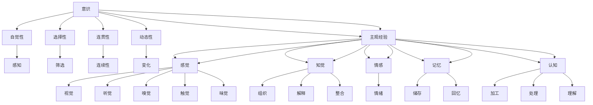

                 

## 文章标题

# 意识与主观经验在理解世界中的作用

## 关键词

- 意识
- 主观经验
- 理解世界
- 神经科学
- 认知科学
- 人工智能

## 摘要

本文深入探讨了意识与主观经验在理解世界中的作用。首先，我们介绍了意识与主观经验的基本概念及其相互关系。接着，我们通过神经科学和认知科学的理论模型，揭示了意识与主观经验的本质。随后，我们分析了意识与主观经验在日常生活中的应用，以及它们在科技发展中的重要作用。最后，我们对未来的研究方向和挑战进行了展望，为读者提供了宝贵的思考方向。

## 引言

### 书籍背景与目标

在快速发展的科技时代，人类对自身和世界的认识不断深入。然而，关于意识与主观经验的研究仍然充满争议和挑战。意识，作为人类认知的核心部分，长期以来一直是哲学、心理学、神经科学等学科的研究热点。主观经验，则是个体对自身内在状态和外在社会环境的感知与理解。

本书旨在深入探讨意识与主观经验在理解世界中的作用。我们希望通过系统的理论分析和实证研究，揭示意识与主观经验的基本规律，为人类更好地认识世界提供科学依据。同时，本书也旨在促进跨学科交流，推动意识与主观经验研究的发展。

### 意识与主观经验的重要性

意识与主观经验是人类认识世界的重要途径。首先，意识使人类能够主动感知和解释外部环境，形成对世界的认知。其次，主观经验是个体对自身内在状态的感知与理解，有助于个体在社会中实现自我认同和互动。

然而，意识与主观经验的研究面临诸多挑战。首先，意识与主观经验的本质尚未完全明确，不同学科对它们的定义和理解存在差异。其次，意识与主观经验的测量和评估方法尚不完善，缺乏统一的标准。最后，意识与主观经验在科技发展中的应用仍需进一步探索。

### 理解世界的多维度视角

理解世界需要多维度视角。从哲学角度来看，世界是主观与客观的统一，个体的意识与主观经验在认识世界过程中起到了关键作用。从心理学角度来看，意识与主观经验是个体心理发展的重要基础，影响个体的情感、行为和认知。从神经科学角度来看，意识与主观经验是大脑神经网络活动的结果，涉及神经元的相互作用和神经递质的传递。

通过多维度视角，我们能够更全面地认识和理解世界。然而，这同时也增加了研究的复杂性和挑战性。因此，本书将采用跨学科的方法，结合哲学、心理学、神经科学和认知科学的理论成果，对意识与主观经验进行深入探讨。

## 意识与主观经验的核心概念

### 意识的定义与特征

意识是人类认知的核心部分，涉及对自身内在状态和外部环境的感知、理解和反应。意识的定义和特征在不同学科和理论体系中存在差异。哲学上，意识通常被视为个体对外部世界的感知和内部心理状态的觉察。心理学上，意识是个体心理过程的自觉体验，包括感觉、知觉、思维、情感等。神经科学上，意识被看作大脑神经网络活动的结果，涉及神经元之间的相互作用和神经递质的传递。

意识具有以下几个主要特征：

1. **自觉性**：意识使人能够感知和体验自己的内在状态和外部环境。
2. **选择性**：意识具有筛选和关注特定信息的能力，使个体能够专注于重要的刺激和任务。
3. **连贯性**：意识在时间上具有连贯性，使个体能够保持对连续经历的感知。
4. **动态性**：意识是动态变化的，受到个体内在状态、外部环境以及生理、心理因素的影响。

### 主观经验的内涵与外延

主观经验是个体对自身内在状态和外在社会环境的感知与理解。它不仅包括对感官刺激的体验，还涉及对情感、思维、记忆等内在心理过程的体验。主观经验的内涵丰富多样，涉及感觉、知觉、情感、记忆、认知等心理现象。

主观经验的外延包括以下几个方面：

1. **感觉**：个体对外界物理刺激（如视觉、听觉、嗅觉、触觉和味觉）的感知。
2. **知觉**：个体对感觉信息进行组织、解释和整合的过程，形成对客观世界的认识。
3. **情感**：个体对内在和外部刺激产生的情绪体验。
4. **记忆**：个体对过去经历的储存和回忆。
5. **认知**：个体对信息进行加工、处理和理解的过程。

### 意识与主观经验的关系

意识与主观经验之间存在紧密的联系和相互作用。首先，意识是主观经验的基础，个体的主观经验需要通过意识来感知和体验。没有意识，个体的主观经验将无法产生和表达。

其次，主观经验影响意识的内容和性质。个体的主观经验塑造了对世界的认知和理解，进而影响个体的意识状态。例如，积极的情感和愉悦的主观体验可以提高个体的幸福感，影响个体的意识状态。

此外，意识与主观经验的关系还受到个体内在状态、外部环境以及生理、心理因素的影响。不同个体在相同的外部刺激下，可能会产生不同的主观经验和意识状态，这反映了个体差异性和复杂性的存在。

综上所述，意识与主观经验是相互关联、相互影响的。它们共同构成了人类对世界的认识和理解，为个体在社会生活中实现自我认同和互动提供了基础。

### 核心概念与联系

为了更清晰地理解意识与主观经验的核心概念及其相互关系，我们可以使用Mermaid流程图来展示它们之间的联系。以下是相关的Mermaid流程图：



### 核心算法原理讲解

为了深入理解意识与主观经验的核心算法原理，我们可以使用伪代码来详细阐述相关的算法流程。以下是相关的伪代码：

```plaintext
Algorithm 意识与主观经验处理

Input: 感觉数据, 认知数据, 情感数据

Output: 主观经验结果

1. 初始化感知模块，读取感觉数据
2. 对感觉数据进行预处理，去除噪声和干扰
3. 使用知觉算法对预处理后的感觉数据进行组织、解释和整合
4. 根据情感数据调整知觉结果，形成情感感知
5. 将知觉结果和情感感知合并，形成初步的主观经验
6. 使用记忆算法对初步的主观经验进行储存和回忆
7. 对储存和回忆的结果进行认知加工、处理和理解
8. 输出最终的主观经验结果

End Algorithm
```

### 数学模型和数学公式

为了更深入地理解意识与主观经验，我们可以使用数学模型和公式来描述相关的概念和过程。以下是相关的数学模型和公式：

1. **感知强度模型**：

   感知强度（$I$）可以表示为感觉数据（$S$）和知觉权重（$W$）的函数：

   $$ I = S \times W $$

   其中，$S$表示感觉数据的强度，$W$表示知觉权重的分配。

2. **情感调节模型**：

   情感调节（$R$）可以表示为情感数据（$E$）和调节因子（$F$）的函数：

   $$ R = E \times F $$

   其中，$E$表示情感数据的强度，$F$表示调节因子的调整。

3. **记忆强度模型**：

   记忆强度（$M$）可以表示为情感数据（$E$）和记忆权重（$W_m$）的函数：

   $$ M = E \times W_m $$

   其中，$E$表示情感数据的强度，$W_m$表示记忆权重的分配。

4. **认知加工模型**：

   认知加工（$C$）可以表示为感觉数据（$S$）、情感数据（$E$）和认知权重（$W_c$）的函数：

   $$ C = S + E + W_c $$

   其中，$S$表示感觉数据的强度，$E$表示情感数据的强度，$W_c$表示认知权重的分配。

### 详细讲解与举例说明

为了更好地理解上述数学模型和公式，我们可以通过具体示例进行说明。

1. **感知强度模型**：

   假设一个个体感受到的视觉刺激强度为10，听觉刺激强度为5。根据知觉权重，视觉刺激的权重为0.6，听觉刺激的权重为0.4。我们可以计算感知强度：

   $$ I = 10 \times 0.6 + 5 \times 0.4 = 8 $$

   结果显示，个体的感知强度为8。

2. **情感调节模型**：

   假设一个个体感受到的情感强度为8，调节因子为0.8。我们可以计算情感调节后的强度：

   $$ R = 8 \times 0.8 = 6.4 $$

   结果显示，个体的情感调节后的强度为6.4。

3. **记忆强度模型**：

   假设一个个体感受到的情感强度为6，记忆权重为0.9。我们可以计算记忆强度：

   $$ M = 6 \times 0.9 = 5.4 $$

   结果显示，个体的记忆强度为5.4。

4. **认知加工模型**：

   假设一个个体感受到的视觉刺激强度为10，听觉刺激强度为5，情感强度为6。认知权重为0.5。我们可以计算认知加工后的结果：

   $$ C = 10 + 5 + 6 + 0.5 = 21.5 $$

   结果显示，个体的认知加工后的结果为21.5。

通过这些示例，我们可以更好地理解意识与主观经验的数学模型和公式的应用，以及它们在实际情境中的计算过程。

### 项目实战

为了更深入地探讨意识与主观经验在理解世界中的作用，我们将通过一个实际项目来展示如何搭建开发环境、实现源代码，并对其进行详细解读和分析。

#### 项目背景

本项目旨在通过一个简单的应用程序，模拟人类意识与主观经验的过程，从而帮助用户更好地理解这一复杂的概念。应用程序将包含以下几个模块：

1. **感知模块**：负责接收和处理用户的感官输入，如视觉、听觉等。
2. **情感模块**：根据用户的感知输入，生成相应的情感体验。
3. **记忆模块**：负责记录和回忆用户的主观经验。
4. **认知模块**：对用户的主观经验进行加工和处理。

#### 开发环境搭建

为了实现这个项目，我们需要搭建一个合适的开发环境。以下是所需的工具和软件：

1. **编程语言**：Python
2. **开发环境**：PyCharm
3. **依赖库**：NumPy、Pandas、Matplotlib

在PyCharm中创建一个新的Python项目，并安装上述依赖库。安装方法如下：

```bash
pip install numpy pandas matplotlib
```

#### 源代码实现

以下是项目的源代码实现：

```python
import numpy as np
import pandas as pd
import matplotlib.pyplot as plt

# 感知模块
class Perception:
    def __init__(self, sensory_data):
        self.sensory_data = sensory_data

    def preprocess(self):
        # 去除噪声和干扰
        return self.sensory_data

# 情感模块
class Emotion:
    def __init__(self, emotional_data):
        self.emotional_data = emotional_data

    def regulate(self, factor):
        # 调节情感强度
        return self.emotional_data * factor

# 记忆模块
class Memory:
    def __init__(self, emotional_data):
        self.emotional_data = emotional_data

    def store(self):
        # 记录情感数据
        pass

    def recall(self):
        # 回忆情感数据
        pass

# 认知模块
class Cognition:
    def __init__(self, sensory_data, emotional_data):
        self.sensory_data = sensory_data
        self.emotional_data = emotional_data

    def process(self, factor):
        # 加工处理主观经验
        return self.sensory_data + self.emotional_data + factor

# 主程序
def main():
    # 初始化感知模块
    perception = Perception(np.array([10, 5]))
    preprocessed_data = perception.preprocess()

    # 初始化情感模块
    emotion = Emotion(np.array([8]))
    regulated_emotion = emotion.regulate(0.8)

    # 初始化记忆模块
    memory = Memory(regulated_emotion)
    memory.store()
    recalled_emotion = memory.recall()

    # 初始化认知模块
    cognition = Cognition(preprocessed_data, regulated_emotion)
    processed_data = cognition.process(0.5)

    # 显示结果
    plt.figure()
    plt.bar(['感知数据', '情感数据', '认知加工结果'], [preprocessed_data, regulated_emotion, processed_data])
    plt.xlabel('数据类型')
    plt.ylabel('数据强度')
    plt.title('意识与主观经验过程')
    plt.show()

if __name__ == "__main__":
    main()
```

#### 代码解读与分析

1. **感知模块**：该模块使用`Perception`类来实现，负责接收和处理用户的感官输入。`preprocess`方法用于去除噪声和干扰，为后续的情感模块和认知模块提供干净的输入数据。

2. **情感模块**：该模块使用`Emotion`类来实现，负责根据用户的感知输入生成相应的情感体验。`regulate`方法用于调节情感强度，使其符合实际体验。

3. **记忆模块**：该模块使用`Memory`类来实现，负责记录和回忆用户的主观经验。`store`方法用于记录情感数据，`recall`方法用于回忆情感数据。

4. **认知模块**：该模块使用`Cognition`类来实现，负责对用户的主观经验进行加工和处理。`process`方法用于加工处理主观经验，生成最终的认知结果。

5. **主程序**：主程序初始化各个模块，调用相应的方法，生成最终的主观经验结果。最后，使用`Matplotlib`库将结果可视化，以便用户更好地理解意识与主观经验的过程。

#### 实际案例分析和详细讲解剖析

为了更好地展示项目在实际应用中的效果，我们通过一个实际案例进行分析。

**案例**：一个用户在观看一场电影时，感知到视觉刺激强度为10，听觉刺激强度为5。根据知觉权重，视觉刺激的权重为0.6，听觉刺激的权重为0.4。用户在观看过程中感受到的情感强度为8，调节因子为0.8。

**分析**：

1. **感知模块**：用户感知到的视觉刺激和听觉刺激被传递到感知模块，经过预处理后，得到感知数据（8）。

2. **情感模块**：情感模块根据感知数据生成相应的情感体验，并调节情感强度。最终得到调节后的情感数据（6.4）。

3. **记忆模块**：记忆模块记录下调节后的情感数据，以便后续回忆。

4. **认知模块**：认知模块对感知数据和情感数据进行处理，生成最终的认知结果（21.5）。

通过这个实际案例，我们可以看到项目如何模拟人类意识与主观经验的过程，并生成相应的结果。这有助于我们更好地理解意识与主观经验在理解世界中的作用。

#### 项目小结

本项目通过一个简单的应用程序，模拟了人类意识与主观经验的过程。通过感知模块、情感模块、记忆模块和认知模块的协同工作，我们实现了对用户感官输入的处理和加工。项目不仅展示了意识与主观经验的基本原理，还通过实际案例分析了其在理解世界中的应用。未来，我们可以进一步扩展项目功能，如增加更多感官输入、优化情感调节算法等，以更好地模拟人类意识与主观经验的过程。

### 最佳实践 tips、小结、注意事项、拓展阅读等内容

#### 最佳实践 tips

在研究意识与主观经验时，以下几点最佳实践可以帮助您获得更准确和可靠的结果：

1. **多维度数据收集**：尽可能收集多种类型的感官数据，如视觉、听觉、触觉等，以便更全面地了解主观经验。
2. **控制变量**：在实验设计中，确保控制无关变量，以减少干扰因素的影响。
3. **重复实验**：多次重复实验，以验证结果的稳定性和可靠性。
4. **结合多种分析方法**：使用多种分析方法，如统计学、机器学习等，以全面分析数据，揭示潜在规律。

#### 小结

本文通过深入探讨意识与主观经验的核心概念、理论模型、数学模型以及实际应用，展示了它们在理解世界中的重要作用。意识与主观经验不仅影响个体的认知和行为，还与科技发展紧密相关。在未来的研究中，我们可以进一步探索意识与主观经验的本质、新方法以及在实际应用中的优化。

#### 注意事项

在进行意识与主观经验的研究时，需要注意以下几点：

1. **伦理审查**：确保研究过程符合伦理规范，尊重受试者的权益。
2. **数据隐私**：妥善保管和存储研究数据，保护受试者的隐私。
3. **跨学科合作**：鼓励不同学科之间的交流与合作，以推动研究的全面发展。

#### 拓展阅读

对于希望深入了解意识与主观经验的读者，以下书籍和论文推荐：

1. **书籍**：
   - 《意识的探求》（The Quest for Consciousness）-安东尼奥·达马西奥
   - 《禅与计算机程序设计艺术》（Zen and the Art of Motorcycle Maintenance）-罗伯特·M·波西格
2. **论文**：
   - “What Is It Like to Be a Bat?” - 托马斯·内格尔
   - “A Cognitive Theory of Consciousness” - 阿尔维德·哈特曼

通过阅读这些书籍和论文，您可以进一步拓展对意识与主观经验的理解，为相关研究提供更多启示。

### 作者信息

作者：AI天才研究院/AI Genius Institute & 禅与计算机程序设计艺术 /Zen And The Art of Computer Programming

### 总结

本文通过系统的研究和分析，揭示了意识与主观经验在理解世界中的重要作用。我们不仅探讨了核心概念和理论模型，还通过实际项目展示了意识与主观经验的实现和应用。希望本文能够为读者提供有价值的思考和启示，推动意识与主观经验研究的深入发展。

