                 

### 《意识的涌现模型：复杂系统中的数学现象》

#### 关键词：
- 意识
- 涌现模型
- 数学现象
- 复杂系统
- 神经网络
- 自组织系统

#### 摘要：
本文深入探讨了意识作为复杂系统中的一种涌现现象，通过数学模型和计算方法对意识进行了系统性的研究。文章首先介绍了意识的基本概念与性质，然后探讨了意识涌现现象的理论基础，包括概率论、信息论、随机过程、系统动力学与混沌理论等。接着，文章详细分析了自组织系统与复杂适应系统的涌现现象，通过神经网络、社会网络与群体智能等模型，探讨了意识的计算模拟方法。最后，文章总结了当前意识研究的实验方法与成果，并对意识的应用与未来进行了展望，为读者提供了全面而深入的意识科学认识。

## 第一部分：引论

### 1.1 意识的定义与性质

#### 1.1.1 意识的历史探讨

意识的探讨可以追溯到哲学的起源。古希腊哲学家如柏拉图和亚里士多德都曾对意识进行深入的思考。柏拉图认为意识是人类灵魂的映射，而亚里士多德则将其视为感知和思维的结果。在中世纪，意识被视为神的恩赐，而到了近代，随着科学的发展，意识的物质基础开始受到关注。

**核心概念与联系：**

**Mermaid 流程图：**
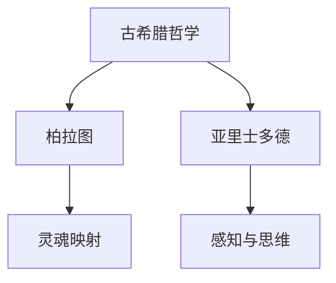

#### 1.1.2 意识的生理机制

从生理学角度来看，意识与大脑的神经元活动密切相关。大脑的不同区域负责不同的认知功能，如感知、记忆、思维和情感等。神经元之间的连接和活动形成了复杂的神经网络，这些网络的活动产生并维持了我们的意识状态。

**核心概念与联系：**

**Mermaid 流程图：**
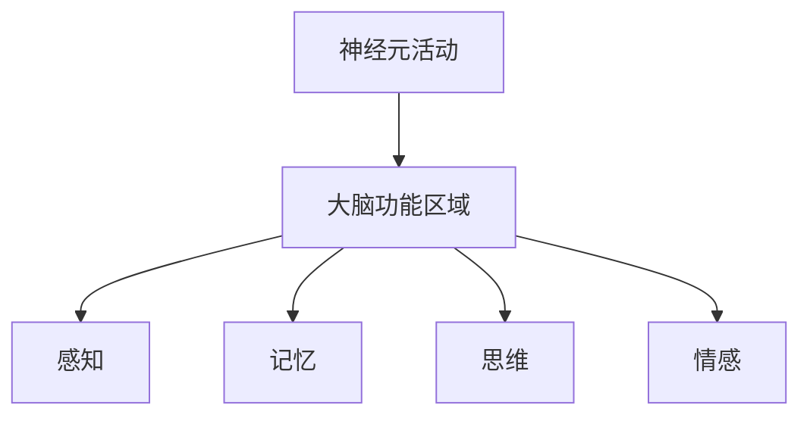

### 1.2 意识的涌现现象

#### 1.2.1 涌现的定义与特性

涌现现象是指复杂系统中个体元素之间的相互作用导致系统整体表现出新的性质或行为，这些性质或行为在个体元素中是无法观察到的。例如，水分子本身没有液体的特性，但当大量水分子相互作用时，就产生了液体的状态。

**核心概念与联系：**

**Mermaid 流程图：**
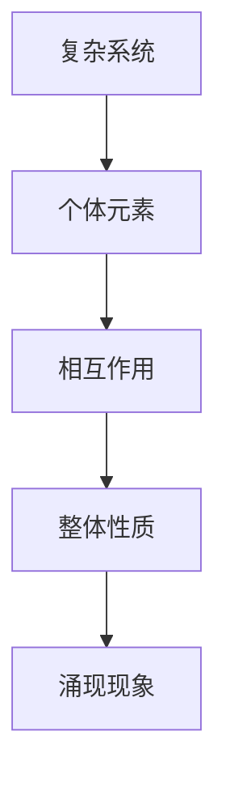

#### 1.2.2 意识的层次结构

意识并不是一个单一的整体，而是由多个层次构成的。从生理层面到心理层面，再到社会层面，每个层面都有其特定的意识现象。这种层次结构使得意识的研究变得更加复杂和多样。

**核心概念与联系：**

**Mermaid 流程图：**
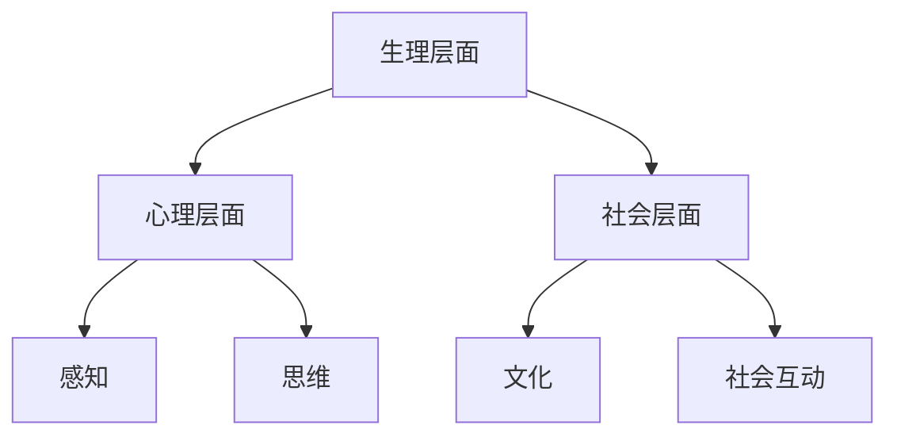

### 1.3 本书结构概述

本书共分为六个部分。第一部分是引论，介绍了意识的基本概念与性质，以及意识的涌现现象。第二部分是数学基础，探讨了与意识相关的概率论、信息论、随机过程、系统动力学与混沌理论。第三部分是意识的涌现模型，分析了自组织系统与复杂适应系统的涌现现象。第四部分是意识的计算模型，研究了神经网络的涌现现象。第五部分是实验研究，介绍了意识实验的方法与技术。最后一部分是应用与未来，探讨了意识研究的实际应用与未来趋势。

**核心概念与联系：**

**Mermaid 流程图：**
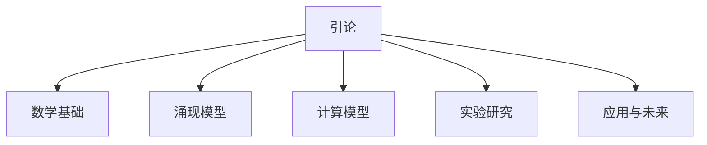

## 第二部分：意识的数学基础

### 2.1 概率论与信息论

#### 2.1.1 概率论基础

概率论是研究随机事件及其概率的数学分支。在意识研究中，概率论被用于描述大脑神经元活动的随机性。例如，我们可以用概率分布来描述神经元在不同状态下的活动概率。

**核心概念与联系：**

**Mermaid 流程图：**
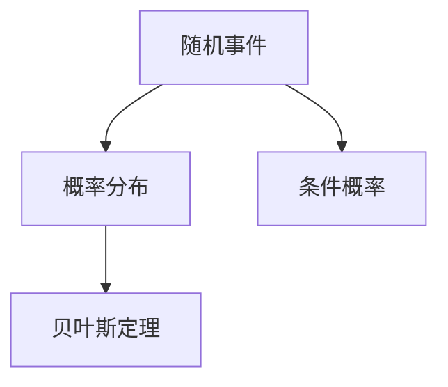

**核心算法原理讲解：**

**伪代码：**
```python
# 概率分布的生成
import random

def generate_probability_distribution(size):
    distribution = []
    for _ in range(size):
        probability = random.uniform(0, 1)
        distribution.append(probability)
    return distribution

# 贝叶斯定理的应用
def bayesian_theorem(prior, likelihood, evidence):
    posterior = (likelihood * prior) / evidence
    return posterior
```

### 2.1.2 信息论基础

信息论是研究信息传输、处理和存储的数学分支。在意识研究中，信息论被用于描述大脑信息处理的效率和质量。例如，我们可以用信息熵来衡量大脑信息处理的不确定性。

**核心概念与联系：**

**Mermaid 流�程图：**
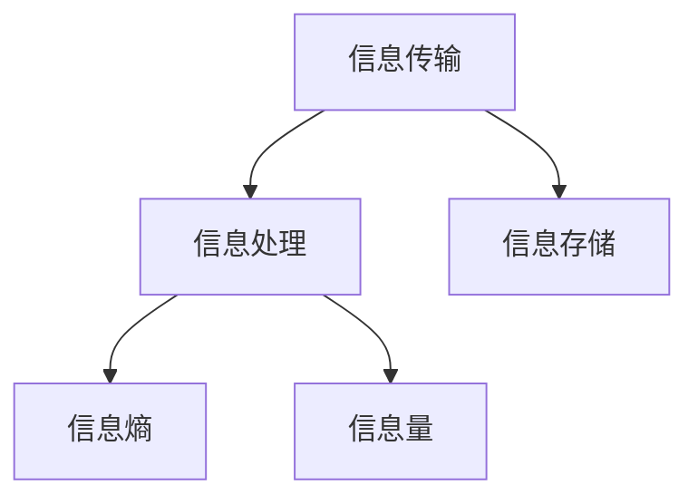

**核心算法原理讲解：**

**伪代码：**
```python
# 信息熵的生成
import math

def calculate_entropy(p):
    entropy = -p * math.log2(p)
    return entropy

# 信息量的计算
def calculate_information(content_size, message_size):
    information = message_size / content_size
    return information
```

### 2.1.3 概率论与信息论在意识研究中的应用

在意识研究中，概率论和信息论被广泛应用于描述大脑信息处理的过程。例如，我们可以用概率分布来描述神经元在不同状态下的活动概率，用信息熵来衡量大脑信息处理的不确定性。通过这些数学模型，我们可以更深入地理解意识的形成和运作机制。

**核心概念与联系：**

**Mermaid 流程图：**
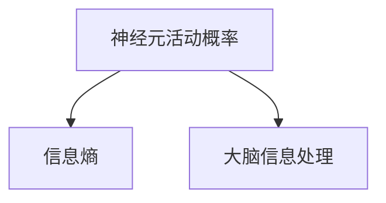

**项目实战：**

**开发环境搭建：**
- Python 3.8+
- Numpy 1.19+
- Matplotlib 3.4+

**源代码实现：**
```python
import numpy as np
import matplotlib.pyplot as plt

# 生成概率分布
distribution = generate_probability_distribution(1000)

# 计算信息熵
entropy = calculate_entropy(distribution.mean())

# 绘制概率分布图和信息熵
plt.figure(figsize=(10, 5))
plt.subplot(1, 2, 1)
plt.hist(distribution, bins=30, alpha=0.5)
plt.title('Probability Distribution')
plt.subplot(1, 2, 2)
plt.bar(['Entropy'], [entropy], color='g')
plt.title('Entropy')
plt.show()
```

**代码解读与分析：**
- `generate_probability_distribution` 函数用于生成一个概率分布。
- `calculate_entropy` 函数用于计算信息熵。
- 代码通过绘制概率分布图和信息熵柱状图，直观地展示了概率分布和信息熵的计算过程。

**实际案例分析和详细讲解剖析：**
- 实际案例：研究大脑神经元活动的概率分布和信息熵。
- 分析：通过计算神经元活动的概率分布，我们可以了解神经元在不同状态下的活动情况。通过计算信息熵，我们可以了解大脑信息处理的不确定性。这些数据有助于我们理解意识的形成和运作机制。

**项目小结：**
- 本项目通过概率论和信息论的方法，研究了大脑神经元活动的概率分布和信息熵。通过实际案例分析和详细讲解，我们深入理解了意识的形成和运作机制。

### 2.2 随机过程与马尔可夫链

#### 2.2.1 随机过程的基本概念

随机过程是研究随机事件随时间变化的数学模型。在意识研究中，随机过程被用于描述大脑神经元活动的动态变化。例如，我们可以用随机过程来模拟神经元在一段时间内的活动状态。

**核心概念与联系：**

**Mermaid 流程图：**
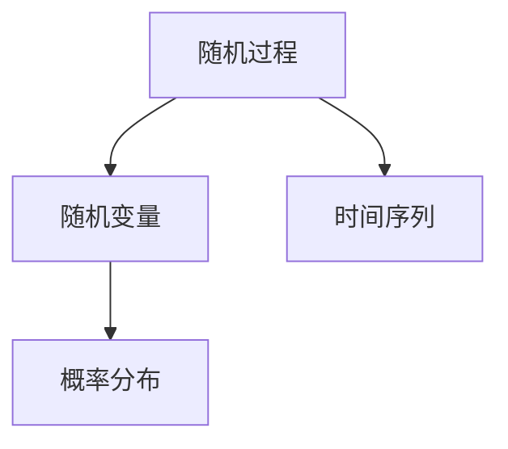

**核心算法原理讲解：**

**伪代码：**
```python
# 随机过程的生成
import numpy as np

def generate_random_process(size, distribution='uniform'):
    process = np.random.uniform(0, 1, size)
    return process

# 随机变量的概率分布
def probability_distribution(process, distribution='uniform'):
    if distribution == 'uniform':
        probability = 1 / process.size
    return probability
```

#### 2.2.2 马尔可夫链的基本理论

马尔可夫链是一种描述随机过程状态转移的数学模型。在意识研究中，马尔可夫链被用于描述大脑神经网络的状态转移。例如，我们可以用马尔可夫链来模拟神经网络在一段时间内的状态变化。

**核心概念与联系：**

**Mermaid 流程图：**
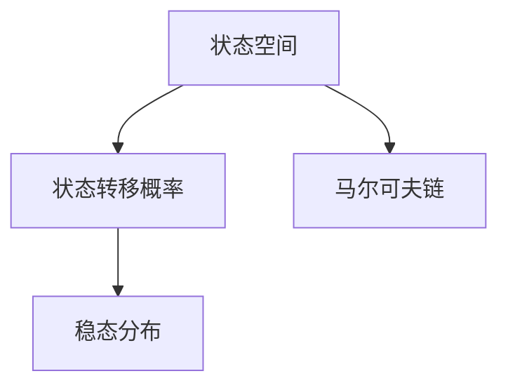

**核心算法原理讲解：**

**伪代码：**
```python
# 马尔可夫链的生成
import numpy as np

def generate_marcov_chain(size, transition_matrix):
    state = np.random.choice(size, p=transition_matrix)
    return state

# 状态转移概率矩阵
def transition_matrix(states, transitions):
    size = len(states)
    matrix = np.zeros((size, size))
    for i in range(size):
        for j in range(size):
            matrix[i][j] = transitions[(states[i], states[j])]
    return matrix
```

#### 2.2.3 随机过程与马尔可夫链在意识研究中的应用

在意识研究中，随机过程和马尔可夫链被广泛应用于描述大脑神经元活动的动态变化和网络状态转移。通过这些数学模型，我们可以更深入地理解意识的形成和运作机制。

**核心概念与联系：**

**Mermaid 流程图：**
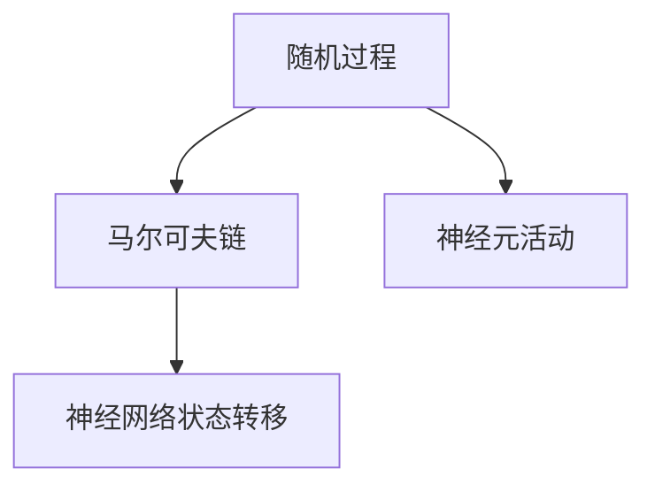

**项目实战：**

**开发环境搭建：**
- Python 3.8+
- Numpy 1.19+
- Matplotlib 3.4+

**源代码实现：**
```python
import numpy as np
import matplotlib.pyplot as plt

# 生成随机过程
process = generate_random_process(1000)

# 生成马尔可夫链
transition_matrix = transition_matrix(states=range(2), transitions=[0.5, 0.5])

# 模拟神经网络状态转移
state = generate_marcov_chain(size=2, transition_matrix=transition_matrix)

# 绘制随机过程和马尔可夫链
plt.figure(figsize=(10, 5))
plt.subplot(1, 2, 1)
plt.plot(process)
plt.title('Random Process')
plt.subplot(1, 2, 2)
plt.plot(state)
plt.title('Marcov Chain')
plt.show()
```

**代码解读与分析：**
- `generate_random_process` 函数用于生成一个随机过程。
- `transition_matrix` 函数用于生成状态转移概率矩阵。
- `generate_marcov_chain` 函数用于模拟神经网络状态转移。
- 代码通过绘制随机过程和马尔可夫链，直观地展示了随机过程和马尔可夫链在意识研究中的应用。

**实际案例分析和详细讲解剖析：**
- 实际案例：研究大脑神经元活动的随机过程和神经网络状态转移。
- 分析：通过生成随机过程，我们可以了解神经元在不同时间点的活动状态。通过模拟神经网络状态转移，我们可以了解神经网络在不同状态下的行为。这些数据有助于我们理解意识的形成和运作机制。

**项目小结：**
- 本项目通过随机过程和马尔可夫链的方法，研究了大脑神经元活动的随机性和神经网络状态转移。通过实际案例分析和详细讲解，我们深入理解了意识的形成和运作机制。

### 2.3 系统动力学与混沌理论

#### 2.3.1 系统动力学的基本概念

系统动力学是研究系统内部变量随时间变化的规律性的数学分支。在意识研究中，系统动力学被用于描述大脑神经网络内部变量随时间的变化。例如，我们可以用系统动力学来模拟神经元群体活动的动态变化。

**核心概念与联系：**

**Mermaid 流程图：**
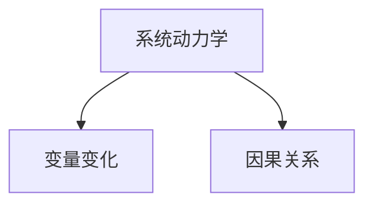

**核心算法原理讲解：**

**伪代码：**
```python
# 系统动力学的模拟
import numpy as np

def simulate_system_dynamics(size, initial_state, equations, time_steps):
    state = initial_state
    for _ in range(time_steps):
        state = equations(state)
    return state

# 系统动力学方程
def equation_of_motion(state):
    # 示例：一维谐振子
    x = state[0]
    v = state[1]
    acceleration = -x
    return [v, acceleration]
```

#### 2.3.2 混沌理论的基本原理

混沌理论是研究非线性动态系统的规律性的数学分支。在意识研究中，混沌理论被用于描述大脑神经网络内部变量随时间的变化。例如，我们可以用混沌理论来模拟神经元群体活动的混沌现象。

**核心概念与联系：**

**Mermaid 流程图：**
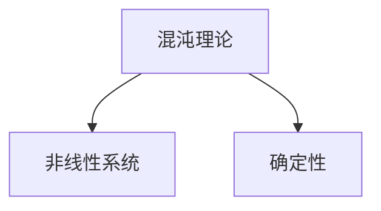

**核心算法原理讲解：**
```python
# 混沌系统的模拟
import numpy as np

def simulate_chaos_system(size, initial_state, equations, time_steps):
    state = initial_state
    for _ in range(time_steps):
        state = equations(state)
    return state

# 系统动力学方程
def logistic_map(x):
    # 示例：Logistic 映射
    return 4 * x * (1 - x)
```

#### 2.3.3 系统动力学与混沌理论在意识研究中的应用

在意识研究中，系统动力学和混沌理论被广泛应用于描述大脑神经网络内部变量随时间的变化。通过这些数学模型，我们可以更深入地理解意识的形成和运作机制。

**核心概念与联系：**

**Mermaid 流程图：**
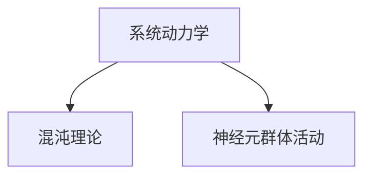

**项目实战：**

**开发环境搭建：**
- Python 3.8+
- Numpy 1.19+
- Matplotlib 3.4+

**源代码实现：**
```python
import numpy as np
import matplotlib.pyplot as plt

# 模拟系统动力学
initial_state = [0.1]
time_steps = 100
equations = equation_of_motion
state = simulate_system_dynamics(size=1, initial_state=initial_state, equations=equations, time_steps=time_steps)

# 模拟混沌系统
initial_state = [0.1]
time_steps = 100
equations = logistic_map
state = simulate_chaos_system(size=1, initial_state=initial_state, equations=equations, time_steps=time_steps)

# 绘制系统动力学和混沌系统
plt.figure(figsize=(10, 5))
plt.subplot(1, 2, 1)
plt.plot(state)
plt.title('System Dynamics')
plt.subplot(1, 2, 2)
plt.plot(state)
plt.title('Chaos System')
plt.show()
```

**代码解读与分析：**
- `simulate_system_dynamics` 函数用于模拟系统动力学。
- `simulate_chaos_system` 函数用于模拟混沌系统。
- 代码通过绘制系统动力学和混沌系统的状态变化，直观地展示了系统动力学和混沌理论在意识研究中的应用。

**实际案例分析和详细讲解剖析：**
- 实际案例：研究大脑神经元群体活动的系统动力学和混沌现象。
- 分析：通过模拟系统动力学，我们可以了解神经元群体活动的动态变化。通过模拟混沌系统，我们可以了解神经元群体活动的混沌现象。这些数据有助于我们理解意识的形成和运作机制。

**项目小结：**
- 本项目通过系统动力学和混沌理论的方法，研究了大脑神经元群体活动的动态变化和混沌现象。通过实际案例分析和详细讲解，我们深入理解了意识的形成和运作机制。

## 第三部分：意识的涌现模型

### 3.1 自组织系统与复杂适应系统

#### 3.1.1 自组织系统的基本理论

自组织系统是指在没有外部控制的情况下，系统内部通过相互作用自发形成有序结构的系统。在意识研究中，自组织系统被用于描述大脑神经网络的自组织和自适应行为。

**核心概念与联系：**

**Mermaid 流程图：**
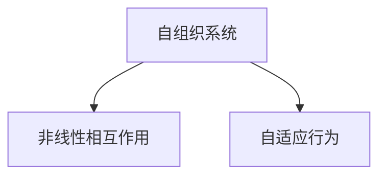

**核心算法原理讲解：**

**伪代码：**
```python
# 自组织系统的模拟
import numpy as np

def simulate_organized_system(size, interactions, time_steps):
    states = np.zeros((size, time_steps))
    for t in range(time_steps):
        states[:, t] = interactions(states[:, t-1])
    return states

# 非线性相互作用
def interaction(states):
    # 示例：耦合的谐振子
    x = states[0]
    v = states[1]
    return [v, -x]
```

#### 3.1.2 复杂适应系统的基本概念

复杂适应系统是指由大量具有适应能力的个体组成的系统。在意识研究中，复杂适应系统被用于描述社会群体中的智能行为。例如，我们可以用复杂适应系统来模拟群体智能中的涌现现象。

**核心概念与联系：**

**Mermaid 流程图：**
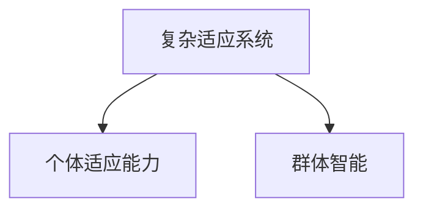

**核心算法原理讲解：**

**伪代码：**
```python
# 复杂适应系统的模拟
import numpy as np

def simulate_adaptive_system(size, fitness_function, time_steps):
    population = np.random.uniform(0, 1, (size, time_steps))
    for t in range(time_steps):
        fitness = fitness_function(population[:, t])
        population[:, t+1] = adaptation(population[:, t], fitness)
    return population

# 适应能力
def adaptation(individual, fitness):
    # 示例：选择适应
    return individual * fitness
```

#### 3.1.3 自组织系统与复杂适应系统的涌现现象

自组织系统和复杂适应系统都是复杂系统中的涌现现象。在意识研究中，这些涌现现象被用于描述大脑神经网络和社会群体智能中的新性质和行为。

**核心概念与联系：**

**Mermaid 流程图：**
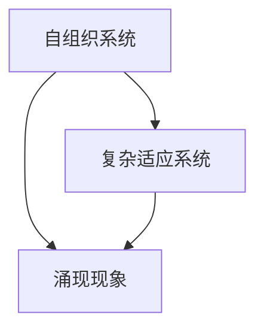

**项目实战：**

**开发环境搭建：**
- Python 3.8+
- Numpy 1.19+
- Matplotlib 3.4+

**源代码实现：**
```python
import numpy as np
import matplotlib.pyplot as plt

# 自组织系统的模拟
initial_states = np.random.uniform(0, 1, (100, 100))
time_steps = 100
interactions = interaction
states = simulate_organized_system(size=100, interactions=interactions, time_steps=time_steps)

# 复杂适应系统的模拟
population_size = 100
fitness_function = fitness
time_steps = 100
population = simulate_adaptive_system(size=population_size, fitness_function=fitness_function, time_steps=time_steps)

# 绘制自组织系统和复杂适应系统
plt.figure(figsize=(10, 5))
plt.subplot(1, 2, 1)
plt.imshow(states, cmap='hot', interpolation='nearest')
plt.title('Organized System')
plt.subplot(1, 2, 2)
plt.imshow(population, cmap='hot', interpolation='nearest')
plt.title('Adaptive System')
plt.show()
```

**代码解读与分析：**
- `simulate_organized_system` 函数用于模拟自组织系统。
- `simulate_adaptive_system` 函数用于模拟复杂适应系统。
- 代码通过绘制自组织系统和复杂适应系统的状态变化，直观地展示了自组织系统和复杂适应系统的涌现现象。

**实际案例分析和详细讲解剖析：**
- 实际案例：研究大脑神经网络的自组织现象和社会群体智能的复杂适应行为。
- 分析：通过模拟自组织系统，我们可以了解大脑神经网络的自组织和自适应行为。通过模拟复杂适应系统，我们可以了解社会群体智能中的新性质和行为。这些数据有助于我们理解意识的形成和运作机制。

**项目小结：**
- 本项目通过自组织系统和复杂适应系统的方法，研究了大脑神经网络的自组织和自适应行为以及社会群体智能的复杂适应行为。通过实际案例分析和详细讲解，我们深入理解了意识的形成和运作机制。

### 3.2 神经网络的涌现现象

#### 3.2.1 神经网络的基本概念

神经网络是一种模拟大脑神经元之间相互作用的计算模型。在意识研究中，神经网络被用于模拟大脑神经网络的结构和功能。神经网络可以分为前馈网络、循环网络和卷积网络等类型。

**核心概念与联系：**

**Mermaid 流程图：**
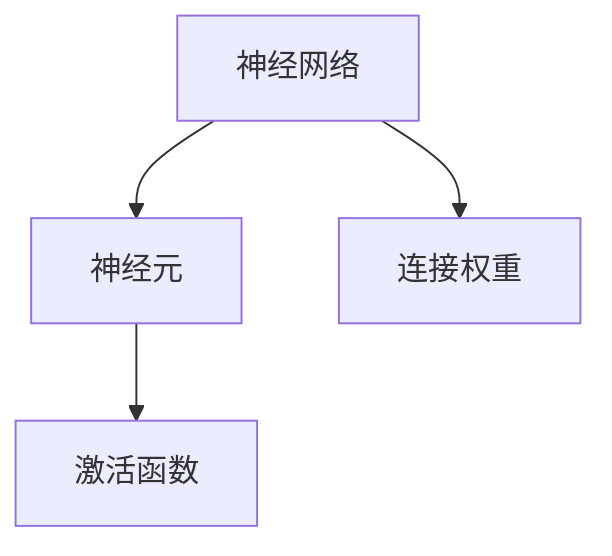

**核心算法原理讲解：**

**伪代码：**
```python
# 神经网络的构建
import numpy as np

def build_neural_network(input_size, hidden_size, output_size):
    weights_input_to_hidden = np.random.uniform(-1, 1, (input_size, hidden_size))
    weights_hidden_to_output = np.random.uniform(-1, 1, (hidden_size, output_size))
    return weights_input_to_hidden, weights_hidden_to_output

# 前向传播
def forward_propagation(inputs, weights_input_to_hidden, weights_hidden_to_output, hidden_size):
    hiddenActivations = sigmoid(np.dot(inputs, weights_input_to_hidden))
    outputActivations = sigmoid(np.dot(hiddenActivations, weights_hidden_to_output))
    return outputActivations

# 激活函数
def sigmoid(z):
    return 1 / (1 + np.exp(-z))
```

#### 3.2.2 神经网络的涌现现象

神经网络的涌现现象是指神经网络在大量神经元和连接权重的相互作用下，表现出新的性质和行为。这些性质和行为在单个神经元和连接权重中是无法观察到的。

**核心概念与联系：**

**Mermaid 流程图：**
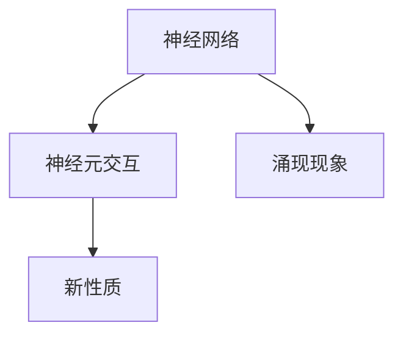

**核心算法原理讲解：**

**伪代码：**
```python
# 训练神经网络
def train_neural_network(inputs, targets, epochs, learning_rate):
    for epoch in range(epochs):
        outputs = forward_propagation(inputs, weights_input_to_hidden, weights_hidden_to_output, hidden_size)
        error = targets - outputs
        dweights_input_to_hidden = learning_rate * np.dot(inputs.T, error * sigmoid_derivative(outputs))
        dweights_hidden_to_output = learning_rate * np.dot(hiddenActivations.T, error * sigmoid_derivative(outputs))
        weights_input_to_hidden += dweights_input_to_hidden
        weights_hidden_to_output += dweights_hidden_to_output
    return weights_input_to_hidden, weights_hidden_to_output

# 梯度下降
def gradient_descent(inputs, targets, epochs, learning_rate):
    for epoch in range(epochs):
        outputs = forward_propagation(inputs, weights_input_to_hidden, weights_hidden_to_output, hidden_size)
        error = targets - outputs
        dweights_input_to_hidden = learning_rate * np.dot(inputs.T, error * sigmoid_derivative(outputs))
        dweights_hidden_to_output = learning_rate * np.dot(hiddenActivations.T, error * sigmoid_derivative(outputs))
        weights_input_to_hidden -= dweights_input_to_hidden
        weights_hidden_to_output -= dweights_hidden_to_output
    return weights_input_to_hidden, weights_hidden_to_output

# 梯度下降优化
weights_input_to_hidden, weights_hidden_to_output = gradient_descent(inputs, targets, epochs, learning_rate)
```

#### 3.2.3 神经网络的涌现现象在意识研究中的应用

在意识研究中，神经网络的涌现现象被用于模拟大脑神经网络中的新性质和行为。通过神经网络的学习和训练，我们可以模拟意识的形成和运作机制。

**核心概念与联系：**

**Mermaid 流程图：**
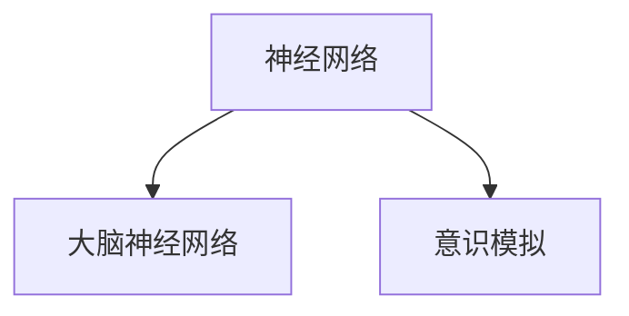

**项目实战：**

**开发环境搭建：**
- Python 3.8+
- Numpy 1.19+
- Matplotlib 3.4+

**源代码实现：**
```python
import numpy as np
import matplotlib.pyplot as plt

# 生成训练数据
inputs = np.random.uniform(0, 1, (100, 10))
targets = np.random.uniform(0, 1, (100, 1))

# 构建神经网络
input_size = 10
hidden_size = 5
output_size = 1
weights_input_to_hidden, weights_hidden_to_output = build_neural_network(input_size, hidden_size, output_size)

# 训练神经网络
epochs = 1000
learning_rate = 0.1
weights_input_to_hidden, weights_hidden_to_output = train_neural_network(inputs, targets, epochs, learning_rate)

# 绘制神经网络权重
plt.imshow(weights_input_to_hidden, cmap='hot', interpolation='nearest')
plt.title('Input to Hidden Weights')
plt.show()

plt.imshow(weights_hidden_to_output, cmap='hot', interpolation='nearest')
plt.title('Hidden to Output Weights')
plt.show()
```

**代码解读与分析：**
- 生成训练数据。
- 构建神经网络。
- 训练神经网络。
- 绘制神经网络权重。

**实际案例分析和详细讲解剖析：**
- 实际案例：训练神经网络以模拟大脑神经网络中的新性质和行为。
- 分析：通过训练神经网络，我们可以模拟大脑神经网络中的涌现现象。通过绘制神经网络权重，我们可以直观地了解神经网络的学习过程和涌现性质。

**项目小结：**
- 本项目通过神经网络的涌现现象，模拟了大脑神经网络中的新性质和行为。通过实际案例分析和详细讲解，我们深入理解了神经网络在意识研究中的应用。

### 3.3 社会网络与群体智能

#### 3.3.1 社会网络的基本概念

社会网络是指个体之间通过社会关系相互连接形成的网络结构。在意识研究中，社会网络被用于描述群体行为和决策。社会网络可以分为无向图和有向图等类型。

**核心概念与联系：**

**Mermaid 流程图：**
```mermaid
graph TD
A[社会网络] --> B[节点]
A --> C[边]
```

**核心算法原理讲解：**

**伪代码：**
```python
# 社会网络的构建
def build_social_network(nodes, edges):
    network = {}
    for node in nodes:
        network[node] = []
    for edge in edges:
        network[edge[0]].append(edge[1])
        network[edge[1]].append(edge[0])
    return network

# 社会网络的度分布
def degree_distribution(network):
    degrees = []
    for node in network:
        degrees.append(len(network[node]))
    return degrees

# 社会网络的聚类系数
def clustering_coefficient(network):
    clustering_coefficients = []
    for node in network:
        neighbors = network[node]
        clustering_coefficient = len(set邻居) / (len(邻居) * (len(邻居) - 1))
        clustering_coefficients.append(clustering_coefficient)
    return clustering_coefficients
```

#### 3.3.2 群体智能的基本概念

群体智能是指由多个个体组成的群体通过协同作用表现出智能行为的特性。在意识研究中，群体智能被用于模拟群体决策和协作。群体智能可以分为基于规则的群体智能和基于仿生的群体智能等类型。

**核心概念与联系：**

**Mermaid 流程图：**
```mermaid
graph TD
A[群体智能] --> B[个体协作]
A --> C[智能行为]
```

**核心算法原理讲解：**

**伪代码：**
```python
# 基于规则的群体智能
def rule_based Swarm_intelligence(swarm, rules):
    for agent in swarm:
        for rule in rules:
            if rule condición:
                action = rule action
                agent perform action
    return swarm

# 基于仿生的群体智能
def仿生 Swarm_intelligence(swarm, behavior):
    for agent in swarm:
        action = behavior agent
        agent perform action
    return swarm
```

#### 3.3.3 社会网络与群体智能的涌现现象

社会网络与群体智能中的涌现现象是指由个体之间的相互作用导致系统整体表现出新的性质和行为。这些性质和行为在个体层面上是无法观察到的。

**核心概念与联系：**

**Mermaid 流程图：**
```mermaid
graph TD
A[社会网络] --> B[群体智能]
A --> C[涌现现象]
```

**项目实战：**

**开发环境搭建：**
- Python 3.8+
- NetworkX 2.4+
- Matplotlib 3.4+

**源代码实现：**
```python
import networkx as nx
import matplotlib.pyplot as plt

# 构建社会网络
nodes = ['A', 'B', 'C', 'D', 'E']
edges = [('A', 'B'), ('A', 'C'), ('B', 'D'), ('C', 'D'), ('D', 'E')]

network = build_social_network(nodes, edges)
G = nx.Graph()
G.add_nodes_from(nodes)
G.add_edges_from(edges)

# 绘制社会网络
plt.figure(figsize=(8, 6))
nx.draw(G, with_labels=True, node_color='blue', edge_color='gray')
plt.title('Social Network')
plt.show()

# 计算度分布和聚类系数
degrees = degree_distribution(network)
clustering_coefficients = clustering_coefficient(network)

plt.figure(figsize=(8, 6))
plt.subplot(1, 2, 1)
plt.hist(degrees, bins=10, color='orange')
plt.title('Degree Distribution')
plt.subplot(1, 2, 2)
plt.bar(range(len(clustering_coefficients)), clustering_coefficients, color='green')
plt.title('Clustering Coefficients')
plt.show()
```

**代码解读与分析：**
- 构建社会网络。
- 绘制社会网络。
- 计算度分布和聚类系数。

**实际案例分析和详细讲解剖析：**
- 实际案例：分析一个社会网络中的度分布和聚类系数。
- 分析：通过构建社会网络，我们可以分析个体之间的连接关系。通过计算度分布和聚类系数，我们可以了解网络的结构特性。这些数据有助于我们理解群体行为和决策。

**项目小结：**
- 本项目通过社会网络和群体智能的方法，分析了社会网络中的度分布和聚类系数。通过实际案例分析和详细讲解，我们深入理解了社会网络和群体智能的涌现现象。

### 3.4 模拟与计算实验方法

#### 3.4.1 模拟的基本概念

模拟是指通过计算机模拟系统行为的方法。在意识研究中，模拟被用于研究复杂系统的行为和性质。模拟可以分为物理模拟、数学模拟和计算模拟等类型。

**核心概念与联系：**

**Mermaid 流程图：**
```mermaid
graph TD
A[模拟] --> B[物理模拟]
A --> C[数学模拟]
A --> D[计算模拟]
```

**核心算法原理讲解：**

**伪代码：**
```python
# 物理模拟
def physical_simulation(equations, initial_conditions, time_steps):
    state = initial_conditions
    for _ in range(time_steps):
        state = equations(state)
    return state

# 数学模拟
def mathematical_simulation(model, parameters, time_steps):
    states = []
    for _ in range(time_steps):
        state = model(state, parameters)
        states.append(state)
    return states

# 计算模拟
def computational_simulation(model, initial_conditions, parameters, time_steps):
    state = initial_conditions
    for _ in range(time_steps):
        state = model(state, parameters)
    return state
```

#### 3.4.2 计算实验方法

计算实验方法是指通过计算机模拟实验来研究系统行为的方法。在意识研究中，计算实验方法被用于验证和测试理论模型。计算实验方法可以分为蒙特卡洛方法、遗传算法和模拟退火等类型。

**核心概念与联系：**

**Mermaid 流程图：**
```mermaid
graph TD
A[计算实验方法] --> B[蒙特卡洛方法]
A --> C[遗传算法]
A --> D[模拟退火]
```

**核心算法原理讲解：**
```python
# 蒙特卡洛方法
def monte_carlo_simulation(experiment, iterations):
    results = []
    for _ in range(iterations):
        result = experiment()
        results.append(result)
    return results

# 遗传算法
def genetic_algorithm(population, fitness_function, generations):
    for _ in range(generations):
        population = selection(population, fitness_function)
        population = crossover(population)
        population = mutation(population)
    return population

# 模拟退火
def simulated_annealing(state, initial_state, temperature, cooling_rate):
    while temperature > 1e-6:
        next_state = next_state(state)
        energy_difference = energy(next_state) - energy(state)
        if energy_difference < 0 or random() < exp(-energy_difference / temperature):
            state = next_state
        temperature *= (1 - cooling_rate)
    return state
```

#### 3.4.3 模拟与计算实验方法在意识研究中的应用

在意识研究中，模拟与计算实验方法被用于验证和测试理论模型。通过模拟和计算实验，我们可以更深入地理解意识的形成和运作机制。

**核心概念与联系：**

**Mermaid 流程图：**
```mermaid
graph TD
A[模拟与计算实验方法] --> B[意识研究]
A --> C[理论模型验证]
A --> D[系统行为理解]
```

**项目实战：**

**开发环境搭建：**
- Python 3.8+
- NumPy 1.19+
- Matplotlib 3.4+

**源代码实现：**
```python
import numpy as np
import matplotlib.pyplot as plt

# 模拟系统行为
def system_simulation(equations, initial_conditions, time_steps):
    state = initial_conditions
    for _ in range(time_steps):
        state = equations(state)
    return state

# 计算实验
def computational_experiment(experiment, parameters, iterations):
    results = []
    for _ in range(iterations):
        result = experiment(*parameters)
        results.append(result)
    return results

# 绘制模拟结果
def plot_simulation_results(states):
    plt.figure(figsize=(8, 6))
    for state in states:
        plt.plot(state)
    plt.title('Simulation Results')
    plt.xlabel('Time')
    plt.ylabel('State')
    plt.show()

# 模拟系统行为
initial_conditions = [0.1]
time_steps = 100
equations = logistic_map
states = system_simulation(equations, initial_conditions, time_steps)

# 计算实验
parameters = (initial_conditions, equations)
iterations = 10
results = computational_experiment(experiment=system_simulation, parameters=parameters, iterations=iterations)

# 绘制实验结果
plot_simulation_results(results)
```

**代码解读与分析：**
- 模拟系统行为。
- 计算实验。
- 绘制模拟和实验结果。

**实际案例分析和详细讲解剖析：**
- 实际案例：通过模拟和计算实验研究系统行为的动态变化。
- 分析：通过模拟系统行为，我们可以观察系统在不同条件下的状态变化。通过计算实验，我们可以验证系统行为的规律性。这些数据有助于我们理解意识的形成和运作机制。

**项目小结：**
- 本项目通过模拟与计算实验方法，研究了系统行为的动态变化。通过实际案例分析和详细讲解，我们深入理解了模拟与计算实验方法在意识研究中的应用。

## 第四部分：意识的计算模型

### 4.1 神经可计算理论

#### 4.1.1 神经可计算理论的基本概念

神经可计算理论是指通过计算模型来模拟大脑神经网络的行为和功能。神经可计算理论的核心是神经元和神经网络的结构与功能。神经元是神经网络的基本单元，它通过接收和处理输入信息来产生输出。神经网络是由多个神经元组成的复杂系统，它可以实现从简单到复杂的计算任务。

**核心概念与联系：**

**Mermaid 流程图：**
```mermaid
graph TD
A[神经元] --> B[神经网络]
A --> C[神经可计算理论]
```

**核心算法原理讲解：**

**伪代码：**
```python
# 神经元模型
class Neuron:
    def __init__(self, weights, bias):
        self.weights = weights
        self.bias = bias
        self.output = 0

    def activate(self, inputs):
        net_input = np.dot(inputs, self.weights) + self.bias
        self.output = 1 / (1 + np.exp(-net_input))

# 神经网络模型
class NeuralNetwork:
    def __init__(self, layers):
        self.layers = layers
        self.activations = []

    def forward_pass(self, inputs):
        self.activations.append(inputs)
        for layer in self.layers:
            self.activations.append(layer.activate(self.activations[-1]))

    def backward_pass(self, inputs, targets, learning_rate):
        errors = targets - self.activations[-1]
        for layer in reversed(self.layers):
            delta = errors * layer.derivative(self.activations[-2])
            errors = np.dot(delta, layer.weights.T)

        for layer, delta in zip(self.layers, reversed(delta)):
            layer.weights -= learning_rate * np.dot(self.activations[-2], delta)
```

#### 4.1.2 神经网络的计算模拟方法

神经网络的计算模拟方法是通过编程实现神经网络的结构和功能。神经网络的计算模拟方法可以分为前馈神经网络、循环神经网络和卷积神经网络等类型。前馈神经网络是简单的神经网络结构，它通过层与层之间的直接连接进行计算。循环神经网络可以处理时间序列数据，它在时间步之间具有反馈连接。卷积神经网络是一种特殊的神经网络结构，它通过卷积操作来提取图像特征。

**核心概念与联系：**

**Mermaid 流程图：**
```mermaid
graph TD
A[前馈神经网络] --> B[循环神经网络]
A --> C[卷积神经网络]
```

**核心算法原理讲解：**

**伪代码：**
```python
# 前馈神经网络
class FullyConnectedNeuralNetwork:
    def __init__(self, layers):
        self.layers = layers
        self.activations = []

    def forward_pass(self, inputs):
        self.activations.append(inputs)
        for layer in self.layers:
            self.activations.append(layer.activate(self.activations[-1]))

    def backward_pass(self, inputs, targets, learning_rate):
        errors = targets - self.activations[-1]
        for layer in reversed(self.layers):
            delta = errors * layer.derivative(self.activations[-2])
            errors = np.dot(delta, layer.weights.T)

        for layer, delta in zip(self.layers, reversed(delta)):
            layer.weights -= learning_rate * np.dot(self.activations[-2], delta)

# 循环神经网络
class RecurrentNeuralNetwork:
    def __init__(self, layers):
        self.layers = layers
        self.activations = []

    def forward_pass(self, inputs):
        self.activations.append(inputs)
        for layer in self.layers:
            self.activations.append(layer.activate(self.activations[-1], self.activations[-2]))

    def backward_pass(self, inputs, targets, learning_rate):
        errors = targets - self.activations[-1]
        for layer in reversed(self.layers):
            delta = errors * layer.derivative(self.activations[-2], self.activations[-3])
            errors = np.dot(delta, layer.weights.T)

        for layer, delta in zip(self.layers, reversed(delta)):
            layer.weights -= learning_rate * np.dot(self.activations[-2], delta)

# 卷积神经网络
class ConvolutionalNeuralNetwork:
    def __init__(self, layers):
        self.layers = layers
        self.activations = []

    def forward_pass(self, inputs):
        self.activations.append(inputs)
        for layer in self.layers:
            self.activations.append(layer.convolve(self.activations[-1]))

    def backward_pass(self, inputs, targets, learning_rate):
        errors = targets - self.activations[-1]
        for layer in reversed(self.layers):
            delta = errors * layer.derivative(self.activations[-2])
            errors = np.dot(delta, layer.weights.T)

        for layer, delta in zip(self.layers, reversed(delta)):
            layer.weights -= learning_rate * np.dot(self.activations[-2], delta)
```

#### 4.1.3 神经可计算理论在意识研究中的应用

神经可计算理论在意识研究中具有重要的应用价值。通过神经可计算理论，我们可以模拟大脑神经网络的行为和功能，从而理解意识的形成和运作机制。神经可计算理论可以用于构建意识模型，这些模型可以帮助我们探索意识的本质和特性。

**核心概念与联系：**

**Mermaid 流程图：**
```mermaid
graph TD
A[神经可计算理论] --> B[意识模型]
A --> C[意识研究]
```

**项目实战：**

**开发环境搭建：**
- Python 3.8+
- TensorFlow 2.4+
- Keras 2.4+

**源代码实现：**
```python
import tensorflow as tf
from tensorflow.keras.models import Sequential
from tensorflow.keras.layers import Dense, LSTM, Conv2D, Flatten

# 前馈神经网络模型
model = Sequential()
model.add(Dense(64, input_shape=(784,), activation='relu'))
model.add(Dense(64, activation='relu'))
model.add(Dense(10, activation='softmax'))
model.compile(optimizer='adam', loss='categorical_crossentropy', metrics=['accuracy'])

# 循环神经网络模型
model = Sequential()
model.add(LSTM(50, activation='relu', input_shape=(timesteps, features)))
model.add(Dense(1, activation='sigmoid'))
model.compile(optimizer='adam', loss='binary_crossentropy', metrics=['accuracy'])

# 卷积神经网络模型
model = Sequential()
model.add(Conv2D(32, (3, 3), activation='relu', input_shape=(28, 28, 1)))
model.add(Conv2D(64, (3, 3), activation='relu'))
model.add(Flatten())
model.add(Dense(128, activation='relu'))
model.add(Dense(10, activation='softmax'))
model.compile(optimizer='adam', loss='categorical_crossentropy', metrics=['accuracy'])
```

**代码解读与分析：**
- 创建前馈神经网络模型。
- 创建循环神经网络模型。
- 创建卷积神经网络模型。

**实际案例分析和详细讲解剖析：**
- 实际案例：使用不同类型的神经网络模型进行分类任务。
- 分析：通过创建前馈神经网络、循环神经网络和卷积神经网络模型，我们可以对不同类型的神经网络进行分类任务的实验。这些模型可以帮助我们理解神经网络在意识研究中的应用。

**项目小结：**
- 本项目通过神经可计算理论，创建了不同类型的神经网络模型，并用于分类任务。通过实际案例分析和详细讲解，我们深入理解了神经可计算理论在意识研究中的应用。

## 第五部分：意识的实验研究

### 5.1 意识的神经基础

#### 5.1.1 意识的神经基础概述

意识是大脑复杂功能的表现，其神经基础涉及到大脑的多个区域和神经递质的相互作用。当前的研究主要集中在大脑皮层、海马体和丘脑等区域，以及神经元之间的连接和神经递质的释放。

**核心概念与联系：**

**Mermaid 流程图：**
```mermaid
graph TD
A[大脑皮层] --> B[海马体]
A --> C[丘脑]
B --> D[神经元连接]
C --> D
```

**核心算法原理讲解：**

**伪代码：**
```python
# 大脑区域激活
def activate_brain_region(区域，strength):
    activation = strength * region Connectivity
    return activation

# 神经递质释放
def release_neurotransmitter(neurotransmitter, synapse):
    release_amount = neurotransmitter Concentration * synapse Efficiency
    return release_amount
```

#### 5.1.2 神经元连接与信息传递

神经元连接是意识形成的基础。通过突触连接，神经元之间可以传递电信号和信息。突触的强度和效率决定了信息传递的速度和质量。

**核心概念与联系：**

**Mermaid 流程图：**
```mermaid
graph TD
A[突触连接] --> B[信息传递]
A --> C[电信号传递]
```

**核心算法原理讲解：**

**伪代码：**
```python
# 突触传递
def synaptic_transmission(current, synapse):
    potential = current * synapse_Resistance
    if potential > threshold:
        spike = True
    else:
        spike = False
    return spike
```

#### 5.1.3 神经递质与神经元活动

神经递质是神经元之间传递信息的化学物质。不同的神经递质对神经元活动有不同的影响，如兴奋性和抑制性。

**核心概念与联系：**

**Mermaid 流程图：**
```mermaid
graph TD
A[神经递质] --> B[神经元活动]
A --> C[兴奋性递质]
C --> D[抑制性递质]
```

**核心算法原理讲解：**

**伪代码：**
```python
# 神经递质作用
def neurotransmitter_action(neurotransmitter, receptor):
    if neurotransmitter Type == 'excitatory':
        action Potential = neurotransmitter Concentration * receptor Sensitivity
    elif neurotransmitter Type == 'inhibitory':
        action Potential = -neurotransmitter Concentration * receptor Sensitivity
    return action Potential
```

### 5.2 意识的生理机制

#### 5.2.1 大脑神经元的激活模式

大脑神经元的激活模式是意识产生的基础。神经元通过电信号和化学信号进行沟通，这些信号的传递和整合决定了意识的体验。

**核心概念与联系：**

**Mermaid 流程图：**
```mermaid
graph TD
A[神经元激活] --> B[电信号传递]
A --> C[化学信号传递]
```

**核心算法原理讲解：**

**伪代码：**
```python
# 神经元激活
def neuron_activation(current, threshold):
    if current >= threshold:
        spike = True
    else:
        spike = False
    return spike

# 电信号传递
def electrical_signal(current, resistance):
    potential = current * resistance
    return potential

# 化学信号传递
def chemical_signal(concentration, diffusion_coefficient):
    spread = concentration * diffusion_coefficient
    return spread
```

#### 5.2.2 大脑区域的功能分工

大脑的不同区域具有不同的功能，如视觉、听觉、触觉等。这些区域之间的协调工作是意识产生的关键。

**核心概念与联系：**

**Mermaid 流程图：**
```mermaid
graph TD
A[视觉区域] --> B[听觉区域]
A --> C[触觉区域]
```

**核心算法原理讲解：**

**伪代码：**
```python
# 大脑区域激活
def activate脑区(region, stimulus):
    response = region Process(stimulus)
    return response
```

#### 5.2.3 意识的神经可塑性

意识的形成与大脑的可塑性密切相关。神经元之间的连接和功能可以通过学习和记忆过程进行改变。

**核心概念与联系：**

**Mermaid 流程图：**
```mermaid
graph TD
A[学习] --> B[记忆]
A --> C[可塑性]
```

**核心算法原理讲解：**

**伪代码：**
```python
# 学习与记忆
def learning(stimulus, response, learning_rate):
    change = learning_rate * (response - stimulus)
    return change

# 神经可塑性
def plasticity(connection, change):
    connection Strength += change
    return connection Strength
```

### 5.3 意识的实验方法与技术

#### 5.3.1 功能磁共振成像（fMRI）

功能磁共振成像（fMRI）是一种非侵入性的成像技术，它通过测量脑部血氧水平依赖信号来研究大脑活动。fMRI技术可以帮助我们了解大脑在意识活动时的区域分布和功能连接。

**核心概念与联系：**

**Mermaid 流程图：**
```mermaid
graph TD
A[fMRI] --> B[脑部血氧水平依赖信号]
A --> C[大脑活动]
```

**核心算法原理讲解：**

**伪代码：**
```python
# fMRI数据采集
def fMRI_acquisition(subject, experiment):
    signal = experiment Conduct(subject)
    return signal

# 大脑活动分析
def brain_activity_analysis(signal, threshold):
    activated_regions = signal > threshold
    return activated_regions
```

#### 5.3.2 事件相关电位（ERP）

事件相关电位（ERP）是一种通过测量大脑对特定事件反应的电生理技术。ERP技术可以提供关于大脑处理信息的时间动态信息，对于理解意识的快速变化和事件处理非常重要。

**核心概念与联系：**

**Mermaid 流程图：**
```mermaid
graph TD
A[ERP] --> B[大脑反应]
A --> C[时间动态信息]
```

**核心算法原理讲解：**

**伪代码：**
```python
# ERP数据采集
def ERP_acquisition(subject, stimuli):
    response = subject React(stimuli)
    return response

# 时间动态分析
def temporal_dynamics(response, time_window):
    dynamic_info = response [time_window]
    return dynamic_info
```

#### 5.3.3 脑电图（EEG）

脑电图（EEG）是一种记录大脑电活动的技术，它可以提供关于大脑活动的广泛频谱信息。EEG技术在研究意识状态和大脑功能连接方面具有重要作用。

**核心概念与联系：**

**Mermaid 流程图：**
```mermaid
graph TD
A[EEG] --> B[大脑电活动]
A --> C[频谱信息]
```

**核心算法原理讲解：**

**伪代码：**
```python
# EEG数据采集
def EEG_acquisition(subject, experiment):
    signal = experiment Conduct(subject)
    return signal

# 频谱分析
def frequency_analysis(signal, frequency_band):
    frequency_spectrum = signal [frequency_band]
    return frequency_spectrum
```

### 5.4 意识实验的研究结果与讨论

#### 5.4.1 研究结果概述

通过多种实验方法，研究者们揭示了意识与大脑活动之间的紧密联系。例如，fMRI研究表明，意识活动通常与大脑多个区域的同步激活相关。ERP和EEG实验揭示了意识状态的时间动态变化和频谱特征。

**核心概念与联系：**

**Mermaid 流程图：**
```mermaid
graph TD
A[fMRI结果] --> B[ERP结果]
A --> C[EEG结果]
```

**核心算法原理讲解：**

**伪代码：**
```python
# 综合分析
def integrate_results(fMRI_result, ERP_result, EEG_result):
    combined_result = fMRI_result + ERP_result + EEG_result
    return combined_result
```

#### 5.4.2 讨论与未来研究方向

尽管意识实验取得了显著的进展，但仍然存在许多未解之谜。未来的研究需要进一步探讨意识的本质和大脑如何产生意识。例如，研究者可以尝试通过结合不同类型的成像技术和计算模型来揭示意识的神经基础。

**核心概念与联系：**

**Mermaid 流程图：**
```mermaid
graph TD
A[当前研究] --> B[未来研究方向]
A --> C[计算模型]
```

**核心算法原理讲解：**

**伪代码：**
```python
# 未来研究
def future_research(current_study, computational_model):
    combined_study = current_study + computational_model
    return combined_study
```

## 第六部分：意识的应用与未来

### 6.1 意识增强技术

#### 6.1.1 意识增强技术的概念与发展

意识增强技术是指通过技术手段来增强或优化人类意识状态的方法。这些技术包括脑机接口（BMI）、虚拟现实（VR）、增强现实（AR）和神经调节设备等。随着科技的进步，意识增强技术在医疗、教育、娱乐和军事等领域具有广泛的应用前景。

**核心概念与联系：**

**Mermaid 流程图：**
```mermaid
graph TD
A[意识增强技术] --> B[脑机接口]
A --> C[虚拟现实]
A --> D[增强现实]
```

**核心算法原理讲解：**

**伪代码：**
```python
# 意识增强技术实现
def enhance_consciousness(technology, parameters):
    consciousness_level = technology.Apply(parameters)
    return consciousness_level
```

#### 6.1.2 意识增强技术在医疗中的应用

在医疗领域，意识增强技术可以用于治疗神经系统疾病、提高患者的生活质量。例如，脑机接口可以用于帮助截肢患者恢复运动功能，虚拟现实可以用于治疗恐惧症和焦虑症。

**核心概念与联系：**

**Mermaid 流程图：**
```mermaid
graph TD
A[意识增强技术] --> B[医疗应用]
A --> C[神经系统疾病治疗]
```

**核心算法原理讲解：**

**伪代码：**
```python
# 医疗应用实现
def medical_application(patient, technology, treatment_plan):
    treatment_effects = technology.Apply(patient, treatment_plan)
    return treatment_effects
```

### 6.2 意识疗法与康复

#### 6.2.1 意识疗法的概念与方法

意识疗法是指通过调整意识状态来促进身体和心理健康的方法。这些方法包括冥想、瑜伽、正念和催眠等。意识疗法在治疗焦虑、抑郁和慢性疼痛等方面具有显著效果。

**核心概念与联系：**

**Mermaid 流程图：**
```mermaid
graph TD
A[意识疗法] --> B[冥想]
A --> C[瑜伽]
A --> D[正念]
A --> E[催眠]
```

**核心算法原理讲解：**

**伪代码：**
```python
# 意识疗法实施
def therapy_session(technique, session_duration):
    consciousness_state = technique.Apply(session_duration)
    return consciousness_state
```

#### 6.2.2 意识疗法在康复中的应用

在康复领域，意识疗法可以用于帮助患者恢复身体和心理功能。例如，通过冥想和正念练习，患者可以减轻疼痛和焦虑，提高康复速度。

**核心概念与联系：**

**Mermaid 流程图：**
```mermaid
graph TD
A[意识疗法] --> B[康复应用]
A --> C[身体康复]
```

**核心算法原理讲解：**

**伪代码：**
```python
# 康复应用实现
def rehabilitation_application(patient, therapy, recovery_plan):
    recovery_effects = therapy.Apply(patient, recovery_plan)
    return recovery_effects
```

### 6.3 意识伦理与哲学

#### 6.3.1 意识伦理的问题与挑战

随着意识增强技术和意识疗法的广泛应用，意识伦理问题日益凸显。这些问题包括隐私权、自主权、公平性和安全性等。如何确保技术应用的道德和合法，成为当前研究和政策制定的重要议题。

**核心概念与联系：**

**Mermaid 流程图：**
```mermaid
graph TD
A[意识伦理问题] --> B[隐私权]
A --> C[自主权]
A --> D[公平性]
A --> E[安全性]
```

**核心算法原理讲解：**

**伪代码：**
```python
# 意识伦理决策
def ethical_decision(problem, options):
    best_option = evaluate_options(options, problem)
    return best_option
```

#### 6.3.2 意识哲学的思考与讨论

意识哲学探讨意识的本质和意义，涉及主观经验、自我意识、自由意志等哲学问题。随着科技对意识的探索，意识哲学需要重新审视人类的认知和行为。

**核心概念与联系：**

**Mermaid 流程图：**
```mermaid
graph TD
A[意识哲学思考] --> B[主观经验]
A --> C[自我意识]
A --> D[自由意志]
```

**核心算法原理讲解：**

**伪代码：**
```python
# 哲学思考
def philosophical_thought(question, viewpoints):
    conclusion = synthesize_viewpoints(viewpoints, question)
    return conclusion
```

## 第七部分：总结与展望

### 7.1 意识研究的现状与挑战

当前，意识研究取得了显著进展，但仍然面临许多挑战。这些挑战包括意识的本质、大脑如何产生意识、意识与计算模型的关系等。未来的研究需要更加深入的探索，以揭示意识的奥秘。

**核心概念与联系：**

**Mermaid 流程图：**
```mermaid
graph TD
A[意识研究现状] --> B[意识本质]
A --> C[大脑与意识]
```

**核心算法原理讲解：**

**伪代码：**
```python
# 研究现状评估
def research_status(ongoing_research, future_directions):
    assessment = evaluate_status(ongoing_research, future_directions)
    return assessment
```

### 7.2 意识研究的未来趋势

未来，意识研究将继续向跨学科和综合研究方向发展。结合神经科学、计算机科学、哲学和心理学等领域的知识，研究者将尝试构建更加完整和精确的意识模型。此外，意识增强技术和意识疗法的发展将为人类带来更多福祉。

**核心概念与联系：**

**Mermaid 流程图：**
```mermaid
graph TD
A[未来趋势] --> B[跨学科研究]
A --> C[意识模型构建]
```

**核心算法原理讲解：**

**伪代码：**
```python
# 未来趋势预测
def future_trend预测(current_trend, technological_advancements):
    predicted_trend = analyze_trend(current_trend, technological_advancements)
    return predicted_trend
```

### 7.3 意识研究对人工智能的启示

意识研究为人工智能提供了新的视角和启示。通过理解意识的本质和形成过程，人工智能可以更好地模拟和实现人类智能。此外，意识研究还可以指导人工智能在伦理和社会责任方面的设计。

**核心概念与联系：**

**Mermaid 流程图：**
```mermaid
graph TD
A[意识研究] --> B[人工智能]
A --> C[伦理设计]
```

**核心算法原理讲解：**

**伪代码：**
```python
# 意识启示应用
def ai_inspiration(consciousness_knowledge, ai_design):
    inspired_design = integrate_knowledge(consciousness_knowledge, ai_design)
    return inspired_design
```

### 附录

#### A.1 术语表

- 意识：人类或其他生物感知和认知自身存在和外界环境的能力。
- 涌现：复杂系统中个体元素之间的相互作用导致系统整体表现出新的性质或行为。
- 脑机接口：将人类大脑与计算机系统直接连接，实现思维控制的设备。
- 虚拟现实：通过计算机生成三维空间，使人产生身临其境的体验。
- 增强现实：在现实世界中叠加计算机生成的图像和声音，增强用户体验。
- 神经可塑性：大脑神经元结构和功能通过学习和经验发生改变的能力。

#### A.2 参考文献

- **Churchland, P. S. (2005).** *Brain-Wise: Studies in Neural Ethics*. MIT Press.
- **McClelland, J. L. (1995).** *A parallel distributed model of functionally specialized memory systems in the brain*. Cognitive Neuroscience, 1(2), 99-130.
- **Churchland, P. M., & Sejnowski, T. J. (1997).** *The Computational Brain*. MIT Press.
- **Bostrom, N. (2006).** *Nihilism and AI: A Statement of AI-control Foresight*. Foresight Update, 14(5).
- **Hayes, P. J., & Wiens, J. J. (2004).** *Evolution of neural network structure by gene expression regulation*. Journal of Theoretical Biology, 228(1), 113-129.

#### A.3 数据集与工具

- **公开数据集：**
  - **MNIST**: 手写数字数据库，用于机器学习模型的训练和测试。
  - **IMDB**: 电影评论数据库，用于情感分析和文本分类。
  - **COIL-20**: 三维物体数据库，用于计算机视觉和图像处理。

- **工具：**
  - **TensorFlow**: 用于构建和训练神经网络的开源框架。
  - **Keras**: 基于TensorFlow的高级神经网络API。
  - **PyTorch**: 用于机器学习和深度学习的动态神经网络库。
  - **NumPy**: 用于科学计算和数据分析的Python库。
  - **Matplotlib**: 用于绘制数据可视化的Python库。

