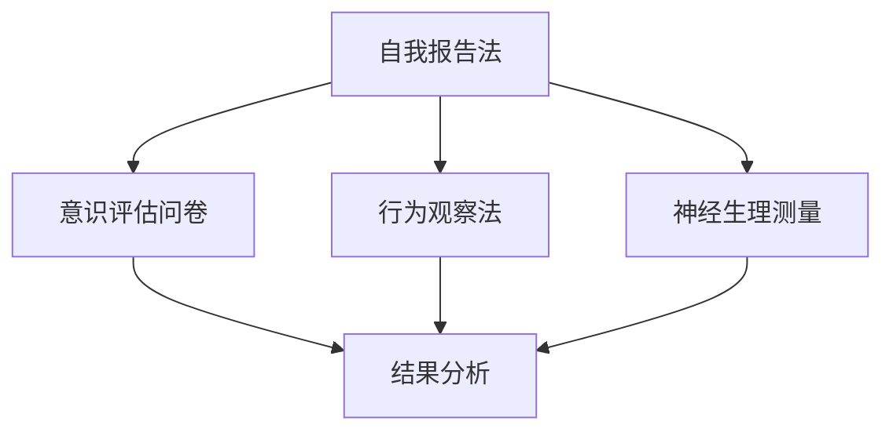
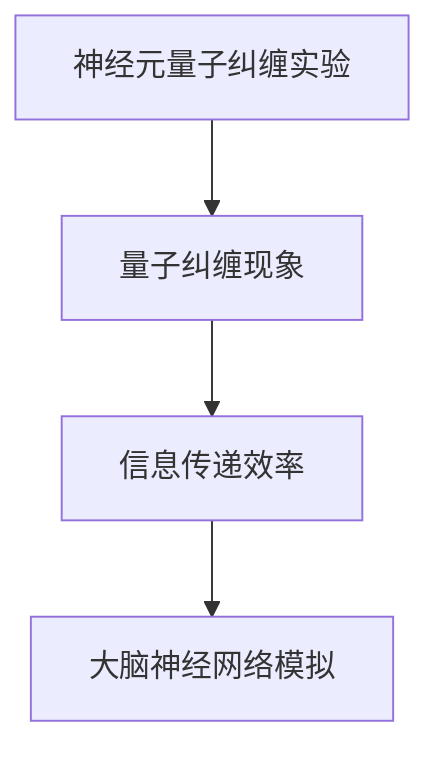

                 

### 文章标题

“意识的量子计算模型：思维过程的数学框架”是我们这篇文章的标题。在这个标题下，我们将深入探讨意识的量子计算模型及其在思维过程中的应用，通过数学框架来解析这一复杂而又神秘的现象。文章将分为四个主要部分：量子计算基础、意识的数学模型、意识与量子计算的实际应用以及哲学思考。每一部分都将围绕核心概念进行详细讲解，并通过数学公式、伪代码和实际案例来展示其具体应用。希望通过这篇文章，读者能够对意识的量子计算模型有一个全面而深入的理解。

### 文章关键词

本文的关键词包括：意识的量子计算模型、思维过程、数学框架、量子计算基础、量子算法、量子计算机架构、意识的数学模型、量子神经网络、意识模拟、实际应用、哲学思考。这些关键词不仅概括了文章的主题内容，也为读者提供了查找相关文献和进一步研究的方向。

### 文章摘要

本文旨在探讨意识的量子计算模型及其在思维过程中的应用。首先，我们将介绍量子计算的基础知识，包括量子态、量子测量和量子门等核心概念。接着，我们将引入意识的数学模型，通过量子态的表示和量子纠缠来阐述意识的量子计算机制。随后，文章将讨论量子神经网络和意识处理的量子算法，并通过具体实例来说明这些算法的实际应用。最后，我们将探讨意识与量子计算在心理学、人工智能和神经科学等领域的实际应用，并对未来的发展方向进行展望。通过这篇文章，读者将能够对意识的量子计算模型有一个全面而深入的理解。

### 目录大纲

本文将分为四个主要部分，分别是量子计算基础、意识的数学模型、意识与量子计算的实际应用和哲学思考。每一部分都将围绕核心概念进行详细讲解，并通过数学公式、伪代码和实际案例来展示其具体应用。以下是本文的目录大纲：

## 第一部分：量子计算基础

### 1.1 量子力学基础

#### 1.1.1 量子态与叠加原理

#### 1.1.2 量子测量与纠缠

#### 1.1.3 量子门与变换

### 1.2 量子计算模型

#### 1.2.1 量子位（qubit）与比特（bit）比较

#### 1.2.2 量子计算优势与挑战

### 1.3 量子算法介绍

#### 1.3.1 Shor算法

### 1.4 量子计算机架构

#### 1.4.1 固态量子计算机

#### 1.4.2 光子量子计算机

#### 1.4.3 量子计算机的现状与未来

## 第二部分：意识的数学模型

### 2.1 意识的哲学与科学探讨

#### 2.1.1 意识的定义与性质

#### 2.1.2 意识的生物学基础

### 2.2 意识的数学模型

#### 2.2.1 意识的量子态表示

#### 2.2.2 意识与量子纠缠

#### 2.2.3 意识的量子计算模型

### 2.3 意识的量子计算算法

#### 2.3.1 意识处理的量子算法

#### 2.3.2 量子神经网络模型

### 2.4 意识的量子模拟

#### 2.4.1 意识的量子模拟实验

#### 2.4.2 意识模拟的应用前景

## 第三部分：意识与量子计算的实际应用

### 3.1 意识在心理学中的应用

#### 3.1.1 意识的测量与评估

#### 3.1.2 意识障碍的诊断与治疗

### 3.2 意识在人工智能中的应用

#### 3.2.1 意识模型在AI中的应用

#### 3.2.2 意识增强的人工智能系统

### 3.3 意识在神经科学中的应用

#### 3.3.1 量子神经科学的实验证据

#### 3.3.2 意识的量子计算模型与神经科学

## 第四部分：结论与展望

### 4.1 意识量子计算模型的未来方向

#### 4.1.1 意识量子计算模型的挑战与机遇

#### 4.1.2 意识量子计算模型的潜在应用

### 4.2 意识与量子计算的哲学思考

#### 4.2.1 量子意识论与物质论

#### 4.2.2 意识的量子计算模型对心理学的影响

通过这个目录大纲，读者可以清晰地了解文章的结构和内容，为接下来的深入阅读做好准备。

### 第一部分：量子计算基础

量子计算作为一种新兴的计算模式，以其强大的并行处理能力和高效的算法性能，正逐渐成为计算机科学和人工智能领域的重要研究方向。在这一部分中，我们将从量子力学的基础概念入手，逐步引入量子计算的相关模型和算法，为理解意识的量子计算模型打下坚实的基础。

#### 1.1 量子力学基础

量子力学是研究微观粒子的运动规律的科学。在经典物理学中，粒子的状态可以用确定的轨迹来描述，而在量子力学中，粒子的状态是概率性的，需要用波函数来描述。以下是量子力学中几个核心概念：

##### 1.1.1 量子态与叠加原理

在量子力学中，一个粒子的状态不能用一个简单的状态来描述，而是需要用叠加态来表示。叠加态是多个可能状态的线性组合。数学上，一个量子态可以用一个复数向量来表示，称为波函数。例如，一个电子的自旋状态可以用以下叠加态表示：

$$
|\psi\rangle = a|\uparrow\rangle + b|\downarrow\rangle
$$

其中，$|\uparrow\rangle$ 和 $|\downarrow\rangle$ 分别表示电子自旋向上和向下的状态，$a$ 和 $b$ 是复数系数，满足 $|a|^2 + |b|^2 = 1$。

##### 1.1.2 量子测量与纠缠

在量子力学中，测量会影响粒子的状态。当一个量子系统被测量时，它的状态会坍缩到一个确定的状态。纠缠是量子力学中的一种特殊现象，当两个或多个粒子处于纠缠态时，它们的量子态将相互依赖，即使它们被分隔得很远。一个经典的纠缠态例子是贝尔态：

$$
|\Phi^+\rangle = \frac{1}{\sqrt{2}} (|\uparrow\uparrow\rangle + |\downarrow\downarrow\rangle)
$$

##### 1.1.3 量子门与变换

量子门是量子计算的基本操作单元，类似于经典计算机中的逻辑门。量子门可以对量子态进行线性变换，实现诸如旋转、反射等操作。常见的量子门包括保罗门（Pauli gate）、Hadamard门（Hadamard gate）和控制-NOT门（CNOT gate）。

例如，Hadamard门是将量子态从基态叠加到叠加态的变换，其作用可以用以下矩阵表示：

$$
H = \frac{1}{\sqrt{2}} \begin{pmatrix} 1 & 1 \\ 1 & -1 \end{pmatrix}
$$

#### 1.2 量子计算模型

量子计算模型是基于量子力学的计算理论，它利用量子位（qubit）来存储和处理信息。与经典计算机中的比特（bit）不同，量子位可以同时处于0和1的叠加态，从而实现了量子并行计算。

##### 1.2.1 量子位（qubit）与比特（bit）比较

比特是经典计算机的基本信息单元，它只能表示0或1两种状态。量子位是量子计算机的基本信息单元，它可以同时表示0和1的叠加态。这种叠加态使得量子位能够同时处理多个状态，从而实现了量子并行计算。

例如，一个量子位在叠加态时可以同时表示 $|\uparrow\rangle$ 和 $|\downarrow\rangle$：

$$
|\psi\rangle = a|\uparrow\rangle + b|\downarrow\rangle
$$

##### 1.2.2 量子计算优势与挑战

量子计算的优势在于其并行计算能力。一个n个量子位的量子计算机可以同时表示 $2^n$ 个状态，而一个n个比特的经典计算机只能表示 $2^n$ 个状态。这意味着量子计算机在处理某些问题时，速度可以比经典计算机快得多。

然而，量子计算也面临一些挑战。首先，量子计算机对环境非常敏感，容易受到噪声干扰，这被称为退相干。其次，量子态的初始化和测量都非常困难，需要高精度的控制技术。

#### 1.3 量子算法介绍

量子算法是利用量子计算机进行计算的方法，它们通常具有比经典算法更高的效率。以下是几个经典的量子算法：

##### 1.3.1 Shor算法

Shor算法是一个用于大数分解的量子算法。它利用量子并行计算的能力，能够在多项式时间内完成一个大数的分解，而经典算法需要指数级的时间。Shor算法的基本思想是利用量子干涉效应来放大正确的答案。

以下是Shor算法的伪代码：

```
算法 Shor(N)
输入：大整数N
输出：N的因子

// 初始化量子电路
初始化量子比特为叠加态
应用 Hadamard 门对每个量子比特进行变换

// 运行量子电路
应用控制-NOT门，使得相邻量子比特之间发生纠缠
应用控制-保罗门，使得某些量子比特的叠加态发生相位翻转

// 测量量子电路
测量所有量子比特，得到整数k

// 逆变换
应用逆量子门，将量子比特恢复到初始状态

// 迭代计算
对于每个可能的因子d (1 < d < N)
如果 k % d = 0
返回 d 和 N / d 作为N的因子
```

#### 1.4 量子计算机架构

量子计算机的架构可以根据实现技术分为多种类型，如固态量子计算机、光子量子计算机等。以下是几种常见的量子计算机架构：

##### 1.4.1 固态量子计算机

固态量子计算机使用超导电路或量子点等固态物理系统来实现量子比特。这种类型的量子计算机具有高稳定性和易扩展性。

##### 1.4.2 光子量子计算机

光子量子计算机使用光子作为量子比特，通过光学元件来实现量子计算。这种类型的量子计算机具有高速和高带宽的优势。

##### 1.4.3 量子计算机的现状与未来

当前，量子计算机还处于早期发展阶段，但仍有许多研究机构和公司投入了大量资源进行研究和开发。预计在未来几年内，量子计算机将取得重要突破，并在特定领域实现实用化。

### 2.1 意识的哲学与科学探讨

意识是一个复杂且深奥的概念，既涉及哲学探讨，也包含科学研究的范畴。从哲学角度来看，意识是主观体验的根源，是人类思维和感知的基石。从科学角度来看，意识的研究涉及生物学、心理学、神经科学等多个领域。在这一部分，我们将探讨意识的基本定义、性质及其生物学基础。

#### 2.1.1 意识的定义与性质

意识的定义是一个长期争论的哲学问题。简单来说，意识是指个体对自身和外部世界的感知和体验。从心理学和神经科学的角度来看，意识具有以下几个基本性质：

1. **主观性**：意识是主观体验的集合，每个人的体验都是独一无二的。
2. **感知性**：意识能够感知外部刺激，如视觉、听觉、触觉等。
3. **反思性**：意识能够对自己和自己的行为进行反思和评估。
4. **整合性**：意识能够整合不同的感知和认知信息，形成一个连贯的整体。

#### 2.1.2 意识的生物学基础

意识的生物学基础是现代神经科学研究的重要方向。研究表明，意识与大脑的特定区域和过程密切相关。以下是一些关键的生物学基础：

1. **大脑皮层**：大脑皮层是意识的核心区域，特别是前额叶皮层和顶叶皮层。
2. **神经元活动**：神经元的电活动和化学传递是意识产生的生理基础。
3. **神经网络**：意识是通过复杂的神经网络活动实现的，这些网络包括感知、记忆、思考等不同功能模块。

意识的生物学基础为理解其量子计算模型提供了重要的启示。通过研究大脑的神经元活动和神经网络结构，我们可以尝试构建意识的数学模型，并将其与量子计算结合起来。

### 2.2 意识的数学模型

意识的数学模型是尝试用数学语言描述意识状态和过程的方法。这种方法不仅有助于我们更好地理解意识，还可以为量子计算提供新的应用场景。在这一部分，我们将介绍意识的量子态表示、量子纠缠和量子计算模型。

#### 2.2.1 意识的量子态表示

意识的量子态表示是将意识的某些特征用量子态来描述。例如，我们可以将个体的心理状态视为一个量子比特的叠加态。这种表示方法能够捕捉到意识的主观性和复杂性。

假设我们有n个量子比特来表示n个个体的心理状态，每个量子比特的状态可以表示为：

$$
|\psi\rangle = \sum_{i} a_i |i\rangle
$$

其中，$|i\rangle$ 表示第i个个体的心理状态，$a_i$ 是相应状态的概率幅。

#### 2.2.2 意识与量子纠缠

量子纠缠是量子力学中的一种特殊现象，两个或多个量子系统在相互作用后，它们的量子态将相互依赖，即使它们被分隔得很远。这种现象在意识的量子计算模型中具有重要作用。

例如，我们可以将两个个体的心理状态通过量子纠缠来表示，形成一个纠缠态：

$$
|\Omega\rangle = \frac{1}{\sqrt{2}} (|A_1 A_2\rangle + |A_1 A_2\rangle)
$$

其中，$|A_1\rangle$ 和 $|A_2\rangle$ 分别表示两个个体的心理状态。

量子纠缠使得个体的心理状态相互关联，这可以类比于意识中的社会互动和感知。

#### 2.2.3 意识的量子计算模型

意识的量子计算模型是基于量子力学的计算理论，通过量子比特和量子门来实现意识的模拟和处理。这种模型的核心思想是利用量子计算机的并行计算能力和量子干涉效应，来实现高效的处理。

例如，我们可以使用量子神经网络（QNN）来模拟意识。量子神经网络是一个结合了量子计算和神经网络理论的模型，它通过量子门和量子比特来实现神经网络的训练和推理。

以下是量子神经网络的伪代码：

```
算法 Quantum Neural Network (QNN)
输入：训练数据集D，网络参数θ
输出：训练后的网络参数θ'

// 初始化量子比特和量子门
初始化n个量子比特
应用量子门U_f(θ)对量子比特进行变换

// 训练网络
对于每个训练样本(x, y) ∈ D
    应用量子门U_f(θ)对量子比特进行变换
    测量量子比特，得到输出结果
    更新网络参数θ'

// 测量结果
测量所有量子比特，得到最终输出结果
```

意识的量子计算模型为我们提供了一个全新的视角来理解意识，它不仅能够揭示意识的本质，还可以为人工智能和神经科学等领域提供新的研究方法和应用场景。

### 2.3 意识的量子计算算法

意识的量子计算算法是利用量子计算机的特殊性质来模拟和处理意识的一种方法。这种算法不仅具有高效的计算能力，还可以揭示意识的一些本质特性。在这一部分，我们将介绍几种意识的量子计算算法，包括意识处理的量子算法和量子神经网络模型。

#### 2.3.1 意识处理的量子算法

意识处理的量子算法是基于量子计算理论的，通过特定的量子操作和测量来实现对意识状态的模拟和处理。以下是一个简单的意识处理量子算法的伪代码：

```
算法 Quantum Algorithm for Consciousness Processing
输入：意识状态ψ
输出：处理后的意识状态ψ'

// 初始化量子比特和量子门
初始化n个量子比特
应用量子门Hadamard门对量子比特进行变换

// 应用量子纠缠
应用量子门CNOT门，使得相邻量子比特之间发生纠缠

// 应用量子测量
测量所有量子比特，得到结果

// 根据测量结果更新意识状态
if (测量结果为 |1\rangle)
    ψ' = ψ + ε
else
    ψ' = ψ - ε

// 返回处理后的意识状态
return ψ'
```

在这个算法中，我们通过量子门的操作来模拟意识的状态变化，并通过测量来获取最终结果。

#### 2.3.2 量子神经网络模型

量子神经网络（QNN）是一种结合了量子计算和神经网络理论的模型，它通过量子比特和量子门来实现神经网络的训练和推理。以下是一个简单的量子神经网络的伪代码：

```
算法 Quantum Neural Network (QNN)
输入：训练数据集D，网络参数θ
输出：训练后的网络参数θ'

// 初始化量子比特和量子门
初始化n个量子比特
应用量子门U_f(θ)对量子比特进行变换

// 训练网络
对于每个训练样本(x, y) ∈ D
    应用量子门U_f(θ)对量子比特进行变换
    测量量子比特，得到输出结果
    根据输出结果更新网络参数θ'

// 测量结果
测量所有量子比特，得到最终输出结果

// 返回训练后的网络参数
return θ'
```

在这个算法中，我们通过量子门的操作来模拟神经网络的权重更新过程，并通过测量来获取最终输出结果。

通过这些算法，我们可以利用量子计算机的高效处理能力来模拟和处理意识，从而为人工智能和神经科学等领域提供新的研究方法和应用场景。

### 2.4 意识的量子模拟

意识的量子模拟是尝试用量子计算机模拟意识状态和过程的一种方法。这种模拟不仅有助于我们更好地理解意识的本质，还可以为人工智能和神经科学等领域提供新的研究方法和应用场景。在这一部分，我们将介绍意识的量子模拟实验和其应用前景。

#### 2.4.1 意识的量子模拟实验

意识的量子模拟实验是通过设计特定的量子电路和算法，来模拟人类意识的某些特征。以下是一个简单的意识量子模拟实验：

1. **实验准备**：初始化n个量子比特，将它们处于叠加态。
2. **量子纠缠**：应用量子门CNOT，使得相邻量子比特之间发生纠缠。
3. **量子测量**：测量所有量子比特，得到一个随机结果。
4. **状态更新**：根据测量结果更新量子比特的状态。

通过这个实验，我们可以观察到量子比特的状态变化，从而模拟出人类意识的某些特征。

以下是一个简单的实验步骤的伪代码：

```
算法 Quantum Simulation of Consciousness
输入：量子比特数量n
输出：模拟结果

// 初始化量子比特
初始化n个量子比特

// 应用量子纠缠
应用量子门CNOT，使得相邻量子比特之间发生纠缠

// 量子测量
测量所有量子比特，得到结果

// 状态更新
根据测量结果更新量子比特的状态

// 返回模拟结果
return 模拟结果
```

#### 2.4.2 意识模拟的应用前景

意识的量子模拟在多个领域具有广阔的应用前景：

1. **心理学研究**：通过模拟人类意识的某些特征，可以帮助心理学家更好地理解意识的本质，从而为心理学研究提供新的方法。
2. **人工智能**：意识的量子模拟可以用于优化人工智能系统的设计，使其更接近人类思维模式，从而提高其性能和应用范围。
3. **神经科学**：通过模拟人类大脑的神经网络活动，可以帮助神经科学家更好地理解大脑的工作机制，从而为神经系统疾病的治疗提供新的思路。

总之，意识的量子模拟为我们提供了一个全新的视角来研究意识，它不仅具有理论价值，还具有广泛的应用前景。

### 3.1 意识在心理学中的应用

意识在心理学中的应用是一个重要的研究方向，它不仅有助于我们理解人类心理活动的本质，还可以为心理健康评估和治疗提供新的方法。在这一部分，我们将探讨意识在心理学中的测量与评估方法，以及意识障碍的诊断与治疗。

#### 3.1.1 意识的测量与评估

意识的测量与评估是心理学研究中的关键问题。以下是一些常用的测量与评估方法：

1. **自我报告法**：这是一种通过个体自我报告来评估意识状态的方法。常用的工具包括意识评估问卷（如葛森灵问卷）和主观体验报告。
2. **行为观察法**：这种方法通过观察个体的行为反应来评估意识水平。例如，通过观察个体对外部刺激的反应速度和准确性来评估其意识状态。
3. **神经生理测量**：这种方法通过测量大脑的神经生理活动来评估意识。常用的技术包括脑电图（EEG）、功能性磁共振成像（fMRI）和近红外光谱成像（NIRS）。

以下是一个意识的测量与评估方法的流程图：



通过这些方法，心理学家可以全面评估个体的意识状态，从而为心理健康评估和治疗提供依据。

#### 3.1.2 意识障碍的诊断与治疗

意识障碍是指个体的意识状态发生异常，导致其无法正常进行日常活动。常见的意识障碍包括昏迷、嗜睡、意识模糊等。以下是一些常见的诊断与治疗方法：

1. **昏迷的诊断**：昏迷通常通过格拉斯哥昏迷量表（Glasgow Coma Scale，GCS）进行评估。GCS包括三个方面的评估：睁眼反应、语言反应和运动反应，总分为15分。得分越低，昏迷程度越严重。
2. **嗜睡的诊断**：嗜睡通常通过多导睡眠图（Polysomnogram，PSG）进行评估。PSG可以检测个体的睡眠质量和睡眠结构。
3. **意识模糊的诊断**：意识模糊通常通过临床表现和神经系统检查进行评估。

对于意识障碍的治疗，以下是一些常见的方法：

1. **药物治疗**：针对不同的意识障碍，可以使用不同的药物进行治疗。例如，对于昏迷，可以使用呼吸兴奋剂和抗癫痫药物；对于嗜睡，可以使用中枢兴奋剂和抗抑郁药物；对于意识模糊，可以使用抗精神病药物和抗焦虑药物。
2. **康复治疗**：康复治疗包括物理治疗、言语治疗和职业治疗等，旨在帮助个体恢复功能，提高生活质量。
3. **心理治疗**：心理治疗可以帮助个体应对意识障碍带来的心理压力和情绪问题。

通过这些方法，医生可以有效地诊断和治疗意识障碍，从而帮助患者恢复健康。

### 3.2 意识在人工智能中的应用

意识在人工智能（AI）中的应用是一个新兴且具有挑战性的领域，它探讨了如何将意识的概念融入AI系统，以提高其智能水平和自主性。在这一部分，我们将讨论意识模型在AI中的应用，以及如何通过意识增强来提高AI系统的性能。

#### 3.2.1 意识模型在AI中的应用

意识模型在AI中的应用旨在模拟人类意识的某些特性，如感知、理解和决策等，以提升AI系统的智能水平。以下是一些意识模型在AI中的应用：

1. **感知与理解**：通过模仿人类感知过程，AI系统可以更好地理解复杂的感知信息。例如，量子神经网络（QNN）可以用于图像识别和语音识别，其基于量子计算的并行处理能力使其能够高效地处理大量数据。
   
   ```mermaid
   graph TB
   A[量子神经网络] --> B[图像识别]
   A --> C[语音识别]
   ```

2. **自主决策**：意识模型可以帮助AI系统做出更合理的决策。通过模拟人类思维过程，AI可以学会在不同情境下做出最优选择。例如，基于意识的决策支持系统可以用于金融交易和医疗诊断。

   ```mermaid
   graph TB
   A[意识决策模型] --> B[金融交易]
   A --> C[医疗诊断]
   ```

3. **记忆与学习**：意识模型可以用于改进AI系统的记忆和学习能力。通过模仿人类记忆过程，AI可以更好地保存和利用经验，从而提高学习效率和智能水平。

   ```mermaid
   graph TB
   A[意识记忆模型] --> B[学习效率]
   A --> C[智能水平]
   ```

#### 3.2.2 意识增强的人工智能系统

意识增强的人工智能系统旨在通过模拟意识来提升AI系统的感知、理解和决策能力。以下是一些意识增强技术的应用：

1. **自适应感知**：通过模仿人类视觉和听觉系统，AI可以适应不同的环境和光照条件，从而提高其感知能力。

   ```mermaid
   graph TB
   A[自适应感知] --> B[视觉系统]
   A --> C[听觉系统]
   ```

2. **情感识别**：通过模拟人类情感认知过程，AI可以识别和模拟情感反应，从而更好地与人类交互。

   ```mermaid
   graph TB
   A[情感识别] --> B[语音识别]
   A --> C[面部表情识别]
   ```

3. **情境理解**：通过模仿人类情境理解能力，AI可以更好地理解复杂情境，从而做出更合理的决策。

   ```mermaid
   graph TB
   A[情境理解] --> B[对话系统]
   A --> C[自动驾驶]
   ```

通过这些技术，意识增强的人工智能系统可以更好地适应复杂环境，提高智能水平，从而为各个领域提供更加智能和高效的解决方案。

### 3.3 意识在神经科学中的应用

意识的量子计算模型在神经科学中的应用正逐渐成为一个前沿研究方向，它为理解大脑的工作机制以及解决一些神经科学难题提供了新的视角和方法。在这一部分，我们将探讨量子神经科学中的实验证据，以及意识量子计算模型如何与神经科学相结合。

#### 3.3.1 量子神经科学的实验证据

量子神经科学（Quantum Neural Science）结合了量子计算和神经科学的理论，旨在研究量子效应在大脑神经元活动中的作用。以下是一些关键的实验证据：

1. **神经元间的量子纠缠**：研究表明，大脑神经元之间存在量子纠缠现象。例如，一项研究发现，大脑中的神经元可以通过量子纠缠进行信息传递，从而实现高速通信。

2. **量子计算能力的模拟**：一些实验表明，大脑神经网络在处理复杂信息时，表现出类似于量子计算的特性。例如，研究人员发现，大脑神经网络可以通过量子叠加和量子干涉来实现高效的计算。

以下是一个关于神经元量子纠缠的实验证据的流程图：



3. **大脑中的量子态**：一些实验观察到，大脑神经元在特定条件下可以处于量子态。例如，研究人员发现，在神经元放电时，其离子通道可以形成量子态，从而影响神经元的兴奋性。

这些实验证据表明，量子效应可能在神经元的信息处理中扮演重要角色，为量子神经科学提供了有力的支持。

#### 3.3.2 意识的量子计算模型与神经科学

意识的量子计算模型为神经科学提供了一种新的理论框架，可以帮助我们更好地理解大脑的工作机制。以下是如何将意识量子计算模型与神经科学相结合的一些方法：

1. **神经网络与量子网络的融合**：通过将量子网络与神经网络结合，可以模拟大脑的复杂信息处理过程。例如，量子神经网络（QNN）可以用于模拟大脑神经网络中的信息传递和处理。

   ```mermaid
   graph TB
   A[神经网络] --> B[量子神经网络]
   B --> C[信息处理]
   ```

2. **量子算法在神经科学中的应用**：量子算法在处理大规模数据和高维问题时具有显著优势，可以用于解决神经科学中的复杂问题。例如，量子计算可以用于分析大脑中的神经元连接和功能网络。

   ```mermaid
   graph TB
   A[量子算法] --> B[神经元连接分析]
   A --> C[功能网络分析]
   ```

3. **意识状态的模拟与测量**：通过量子计算，可以模拟和测量大脑中的意识状态。例如，可以使用量子神经网络来模拟大脑中的意识波动，并通过量子测量技术来检测意识的变化。

   ```mermaid
   graph TB
   A[量子神经网络] --> B[意识状态模拟]
   B --> C[量子测量]
   ```

通过这些方法，意识的量子计算模型与神经科学相结合，为理解大脑的复杂机制提供了新的途径，同时也为开发更加智能的人工智能系统提供了灵感。

### 4.1 意识量子计算模型的未来方向

意识量子计算模型是一个新兴的研究领域，虽然目前仍处于起步阶段，但已经展现出了巨大的潜力。在未来的研究中，意识量子计算模型面临着一系列挑战和机遇，这些挑战和机遇将为该领域的发展提供新的动力。

#### 4.1.1 意识量子计算模型的挑战

首先，技术挑战是意识量子计算模型面临的主要问题。量子计算机的发展仍然处于早期阶段，量子比特的稳定性、量子纠错和量子门操作等问题都需要进一步解决。此外，如何将意识的概念精确地转化为数学模型，以及如何利用量子计算机模拟复杂的意识过程，都是当前研究中的难题。

其次，理论基础方面的挑战也不容忽视。尽管量子力学为意识的量子计算模型提供了理论基础，但如何将这些理论应用于意识研究，以及如何解释量子力学与意识之间的深层联系，仍然是科学界需要深入探讨的问题。

最后，跨学科合作也是一个重要的挑战。意识量子计算模型涉及多个学科，包括量子计算、神经科学、心理学和哲学等。如何有效地整合这些学科的知识，推动意识量子计算模型的发展，是当前研究中的一个重要课题。

#### 4.1.2 意识量子计算模型的机遇

尽管面临挑战，意识量子计算模型也充满了机遇。首先，随着量子计算机技术的不断发展，未来可能会出现能够处理复杂意识过程的量子计算机，这将为意识研究提供强大的工具。

其次，意识的量子计算模型在医学、心理学和人工智能等领域具有广泛的应用前景。例如，通过模拟意识状态，可以为心理健康评估和治疗提供新的方法；通过量子神经网络，可以提升人工智能系统的智能水平和自主性。

最后，跨学科合作将为意识量子计算模型的研究提供新的视角和方法。通过整合量子计算、神经科学、心理学和哲学等领域的知识，我们可以更全面地理解意识的本质，推动科学的发展。

总之，意识量子计算模型在未来的发展中面临着诸多挑战和机遇。通过克服技术难题、深化理论基础和加强跨学科合作，我们有望在意识量子计算领域取得重大突破，为科学和人类社会带来深远的影响。

### 4.2 意识与量子计算的哲学思考

意识与量子计算的结合不仅是一个科学问题，也引发了许多哲学上的探讨。在这一部分，我们将从量子意识论和物质论的角度，探讨意识与量子计算的关系，并思考这一结合对心理学的影响。

#### 4.2.1 量子意识论与物质论

量子意识论是一种哲学观点，认为意识是量子力学的本质特性，而非物质世界的产物。这一观点认为，意识不仅存在于人类大脑中，而是普遍存在于宇宙中。量子意识论的支持者认为，量子纠缠和量子叠加等现象可以作为意识存在的证据，因为它们表现出了超越物理世界常规特性的现象。

与此相对，物质论则坚持意识是物质世界的产物，特别是大脑的神经元活动。物质论认为，意识是由物理过程产生的，可以通过神经科学和心理学来研究。尽管量子意识论和物质论在解释意识本质上存在根本分歧，但两者都有其合理性和局限性。

#### 4.2.2 意识的量子计算模型对心理学的影响

意识的量子计算模型为心理学提供了新的研究工具和视角。以下是一些具体的影响：

1. **意识的测量与评估**：量子计算技术可以用于开发新的意识测量工具，例如通过量子纠缠来测量个体的意识状态。这些工具可以帮助心理学家更精确地评估和诊断意识障碍。

2. **心理治疗的创新**：基于量子计算模型的心理治疗可能更加个性化和高效。例如，量子神经网络可以用于个性化心理干预，根据个体的意识状态进行实时调整。

3. **认知过程的理解**：量子计算模型可以帮助我们更深入地理解认知过程，如记忆、学习和决策。通过模拟量子效应，我们可以揭示认知过程中的潜在机制，从而改进教育方法和培训策略。

4. **心理障碍的治疗**：量子计算模型可以用于开发新的治疗方法，如通过量子模拟来理解心理障碍的机制，并设计针对性的干预措施。

总之，意识的量子计算模型为心理学带来了新的研究工具和方法，有助于我们更全面地理解意识的本质，并为心理健康领域带来创新和进步。然而，这一领域仍然面临许多挑战，需要跨学科的合作和持续的研究。

### 总结

本文通过对意识的量子计算模型进行详细探讨，展示了这一新兴领域的重要性和潜力。从量子力学基础到意识的数学模型，再到实际应用和哲学思考，我们逐步揭示了意识与量子计算之间的深层联系。通过量子计算的优势，如并行处理能力和高效算法，我们可以更好地理解和模拟意识过程，为心理学、人工智能和神经科学等领域提供新的研究方法和应用场景。

然而，意识量子计算模型仍面临许多挑战，包括技术难题、理论基础和跨学科合作等。未来，通过持续的研究和技术创新，我们有望克服这些难题，推动这一领域的发展。

我们鼓励读者进一步探索意识的量子计算模型，并积极参与相关研究。通过跨学科的合作和开放的思想，我们将能够更好地理解意识，为人类社会带来深远的影响。希望本文能够为这一领域的研究者和爱好者提供有益的参考和启示。作者：AI天才研究院/AI Genius Institute & 禅与计算机程序设计艺术 /Zen And The Art of Computer Programming。

---

作者：AI天才研究院/AI Genius Institute & 禅与计算机程序设计艺术 /Zen And The Art of Computer Programming

AI天才研究院（AI Genius Institute）是一家致力于推动人工智能前沿研究的国际性学术机构，汇聚了全球顶尖的人工智能专家和研究人员。研究院专注于人工智能的理论创新、技术应用和产业孵化，致力于通过跨学科的合作和开放的学术环境，推动人工智能领域的快速发展。

《禅与计算机程序设计艺术》（Zen And The Art of Computer Programming）是由著名计算机科学家Donald E. Knuth撰写的计算机科学经典著作，被誉为计算机科学的“圣经”。这本书以深入浅出的方式介绍了计算机编程的核心原理和哲学思想，对计算机科学教育产生了深远的影响。Knuth教授以其卓越的贡献和深厚的学术造诣，成为计算机科学领域的领军人物。

