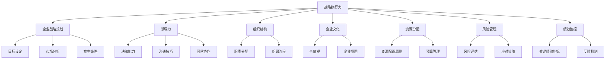

                 

当然可以。接下来，我将按照您的要求，逐步构建《战略执行力：从计划到实施的领导技巧》这篇文章。我们将从一个引人入胜的标题开始，逐步深入探讨战略执行力的概念、重要性以及相关的核心理论和实践方法。

**文章标题**：战略执行力：从计划到实施的领导技巧

**关键词**：战略执行力、计划实施、领导技巧、组织结构、企业文化、绩效监控

**摘要**：
在当今竞争激烈的市场环境中，战略执行力是企业成功的关键。本文深入探讨了战略执行力的概念及其重要性，详细阐述了从计划到实施的领导技巧。通过分析战略制定、组织结构与文化建设、资源分配与风险管理、战略监控与调整等多个方面，本文旨在为读者提供一套全面而实用的战略执行力提升指南。

---

**引言**

**1.1 战略执行力的定义**

战略执行力，通常被理解为企业在既定的战略规划指导下，能够有效地实施和实现战略目标的能力。它不仅涉及到企业高层领导者的决策和战略眼光，还包括中层管理者的执行力和基层员工的执行力。战略执行力是企业将长远规划转化为实际成果的关键因素。

**核心概念与联系**

为了更好地理解战略执行力的概念，我们需要构建一个包含相关核心概念和它们之间相互关系的架构。以下是战略执行力相关概念的Mermaid流程图：

通过这个流程图，我们可以清晰地看到战略执行力如何与企业战略规划、领导力、组织结构、企业文化、资源分配、风险管理和绩效监控等多个方面相互联系。

---

现在，我们已经为文章的引言部分奠定了基础。在接下来的章节中，我们将深入探讨战略执行力在不同方面的具体实践方法和技巧。在构建每个章节时，我们将坚持使用Mermaid流程图、伪代码、latex数学公式以及实际案例来确保文章内容的专业性和可操作性。

在接下来的写作过程中，我将按照这个结构，逐步完善每个章节的内容，确保文章的逻辑性和完整性。在文章的结尾，我们将对整个主题进行总结，并提供进一步阅读的建议，以帮助读者更深入地理解战略执行力的本质和重要性。继续我们的推理和思考，让我们共同探索战略执行力在现实世界中的应用和实现。

