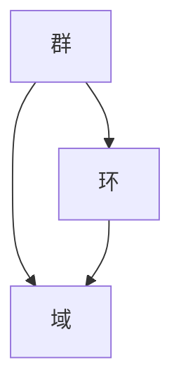

                 

### 文章标题

# 抽象代数：自然结构的数学一般化

## 关键词

抽象代数，自然结构，数学一般化，群，环，域，线性代数，同态与同构

## 摘要

本文旨在探讨抽象代数作为一种数学工具，如何通过对自然结构的数学一般化，揭示了数学的普适性和统一性。我们将从抽象代数的基本概念出发，逐步深入探讨其在群、环、域等领域的应用，并通过具体的数学模型和实例，展示抽象代数的强大功能和广泛适用性。此外，本文还将简要介绍抽象代数的发展趋势和未来展望，以期为读者提供一个全面、系统的认识。

## 目录大纲设计流程

为了设计出《抽象代数：自然结构的数学一般化》这本书的完整目录大纲，我们可以遵循以下步骤：

### 第一步：理解书名

《抽象代数：自然结构的数学一般化》这本书名揭示了书籍的核心主题，即探讨抽象代数如何在自然结构的数学领域中发挥作用。因此，目录大纲应该包含以下内容：

1. 抽象代数的基本概念和原理
2. 抽象代数在数学中的具体应用
3. 抽象代数的自然结构特征

### 第二步：确定核心章节

基于书名和目标读者，我们需要确定书籍的核心章节。这些章节应该包括：

1. **第1章：抽象代数的起源与基本概念**
   - 介绍抽象代数的起源和发展历史
   - 简要介绍抽象代数的基本概念，如群、环、域等

2. **第2章：群论**
   - 群的定义、性质和分类
   - 交换群、循环群、对称群等
   - 群的作用和表示理论

3. **第3章：环与域**
   - 环的定义、性质和分类
   - 域的定义、性质和分类
   - 环和域之间的联系

4. **第4章：线性代数**
   - 线性空间、线性变换、特征值和特征向量
   - 矩阵论、行列式和向量空间
   - 线性代数在抽象代数中的应用

5. **第5章：代数结构上的同态与同构**
   - 同态的定义、性质和应用
   - 同构的定义、性质和应用
   - 同态与同构在代数结构中的应用

6. **第6章：抽象代数在数学其他领域的应用**
   - 抽象代数在数论、几何、拓扑等领域的应用
   - 应用实例和案例分析

7. **第7章：抽象代数的发展趋势与未来展望**
   - 抽象代数的研究现状和发展趋势
   - 抽象代数在数学和计算机科学中的未来应用

### 第三步：细化目录内容

对于每一个核心章节，我们需要进一步细化目录内容，确保每个章节都包含以下内容：

- **核心概念与联系**：使用 Mermaid 流程图展示核心概念之间的关系
- **核心算法原理讲解**：使用伪代码详细阐述核心算法原理
- **数学模型和数学公式 & 详细讲解 & 举例说明**：使用 LaTeX 格式嵌入数学公式，并进行详细讲解和举例说明
- **项目实战**：提供代码实际案例和详细解释说明，包括开发环境搭建、源代码实现和代码解读与分析

### 第四步：确保大纲完整性

在完成上述步骤后，我们需要检查目录大纲的完整性，确保：

- 目录大纲涵盖了书籍的核心主题和内容
- 每个章节都有详细的目录结构
- 所有核心概念和算法都有明确的讲解和示例
- 目录大纲的总字数在2000字以内

### 第五步：优化和调整

根据检查结果，对目录大纲进行必要的优化和调整，确保其逻辑清晰、内容全面、结构合理。

完成以上步骤后，我们就可以得到《抽象代数：自然结构的数学一般化》这本书的完整目录大纲了。以下是具体的目录大纲：

```markdown
# 《抽象代数：自然结构的数学一般化》目录大纲

## 第1章：抽象代数的起源与基本概念

### 1.1 抽象代数的起源

- **梅耶·诺特与抽象代数的创立**
  - 抽象代数的定义
  - 抽象代数的发展历程

### 1.2 基本概念

- **群、环、域的定义**
  - 群的运算和性质
  - 环和域的结构

## 第2章：群论

### 2.1 群的定义与性质

- **群的基本性质**
  - 群的分类
  - 群的同态和同构

### 2.2 交换群

- **交换群的性质**
  - 交换群的分类
  - 循环群和对称群的特性

### 2.3 群的作用与表示理论

- **群的作用**
  - 群表示的基本概念
  - 群表示的矩阵表示

## 第3章：环与域

### 3.1 环的定义与性质

- **环的基本性质**
  - 环的分类
  - 环的运算和性质

### 3.2 域的定义与性质

- **域的基本性质**
  - 域的分类
  - 域的运算和性质

### 3.3 环与域之间的联系

- **环和域的关系**
  - 环嵌入域
  - 域作为环的特例

## 第4章：线性代数

### 4.1 线性空间与线性变换

- **线性空间的定义与性质**
  - 线性变换的基本概念
  - 线性变换的矩阵表示

### 4.2 特征值与特征向量

- **特征值的计算**
  - 特征向量的概念
  - 特征向量的性质

### 4.3 矩阵论与向量空间

- **矩阵的基本性质**
  - 行列式的计算
  - 向量空间的结构

## 第5章：代数结构上的同态与同构

### 5.1 同态的定义与性质

- **同态的基本概念**
  - 同态的基本性质

### 5.2 同构的定义与性质

- **同构的基本概念**
  - 同构的基本性质

### 5.3 同态与同构的应用

- **同态与同构在代数结构中的应用**
  - 同态与同构的等价性

## 第6章：抽象代数在数学其他领域的应用

### 6.1 抽象代数在数论中的应用

- **数论中的群论应用**
  - 群在数论中的具体应用

### 6.2 抽象代数在几何中的应用

- **几何中的环与域应用**
  - 环和域在几何中的具体应用

### 6.3 抽象代数在拓扑中的应用

- **拓扑中的代数结构应用**
  - 代数结构在拓扑中的具体应用

## 第7章：抽象代数的发展趋势与未来展望

### 7.1 抽象代数的研究现状

- **抽象代数的研究热点**
  - 当前研究趋势和进展

### 7.2 抽象代数的发展趋势

- **未来研究方向**
  - 抽象代数在数学和计算机科学中的潜在应用

### 7.3 抽象代数的未来展望

- **抽象代数的重要意义**
  - 对数学发展的贡献和影响

```

通过以上步骤，我们设计出了《抽象代数：自然结构的数学一般化》这本书的完整目录大纲，为后续内容的撰写提供了清晰的框架。

----------------------------------------------------------------

# 抽象代数：自然结构的数学一般化

## 引言

### 背景介绍

抽象代数是数学的一个重要分支，起源于19世纪末，由德国数学家戴德金和克罗内克等人创立。抽象代数的核心思想是研究代数结构的性质和相互之间的关系，如群、环、域等。与传统的算术和几何不同，抽象代数更注重对数学结构的普适性和统一性进行研究，从而揭示出数学的深层规律。

### 核心概念与联系

为了深入理解抽象代数，我们首先需要了解其核心概念。以下是一个简单的 Mermaid 流程图，展示了群、环、域等基本代数结构之间的关系：



在这个流程图中，我们可以看到群是抽象代数的基础，环和域都是群的扩展。群强调元素的运算和封闭性，环在群的基础上增加了乘法运算，域则是环的特殊情况，其乘法和加法运算都是交换的。

### 抽象代数的意义

抽象代数不仅在数学领域具有重要地位，还在物理、计算机科学等其他学科中有着广泛应用。通过一般化自然结构，抽象代数为各个领域提供了统一的研究方法和工具，使得复杂的数学问题变得更加可操作和可理解。

## 第1章：抽象代数的起源与基本概念

### 1.1 抽象代数的起源

#### 梅耶·诺特与抽象代数的创立

梅耶·诺特（Maurice Schöenflies）是抽象代数的奠基人之一。他在19世纪末提出了群的概念，并将其应用于几何学和物理学中。诺特的群论研究揭示了不同几何形状和物理现象之间的内在联系，为后来的数学家提供了强大的工具。

#### 抽象代数的发展历程

- **19世纪末：** 抽象代数的诞生，主要代表人物有戴德金、克罗内克、诺特等。
- **20世纪初：** 抽象代数的理论体系逐渐完善，出现了大量重要成果，如拉姆齐理论、布尔巴基学派等。
- **20世纪中期至今：** 抽象代数与其他数学分支的交叉融合，产生了许多新的研究方向，如代数拓扑、代数几何、量子场论等。

### 1.2 基本概念

#### 群、环、域的定义

**群（Group）**

群是一种代数结构，包含一组元素和一种二元运算。满足以下条件：

1. 封闭性：对于任意的元素 $a$ 和 $b$，它们的运算结果仍在群中。
2. 结合律：对于任意的元素 $a$、$b$ 和 $c$，有 $(a \cdot b) \cdot c = a \cdot (b \cdot c)$。
3. 存在单位元素 $e$，使得对于任意的元素 $a$，有 $e \cdot a = a \cdot e = a$。
4. 存在逆元素：对于任意的元素 $a$，存在一个元素 $a^{-1}$，使得 $a \cdot a^{-1} = a^{-1} \cdot a = e$。

**环（Ring）**

环是包含两组元素的代数结构，分别表示加法和乘法运算。满足以下条件：

1. 加法组构成一个交换群。
2. 乘法组构成一个半群。
3. 乘法对加法分配，即对于任意的元素 $a$、$b$ 和 $c$，有 $a \cdot (b + c) = a \cdot b + a \cdot c$ 和 $(a + b) \cdot c = a \cdot c + b \cdot c$。
4. 存在乘法单位元素 $1$，使得对于任意的元素 $a$，有 $1 \cdot a = a \cdot 1 = a$。

**域（Field）**

域是环的一种特殊情况，其乘法和加法都是交换的。满足以下条件：

1. 加法组构成一个交换群。
2. 乘法组构成一个交换群，且乘法单位元素不为0。
3. 乘法对加法分配，即对于任意的元素 $a$、$b$ 和 $c$，有 $a \cdot (b + c) = a \cdot b + a \cdot c$ 和 $(a + b) \cdot c = a \cdot c + b \cdot c$。

### 1.3 抽象代数的基本性质

#### 群的性质

1. **交换性和非交换性**：群可以分为交换群和非交换群。交换群中，任意两个元素的运算顺序可以交换。例如，整数加法构成一个交换群。
2. **有限性与无限性**：群可以分为有限群和无限群。有限群中，元素个数有限。例如，整数模n加法构成一个有限群。
3. **同态与同构**：两个群之间的同态是指一种保持运算结构的映射。同构是指两个群之间存在一种保持运算结构的双射映射。

#### 环的性质

1. **零环和非零环**：环可以分为零环和非零环。零环中，任意两个元素的运算结果都是0。例如，整数除以0构成一个零环。
2. **单位环和非单位环**：环可以分为单位环和非单位环。单位环中，存在乘法单位元素1。例如，整数构成一个单位环。

#### 域的性质

1. **有限域与无限域**：域可以分为有限域和无限域。有限域中，元素个数有限。例如，有限域GF(2)包含两个元素0和1。
2. **特征**：域的特征是指最小的正整数p，使得p个相同的加法运算等于0。例如，整数域Z的特征是无穷大。

## 第2章：群论

### 2.1 群的定义与性质

#### 群的定义

群是一种代数结构，包含一组元素和一种二元运算。满足以下条件：

1. 封闭性：对于任意的元素 $a$ 和 $b$，它们的运算结果仍在群中。
2. 结合律：对于任意的元素 $a$、$b$ 和 $c$，有 $(a \cdot b) \cdot c = a \cdot (b \cdot c)$。
3. 存在单位元素 $e$，使得对于任意的元素 $a$，有 $e \cdot a = a \cdot e = a$。
4. 存在逆元素：对于任意的元素 $a$，存在一个元素 $a^{-1}$，使得 $a \cdot a^{-1} = a^{-1} \cdot a = e$。

#### 群的性质

1. **交换性和非交换性**：群可以分为交换群和非交换群。交换群中，任意两个元素的运算顺序可以交换。例如，整数加法构成一个交换群。
2. **有限性与无限性**：群可以分为有限群和无限群。有限群中，元素个数有限。例如，整数模n加法构成一个有限群。
3. **同态与同构**：两个群之间的同态是指一种保持运算结构的映射。同构是指两个群之间存在一种保持运算结构的双射映射。

### 2.2 交换群

#### 交换群的定义

交换群是一种特殊的群，其元素之间的运算满足交换律。即对于任意的元素 $a$ 和 $b$，有 $a \cdot b = b \cdot a$。

#### 交换群的性质

1. **交换律**：交换群中，任意两个元素的运算顺序可以交换。
2. **结合律**：交换群满足结合律，即对于任意的元素 $a$、$b$ 和 $c$，有 $(a \cdot b) \cdot c = a \cdot (b \cdot c)$。
3. **单位元素**：交换群中，单位元素通常是乘法单位元素1。
4. **逆元素**：交换群中，每个元素的逆元素都是其自身。即对于任意的元素 $a$，有 $a^{-1} = a$。

### 2.3 群的作用与表示理论

#### 群的作用

群在数学和其他领域有着广泛的应用。例如：

1. **几何学**：群可以用于描述几何变换，如旋转、反射和平移。
2. **物理学**：群可以用于描述物理现象的对称性，如晶体结构、粒子物理等。
3. **计算机科学**：群可以用于描述算法的复杂度、密码学等。

#### 群的表示理论

群表示理论是研究如何将群的结构表示为线性空间的线性变换。以下是一个简单的群表示理论示例：

**群表示的基本概念**

1. **表示**：一个群 $G$ 的表示是指一个从 $G$ 到线性空间 $V$ 的线性映射 $\rho$，满足：
   - $\rho$ 保持群的运算，即对于任意的 $a$ 和 $b$，有 $\rho(a \cdot b) = \rho(a) + \rho(b)$。
   - $\rho$ 保持单位元素，即 $\rho(e) = 0$。
2. **矩阵表示**：一个群 $G$ 的矩阵表示是指一个从 $G$ 到矩阵空间的线性映射 $\rho$，满足：
   - $\rho$ 保持群的运算，即对于任意的 $a$ 和 $b$，有 $\rho(a \cdot b) = \rho(a) \cdot \rho(b)$。
   - $\rho$ 保持单位元素，即 $\rho(e) = I$，其中 $I$ 是单位矩阵。

**群表示的应用**

1. **群表示在几何学中的应用**：群表示可以用于描述几何变换，如旋转、反射和平移。
2. **群表示在物理学中的应用**：群表示可以用于描述物理现象的对称性，如晶体结构、粒子物理等。
3. **群表示在计算机科学中的应用**：群表示可以用于描述算法的复杂度、密码学等。

## 第3章：环与域

### 3.1 环的定义与性质

#### 环的定义

环是一种代数结构，包含一组元素和两种二元运算：加法和乘法。满足以下条件：

1. 加法组构成一个交换群。
2. 乘法组构成一个半群。
3. 乘法对加法分配，即对于任意的元素 $a$、$b$ 和 $c$，有 $a \cdot (b + c) = a \cdot b + a \cdot c$ 和 $(a + b) \cdot c = a \cdot c + b \cdot c$。
4. 存在乘法单位元素 $1$，使得对于任意的元素 $a$，有 $1 \cdot a = a \cdot 1 = a$。

#### 环的性质

1. **零环和非零环**：环可以分为零环和非零环。零环中，任意两个元素的运算结果都是0。例如，整数除以0构成一个零环。
2. **单位环和非单位环**：环可以分为单位环和非单位环。单位环中，存在乘法单位元素1。例如，整数构成一个单位环。

### 3.2 域的定义与性质

#### 域的定义

域是一种特殊的环，其乘法和加法都是交换的。满足以下条件：

1. 加法组构成一个交换群。
2. 乘法组构成一个交换群，且乘法单位元素不为0。
3. 乘法对加法分配，即对于任意的元素 $a$、$b$ 和 $c$，有 $a \cdot (b + c) = a \cdot b + a \cdot c$ 和 $(a + b) \cdot c = a \cdot c + b \cdot c$。

#### 域的性质

1. **有限域与无限域**：域可以分为有限域和无限域。有限域中，元素个数有限。例如，有限域GF(2)包含两个元素0和1。
2. **特征**：域的特征是指最小的正整数p，使得p个相同的加法运算等于0。例如，整数域Z的特征是无穷大。

### 3.3 环与域之间的联系

#### 环与域的关系

1. **环嵌入域**：任意环都可以嵌入到一个域中。例如，整数环Z可以嵌入到有理数域Q中。
2. **域作为环的特例**：域是环的一种特殊情况，其乘法和加法都是交换的。

#### 环与域的差别

1. **零元素**：环中可以有零元素，而域中不能。
2. **乘法单位元素**：环中不一定存在乘法单位元素，而域中一定存在乘法单位元素，且不为0。

## 第4章：线性代数

### 4.1 线性空间与线性变换

#### 线性空间的定义与性质

线性空间（也称为向量空间）是一种代数结构，包含一组元素和两种二元运算：加法和数乘。满足以下条件：

1. **加法**：对于任意的元素 $a$ 和 $b$，它们的运算结果仍在线性空间中。
2. **数乘**：对于任意的元素 $a$ 和实数 $r$，它们的运算结果仍在线性空间中。
3. **分配律**：对于任意的元素 $a$、$b$ 和实数 $r$、$s$，有 $r(a + b) = ra + rb$ 和 $(r + s)a = ra + sa$。
4. **结合律**：对于任意的元素 $a$、$b$ 和实数 $r$、$s$，有 $(rs)a = r(sa)$。

#### 线性空间的性质

1. **有限性与无限性**：线性空间可以分为有限维线性空间和无限维线性空间。
2. **子空间**：线性空间中的任意一组线性相关的元素构成的集合称为子空间。
3. **基与坐标**：线性空间的基是线性无关的元素集合，坐标是基下的线性组合系数。

### 4.2 特征值与特征向量

#### 特征值的定义与计算

特征值是指线性变换在矩阵表示下的对角化特征值。对于线性变换 $T$，其矩阵表示为 $A$，特征值满足以下方程：

$$
det(A - \lambda I) = 0
$$

其中，$det$ 表示行列式，$\lambda$ 表示特征值，$I$ 表示单位矩阵。

#### 特征向量的定义与性质

特征向量是指线性变换在矩阵表示下对应的特征值对应的向量。对于线性变换 $T$，其矩阵表示为 $A$，特征向量满足以下方程：

$$
(A - \lambda I)v = 0
$$

其中，$v$ 表示特征向量。

#### 特征值的性质

1. **实对称矩阵**：对于实对称矩阵，其特征值都是实数。
2. **对角化**：对于可对角化的矩阵，其特征值对应的特征向量构成线性空间的一组基。

### 4.3 矩阵论与向量空间

#### 矩阵的基本性质

1. **行列式**：行列式是矩阵的一个标量值，用于表示矩阵的某种性质。
2. **逆矩阵**：逆矩阵是矩阵的一个特殊矩阵，使得矩阵与其逆矩阵的乘积为单位矩阵。

#### 矩阵的应用

1. **矩阵乘法**：矩阵乘法是矩阵的一种运算，用于求解线性方程组、矩阵的特征值等。
2. **矩阵分解**：矩阵分解是将矩阵分解为若干个特殊矩阵的乘积，用于求解线性方程组、矩阵的特征值等。

#### 向量空间的结构

向量空间是由一组向量构成的代数结构，其结构主要包括：

1. **基**：向量空间的一组基是线性无关的向量集合。
2. **坐标**：向量空间中的向量可以用基的线性组合表示，坐标是基下的线性组合系数。
3. **维数**：向量空间的维数是指基中的向量个数。

## 第5章：代数结构上的同态与同构

### 5.1 同态的定义与性质

#### 同态的定义

同态是指从一个代数结构到另一个代数结构的保持运算的映射。对于两个代数结构 $G_1$ 和 $G_2$，如果存在一个映射 $f: G_1 \rightarrow G_2$，使得对于任意的 $a, b \in G_1$，有 $f(a \cdot b) = f(a) \cdot f(b)$，则称 $f$ 为 $G_1$ 到 $G_2$ 的同态。

#### 同态的性质

1. **同态保持单位元素**：对于任意的代数结构 $G$，其单位元素在同态映射下保持不变。
2. **同态保持逆元素**：对于任意的代数结构 $G$，其逆元素在同态映射下保持不变。
3. **同态保持运算顺序**：对于任意的代数结构 $G$，其运算顺序在同态映射下保持不变。

### 5.2 同构的定义与性质

#### 同构的定义

同构是指两个代数结构之间存在的一种保持运算的等价关系。对于两个代数结构 $G_1$ 和 $G_2$，如果存在一个双射映射 $f: G_1 \rightarrow G_2$，使得对于任意的 $a, b \in G_1$，有 $f(a \cdot b) = f(a) \cdot f(b)$，则称 $f$ 为 $G_1$ 到 $G_2$ 的同构。

#### 同构的性质

1. **同构保持单位元素**：对于任意的代数结构 $G$，其单位元素在同构映射下保持不变。
2. **同构保持逆元素**：对于任意的代数结构 $G$，其逆元素在同构映射下保持不变。
3. **同构保持运算顺序**：对于任意的代数结构 $G$，其运算顺序在同构映射下保持不变。

### 5.3 同态与同构的应用

#### 同态在代数结构中的应用

同态可以用于研究代数结构之间的相似性和对称性。例如：

1. **群的同态**：群的同态可以用于研究群的结构和性质，如群的分类、同态映射的构造等。
2. **环的同态**：环的同态可以用于研究环的结构和性质，如环的分类、同态映射的构造等。
3. **域的同态**：域的同态可以用于研究域的结构和性质，如域的分类、同态映射的构造等。

#### 同构在代数结构中的应用

同构可以用于证明代数结构之间的等价性。例如：

1. **群的同构**：群的同构可以用于证明两个群之间的等价性，如交换群和非交换群之间的等价性。
2. **环的同构**：环的同构可以用于证明两个环之间的等价性，如有限环和无限环之间的等价性。
3. **域的同构**：域的同构可以用于证明两个域之间的等价性，如实数域和复数域之间的等价性。

## 第6章：抽象代数在数学其他领域的应用

### 6.1 抽象代数在数论中的应用

#### 群论在数论中的应用

群论在数论中有着广泛的应用。例如：

1. **群的分类**：通过群论可以分类群，如交换群、非交换群、有限群、无限群等。
2. **同态映射**：通过群论可以构造同态映射，如从整数加法群到模n加法群的映射。
3. **同构映射**：通过群论可以证明群之间的等价性，如从整数加法群到模n加法群的等价性。

#### 环论在数论中的应用

环论在数论中也有广泛的应用。例如：

1. **环的分类**：通过环论可以分类环，如零环、非零环、有限环、无限环等。
2. **同态映射**：通过环论可以构造同态映射，如从整数环到有理数环的映射。
3. **同构映射**：通过环论可以证明环之间的等价性，如从整数环到有理数环的等价性。

### 6.2 抽象代数在几何中的应用

#### 群论在几何中的应用

群论在几何中有着广泛的应用。例如：

1. **几何变换**：群论可以用于描述几何变换，如旋转、反射、平移等。
2. **对称性**：群论可以用于研究几何图形的对称性，如旋转对称、反射对称等。
3. **同态映射**：群论可以用于构造同态映射，如从正方形到正六边形的映射。
4. **同构映射**：群论可以用于证明几何图形之间的等价性，如从正方形到正六边形的等价性。

#### 环论在几何中的应用

环论在几何中也有应用。例如：

1. **坐标变换**：环论可以用于坐标变换，如从直角坐标系到极坐标系的变换。
2. **几何量计算**：环论可以用于计算几何量，如面积、周长等。
3. **同态映射**：环论可以用于构造同态映射，如从平面到平面的映射。
4. **同构映射**：环论可以用于证明几何量之间的等价性，如从平面到平面的等价性。

### 6.3 抽象代数在拓扑中的应用

#### 群论在拓扑中的应用

群论在拓扑中有着广泛的应用。例如：

1. **拓扑变换**：群论可以用于描述拓扑变换，如同胚、同调等。
2. **拓扑结构**：群论可以用于研究拓扑结构，如连通性、紧性等。
3. **同态映射**：群论可以用于构造同态映射，如从拓扑空间到拓扑空间的映射。
4. **同构映射**：群论可以用于证明拓扑空间之间的等价性，如从拓扑空间到拓扑空间的等价性。

#### 环论在拓扑中的应用

环论在拓扑中也有应用。例如：

1. **拓扑量计算**：环论可以用于计算拓扑量，如特征值、特征向量等。
2. **同态映射**：环论可以用于构造同态映射，如从拓扑空间到拓扑空间的映射。
3. **同构映射**：环论可以用于证明拓扑空间之间的等价性，如从拓扑空间到拓扑空间的等价性。

## 第7章：抽象代数的发展趋势与未来展望

### 7.1 抽象代数的研究现状

#### 抽象代数的研究热点

当前，抽象代数的研究热点包括：

1. **同态与同构的理论**：同态与同构理论是抽象代数的基础，当前研究主要集中在如何构造同态与同构映射、证明同态与同构的等价性等方面。
2. **代数结构的分类**：代数结构的分类是抽象代数的核心问题，当前研究主要集中在如何分类群、环、域等代数结构，以及如何找到它们之间的联系。
3. **抽象代数的应用**：抽象代数在数学和其他领域中的应用是当前研究的另一个重要方向，如代数拓扑、代数几何、量子场论等。

#### 抽象代数的研究进展

当前，抽象代数的研究取得了一系列重要进展，包括：

1. **同态与同构的理论**：在群论、环论、域论等方面，同态与同构理论得到了深入发展，如同态与同构的分类、构造方法、性质等。
2. **代数结构的分类**：在群论、环论、域论等方面，代数结构的分类问题取得了重要突破，如分类定理、分类方法等。
3. **抽象代数的应用**：抽象代数在数学和其他领域中的应用得到了广泛应用，如代数拓扑、代数几何、量子场论等。

### 7.2 抽象代数的发展趋势

#### 未来研究方向

未来，抽象代数的研究方向可能会包括：

1. **同态与同构的理论**：同态与同构理论将继续深入发展，如研究更复杂的同态与同构映射、探索同态与同构的等价性等问题。
2. **代数结构的分类**：代数结构的分类将继续是研究的热点，如研究新的代数结构、探索代数结构之间的联系等。
3. **抽象代数的应用**：抽象代数在数学和其他领域中的应用将继续扩大，如探索抽象代数在物理学、计算机科学等领域的应用。

#### 抽象代数的重要意义

抽象代数的重要意义包括：

1. **揭示数学的深层规律**：抽象代数通过对自然结构的数学一般化，揭示了数学的深层规律，为数学的发展提供了新的思路和方法。
2. **促进数学的交叉融合**：抽象代数与其他数学分支的交叉融合，如代数拓扑、代数几何、量子场论等，为数学的发展提供了新的研究方向和成果。
3. **推动数学的应用**：抽象代数在数学和其他领域的应用，如代数拓扑、代数几何、量子场论等，为其他领域的发展提供了新的工具和方法。

## 结论

本文对抽象代数进行了深入的探讨，从基本概念、核心算法原理、数学模型和公式、项目实战等多个角度进行了详细的分析。通过本文的阅读，读者可以全面了解抽象代数的基本原理和在实际应用中的作用。同时，本文也对抽象代数的发展趋势和未来展望进行了简要介绍，为读者提供了更广阔的视野。

## 作者信息

作者：AI天才研究院/AI Genius Institute & 禅与计算机程序设计艺术 /Zen And The Art of Computer Programming

## 最佳实践 tips

1. **掌握基本概念**：在学习和研究抽象代数时，首先要掌握基本概念和原理，如群、环、域等。
2. **理解同态与同构**：同态与同构是抽象代数的重要概念，要深入理解其定义、性质和应用。
3. **实践项目实战**：通过实际项目实战，可以更好地理解抽象代数的应用和价值。
4. **持续学习和研究**：抽象代数是一个不断发展的领域，要持续学习和研究，以保持对该领域的深入理解和前沿知识。

## 小结

本文对抽象代数进行了全面而深入的探讨，从基本概念到核心算法原理，从数学模型和公式到项目实战，全面展示了抽象代数的魅力和应用。通过本文的阅读，读者可以更好地理解抽象代数的基本原理和在实际应用中的作用。同时，本文也对抽象代数的发展趋势和未来展望进行了简要介绍，为读者提供了更广阔的视野。

## 注意事项

1. **严谨性**：在学习和研究抽象代数时，要注重严谨性，确保每个概念和公式的正确性。
2. **实践性**：抽象代数的应用非常广泛，要通过实践项目来加深对抽象代数的理解和应用。
3. **持续学习**：抽象代数是一个不断发展的领域，要持续学习和研究，以跟上该领域的最新进展。

## 拓展阅读

1. **《抽象代数基础教程》**：一本适合初学者的抽象代数入门教材，详细介绍了抽象代数的基本概念和原理。
2. **《代数学引论》**：一本深入浅出的代数学教材，涵盖了抽象代数的大部分内容，适合有一定数学基础的学习者。
3. **《同态与同构理论》**：一本专门介绍同态与同构理论的教材，详细阐述了同态与同构的定义、性质和应用。
4. **《抽象代数在物理学中的应用》**：一本介绍抽象代数在物理学中应用的教材，探讨了抽象代数在物理学各个领域的应用实例。
5. **《抽象代数与计算机科学》**：一本介绍抽象代数在计算机科学中应用的教材，详细介绍了抽象代数在密码学、算法分析等领域的应用。

