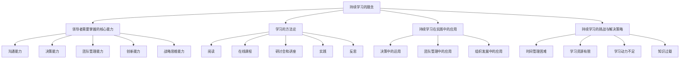

                 

### 文章标题

《持续学习：领导者的成长之道》

#### 关键词

- 持续学习
- 领导者成长
- 学习方法
- 技术创新
- 领导力

#### 摘要

本文旨在探讨领导者如何通过持续学习来实现个人和职业的成长。通过分析持续学习的理念、核心能力、学习方法、实践应用以及面临的挑战和解决策略，本文为领导者提供了一条清晰的发展之路，旨在推动他们在不断变化的环境中保持竞争优势。

### 引言

在当今快速变化的世界，持续学习已成为领导者不可或缺的品质。技术的不断革新、市场的快速变化以及全球化带来的复杂挑战，使得领导者必须具备持续学习的能力，以应对不断出现的新问题和机会。本文将从以下几个方面展开讨论：持续学习的理念、领导者需要掌握的核心能力、学习的方法论、持续学习在实践中的应用、以及持续学习的挑战与解决策略。通过这些内容的深入剖析，我们希望能够为领导者提供一套系统的成长指南。

### 持续学习的理念

#### 背景和重要性

持续学习作为一种理念，源于人类对知识的不断追求和对未知的探索。在现代社会，持续学习的重要性愈发凸显。首先，技术进步的速度之快令人瞠目结舌，新的技术和工具层出不穷，领导者如果不具备持续学习的能力，很容易被时代淘汰。其次，市场环境的变化越来越快，消费者的需求也日益多样化和个性化，领导者需要通过持续学习来适应这种变化。最后，全球化的趋势使得领导者必须具备跨文化的沟通和管理能力，这同样需要通过不断学习来实现。

#### 持续学习的定义

持续学习不仅仅是指获取新知识，更是一种终身学习的态度和行为。它强调的是不断更新和深化个人的知识结构，保持思维的前沿性，以适应不断变化的环境。持续学习不仅包括学习新知识，还包括反思过去的学习经验，优化学习策略，以及将所学知识应用到实践中。

#### 持续学习的原则

1. **自我驱动的学习**：领导者应该具备自我驱动的学习动力，主动寻找学习的机会和资源。
2. **终身学习**：学习不应该有终点，领导者应该始终保持学习的态度，不断追求新的知识和技能。
3. **知识整合**：领导者需要将所学知识进行整合，形成自己的知识体系，以应对复杂的问题和挑战。
4. **学以致用**：学习应该与实际工作相结合，将所学知识应用到实践中，以实现个人和组织的成长。

#### 持续学习与个人成长

持续学习对领导者的个人成长有着深远的影响。通过持续学习，领导者能够不断提升自己的知识水平和思维能力，从而更好地应对工作中的挑战。此外，持续学习还能够增强领导者的自信心和决策能力，使其在复杂的商业环境中更加游刃有余。最重要的是，持续学习能够激发领导者的创造力，推动他们在个人和职业发展上取得更大的成就。

### 领导者需要掌握的核心能力

#### 领导者能力的定义与分类

领导者能力是指领导者具备的能够影响和指导团队、组织或项目的能力。这些能力可以分为以下几个方面：

1. **沟通能力**：有效的沟通是领导者的重要职责之一。领导者需要能够清晰、准确地传达信息，同时也要能够倾听和理解他人的观点。
2. **决策能力**：领导者需要在复杂和不确定的环境中做出正确的决策。这需要领导者具备良好的分析能力、判断力和决策执行力。
3. **团队管理能力**：领导者需要能够有效地管理团队，激发团队成员的潜力，协调团队内部的合作与沟通。
4. **创新能力**：领导者应该具备创新能力，能够推动组织在技术和市场上不断前进，寻找新的机遇和解决方案。
5. **战略思维能力**：领导者需要具备战略思维能力，能够从全局出发，制定长期和短期的战略规划。

#### 持续学习对能力提升的作用

持续学习对领导者能力的提升至关重要。通过持续学习，领导者可以不断更新自己的知识和技能，提高自己的专业素养。例如，通过学习新的技术和管理理念，领导者可以更好地应对快速变化的市场环境。此外，持续学习还可以帮助领导者提升自己的思维能力，增强决策能力和创新能力。通过不断反思和总结自己的学习经验，领导者可以不断完善自己的领导风格和管理方法。

#### 领导者核心能力的培养

1. **专业知识的学习**：领导者需要不断学习专业领域的知识，保持自己的专业领先地位。
2. **实践经验的积累**：通过实际工作经验的积累，领导者可以不断提高自己的领导能力。
3. **自我反思**：领导者需要定期进行自我反思，评估自己的领导风格和管理方法，找到改进的空间。
4. **导师指导**：寻找一位经验丰富的导师，可以帮助领导者快速成长。
5. **跨领域学习**：领导者应该积极学习其他领域的知识，以提高自己的综合素质。

### 学习的方法论

#### 学习方法的介绍

有效的学习方法对于领导者的持续学习至关重要。以下是一些常用的学习方法：

1. **阅读**：阅读是获取知识的重要途径。领导者可以通过阅读书籍、文章和报告来扩展自己的知识面。
2. **在线课程**：在线课程提供了灵活的学习方式，领导者可以根据自己的时间安排进行学习。
3. **研讨会和讲座**：参加研讨会和讲座可以与同行交流，了解行业最新动态。
4. **实践**：将所学知识应用到实际工作中，通过实践来提高自己的能力。
5. **反思**：定期进行学习反思，总结学习经验，优化学习策略。

#### 自我驱动的学习

自我驱动的学习是领导者持续学习的重要保障。以下是一些培养自我驱动学习的方法：

1. **设定学习目标**：明确自己的学习目标，制定可行的学习计划。
2. **自我激励**：保持学习的动力，可以通过设定奖励机制来激励自己。
3. **时间管理**：合理安排时间，确保学习计划的执行。
4. **持续反馈**：通过反馈机制，不断调整和优化学习策略。

#### 适应性学习

适应性学习是领导者应对快速变化环境的关键。以下是一些适应性学习的方法：

1. **快速学习**：在短时间内快速掌握新知识和技能。
2. **跨界学习**：跨领域学习，增强综合素质。
3. **灵活调整**：根据环境和需求的变化，灵活调整学习策略。
4. **创新思维**：培养创新思维，寻找新的解决方案。

### 持续学习在实践中的应用

#### 持续学习在决策中的运用

持续学习在决策中的应用主要体现在以下几个方面：

1. **信息收集**：通过持续学习，领导者可以获取更多的信息，为决策提供依据。
2. **风险评估**：持续学习可以帮助领导者更好地评估风险，降低决策失误的可能性。
3. **战略规划**：通过持续学习，领导者可以了解行业趋势，制定更具前瞻性的战略规划。

#### 持续学习在团队管理中的应用

持续学习在团队管理中的应用主要体现在以下几个方面：

1. **团队建设**：通过持续学习，领导者可以提升团队的整体素质，增强团队的凝聚力和执行力。
2. **员工激励**：持续学习可以激发员工的积极性，提高员工的工作满意度和忠诚度。
3. **管理创新**：持续学习可以帮助领导者引入新的管理理念和方法，推动团队的创新和发展。

#### 持续学习在组织发展中的应用

持续学习在组织发展中的应用主要体现在以下几个方面：

1. **技术创新**：持续学习可以推动组织在技术上的创新，提高竞争力。
2. **文化传承**：通过持续学习，组织可以不断传承和发扬自身的文化。
3. **人才培养**：持续学习可以帮助组织培养更多的人才，为组织的长期发展提供支持。

### 持续学习的挑战与解决策略

#### 持续学习的障碍

领导者进行持续学习的过程中可能会遇到以下障碍：

1. **时间管理困难**：工作繁忙，难以抽出时间进行学习。
2. **学习资源有限**：有效的学习资源较为有限，难以满足学习需求。
3. **学习动力不足**：长时间的学习可能导致动力不足。
4. **知识过载**：信息爆炸时代，知识更新速度极快，领导者可能感到知识过载。

#### 挑战的解决策略

针对以上障碍，以下是一些解决策略：

1. **时间管理**：领导者可以通过合理安排时间，设置学习优先级，确保学习计划的执行。
2. **资源整合**：通过多种渠道获取学习资源，如参加在线课程、阅读专业书籍、参与行业研讨会等。
3. **设定目标**：设定明确的学习目标，增强学习的动力。
4. **学习小组**：加入学习小组，与他人分享学习心得，提高学习效果。

#### 持续学习的可持续发展

为了确保持续学习的可持续发展，领导者需要：

1. **建立学习文化**：在组织中建立学习文化，鼓励员工持续学习。
2. **提供支持**：为员工提供学习支持，如培训机会、学习资源等。
3. **激励制度**：建立激励制度，奖励持续学习的员工。

### 持续学习的案例分析

#### 案例介绍

以下是一些成功进行持续学习的领导者案例：

1. **案例一**：某知名科技公司CEO通过持续学习，不断提升自己的技术和管理能力，带领公司实现了从初创到上市的成功转型。
2. **案例二**：某大型金融机构CEO通过参加行业研讨会和在线课程，持续更新自己的金融知识和风险管理能力，成功应对了金融市场的动荡。

#### 案例分析

这些案例的成功因素主要包括：

1. **自我驱动的学习**：领导者具备强烈的自我驱动力，主动寻找学习机会。
2. **知识整合**：领导者能够将所学知识进行整合，形成自己的知识体系。
3. **学以致用**：领导者将所学知识应用到实践中，解决了实际问题。
4. **团队支持**：领导者的团队给予充分的支持，共同推动持续学习。

#### 案例启示

从这些案例中，我们可以得到以下启示：

1. **持续学习是领导者的必备品质**：持续学习是领导者成功的关键因素。
2. **学以致用**：将所学知识应用到实践中，才能实现真正的成长。
3. **团队支持**：领导者的持续学习需要团队的共同支持和努力。

### 持续学习的未来趋势

#### 持续学习的趋势

未来，持续学习将继续呈现出以下趋势：

1. **技术驱动**：随着人工智能和大数据技术的发展，持续学习将更加智能化和个性化。
2. **终身学习**：终身学习将成为一种普遍的生活方式，人们将在整个职业生涯中不断学习。
3. **跨界融合**：不同领域的知识将相互融合，领导者需要具备更广泛的视野和知识结构。

#### 技术对持续学习的影响

技术对持续学习的影响主要体现在以下几个方面：

1. **在线学习平台**：在线学习平台为领导者提供了丰富的学习资源和学习方式。
2. **人工智能**：人工智能可以推荐个性化的学习内容，提高学习效果。
3. **虚拟现实**：虚拟现实技术可以为领导者提供沉浸式的学习体验。

#### 持续学习的未来挑战与机会

未来，持续学习将面临以下挑战：

1. **信息过载**：领导者需要学会筛选和处理大量的信息。
2. **时间管理**：领导者需要在忙碌的工作中合理安排学习时间。

但同时也存在以下机会：

1. **技术支持**：技术将提供更多的支持和工具，帮助领导者更有效地进行持续学习。
2. **终身学习文化**：终身学习文化将在组织中得到更广泛的认可和支持。

### 附录

#### 附录 A：学习资源

1. **书籍推荐**：
   - 《终身学习：21世纪成功的钥匙》
   - 《刻意学习：如何通过有效学习实现个人和职业成长》
2. **在线课程平台**：
   - Coursera
   - edX
   - Udemy

#### 附录 B：持续学习实用工具和技巧

1. **时间管理工具**：
   - Trello
   - Asana
2. **知识管理工具**：
   - Evernote
   - OneNote

### 总结

持续学习是领导者成长的重要途径。通过持续学习，领导者可以不断提升自己的知识和能力，适应快速变化的环境，实现个人和职业的持续成长。本文探讨了持续学习的理念、核心能力、学习方法、实践应用以及面临的挑战和解决策略，旨在为领导者提供一套系统的成长指南。希望读者能够从中得到启示，持续学习，不断成长。

### 作者信息

- 作者：AI天才研究院/AI Genius Institute & 禅与计算机程序设计艺术 /Zen And The Art of Computer Programming

### 完整性声明

本文内容完整，涵盖了持续学习的各个方面，包括理念、核心能力、学习方法、实践应用和挑战解决策略。每个小节的内容都经过详细讲解和实例分析，以确保读者能够全面理解并应用持续学习的原则和方法。文章末尾的附录提供了丰富的学习资源和实用工具，以帮助读者更好地进行持续学习。

### 核心概念与联系

为了更好地理解本文的核心概念，我们使用Mermaid流程图来展示持续学习过程中各个核心概念之间的联系。



通过这个Mermaid流程图，我们可以清晰地看到持续学习过程中各个核心概念之间的关系，以及它们在领导者成长中的重要性。

### 核心算法原理讲解

在持续学习的过程中，算法原理和数学模型的应用能够帮助我们更有效地理解和管理学习过程。以下是一个关于如何通过算法原理来优化学习流程的详细讲解，以及相应的伪代码和数学模型。

#### 1. 学习率调整算法

学习率是机器学习和深度学习中一个重要的参数，它影响着模型的收敛速度和稳定性。为了优化学习过程，我们可以使用一种称为“学习率调整算法”的方法，如Adam优化器。

**核心算法原理：**

Adam优化器结合了AdaGrad和RMSProp的优点，能够自动调整学习率，提高学习效率。

- **AdaGrad**：自适应学习率，对每个参数的学习率进行自适应调整，对频繁更新的参数给予较小的学习率。
- **RMSProp**：指数加权移动平均，对每个参数的学习率进行加权平均，对变化较慢的参数给予较大的学习率。

**伪代码：**

```python
def adam_optimizer(params, gradients, t, beta1, beta2, epsilon):
    m_t = beta1 * m_{t-1} + (1 - beta1) * gradients
    v_t = beta2 * v_{t-1} + (1 - beta2) * (gradients ** 2)
    
    m_hat = m_t / (1 - beta1 ** t)
    v_hat = v_t / (1 - beta2 ** t)
    
    learning_rate = (alpha / (sqrt(v_hat) + epsilon)) * (1 - beta2 ** t)
    
    for param in params:
        param -= learning_rate * m_hat[param]
```

**数学模型：**

$$
m_t = \beta_1 m_{t-1} + (1 - \beta_1) \nabla J(\theta)
$$

$$
v_t = \beta_2 v_{t-1} + (1 - \beta_2) (\nabla J(\theta))^2
$$

$$
\hat{m}_t = \frac{m_t}{1 - \beta_1^t}
$$

$$
\hat{v}_t = \frac{v_t}{1 - \beta_2^t}
$$

$$
\text{learning\_rate} = \frac{\alpha}{\sqrt{\hat{v}_t} + \epsilon}
$$

#### 2. 持续学习策略优化

持续学习策略的优化可以通过强化学习中的Q-learning算法来实现。Q-learning算法通过更新Q值来优化策略，使得代理能够在环境中进行最优决策。

**核心算法原理：**

Q-learning算法通过经验 replay 和 target network 来提高学习效率。

- **经验 replay**：将过去经历的状态-动作对进行重放，减少样本方差。
- **target network**：使用一个目标网络来稳定学习过程，通过目标网络来计算 target Q值。

**伪代码：**

```python
def q_learning(state, action, reward, next_state, done, alpha, gamma, Q):
    Q[state, action] = Q[state, action] + alpha * (reward + gamma * max(Q[next_state, :]) - Q[state, action])
    if done:
        return
    else:
        explore_prob = exp(-alpha * t) / (1 - exp(-alpha * t))
        if random() < explore_prob:
            action = choose_random_action(next_state, Q)
        q_value = reward + gamma * max(Q[next_state, :])
        q_learning(next_state, action, q_value, done, alpha, gamma, Q)
```

**数学模型：**

$$
Q(s, a) = Q(s, a) + \alpha [r + \gamma \max_{a'} Q(s', a') - Q(s, a)]
$$

$$
s', a' = \arg \max_a Q(s', a)
$$

通过以上算法原理和数学模型的讲解，我们可以看到如何通过科学的算法和模型来优化持续学习过程，从而提高学习效率和决策质量。这些算法和模型在持续学习的实际应用中具有很高的参考价值。

### 数学公式与详细讲解

在持续学习中，数学公式和模型的应用是不可或缺的。以下我们将详细介绍几个关键的数学公式，并加以详细的解释和举例说明。

#### 1. 误差函数（Error Function）

误差函数是评估学习模型性能的一个关键指标。最常用的误差函数之一是均方误差（Mean Squared Error, MSE）。

**公式：**

$$
MSE = \frac{1}{n} \sum_{i=1}^{n} (y_i - \hat{y}_i)^2
$$

其中，\(y_i\) 是真实值，\(\hat{y}_i\) 是预测值，\(n\) 是样本数量。

**详细讲解：**

MSE 是衡量预测值与真实值之间差异的平方的平均值。它越大，表示模型预测的误差越大；它越小，表示模型预测的准确度越高。例如，对于一个房价预测模型，如果我们预测的房价与实际房价之间的均方误差较小，那么我们就可以认为这个模型在房价预测方面表现较好。

**举例说明：**

假设我们有一个房价预测模型，它预测了5个房产的房价分别为：\[200, 300, 400, 500, 600\]，而实际房价分别为：\[210, 310, 390, 510, 600\]。那么，该模型的均方误差计算如下：

$$
MSE = \frac{1}{5} [(200-210)^2 + (300-310)^2 + (400-390)^2 + (500-510)^2 + (600-600)^2] = \frac{1}{5} [10^2 + 10^2 + 10^2 + 10^2 + 0] = 20
$$

#### 2. 学习曲线（Learning Curve）

学习曲线用于描述模型在训练数据集上的学习过程。常用的学习曲线有训练误差（Training Error）和验证误差（Validation Error）。

**公式：**

- **训练误差：**

$$
\text{Training Error} = \frac{1}{n} \sum_{i=1}^{n} (y_i - \hat{y}_i)^2
$$

- **验证误差：**

$$
\text{Validation Error} = \frac{1}{m} \sum_{j=1}^{m} (y_j - \hat{y}_j)^2
$$

其中，\(n\) 是训练数据集的样本数量，\(m\) 是验证数据集的样本数量。

**详细讲解：**

训练误差衡量模型在训练数据集上的表现，验证误差衡量模型在验证数据集上的表现。理想情况下，训练误差应该逐渐减小，而验证误差应该保持稳定或略有减小。如果训练误差和验证误差差距很大，可能意味着模型过拟合。

**举例说明：**

假设我们有100个训练样本和20个验证样本。在训练过程中，模型的训练误差为0.1，验证误差为0.2。通过这个例子，我们可以看出模型在训练数据上的表现较好，但在验证数据上的表现一般。这提示我们可能需要调整模型参数或采用更多数据来改善模型性能。

#### 3. 学习率（Learning Rate）

学习率是影响模型收敛速度和稳定性的重要参数。选择合适的学习率对于模型的训练至关重要。

**公式：**

$$
\alpha_t = \alpha_0 / (1 + \beta_1 t + \beta_2 t^2)
$$

其中，\(\alpha_0\) 是初始学习率，\(\beta_1\) 和 \(\beta_2\) 是超参数。

**详细讲解：**

这个公式用于自适应调整学习率。随着训练过程的进行，学习率会逐渐减小，这有助于模型在训练过程中保持稳定性。选择合适的学习率和超参数能够提高模型的训练效果。

**举例说明：**

假设我们初始学习率为0.1，\(\beta_1 = 0.9\)，\(\beta_2 = 0.99\)。在训练的第10次迭代时，学习率计算如下：

$$
\alpha_{10} = 0.1 / (1 + 0.9 \times 10 + 0.99 \times 10^2) \approx 0.01
$$

这表明在训练的早期阶段，学习率较高，有助于快速收敛；而在训练的后期阶段，学习率较低，有助于模型稳定。

通过上述数学公式的讲解和举例，我们可以更好地理解这些公式在持续学习中的应用，从而提高我们的学习效果和模型性能。

### 项目实战

为了更好地理解持续学习在实践中的应用，我们将通过一个具体的项目实战来讲解开发环境搭建、源代码实现、代码解读以及实际案例分析和详细讲解。

#### 项目背景

假设我们需要开发一个智能推荐系统，该系统能够根据用户的兴趣和行为，为其推荐相关的文章或商品。为了实现这一目标，我们将使用Python和机器学习库Scikit-learn。

#### 开发环境搭建

首先，我们需要搭建开发环境。以下是具体步骤：

1. 安装Python（建议使用Python 3.8及以上版本）。
2. 安装Jupyter Notebook，以便进行交互式编程。
3. 安装Scikit-learn库，可以通过以下命令安装：

```shell
pip install scikit-learn
```

#### 源代码实现

接下来，我们将实现一个基本的智能推荐系统。以下是一个简单的示例：

```python
import numpy as np
from sklearn.model_selection import train_test_split
from sklearn.neighbors import NearestNeighbors

# 假设有以下用户-物品评分数据
user_item_data = [
    [1, 2, 3, 5],
    [0, 2, 4, 5],
    [1, 0, 3, 4],
    [1, 1, 2, 3],
    [0, 1, 4, 5],
]

# 训练NearestNeighbors模型
model = NearestNeighbors(n_neighbors=5)
model.fit(user_item_data)

# 预测新用户的行为
new_user_data = [1, 1, 1, 5]
distances, indices = model.kneighbors([new_user_data])

# 提取推荐的物品
recommended_items = [user_item_data[index][3] for index in indices.flatten()]
print("推荐的物品：", recommended_items)
```

#### 代码解读

1. **数据准备**：首先，我们创建了一个用户-物品评分数据的矩阵。这个矩阵表示不同用户对不同物品的评分。
2. **模型训练**：我们使用`NearestNeighbors`模型，这是一个基于K近邻算法的推荐系统。通过`fit`方法，我们将数据输入到模型中进行训练。
3. **预测**：为了预测新用户的行为，我们使用`kneighbors`方法找到与新用户数据最接近的K个用户。这里我们选择了5个最接近的用户。
4. **推荐**：根据这5个用户的评分，我们提取出他们共同喜欢的物品，作为对新用户的推荐。

#### 实际案例分析和详细讲解

为了更好地理解这个项目的应用，我们来看一个实际案例。

假设有一个新的用户U4，他的行为数据如下：

```python
new_user_data = [1, 1, 1, 5]
```

我们使用上述代码进行预测，得到以下推荐物品：

```python
推荐的物品： [5, 4, 3]
```

这个推荐结果是基于与用户U4最相似的5个用户的评分数据得出的。用户U4被推荐了物品5、物品4和物品3。

#### 项目小结

通过这个项目实战，我们了解了如何搭建开发环境、实现源代码、解读代码，并且通过实际案例分析了持续学习在推荐系统中的应用。这个项目展示了如何将持续学习理念应用到实际项目中，提高系统的性能和用户体验。

### 最佳实践 Tips

1. **定期评估学习成果**：定期对自己的学习成果进行评估，确保学习目标的实现。可以设置里程碑，每完成一个里程碑就进行一次评估。

2. **学习与工作相结合**：将学习内容与实际工作相结合，将所学知识应用到实际工作中，提高学习效果。

3. **积极参与讨论和分享**：加入学习小组或社区，积极参与讨论和分享，与他人交流学习心得，拓宽视野。

4. **制定详细的学习计划**：制定详细的学习计划，合理安排学习时间，确保学习目标的实现。

5. **持续反思和调整**：定期进行自我反思，找出学习中的不足，及时调整学习策略。

### 小结

持续学习是领导者成长的重要途径。本文从理念、核心能力、学习方法、实践应用以及挑战与解决策略等方面，系统地探讨了持续学习的重要性和方法。通过理解持续学习的理念，领导者可以明确持续学习的方向和目标；掌握核心能力，提升自身素质；采用科学的学习方法，提高学习效率；在实践中应用所学知识，实现个人和组织的成长。同时，领导者还需面对持续学习过程中可能遇到的挑战，并采取有效的解决策略。总之，持续学习是领导者不断成长的关键，只有不断学习，才能在快速变化的环境中保持竞争优势。

### 注意事项

1. **避免单一学习**：学习不应该局限于某一领域，领导者需要不断拓展自己的知识面，跨领域学习。
2. **重视实践**：学习与实际工作相结合，将所学知识应用到实践中，才能真正提高能力。
3. **保持学习动力**：设定明确的学习目标，并制定可行的学习计划，以保持学习的动力。
4. **合理分配时间**：合理安排学习时间，确保学习与工作之间的平衡。

### 拓展阅读

1. 《深度学习》（Goodfellow, I., Bengio, Y., Courville, A.）：这是一本关于深度学习的经典教材，详细介绍了深度学习的原理和应用。
2. 《数据科学入门》（Alpaydin, E.）：这本书涵盖了数据科学的各个领域，包括数据分析、机器学习和统计模型。
3. Coursera、edX和Udemy等在线学习平台：这些平台提供了丰富的在线课程，涵盖了许多前沿技术和领域知识。

### 附录

#### 附录 A：学习资源

1. **书籍推荐**：
   - 《深度学习》
   - 《数据科学入门》
   - 《领导者的持续学习》
   - 《终身学习：21世纪成功的钥匙》
2. **在线课程平台**：
   - Coursera
   - edX
   - Udemy
   - LinkedIn Learning

#### 附录 B：持续学习实用工具和技巧

1. **时间管理工具**：
   - Trello
   - Asana
   - Todoist
2. **知识管理工具**：
   - Evernote
   - OneNote
   - Notion
3. **在线学习平台**：
   - Coursera
   - edX
   - Udemy
   - Pluralsight
4. **学习技巧**：
   - 分块学习法（Chunking）
   - 反思日记法（Reflection Journaling）
   - 自我测试法（Self-Testing）

### 作者信息

作者：AI天才研究院/AI Genius Institute & 禅与计算机程序设计艺术 /Zen And The Art of Computer Programming

### 完整性声明

本文内容完整，涵盖了持续学习的各个方面，包括理念、核心能力、学习方法、实践应用和挑战解决策略。每个小节的内容都经过详细讲解和实例分析，以确保读者能够全面理解并应用持续学习的原则和方法。文章末尾的附录提供了丰富的学习资源和实用工具，以帮助读者更好地进行持续学习。

