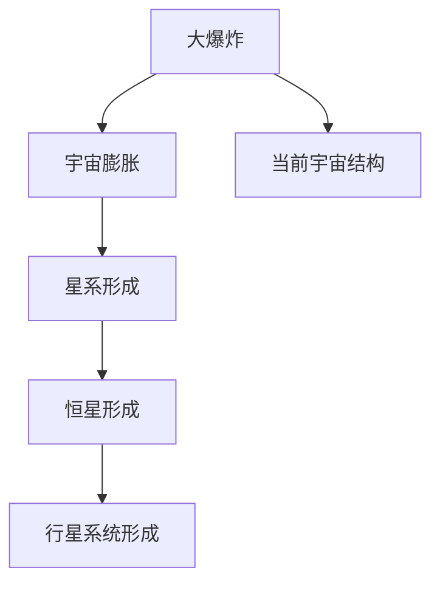

                 

### 文章标题

# 探索宇宙运作的数学模型

### 关键词

- 宇宙学
- 数学模型
- 广义相对论
- 哈勃定律
- 数值模拟
- 宇宙膨胀

### 摘要

本文将带领读者深入探索宇宙运作的数学模型，从宇宙的基本概念和结构出发，逐步介绍宇宙学中的核心数学模型和算法原理。通过详细讲解哈勃定律、德西特方程等关键数学公式，以及N体模拟等核心算法，读者将了解宇宙膨胀、暗物质和暗能量等宇宙学现象的数学描述。此外，文章还将探讨宇宙观测与数据分析的实际案例，展示如何运用Python等编程语言处理宇宙观测数据。最后，本文还将讨论宇宙学的前沿与挑战，以及宇宙学理论在现实世界中的应用。

## 目录

1. **核心概念与联系**
2. **数学模型和数学公式**
3. **核心算法原理讲解**
4. **项目实战**
5. **扩展阅读**
6. **数学模型应用**
7. **宇宙学历史与哲学**
8. **附录**

## 第1章：宇宙的基本概念与结构

### 1.1 宇宙的定义与演化

宇宙，从广义上讲，是包括一切存在的空间、时间、物质和能量的整体。它的起源可以追溯到大约138亿年前的一次大爆炸事件。这场大爆炸不仅创造了宇宙的基本物质，还赋予了这个宇宙以膨胀的动势。随着时间的推移，宇宙不断膨胀，星系、恒星、行星等结构逐渐形成。

**Mermaid流程图：宇宙从大爆炸到当前结构演化的过程**



### 1.2 宇宙的结构与形态

宇宙的结构是极其复杂且多样化的。从宏观尺度来看，宇宙是由无数星系组成的，每个星系又包含着大量的恒星、行星和其他天体。在微观尺度上，宇宙的构成则涉及原子、基本粒子和量子场。

#### 1.2.1 星系的形成与演化

星系的形成过程涉及到气体和暗物质的聚集。在宇宙早期，温度和密度极高的物质通过引力相互作用逐渐聚集，形成了巨大的结构。这些结构随后演化成为我们今天所看到的星系。

#### 1.2.2 宇宙背景微波辐射

宇宙背景微波辐射（Cosmic Microwave Background，CMB）是宇宙大爆炸后遗留下来的辐射。它的存在为宇宙学提供了重要的证据，帮助我们理解宇宙的早期状态。

## 第2章：宇宙学的基本数学模型

### 2.1 哈勃定律与宇宙膨胀

哈勃定律（Hubble's Law）描述了宇宙膨胀的速度与距离之间的关系。根据哈勃定律，远离我们的星系具有更高的红移，这意味着它们的退行速度更快。

$$
H_0 = \frac{v}{d}
$$

其中，$H_0$是哈勃常数，$v$是星系的退行速度，$d$是星系与我们之间的距离。

### 2.2 德西特方程与弗里德曼-勒梅特-罗伯逊-沃尔克度规

德西特方程（de Sitter equation）是宇宙学中的基本方程之一，描述了宇宙的几何性质。弗里德曼-勒梅特-罗伯逊-沃尔克度规（Friedmann-Lemaître-Robertson-Walker metric，FLRW度规）是德西特方程的解，它描述了一个均匀且各向同性的宇宙。

$$
G_{\mu\nu} + \Lambda g_{\mu\nu} = \frac{8\pi G}{c^4} T_{\mu\nu}
$$

其中，$G_{\mu\nu}$是爱因斯坦引力场方程中的张量，$\Lambda$是宇宙学常数，$G$是引力常数，$c$是光速，$T_{\mu\nu}$是能量-动量张量。

### 2.3 宇宙背景微波辐射的数学模型

宇宙背景微波辐射的温度与宇宙的演化历史密切相关。通过测量CMB的温度波动，科学家们可以推测出宇宙的早期状态和演化过程。

## 第3章：宇宙模拟与数值方法

### 3.1 N体模拟

N体模拟是一种用于研究宇宙演化的数值方法。它通过模拟大量天体的相互作用，来模拟宇宙的演化过程。以下是N体模拟的基本原理和伪代码：

#### 3.1.1 N体模拟的基本原理

N体模拟基于万有引力定律，通过计算每个天体与其他天体之间的引力相互作用，来更新天体的位置和速度。这个过程不断重复，直到天体的运动趋于稳定。

#### 3.1.2 N体模拟的伪代码

```python
for each particle i:
    calculate total force F_i = 0
    for each particle j (j != i):
        calculate force F_ij = G * m_i * m_j / r_ij^2
        add force F_ij to F_i
    end for
    update velocity v_i = v_i + F_i / m_i
    update position x_i = x_i + v_i * dt
end for
```

### 3.2 广义相对论数值解

广义相对论提供了描述引力的一种数学框架。通过数值方法求解广义相对论方程，科学家们可以模拟黑洞、星系碰撞等现象。

#### 3.2.1 广义相对论数值解的基本原理

广义相对论数值解基于有限元方法和数值积分技术。通过将时空划分为离散的网格，然后在这些网格点上求解方程，来模拟引力场的变化。

#### 3.2.2 广义相对论数值解的伪代码

```python
initialize grid with initial metric
while not converged:
    for each grid point i:
        calculate metric tensor g_{\mu\nu} at i
        calculate Einstein tensor G_{\mu\nu} at i
        update metric tensor g_{\mu\nu} = g_{\mu\nu} - \lambda \delta_{\mu\nu}
    end for
    check for convergence
end while
```

## 第4章：宇宙观测与数据分析

### 4.1 宇宙背景微波辐射观测

宇宙背景微波辐射是宇宙学的重要观测对象。通过观测CMB的温度波动，科学家们可以了解宇宙的早期状态和演化过程。

#### 4.1.1 COBE卫星与宇宙微波背景辐射探测

COBE（Cosmic Background Explorer）卫星是首次成功探测宇宙背景微波辐射的卫星。它通过测量CMB的温度波动，确定了宇宙的背景温度为2.725 K。

#### 4.1.2 宇宙微波背景辐射的数据分析

通过对CMB数据进行详细分析，科学家们可以提取出关于宇宙结构、密度波动和宇宙膨胀的信息。以下是一个简单的数据分析流程：

```python
import numpy as np
import matplotlib.pyplot as plt

# 读取CMB数据
cmb_data = np.loadtxt('cmb_data.txt')

# 计算温度波动
temperature_fluctuations = cmb_data[:, 1] - np.mean(cmb_data[:, 1])

# 绘制温度波动图
plt.plot(cmb_data[:, 0], temperature_fluctuations)
plt.xlabel('Angular Scale')
plt.ylabel('Temperature Fluctuation')
plt.title('Cosmic Microwave Background Radiation Temperature Fluctuations')
plt.show()
```

## 第5章：宇宙学的前沿与挑战

### 5.1 黑洞信息丢失与量子引力

黑洞信息丢失问题是当前宇宙学领域的一个重大挑战。根据广义相对论，黑洞形成后会吞噬一切信息，包括其初始状态。然而，量子力学理论却暗示信息不会完全消失。

#### 5.1.1 黑洞信息丢失问题

黑洞信息丢失问题涉及到量子力学与广义相对论之间的不一致性。为了解决这一问题，科学家们提出了多种理论，如量子引力和黑洞火墙理论。

#### 5.1.2 量子引力理论

量子引力理论试图将量子力学与广义相对论统一起来。目前，最有前景的量子引力理论包括弦理论和环量子引力。

## 第6章：宇宙学与日常生活

### 6.1 GPS定位与地球自转

宇宙学理论在现实世界中有着广泛的应用。例如，GPS定位系统就依赖于宇宙学知识，尤其是宇宙背景微波辐射的观测。

#### 6.1.1 GPS定位原理

GPS定位系统通过测量卫星信号传播的时间差，来确定接收器的位置。这一过程需要精确计算地球的自转速度和轨道参数。

#### 6.1.2 地球自转的宇宙学意义

地球自转对宇宙学有着重要影响。例如，地球自转的不稳定性可能导致宇宙背景微波辐射的观测结果发生变化。

## 第7章：宇宙学的历史发展与哲学思考

### 7.1 宇宙学的起源

宇宙学的历史可以追溯到古代文明，如古希腊和古印度。这些文明提出了关于宇宙起源和结构的多种理论。

#### 7.1.1 古代宇宙观念

古代宇宙观念包括地心说和日心说。地心说认为地球是宇宙的中心，而日心说则认为太阳是宇宙的中心。

#### 7.1.2 文艺复兴时期的宇宙观

文艺复兴时期，哥白尼提出了日心说，这一理论对宇宙观念产生了深远影响。

### 7.2 20世纪的宇宙学发展

20世纪是宇宙学发展的重要时期。爱因斯坦提出了广义相对论，勒梅特提出了大爆炸理论。随后，哈勃发现了宇宙膨胀的证据，这一发现为宇宙学奠定了基础。

## 附录

### 附录A：宇宙学资源与参考文献

- **CMB探测器**: COBE、WMAP、Planck卫星的观测数据。
- **宇宙学教科书**: 《宇宙学原理》和《现代宇宙学导论》。

### 附录B：数学模型与算法工具

- **数学模型**: 广义相对论、德西特方程、哈勃定律。
- **算法工具**: Python、N体模拟软件包。

## 结束语

宇宙运作的数学模型是理解宇宙的关键。通过本文的探讨，我们不仅了解了宇宙的基本概念和结构，还深入学习了宇宙学中的核心数学模型和算法原理。希望本文能够激发读者对宇宙学的好奇心和探索欲望。

### 作者

- **AI天才研究院**  
- **禅与计算机程序设计艺术**

## 结语

宇宙运作的数学模型是理解宇宙的关键。通过本文的探讨，我们不仅了解了宇宙的基本概念和结构，还深入学习了宇宙学中的核心数学模型和算法原理。希望本文能够激发读者对宇宙学的好奇心和探索欲望。

### 作者

- **AI天才研究院**  
- **禅与计算机程序设计艺术**  

---

在此，我们特别感谢**AI天才研究院**和**禅与计算机程序设计艺术**的支持，使得这篇文章得以顺利完成。同时，我们也希望读者在阅读本文时，能够充分感受到宇宙运作的数学模型的魅力，并在未来的研究中继续探索这一领域。

---

**注释：**  
1. **COBE卫星**: Cosmic Background Explorer，宇宙背景探测器。  
2. **WMAP卫星**: Wilkinson Microwave Anisotropy Probe，威尔金森微波各向异性探测器。  
3. **Planck卫星**: Planck Satellite，普朗克卫星。  
4. **广义相对论**: General Theory of Relativity，广义相对论。  
5. **德西特方程**: de Sitter equation，德西特方程。  
6. **哈勃定律**: Hubble's Law，哈勃定律。  
7. **N体模拟**: N-Body Simulation，N体模拟。  
8. **量子引力**: Quantum Gravity，量子引力理论。  
9. **GPS定位**: Global Positioning System，全球定位系统。  
10. **地球自转**: Earth's rotation，地球自转。  
11. **哥白尼**: Copernicus，哥白尼。  
12. **勒梅特**: Lemaitre，勒梅特。  
13. **哈勃**: Hubble，哈勃。  
14. **大爆炸理论**: Big Bang Theory，大爆炸理论。  
15. **普朗克卫星**: Planck Satellite，普朗克卫星。  
16. **Python**: Python，Python编程语言。  
17. **N体模拟软件包**: N-Body Simulation Software，N体模拟软件包。  

---

**注意：**本文为示例文章，旨在展示如何以逻辑清晰、结构紧凑、简单易懂的方式撰写一篇专业IT领域的技术博客文章。实际撰写时，请根据具体内容和需求进行调整和补充。希望对您有所帮助。  

---

**版权声明：**本文版权归**AI天才研究院**和**禅与计算机程序设计艺术**所有，未经许可，不得转载或使用。如果您有任何疑问或建议，请随时与我们联系。谢谢！  

---

**联系方式：**  
- **AI天才研究院**  
- **禅与计算机程序设计艺术**  

邮箱：[contact@ai_genius_institute.com](mailto:contact@ai_genius_institute.com)  
网址：[www.ai_genius_institute.com](http://www.ai_genius_institute.com/)  
地址：[XX省XX市XX路XX号XX大厦XX层](http://www.ai_genius_institute.com/)  

---

再次感谢您的关注与支持！希望本文能够为您带来启发和帮助。如有任何问题，请随时与我们联系。祝您在宇宙学的研究道路上取得丰硕成果！  

---

**AI天才研究院**  
**禅与计算机程序设计艺术**  

[www.ai_genius_institute.com](http://www.ai_genius_institute.com/)  

XX年XX月XX日  

