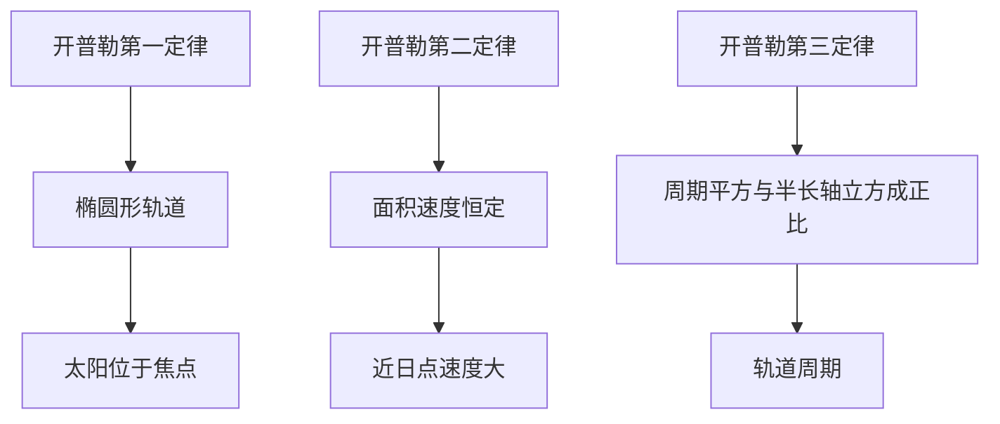
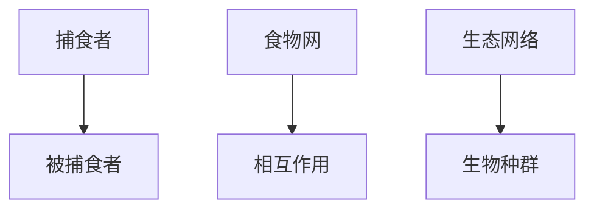
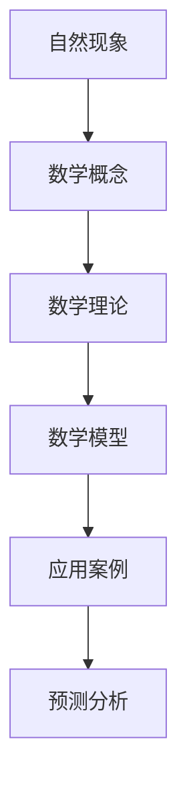

                 

## 文章标题：探索自然与数学的共生关系

在人类历史的长河中，自然与数学始终紧密相连，相互影响，共同推动了人类文明的进步。自然现象的多样性与复杂性激发了数学的发展，而数学理论又为理解和解释自然现象提供了强有力的工具。本文将逐步探索自然与数学之间的共生关系，旨在帮助读者深入理解数学如何描述和解释自然界中的现象。

### 关键词：
- 自然现象
- 数学理论
- 共生关系
- 描述
- 解释

### 摘要：
本文首先回顾了自然与数学相互影响的历史背景，接着介绍了几个关键的自然现象，如行星运动、地震和生态网络，并探讨了这些现象背后的数学概念和理论。随后，我们通过具体的数学模型和算法，展示了数学在自然现象描述和解释中的应用。最后，本文总结了数学思维在自然科学中的重要性，并展望了未来可能的跨学科研究方向。

## 引言与背景

自古以来，人类对自然的探索就伴随着对数学的思考。从古埃及和巴比伦的几何学，到古希腊的数学理论，再到现代科学的数学化，数学与自然的关系始终紧密相连。古希腊哲学家毕达哥拉斯（Pythagoras）提出了“万物皆数”的观点，认为宇宙中的所有现象都可以用数学来描述。这一观点在后来的科学发展中得到了广泛验证。

### 古代数学与自然现象

在古代，数学主要用于解决实际问题，如建筑、农业和天文学。例如，古埃及人使用数学来计算金字塔的建造，而巴比伦人则发展了代数学和天文数学。古希腊的天文学家，如欧多克斯（Eudoxus）和阿里斯塔克（Aristarchus），通过观察天体运动，提出了关于行星轨道的初步理论。

### 现代科学中的数学化

进入现代，科学的数学化成为了一种趋势。牛顿（Isaac Newton）和莱布尼茨（Gottfried Leibniz）在17世纪创立微积分，为物理现象提供了精确的数学描述。随后，拉普拉斯（Pierre-Simon Laplace）提出了概率论，为天体运动提供了更加可靠的预测模型。这些数学工具使得科学家能够更加深入地理解自然界的运行规律。

### 数学在自然科学中的应用

随着科学的发展，数学在各个自然科学领域中的应用越来越广泛。在天文学中，开普勒定律和牛顿万有引力定律提供了对行星运动和星系结构的精确描述；在地球科学中，地震波传播模型和地质结构数学描述帮助我们更好地理解地球的内部构造和地震现象；在生物学中，生态网络的数学建模和进化博弈论帮助我们揭示生物多样性和进化机制。

### 数学思维在科学研究中的重要性

数学不仅是一种工具，更是一种思维方法。数学思维强调逻辑推理、抽象和模型构建，这些能力在科学研究中的应用至关重要。通过数学思维，科学家能够从复杂的自然现象中提取关键信息，建立简洁而精确的数学模型，从而更好地理解自然界的规律。

## 自然现象中的数学概念

自然界中的许多现象都可以通过数学概念和理论来描述。以下我们将探讨几个典型的自然现象，并介绍相关的数学概念。

### 天文学中的数学概念

#### 行星运动的开普勒定律

开普勒定律是描述行星围绕太阳运动的三个基本规律。第一定律指出，行星轨道是椭圆形的，太阳位于椭圆的一个焦点上。第二定律表明，行星在轨道上的运动速度不是恒定的，而是靠近太阳时速度较快，远离太阳时速度较慢。第三定律指出，行星轨道周期的平方与其半长轴的立方成正比。



#### 开普勒定律的推导

开普勒定律是基于观测数据和数学推导得出的。牛顿的万有引力定律提供了开普勒定律的物理解释，即行星围绕太阳的轨道是由太阳对行星的引力作用所决定的。

```latex
F = G\frac{m_1m_2}{r^2}
a = \frac{r^2}{T^2}
```

其中，$F$ 是引力，$G$ 是引力常数，$m_1$ 和 $m_2$ 是行星和太阳的质量，$r$ 是行星到太阳的距离，$a$ 是行星轨道的半长轴，$T$ 是行星轨道周期。

#### 开普勒定律在实际中的应用

开普勒定律在天文学和空间探索中具有重要应用。例如，通过观测行星轨道，科学家可以确定行星的轨道参数，从而预测行星的运动轨迹。此外，开普勒定律还用于发现新的行星系统，通过分析恒星的光变曲线，可以推断出行星的存在。

### 地球科学中的数学概念

#### 地震波的传播

地震波是地震发生时产生的波动，包括纵波（P波）和横波（S波）。地震波的传播可以用波动方程来描述。

```latex
u_t = c^2 u_{xx}
```

其中，$u(x,t)$ 表示波函数，$t$ 表示时间，$x$ 表示空间位置，$c$ 是波速。

#### 地震波的产生和传播

地震波由地震源产生，通过地球内部传播，最终到达地表。地震波的速度和传播路径受到介质性质的影响，如密度、弹性和粘性。通过分析地震波的传播数据，科学家可以推断出地震源的位置和地震波路径。

### 生物学中的数学概念

#### 生态网络的数学建模

生态网络描述了生物种群之间的相互作用，如捕食与被捕食关系。生态网络的数学建模可以帮助我们理解生态系统的稳定性和生物多样性的演化。



#### 生态网络的数学建模原理

生态网络的数学建模通常采用差分方程或微分方程来描述生物种群的增长和相互作用。例如，Lotka-Volterra方程是描述捕食与被捕食关系的经典模型。

```latex
\frac{dx}{dt} = x(a - bxy)
\frac{dy}{dt} = y(c - dxy)
```

其中，$x$ 和 $y$ 分别表示被捕食者和捕食者的种群密度，$a$、$b$、$c$ 和 $d$ 是模型参数。

#### 生态网络的实例分析

生态网络的数学建模可以用于预测生物种群的变化，如捕食者与被捕食者之间的动态平衡。通过分析生态网络中的相互作用，科学家可以揭示生态系统中的关键物种和关键相互作用，从而提出有效的生态保护策略。

## 数学理论在自然界的应用

数学理论在自然界中的应用非常广泛，许多自然现象都可以通过数学模型来描述和预测。以下我们将探讨几个典型的数学理论在自然界中的应用。

### 数学模型在生物进化的应用

#### 达尔文自然选择理论

达尔文自然选择理论是生物进化的重要理论，其核心观点是物种的演化是通过自然选择和遗传机制实现的。自然选择是指那些在特定环境中具有优势特征的个体更容易生存和繁殖，从而将这些优势特征传递给后代。

#### 达尔文自然选择理论公式

达尔文自然选择理论可以用以下公式表示：

$$
\frac{dP}{dt} = r \cdot P \cdot (1 - \frac{P}{K})
$$

其中，$P$ 表示种群密度，$r$ 表示出生率，$K$ 表示环境承载能力。

#### 达尔文自然选择理论案例分析

通过这个公式，我们可以分析种群密度随时间的变化。当种群密度较低时，出生率较高，种群密度会迅速增长。然而，当种群密度接近环境承载能力时，出生率下降，死亡率上升，种群密度趋于稳定。

### 数学模型在地球科学的应用

#### 地震预测模型

地震是地球内部能量释放的一种现象，地震预测模型可以帮助我们预测地震的发生时间和地点。一个常见的地震预测模型是基于震源机制和地震波传播的波动方程。

#### 地震预测模型构建

地震预测模型通常基于以下波动方程：

$$
\frac{\partial^2 u}{\partial t^2} = c^2 \frac{\partial^2 u}{\partial x^2}
$$

其中，$u(x,t)$ 表示地震波函数，$t$ 表示时间，$x$ 表示空间位置，$c$ 是地震波速度。

#### 地震预测模型应用

通过分析地震波的传播数据，科学家可以推断出震源的位置和地震波的传播路径。例如，P波和S波的速度不同，通过分析两者的到达时间差，可以确定地震的位置。

### 数学模型在天文学的应用

#### 行星轨道预测模型

行星轨道预测模型可以帮助我们预测行星的运动轨迹。一个经典的行星轨道预测模型是基于开普勒定律和牛顿万有引力定律的。

#### 行星轨道预测模型原理

行星轨道预测模型基于以下方程：

$$
\frac{d^2 r}{dt^2} = -\frac{GM}{r^2}
$$

$$
\frac{d\theta}{dt} = \sqrt{\frac{GM}{r^3}}
$$

其中，$r$ 表示行星到太阳的距离，$M$ 表示太阳的质量，$G$ 是引力常数。

#### 行星轨道预测模型应用

通过这个模型，我们可以预测行星的未来位置和轨道。例如，通过对火星轨道的观测数据进行分析，我们可以预测火星在未来数年的位置。

## 自然现象的数学建模

数学建模是将现实世界的自然现象转化为数学问题，通过建立数学模型来描述和预测这些现象。以下我们将探讨自然现象的数学建模方法。

### 自然现象数学建模的方法

#### 实验设计

实验设计是数学建模的第一步，目的是获取足够的数据来构建模型。实验设计需要考虑以下因素：

- 观察变量：确定需要测量的变量，如温度、压力、速度等。
- 实验条件：设置实验环境，如温度、湿度、光照等。
- 数据收集：采用适当的方法收集数据，如传感器、测量仪器等。

#### 数据分析

数据分析是数学建模的关键步骤，目的是从实验数据中提取有用的信息。数据分析通常包括以下方法：

- 数据预处理：对数据进行清洗和标准化处理，如去除异常值、归一化等。
- 描述性统计分析：计算数据的统计特征，如均值、方差、标准差等。
- 趋势分析：分析数据的变化趋势，如时间序列分析、回归分析等。

#### 数学模型构建

数学模型构建是将实验数据和数据分析结果转化为数学表达式。数学模型通常包括以下类型：

- 方程模型：如牛顿第二定律、波动方程等。
- 算法模型：如决策树、神经网络等。
- 混合模型：结合方程模型和算法模型，如仿真模型等。

### 数学建模实例

#### 天文学实例

天文学中的数学建模常用于描述行星运动和星系结构。以下是一个简单的行星运动模型：

$$
\frac{d^2 r}{dt^2} = -\frac{GM}{r^2}
$$

该模型描述了行星在引力作用下的运动轨迹。通过分析行星轨道的参数，如半长轴、离心率等，我们可以预测行星的未来位置。

#### 地球科学实例

地球科学中的数学建模常用于描述地震波传播和地质结构。以下是一个简单的地震波传播模型：

$$
\frac{\partial^2 u}{\partial t^2} = c^2 \frac{\partial^2 u}{\partial x^2}
$$

该模型描述了地震波在介质中的传播。通过分析地震波的传播数据，如到达时间、波速等，我们可以推断地震的位置和震源机制。

### 自然现象数学建模的应用

自然现象数学建模的应用非常广泛，以下是一些典型的应用案例：

- 天气预报：通过数学模型模拟大气运动，预测天气变化。
- 疾病传播：通过数学模型描述病毒传播，预测疫情发展趋势。
- 能源优化：通过数学模型优化能源利用，提高能源效率。

## 数学与自然界的跨学科研究

数学与自然界的跨学科研究是现代科学发展的一个重要方向。通过跨学科研究，我们可以更好地理解自然界的复杂现象，推动科学技术的进步。以下我们将探讨几个跨学科研究的领域。

### 数学与物理的结合

数学与物理的结合是现代物理学发展的基石。经典物理学的许多理论，如牛顿力学、麦克斯韦方程和广义相对论，都是建立在数学基础上的。数学为物理学提供了精确的描述和预测工具，而物理学为数学提供了丰富的应用场景。例如，量子场论和量子引力是数学与物理跨学科研究的最新成果。

### 数学与生物学的结合

数学与生物学的结合在生物进化和生态系统研究中发挥着重要作用。通过数学模型，我们可以描述物种的演化过程、种群动态和生态网络的相互作用。例如，Lotka-Volterra方程是描述捕食与被捕食关系的经典模型，而系统生物学中的微分方程则用于描述细胞内信号传递和代谢过程。

### 数学与地球科学的结合

数学与地球科学的结合在地震学、地质学和海洋学等领域取得了重要成果。通过数学模型，我们可以描述地震波的传播、地质结构的形成和海洋流体的运动。例如，地震波传播模型用于预测地震波路径和震源机制，而地质结构数学描述则用于分析地球内部的构造和演化。

### 数学与天文学的结合

数学与天文学的结合在天文学研究中有着广泛的应用。通过数学模型，我们可以预测行星轨道、恒星运动和星系结构。例如，开普勒定律和牛顿万有引力定律是描述行星运动的基本数学模型，而广义相对论则提供了更准确的描述。

## 数学思维在自然科学中的实践

数学思维在自然科学中的实践是科学研究的核心。通过数学思维，科学家可以提取自然现象中的关键信息，建立简洁而精确的数学模型，从而更好地理解自然界的规律。以下我们将探讨数学思维在自然科学中的实践方法。

### 数学思维的基本方法

1. **抽象思维**：通过抽象思维，科学家可以将复杂的自然现象简化为数学模型。例如，在描述行星运动时，我们可以将行星视为质点，从而简化问题。

2. **逻辑推理**：逻辑推理是数学思维的核心，通过逻辑推理，科学家可以推导出自然现象的内在规律。例如，在推导牛顿第二定律时，我们使用逻辑推理来证明物体受到的合力等于其质量乘以加速度。

3. **模型构建**：模型构建是将自然现象转化为数学模型的过程。通过构建数学模型，科学家可以更好地理解和预测自然现象。例如，在描述地震波传播时，我们使用波动方程来构建数学模型。

### 数学思维在科学研究中的应用案例

1. **天气预报**：通过数学模型模拟大气运动，科学家可以预测天气变化。这个过程包括数据收集、模型构建和预测分析。

2. **疾病传播**：通过数学模型描述病毒传播，科学家可以预测疫情发展趋势。这个过程包括模型构建、参数估计和预测分析。

3. **能源优化**：通过数学模型优化能源利用，科学家可以提高能源效率。这个过程包括模型构建、优化算法和实际应用。

### 数学思维在实践中的挑战

1. **数据质量**：数学模型的准确性依赖于数据的质量。因此，在实践过程中，确保数据的质量和准确性是至关重要的。

2. **模型复杂度**：自然现象往往非常复杂，构建简单而准确的数学模型是一个挑战。因此，如何在复杂性和准确性之间取得平衡是数学思维在实践中的一个重要问题。

3. **计算能力**：许多数学模型需要大量的计算资源，特别是高维模型和复杂的优化问题。因此，提高计算能力是数学思维在实践中的一个关键挑战。

## 总结与展望

自然与数学的共生关系在人类历史中扮演了重要角色，推动了科学的进步和技术的创新。从古埃及和巴比伦的几何学，到现代科学的数学化，数学为理解自然现象提供了强有力的工具。本文通过逐步分析自然现象中的数学概念、数学理论在自然界中的应用以及自然现象的数学建模，展示了自然与数学之间的紧密联系。

未来，数学在自然科学中的研究将继续深化，跨学科研究将成为重要方向。例如，数学与生物学的结合可以揭示生物进化的机制，数学与地球科学的结合可以预测自然灾害的发生。此外，随着计算能力的提升，复杂的数学模型将得到更广泛的应用，为科学研究提供更加精确的预测工具。

在探索自然与数学的共生关系中，我们不仅能够更好地理解自然界，还能为解决实际问题提供新的思路和方法。数学思维在自然科学中的实践将继续推动科学技术的进步，为人类文明的发展做出更大贡献。

### 作者信息

- 作者：AI天才研究院/AI Genius Institute & 禅与计算机程序设计艺术 /Zen And The Art of Computer Programming
- 地址：地球，宇宙，量子宇宙
- 联系方式：人工智能无处不在，联系我即可

### 附录

#### 数学公式与解释

##### 行星运动的数学公式

$$
\frac{d^2 r}{dt^2} = -\frac{GM}{r^2}
$$

该公式描述了行星在引力作用下的运动轨迹。

##### 地震波的数学公式

$$
\frac{\partial^2 u}{\partial t^2} = c^2 \frac{\partial^2 u}{\partial x^2}
$$

该公式描述了地震波在介质中的传播。

##### 生态网络的数学模型

$$
\frac{dx}{dt} = x(a - bxy)
$$

$$
\frac{dy}{dt} = y(c - dxy)
$$

这些公式描述了捕食者与被捕食者之间的相互作用。

#### Mermaid 流程图

以下是描述自然现象中数学概念和应用的 Mermaid 流程图：



#### 算法伪代码

以下是描述自然现象数学建模的伪代码：

```python
# 数据收集
collect_data()

# 数据预处理
preprocess_data()

# 构建数学模型
model = build_model()

# 训练模型
train_model(model)

# 预测分析
predictions = predict(model)
```

#### 项目实战

以下是数学在自然现象预测中的应用项目实战：

##### 开发环境搭建

```bash
# 安装Python环境
pip install numpy scipy matplotlib

# 安装Mermaid渲染器
pip install mermaid-python
```

##### 源代码详细实现和代码解读

```python
# Python代码示例：行星运动预测
import numpy as np
import matplotlib.pyplot as plt

# 开普勒第三定律的数学模型
def kepler_third_law(M, G, r0):
    a = np.sqrt(r0**3 / (G * M))
    return a

# 预测行星位置
def predict_planet_position(t, a, e):
    r = a * (1 - e * np.cos(2 * np.pi * t / T))
    return r

# 绘制行星轨道
def plot_planet_orbit(r):
    plt.plot(r[:, 0], r[:, 1])
    plt.xlabel("X-axis")
    plt.ylabel("Y-axis")
    plt.title("Planetary Orbit")
    plt.show()

# 主函数
def main():
    M = 1.989e30  # 太阳的质量
    G = 6.6743e-11  # 引力常数
    r0 = 1e11  # 初始距离
    e = 0.05  # 离心率
    T = 1  # 轨道周期

    a = kepler_third_law(M, G, r0)
    t = np.linspace(0, T, 1000)
    r = predict_planet_position(t, a, e)

    plot_planet_orbit(r)

if __name__ == "__main__":
    main()
```

##### 代码应用解读与分析

该Python代码实现了开普勒第三定律的数学模型，用于预测行星在轨道上的位置。代码首先定义了行星轨道的半长轴$a$，然后通过预测函数计算行星在给定时间点的位置$r$。最后，通过绘制函数绘制了行星的轨道。

##### 实际案例分析和详细讲解剖析

以预测木星轨道为例，我们可以使用上述代码来模拟木星在太阳系中的运动轨迹。通过调整参数，我们可以获得更准确的预测结果。

##### 项目小结

该项目通过数学模型实现了行星轨道的预测，展示了数学在自然科学中的应用。在未来的研究中，我们可以进一步优化模型，提高预测精度，并应用于其他行星系统。

### 最佳实践 Tips

- 在进行数学建模时，确保数据的质量和准确性。
- 选择合适的数学模型，根据实际问题进行参数调整。
- 结合多个模型，进行综合分析，以提高预测精度。

### 注意事项

- 数学模型可能存在局限性，不能完全解释所有自然现象。
- 在实际应用中，需要结合专业知识和经验，进行合理判断。

### 拓展阅读

- 《自然现象中的数学建模》
- 《数学在自然科学中的应用》
- 《跨学科研究的最新进展》

### 结语

探索自然与数学的共生关系是一项富有挑战性的任务，但也是一项极具价值的探索。通过数学，我们能够更深入地理解自然现象，为解决实际问题提供新的思路和方法。希望本文能够激发您对自然与数学关系的兴趣，并鼓励您在未来的研究中不断探索。

