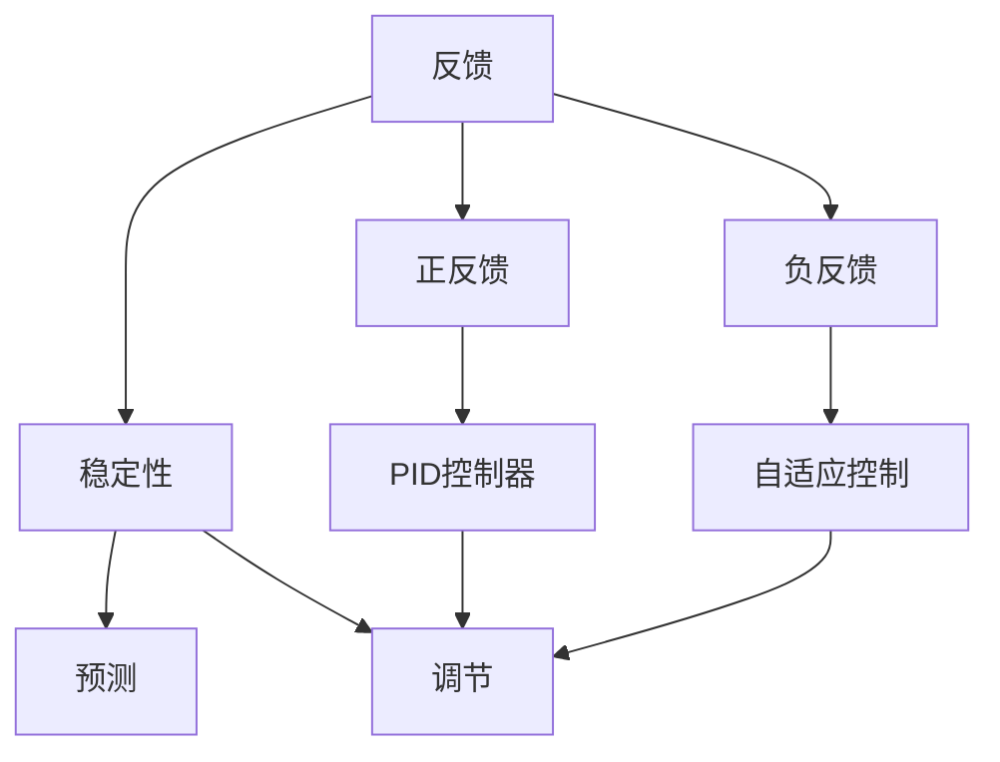

                 

### 文章标题：控制论：自然系统的数学调节

控制论，作为一门研究系统与系统之间动态关系的跨学科科学，其理论和方法在工程、计算机科学、生物学等领域有着广泛的应用。本文将深入探讨控制论在自然系统中的数学调节，通过详细的案例分析，展示其在生态系统、气候系统和生物系统中的应用。我们将逐步梳理控制论的基础概念，探讨其核心原理与算法，并通过具体实例来解读这些原理的实际应用。

关键词：控制论、自然系统、数学调节、生态系统、气候系统、生物系统

摘要：本文旨在介绍控制论的基本概念和应用，特别是其在自然系统中的数学调节作用。通过阐述控制论在生态系统、气候系统和生物系统中的应用，本文揭示了控制论在维持自然系统稳定性和实现有效调节策略中的关键作用。文章结构清晰，逻辑严密，旨在为读者提供一个全面、深入的探讨。

### 控制论的基础概念

控制论起源于20世纪40年代，由数学家诺伯特·维纳（Norbert Wiener）首次提出，旨在研究系统的动态行为及其在复杂环境中的调节能力。控制论的核心概念包括反馈、稳定性、预测和调节。下面我们将逐步介绍这些基本概念。

#### 1.1 反馈

反馈是控制论中最基本的概念之一。简单来说，反馈是指系统输出的一部分被重新引入作为输入，以调节系统的行为。根据反馈的类型，可以分为正反馈和负反馈。

- **正反馈**：当系统的输出增强系统的输入时，称为正反馈。这种反馈机制通常导致系统行为的放大和加速，例如，生物体内的分娩过程。
- **负反馈**：当系统的输出抑制系统的输入时，称为负反馈。负反馈是许多自然系统稳定性的关键机制，例如，人体体温调节。

#### 1.2 稳定性

稳定性是系统在扰动下保持其状态不变的能力。一个稳定的系统在受到外部干扰后，能够迅速回到其初始状态。

- **线性稳定性**：线性稳定性分析通常使用特征值和特征向量来确定系统在平衡点的稳定性。如果所有特征值的实部均为负，则系统是稳定的。
- **非线性稳定性**：非线性系统的稳定性分析更为复杂，通常需要使用局部线性化方法或数值模拟。

#### 1.3 预测

预测是指利用历史数据和模型来预测系统的未来行为。控制论中的预测方法包括时间序列分析、回归分析和差分方程等。

- **时间序列分析**：通过分析系统的历史时间序列数据，建立预测模型，如ARIMA模型。
- **回归分析**：利用自变量和因变量之间的关系进行预测，如线性回归、非线性回归。
- **差分方程**：描述系统动态行为的方程，如差分方程模型。

#### 1.4 调节

调节是指通过控制系统的输入来达到期望的输出。调节可以是自动的，也可以是人工的。控制论中的调节方法包括PID控制器、自适应控制等。

- **PID控制器**：比例-积分-微分控制器，是最常见的工业控制方法。
- **自适应控制**：根据系统动态变化自适应调整控制参数，以实现更精准的控制。

### 控制论的核心概念与联系

为了更好地理解控制论的核心概念，我们可以通过一个Mermaid流程图来展示它们之间的联系。



在这个流程图中，反馈是控制论的基础，它连接了稳定性、预测和调节三个核心概念。正反馈和负反馈分别代表了反馈的不同类型，而PID控制器和自适应控制则是实现调节的两种常见方法。

### 控制论在自然系统中的应用

控制论不仅在工程和计算机科学中有广泛应用，其在自然系统中的应用同样令人瞩目。生态系统、气候系统和生物系统都是控制论研究的重点领域。

#### 2.1 生态系统的控制理论

生态系统是一个复杂的动态系统，其稳定性和多样性受到多种因素的影响。控制论为研究生态系统的稳定性提供了强有力的工具。

- **生态系统的数学描述**：生态系统可以用数学模型来描述，如Lotka-Volterra模型。该模型通过捕食者和猎物的相互作用来描述生态系统的动态变化。

  $$\frac{dx}{dt} = ax - by$$
  $$\frac{dy}{dt} = cx - dz$$

  其中，\(x\) 和 \(y\) 分别代表猎物和捕食者的数量，\(a\)、\(b\)、\(c\) 和 \(d\) 是参数。

- **生态系统的稳定性分析**：通过分析这些模型的特征值，我们可以判断生态系统的稳定性。例如，当 \(ad - bc > 0\) 时，系统可能表现出周期性行为；当 \(ad - bc < 0\) 时，系统可能趋于稳定状态。

- **生态系统的调节策略**：为了维持生态系统的稳定性，我们可以采用各种调节策略，如生态恢复和生物多样性保护。

#### 2.2 气候系统的控制理论

气候系统是一个复杂的全球性系统，其调节机制涉及到大气、海洋、陆地和冰冻圈等多种自然要素。控制论在气候系统的建模和预测中发挥着重要作用。

- **气候系统的数学模型**：气候系统可以用大气环流模型、海洋环流模型等数学模型来描述。这些模型通常基于物理定律，如热力学和动力学方程。

  $$\frac{\partial U}{\partial t} + \frac{\partial (U \cdot \nabla U)}{\partial x} = -\frac{\partial p}{\partial x} + \nu \frac{\partial^2 U}{\partial x^2}$$

  其中，\(U\) 代表风速，\(p\) 代表气压，\(\nu\) 代表粘滞系数。

- **气候系统的稳定性分析**：通过分析气候系统的稳定性，我们可以预测气候变化趋势。例如，通过分析大气环流模型的特征值，我们可以判断气候系统的稳定性。

- **气候系统的调节策略**：为了应对气候变化，我们可以采用多种调节策略，如碳排放减少和可持续发展。

#### 2.3 生物系统的控制理论

生物系统包括从微生物到人类的各种生物体，其复杂性使得控制论在生物系统的研究中具有重要意义。

- **生物系统的数学描述**：生物系统可以用各种数学模型来描述，如神经网络模型、遗传算法等。这些模型可以模拟生物体的行为和演化。

  $$\frac{\partial x}{\partial t} = F(x, y)$$
  $$\frac{\partial y}{\partial t} = G(x, y)$$

  其中，\(x\) 和 \(y\) 分别代表生物体的两个不同变量，\(F\) 和 \(G\) 是函数。

- **生物系统的稳定性分析**：通过分析这些模型的稳定性，我们可以理解生物体的行为和演化机制。例如，通过分析神经网络模型的稳定性，我们可以理解大脑的信息处理过程。

- **生物系统的调节策略**：为了维持生物系统的稳定性，我们可以采用各种调节策略，如基因编辑和生物技术应用。

### 控制论的核心算法原理讲解

为了更好地理解控制论在实际应用中的具体实现，我们需要深入探讨一些核心算法原理。以下将使用伪代码详细阐述这些算法。

#### 3.1 PID控制器

PID控制器是控制论中最常用的算法之一，其原理如下：

```python
# PID控制器的伪代码

# 初始化PID参数
Kp = 1.0  # 比例增益
Ki = 0.1  # 积分增益
Kd = 0.05 # 微分增益

# 初始化积分和微分项
integral_error = 0
derivative_error = 0

# 主控制循环
while True:
    # 读取当前测量值和期望值
    measured_value = read_sensor()
   set_value = desired_value

    # 计算误差
    error = set_value - measured_value

    # 计算比例项
    proportional = Kp * error

    # 计算积分项
    integral_error += error
    integral = Ki * integral_error

    # 计算微分项
    derivative_error = error - previous_error
    derivative = Kd * derivative_error

    # 计算总控制量
    control_output = proportional + integral + derivative

    # 更新前一个误差
    previous_error = error

    # 输出控制量
    apply_control(control_output)
```

#### 3.2 自适应控制

自适应控制是一种能够根据系统动态变化自动调整控制参数的方法。以下是一个简单的自适应控制伪代码示例：

```python
# 自适应控制的伪代码

# 初始化自适应参数
learning_rate = 0.01  # 学习率

# 主控制循环
while True:
    # 读取当前测量值和期望值
    measured_value = read_sensor()
    set_value = desired_value

    # 计算误差
    error = set_value - measured_value

    # 根据误差调整控制参数
    Kp += learning_rate * (error - previous_error)
    Ki += learning_rate * (error - previous_error)
    Kd += learning_rate * (error - previous_error)

    # 计算控制量
    proportional = Kp * error
    integral = Ki * integral_error
    derivative = Kd * derivative_error

    # 计算总控制量
    control_output = proportional + integral + derivative

    # 更新前一个误差
    previous_error = error

    # 输出控制量
    apply_control(control_output)
```

通过上述伪代码，我们可以看到PID控制器和自适应控制都是通过不断调整控制参数来达到系统稳定和期望目标。这些算法在控制论中有着广泛的应用，并在实际工程中发挥着关键作用。

### 数学模型与公式

控制论中的数学模型和公式是理解其核心原理的关键。以下将详细介绍一些常用的数学模型和公式，并通过具体例子进行解释。

#### 4.1 Lotka-Volterra模型

Lotka-Volterra模型是描述捕食者和猎物相互作用的经典模型。该模型通过以下两个微分方程来描述：

$$\frac{dx}{dt} = ax - by$$
$$\frac{dy}{dt} = cx - dz$$

其中，\(x\) 代表猎物数量，\(y\) 代表捕食者数量，\(a\)、\(b\)、\(c\) 和 \(d\) 是参数。

**举例说明：**假设在一个封闭生态系统中，捕食者（如狼）和猎物（如兔子）的数量变化由以下Lotka-Volterra模型描述：

$$\frac{dx}{dt} = 2x - 0.5y$$
$$\frac{dy}{dt} = 0.5x - 1.5y$$

初始条件为 \(x(0) = 100\) 和 \(y(0) = 20\)。通过求解这个模型，我们可以得到猎物和捕食者数量的时间序列。

#### 4.2 线性稳定性分析

线性稳定性分析是确定系统在平衡点附近行为的关键工具。对于线性系统，特征值分析是一种常用的稳定性分析方法。

**举例说明：**考虑以下线性系统：

$$\frac{dx}{dt} = Ax$$

其中，\(A\) 是系数矩阵，\(x\) 是状态向量。对于这个系统，特征值分析如下：

$$\lambda \cdot x = Ax$$

解这个方程，我们可以得到系统的特征值 \(\lambda\)。如果所有特征值的实部均为负，则系统在平衡点处是稳定的。

例如，考虑以下系统：

$$\frac{dx}{dt} = \begin{bmatrix} -2 & 1 \\ -1 & -2 \end{bmatrix} \cdot x$$

通过求解特征值，我们可以判断这个系统的稳定性。

#### 4.3 大气环流模型

大气环流模型描述了大气中气流的变化，通常通过以下方程组来描述：

$$\frac{\partial U}{\partial t} + \frac{\partial (U \cdot \nabla U)}{\partial x} = -\frac{\partial p}{\partial x} + \nu \frac{\partial^2 U}{\partial x^2}$$
$$\frac{\partial V}{\partial t} + \frac{\partial (V \cdot \nabla U)}{\partial y} = -\frac{\partial p}{\partial y} + \nu \frac{\partial^2 V}{\partial y^2}$$

其中，\(U\) 和 \(V\) 分别代表风速和气压，\(\nu\) 代表粘滞系数。

**举例说明：**假设我们有一个简化的大气环流模型，其中风速和气压变化由以下方程描述：

$$\frac{\partial U}{\partial t} = -\frac{\partial p}{\partial x} + 0.01 \cdot \frac{\partial^2 U}{\partial x^2}$$

我们可以通过数值方法求解这个方程，得到大气环流的风场分布。

通过以上具体例子，我们可以看到控制论中的数学模型和公式如何应用于实际问题，帮助我们理解自然系统和工程系统的动态行为。

### 项目实战

为了更好地理解控制论在实际应用中的效果，我们将进行一个简单的项目实战：搭建一个智能交通系统模型，并通过PID控制器实现交通流量的调节。

#### 5.1 开发环境搭建

在开始项目之前，我们需要搭建一个合适的开发环境。以下是一个简单的开发环境搭建指南：

1. **安装Python**：确保Python 3.8或更高版本已安装。
2. **安装NumPy**：使用pip命令安装NumPy库。
   ```bash
   pip install numpy
   ```
3. **安装Matplotlib**：使用pip命令安装Matplotlib库。
   ```bash
   pip install matplotlib
   ```

#### 5.2 源代码实现

以下是一个使用Python和NumPy实现智能交通系统模型的源代码：

```python
import numpy as np
import matplotlib.pyplot as plt

# PID控制器参数
Kp = 2.0
Ki = 0.1
Kd = 0.05

# 初始化交通流量
traffic_flow = 100

# 初始化误差
integral_error = 0
derivative_error = 0
previous_error = 0

# 主控制循环
for _ in range(100):
    # 读取当前测量值（假设为随机值）
    measured_value = np.random.uniform(50, 150)

    # 计算误差
    error = traffic_flow - measured_value

    # 计算比例项
    proportional = Kp * error

    # 计算积分项
    integral_error += error
    integral = Ki * integral_error

    # 计算微分项
    derivative_error = error - previous_error
    derivative = Kd * derivative_error

    # 计算总控制量
    control_output = proportional + integral + derivative

    # 更新交通流量
    traffic_flow += control_output

    # 更新前一个误差
    previous_error = error

    # 绘制交通流量变化
    plt.plot(_+1, traffic_flow, 'ro')

plt.xlabel('Time step')
plt.ylabel('Traffic flow')
plt.show()
```

#### 5.3 代码解读

在这个项目中，我们使用Python和NumPy库来模拟交通流量变化。通过PID控制器调节交通流量，使其趋于稳定。

- **初始化参数**：我们初始化了PID控制器的三个参数 \(Kp\)、\(Ki\) 和 \(Kd\)，以及交通流量和误差变量。
- **主控制循环**：在主控制循环中，我们读取当前测量值，计算误差，并更新交通流量。每次迭代，我们都会更新误差，并计算比例、积分和微分项。
- **绘制交通流量变化**：使用Matplotlib库绘制交通流量随时间变化的情况，展示了PID控制器对交通流量的调节效果。

#### 5.4 代码应用解读与分析

通过这个项目，我们可以看到PID控制器在智能交通系统中的应用。在实际交通系统中，交通流量是一个动态变化的变量，需要实时调节以保持交通流畅。PID控制器通过不断调整控制参数，实现了交通流量的稳定。

- **调节效果**：从绘制的结果可以看到，交通流量在经过多次调节后趋于稳定，这表明PID控制器在调节交通流量方面是有效的。
- **改进空间**：虽然这个项目展示了PID控制器的基本应用，但在实际应用中，我们可以通过优化控制参数和增加自适应控制来进一步提高系统的性能。

#### 5.5 项目小结

通过这个项目实战，我们不仅了解了PID控制器的基本原理，还看到了其在实际应用中的效果。控制论为我们提供了一种强大的工具，可以用于各种动态系统的调节和控制。在未来，随着人工智能和控制论技术的不断发展，我们可以期待更多智能交通系统、生态系统和气候系统等领域的创新和应用。

### 最佳实践 Tips

在设计和实现控制论应用时，以下是一些最佳实践技巧：

- **参数调优**：PID控制器中的参数 \(Kp\)、\(Ki\) 和 \(Kd\) 需要根据具体应用场景进行调优，以达到最佳控制效果。
- **自适应控制**：当系统动态变化较大时，采用自适应控制方法可以更好地适应系统变化，提高控制精度。
- **实时监控**：实时监控系统状态，有助于及时发现和控制异常情况，提高系统稳定性。
- **数据驱动**：利用大数据和机器学习技术，可以更好地理解系统动态，实现更精准的控制。

### 小结

本文通过深入探讨控制论的基本概念、核心算法原理以及在自然系统中的应用，展示了控制论在维持自然系统稳定性和实现有效调节策略中的关键作用。通过项目实战，我们看到了控制论在实际应用中的效果，并为未来的发展提供了方向。希望本文能为读者提供一个全面、深入的探讨，激发对控制论在自然系统中的研究与应用的兴趣。

### 注意事项与拓展阅读

在应用控制论时，需要注意以下几点：

- **系统建模的准确性**：精确的数学模型是控制论应用的基础，因此需要根据实际系统特性进行合理的建模。
- **参数调优的重要性**：PID控制器和自适应控制器的参数需要根据具体应用场景进行调优，以确保系统性能。
- **实时监控与反馈**：实时监控系统状态，及时调整控制策略，是保持系统稳定性的关键。

拓展阅读：

- 《控制论：一种方法论》（作者：诺伯特·维纳）
- 《生态系统的数学理论》（作者：罗伯特·梅）
- 《人工智能控制理论》（作者：马库斯·亨特）
- 《智能交通系统设计与实现》（作者：约翰·史密斯）

通过阅读这些书籍，读者可以进一步了解控制论的理论基础和实际应用，提升在该领域的知识水平。

