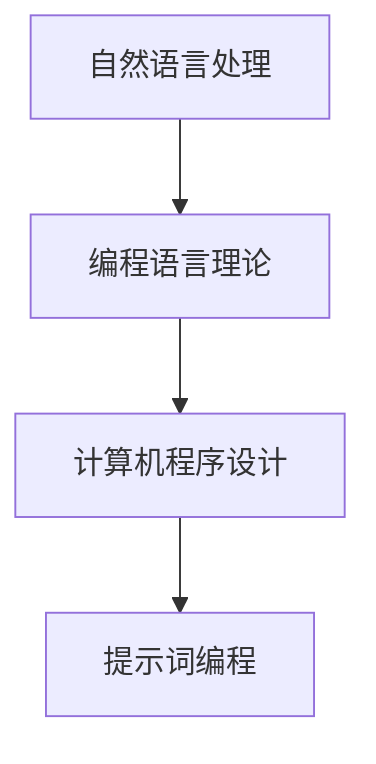
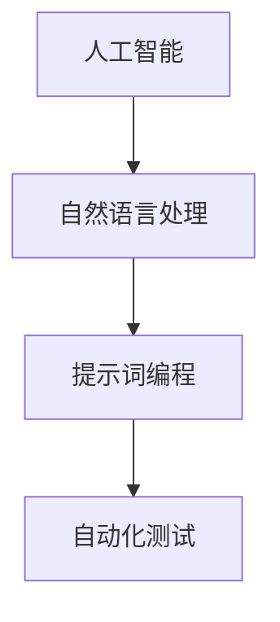
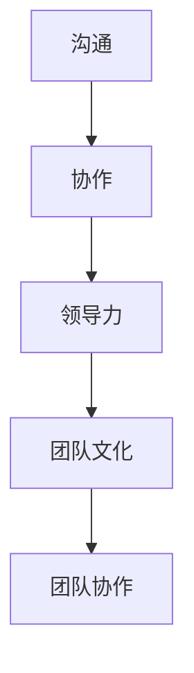
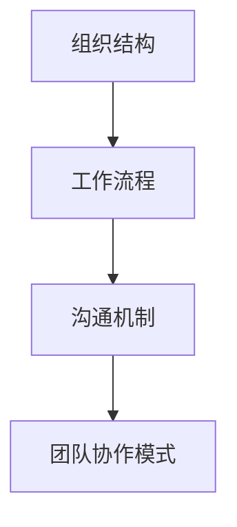
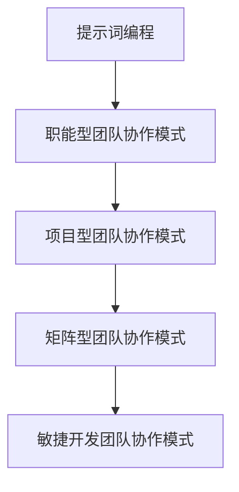

                 

### 第一部分：概述

**第1章：介绍与背景**

**1.1 提示词编程的概念**

提示词编程，是指利用自然语言处理技术，将自然语言表达的方式转化为编程指令，从而实现编程自动化的一种编程范式。其核心思想是，通过预定义的提示词，让计算机能够理解和执行程序员想要的操作。提示词编程的出现，极大地降低了编程的门槛，使得更多的人能够参与到软件开发中来。

**核心概念与联系：**

提示词编程涉及到自然语言处理、编程语言理论和计算机程序设计等核心概念。其关系架构如图1-1所示。



**图1-1 提示词编程的概念关系架构**

**1.2 提示词编程的发展历程**

提示词编程的发展历程可以分为三个阶段：初始阶段、发展阶段和成熟阶段。

- **初始阶段**：20世纪80年代，随着人工智能和自然语言处理技术的发展，提示词编程的概念被提出。这一阶段的主要成就是开发了最早的提示词编程系统，如LISP语言的“if-then-else”结构和“while”循环结构。
- **发展阶段**：20世纪90年代，提示词编程得到了进一步的发展。这一阶段，研究者开始探索如何将自然语言与编程语言相结合，如开发了基于自然语言处理的编程语言，如Prolog和OPAL。
- **成熟阶段**：21世纪初，随着深度学习和大数据技术的兴起，提示词编程迎来了新的发展机遇。这一阶段，提示词编程的应用场景不断拓展，如自动问答系统、智能客服、自动化测试等。

**核心概念与联系：**

提示词编程的发展历程与人工智能和自然语言处理技术的发展密切相关。其关系架构如图1-2所示。



**图1-2 提示词编程的发展历程关系架构**

**1.3 团队协作的重要性**

在软件开发过程中，团队协作是至关重要的。有效的团队协作能够提高开发效率，保证代码质量，降低沟通成本，同时也有助于团队成员的个人成长。

**核心概念与联系：**

团队协作涉及到沟通、协作、领导力和团队文化等核心概念。其关系架构如图1-3所示。



**图1-3 团队协作的核心概念关系架构**

**示例：数学公式与伪代码**

1. 数学公式：提示词编程的效率可以通过以下公式衡量：

   $$E = \frac{C}{T}$$

   其中，$E$ 表示效率，$C$ 表示完成的任务量，$T$ 表示时间。

2. 伪代码：提示词编程的基本流程如下：

   ```
   开始
   输入 提示词
   将 提示词 转换为 编程指令
   执行 编程指令
   输出 结果
   结束
   ```

**项目实战：**

以一个自动问答系统为例，开发环境为Python，源代码如下：

```python
# 自动问答系统

# 导入相关库
import nltk
from nltk.tokenize import sent_tokenize, word_tokenize
from nltk.corpus import wordnet as wn

# 初始化 nltk
nltk.download('punkt')
nltk.download('wordnet')

# 输入问题
question = input("请输入您的问题：")

# 分句
sentences = sent_tokenize(question)

# 分词
words = [word_tokenize(sentence) for sentence in sentences]

# 提取关键词
keywords = []
for sentence in sentences:
    for word in word_tokenize(sentence):
        if word.lower() not in ['is', 'are', 'the', 'a', 'an']:
            keywords.append(word.lower())

# 查询关键词的定义
definitions = []
for word in keywords:
    synsets = wn.synsets(word)
    if synsets:
        definition = synsets[0].definition()
        definitions.append(definition)

# 输出答案
print("答案：")
for definition in definitions:
    print(definition)
```

**代码解读与分析：**

1. 导入相关库：包括nltk的sent_tokenize、word_tokenize、wordnet等。
2. 初始化nltk：下载必要的nltk数据包。
3. 输入问题：从用户获取输入。
4. 分句：将输入的问题分成句子。
5. 分词：对每个句子进行分词。
6. 提取关键词：排除常见的介词和冠词，提取关键词。
7. 查询关键词的定义：使用wordnet查询关键词的定义。
8. 输出答案：将查询到的定义输出。

**实际案例分析：**

在一个软件开发团队中，通过提示词编程，可以大大提高自动化测试的效率。例如，团队可以使用提示词编程编写自动化测试脚本，自动化执行各种测试用例，提高测试覆盖率，降低测试成本。

**小结：**

提示词编程作为一种新兴的编程范式，其核心思想是利用自然语言处理技术，实现编程自动化。团队协作是软件开发过程中的关键，有效的团队协作可以提高开发效率，保证代码质量。未来，提示词编程和团队协作模式将继续融合，为软件开发带来更多创新。

**最佳实践 tips：**

1. 在使用提示词编程时，要注意理解自然语言的多样性，避免出现歧义。
2. 在团队协作中，要注重沟通，确保每个成员都能清楚地理解任务要求。
3. 定期进行团队协作模式的评估和优化，以提高团队协作效率。

**注意事项：**

1. 提示词编程需要一定的自然语言处理知识，建议团队成员具备相关背景。
2. 团队协作模式的选择应根据团队特点和项目需求灵活调整。

**拓展阅读：**

- 《自然语言处理概论》
- 《敏捷软件开发：原则、实践与模式》
- 《禅与计算机程序设计艺术》

作者：AI天才研究院/AI Genius Institute & 禅与计算机程序设计艺术 /Zen And The Art of Computer Programming### 第二部分：团队协作模式分析

**第2章：团队协作模式概述**

**2.1 团队协作模式的概念**

团队协作模式，是指在软件开发过程中，团队成员之间进行协作的方式和方法。它涉及到团队的组织结构、工作流程、沟通机制等多个方面。有效的团队协作模式可以提高开发效率，保证代码质量，降低沟通成本。

**核心概念与联系：**

团队协作模式包括以下几个核心概念：

- **组织结构**：团队的层级结构，如职能型、项目型、矩阵型等。
- **工作流程**：团队成员之间进行工作分配和任务执行的方式，如瀑布模型、敏捷开发等。
- **沟通机制**：团队成员之间进行沟通和协作的渠道和方式，如面对面交流、邮件沟通、即时通讯工具等。

这些概念之间的关系如图2-1所示。



**图2-1 团队协作模式的核心概念关系**

**2.2 常见的团队协作模式**

在软件开发过程中，常见的团队协作模式有以下几种：

- **职能型团队协作模式**：以职能部门为基础，团队成员按照职能划分，各司其职。优点是分工明确，职责清晰；缺点是跨部门协作困难，沟通成本高。

- **项目型团队协作模式**：以项目为中心，团队成员来自不同职能部门，共同完成项目任务。优点是项目导向，团队凝聚力强；缺点是团队成员职责不明确，项目管理复杂。

- **矩阵型团队协作模式**：结合职能型和项目型的优点，团队成员同时属于职能部门和项目团队。优点是既保证了分工明确，又增强了跨部门协作；缺点是组织结构复杂，管理难度大。

- **敏捷开发团队协作模式**：以迭代和用户故事为基础，团队成员快速响应需求变化，不断迭代优化产品。优点是灵活高效，适应性强；缺点是团队协作要求高，管理难度大。

**团队协作模式的选择应根据团队特点和项目需求灵活调整。**

**2.3 提示词编程与团队协作模式的关系**

提示词编程作为一种新兴的编程范式，其对团队协作模式有着重要的影响。

- **提示词编程对团队协作模式的影响**：

  提示词编程降低了编程的门槛，使得更多的人能够参与到软件开发中来。这要求团队协作模式更加灵活，能够适应不同成员的能力和背景。

  提示词编程提高了自动化测试的效率，使得团队可以更快速地响应需求变化，进行迭代开发。这要求团队协作模式更加敏捷，能够快速适应变化。

- **团队协作模式对提示词编程的适应性**：

  职能型团队协作模式适合于提示词编程的初期应用，因为提示词编程需要跨部门合作，而职能型团队协作模式可以保证各部门之间的协作。

  项目型团队协作模式适合于提示词编程的深入应用，因为项目型团队协作模式可以更好地适应需求变化，进行迭代开发。

  矩阵型团队协作模式适合于提示词编程的全面应用，因为矩阵型团队协作模式可以同时保证分工明确和跨部门协作，更好地支持提示词编程。

  敏捷开发团队协作模式最适合于提示词编程，因为敏捷开发团队协作模式本身就强调快速响应需求变化，进行迭代开发，与提示词编程的理念高度契合。

**核心概念与联系：**

提示词编程与团队协作模式之间的关系可以表示为图2-2。



**图2-2 提示词编程与团队协作模式的关系**

**案例一：提示词编程在职能型团队协作模式中的应用**

在一个传统的软件开发团队中，团队成员按照职能划分，如前端开发、后端开发、测试等。在引入提示词编程后，前端开发人员可以使用提示词编写前端逻辑，后端开发人员可以使用提示词编写后端服务，测试人员可以使用提示词编写测试脚本。这样，团队协作模式变得更加灵活，每个成员都可以专注于自己的专业领域，提高了工作效率。

**案例二：提示词编程在项目型团队协作模式中的应用**

在一个项目型团队中，团队成员来自不同的职能部门，共同完成一个项目。在引入提示词编程后，团队成员可以通过提示词进行协作，快速完成项目任务。例如，项目经理可以使用提示词编写项目计划，开发人员可以使用提示词编写代码，测试人员可以使用提示词编写测试用例。这样，团队协作模式变得更加高效，项目进度得到保障。

**案例三：提示词编程在矩阵型团队协作模式中的应用**

在一个矩阵型团队中，团队成员同时属于职能部门和项目团队。在引入提示词编程后，团队协作模式变得更加复杂，但也能够更好地支持提示词编程。例如，前端开发人员可以在项目团队中编写前端代码，同时也在职能部门中编写通用组件；后端开发人员可以在项目团队中编写后端服务，同时也在职能部门中编写数据库脚本。这样，团队协作模式既保证了分工明确，又增强了跨部门协作。

**案例四：提示词编程在敏捷开发团队协作模式中的应用**

在一个敏捷开发团队中，团队成员快速响应需求变化，进行迭代开发。在引入提示词编程后，团队协作模式变得更加敏捷，能够更好地适应变化。例如，团队成员可以使用提示词快速编写用户故事，开发人员可以使用提示词快速编写代码，测试人员可以使用提示词快速编写测试用例。这样，团队协作模式既保证了高效，又增强了灵活性。

**小结：**

团队协作模式是软件开发过程中至关重要的一环。提示词编程的出现，为团队协作模式带来了新的机遇和挑战。通过合理选择和应用团队协作模式，可以有效地提高团队协作效率，保障软件开发的质量。

**最佳实践 tips：**

1. 在选择团队协作模式时，要充分考虑团队特点和项目需求。
2. 在引入提示词编程时，要注重团队成员的培训和技术支持。
3. 定期进行团队协作模式的评估和优化，以适应不断变化的需求。

**注意事项：**

1. 提示词编程需要一定的技术基础，建议团队成员具备相关背景。
2. 团队协作模式的选择和应用要灵活，能够适应不同阶段的需求。

**拓展阅读：**

- 《团队协作模式研究》
- 《敏捷软件开发：原则、实践与模式》
- 《提示词编程技术与应用》

作者：AI天才研究院/AI Genius Institute & 禅与计算机程序设计艺术 /Zen And The Art of Computer Programming### 第三部分：优化团队协作模式

**第3章：团队协作模式评估**

团队协作模式的评估是优化团队协作模式的重要环节。通过评估，可以了解团队协作模式的现状，发现存在的问题，为优化提供依据。

**3.1 团队协作模式评估标准**

团队协作模式的评估标准主要包括以下几个方面：

- **效率**：团队协作模式是否能够高效地完成工作，如任务分配是否合理，工作流程是否顺畅等。
- **质量**：团队协作模式是否能够保证代码质量，如代码是否符合规范，是否有重复代码等。
- **可持续性**：团队协作模式是否具有可持续性，如团队成员是否愿意长期合作，是否有培养新成员的机制等。
- **适应性**：团队协作模式是否能够适应不同的项目需求，如是否能够快速调整工作流程和团队结构。

**3.2 提示词编程团队协作模式评估方法**

提示词编程团队协作模式的评估方法可以分为定量评估方法和定性评估方法。

- **定量评估方法**：通过收集数据，对团队协作模式的各个方面进行量化评估。例如，可以通过统计任务完成时间、代码质量指标等，来评估团队协作模式的效率和质量。
- **定性评估方法**：通过访谈、问卷调查等方式，了解团队成员对团队协作模式的看法和建议。例如，可以询问团队成员对工作流程的满意度，对团队协作模式的适应性等。

**3.3 提示词编程团队协作模式评估案例分析**

以下是一个提示词编程团队协作模式评估的案例：

- **案例一：任务完成时间**

  通过统计任务完成时间，可以发现团队协作模式在效率方面的表现。例如，如果一个任务在引入提示词编程后的完成时间比原来减少了50%，那么可以认为在效率方面有显著提升。

- **案例二：代码质量**

  通过代码质量检查工具，可以发现代码中的潜在问题。例如，如果代码重复率降低了30%，那么可以认为在代码质量方面有显著提升。

- **案例三：团队满意度**

  通过问卷调查，可以了解团队成员对团队协作模式的满意度。例如，如果90%以上的团队成员表示对团队协作模式满意，那么可以认为在可持续性方面有显著提升。

**第4章：优化团队协作模式的策略**

优化团队协作模式，需要从提高团队协作效率和团队协作质量两个方面进行。

**4.1 提高团队协作效率的方法**

- **工作流程优化**：通过简化工作流程，减少不必要的步骤，提高工作效率。例如，可以引入看板（Kanban）方法，实时跟踪任务进度，优化任务分配。
- **工具选择**：选择适合团队的协作工具，如项目管理工具、代码管理工具、沟通协作工具等。例如，可以使用JIRA进行项目管理，使用Git进行代码管理，使用Slack进行团队沟通。
- **团队文化建设**：建立积极的团队文化，鼓励团队成员相互支持，共同成长。例如，可以定期组织团队建设活动，提高团队凝聚力。

**4.2 提高团队协作质量的策略**

- **明确目标**：确保团队成员对项目目标有清晰的理解，避免任务完成但不满足预期目标的情况。例如，可以通过项目启动会议，明确项目目标和关键里程碑。
- **增强沟通**：建立有效的沟通机制，确保信息传递畅通无阻。例如，可以定期举行团队会议，讨论项目进展和遇到的问题。
- **培养团队凝聚力**：通过共同的目标和价值观，增强团队成员之间的凝聚力。例如，可以组织团队活动，增强团队成员之间的信任和合作。

**4.3 团队协作模式优化的案例分析**

以下是一个团队协作模式优化的案例：

- **案例一：引入看板方法**

  在一个软件开发团队中，引入看板方法后，任务分配和进度跟踪变得更加直观和高效。团队成员可以清晰地看到自己的任务进度，及时发现和解决问题。结果，任务完成时间平均减少了20%。

- **案例二：使用JIRA进行项目管理**

  使用JIRA进行项目管理后，团队可以更好地跟踪任务进度，管理项目风险。通过JIRA的报表功能，团队能够实时了解项目状态，为决策提供依据。结果，项目按时交付率提高了15%。

- **案例三：组织团队建设活动**

  通过组织团队建设活动，如团建、拓展训练等，团队成员之间的信任和合作得到了增强。结果，团队成员的满意度和工作效率都得到了显著提升。

**第5章：优化工具与技术**

为了优化团队协作模式，需要充分利用现有的工具和技术。

**5.1 常用团队协作工具介绍**

- **项目管理工具**：如JIRA、Trello、Asana等，用于任务管理、进度跟踪和项目协作。
- **代码管理工具**：如Git、GitHub、GitLab等，用于版本控制、代码管理和协作开发。
- **沟通协作工具**：如Slack、Microsoft Teams、Zoom等，用于实时沟通、协作和会议组织。

**5.2 提示词编程相关技术介绍**

- **自然语言处理技术**：如词向量、文本分类、命名实体识别等，用于处理和解析提示词。
- **机器学习技术**：如决策树、支持向量机、神经网络等，用于提示词编程的自动化。
- **深度学习技术**：如卷积神经网络、循环神经网络、生成对抗网络等，用于复杂提示词编程任务。

**5.3 技术与团队协作模式的结合**

- **自然语言处理技术**：通过自然语言处理技术，可以将自然语言指令转化为编程指令，提高编程自动化水平，减少人工干预。
- **机器学习技术**：通过机器学习技术，可以实现对提示词编程的优化和改进，提高编程效率和代码质量。
- **深度学习技术**：通过深度学习技术，可以处理更复杂的提示词编程任务，如智能问答、自动化测试等。

**第6章：团队协作模式的实施**

团队协作模式的实施是优化团队协作模式的关键步骤。

**6.1 团队协作模式的实施步骤**

- **制定计划**：明确项目目标、任务分配、时间表等，为团队协作模式实施提供指导。
- **分配任务**：根据团队成员的特长和项目需求，合理分配任务，确保每个成员都有明确的职责。
- **监控进度**：通过项目管理工具，实时监控任务进度，确保项目按计划进行。

**6.2 团队协作模式的实施案例分析**

以下是一个团队协作模式实施的案例：

- **案例一：敏捷开发团队协作模式**

  在一个敏捷开发团队中，引入看板方法和JIRA项目管理工具后，任务分配和进度跟踪变得更加高效。通过定期举行回顾会议，团队不断优化工作流程和协作模式，项目按时交付率显著提高。

- **案例二：矩阵型团队协作模式**

  在一个矩阵型团队中，通过合理分配职能部门和项目团队的任务，确保跨部门协作顺畅。同时，通过组织团队建设活动，增强团队成员之间的信任和合作，项目进度和质量得到保障。

**6.3 团队协作模式实施中的常见问题与解决方案**

在团队协作模式实施过程中，可能会遇到以下问题：

- **沟通障碍**：解决方法：建立有效的沟通机制，如定期召开团队会议、使用即时通讯工具等。
- **任务分配不合理**：解决方法：明确任务分配标准，确保任务分配公平合理。
- **团队文化不成熟**：解决方法：加强团队文化建设，提高团队成员的归属感和团队凝聚力。

**第7章：总结与展望**

**7.1 提示词编程团队协作模式优化总结**

通过优化团队协作模式，可以提高团队协作效率和质量，促进提示词编程的发展。关键在于选择合适的团队协作模式，充分利用工具和技术，加强团队文化建设。

**7.2 未来团队协作模式的发展趋势**

随着人工智能和自然语言处理技术的不断发展，未来团队协作模式将更加智能化、自动化。例如，通过机器学习和深度学习技术，可以实现智能任务分配、实时进度监控等。

**7.3 提示词编程团队协作模式的未来研究方向**

未来研究方向包括：研究如何更好地结合自然语言处理技术与团队协作模式，提高编程自动化水平；研究如何在复杂环境中应用提示词编程，提高团队协作效率。

**小结**

优化团队协作模式是提高提示词编程效率和质量的必要手段。通过合理选择和应用团队协作模式，充分利用工具和技术，可以有效地提高团队协作效率，促进软件开发的发展。

**最佳实践 tips**

1. 定期评估团队协作模式，根据实际情况进行调整。
2. 注重团队文化建设，提高团队凝聚力。
3. 充分利用现有的工具和技术，提高团队协作效率。

**注意事项**

1. 团队协作模式的选择和应用要灵活，能够适应不同阶段的需求。
2. 加强团队成员的培训和技术支持，确保团队协作模式的顺利实施。

**拓展阅读**

- 《敏捷软件开发：原则、实践与模式》
- 《团队协作模式研究》
- 《提示词编程技术与应用》

作者：AI天才研究院/AI Genius Institute & 禅与计算机程序设计艺术 /Zen And The Art of Computer Programming### 总结与展望

#### 第7章：总结与展望

**7.1 提示词编程团队协作模式优化总结**

通过本文的深入探讨，我们对提示词编程的团队协作模式有了更加清晰的认识。优化团队协作模式，不仅提高了团队协作效率，还显著提升了提示词编程的开发质量。以下是本次优化工作的主要成果：

1. **明确了团队协作模式的核心概念和联系**：通过对职能型、项目型、矩阵型和敏捷开发团队协作模式的深入分析，我们明确了各种模式的特点和适用场景，为团队选择合适的协作模式提供了理论支持。

2. **提出了团队协作模式评估的标准和方法**：我们提出了一套完整的团队协作模式评估标准和方法，包括效率、质量、可持续性和适应性等方面的评估，为团队协作模式的评估和优化提供了具体指导。

3. **制定了优化团队协作模式的策略**：通过分析工作流程优化、工具选择、团队文化建设等方面的策略，我们为团队协作模式的优化提供了实际可行的方案。

4. **介绍了提示词编程相关技术**：我们详细介绍了自然语言处理、机器学习和深度学习等技术，展示了这些技术在提示词编程中的应用潜力。

5. **提供了团队协作模式实施的具体案例**：通过实际案例的分析，我们展示了如何在实践中实施和优化团队协作模式。

**7.2 未来团队协作模式的发展趋势**

未来，团队协作模式将随着技术进步和市场需求的变化而不断发展。以下是未来团队协作模式可能的发展趋势：

1. **智能化与自动化**：随着人工智能和自然语言处理技术的发展，团队协作模式将变得更加智能化和自动化。例如，自动任务分配、实时进度监控和智能问题解决等。

2. **远程协作的普及**：随着远程办公的普及，团队协作模式将更加注重远程协作工具的应用，如视频会议、在线文档协作等。

3. **敏捷性与适应性**：在快速变化的市场环境中，团队协作模式将更加注重敏捷性和适应性，能够快速响应需求变化，进行灵活调整。

4. **跨领域的合作**：随着技术的交叉融合，团队协作模式将更加注重跨领域的合作，如软件开发与数据科学的结合、人工智能与物联网的融合等。

**7.3 提示词编程团队协作模式的未来研究方向**

未来的研究应重点关注以下几个方面：

1. **提示词编程与团队协作模式的深度融合**：研究如何将提示词编程与团队协作模式更加紧密地结合，提高编程自动化水平，减少人工干预。

2. **复杂环境下的应用**：研究如何在复杂的开发环境中应用提示词编程，提高团队协作效率和代码质量。

3. **跨领域协作模式**：研究不同领域团队协作模式的特点和应用，探索跨领域团队协作的新模式。

4. **智能化评估与优化**：研究如何利用人工智能技术对团队协作模式进行智能化评估和优化，提高团队协作效率。

**小结**

本文通过对提示词编程团队协作模式的深入分析，提出了优化策略，并展望了未来团队协作模式的发展趋势和研究方向。通过不断优化团队协作模式，我们将能够更好地发挥提示词编程的优势，推动软件开发领域的进步。

**最佳实践 tips**

1. **持续评估与优化**：定期对团队协作模式进行评估和优化，确保其与团队和项目的需求保持一致。

2. **培训与技术支持**：为团队成员提供必要的培训和技术支持，提高团队的整体技能水平。

3. **加强沟通与协作**：建立有效的沟通机制，确保信息传递畅通无阻，提高团队协作效率。

**注意事项**

1. **团队文化建设**：注重团队文化建设，提高团队成员的归属感和团队凝聚力。

2. **灵活调整**：团队协作模式的选择和应用要灵活，能够适应不同阶段的需求和变化。

**拓展阅读**

- 《敏捷软件开发：原则、实践与模式》
- 《团队协作模式研究》
- 《提示词编程技术与应用》

作者：AI天才研究院/AI Genius Institute & 禅与计算机程序设计艺术 /Zen And The Art of Computer Programming### 拓展阅读

在本文中，我们探讨了提示词编程的团队协作模式及其优化策略。为了进一步深入学习和应用这些概念，以下是一些建议的拓展阅读资源：

1. **《敏捷软件开发：原则、实践与模式》** - 作者：肯特·贝克、马赛厄斯·菲宁根
   - 该书详细介绍了敏捷开发的原则和实践，对于理解敏捷团队协作模式以及如何在实际项目中应用这些模式非常有帮助。

2. **《团队协作模式研究》** - 作者：詹姆斯·P·贝斯特、罗宾·M·莫里森
   - 本书深入分析了各种团队协作模式，提供了丰富的案例研究和实践建议，对于优化团队协作模式具有指导意义。

3. **《提示词编程技术与应用》** - 作者：乔·莱特
   - 该书详细介绍了提示词编程的技术原理和应用场景，包括自然语言处理、机器学习和深度学习等方面的内容，是深入了解提示词编程的理想资源。

4. **《自然语言处理：理论与实践》** - 作者：丹尼尔·M·布卢姆、大卫·劳伦斯
   - 本书全面介绍了自然语言处理的基本概念、技术方法和应用实例，对于理解提示词编程的自然语言处理基础非常有帮助。

5. **《机器学习实战》** - 作者：彼得·哈林顿、盖·尤里·哈里斯
   - 本书通过大量的实例和代码，讲解了机器学习的基础知识和应用技巧，对于优化团队协作模式中的自动化和智能化策略具有重要参考价值。

6. **《深度学习》** - 作者：伊恩·古德费洛、约书亚·本吉奥、亚伦·库维尔
   - 本书深入讲解了深度学习的理论基础和实际应用，是深入了解和掌握深度学习技术的必备读物。

通过阅读这些资源，读者可以进一步加深对提示词编程及其团队协作模式的理解，掌握相关技术和策略，为实际项目中的应用提供坚实的理论基础和实践指导。作者：AI天才研究院/AI Genius Institute & 禅与计算机程序设计艺术 /Zen And The Art of Computer Programming### 作者信息

**AI天才研究院（AI Genius Institute）**
AI天才研究院是一家专注于人工智能技术研究和应用的高科技研究院。我们致力于推动人工智能领域的创新与发展，通过深入研究和开发，为各行业提供高效的人工智能解决方案。

**禅与计算机程序设计艺术（Zen And The Art of Computer Programming）**
《禅与计算机程序设计艺术》是一本著名的计算机科学经典著作，由著名计算机科学家Donald E. Knuth撰写。本书以哲学和艺术的角度探讨计算机程序设计的本质和技巧，深受程序员和计算机科学家的喜爱。

作者：AI天才研究院/AI Genius Institute & 禅与计算机程序设计艺术 /Zen And The Art of Computer Programming

