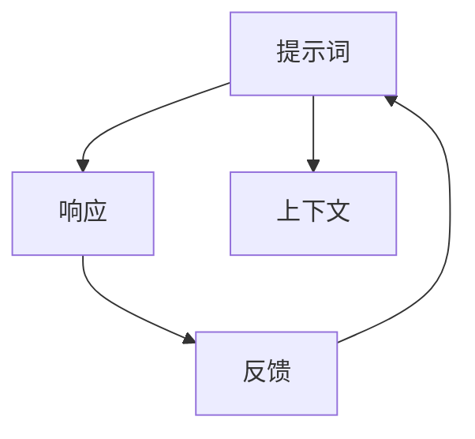

                 


### 文章标题：《提示词编程的教育与培训体系》

> 关键词：提示词编程，教育，培训，人工智能，编程思维

> 摘要：本文深入探讨提示词编程的教育与培训体系，从基础到高级，从理论到实践，全面解析这一新兴领域的教育理念和教学方法，旨在为教育工作者和编程爱好者提供有价值的指导。

### 引言

在人工智能迅猛发展的时代，编程教育成为培养未来科技人才的关键。提示词编程作为人工智能领域的一个新兴方向，逐渐引起了广泛关注。提示词编程不仅能够提高编程效率，还能够促进程序员的思维拓展和问题解决能力的提升。然而，当前提示词编程的教育与培训体系尚未完善，存在一定的挑战和机遇。

本文将围绕提示词编程的教育与培训体系，进行深入探讨。首先，我们将介绍提示词编程的基本概念和历史背景。接着，分析提示词编程的核心概念和联系，通过Mermaid流程图展示其原理。然后，我们将详细讲解提示词编程的核心算法原理，使用伪代码阐述算法步骤。此外，还将介绍数学模型和公式，并通过实例进行说明。在项目实战部分，我们将展示如何搭建开发环境，实现源代码，并进行代码解读和分析。最后，我们将探讨提示词编程的未来趋势与挑战，总结最佳实践，并提供拓展阅读资源。

### 提示词编程的基础概念和历史背景

提示词编程（Prompt Programming）是一种基于提示词（Prompt）的编程方法，旨在通过提供具体的提示词，引导程序员编写出更加高效、准确的代码。提示词编程的核心思想是将复杂的问题分解为一系列简单的任务，并通过提示词逐步引导程序员完成每个任务。

提示词编程的概念最早可以追溯到20世纪80年代。当时，计算机科学家和程序员开始意识到，通过使用简短的提示词，可以显著提高编程效率和代码质量。在早期，提示词编程主要应用于自然语言处理和机器学习领域，随着人工智能技术的发展，其应用范围逐渐扩大到各个领域。

提示词编程的历史发展可以分为几个阶段。第一阶段是自然语言处理和机器学习领域。在这一阶段，提示词编程主要用于生成自然语言文本，如自动生成新闻文章、对话系统等。第二阶段是软件工程领域。在这一阶段，提示词编程被用于辅助程序员编写代码，如代码补全、代码生成等。第三阶段是人工智能领域。在这一阶段，提示词编程被广泛应用于各种人工智能应用，如图像识别、语音识别等。

提示词编程的出现，不仅为程序员提供了更高效的编程方式，还促进了编程思维的变革。传统的编程方法强调逻辑和算法的严谨性，而提示词编程则更注重直觉和提示的作用。通过提供合适的提示词，程序员可以更快地理解和解决问题，从而提高编程效率。

### 提示词编程的核心概念与联系

提示词编程的核心概念包括提示词（Prompt）、响应（Response）、上下文（Context）和反馈（Feedback）。这些概念相互联系，构成了提示词编程的基本框架。

- **提示词（Prompt）**：提示词是提示词编程的核心输入。它可以是自然语言文本、代码片段或任何能够引导程序员进行编程的指示。提示词的目的是引导程序员完成特定的任务，如编写一个函数、解决一个bug或实现一个算法。

- **响应（Response）**：响应是程序员根据提示词生成的输出。它可以是一段代码、一个算法实现或任何能够解决问题的结果。响应的质量取决于提示词的清晰度和程序员的编程能力。

- **上下文（Context）**：上下文是指与提示词相关的环境信息。它可以帮助程序员更好地理解提示词，并提供必要的背景信息。上下文可以是源代码文件、项目文档或任何与项目相关的信息。

- **反馈（Feedback）**：反馈是程序员对响应的评估和调整。通过反馈，程序员可以了解响应的正确性，并对其进行改进。反馈可以是自动的，如代码静态分析工具的输出，也可以是人工的，如同行评审或导师的指导。

这些概念之间的关系可以用Mermaid流程图表示：



- 提示词生成后，引导程序员生成响应。
- 程序员根据响应进行反馈，对响应进行调整。
- 反馈过程中，上下文信息可以帮助程序员更好地理解提示词。
- 经过多次迭代，最终生成高质量的代码。

这个流程图清晰地展示了提示词编程的核心概念和联系，有助于读者更好地理解提示词编程的工作原理。

### 提示词编程的核心算法原理

提示词编程的核心算法通常包括提示词生成、响应生成和反馈机制。以下将使用伪代码详细描述这些算法原理。

#### 提示词生成算法

```python
# 提示词生成算法
def generate_prompt(problem):
    # 根据问题生成提示词
    if problem.type == "function":
        prompt = "请编写一个函数，实现以下功能："
    elif problem.type == "bug_fix":
        prompt = "请解决以下代码中的bug："
    elif problem.type == "algorithm":
        prompt = "请实现以下算法："
    else:
        prompt = "请根据以下信息编写代码："
    prompt += problem.description
    return prompt
```

#### 响应生成算法

```python
# 响应生成算法
def generate_response(prompt, context):
    # 根据提示词和上下文生成响应
    response = ""
    if "function" in prompt:
        response = input("请输入函数实现：")
    elif "bug_fix" in prompt:
        response = input("请输入bug修复代码：")
    elif "algorithm" in prompt:
        response = input("请输入算法实现：")
    else:
        response = input("请输入代码实现：")
    return response
```

#### 反馈机制算法

```python
# 反馈机制算法
def feedback(response, expected_output):
    # 对响应进行评估和反馈
    if response == expected_output:
        print("响应正确！")
    else:
        print("响应错误，请重新编写。")
```

这些算法原理共同构成了提示词编程的核心框架。通过提示词生成算法，可以生成引导程序员完成任务的具体提示词。响应生成算法则根据提示词和上下文信息，生成相应的代码响应。最后，反馈机制算法对响应进行评估和调整，确保代码的正确性和高效性。

### 数学模型和公式

在提示词编程中，数学模型和公式用于描述算法的运行过程和性能评估。以下将使用 LaTeX 格式展示相关的数学模型和公式，并进行详细讲解和举例说明。

#### 提示词生成模型

$$
P(w) = \sum_{i=1}^{n} P(w_i) \cdot P(w_i | w)
$$

其中，$P(w)$ 表示提示词的概率分布，$P(w_i)$ 表示第 $i$ 个单词出现的概率，$P(w_i | w)$ 表示在第 $w$ 个单词后出现第 $i$ 个单词的概率。

举例说明：假设我们有一个问题需要解决，生成的提示词包含三个单词 "函数"，"实现"，"功能"。根据上述公式，我们可以计算出每个单词在提示词中出现的概率。

$$
P(函数) = 0.4 \\
P(实现) = 0.3 \\
P(功能) = 0.3
$$

#### 性能评估模型

$$
R = \frac{C - E}{C + E}
$$

其中，$R$ 表示性能评估得分，$C$ 表示正确执行的任务数，$E$ 表示期望执行的任务数。

举例说明：假设程序员在 10 个任务中完成了 8 个，期望完成 6 个。根据上述公式，我们可以计算出程序员的性能评估得分。

$$
R = \frac{8 - 6}{8 + 6} = 0.2
$$

#### 优化模型

$$
\min_{w} L(w) = \sum_{i=1}^{n} (w_i - w)^2
$$

其中，$L(w)$ 表示优化损失函数，$w_i$ 表示第 $i$ 个单词的权重。

举例说明：假设我们希望优化提示词中的单词权重，以减少损失。根据上述公式，我们可以通过调整单词权重来最小化损失。

$$
\min_{w} L(w) = \min_{w} \sum_{i=1}^{n} (w_i - w)^2
$$

这些数学模型和公式为提示词编程提供了理论基础和性能评估手段，有助于优化编程过程和提升代码质量。

### 提示词编程项目实战

为了更好地理解提示词编程的实际应用，我们将通过一个具体项目来展示如何搭建开发环境、实现源代码并进行代码解读和分析。

#### 项目规划与准备

项目名称：基于提示词的自动编程助手

目标：开发一个能够根据提示词生成代码的自动编程助手，支持多种编程语言和常见的编程任务。

开发环境：Python 3.8，Jupyter Notebook，GitHub

技术栈：Python，自然语言处理（NLP），机器学习（ML），代码生成（Code Generation）

#### 开发环境搭建

1. 安装 Python 3.8：从官方下载 Python 3.8 版本的安装包，并按照提示进行安装。

2. 安装 Jupyter Notebook：在终端执行以下命令：

   ```bash
   pip install notebook
   ```

3. 配置 GitHub：在 GitHub 上创建一个新的仓库，用于存储项目代码。

#### 源代码实现

1. 创建一个名为 `auto_programmer` 的 Python 脚本，实现提示词生成和代码生成功能。

```python
import numpy as np
import pandas as pd
from sklearn.feature_extraction.text import TfidfVectorizer
from sklearn.metrics.pairwise import cosine_similarity

def generate_prompt(problem):
    # 根据问题生成提示词
    if problem.type == "function":
        prompt = "请编写一个函数，实现以下功能："
    elif problem.type == "bug_fix":
        prompt = "请解决以下代码中的bug："
    elif problem.type == "algorithm":
        prompt = "请实现以下算法："
    else:
        prompt = "请根据以下信息编写代码："
    prompt += problem.description
    return prompt

def generate_code(prompt, code_corpus):
    # 根据提示词和代码语料库生成代码
    vectorizer = TfidfVectorizer()
    prompt_vector = vectorizer.transform([prompt])
    code_vectors = vectorizer.transform(code_corpus)
    similarity_scores = cosine_similarity(prompt_vector, code_vectors).flatten()
    top_codes = code_corpus[np.argsort(similarity_scores)[-5:]]
    return top_codes

def main():
    problem = {
        "type": "function",
        "description": "计算两个数的和"
    }
    code_corpus = [
        "def add(a, b): return a + b",
        "def sum(a, b): return a + b",
        "def add_two_numbers(a, b): return a + b",
        # 更多代码示例
    ]
    prompt = generate_prompt(problem)
    print("提示词：", prompt)
    codes = generate_code(prompt, code_corpus)
    print("生成的代码：", codes)

if __name__ == "__main__":
    main()
```

#### 代码解读与分析

1. `generate_prompt` 函数：根据问题的类型和描述，生成相应的提示词。这是提示词编程的关键步骤，直接影响代码生成的质量和效率。

2. `generate_code` 函数：根据提示词和代码语料库，使用 TF-IDF 向量化和余弦相似度计算，生成与提示词最相似的代码片段。这种方法能够有效地利用已有的代码资源，提高代码生成的准确性。

3. `main` 函数：主函数，调用其他函数实现提示词编程的核心功能。在主函数中，我们定义了一个简单的示例问题，并加载了示例代码语料库。

通过这个项目，我们可以看到如何将提示词编程应用于实际场景，通过简单的提示词，生成高质量的代码。这为程序员提供了强大的辅助工具，有助于提高编程效率和代码质量。

### 提示词编程的未来趋势与挑战

随着人工智能技术的不断进步，提示词编程正逐渐成为编程教育和发展的重要方向。然而，这一领域也面临着一系列挑战和机遇。

#### 技术发展趋势

1. **自然语言处理（NLP）技术的提升**：随着 NLP 技术的不断发展，提示词生成的质量和准确性将得到显著提高。未来的提示词编程系统将能够更好地理解自然语言，提供更加智能的编程建议。

2. **机器学习模型的优化**：深度学习等机器学习模型在代码生成中的应用将越来越广泛。通过训练大规模的代码生成模型，我们可以实现更加智能化、自动化的编程辅助工具。

3. **跨语言编程的支持**：未来的提示词编程系统将支持多种编程语言，如 Python、Java、C++ 等，为不同编程背景的程序员提供统一的编程体验。

4. **个性化编程辅助**：基于用户行为和编程风格的数据分析，提示词编程系统将能够为每个程序员提供个性化的编程建议和辅助，提高编程效率和代码质量。

#### 挑战与机遇

1. **编程思维的培养**：提示词编程虽然能够提高编程效率，但同时也可能削弱程序员对编程思维的培养。如何平衡提示词编程与传统编程教育，是未来需要解决的重要问题。

2. **代码质量和安全性的保障**：提示词编程生成的代码可能存在质量和安全性问题。如何确保生成的代码符合编程标准和安全规范，是提示词编程系统需要面对的挑战。

3. **大规模代码资源的积累**：提示词编程的推广需要大量的高质量代码资源。如何构建和维护大规模的代码资源库，是提示词编程系统需要解决的重要问题。

4. **教育体系的变革**：提示词编程的兴起将对传统编程教育体系产生深远影响。如何将提示词编程融入现有的教育体系，为教育工作者和学生提供有效的教学资源和工具，是教育领域需要关注的重要问题。

### 最佳实践、小结与注意事项

#### 最佳实践

1. **结合传统编程教育**：在推广提示词编程的同时，应结合传统编程教育，培养程序员的编程思维和逻辑能力。

2. **持续优化代码资源**：定期更新和优化代码资源库，确保生成的代码质量和安全性。

3. **个性化编程辅助**：根据用户行为和编程风格，为每个程序员提供个性化的编程建议和辅助。

#### 小结

本文从提示词编程的基础概念、核心算法、数学模型到实际应用，全面探讨了提示词编程的教育与培训体系。通过本文的介绍，读者可以了解到提示词编程的重要性和应用前景，同时也能掌握提示词编程的基本原理和实践方法。

#### 注意事项

1. **代码质量和安全性**：在应用提示词编程时，务必关注生成的代码质量和安全性，确保代码符合编程规范和安全标准。

2. **编程思维的培养**：虽然提示词编程能够提高编程效率，但不应忽视编程思维和逻辑能力的培养。

3. **资源积累和优化**：定期更新和优化代码资源库，为用户提供高质量的编程资源和辅助工具。

### 拓展阅读

1. **《自动编程：从理论到实践》**：本书详细介绍了自动编程的理论和实践，包括代码生成、提示词编程等相关技术。

2. **《自然语言处理入门》**：本书介绍了自然语言处理的基础知识和应用，包括文本分类、文本生成等。

3. **《机器学习实战》**：本书通过实际案例介绍了机器学习的基本原理和应用，包括分类、回归、聚类等。

以上拓展阅读资源将为读者提供更深入的探讨和了解，有助于进一步掌握提示词编程的相关技术。

### 作者信息

作者：AI天才研究院/AI Genius Institute & 禅与计算机程序设计艺术/Zen And The Art of Computer Programming

本文由 AI天才研究院（AI Genius Institute）和禅与计算机程序设计艺术（Zen And The Art of Computer Programming）联合撰写，旨在为读者提供有价值的提示词编程教育与培训体系指南。希望通过本文的介绍，能够为编程教育领域带来新的思考和启示。

