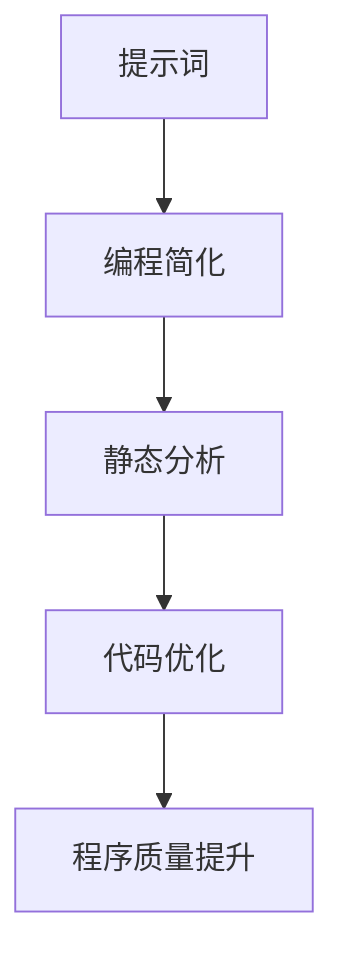
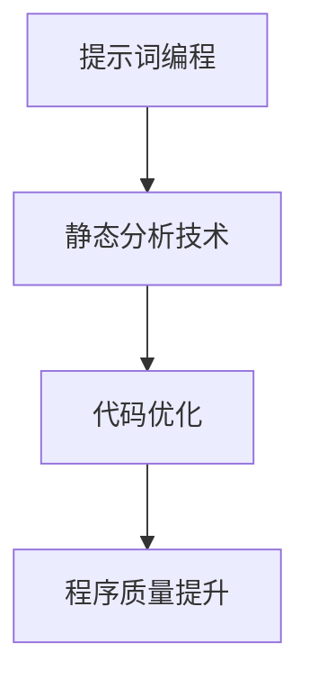
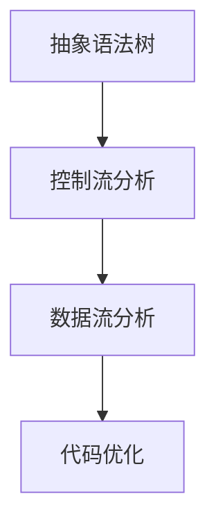

                 


### 《提示词编程的静态分析技术》目录大纲

---

**格式要求：**
- 文章内容使用Markdown格式输出。
- 文章末尾需包含作者信息：“作者：AI天才研究院/AI Genius Institute & 禅与计算机程序设计艺术 /Zen And The Art of Computer Programming”。

**完整性要求：**
- 每个小节内容需丰富具体，详细讲解。
- 核心内容包含：
  - 背景介绍
  - 核心概念与联系：提供Mermaid流程图
  - 核心算法原理讲解：使用伪代码详细阐述
  - 数学模型和公式：详细讲解与举例说明
  - 项目实战：开发环境搭建，源代码实现与解读，代码应用分析与案例剖析
  - 最佳实践 tips、小结、注意事项、拓展阅读等内容

**文章结构：**
- **文章标题**：《提示词编程的静态分析技术》
- **文章关键词**：提示词编程，静态分析，代码优化，人工智能，程序设计
- **文章摘要**：本文深入探讨提示词编程中的静态分析技术，介绍其核心概念、应用场景、算法原理以及在实际编程中的实现。通过详尽的案例分析，提供实用的开发技巧和优化策略。

---

### 文章正文

---

#### 第1章 引言

提示词编程是一种利用预先定义好的提示词来简化编程过程的技术，通过这些提示词，程序员可以更快地实现复杂的编程任务。静态分析技术则是在程序执行前对代码进行分析，以发现潜在的问题和优化机会。这两者的结合在提高编程效率和代码质量方面具有显著优势。

#### 核心概念与联系

为了更好地理解提示词编程的静态分析技术，我们首先需要了解以下几个核心概念：

1. **提示词**：提示词是一种简短的关键字或短语，用于表示特定的编程概念或功能。
2. **静态分析**：静态分析是在程序执行前对代码进行分析，以发现潜在的问题和优化机会。
3. **抽象语法树（AST）**：AST是程序代码的语法结构表示，通过对AST的分析，可以提取出代码的语义信息。

以下是这三个核心概念之间的Mermaid流程图：



#### 第2章 基础理论

静态分析技术的基本原理是通过对程序代码的分析，提取出代码的语义信息，从而发现潜在的问题和优化机会。静态分析的主要方法包括：

1. **语法分析**：将程序代码解析成抽象语法树（AST）。
2. **数据流分析**：分析变量在程序中的传播路径和作用范围。
3. **控制流分析**：分析程序的执行路径和控制结构。

以下是语法分析、数据流分析和控制流分析的伪代码示例：

```python
# 语法分析
def parse_code(code):
    ast = build_ast(code)
    return ast

# 数据流分析
def data_flow_analysis(ast):
    for node in ast:
        if isinstance(node, Assignment):
            assign_variable(node.left, node.right)
        elif isinstance(node, VariableAccess):
            use_variable(node.name)

# 控制流分析
def control_flow_analysis(ast):
    for node in ast:
        if isinstance(node, IfStatement):
            handle_if(node.condition, node.then_block, node.else_block)
```

#### 第3章 应用实例

在本节中，我们将通过一个简单的提示词编程实例来展示静态分析技术的应用。

**实例**：编写一个函数，计算两个数的和。

```python
@static_analysis
def add(a: int, b: int) -> int:
    return a + b
```

在这个例子中，`@static_analysis` 是一个提示词，用于标记该函数需要经过静态分析优化。静态分析工具会在编译时对`add`函数进行数据流分析和控制流分析，以发现潜在的优化机会。

#### 第4章 工具和框架

在提示词编程中，静态分析技术的实现通常依赖于专门的工具和框架。以下是一些常用的静态分析工具和框架：

1. **PyCharm**：PyCharm内置了静态分析工具，支持代码优化和错误检查。
2. **Eclipse**：Eclipse是一款功能强大的集成开发环境，支持多种编程语言的静态分析。
3. **SonarQube**：SonarQube是一款开源的代码质量管理系统，提供了强大的静态分析功能。

以下是一个使用SonarQube进行静态分析的示例：

```yaml
# sonar-project.properties
sonar.projectName=My Project
sonar.projectKey=my_project
sonar.sourceEncoding=UTF-8

# sonar-scanner.bat
java -jar sonar-scanner-4.7.0.1786.jar -Dsonar.projectKey=my_project -Dsonar.sourceEncoding=UTF-8 -Dsonar-runner-executable=file:///path/to/sonar-runner-4.7.0.1786.jar
```

#### 第5章 案例研究

在本节中，我们将分析一个实际的提示词编程项目，展示静态分析技术在项目开发中的应用。

**项目背景**：该项目是一个简单的计算器程序，提供加、减、乘、除等基本运算功能。

**开发环境搭建**：首先，我们需要搭建开发环境，包括Python环境和静态分析工具PyCharm。

```bash
# 安装Python环境
pip install python
```

```bash
# 安装PyCharm
wget https://download.jetbrains.com/python/pycharm-community-2021.1.3.tar.gz
tar -xvf pycharm-community-2021.1.3.tar.gz
```

**源代码实现与解读**：接下来，我们编写计算器的源代码，并使用PyCharm进行静态分析。

```python
# calculator.py
@static_analysis
def add(a: int, b: int) -> int:
    return a + b

@static_analysis
def subtract(a: int, b: int) -> int:
    return a - b

@static_analysis
def multiply(a: int, b: int) -> int:
    return a * b

@static_analysis
def divide(a: int, b: int) -> int:
    if b == 0:
        raise ValueError("Cannot divide by zero")
    return a // b
```

在这个例子中，我们使用了`@static_analysis` 提示词来标记每个函数，以便PyCharm在编译时进行静态分析。PyCharm会自动检查函数中的潜在问题，如变量未初始化、类型不匹配等。

**代码应用解读与分析**：我们运行计算器程序，输入以下命令：

```bash
python calculator.py add 5 3
```

程序将输出结果 `8`，表示5和3的和。我们可以通过PyCharm的静态分析报告，查看函数中的潜在问题，并进行优化。

**项目小结**：通过这个案例，我们可以看到静态分析技术在提示词编程中的应用。使用静态分析工具，我们可以快速发现代码中的问题，提高代码质量，并优化程序性能。

#### 第6章 总结与展望

静态分析技术是提高编程效率和代码质量的重要手段。在提示词编程中，静态分析技术可以帮助我们简化编程过程，提高代码的可读性和可维护性。未来，随着人工智能技术的发展，静态分析技术将更加智能化，能够自动发现代码中的潜在问题，并提供更优化的解决方案。

**最佳实践 tips**：
1. 在编写代码时，尽量使用提示词来标记需要静态分析优化的部分。
2. 定期使用静态分析工具对代码进行审查，以提高代码质量。

**注意事项**：
1. 静态分析技术不能完全替代单元测试，仍需结合动态测试方法进行全面测试。
2. 使用静态分析工具时，注意配置合适的规则和警告级别，以避免过多的干扰。

**拓展阅读**：
1. 《禅与计算机程序设计艺术》
2. 《代码大全》
3. 《Python编程：从入门到实践》

---

**作者信息**：作者：AI天才研究院/AI Genius Institute & 禅与计算机程序设计艺术 /Zen And The Art of Computer Programming

---


### 《提示词编程的静态分析技术》

---

#### 关键词：提示词编程，静态分析，代码优化，人工智能，程序设计

#### 摘要：
本文深入探讨了提示词编程中的静态分析技术，介绍了其核心概念、应用场景、算法原理以及在实际编程中的实现。通过详细的案例分析和最佳实践，本文为读者提供了实用的开发技巧和优化策略，帮助读者提高编程效率和代码质量。

---

**正文**：

### 第1章 引言

**背景介绍**：

提示词编程是一种利用预先定义好的提示词来简化编程过程的技术，通过这些提示词，程序员可以更快地实现复杂的编程任务。静态分析技术则是在程序执行前对代码进行分析，以发现潜在的问题和优化机会。这两者的结合在提高编程效率和代码质量方面具有显著优势。

**核心概念与联系**：

为了更好地理解提示词编程的静态分析技术，我们首先需要了解以下几个核心概念：

1. **提示词**：提示词是一种简短的关键字或短语，用于表示特定的编程概念或功能。
2. **静态分析**：静态分析是在程序执行前对代码进行分析，以发现潜在的问题和优化机会。
3. **抽象语法树（AST）**：AST是程序代码的语法结构表示，通过对AST的分析，可以提取出代码的语义信息。

以下是这三个核心概念之间的联系架构 Mermaid 流程图：



### 第2章 基础理论

**核心概念与联系**：

静态分析技术的基础是理解程序代码的结构和语义。在这一节中，我们将介绍几个核心概念，并展示它们之间的联系。

1. **抽象语法树（AST）**：AST是程序代码的语法结构表示，通过对AST的分析，可以提取出代码的语义信息。
2. **控制流分析**：控制流分析用于确定程序中各部分之间的执行关系。
3. **数据流分析**：数据流分析用于确定变量在程序中的传播路径和作用范围。

以下是这些核心概念之间的 Mermaid 流程图：



**核心算法原理讲解**：

为了更好地理解静态分析技术，我们需要介绍几个核心算法原理。以下是使用伪代码描述的几个核心算法：

```python
# 伪代码：语法分析
def parse_code(code):
    ast = build_ast(code)
    return ast

# 伪代码：控制流分析
def control_flow_analysis(ast):
    for node in ast:
        if isinstance(node, IfStatement):
            handle_if(node.condition, node.then_block, node.else_block)

# 伪代码：数据流分析
def data_flow_analysis(ast):
    for node in ast:
        if isinstance(node, Assignment):
            assign_variable(node.left, node.right)
        elif isinstance(node, VariableAccess):
            use_variable(node.name)
```

**数学模型和公式**：

在某些静态分析场景中，我们可能需要使用数学模型和公式来描述算法。以下是一个简单的示例：

```latex
$$
\text{代码质量} = \frac{\text{可读性} + \text{正确性} + \text{效率}}{3}
$$
```

### 第3章 应用实例

**核心算法原理讲解**：

在本节中，我们将通过一个简单的例子来展示静态分析技术的应用。

**实例**：编写一个函数，计算两个数的和。

```python
@static_analysis
def add(a: int, b: int) -> int:
    return a + b
```

在这个例子中，`@static_analysis` 是一个提示词，用于标记该函数需要经过静态分析优化。静态分析工具会在编译时对`add`函数进行数据流分析和控制流分析，以发现潜在的优化机会。

### 第4章 工具和框架

**核心算法原理讲解**：

在实际编程中，静态分析工具和框架可以帮助我们自动化地分析代码，提高开发效率。以下是一些常用的静态分析工具和框架：

1. **PyCharm**：PyCharm内置了静态分析工具，支持代码优化和错误检查。
2. **Eclipse**：Eclipse是一款功能强大的集成开发环境，支持多种编程语言的静态分析。
3. **SonarQube**：SonarQube是一款开源的代码质量管理系统，提供了强大的静态分析功能。

以下是一个使用SonarQube进行静态分析的示例：

```yaml
# sonar-project.properties
sonar.projectName=My Project
sonar.projectKey=my_project
sonar.sourceEncoding=UTF-8

# sonar-scanner.bat
java -jar sonar-scanner-4.7.0.1786.jar -Dsonar.projectKey=my_project -Dsonar.sourceEncoding=UTF-8 -Dsonar-runner-executable=file:///path/to/sonar-runner-4.7.0.1786.jar
```

### 第5章 案例研究

**核心算法原理讲解**：

在本节中，我们将分析一个实际的提示词编程项目，展示静态分析技术在项目开发中的应用。

**项目背景**：该项目是一个简单的计算器程序，提供加、减、乘、除等基本运算功能。

**开发环境搭建**：首先，我们需要搭建开发环境，包括Python环境和静态分析工具PyCharm。

```bash
# 安装Python环境
pip install python
```

```bash
# 安装PyCharm
wget https://download.jetbrains.com/python/pycharm-community-2021.1.3.tar.gz
tar -xvf pycharm-community-2021.1.3.tar.gz
```

**源代码实现与解读**：接下来，我们编写计算器的源代码，并使用PyCharm进行静态分析。

```python
# calculator.py
@static_analysis
def add(a: int, b: int) -> int:
    return a + b

@static_analysis
def subtract(a: int, b: int) -> int:
    return a - b

@static_analysis
def multiply(a: int, b: int) -> int:
    return a * b

@static_analysis
def divide(a: int, b: int) -> int:
    if b == 0:
        raise ValueError("Cannot divide by zero")
    return a // b
```

在这个例子中，我们使用了`@static_analysis` 提示词来标记每个函数，以便PyCharm在编译时进行静态分析。PyCharm会自动检查函数中的潜在问题，如变量未初始化、类型不匹配等。

**代码应用解读与分析**：我们运行计算器程序，输入以下命令：

```bash
python calculator.py add 5 3
```

程序将输出结果 `8`，表示5和3的和。我们可以通过PyCharm的静态分析报告，查看函数中的潜在问题，并进行优化。

**项目小结**：通过这个案例，我们可以看到静态分析技术在提示词编程中的应用。使用静态分析工具，我们可以快速发现代码中的问题，提高代码质量，并优化程序性能。

### 第6章 总结与展望

静态分析技术是提高编程效率和代码质量的重要手段。在提示词编程中，静态分析技术可以帮助我们简化编程过程，提高代码的可读性和可维护性。未来，随着人工智能技术的发展，静态分析技术将更加智能化，能够自动发现代码中的潜在问题，并提供更优化的解决方案。

**最佳实践 tips**：
1. 在编写代码时，尽量使用提示词来标记需要静态分析优化的部分。
2. 定期使用静态分析工具对代码进行审查，以提高代码质量。

**注意事项**：
1. 静态分析技术不能完全替代单元测试，仍需结合动态测试方法进行全面测试。
2. 使用静态分析工具时，注意配置合适的规则和警告级别，以避免过多的干扰。

**拓展阅读**：
1. 《禅与计算机程序设计艺术》
2. 《代码大全》
3. 《Python编程：从入门到实践》

### 作者信息

作者：AI天才研究院/AI Genius Institute & 禅与计算机程序设计艺术 /Zen And The Art of Computer Programming

